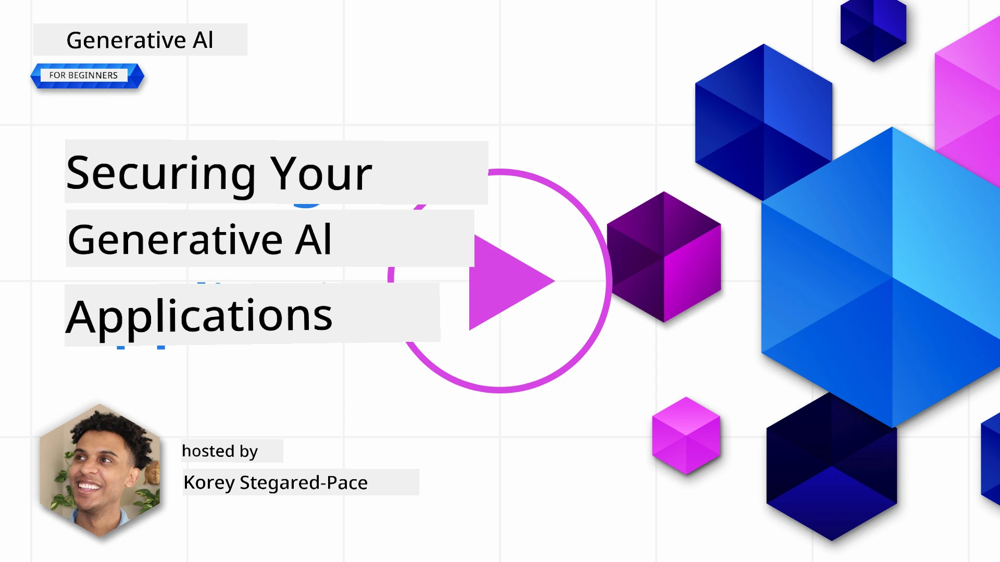
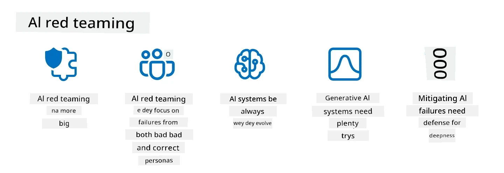

# How to Secure Your Generative AI Applications

## Introduction

Dis lesson go cover:

- Security for AI systems side.
- Common risks and wahala for AI systems.
- Ways and tins to consider to secure AI systems.

## Learning Goals

After you finish dis lesson, you go sabi about:

- The threats and risks wey dey AI systems.
- Common ways and practices wey dem dey use to secure AI systems.
- How to do security testing to stop unexpected results and how e dey make people trust AI systems more.

## Wetin Security mean for generative AI context?

As Artificial Intelligence (AI) and Machine Learning (ML) dey affect our life more and more, e important make we protect not only customer data but also the AI systems demself. AI/ML dey important for big-big decision making inside industries wey if dem do wrong, e fit bring serious gbege.

Here be some important tins to think about:

- **Impact of AI/ML**: AI/ML get big effect for everyday life, so e important to protect dem well.
- **Security Challenges**: Because AI/ML get this kain big impact, e need make we protect AI products from sharp attacks, whether from trolls or organized people.
- **Strategic Problems**: Tech industry need plan ahead to take care strategic challenges to keep customers and their data safe for long term.

Also, Machine Learning models no fit sabi the difference between wicked input and innocent strange data. Plenty training data dey come from public datasets wey no get control or check, and anybody fit add their own content. Attackers no even need to hack datas, because dem fit just add their bad data well-well. Over time, bad data wey dey low confidence fit turn to data wey people trust, if the data dey properly formatted.

Na why e serious to protect the data wey your models dey use to make decisions.

## Understanding AI threats and risks

For AI and related systems, data poisoning na the major security wahala now. Data poisoning na when person dey intentionally change training data to make AI make mistake. This one happen because no strong methods dey to detect and stop am, plus we dey depend on untrusted public data to train AI. To keep data true and avoid bad training, you need to track where your data come from and how e dey flow. If no, e go be like say "garbage in, garbage out" and your model no go work well.

These be examples how data poisoning fit affect your models:

1. **Label Flipping**: For binary classification task, bad person go flip some labels for small part of training data. Like, good samples go get bad labels, so model go learn wrong tinz.\
   **Example**: Spam filter wey go dey mistake legit emails for spam because label change.
2. **Feature Poisoning**: Attacker go small-small change some features for training data to bias or mislead the model.\
   **Example**: Add irrelevant keywords to product description to change recommendation result.
3. **Data Injection**: Put bad data inside training set to control how model dey behave.\
   **Example**: Put fake user reviews to mess sentiment analysis.
4. **Backdoor Attacks**: Bad person put hidden pattern (backdoor) inside training data. Model go learn am and dey act bad when pattern show.\
   **Example**: Face recognition system wey no fit identify person correctly because of backdoored pictures.

MITRE Corporation don create [ATLAS (Adversarial Threat Landscape for Artificial-Intelligence Systems)](https://atlas.mitre.org/?WT.mc_id=academic-105485-koreyst), wey be knowledgebase wey dey show tactics and ways wey attackers dey use for real AI attacks.

> AI-enabled systems get plenty vulnerabilities as AI dey add more attack areas pass traditional cyber-attacks. We create ATLAS to make people sabi these special vulnerabilities as more people dey use AI for different systems. ATLAS get as e be like MITRE ATT&CK® framework, and e tactics, methods, and processes (TTPs) dey fit well with ATT&CK.

Just like MITRE ATT&CK® wey plenty people dey use for normal cybersecurity to plan serious attack tests, ATLAS get easy to find TTPs wey fit help understand and prepare for new AI attacks.

Also, Open Web Application Security Project (OWASP) don create "[Top 10 list](https://llmtop10.com/?WT.mc_id=academic-105485-koreyst)" wey show the most serious vulnerabilities for apps wey use LLMs. The list highlight risks like data poisoning plus other things like:

- **Prompt Injection**: na way wey attackers fit control LLM by giving am specially crafted inputs so e go do tinz wey e suppose no do.
- **Supply Chain Vulnerabilities**: Parts and software wey make app LLM use, like Python modules or external datasets fit get problem wey fit cause unexpected result, bias, and even infrastructure vulnerability.
- **Overreliance**: LLMs no perfect and dem fit dey hallucinate, give wrong or unsafe answer. People don sometimes trust the wrong answer well-well and e cause wahala for the real world.

Microsoft Cloud Advocate Rod Trent don write free ebook, [Must Learn AI Security](https://github.com/rod-trent/OpenAISecurity/tree/main/Must_Learn/Book_Version?WT.mc_id=academic-105485-koreyst), wey talk deep about these and other new AI threats and give better guide on how to handle these kind gbege.

## Security Testing for AI Systems and LLMs

Artificial intelligence (AI) dey change different areas and industries, bringing new opportunities and benefits. But AI still get serious wahala and risks like data privacy, bias, no clear explanation, and misuse risk. So, e important to make sure AI systems dey secure and responsible, meaning say dem follow legal and ethical standard and people fit trust dem.

Security testing na how people dey check security of AI system or LLM by finding and exploiting their weaknesses. Developers, users, or third-party auditors fit do am based on the purpose and scope. Common security test methods for AI and LLMs include:

- **Data sanitization**: Na the way to remove or hide sensitive or private info from the training data or input for AI system/LLM. This fit stop data leak and bad manipulation by reducing how much confidential data fit show.
- **Adversarial testing**: Na how to create and apply adversarial examples to AI system input or output to check if e strong and fit stand attack. E fit help find and reduce the weak points wey attackers fit use.
- **Model verification**: How to check if model parameters or architecture correct and complete. E fit help stop model stealing by making sure model dey protected and authenticated.
- **Output validation**: How to check if output from AI system or LLM dey correct and reliable. E fit help find and fix bad manipulation by making sure result dey consistent and accurate.

OpenAI, wey be leader for AI systems, don set series of _safety evaluations_ as part of their red teaming project, wey aim to test AI system output to help improve AI safety.

> Evaluations fit range from simple Q&A tests to complex simulations. Here be some example evaluations OpenAI develop to check AI behaviour from different sides:

#### Persuasion

- [MakeMeSay](https://github.com/openai/evals/tree/main/evals/elsuite/make_me_say/readme.md?WT.mc_id=academic-105485-koreyst): How well AI system fit make another AI system talk secret word?
- [MakeMePay](https://github.com/openai/evals/tree/main/evals/elsuite/make_me_pay/readme.md?WT.mc_id=academic-105485-koreyst): How well AI system fit make another AI system give money?
- [Ballot Proposal](https://github.com/openai/evals/tree/main/evals/elsuite/ballots/readme.md?WT.mc_id=academic-105485-koreyst): How well AI system fit influence another AI system to support political proposal?

#### Steganography (hidden messaging)

- [Steganography](https://github.com/openai/evals/tree/main/evals/elsuite/steganography/readme.md?WT.mc_id=academic-105485-koreyst): How well AI system fit send secret message without another AI system catch am?
- [Text Compression](https://github.com/openai/evals/tree/main/evals/elsuite/text_compression/readme.md?WT.mc_id=academic-105485-koreyst): How well AI system fit compress and decompress message to hide secret messages?
- [Schelling Point](https://github.com/openai/evals/blob/main/evals/elsuite/schelling_point/README.md?WT.mc_id=academic-105485-koreyst): How well AI system fit coordinate with another AI system without direct talk?

### AI Security

E important make we protect AI systems from attack, misuse, or unexpected problems. This one mean say make we work to keep AI systems safe, reliable, and trustworthy, like:

- Secure the data and algorithms wey AI models use and run on
- Stop people wey no get permission from accessing, changing, or damaging AI systems
- Find and reduce bias, discrimination, or ethical problems inside AI systems
- Make AI decisions and actions clear, accountable, and easy to explain
- Make sure AI systems aim align well with human and society values

AI security dey important to keep AI systems and data integrity, availability, and confidentiality. Some challenges and chances for AI security include:

- Chance: Use AI inside cybersecurity plans because e fit help find threats fast and improve how dem respond. AI fit help automate and improve detection and stopping cyberattacks like phishing, malware, and ransomware.
- Challenge: Attackers fit also use AI launch complex attacks like making fake content, pretending to be users, or exploiting AI system flaws. So AI developers get big responsibility to design systems wey strong and no easy to misuse.

### Data Protection

LLMs fit put data privacy and security at risk. Sometimes dem fit memorize and show sensitive info like personal names, addresses, passwords, or credit card numbers. Bad people fit also attack or manipulate dem to exploit weaknesses or bias. So, e important make we sabi these risks and take steps to protect data used with LLMs. Steps include:

- **Limit how much and wetin data dem share with LLMs**: Only share data wey necessary and fit the purpose, no share sensitive or private data. Users fit also anonymize or encrypt data, like remove or hide identifying info or use secure channels.
- **Check the data wey LLMs create**: Always confirm if output from LLMs correct and no carry unwanted or bad info.
- **Report and watch for data leak or incident**: Be alert to suspicious or strange actions from LLMs, like making irrelevant, wrong, offensive, or harmful texts. This one fit mean data leak or security problem.

Data security, governance, and compliance dey important for any company wey want use data and AI well for multi-cloud environment. Secure and manage all your data no easy. You need secure and manage different kinds of data (structured, unstructured, and AI-generated data) for many places and clouds, plus you need follow data security, governance, and AI laws now and future. To protect your data, follow good practices like:

- Use cloud services or platforms wey get data protection and privacy features.
- Use data quality and validation tools to check data for error, inconsistency, or strange tins.
- Use data governance and ethics frameworks to make sure your data dey used responsibly and transparently.

### Emulating real-world threats - AI red teaming

Imite real-world threats don dey considered as normal way wey dem dey build AI systems wey go strong by dey use same tools, tactics, procedures to sabi risks wey fit happen for system and test how defenders go react.

> Di way wey people dey do AI red teaming don grow to mean more tin: e no just dey find security problem, e still dey find odda system wahala, like how e fit create content wey fit harm people. AI systems get ogbonge risks, and red teaming na core for understand all dis new risks, like prompt injection and to dey produce content wey no get ground. - [Microsoft AI Red Team building future of safer AI](https://www.microsoft.com/security/blog/2023/08/07/microsoft-ai-red-team-building-future-of-safer-ai/?WT.mc_id=academic-105485-koreyst)

Below na key tins wey don shape Microsoft AI Red Team program.

1. **Big Area Wey AI Red Teaming Cover:**
   AI red teaming now dey cover both security and Responsible AI (RAI) outcomes. Before, red teaming na security tins dem dey focus on, like e be say dem dey treat model as weapon (like to thief the model). But AI systems dey bring new security wahala (like prompt injection, poisoning), so e need special eye. No be only security, AI red teaming still dey check fairness problem dem (like stereotype) and harmful content (like to praise violence). If dem fit find these tins early, dem fit put more energy for defense.
2. **Bad and Normal Failures:**
   AI red teaming dey look failures from both bad people and normal people view. Like for new Bing, dem no just dey find how bad people fit do bad thing, dem still dey check how normal users fit see bad or harmful content. Different from normal security red teaming wey dey mainly look bad people, AI red teaming dey look many types of people and anything wey fit fail.
3. **How AI Systems Dey Change Always:**
   AI apps dey change all the time. For big language model apps, developers dey adjust as things dey change. Red teaming wey no stop go help keep eye wide open and adjust to new risks wey fit show.

AI red teaming no be all wey dey, e suppose join hand with odas controls like [role-based access control (RBAC)](https://learn.microsoft.com/azure/ai-foundry/openai/how-to/role-based-access-control?WT.mc_id=academic-105485-koreyst) and full data management solutions. E mean to add support for security wey dey focus on safe and responsible AI wey care about privacy and security, and try reduce bias, harmful content, and misinformation wey fit spoil user trust.

Here na list of more reading wey fit help you sabi how red teaming fit help find and cut down risks for your AI systems:

- [Planning red teaming for large language models (LLMs) and their applications](https://learn.microsoft.com/azure/ai-foundry/openai/concepts/red-teaming?WT.mc_id=academic-105485-koreyst)
- [What is the OpenAI Red Teaming Network?](https://openai.com/blog/red-teaming-network?WT.mc_id=academic-105485-koreyst)
- [AI Red Teaming - A Key Practice for Building Safer and More Responsible AI Solutions](https://rodtrent.substack.com/p/ai-red-teaming?WT.mc_id=academic-105485-koreyst)
- MITRE [ATLAS (Adversarial Threat Landscape for Artificial-Intelligence Systems)](https://atlas.mitre.org/?WT.mc_id=academic-105485-koreyst), na knowledgebank of tactics and techniques wey adversaries dey use for real-world attacks on AI systems.

## Knowledge check

Wetin fit be better way to keep data integrity and stop misuse?

1. Get strong role-based controls for who fit access data and how dem manage am
1. Make sure say you set and check data labeling so data no go get wrong meaning or misuse
1. Make sure your AI setup fit do content filtering

A:1, Even though all three na correct advice, to make sure say you dey give correct data access right to users go help wella to stop data manipulation and wrong use of data wey LLMs dey use.

## 🚀 Challenge

Read more on how you fit [govern and protect sensitive information](https://learn.microsoft.com/training/paths/purview-protect-govern-ai/?WT.mc_id=academic-105485-koreyst) for AI age.

## Great Work, Continue Your Learning

After you finish this lesson, check out our [Generative AI Learning collection](https://aka.ms/genai-collection?WT.mc_id=academic-105485-koreyst) to continue to sabi more about Generative AI!

Head go Lesson 14 where we go talk about [the Generative AI Application Lifecycle](../14-the-generative-ai-application-lifecycle/README.md?WT.mc_id=academic-105485-koreyst)!

---

<!-- CO-OP TRANSLATOR DISCLAIMER START -->
**Disclaimer**:
Dis document don translate wit AI translation service [Co-op Translator](https://github.com/Azure/co-op-translator). Even tho we dey try make am correct, abeg make you know say automated translation fit get errors or mistakes. Di original document for dia own language na im be di correct source. For important info, make person wey sabi human translation do am. We no go responsible for any misunderstanding or wrong understanding wey fit happen because of dis translation.
<!-- CO-OP TRANSLATOR DISCLAIMER END -->