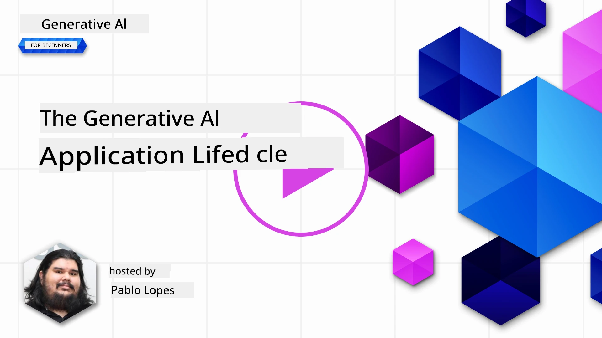
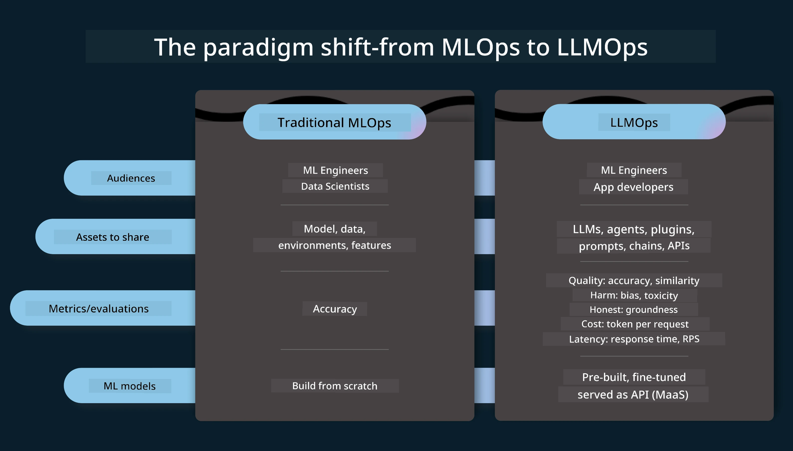
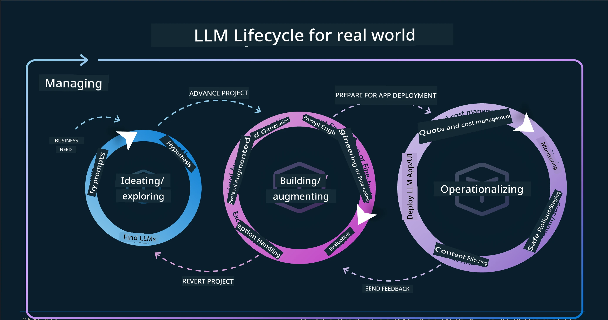
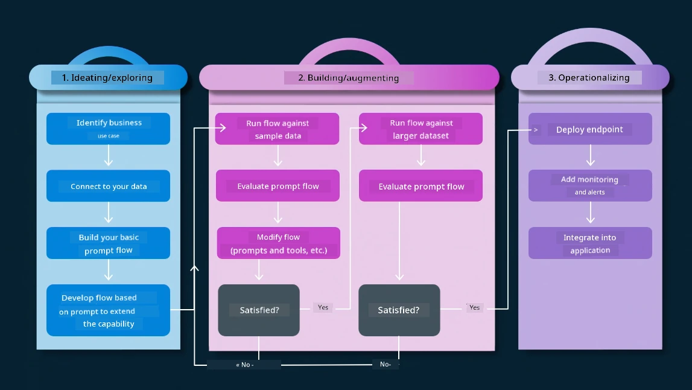
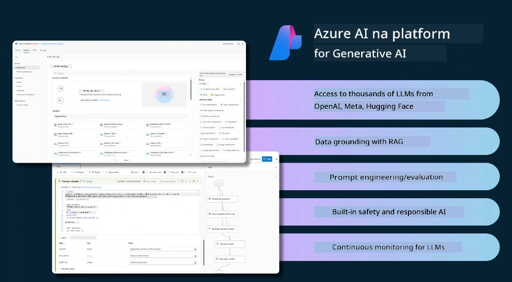
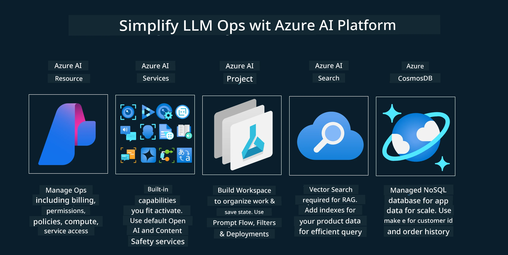
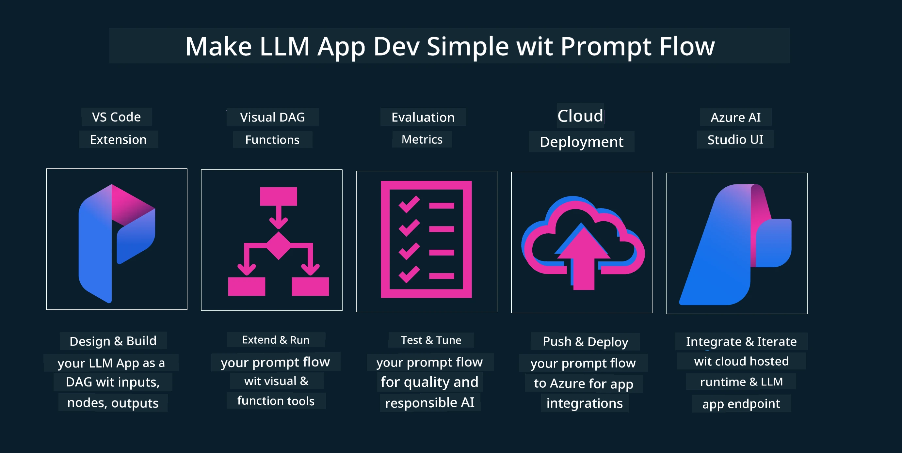

# Di Generative AI Application Lifecycle

One important question for all AI applications na di relevance of AI features, as AI na fast evolving field, to make sure say your application still dey relevant, reliable, and strong, you need to dey monitor, evaluate, and improve am continuously. Na here di generative AI lifecycle come in.

Di generative AI lifecycle na framework wey dey guide you through di stages of developing, deploying, and maintaining one generative AI application. E dey help you define your goals, measure your performance, identify your challenges, and implement your solutions. E still dey help you align your application with di ethical and legal standards of your domain and your stakeholders. If you follow di generative AI lifecycle, you fit make sure say your application dey always deliver value and satisfy your users.

## Introduction

For dis chapter, you go:

- Understand di Paradigm Shift from MLOps to LLMOps
- Di LLM Lifecycle
- Lifecycle Tooling
- Lifecycle Metrification and Evaluation

## Understand di Paradigm Shift from MLOps to LLMOps

LLMs na new tool for di Artificial Intelligence arsenal, dem powerful well well for analysis and generation tasks for applications, but dis power get some consequences for how we dey streamline AI and Classic Machine Learning tasks.

With dis, we need new Paradigm to adapt dis tool dynamically, with di correct incentives. We fit categorize older AI apps as "ML Apps" and newer AI Apps as "GenAI Apps" or just "AI Apps", wey dey reflect di mainstream technology and techniques wey dem dey use for dat time. Dis one dey shift our narrative for plenty ways, look di comparison below.

Notice say for LLMOps, we dey more focus on di App Developers, we dey use integrations as key point, we dey use "Models-as-a-Service" and dey think about di following points for metrics.

- Quality: Response quality
- Harm: Responsible AI
- Honesty: Response groundedness (E make sense? E correct?)
- Cost: Solution Budget
- Latency: Avg. time for token response

## Di LLM Lifecycle

First, to understand di lifecycle and di modifications, make we note di next infographic.

As you fit notice, dis one different from di usual Lifecycles from MLOps. LLMs get plenty new requirements, like Prompting, different techniques to improve quality (Fine-Tuning, RAG, Meta-Prompts), different assessment and responsibility with responsible AI, and last last, new evaluation metrics (Quality, Harm, Honesty, Cost and Latency).

For example, look how we dey ideate. We dey use prompt engineering to experiment with different LLMs to explore possibilities to test if their Hypothesis fit be correct.

Note say dis one no be linear, but na integrated loops, iterative and with one big cycle.

How we fit explore those steps? Make we go into detail how we fit build one lifecycle.

Dis one fit look small complicated, make we focus on di three big steps first.

1. Ideating/Exploring: Exploration, here we fit explore based on our business needs. Prototyping, creating one [PromptFlow](https://microsoft.github.io/promptflow/index.html?WT.mc_id=academic-105485-koreyst) and test if e efficient enough for our Hypothesis.
1. Building/Augmenting: Implementation, now, we go start to evaluate for bigger datasets, implement techniques like Fine-tuning and RAG, to check di robustness of our solution. If e no work, re-implement am, add new steps for our flow or restructure di data, fit help. After testing our flow and our scale, if e work and check our Metrics, e ready for di next step.
1. Operationalizing: Integration, now we dey add Monitoring and Alerts Systems to our system, deployment and application integration to our Application.

Then, we get di big cycle of Management, we dey focus on security, compliance and governance.

Congrats, now your AI App ready to go and operational. For hands-on experience, check di [Contoso Chat Demo.](https://nitya.github.io/contoso-chat/?WT.mc_id=academic-105485-koreys)

Now, which tools we fit use?

## Lifecycle Tooling

For Tooling, Microsoft dey provide di [Azure AI Platform](https://azure.microsoft.com/solutions/ai/?WT.mc_id=academic-105485-koreys) and [PromptFlow](https://microsoft.github.io/promptflow/index.html?WT.mc_id=academic-105485-koreyst) wey dey make your cycle easy to implement and ready to go.

Di [Azure AI Platform](https://azure.microsoft.com/solutions/ai/?WT.mc_id=academic-105485-koreys), allow you to use [AI Studio](https://ai.azure.com/?WT.mc_id=academic-105485-koreys). AI Studio na web portal wey allow you explore models, samples and tools. You fit manage your resources, UI development flows and SDK/CLI options for Code-First development.

Azure AI, allow you to use plenty resources, to manage your operations, services, projects, vector search and databases needs.

Construct, from Proof-of-Concept(POC) reach large scale applications with PromptFlow:

- Design and Build apps from VS Code, with visual and functional tools
- Test and fine-tune your apps for quality AI, with ease.
- Use Azure AI Studio to Integrate and Iterate with cloud, Push and Deploy for quick integration.

## Great! Continue your Learning!

Correct, now learn more about how we dey structure application to use di concepts with di [Contoso Chat App](https://nitya.github.io/contoso-chat/?WT.mc_id=academic-105485-koreyst), to see how Cloud Advocacy dey add those concepts for demonstrations. For more content, check our [Ignite breakout session!
](https://www.youtube.com/watch?v=DdOylyrTOWg)

Now, check Lesson 15, to understand how [Retrieval Augmented Generation and Vector Databases](../15-rag-and-vector-databases/README.md?WT.mc_id=academic-105485-koreyst) dey impact Generative AI and to make more engaging Applications!

---

<!-- CO-OP TRANSLATOR DISCLAIMER START -->
**Disclaimer**:
Dis document don translate wit AI translation service [Co-op Translator](https://github.com/Azure/co-op-translator). Even though we dey try make am correct, abeg sabi say automated translation fit get some mistakes or wrong parts. Di original document wey dey im own language na di correct one. If na serious matter, e better make human professional translate am. We no go take responsibility if person no understand well or if dem misinterpret dis translation.
<!-- CO-OP TRANSLATOR DISCLAIMER END -->