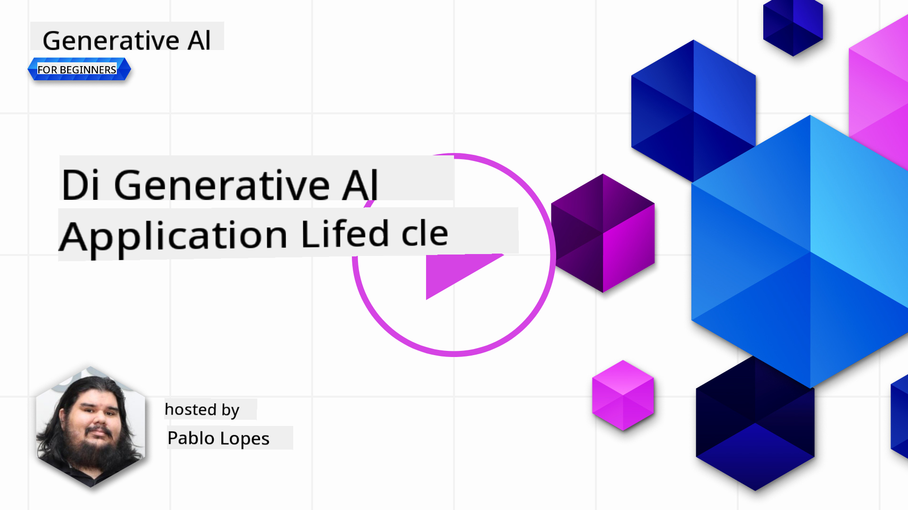
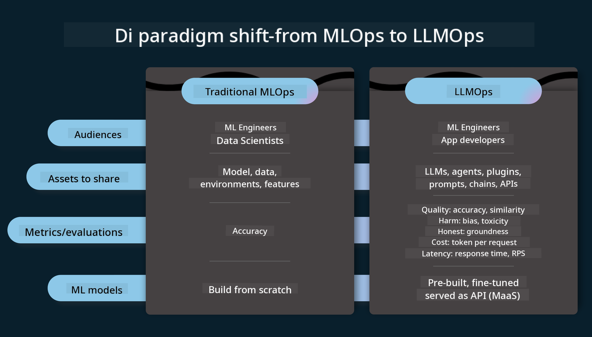
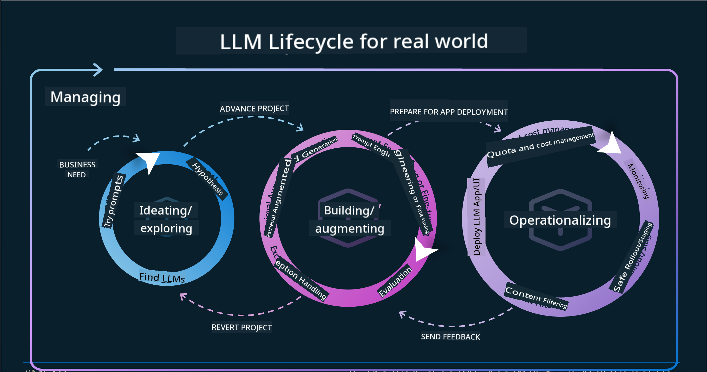
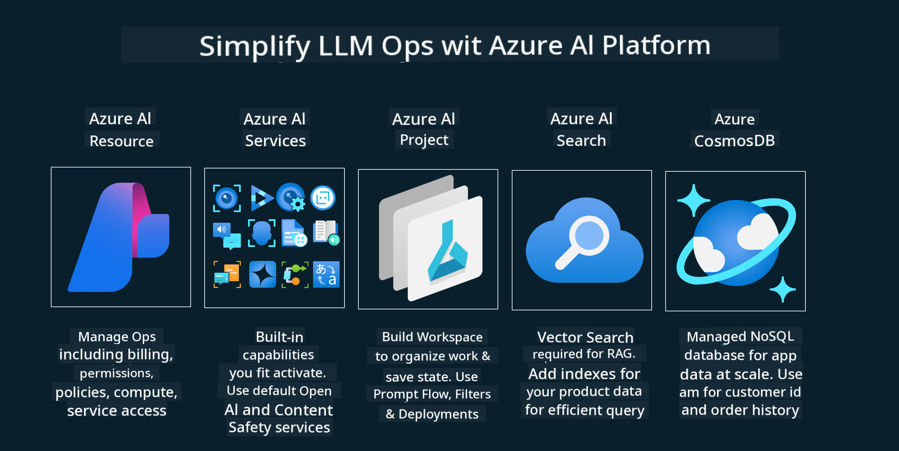

<!--
CO_OP_TRANSLATOR_METADATA:
{
  "original_hash": "b9d32511b27373a1b21b5789d4fda057",
  "translation_date": "2025-11-12T08:54:43+00:00",
  "source_file": "14-the-generative-ai-application-lifecycle/README.md",
  "language_code": "pcm"
}
-->

# The Generative AI Application Lifecycle

Di important question wey dey for all AI apps na how AI features go still dey relevant, as AI dey change fast. To make sure say your app go still dey relevant, reliable, and strong, you go need dey monitor, check, and improve am steady. Na here di generative AI lifecycle go help.

Di generative AI lifecycle na framework wey dey guide you for di steps to develop, deploy, and maintain generative AI app. E go help you set your goals, measure performance, find di wahala, and solve am. E go also help you align your app with di ethical and legal standards for your area and di people wey dey use am. If you follow di generative AI lifecycle, your app go dey deliver value and satisfy your users.

## Introduction

For dis chapter, you go:

- Understand di Paradigm Shift from MLOps to LLMOps
- Di LLM Lifecycle
- Lifecycle Tooling
- Lifecycle Metrification and Evaluation

## Understand di Paradigm Shift from MLOps to LLMOps

LLMs na new tool for Artificial Intelligence, dem dey very strong for analysis and generation tasks for apps. But di power wey dem get dey affect how we dey streamline AI and Classic Machine Learning tasks.

Because of dis, we need new way to adapt dis tool in dynamic way, with correct incentives. We fit call old AI apps "ML Apps" and di new AI Apps "GenAI Apps" or just "AI Apps," wey go show di mainstream technology and techniques wey dem dey use for di time. Dis change dey affect di way we dey look AI apps in many ways. Check di comparison below.

For LLMOps, we dey focus more on di App Developers, using integrations as key point, using "Models-as-a-Service" and thinking about di following metrics:

- Quality: How good di response be
- Harm: Responsible AI
- Honesty: Whether di response make sense or correct
- Cost: Solution Budget
- Latency: Average time for token response

## Di LLM Lifecycle

To understand di lifecycle and di changes, make we look di infographic below.

You go notice say dis one different from di usual Lifecycles for MLOps. LLMs get many new requirements, like Prompting, different techniques to improve quality (Fine-Tuning, RAG, Meta-Prompts), different assessment and responsibility with responsible AI, and new evaluation metrics (Quality, Harm, Honesty, Cost, and Latency).

For example, make we look how we dey ideate. We dey use prompt engineering to test different LLMs to see if di Hypothesis fit correct.

Dis process no be straight line, e dey loop, dey repeat, and e get big cycle wey dey cover everything.

How we fit explore di steps? Make we break am down to understand how we fit build di lifecycle.

E fit look complicated, but make we focus on di three big steps first.

1. Ideating/Exploring: Exploration, na here we go explore based on our business needs. We go prototype, create [PromptFlow](https://microsoft.github.io/promptflow/index.html?WT.mc_id=academic-105485-koreyst) and test if e dey efficient for our Hypothesis.
2. Building/Augmenting: Implementation, na here we go evaluate bigger datasets, use techniques like Fine-tuning and RAG, to check di strength of our solution. If e no work, we go re-implement am, add new steps for di flow or restructure di data. After we test di flow and di scale, if e work and meet di Metrics, e ready for di next step.
3. Operationalizing: Integration, na here we go add Monitoring and Alerts Systems to di system, deploy am and integrate am to di Application.

After dis, we go get di big cycle of Management, wey dey focus on security, compliance, and governance.

Congrats, your AI App don ready to go and dey operational. If you wan try am yourself, check di [Contoso Chat Demo.](https://nitya.github.io/contoso-chat/?WT.mc_id=academic-105485-koreys)

Now, wetin be di tools we fit use?

## Lifecycle Tooling

For Tooling, Microsoft get [Azure AI Platform](https://azure.microsoft.com/solutions/ai/?WT.mc_id=academic-105485-koreys) and [PromptFlow](https://microsoft.github.io/promptflow/index.html?WT.mc_id=academic-105485-koreyst) wey go make di cycle easy to implement and ready to go.

Di [Azure AI Platform](https://azure.microsoft.com/solutions/ai/?WT.mc_id=academic-105485-koreys) allow you use [AI Studio](https://ai.azure.com/?WT.mc_id=academic-105485-koreys). AI Studio na web portal wey allow you explore models, samples, and tools. You fit manage your resources, UI development flows, and SDK/CLI options for Code-First development.

Azure AI dey allow you use plenty resources to manage your operations, services, projects, vector search, and database needs.

You fit build from Proof-of-Concept (POC) to large scale apps with PromptFlow:

- Design and Build apps from VS Code, with visual and functional tools
- Test and fine-tune your apps for quality AI, easily.
- Use Azure AI Studio to Integrate and Iterate with cloud, Push and Deploy for quick integration.

## Great! Continue your Learning!

Nice one, now learn more about how we dey structure app to use di concepts with di [Contoso Chat App](https://nitya.github.io/contoso-chat/?WT.mc_id=academic-105485-koreyst), to see how Cloud Advocacy dey add di concepts for demos. For more content, check our [Ignite breakout session!
](https://www.youtube.com/watch?v=DdOylyrTOWg)

Now, check Lesson 15, to understand how [Retrieval Augmented Generation and Vector Databases](../15-rag-and-vector-databases/README.md?WT.mc_id=academic-105485-koreyst) dey affect Generative AI and how e fit make apps more engaging!

---

<!-- CO-OP TRANSLATOR DISCLAIMER START -->
**Disclaimer**:  
Dis dokyument don use AI translation service [Co-op Translator](https://github.com/Azure/co-op-translator) do di translation. Even as we dey try make am accurate, abeg sabi say automated translations fit get mistake or no dey correct well. Di original dokyument for im native language na di main source wey you go trust. For important information, e better make professional human translation dey use. We no go fit take blame for any misunderstanding or wrong interpretation wey fit happen because you use dis translation.
<!-- CO-OP TRANSLATOR DISCLAIMER END -->