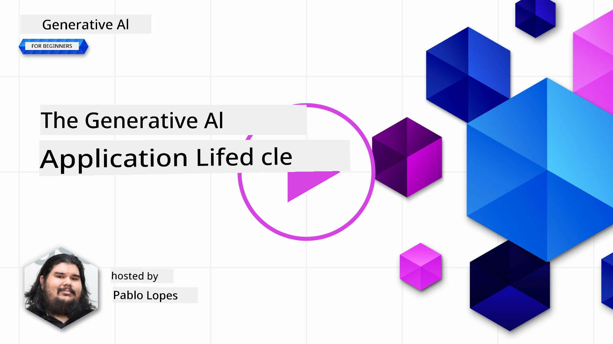
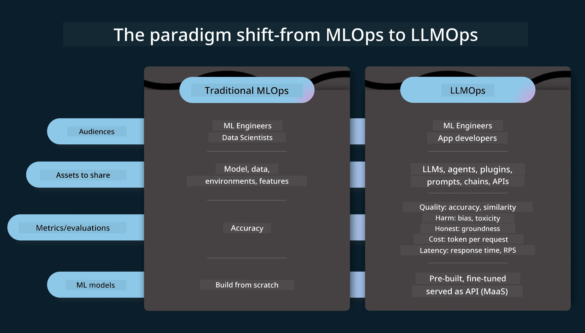
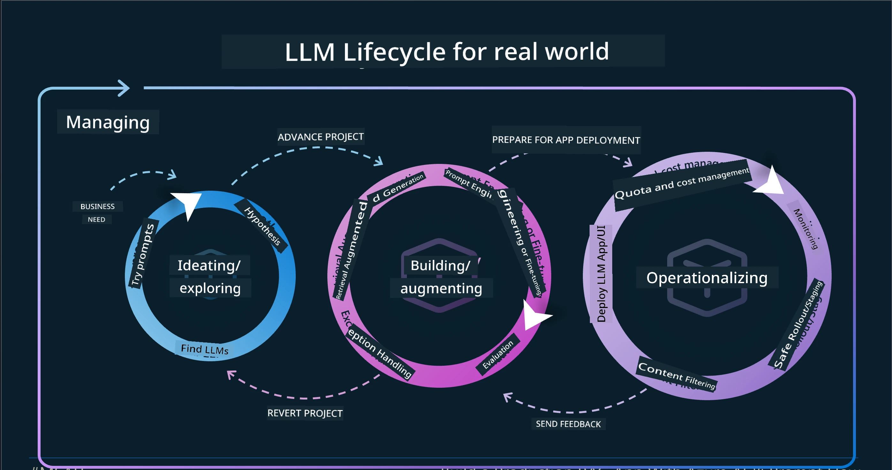
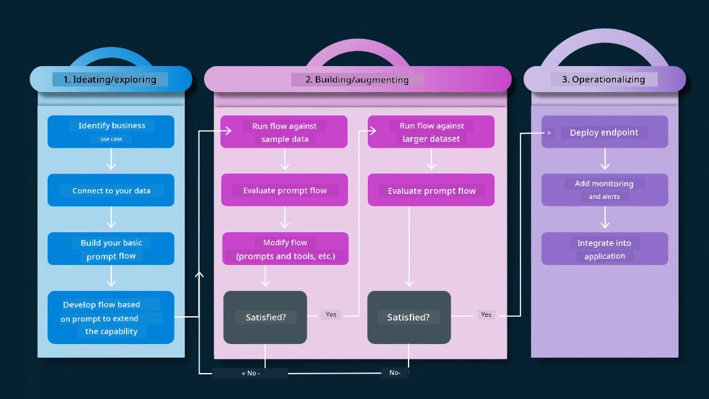
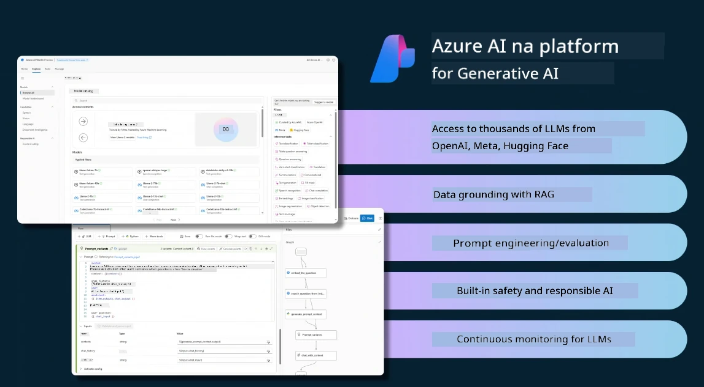
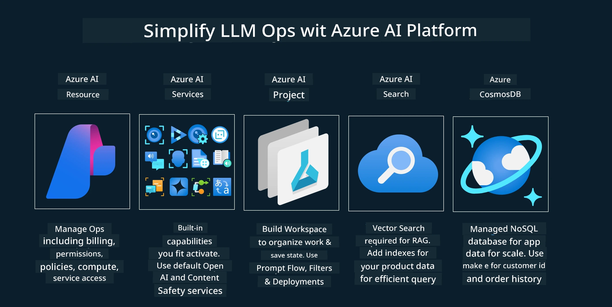
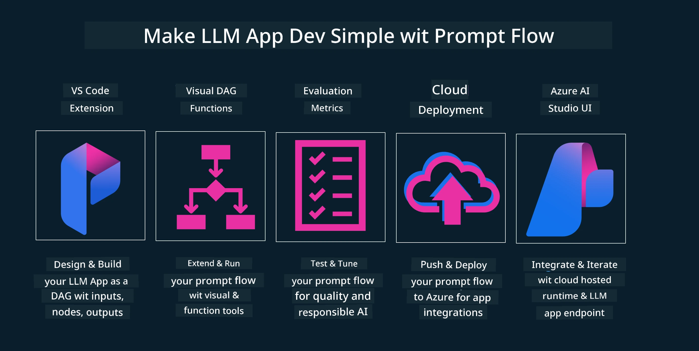

# Di Generative AI Application Lifecycle

One important question for alldi AI applications na di relevance of AI features, as AI fast dey evolve, to make sure sey your application still dey relevant, reliable, and strong, you need monitor am, check am well well, and improve am constantly. Na here di generative AI lifecycle come enter.

Di generative AI lifecycle na framework wey dey show you di steps dem for developing, deploying, and maintaining one generative AI application. E go help you define your goals, measure how your app dey perform, find di wahala dem, and how you go solve dem. E go also help make sure sey your application dey do wetin ethical and legal standards for your area and your stakeholders go allow. If you follow di generative AI lifecycle, you fit sure sey your app go always dey deliver value and make your users happy.

## Introduction

For dis chapter, you go:

- Understand di Paradigm Shift from MLOps to LLMOps
- Di LLM Lifecycle
- Lifecycle Tooling
- Lifecycle Metrification and Evaluation

## Understand di Paradigm Shift from MLOps to LLMOps

LLMs na new tool for di Artificial Intelligence arsenal, dem get strong power for analysis and generation task for applications, but dis power bring some consequences on how we dey arrange AI and Classic Machine Learning tasks.

So, we need new Paradigm to fit dis tool well, with correct incentives. We fit call old AI apps "ML Apps" and new AI apps "GenAI Apps" or just "AI Apps", wey go reflect di main technology and techniques wey people dey use that time. Dis one dey change how we dey take talk about am for many ways, look di comparison below.

Make you notice sey for LLMOps, we dey focus more on di App Developers, dey use integrations as main point, dey use "Models-as-a-Service" and dey think for dis points for metrics.

- Quality: Response quality
- Harm: Responsible AI
- Honesty: Response groundedness (E make sense? E correct?)
- Cost: Solution Budget
- Latency: Avg. time for token response

## Di LLM Lifecycle

First, to understand di lifecycle and di changes, make we note di next infographic.

As you fit see, dis one different from di usual Lifecycles wey we get for MLOps. LLMs get plenty new requirements, like Prompting, different ways to improve quality (Fine-Tuning, RAG, Meta-Prompts), different ways to measure and take responsibility with responsible AI, and new evaluation metrics (Quality, Harm, Honesty, Cost and Latency).

For example, look how we dey ideate. We dey use prompt engineering to try different LLMs to explore wetin fit work to check if their Hypothesis fit be correct.

Make you know sey dis one no dey linear, but e dey involve integrated loops, iterative and e get one big cycle wey join am all together.

How we fit explore those steps? Make we enter detail on how we fit build one lifecycle.

E fit look small complex, but make we focus on di three big steps first.

1. Ideating/Exploring: Exploration, here we fit explore based on our business needs. Prototyping, creating one [PromptFlow](https://microsoft.github.io/promptflow/index.html?WT.mc_id=academic-105485-koreyst) and test whether e good enough for our Hypothesis.
1. Building/Augmenting: Implementation, now we start to evaluate for bigger datasets, implement techniques like Fine-tuning and RAG, to check if our solution strong. If e no work, we fit do am again, add new steps for our flow or arrange data well. After we test our flow and scale, if e work and we check our Metrics, e dey ready for next step.
1. Operationalizing: Integration, now we add Monitoring and Alerts Systems to our system, deploy am and integrate the application.

Then, we get di big cycle of Management, wey dey focus on security, compliance and governance.

Congrats, now your AI App ready to run and work. For hands-on experience, check di [Contoso Chat Demo.](https://nitya.github.io/contoso-chat/?WT.mc_id=academic-105485-koreyst)

Now, wetin tools we fit use?

## Lifecycle Tooling

For Tooling, Microsoft dey provide the [Azure AI Platform](https://azure.microsoft.com/solutions/ai/?WT.mc_id=academic-105485-koreyst) and [PromptFlow](https://microsoft.github.io/promptflow/index.html?WT.mc_id=academic-105485-koreyst) wey go make your cycle easy to implement and ready to go.

The [Azure AI Platform](https://azure.microsoft.com/solutions/ai/?WT.mc_id=academic-105485-koreyst), allow you to use [AI Studio](https://ai.azure.com/?WT.mc_id=academic-105485-koreyst). AI Studio na web portal wey allow you explore models, samples and tools. E dey manage your resources, UI development flows and SDK/CLI options for Code-First development.

Azure AI allow you use many resources to manage your operations, services, projects, vector search and database needs.

Construct, from Proof-of-Concept(POC) reach large scale applications with PromptFlow:

- Design and Build apps from VS Code, with visual and functional tools
- Test and fine-tune your apps for quality AI, no wahala.
- Use Azure AI Studio to Integrate and Iterate with cloud, Push and Deploy for fast integration.

## Great! Continue your Learning!

Correct, now learn more about how we take structure application to use di concepts with [Contoso Chat App](https://nitya.github.io/contoso-chat/?WT.mc_id=academic-105485-koreyst), to see how Cloud Advocacy add those concepts for demonstrations. For more content, check out our [Ignite breakout session!
](https://www.youtube.com/watch?v=DdOylyrTOWg)

Now, check Lesson 15, to understand how [Retrieval Augmented Generation and Vector Databases](../15-rag-and-vector-databases/README.md?WT.mc_id=academic-105485-koreyst) dey impact Generative AI and to make Applications more beta and engaging!

---

<!-- CO-OP TRANSLATOR DISCLAIMER START -->
**Disclaimer**:  
Dis dokument don translate wit AI translation service [Co-op Translator](https://github.com/Azure/co-op-translator). Even though we try make everything correct, abeg sabi say automated translations fit get mistakes or no too correct. Di original dokument wey e dey for im own language na di main correct source. If e serious matter, better make human professional translate am. We no go responsible if pesin no understand well or if e misinterpret dis translation.
<!-- CO-OP TRANSLATOR DISCLAIMER END -->