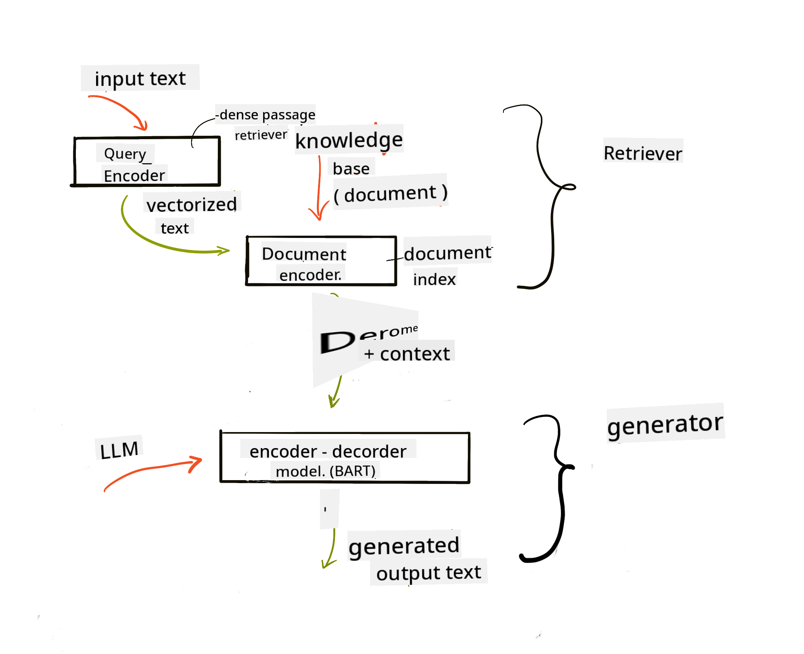
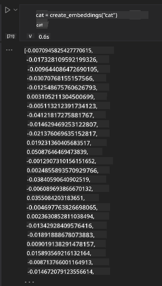

<!--
CO_OP_TRANSLATOR_METADATA:
{
  "original_hash": "b4b0266fbadbba7ded891b6485adc66d",
  "translation_date": "2025-11-12T08:50:49+00:00",
  "source_file": "15-rag-and-vector-databases/README.md",
  "language_code": "pcm"
}
-->
# Retrieval Augmented Generation (RAG) and Vector Databases

[](https://youtu.be/4l8zhHUBeyI?si=BmvDmL1fnHtgQYkL)

For di lesson wey we do for search applications, we don learn small about how to put your own data inside Large Language Models (LLMs). For dis lesson, we go talk more about how you fit ground your data for your LLM application, how di process dey work, and di ways wey you fit store data, including embeddings and text.

> **Video dey come soon**

## Introduction

For dis lesson, we go cover di following:

- Wetin RAG be, why e dey important for AI (artificial intelligence).

- Understand wetin vector databases be and how to create one for our application.

- Practical example of how to put RAG inside application.

## Learning Goals

After you finish dis lesson, you go fit:

- Explain why RAG dey important for data retrieval and processing.

- Setup RAG application and ground your data to an LLM.

- Integrate RAG and Vector Databases well well for LLM Applications.

## Our Scenario: make our LLMs better with our own data

For dis lesson, we wan add our own notes inside di education startup, so di chatbot go fit get more information about di different subjects. With di notes wey we get, learners go fit study better and sabi di different topics well, so e go easy for dem to revise for exams. To create dis scenario, we go use:

- `Azure OpenAI:` di LLM wey we go use to create our chatbot.

- `AI for beginners' lesson on Neural Networks:` na di data we go ground our LLM on.

- `Azure AI Search` and `Azure Cosmos DB:` vector database to store our data and create search index.

Users go fit create practice quizzes from their notes, revision flash cards, and summarize am to short overviews. To start, make we look wetin RAG be and how e dey work:

## Retrieval Augmented Generation (RAG)

LLM-powered chatbot dey process user prompts to generate response. E dey interactive and dey talk with users about plenty topics. But di response wey e dey give dey limited to di context wey e get and di training data wey dem use. For example, GPT-4 knowledge cutoff na September 2021, so e no sabi wetin happen after dat time. Plus, di data wey dem use train LLMs no dey include private information like personal notes or company product manual.

### How RAGs (Retrieval Augmented Generation) dey work


Imagine say you wan deploy chatbot wey go dey create quizzes from your notes, you go need connection to di knowledge base. Na here RAG go help. RAG dey work like dis:

- **Knowledge base:** Before retrieval, you go need preprocess di documents, break big documents into small chunks, change dem to text embedding, and store dem for database.

- **User Query:** Di user go ask question.

- **Retrieval:** When user ask question, di embedding model go find relevant information from di knowledge base to add more context wey go join di prompt.

- **Augmented Generation:** Di LLM go use di data wey e retrieve to make di response better. E go make di response no just dey based on pre-trained data but also dey relevant to di added context. Di retrieved data go help di LLM response. Di LLM go then give answer to di user question.



Di architecture for RAG dey use transformers wey get two parts: encoder and decoder. For example, when user ask question, di input text go dey 'encoded' into vectors wey capture di meaning of di words, and di vectors go dey 'decoded' into di document index to generate new text based on di user query. Di LLM dey use encoder-decoder model to generate output.

Two ways wey dem dey use implement RAG according to di paper: [Retrieval-Augmented Generation for Knowledge intensive NLP (natural language processing software) Tasks](https://arxiv.org/pdf/2005.11401.pdf?WT.mc_id=academic-105485-koreyst) na:

- **_RAG-Sequence_** wey dey use di documents wey e retrieve to predict di best answer to di user question.

- **RAG-Token** wey dey use documents to generate di next token, then retrieve dem to answer di user question.

### Why you go wan use RAGs? 

- **Information richness:** E dey make sure say di text response dey up to date and current. E dey help performance for domain-specific tasks by accessing di internal knowledge base.

- E dey reduce fabrication by using **verifiable data** for di knowledge base to give context to di user questions.

- E dey **cost effective** because e cheap pass to dey fine-tune LLM.

## Creating a knowledge base

Our application dey based on our personal data, like di Neural Network lesson for AI For Beginners curriculum.

### Vector Databases

Vector database no be like traditional database, e dey designed to store, manage, and search embedded vectors. E dey store numerical representations of documents. When you break data into numerical embeddings, e go dey easy for AI system to understand and process di data.

We dey store our embeddings for vector databases because LLMs get limit for di number of tokens wey dem fit accept as input. Since you no fit pass di whole embeddings to LLM, you go need break dem into chunks, and when user ask question, di embeddings wey dey similar to di question go dey returned with di prompt. Chunking dey also reduce cost for di number of tokens wey you dey pass through LLM.

Some popular vector databases na Azure Cosmos DB, Clarifyai, Pinecone, Chromadb, ScaNN, Qdrant, and DeepLake. You fit create Azure Cosmos DB model using Azure CLI with dis command:

```bash
az login
az group create -n <resource-group-name> -l <location>
az cosmosdb create -n <cosmos-db-name> -r <resource-group-name>
az cosmosdb list-keys -n <cosmos-db-name> -g <resource-group-name>
```

### From text to embeddings

Before we store our data, we go need change am to vector embeddings before we store am for database. If you dey work with big documents or long texts, you fit chunk dem based on di queries wey you dey expect. Chunking fit dey done for sentence level or paragraph level. Since chunking dey get meaning from di words wey dey around dem, you fit add some other context to di chunk, like di document title or some text before or after di chunk. You fit chunk di data like dis:

```python
def split_text(text, max_length, min_length):
    words = text.split()
    chunks = []
    current_chunk = []

    for word in words:
        current_chunk.append(word)
        if len(' '.join(current_chunk)) < max_length and len(' '.join(current_chunk)) > min_length:
            chunks.append(' '.join(current_chunk))
            current_chunk = []

    # If the last chunk didn't reach the minimum length, add it anyway
    if current_chunk:
        chunks.append(' '.join(current_chunk))

    return chunks
```

After chunking, we fit embed our text using different embedding models. Some models wey you fit use na: word2vec, ada-002 by OpenAI, Azure Computer Vision, and many more. Di model wey you go use go depend on di language wey you dey use, di type of content wey you dey encode (text/images/audio), di size of input wey e fit encode, and di length of di embedding output.

Example of embedded text using OpenAI's `text-embedding-ada-002` model na:


## Retrieval and Vector Search

When user ask question, di retriever go change am to vector using di query encoder, e go then search through di document search index for vectors wey dey related to di input. After dat, e go change di input vector and document vectors back to text and pass am through di LLM.

### Retrieval

Retrieval dey happen when di system dey try find di documents from di index wey match di search criteria. Di retriever dey find documents wey go provide context and ground di LLM on your data.

Plenty ways dey to search inside database like:

- **Keyword search** - e dey used for text searches.

- **Semantic search** - e dey use di meaning of words.

- **Vector search** - e dey change documents from text to vector representations using embedding models. Retrieval go dey done by querying di documents wey di vector representations dey close to di user question.

- **Hybrid** - e dey combine both keyword and vector search.

Challenge wey dey with retrieval na when no similar response dey for di query inside di database, di system go return di best information wey e fit get. But you fit use tactics like set maximum distance for relevance or use hybrid search wey combine both keyword and vector search. For dis lesson, we go use hybrid search, wey dey combine vector and keyword search. We go store our data inside dataframe with columns wey get di chunks and embeddings.

### Vector Similarity

Di retriever go search di knowledge database for embeddings wey dey close together, di closest neighbour, because dem be texts wey dey similar. If user ask query, e go first embed am then match am with similar embeddings. Di common measurement wey dem dey use to check how similar vectors dey na cosine similarity wey dey based on di angle between two vectors.

Other ways wey you fit measure similarity na Euclidean distance wey be di straight line between vector endpoints and dot product wey dey measure di sum of di products of corresponding elements of two vectors.

### Search index

When you dey do retrieval, you go need build search index for di knowledge base before you fit perform search. Index go store di embeddings and fit quickly retrieve di most similar chunks even for big database. You fit create di index locally using:

```python
from sklearn.neighbors import NearestNeighbors

embeddings = flattened_df['embeddings'].to_list()

# Create the search index
nbrs = NearestNeighbors(n_neighbors=5, algorithm='ball_tree').fit(embeddings)

# To query the index, you can use the kneighbors method
distances, indices = nbrs.kneighbors(embeddings)
```

### Re-ranking

After you don query di database, you fit need sort di results from di most relevant. Reranking LLM dey use Machine Learning to make di search results better by arranging dem from di most relevant. Using Azure AI Search, reranking dey happen automatically with semantic reranker. Example of how reranking dey work using nearest neighbours:

```python
# Find the most similar documents
distances, indices = nbrs.kneighbors([query_vector])

index = []
# Print the most similar documents
for i in range(3):
    index = indices[0][i]
    for index in indices[0]:
        print(flattened_df['chunks'].iloc[index])
        print(flattened_df['path'].iloc[index])
        print(flattened_df['distances'].iloc[index])
    else:
        print(f"Index {index} not found in DataFrame")
```

## Bringing it all together

Di last step na to add our LLM to di mix so e go fit give responses wey dey grounded on our data. We fit implement am like dis:

```python
user_input = "what is a perceptron?"

def chatbot(user_input):
    # Convert the question to a query vector
    query_vector = create_embeddings(user_input)

    # Find the most similar documents
    distances, indices = nbrs.kneighbors([query_vector])

    # add documents to query  to provide context
    history = []
    for index in indices[0]:
        history.append(flattened_df['chunks'].iloc[index])

    # combine the history and the user input
    history.append(user_input)

    # create a message object
    messages=[
        {"role": "system", "content": "You are an AI assistant that helps with AI questions."},
        {"role": "user", "content": history[-1]}
    ]

    # use chat completion to generate a response
    response = openai.chat.completions.create(
        model="gpt-4",
        temperature=0.7,
        max_tokens=800,
        messages=messages
    )

    return response.choices[0].message

chatbot(user_input)
```

## Evaluating our application

### Evaluation Metrics

- Di quality of di responses wey e dey give, make e sound natural, fluent, and human-like.

- Groundedness of di data: check whether di response dey come from di docs wey we supply.

- Relevance: check whether di response match and relate to di question wey dem ask.

- Fluency - check whether di response dey make sense grammatically.

## Use Cases for using RAG (Retrieval Augmented Generation) and vector databases

Plenty use cases dey where function calls fit make your app better like:

- Question and Answering: ground your company data to chat wey employees fit use to ask questions.

- Recommendation Systems: create system wey dey match di most similar values like movies, restaurants, and many more.

- Chatbot services: store chat history and make di conversation personal based on di user data.

- Image search based on vector embeddings, e dey useful for image recognition and anomaly detection.

## Summary

We don talk about di main things for RAG from how to add our data to di application, di user query, and di output. To make RAG creation easy, you fit use frameworks like Semantic Kernel, Langchain, or Autogen.

## Assignment

To continue to learn about Retrieval Augmented Generation (RAG), you fit:

- Build front-end for di application using any framework wey you like.

- Use framework like LangChain or Semantic Kernel to recreate your application.

Congrats say you don finish di lesson 👏.

## Learning no dey end here, continue di Journey

After you don finish dis lesson, check out our [Generative AI Learning collection](https://aka.ms/genai-collection?WT.mc_id=academic-105485-koreyst) to continue to sabi more about Generative AI!

---

<!-- CO-OP TRANSLATOR DISCLAIMER START -->
**Disclaimer**:  
Dis dokyument don use AI translation service [Co-op Translator](https://github.com/Azure/co-op-translator) do di translation. Even as we dey try make am correct, abeg sabi say machine translation fit get mistake or no dey accurate well. Di original dokyument for im native language na di main source wey you go fit trust. For important information, e better make professional human translation dey use. We no go fit take blame for any misunderstanding or wrong interpretation wey fit happen because you use dis translation.
<!-- CO-OP TRANSLATOR DISCLAIMER END -->