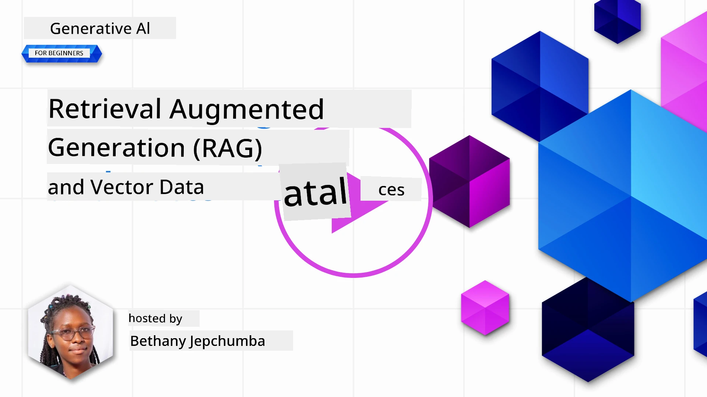
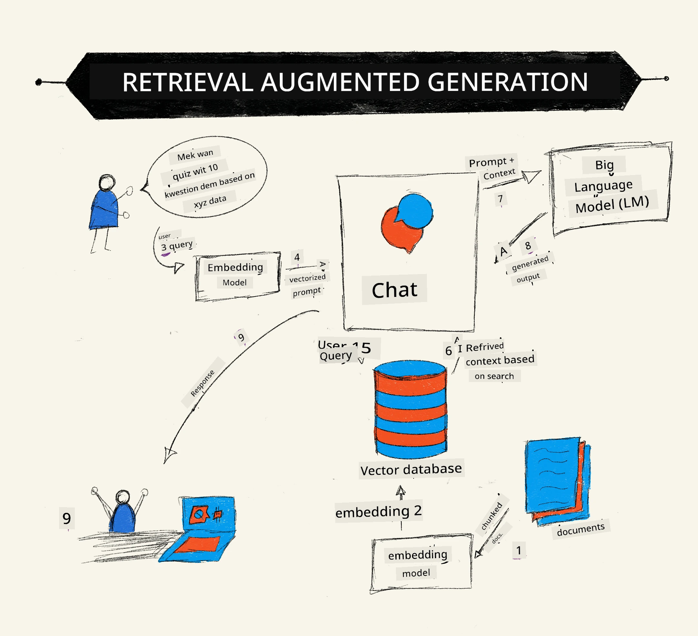
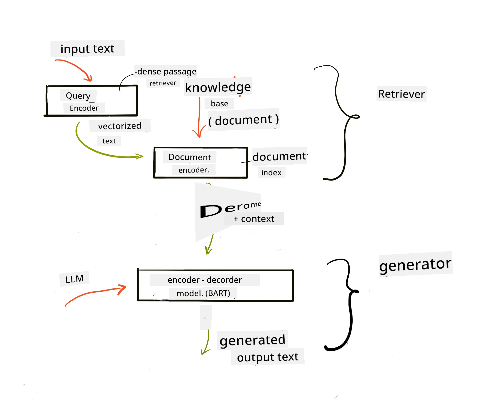

# Retrieval Augmented Generation (RAG) and Vector Databases

[](https://youtu.be/4l8zhHUBeyI?si=BmvDmL1fnHtgQYkL)

For di search applications lesson, we quick quick learn how to join your own data enter Large Language Models (LLMs). For dis lesson, we go dive deep inside how to ground your data inside your LLM application, how di process dey work and how to store data, wey include embeddings and text.

> **Video Going Come Soon**

## Introduction

For dis lesson, we go talk about di following:

- One introduction to RAG, wetin e be and why e dey use for AI (artificial intelligence).

- Understand wetin vector databases be and how to create one for our application.

- One practical example on how to join RAG enter application.

## Learning Goals

After you finish dis lesson, you go fit:

- Explain why RAG dey important for data retrieval and processing.

- Setup RAG application and ground your data to one LLM

- How to correct join RAG and Vector Databases for LLM Applications.

## Our Scenario: make our LLMs beta with our own data

For dis lesson, we wan add our own notes enter education startup, wey go make chatbot fit get more info for different subjects. Using the notes we get, learners go fit study beta and understand the different topics, e go make am easy to revise for their exams. To create our scenario, we go use:

- `Azure OpenAI:` the LLM we go use to create our chatbot

- `AI for beginners' lesson on Neural Networks`: dis na the data we go ground our LLM on

- `Azure AI Search` and `Azure Cosmos DB:` vector database to store our data and create search index

Users go fit create practice quizzes from their notes, revision flash cards and summarize am to short short gist. To start, make we check wetin RAG be and how e dey work:

## Retrieval Augmented Generation (RAG)

One LLM powered chatbot dey process user prompt to generate response. E dey design to dey interactive and e dey yan with users on plenty topics. But, the answers e fit give dey limited to the context we e get and di training data we e start wit. For example, GPT-4 knowledge cutoff na September 2021, mean say, e no sabi anything wey happen after dat time. Plus, di data we use train LLMs no include secret info like personal notes or company product manual.

### How RAGs (Retrieval Augmented Generation) dey work



Suppose you wan run chatbot wey go create quizzes from your notes, you need connection to knowledge base. Na here RAG go help you. RAGs dey do like dis:

- **Knowledge base:** Before retrieval, you need put these documents enter ready form, usually to cut big documents to small small chunks, turn am to text embedding and store am for database.

- **User Query:** user go ask question

- **Retrieval:** When user ask question, embedding model go find relevant info from knowledge base to give more context for prompt.

- **Augmented Generation:** LLM go improve im answer based on the data we e collect. E go allow answer no be only from pre-trained data but also based on relevant info from added context. The data we retrieve go help improve di LLM's answers. The LLM go later give answer to user question.



Di architecture for RAGs dey use transformers wey get two parts: encoder and decoder. For example, when user ask question, di input text go 'encode' into vectors wey capture meaning of words and then di vectors go 'decode' into our document index and create new text based on user query. Di LLM dey use both encoder-decoder model to generate output.

Two ways to run RAG according to paper wey dem drop: [Retrieval-Augmented Generation for Knowledge intensive NLP (natural language processing software) Tasks](https://arxiv.org/pdf/2005.11401.pdf?WT.mc_id=academic-105485-koreyst) na:

- **_RAG-Sequence_** wey dey use retrieved documents to predict best possible answer to user query

- **RAG-Token** wey dey use documents to generate next token, then dem go retrieve am to answer user question

### Why you go use RAGs? 

- **Information richness:** e dey make sure say text responses dey up to date and current. E dey improve performance on domain specific tasks by accessing internal knowledge base.

- E dey reduce fake yawa by using **verifiable data** inside knowledge base to give context to user queries.

- E dey **cost effective** as e cheap pass fine-tuning LLM

## How to create knowledge base

Our application base on our personal data as example, di Neural Network lesson for AI For Beginners curriculum.

### Vector Databases

Vector database, no be like ordinary databases, na special database wey dem design to store, manage and search embedded vectors. E dey store numerical representation of documents. When you break data down to numerical embedding, e easy for AI to understand and process di data.

We dey store our embeddings for vector databases because LLMs get limit for how many tokens dem fit accept as input. Since you no fit give LLM all the embeddings at once, you need break am into chunks and when user ask question, e go return di embeddings wey fit di question together with di prompt. Chunking also dey reduce cost on number of tokens wey pass through LLM.

Some popular vector databases na Azure Cosmos DB, Clarifyai, Pinecone, Chromadb, ScaNN, Qdrant and DeepLake. You fit create Azure Cosmos DB model using Azure CLI wit dis command:

```bash
az login
az group create -n <resource-group-name> -l <location>
az cosmosdb create -n <cosmos-db-name> -r <resource-group-name>
az cosmosdb list-keys -n <cosmos-db-name> -g <resource-group-name>
```

### From text to embeddings

Before we store our data, we need turn am to vector embeddings before e enter database. If you dey work wit big documents or long text, you fit cut am based on di queries wey you dey expect. You fit do chunking for sentence level or paragraph level. Since chunking dey take meaning from words wey surround am, you fit add some context to chunk, like adding document title or some text before or after di chunk. You fit chunk di data like dis:

```python
def split_text(text, max_length, min_length):
    words = text.split()
    chunks = []
    current_chunk = []

    for word in words:
        current_chunk.append(word)
        if len(' '.join(current_chunk)) < max_length and len(' '.join(current_chunk)) > min_length:
            chunks.append(' '.join(current_chunk))
            current_chunk = []

    # If di last chunk no reach di minimum length, add am anyhow
    if current_chunk:
        chunks.append(' '.join(current_chunk))

    return chunks
```

After we don chunk, we fit embed our text using different embedding models. Some models you fit use na word2vec, ada-002 by OpenAI, Azure Computer Vision and plenty more. Which model you go choose depend on di languages you dey use, type of content we e encode (text/images/audio), size of input we fit encode and length of embedding output.

One example of embedded text using OpenAI's `text-embedding-ada-002` model na:


## Retrieval and Vector Search

When user ask question, retriever go turn am to vector using query encoder, e go then search through document search index for relevant vectors inside document wey relate to input. After dat, e go turn both input vector and document vectors to text and pass am enter LLM.

### Retrieval

Retrieval na when system try quick find documents inside index wey meet di search criteria. Goal of retriever na to get documents wey go give context and ground di LLM on your data.

There dey different ways to do search inside our database like:

- **Keyword search** - wey dem use for text searches

- **Vector search** - e dey turn documents from text to vector using embedding models, e allow **semantic search** wey dey use meaning of words. Retrieval go be by querying documents wey vector representations near to user question.

- **Hybrid** - na combination of both keyword and vector search.

One wahala with retrieval be say if database no get correct answer wey match di query, system go return di best info dem fit find, but, you fit use method like set max distance for relevance or use hybrid search wey join both keywords and vector search. For dis lesson we go use hybrid search, wey be combination of vector and keyword search. We go store our data for one dataframe wey get columns wey carry chunks and embeddings.

### Vector Similarity

Retriever go search knowledge database for embeddings wey close together, di closest neighbour, because dem be texts wey similar. For di situation wey user ask question, e go first embed am then match am with similar embeddings. Common way wey dem dey measure how vectors be similar na cosine similarity wey dey based on angle between two vectors.

We fit measure similarity using other methods like Euclidean distance wey na straight line between vector endpoints and dot product wey measure sum of products of corresponding elements of two vectors.

### Search index

When you dey do retrieval, you go need build search index for knowledge base before you start search. Index go store embeddings and fit quick find similar chunks even for big database. You fit create your index locally using:

```python
from sklearn.neighbors import NearestNeighbors

embeddings = flattened_df['embeddings'].to_list()

# Make di search index
nbrs = NearestNeighbors(n_neighbors=5, algorithm='ball_tree').fit(embeddings)

# To take find tins for di index, you fit use di kneighbors method
distances, indices = nbrs.kneighbors(embeddings)
```

### Re-ranking

After you don query database, you fit want arrange results from most relevant. One reranking LLM dey use Machine Learning to improve relevance of search results by arranging am from most relevant. Using Azure AI Search, reranking dey automatic for you using semantic reranker. Example of how reranking dey work using nearest neighbours:

```python
# Find di most similar documents
distances, indices = nbrs.kneighbors([query_vector])

index = []
# Print di most similar documents
for i in range(3):
    index = indices[0][i]
    for index in indices[0]:
        print(flattened_df['chunks'].iloc[index])
        print(flattened_df['path'].iloc[index])
        print(flattened_df['distances'].iloc[index])
    else:
        print(f"Index {index} not found in DataFrame")
```

## Putting am all together

Last step na to add our LLM inside di mix to fit get response wey take ground for our data. We go fit implement am like dis:

```python
user_input = "what is a perceptron?"

def chatbot(user_input):
    # Convert di question to query vector
    query_vector = create_embeddings(user_input)

    # Find di most similar documents
    distances, indices = nbrs.kneighbors([query_vector])

    # add documents to query make e provide context
    history = []
    for index in indices[0]:
        history.append(flattened_df['chunks'].iloc[index])

    # join di history and di user input
    history.append(user_input)

    # create one message object
    messages=[
        {"role": "system", "content": "You are an AI assistant that helps with AI questions."},
        {"role": "user", "content": "\n\n".join(history) }
    ]

    # use di Responses API to generate one response
    response = client.responses.create(
        model="gpt-4o-mini",
        temperature=0.7,
        max_output_tokens=800,
        input=messages,
        store=False,
    )

    return response.output_text

chatbot(user_input)
```

## How to check our application

### Evaluation Metrics

- How correct di responses be, make sure e sound natural, fluent and like human

- Groundedness of the data: check if di response come from the documents we provide

- Relevance: check if di response match and relate to di question wey dem ask

- Fluency - check if di response make sense grammatically

## Use Cases for using RAG (Retrieval Augmented Generation) and vector databases

Many different use cases dey where function calls fit improve your app like:

- Question and Answering: ground your company data to one chat wey employees fit use to ask questions.

- Recommendation Systems: where you fit create system wey match di most similar values like movies, restaurants and more.

- Chatbot services: you fit store chat history and personalize conversation based on user data.

- Image search based on vector embeddings, beta for image recognition and anomaly detection.

## Summary

We don cover di important parts of RAG from how to add our data into application, user query and output. To make RAG easy to create, you fit use frameworks like Semantic Kernel, Langchain or Autogen.

## Assignment

To continue your learning for Retrieval Augmented Generation (RAG), you fit build:

- Build one front-end for application using framework wey you like

- Use one framework, whether LangChain or Semantic Kernel, and recreate your app.

Congrats for finishing dis lesson 👏.

## Learning no stop here, continue your Journey

After you don finish dis lesson, check our [Generative AI Learning collection](https://aka.ms/genai-collection?WT.mc_id=academic-105485-koreyst) to continue level up your Generative AI knowledge!

---

<!-- CO-OP TRANSLATOR DISCLAIMER START -->
**Disclaimer**:
Dis document don translate wit AI translation service [Co-op Translator](https://github.com/Azure/co-op-translator). Even tho we dey try make am correct, abeg make you know say automated translation fit get errors or mistakes. Di original document for dia own language na im be di correct source. For important info, make person wey sabi human translation do am. We no go responsible for any misunderstanding or wrong understanding wey fit happen because of dis translation.
<!-- CO-OP TRANSLATOR DISCLAIMER END -->