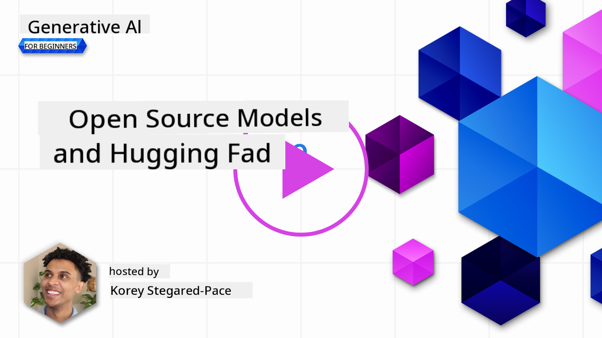
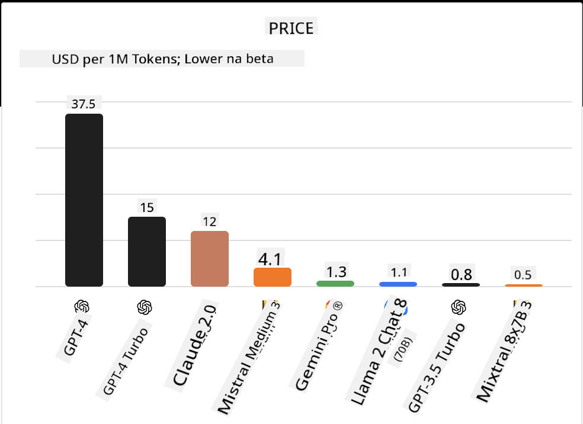
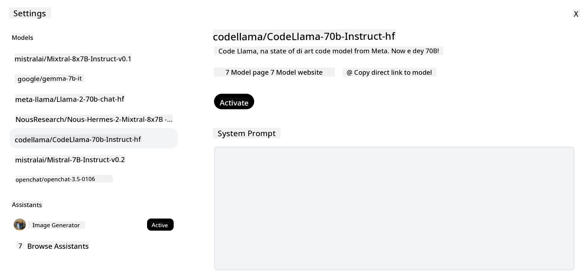
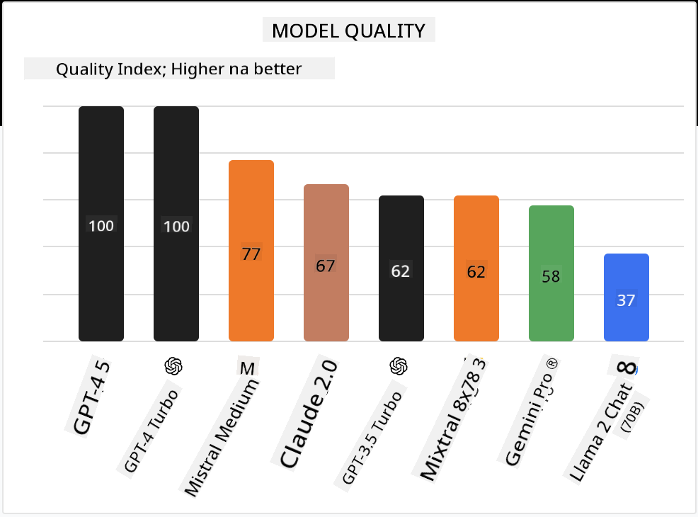

<!--
CO_OP_TRANSLATOR_METADATA:
{
  "original_hash": "a2a83aac52158c23161046cbd13faa2b",
  "translation_date": "2025-11-12T08:58:35+00:00",
  "source_file": "16-open-source-models/README.md",
  "language_code": "pcm"
}
-->

## Introduction

Di world of open-source LLMs dey very interesting and e dey change steady. Dis lesson go show wetin open source models be well well. If you wan sabi how proprietary models take compare wit open source models, go di ["Exploring and Comparing Different LLMs" lesson](../02-exploring-and-comparing-different-llms/README.md?WT.mc_id=academic-105485-koreyst). Dis lesson go also talk about fine-tuning but if you wan get beta explanation, check di ["Fine-Tuning LLMs" lesson](../18-fine-tuning/README.md?WT.mc_id=academic-105485-koreyst).

## Learning goals

- Sabi wetin open source Models be
- Understand di benefits of working wit open source Models
- Explore di open models wey dey Hugging Face and di Azure AI Studio

## Wetin be Open Source Models?

Open source software don help technology grow for many areas. Di Open Source Initiative (OSI) don define [10 criteria for software](https://web.archive.org/web/20241126001143/https://opensource.org/osd?WT.mc_id=academic-105485-koreyst) wey dem fit call open source. Di source code suppose dey open under license wey OSI approve.

Even though di way dem dey develop LLMs get some similarities wit how dem dey develop software, e no be exactly di same. Dis one don make di community dey argue about wetin open source mean for LLMs. For model to match di traditional meaning of open source, di following info suppose dey public:

- Datasets wey dem use train di model.
- Full model weights wey dem use train am.
- Di evaluation code.
- Di fine-tuning code.
- Full model weights and training metrics.

For now, na only small models dey match dis criteria. Di [OLMo model wey Allen Institute for Artificial Intelligence (AllenAI) create](https://huggingface.co/allenai/OLMo-7B?WT.mc_id=academic-105485-koreyst) na one example wey fit dis category.

For dis lesson, we go dey call di models "open models" because dem fit no match di criteria wey we talk above as at di time wey we dey write dis.

## Benefits of Open Models

**Highly Customizable** - Because open models dey come wit detailed training info, researchers and developers fit change di model anyhow dem like. Dis one dey help create models wey dem don fine-tune for specific task or area of study. Examples na code generation, mathematical operations, and biology.

**Cost** - Di money wey e go cost per token to use and deploy dis models dey lower pass proprietary models. When you dey build Generative AI apps, you suppose check di performance vs price for di models wey you wan use.

Source: Artificial Analysis

**Flexibility** - Using open models dey give you freedom to use different models or even combine dem. Example na di [HuggingChat Assistants](https://huggingface.co/chat?WT.mc_id=academic-105485-koreyst) wey user fit choose di model wey dem wan use directly for di interface:

## Exploring Different Open Models

### Llama 2

[LLama2](https://huggingface.co/meta-llama?WT.mc_id=academic-105485-koreyst), wey Meta develop, na open model wey dem optimize for chat-based apps. Di fine-tuning method wey dem use include plenty dialogue and human feedback. Dis method dey make di model produce results wey dey align wit wetin humans dey expect, wey go give better user experience.

Examples of fine-tuned versions of Llama na [Japanese Llama](https://huggingface.co/elyza/ELYZA-japanese-Llama-2-7b?WT.mc_id=academic-105485-koreyst), wey dey specialize for Japanese, and [Llama Pro](https://huggingface.co/TencentARC/LLaMA-Pro-8B?WT.mc_id=academic-105485-koreyst), wey be enhanced version of di base model.

### Mistral

[Mistral](https://huggingface.co/mistralai?WT.mc_id=academic-105485-koreyst) na open model wey dey focus on high performance and efficiency. E dey use Mixture-of-Experts approach wey combine group of expert models into one system. Depending on di input, certain models go dey selected to use. Dis one dey make computation more effective as models go only handle di inputs wey dem specialize for.

Examples of fine-tuned versions of Mistral na [BioMistral](https://huggingface.co/BioMistral/BioMistral-7B?text=Mon+nom+est+Thomas+et+mon+principal?WT.mc_id=academic-105485-koreyst), wey dey focus on medical domain, and [OpenMath Mistral](https://huggingface.co/nvidia/OpenMath-Mistral-7B-v0.1-hf?WT.mc_id=academic-105485-koreyst), wey dey perform mathematical computation.

### Falcon

[Falcon](https://huggingface.co/tiiuae?WT.mc_id=academic-105485-koreyst) na LLM wey Technology Innovation Institute (**TII**) create. Di Falcon-40B train wit 40 billion parameters wey don show say e perform better pass GPT-3 wit less compute budget. Dis one na because e dey use FlashAttention algorithm and multiquery attention wey dey reduce di memory wey e need for inference time. Wit dis reduced inference time, Falcon-40B dey good for chat apps.

Examples of fine-tuned versions of Falcon na [OpenAssistant](https://huggingface.co/OpenAssistant/falcon-40b-sft-top1-560?WT.mc_id=academic-105485-koreyst), wey be assistant wey dem build on open models, and [GPT4ALL](https://huggingface.co/nomic-ai/gpt4all-falcon?WT.mc_id=academic-105485-koreyst), wey dey perform better pass di base model.

## How to Choose

No be one answer dey for how to choose open model. Good place to start na di Azure AI Studio's filter by task feature. Dis one go help you understand di kind tasks wey di model don train for. Hugging Face also get LLM Leaderboard wey dey show di best performing models based on some metrics.

If you wan compare LLMs across di different types, [Artificial Analysis](https://artificialanalysis.ai/?WT.mc_id=academic-105485-koreyst) na another good resource:

Source: Artificial Analysis

If you dey work on specific use case, search for fine-tuned versions wey dey focus on di same area fit help. Try different open models to see how dem dey perform for your work and wetin your users dey expect.

## Next Steps

Di sweet part about open models na say you fit start to dey work wit dem quick quick. Check di [Azure AI Foundry Model Catalog](https://ai.azure.com?WT.mc_id=academic-105485-koreyst), wey get Hugging Face collection wit di models wey we don talk about here.

## Learning no dey stop here, continue di Journey

After you don finish dis lesson, check our [Generative AI Learning collection](https://aka.ms/genai-collection?WT.mc_id=academic-105485-koreyst) to continue to sabi more about Generative AI!

---

<!-- CO-OP TRANSLATOR DISCLAIMER START -->
**Disclaimer**:  
Dis dokyument don use AI transleto service [Co-op Translator](https://github.com/Azure/co-op-translator) do di translation. Even as we dey try make am correct, abeg make you sabi say machine translation fit get mistake or no dey accurate well. Di original dokyument wey dey for im native language na di one wey you go take as di correct source. For important mata, e good make professional human translator check am. We no go fit take blame for any misunderstanding or wrong interpretation wey fit happen because you use dis translation.
<!-- CO-OP TRANSLATOR DISCLAIMER END -->