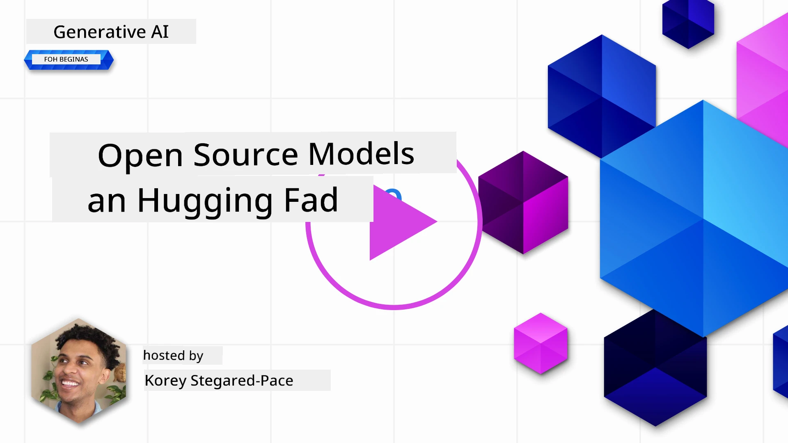
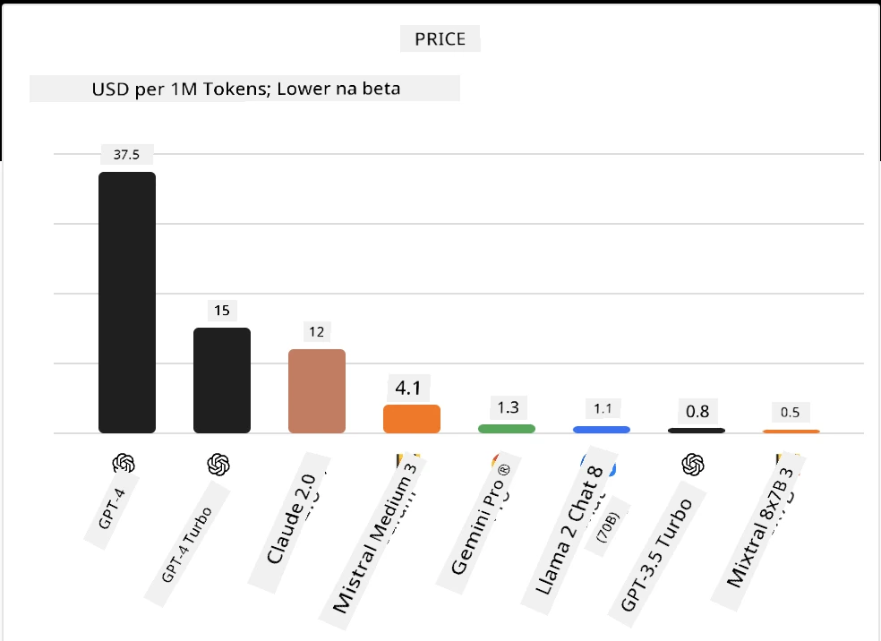
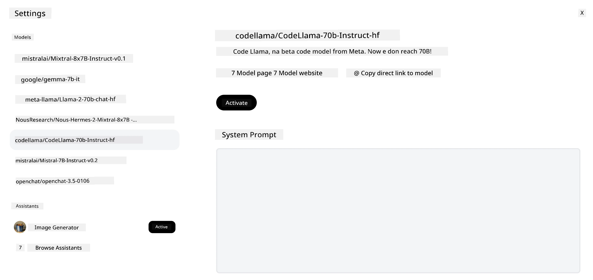
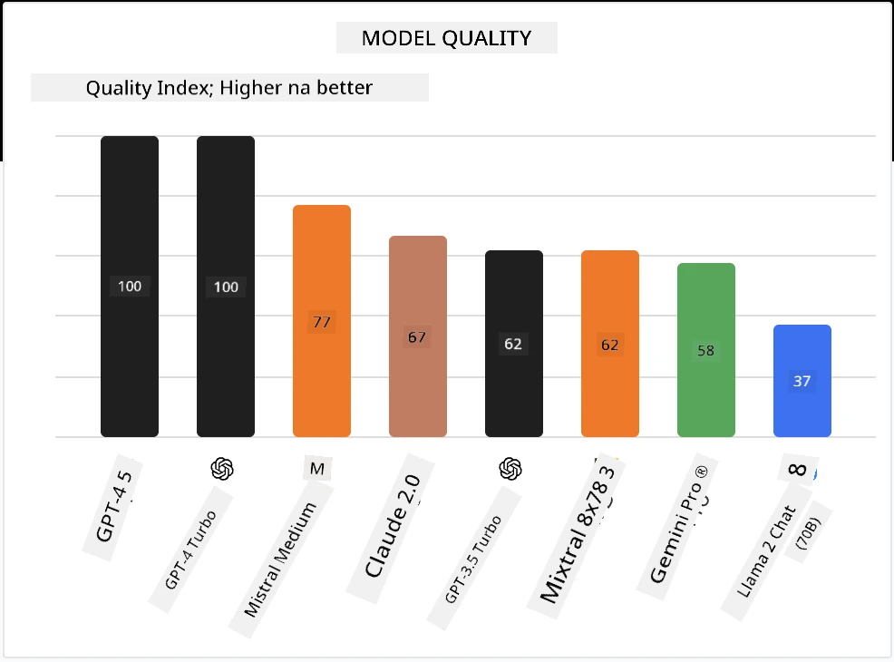

## Introduction

Di world of open-source LLMs na correct tin wey dey always dey change. Dis lesson na to show you deep tin dem about open source models. If you dey find info about how proprietary models dey compare with open source models, abeg go to di ["Exploring and Comparing Different LLMs" lesson](../02-exploring-and-comparing-different-llms/README.md?WT.mc_id=academic-105485-koreyst). Dis lesson go still talk about fine-tuning but if you want beta explanation, you fit find am for di ["Fine-Tuning LLMs" lesson](../18-fine-tuning/README.md?WT.mc_id=academic-105485-koreyst).

## Learning goals

- Make you sabi about open source Models
- Make you understand di beta tins wey dey if you work with open source Models
- Check di open models wey dey for Hugging Face and Microsoft Foundry model catalog

## Wetin be Open Source Models?

Open source software don play big role for how technology take grow for many fields. Di Open Source Initiative (OSI) don put [10 criteria for software](https://web.archive.org/web/20241126001143/https://opensource.org/osd?WT.mc_id=academic-105485-koreyst) wey dem go use take talk say software na open source. Di source code gats dey shared openly under license wey OSI approve.

Even though development of LLMs get some tin like developing software, di process no be exactly di same. Dis one don make community plenty talk about how open source mean for LLMs side. If model wan follow di traditional open source meaning, dis na di info wey gats dey public:

- Datasets wey dem use train di model.
- Full model weights as part of di training.
- Di evaluation code.
- Di fine-tuning code.
- Full model weights and training metrics.

Right now, only small models dey wey fit these criteria. Di [OLMo model wey Allen Institute for Artificial Intelligence (AllenAI) create](https://huggingface.co/allenai/OLMo-7B?WT.mc_id=academic-105485-koreyst) na one from dis group.

For dis lesson, we go just call dem "open models" as dem fit no match every part for dis criteria at di time wey we dey write.

## Benefits of Open Models

**You fit customize am well well** - Because open models dey come with full training info, researchers and developers fit change how model dey inside. Dis one mean say you fit make special models wey dem fine-tune for one particular work or subject. Examples na code generation, maths work and biology.

**Cost** - Di cost to use and run these models na less pass di one for proprietary models. If you dey build Generative AI apps, you gats check di performance versus di price when you dey use these models for your work.

Source: Artificial Analysis

**Flexibility** - When you dey work with open models, you fit dey flexible to use different models or join them together. One example be di [HuggingChat Assistants](https://huggingface.co/chat?WT.mc_id=academic-105485-koreyst) where user fit choose di model wey dem wan use directly for di user interface:

## Exploring Different Open Models

### Llama 2

[LLama2](https://huggingface.co/meta-llama?WT.mc_id=academic-105485-koreyst), wey Meta build, na open model wey dem optimize for chat apps. Dis one na because di fine-tuning method, wey include plenty talk talk and human feedback. With dis method, di model dey give results wey dey match wetin people expect and e dey give better user experience.

Some fine-tuned examples of Llama na [Japanese Llama](https://huggingface.co/elyza/ELYZA-japanese-Llama-2-7b?WT.mc_id=academic-105485-koreyst), wey sabi Japanese well and [Llama Pro](https://huggingface.co/TencentARC/LLaMA-Pro-8B?WT.mc_id=academic-105485-koreyst), wey na better version of di basic model.

### Mistral

[Mistral](https://huggingface.co/mistralai?WT.mc_id=academic-105485-koreyst) na open model wey dem focus for high performance and efficiency. E dey use Mixture-of-Experts method wey join group of special expert models to one system where, based on wetin input be, certain models go dey choose to run. Dis one dey make computation sharp well well as models only dey work on wetin dem sabi.

Some fine-tuned versions of Mistral include [BioMistral](https://huggingface.co/BioMistral/BioMistral-7B?text=Mon+nom+est+Thomas+et+mon+principal?WT.mc_id=academic-105485-koreyst), wey focus on medical mata, and [OpenMath Mistral](https://huggingface.co/nvidia/OpenMath-Mistral-7B-v0.1-hf?WT.mc_id=academic-105485-koreyst), wey dey do maths calculation.

### Falcon

[Falcon](https://huggingface.co/tiiuae?WT.mc_id=academic-105485-koreyst) na LLM wey di Technology Innovation Institute (**TII**) build. Falcon-40B train for 40 billion parameters and e don show say e better pass GPT-3, and e no dey use plenty compute power. Dis one na because e use FlashAttention algorithm and multiquery attention wey make am fit use small memory during inference. With this short inference time, Falcon-40B fit well for chat apps.

Some fine-tuned versions of Falcon na [OpenAssistant](https://huggingface.co/OpenAssistant/falcon-40b-sft-top1-560?WT.mc_id=academic-105485-koreyst), wey be assistant built on top open models and [GPT4ALL](https://huggingface.co/nomic-ai/gpt4all-falcon?WT.mc_id=academic-105485-koreyst), wey dey give higher performance pass di base model.

## How to Choose

No be only one correct answer dey for how you go take choose open model. One beta place to start na to use Microsoft Foundry model catalog filter by task feature. Dis one go help you sabi wetin type tasks di model fit do. Hugging Face still get one LLM Leaderboard wey dey show you better models based on some metrics.

If you wan compare LLMs based on different type dem, [Artificial Analysis](https://artificialanalysis.ai/?WT.mc_id=academic-105485-koreyst) be beta resource too:

Source: Artificial Analysis

If you dey work for one specific use case, to find fine-tuned versions wey focus on that area fit help well. To try many open models and see as dem perform based on wetin you and your users expect na beta way too.

## Next Steps

Best part about open models be say you fit start to work with them quick quick. Try look di [Microsoft Foundry model catalog](https://ai.azure.com?WT.mc_id=academic-105485-koreyst), wey get special Hugging Face collection with di models wey we talk for here.

## Learning no stop here, continue di Journey

After you finish dis lesson, try check our [Generative AI Learning collection](https://aka.ms/genai-collection?WT.mc_id=academic-105485-koreyst) so you fit continue to improve your Generative AI knowledge!

---

<!-- CO-OP TRANSLATOR DISCLAIMER START -->
**Disclaimer**:
Dis document don translate wit AI translation service [Co-op Translator](https://github.com/Azure/co-op-translator). Even tho we dey try make am correct, abeg make you know say automated translation fit get errors or mistakes. Di original document for dia own language na im be di correct source. For important info, make person wey sabi human translation do am. We no go responsible for any misunderstanding or wrong understanding wey fit happen because of dis translation.
<!-- CO-OP TRANSLATOR DISCLAIMER END -->