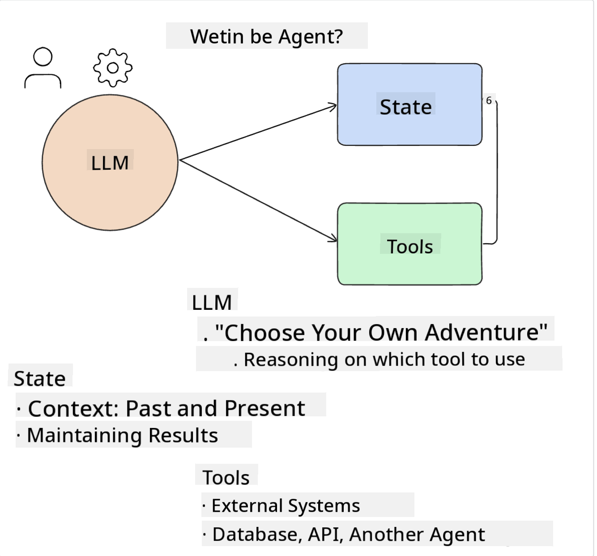
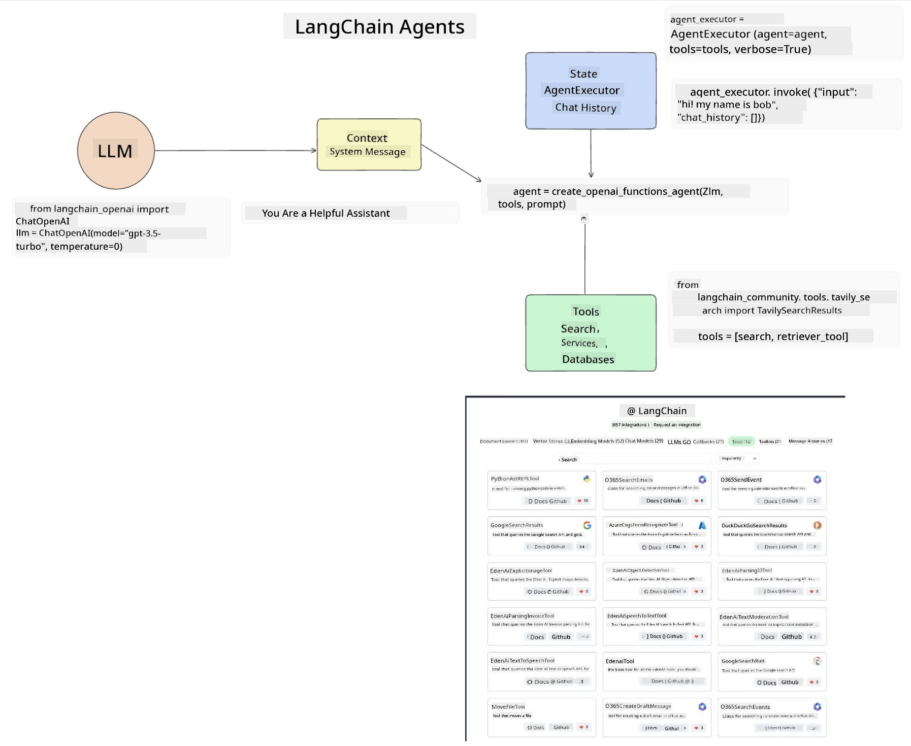
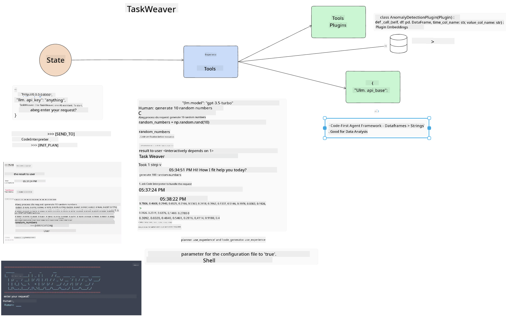
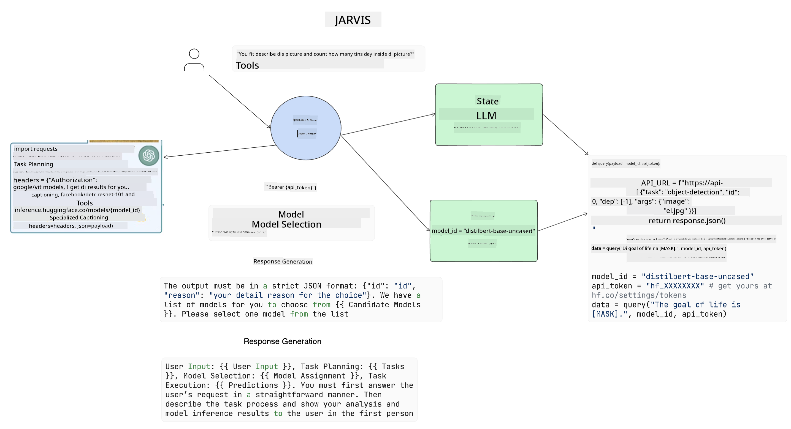

<!--
CO_OP_TRANSLATOR_METADATA:
{
  "original_hash": "8e8d1f6a63da606af7176a87ff8e92b6",
  "translation_date": "2025-11-12T08:59:09+00:00",
  "source_file": "17-ai-agents/README.md",
  "language_code": "pcm"
}
-->
[](https://youtu.be/yAXVW-lUINc?si=bOtW9nL6jc3XJgOM)

## Introduction

AI Agents na one kain beta development wey dey happen for Generative AI, wey dey make Large Language Models (LLMs) move from just dey assist to dey act like agents wey fit take action. AI Agent frameworks dey help developers build apps wey go give LLMs access to tools and state management. E still dey make am easy for users and developers to see wetin LLMs dey plan to do, so e go help improve how people dey use am.

Dis lesson go cover dis tori:

- Understand wetin AI Agent be - Wetin AI Agent really mean?
- Look four different AI Agent Frameworks - Wetin make dem special?
- Use dis AI Agents for different situations - When we go fit use AI Agents?

## Learning goals

After you don learn dis lesson, you go sabi:

- Explain wetin AI Agents be and how person fit use dem.
- Understand di difference between some popular AI Agent Frameworks and how dem dey different.
- Sabi how AI Agents dey work so you fit use dem build apps.

## Wetin Be AI Agents?

AI Agents na one interesting area for Generative AI. But sometimes, di excitement dey bring confusion about di terms and how dem dey work. To make am simple and cover most tools wey dey call demself AI Agents, we go use dis definition:

AI Agents dey allow Large Language Models (LLMs) do tasks by giving dem access to **state** and **tools**.



Make we explain di terms:

**Large Language Models** - Na di models wey we dey talk about for dis course like GPT-3.5, GPT-4, Llama-2, etc.

**State** - Na di context wey di LLM dey work with. Di LLM dey use di context of wetin e don do before and di current situation to guide wetin e go do next. AI Agent Frameworks dey make am easy for developers to manage dis context.

**Tools** - To finish di task wey user ask and wey di LLM don plan, di LLM need tools. Example of tools fit be database, API, external app or even another LLM!

Dis explanation go help you understand as we dey look how dem dey work. Make we check some AI Agent frameworks:

## LangChain Agents

[LangChain Agents](https://python.langchain.com/docs/how_to/#agents?WT.mc_id=academic-105485-koreyst) na one way wey dem dey implement di definition wey we don talk.

To manage di **state**, e dey use one function wey dem call `AgentExecutor`. Dis one dey take di `agent` wey you don define and di `tools` wey e fit use.

Di `AgentExecutor` dey also keep di chat history to give di context of di chat.



LangChain get one [catalog of tools](https://integrations.langchain.com/tools?WT.mc_id=academic-105485-koreyst) wey you fit add to your app so di LLM go fit use dem. Di tools na di community and LangChain team dey create am.

You fit define di tools and give dem to di `AgentExecutor`.

Visibility na another important thing for AI Agents. E dey important make app developers sabi which tool di LLM dey use and why. For dis reason, LangChain team don create LangSmith.

## AutoGen

Di next AI Agent framework wey we go talk about na [AutoGen](https://microsoft.github.io/autogen/?WT.mc_id=academic-105485-koreyst). Di main focus of AutoGen na conversation. Agents dey both **conversable** and **customizable**.

**Conversable -** LLMs fit start and continue conversation with another LLM to finish task. Dem dey do dis by creating `AssistantAgents` and giving dem specific system message.

```python

autogen.AssistantAgent( name="Coder", llm_config=llm_config, ) pm = autogen.AssistantAgent( name="Product_manager", system_message="Creative in software product ideas.", llm_config=llm_config, )

```

**Customizable** - Agents no dey only be LLMs, dem fit be user or tool. As developer, you fit define `UserProxyAgent` wey go dey interact with di user to get feedback to finish task. Dis feedback fit continue di task or stop am.

```python
user_proxy = UserProxyAgent(name="user_proxy")
```

### State and Tools

To change and manage state, Assistant Agent dey generate Python code to finish di task.

Example of how e dey work:


#### LLM Defined with a System Message

```python
system_message="For weather related tasks, only use the functions you have been provided with. Reply TERMINATE when the task is done."
```

Dis system message dey tell dis LLM which functions dey important for di task. Remember, for AutoGen, you fit get many AssistantAgents wey get different system messages.

#### Chat is Initiated by User

```python
user_proxy.initiate_chat( chatbot, message="I am planning a trip to NYC next week, can you help me pick out what to wear? ", )

```

Dis message from di user_proxy (Human) na wetin go start di process for di Agent to check di functions wey e suppose run.

#### Function is Executed

```bash
chatbot (to user_proxy):

***** Suggested tool Call: get_weather ***** Arguments: {"location":"New York City, NY","time_periond:"7","temperature_unit":"Celsius"} ******************************************************** --------------------------------------------------------------------------------

>>>>>>>> EXECUTING FUNCTION get_weather... user_proxy (to chatbot): ***** Response from calling function "get_weather" ***** 112.22727272727272 EUR ****************************************************************

```

After di first chat, di Agent go suggest di tool wey e go call. For dis case, na function wey dem call `get_weather`. Depending on how you set am, dis function fit run automatically or e go wait for user input.

You fit check [AutoGen code samples](https://microsoft.github.io/autogen/docs/Examples/?WT.mc_id=academic-105485-koreyst) to learn more about how to start.

## Taskweaver

Di next agent framework wey we go talk about na [Taskweaver](https://microsoft.github.io/TaskWeaver/?WT.mc_id=academic-105485-koreyst). Dem dey call am "code-first" agent because e no dey work only with `strings`, e fit work with DataFrames for Python. Dis one dey useful for data analysis and generation tasks like creating graphs, charts or random numbers.

### State and Tools

To manage di state of di conversation, TaskWeaver dey use one thing wey dem call `Planner`. Di `Planner` na LLM wey dey take di user request and plan di tasks wey dem need to finish di request.

To finish di tasks, di `Planner` dey use tools wey dem call `Plugins`. Dis fit be Python classes or general code interpreter. Di plugins dey store as embeddings so di LLM fit search for di correct plugin.



Example of plugin for anomaly detection:

```python
class AnomalyDetectionPlugin(Plugin): def __call__(self, df: pd.DataFrame, time_col_name: str, value_col_name: str):
```

Di code dey verify before e go run. Another way wey Taskweaver dey manage context na `experience`. Experience dey allow di context of conversation to dey save for long time inside YAML file. Dis one fit dey set so di LLM go dey improve over time for certain tasks wey e don see before.

## JARVIS

Di last agent framework wey we go talk about na [JARVIS](https://github.com/microsoft/JARVIS?tab=readme-ov-file?WT.mc_id=academic-105485-koreyst). Wetin make JARVIS special na say e dey use LLM to manage di `state` of di conversation and di `tools` na other AI models. Each AI model dey specialize for certain tasks like object detection, transcription or image captioning.



Di LLM, wey be general purpose model, dey take di user request, identify di specific task and di data wey e need to finish di task.

```python
[{"task": "object-detection", "id": 0, "dep": [-1], "args": {"image": "e1.jpg" }}]
```

Di LLM go format di request so di specialized AI model fit understand am, like JSON. When di AI model don finish di task, e go send di result back to di LLM.

If di task need many models, di LLM go join di response from di models before e give di final answer to di user.

Example of how e dey work when user dey ask for description and count of objects for picture:

## Assignment

To continue your learning about AI Agents, you fit build with AutoGen:

- One app wey go simulate business meeting with different departments for education startup.
- Create system messages wey go help LLMs understand different people and wetin dem dey prioritize, and make user fit present new product idea.
- Di LLM go then generate follow-up questions from each department to refine di pitch and di product idea.

## Learning no dey stop for here, continue di Journey

After you don finish dis lesson, check our [Generative AI Learning collection](https://aka.ms/genai-collection?WT.mc_id=academic-105485-koreyst) to continue to sabi more about Generative AI!

---

<!-- CO-OP TRANSLATOR DISCLAIMER START -->
**Disclaimer**:  
Dis document don dey translate wit AI translation service [Co-op Translator](https://github.com/Azure/co-op-translator). Even though we dey try make am accurate, abeg sabi say automated translations fit get mistake or no correct well. Di original document for im native language na di main correct source. For important information, e better make una use professional human translation. We no go fit take blame for any misunderstanding or wrong interpretation wey fit happen because of dis translation.
<!-- CO-OP TRANSLATOR DISCLAIMER END -->