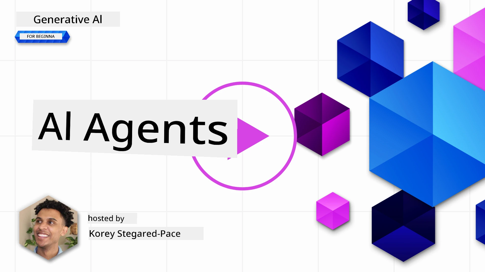
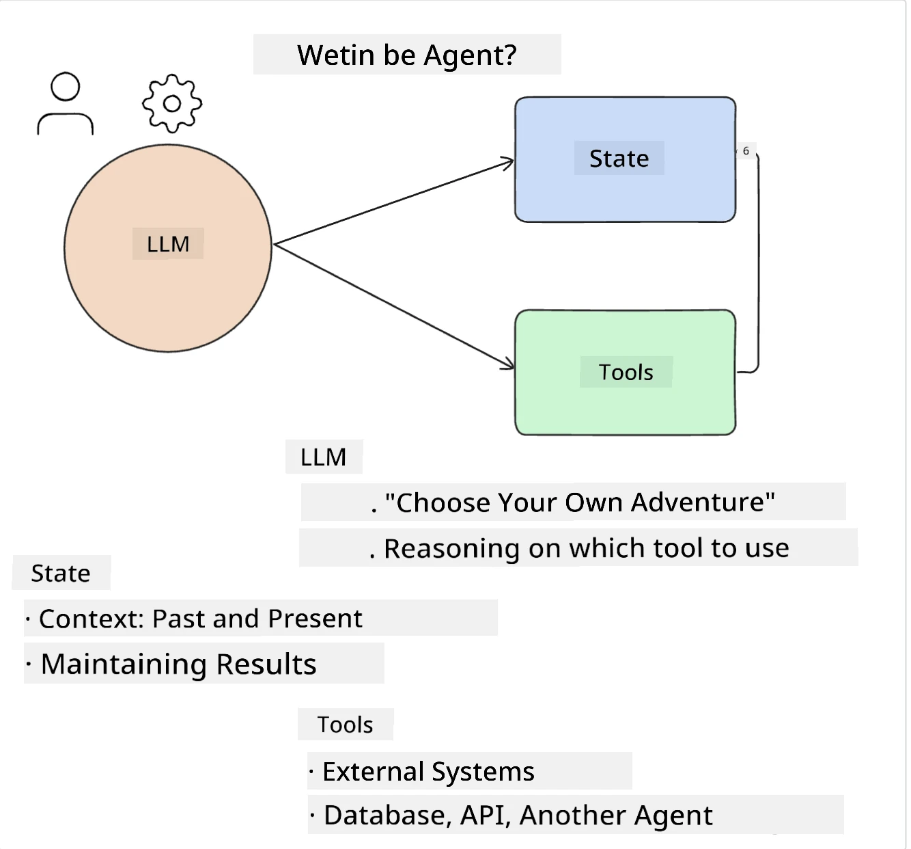
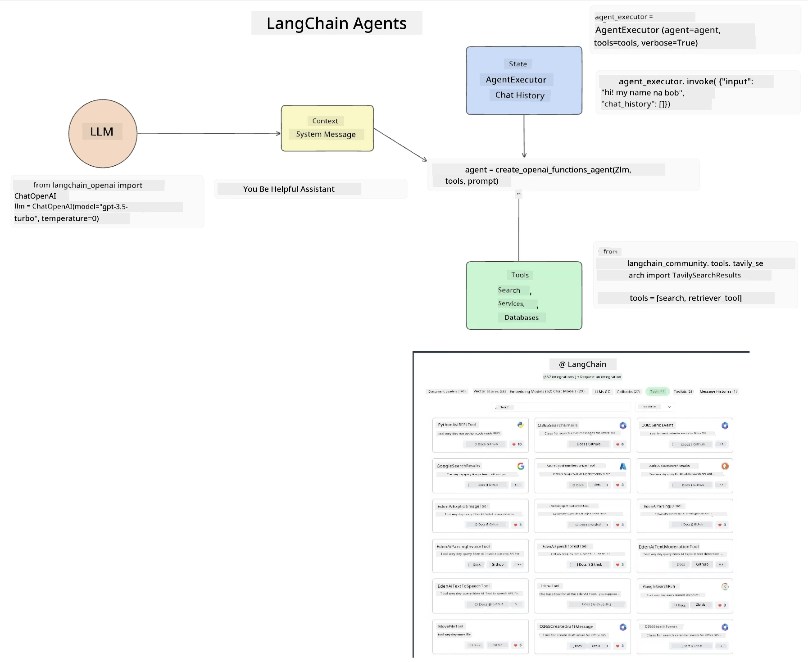
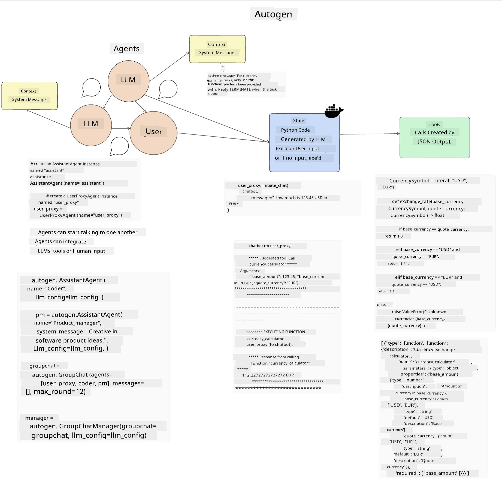
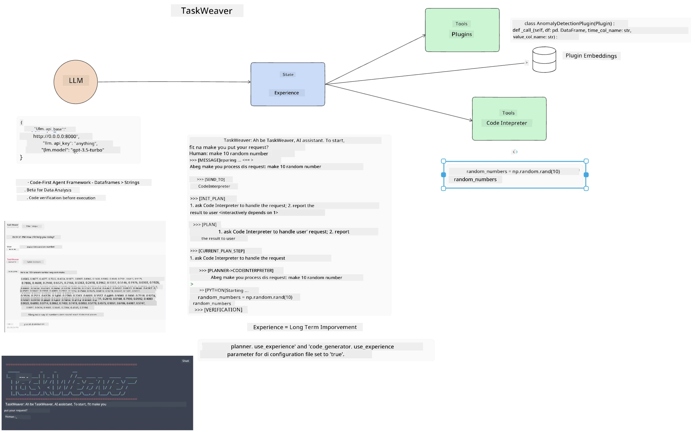
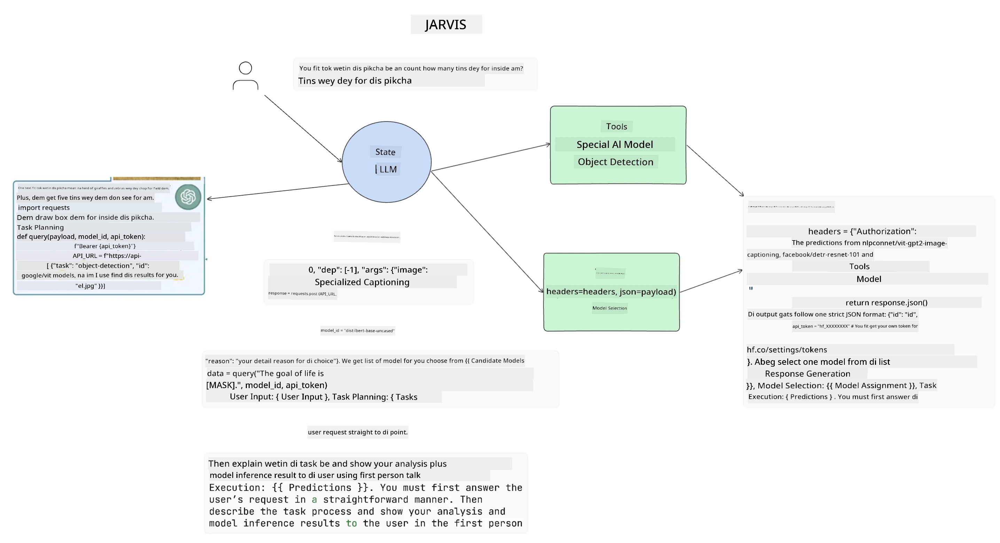

[](https://youtu.be/yAXVW-lUINc?si=bOtW9nL6jc3XJgOM)

## Introduction

AI Agents na one kain better development for Generative AI, wey dey enable Large Language Models (LLMs) to comot from just being assistants go become agents wey fit take action. AI Agent frameworks dey help developers build apps wey go give LLM dem access to tools and state management. These frameworks go also improve how people fit see wetin LLMs plan to do, so e go help better experience management.

For this lesson, we go cover dis areas:

- Understand wetin AI Agent be - Wetin exactly be AI Agent?
- Check four different AI Agent Frameworks - Wetin make dem different?
- Use these AI Agents for different work dem dey do - When we suppose use AI Agents?

## Learning goals

After you finish dis lesson, you go fit:

- Explain wetin AI Agents be and how we fit take use dem.
- Understand the difference between some of the popular AI Agent Frameworks, and how dem different.
- Know how AI Agents dey work so you fit build apps with dem.

## Wetin Be AI Agents?

AI Agents na one kind kontri wey dey very interesting for Generative AI world. With this kind interest, sometimes e fit cause confusion about the terms and how dem take use am. To make am simple and cover most tools wey dey call AI Agents, we go use this definition:

AI Agents dey allow Large Language Models (LLMs) to do work by giving dem access to **state** and **tools**.



Make we explain these words:

**Large Language Models** - Dem be the models wey we dey talk about for dis course like GPT-3.5, GPT-4, Llama-2, and others.

**State** - E mean the context wey the LLM dey work inside. The LLM go use the context of wetin e don do before plus the current context to help am decide wetin to do next. AI Agent Frameworks dey help developers to keep this context easy.

**Tools** - To finish the work wey user don ask and the plan wey LLM don make, the LLM need tools. Tools fit be like database, API, external app or even another LLM!

Dis definitions go help you understand better as we take look how dem dey work. Make we see some different AI Agent frameworks:

## LangChain Agents

[LangChain Agents](https://python.langchain.com/docs/how_to/#agents?WT.mc_id=academic-105485-koreyst) na how dem take do the things we explain above.

To manage **state**, e dey use one function wey e get inside called `AgentExecutor`. E dey accept the `agent` and the `tools` wey e fit use.

The `Agent Executor` go also keep the chat history make e provide the context of the chat.



LangChain get [catalog of tools](https://integrations.langchain.com/tools?WT.mc_id=academic-105485-koreyst) wey you fit add for your app so LLM fit access am. Dem tools na community and LangChain team make dem.

You fit define these tools and pass dem go the `Agent Executor`.

Visibility na another important thing when we dey talk about AI Agents. E important make app developers sabi which tool LLM dey use and why. Because of that, LangChain team make LangSmith.

## AutoGen

The next AI Agent framework we go talk about na [AutoGen](https://microsoft.github.io/autogen/?WT.mc_id=academic-105485-koreyst). The main tins AutoGen dey focus on na conversations. Agents dey both **conversable** and **customizable**.

**Conversable -** LLM fit start and continue conversation with another LLM to complete work. Dem dey do am by creating `AssistantAgents` and give dem special system message.

```python

autogen.AssistantAgent( name="Coder", llm_config=llm_config, ) pm = autogen.AssistantAgent( name="Product_manager", system_message="Creative in software product ideas.", llm_config=llm_config, )

```

**Customizable** - Agents fit no only be LLMs but fit be user or tool too. As developer, you fit define `UserProxyAgent` wey dey interact with user for feedback to finish work. This feedback fit make the work continue or make e stop.

```python
user_proxy = UserProxyAgent(name="user_proxy")
```

### State and Tools

To change and manage state, Assistant Agent go generate Python code to finish the work.

Here na example of the process:



#### LLM Defined with a System Message

```python
system_message="For weather related tasks, only use the functions you have been provided with. Reply TERMINATE when the task is done."
```

Dis system message dey direct this one LLM to know which functions good for im work. Remember, with AutoGen you fit get many AssistantAgents wey different with different system messages.

#### Chat Start by User

```python
user_proxy.initiate_chat( chatbot, message="I am planning a trip to NYC next week, can you help me pick out what to wear? ", )

```

Dis message from the user_proxy (Human) na wetin go start the Agent to check which function e suppose run.

#### Function Run

```bash
chatbot (to user_proxy):

***** Suggested tool Call: get_weather ***** Arguments: {"location":"New York City, NY","time_periond:"7","temperature_unit":"Celsius"} ******************************************************** --------------------------------------------------------------------------------

>>>>>>>> EXECUTING FUNCTION get_weather... user_proxy (to chatbot): ***** Response from calling function "get_weather" ***** 112.22727272727272 EUR ****************************************************************

```

After initial chat don process, Agent go send the suggested tool to call. For here, na function wey dem call `get_weather`. Depending on how you set am, the function fit automatically run and Agent go read am or e fit run based on user input.

You fit see list of [AutoGen code samples](https://microsoft.github.io/autogen/docs/Examples/?WT.mc_id=academic-105485-koreyst) to learn more how to start building.

## Taskweaver

The next agent framework we go check na [Taskweaver](https://microsoft.github.io/TaskWeaver/?WT.mc_id=academic-105485-koreyst). E sabi be "code-first" agent because instead of just work strictly with `strings`, e fit work with DataFrames in Python. This one dey very useful for data analysis and generation work like making graphs, charts or generating random numbers.

### State and Tools

To manage state of the conversation, TaskWeaver dey use something called `Planner`. The `Planner` na LLM wey go take user request and map out the tasks wey need to finish to fulfill the request.

To finish the tasks, the `Planner` dey use collection of tools wey dem dey call `Plugins`. These fit be Python classes or general code interpreter. The plugins dem dey store as embeddings so that LLM fit search correct plugin well well.



Here na example of plugin wey fit handle anomaly detection:

```python
class AnomalyDetectionPlugin(Plugin): def __call__(self, df: pd.DataFrame, time_col_name: str, value_col_name: str):
```

The code go verify am before e run. Another way to manage context for Taskweaver na `experience`. Experience dey allow context of conversation to stay for long term inside one YAML file. You fit set am make LLM get better over time on certain work as e go dey exposed to past conversations.

## JARVIS

The last agent framework we go look at na [JARVIS](https://github.com/microsoft/JARVIS?tab=readme-ov-file&WT.mc_id=academic-105485-koreyst). The thing wey make JARVIS special be say e dey use LLM to manage the `state` of the conversation and the `tools` na other AI models. Every AI model na special model wey fit do certain work like object detection, transcription or image captioning.



The LLM, wey be general purpose model, go receive request from user and identify the specific work and any arguments/data wey e need to finish the work.

```python
[{"task": "object-detection", "id": 0, "dep": [-1], "args": {"image": "e1.jpg" }}]
```

The LLM go then arrange the request so the special AI model fit understand am, like JSON. After the AI model don send back im prediction based on the work, the LLM go receive the response.

If multiple models need finish the work, e go interpret response from all those models before e join them together to form the final response to user.

This example below show how e go work if user dey request description and count of objects for one picture:

## Assignment

To carry on your learning of AI Agents, you fit build with AutoGen:

- App wey go simulate business meeting with different departments for one education startup.
- Create system messages wey go guide LLMs to understand different personas and priorities, so user fit pitch new product idea.
- The LLM go then generate follow-up questions from each department to make the pitch and the product idea better.

## Learning no stop here, continue the Journey

After you finish this lesson, make you check [Generative AI Learning collection](https://aka.ms/genai-collection?WT.mc_id=academic-105485-koreyst) to continue to upgrade your knowledge for Generative AI!

---

<!-- CO-OP TRANSLATOR DISCLAIMER START -->
**Disclaimer**:
Dis dokumant don translate use AI translation service [Co-op Translator](https://github.com/Azure/co-op-translator). Even though we try make e correct, abeg sabi say automated translation fit get some mistakes or no too correct. Di original dokumant wey dem write for im own language na di correct one. If na serious info, better make person wey sabi human translation do am. We no go take responsibility if pesin no understand well or misunderstand because of dis translation.
<!-- CO-OP TRANSLATOR DISCLAIMER END -->