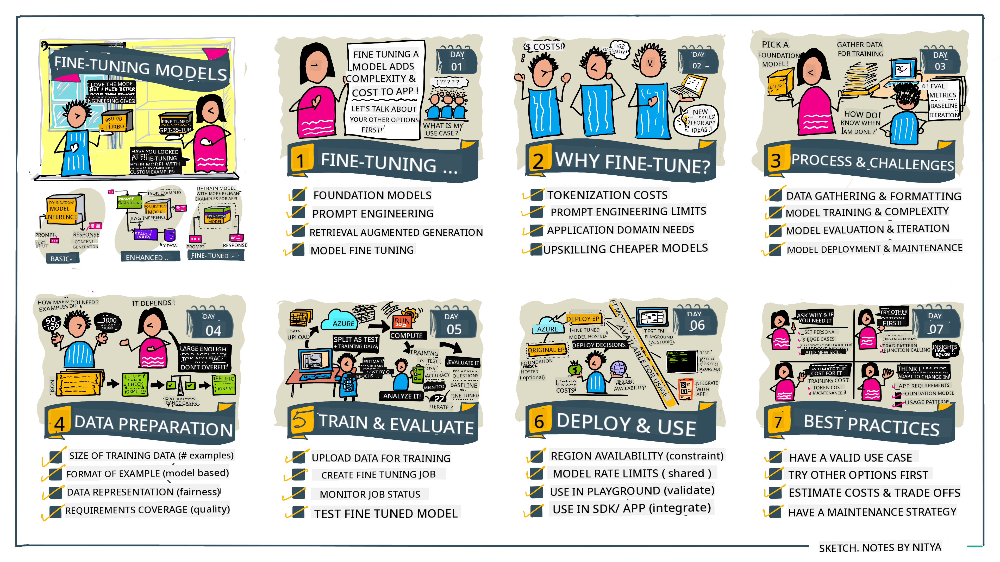

<!--
CO_OP_TRANSLATOR_METADATA:
{
  "original_hash": "807f0d9fc1747e796433534e1be6a98a",
  "translation_date": "2025-11-12T09:07:54+00:00",
  "source_file": "18-fine-tuning/README.md",
  "language_code": "pcm"
}
-->

# How to Fine-Tune Your LLM

To use big language models build generative AI apps dey come wit new wahala. One big wahala na how to make sure say di response wey di model dey give dey correct and relevant for wetin di user ask. For di lessons wey we don do before, we don talk about techniques like prompt engineering and retrieval-augmented generation wey dey try solve di problem by _changing di prompt wey we dey give di model_.

For today lesson, we go talk about one new technique, **fine-tuning**, wey dey try solve di wahala by _retraining di model itself_ wit extra data. Make we enter di gist.

## Wetin You Go Learn

Dis lesson go explain wetin fine-tuning mean for pre-trained language models, di benefits and wahala wey dey follow am, and how you fit use fine-tuning to make your generative AI models better.

By di end of dis lesson, you go fit answer dis questions:

- Wetin be fine-tuning for language models?
- When and why e dey useful to fine-tune?
- How person fit fine-tune pre-trained model?
- Wetin be di limitations of fine-tuning?

You ready? Make we start.

## Illustrated Guide

You wan get di overview of wetin we go talk before we start? Check dis illustrated guide wey dey show di learning journey for dis lesson - from di core concepts and why fine-tuning dey important, to di process and best practices for how to do di fine-tuning work. Dis topic dey very interesting, so no forget to check di [Resources](./RESOURCES.md?WT.mc_id=academic-105485-koreyst) page for more links wey go help you learn by yourself!

## Wetin be fine-tuning for language models?

Big language models na _pre-trained_ models wey dem don train wit plenty text wey dem gather from different places like di internet. As we don learn before, we dey use techniques like _prompt engineering_ and _retrieval-augmented generation_ to make di model dey give better answers to di user questions ("prompts").

One popular prompt-engineering technique na to give di model more direction on wetin we dey expect for di response by either giving _instructions_ (clear direction) or _showing am few examples_ (indirect direction). Dis one na wetin dem dey call _few-shot learning_, but e get two wahala:

- Di model get limit for di number of examples wey you fit give, and e fit affect how effective e go be.
- Di cost of di model tokens fit make am expensive to dey add examples for every prompt, and e go limit flexibility.

Fine-tuning na one common practice for machine learning wey mean say we go take pre-trained model retrain am wit new data to make am perform better for one specific task. For language models, we fit fine-tune di pre-trained model _wit well-selected examples for one particular task or area_ to create **custom model** wey go dey more accurate and relevant for dat task or area. One extra benefit of fine-tuning na say e fit reduce di number of examples wey you need for few-shot learning - e go reduce token usage and di cost wey dey follow am.

## When and why we go fine-tune models?

For dis matter, when we dey talk about fine-tuning, we dey refer to **supervised** fine-tuning wey mean say di retraining dey happen by **adding new data** wey no dey di original training dataset. Dis one different from unsupervised fine-tuning wey di model dey retrain wit di original data but wit different hyperparameters.

Di main thing wey you go remember be say fine-tuning na advanced technique wey need some level of expertise to get di result wey you dey look for. If you no do am well, e fit no give di improvement wey you dey expect, and e fit even make di model performance for your area worse.

So, before you learn "how" to fine-tune language models, you need to know "why" you go choose dis method, and "when" you go start di fine-tuning process. Ask yourself dis questions:

- **Use Case**: Wetin be di _use case_ for fine-tuning? Wetin you wan improve for di current pre-trained model?
- **Alternatives**: You don try _other techniques_ to get di result wey you dey look for? Use dem to create baseline for comparison.
  - Prompt engineering: Try techniques like few-shot prompting wit examples of correct prompt responses. Check di quality of di responses.
  - Retrieval Augmented Generation: Try add query results wey you search from your data to di prompts. Check di quality of di responses.
- **Costs**: You don check di cost for fine-tuning?
  - Tunability - di pre-trained model fit dey available for fine-tuning?
  - Effort - to prepare training data, evaluate & refine di model.
  - Compute - to run di fine-tuning jobs, and deploy di fine-tuned model.
  - Data - you get enough quality examples wey go make fine-tuning work?
- **Benefits**: You don confirm di benefits for fine-tuning?
  - Quality - di fine-tuned model perform pass di baseline?
  - Cost - e dey reduce token usage by making prompts simple?
  - Extensibility - you fit use di base model for new areas?

If you fit answer dis questions, you go fit decide if fine-tuning na di right method for your use case. Ideally, di method go make sense only if di benefits pass di cost. Once you decide to move forward, na time to think about _how_ you fit fine-tune di pre-trained model.

You wan get more gist about di decision-making process? Watch [To fine-tune or not to fine-tune](https://www.youtube.com/watch?v=0Jo-z-MFxJs)

## How we fit fine-tune pre-trained model?

To fine-tune pre-trained model, you go need:

- pre-trained model wey you wan fine-tune
- dataset wey you go use for fine-tuning
- training environment to run di fine-tuning job
- hosting environment to deploy di fine-tuned model

## Fine-Tuning In Action

Di resources wey dey below go show you step-by-step tutorials wey go guide you through real example wey use selected model wit well-prepared dataset. To follow dis tutorials, you go need account for di specific provider, plus access to di model and datasets wey dem dey use.

| Provider     | Tutorial                                                                                                                                                                       | Description                                                                                                                                                                                                                                                                                                                                                                                                                        |
| ------------ | ------------------------------------------------------------------------------------------------------------------------------------------------------------------------------ | ---------------------------------------------------------------------------------------------------------------------------------------------------------------------------------------------------------------------------------------------------------------------------------------------------------------------------------------------------------------------------------------------------------------------------------- |
| OpenAI       | [How to fine-tune chat models](https://github.com/openai/openai-cookbook/blob/main/examples/How_to_finetune_chat_models.ipynb?WT.mc_id=academic-105485-koreyst)                | Learn how to fine-tune `gpt-35-turbo` for one specific area ("recipe assistant") by preparing training data, running di fine-tuning job, and using di fine-tuned model for inference.                                                                                                                                                                                                                                              |
| Azure OpenAI | [GPT 3.5 Turbo fine-tuning tutorial](https://learn.microsoft.com/azure/ai-services/openai/tutorials/fine-tune?tabs=python-new%2Ccommand-line?WT.mc_id=academic-105485-koreyst) | Learn how to fine-tune `gpt-35-turbo-0613` model **on Azure** by taking steps to create & upload training data, run di fine-tuning job. Deploy & use di new model.                                                                                                                                                                                                                                                                 |
| Hugging Face | [Fine-tuning LLMs with Hugging Face](https://www.philschmid.de/fine-tune-llms-in-2024-with-trl?WT.mc_id=academic-105485-koreyst)                                               | Dis blog post go show you how to fine-tune _open LLM_ (example: `CodeLlama 7B`) using di [transformers](https://huggingface.co/docs/transformers/index?WT.mc_id=academic-105485-koreyst) library & [Transformer Reinforcement Learning (TRL)](https://huggingface.co/docs/trl/index?WT.mc_id=academic-105485-koreyst]) wit open [datasets](https://huggingface.co/docs/datasets/index?WT.mc_id=academic-105485-koreyst) on Hugging Face. |
|              |                                                                                                                                                                                |                                                                                                                                                                                                                                                                                                                                                                                                                                    |
| 🤗 AutoTrain | [Fine-tuning LLMs with AutoTrain](https://github.com/huggingface/autotrain-advanced/?WT.mc_id=academic-105485-koreyst)                                                         | AutoTrain (or AutoTrain Advanced) na python library wey Hugging Face develop wey dey allow fine-tuning for many different tasks including LLM fine-tuning. AutoTrain na no-code solution and fine-tuning fit dey happen for your own cloud, Hugging Face Spaces or locally. E dey support web-based GUI, CLI and training wit yaml config files.                                                                                   |
|              |                                                                                                                                                                                |                                                                                                                                                                                                                                                                                                                                                                                                                                    |

## Assignment

Choose one of di tutorials wey dey above and follow am. _We fit replicate one version of dis tutorials for Jupyter Notebooks for dis repo for reference only. Abeg use di original sources directly to get di latest versions_.

## Well Done! Continue Your Learning.

After you finish dis lesson, check our [Generative AI Learning collection](https://aka.ms/genai-collection?WT.mc_id=academic-105485-koreyst) to continue to improve your Generative AI knowledge!

Congrats!! You don complete di final lesson for di v2 series for dis course! No stop to dey learn and build. \*\*Check di [RESOURCES](RESOURCES.md?WT.mc_id=academic-105485-koreyst) page for list of extra suggestions for dis topic.

Our v1 series of lessons don also get update wit more assignments and concepts. So take small time to refresh your knowledge - and abeg [share your questions and feedback](https://github.com/microsoft/generative-ai-for-beginners/issues?WT.mc_id=academic-105485-koreyst) to help us make dis lessons better for di community.

---

<!-- CO-OP TRANSLATOR DISCLAIMER START -->
**Disclaimer**:  
Dis dokyument don use AI translation service [Co-op Translator](https://github.com/Azure/co-op-translator) do di translation. Even as we dey try make am correct, abeg sabi say machine translation fit get mistake or no dey accurate well. Di original dokyument for im native language na di main source wey you go trust. For important information, e better make professional human translation dey use. We no go fit take blame for any misunderstanding or wrong interpretation wey fit happen because you use dis translation.
<!-- CO-OP TRANSLATOR DISCLAIMER END -->