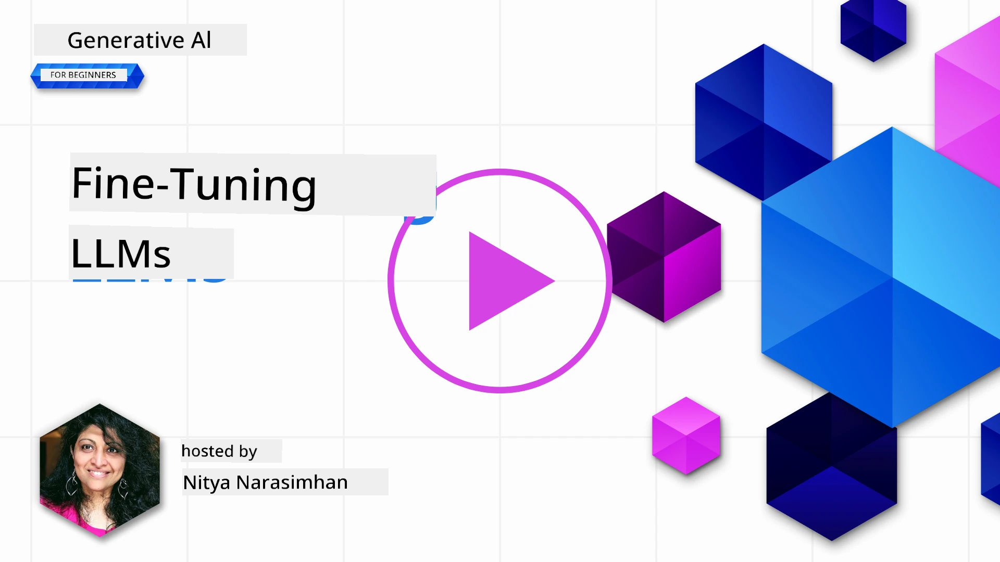
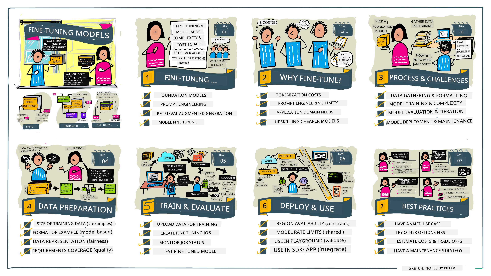

# Fine-Tuning Your LLM

Using big language models to build generative AI applications get new yawa dem. One matter wey dey important na to make sure say response quality (correctness and relevance) dey good for the content wey the model generate when user talk something. Before now, we discuss technique dem like prompt engineering and retrieval-augmented generation wey dey try solve the problem by _changing the prompt input_ wey you give the model.

For today lesson, we go talk about one third way, **fine-tuning**, wey dey try solve the palava by _retraining the model itself_ with extra data. Make we dive inside the details.

## Learning Objectives

This lesson go introduce the idea of fine-tuning for pre-trained language models, talk about the good things and challenges wey this style get, and give you guide on when and how to do fine-tuning to make your generative AI models perform better.

By the end of this lesson, you go fit answer these questions:

- Wetin be fine tuning for language models?
- When, and why, fine tuning dey useful?
- How I fit fine-tune pre-trained model?
- Wetin be the wahala wey fine-tuning get?

You ready? Make we start.

## Illustrated Guide

You want sabi the koko of everything wey we go cover before we start? Check this illustrated guide wey talk about the learning journey for this lesson - from learning the main ideas and why fine-tuning dey important, to understanding how the process dey happen and the best way to do fine-tuning work. This topic sweet well well, so no forget to check the [Resources](./RESOURCES.md?WT.mc_id=academic-105485-koreyst) page for extra links wey go help you learn by yourself!

## Wetin be fine-tuning for language models?

By definition, big language models don already _pre-trained_ on plenty text wey dem gather from different places including internet. As we learn before, we need things like _prompt engineering_ and _retrieval-augmented generation_ to make the model’s answer better when person ask question ("prompts").

One popular prompt-engineering style na to give model better guide on wetin we want for answer either by giving _instructions_ (clear guide) or _small sample examples_ (implied guide). This one na wetin dem dey call _few-shot learning_ but e get two gbege:

- Model token limits fit stop you from putting too many examples inside, and e fit reduce how well e work.
- Model token costs fit make e expensive to add examples for every prompt, and e reduce free way you fit use am.

Fine-tuning na style wey machine learning people dey use when dem take pre-trained model and train am again with new data to make am work well for one particular kind work. For language models, we fit fine-tune the pre-trained model _with set of examples wey dem prepare for specific task or area_ to make **custom model** wey go fit the job better and get better correctness for that task or area. One side benefit of fine-tuning be say e fit reduce how many examples you need for few-shot learning - to save tokens and costs.

## When and why we suppose fine-tune models?

For _this_ matter, when we dey talk about fine-tuning, we dey talk about **supervised** fine-tuning wey mean say the new training na **adding new data** wey no dey original training set. E different from unsupervised fine-tuning wey mean say model dey train again for original data but with different settings (hyperparameters).

The main thing wey make fine-tuning special na say e need some heavy knowledge before person fit get correct results. If you no do am well, e no go give better improvement, e fit even make how model dey work for your target area worse.

So, before you learn "how" to fine-tune language model, you need sabi "why" you go do am, and "when" you suppose start fine-tuning. Start by asking yourself these questions:

- **Use Case**: Wetin your _use case_ be for fine-tuning? Which part of the pre-trained model you wan improve?
- **Alternatives**: You don try _other ways_ to get the result? Use those to check if e fit better or no.
  - Prompt engineering: Try few-shot prompt with examples wey make sense. Test how responses be.
  - Retrieval Augmented Generation: Try put search result inside prompt. Check how e respond.
- **Costs**: You don find out the cost for fine-tuning?
  - Tunability - model dey ready for fine-tuning?
  - Effort – to prepare training data, test & improve model.
  - Compute – for run fine-tune job, deploy fine-tune model
  - Data – enough good quality examples for fine-tuning to work
- **Benefits**: You sure say benefits dey for fine-tuning?
  - Quality – fine-tuned model better pass original?
  - Cost – e reduce tokens because e make prompt simple?
  - Extensibility – you fit use base model for new work areas?

If you fit answer these questions, you go know if fine-tuning na the correct way for your work. Ideally, you no go use fine-tuning unless the good things pass the cost. When you don decide say you want go ahead, na time to think how you fit fine-tune the pre-trained model.

You want understand more about the decision? Watch [To fine-tune or not to fine-tune](https://www.youtube.com/watch?v=0Jo-z-MFxJs)

## How we fit fine-tune pre-trained model?

To fine-tune pre-trained model, you need:

- pre-trained model wey you fit fine-tune
- dataset for fine-tuning
- training environment wey go run fine-tuning job
- hosting environment to deploy fine-tuned model

## Fine-Tuning In Action

Below resources get step-by-step tutorial to show you example using one model with set of carefully selected data. To fit use these tutorials, you must get account with the provider, plus access to the model and data.

| Provider     | Tutorial                                                                                                                                                                       | Description                                                                                                                                                                                                                                                                                                                                                                                                                        |
| ------------ | ------------------------------------------------------------------------------------------------------------------------------------------------------------------------------ | ---------------------------------------------------------------------------------------------------------------------------------------------------------------------------------------------------------------------------------------------------------------------------------------------------------------------------------------------------------------------------------------------------------------------------------- |
| OpenAI       | [How to fine-tune chat models](https://github.com/openai/openai-cookbook/blob/main/examples/How_to_finetune_chat_models.ipynb?WT.mc_id=academic-105485-koreyst)                | Learn how to fine-tune `gpt-35-turbo` for one specific area ("recipe assistant") by preparing training data, doing the fine-tune job, and then use the fine-tuned model for answer.                                                                                                                                                                                                                                              |
| Azure OpenAI | [GPT 3.5 Turbo fine-tuning tutorial](https://learn.microsoft.com/azure/ai-services/openai/tutorials/fine-tune?tabs=python-new%2Ccommand-line?WT.mc_id=academic-105485-koreyst) | Learn how to fine-tune `gpt-35-turbo-0613` model **for Azure** by creating & uploading training data, run fine-tune job. Then deploy and use the new model.                                                                                                                                                                                                                                                                        |
| Hugging Face | [Fine-tuning LLMs with Hugging Face](https://www.philschmid.de/fine-tune-llms-in-2024-with-trl?WT.mc_id=academic-105485-koreyst)                                               | This blog post help you fine-tune open LLM (ex: `CodeLlama 7B`) using [transformers](https://huggingface.co/docs/transformers/index?WT.mc_id=academic-105485-koreyst) library & [Transformer Reinforcement Learning (TRL)](https://huggingface.co/docs/trl/index?WT.mc_id=academic-105485-koreyst]) with open [datasets](https://huggingface.co/docs/datasets/index?WT.mc_id=academic-105485-koreyst) on Hugging Face. |
|              |                                                                                                                                                                                |                                                                                                                                                                                                                                                                                                                                                                                                                                    |
| 🤗 AutoTrain | [Fine-tuning LLMs with AutoTrain](https://github.com/huggingface/autotrain-advanced/?WT.mc_id=academic-105485-koreyst)                                                         | AutoTrain (or AutoTrain Advanced) na python library wey Hugging Face create wey fit do fine-tuning for many tasks including LLM fine-tuning. AutoTrain no need code, e fit run for cloud, Hugging Face Spaces or local machine. E get web GUI, CLI and training via yaml config files.                                                                                                                                          |
|              |                                                                                                                                                                                |                                                                                                                                                                                                                                                                                                                                                                                                                                    |
| 🦥 Unsloth | [Fine-tuning LLMs with Unsloth](https://github.com/unslothai/unsloth)                                                         | Unsloth na open-source framework wey support LLM fine-tuning and reinforcement learning (RL). Unsloth dey make local training, test, deployment quick with ready [notebooks](https://github.com/unslothai/notebooks). E also support text-to-speech (TTS), BERT and multimodal models. To start, read their step-by-step [Fine-tuning LLMs Guide](https://docs.unsloth.ai/get-started/fine-tuning-llms-guide).                                                                          |
|              |                                                                                                                                                                                |                                                                                                                                                                                                                                                                                                                                                                                                                                    |
## Assignment

Pick one tutorial wey dey above and follow am step by step. _We fit put some version of these tutorials inside Jupyter Notebooks for this repo just for reference. Abeg use original sources direct to get latest version_.

## Great Work! Continue Your Learning.

After you finish this lesson, check out our [Generative AI Learning collection](https://aka.ms/genai-collection?WT.mc_id=academic-105485-koreyst) to continue to sabi more about Generative AI!

Congrats!! You don finish the last lesson from v2 series for this course! No stop to learn and create. \*\*Check out the [RESOURCES](RESOURCES.md?WT.mc_id=academic-105485-koreyst) page for plenty more things about this topic.

Our v1 series of lessons still get extra assignments and concepts update. So take small time refresh your knowledge - and abeg [share your questions and feedback](https://github.com/microsoft/generative-ai-for-beginners/issues?WT.mc_id=academic-105485-koreyst) to help us make these lessons better for everybody.

---

<!-- CO-OP TRANSLATOR DISCLAIMER START -->
**Warning**:
Dis document na AI translation service [Co-op Translator](https://github.com/Azure/co-op-translator) translate am. Even though we dey try make am correct, abeg make you sabi say machine translation fit get some mistake or wrong meaning. Di original document wey dem write for dia own language na di correct one. If na serious matter, better make person wey sabi human translation do am. We no go take responsibility if people misunderstand or no catch correct meaning becos of dis translation.
<!-- CO-OP TRANSLATOR DISCLAIMER END -->