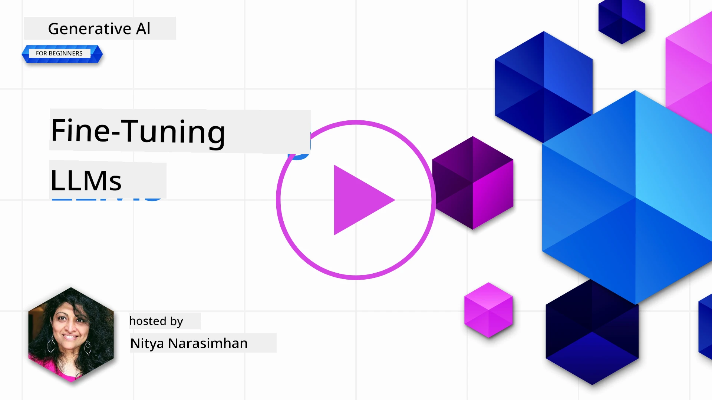
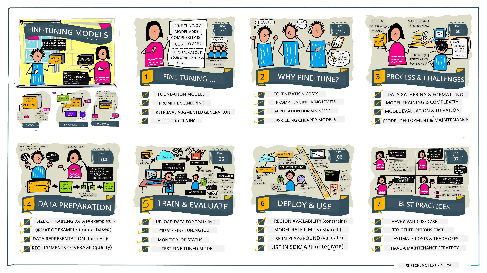

# Fine-Tuning Your LLM

To use large language models for build generative AI applications get new challenge dem. One big wahala na to make sure say response quality (accuracy and relevance) dey gidigba for the content wey the model generate for any user request. For the previous lessons, we don yarn about techniques like prompt engineering and retrieval-augmented generation wey dey try solve the problem by _modifying the prompt input_ for the existing model.

For today lesson, we go talk about one third technique, **fine-tuning**, wey dey try tackle the challenge by _retraining the model itself_ with extra data. Make we enter the details.

## Learning Objectives

Dis lesson go introduce the idea for fine-tuning for pre-trained language models, explore the benefits and wahala dem of dis approach, and give you beta guide on when and how to use fine-tuning to improve the performance of your generative AI models.

By the time you finish dis lesson, you for sabi answer dis questions dem:

- Wetin be fine-tuning for language models?
- When, and why, e beta to do fine-tuning?
- How I fit fine-tune one pre-trained model?
- Wetin be the limits of fine-tuning?

You ready? Make we start.

## Illustrated Guide

You want make you sabi the big picture of wetin we go cover before we enter? Check dis illustrated guide wey dey talk about the learning journey for dis lesson - from learning the core concepts and reason for fine-tuning, to understanding the process and best ways to follow to do the fine-tuning work. Dis topic na one correct one for exploration, so no forget to check the [Resources](./RESOURCES.md?WT.mc_id=academic-105485-koreyst) page for extra links wey fit help your self-guided learning journey!

## Wetin be fine-tuning for language models?

By definition, large language models dem _pre-trained_ on plenty text wey dem collect from different different places wey include internet. As we don learn for previous lessons, we need techniques like _prompt engineering_ and _retrieval-augmented generation_ to make sure say the quality of the model response to the user questions ("prompts") improve.

One popular prompt-engineering way na to give the model more guidance on wetin dem expect for the response by either give _instructions_ (clear guidance) or _give am small examples_ (implicit guidance). Dis na wetin dem dey call _few-shot learning_ but e get two wahala:

- Model token limits fit restrict the number of examples wey you fit give, and e fit reduce how e go work well.
- Model token price fit make e costly to add examples for every prompt, and e reduce flexibility.

Fine-tuning na common practice for machine learning systems wey person go take pre-trained model come retrain am with new data to make e perform better for one specific work. For language models matter, you fit fine-tune the pre-trained model _with one selected set of examples for one particular task or application area_ to build one **custom model** wey fit dey more correct and relevant for that task or domain. One side-benefit of fine-tuning be say e fit reduce how many examples need for few-shot learning - this one go reduce token use and the price wey join.

## When and why we suppose fine-tune models?

For _dis_ matter, when we dey talk about fine-tuning, na **supervised** fine-tuning we mean wey be say the retraining dey done by **adding new data** wey no be part of the original training data. Dis one different from unsupervised fine-tuning wey model still dey trained on the original data, but e get different hyperparameters.

The key thing to sabi be say fine-tuning na advanced technique wey need some level of skill to get the kind results wey you want. If you do am wrong, e fit no bring the improvements wey you expect, and e fit even spoil the model performance for the place wey you target.

So, before you learn "how" to fine-tune language models, you need know "why" you suppose take dis road, and "when" you go start to fine-tune. Begin by ask yourself dis kind questions:

- **Use Case**: Wetin be your _use case_ for fine-tuning? Which part of the current pre-trained model you want make better?
- **Alternatives**: You don try _other techniques_ before to get wetin you want? Use dem to create one baseline for comparison.
  - Prompt engineering: Try quick techniques like few-shot prompting with examples wey relate to prompt response. Check the quality of responses.
  - Retrieval Augmented Generation: Try to add search results to your prompts as extra info from your data. Check the quality of responses.
- **Costs**: You don identify the price wey you go pay for fine-tuning?
  - Tunability - the pre-trained model dey available for fine-tuning?
  - Effort - for preparing training data, checking & improving model.
  - Compute - for to run fine-tuning jobs, and to put fine-tuned model for use
  - Data - access to enough good quality examples wey fit improve fine-tuning
- **Benefits**: You don confirm the benefits of fine-tuning?
  - Quality - the fine-tuned model perform pass the normal one?
  - Cost - e reduce token usage by making prompts simple?
  - Extensibility - fit re-use the base model for new domains?

If you fit answer these questions well, e go help you decide if fine-tuning na the correct route for your case. Ideally, e sef good if the benefits pass the costs. After you decide to continue, na time to think about _how_ you fit fine tune the pre-trained model.

You want more ideas about how to decide? Watch [To fine-tune or not to fine-tune](https://www.youtube.com/watch?v=0Jo-z-MFxJs)

## How we fit fine-tune pre-trained model?

To fine-tune pre-trained model, you go need:

- pre-trained model wey you wan fine-tune
- dataset to use for fine-tuning
- training environment to do the fine-tuning job
- hosting environment to put the fine-tuned model to work

## Fine-Tuning In Action

Dis resources dem go give step-by-step tutorials to show you how to do am with real example using selected model plus selected dataset. To follow these tutorials, you need account on the provider wey you dey use, plus access to the right model and datasets.

| Provider     | Tutorial                                                                                                                                                                       | Description                                                                                                                                                                                                                                                                                                                                                                                                                        |
| ------------ | ------------------------------------------------------------------------------------------------------------------------------------------------------------------------------ | ---------------------------------------------------------------------------------------------------------------------------------------------------------------------------------------------------------------------------------------------------------------------------------------------------------------------------------------------------------------------------------------------------------------------------------- |
| OpenAI       | [How to fine-tune chat models](https://github.com/openai/openai-cookbook/blob/main/examples/How_to_finetune_chat_models.ipynb?WT.mc_id=academic-105485-koreyst)                | Learn how to fine-tune `gpt-35-turbo` for one specific domain ("recipe assistant") by preparing training data, running the fine-tuning job, and using the fine-tuned model for inference.                                                                                                                                                                                                                                              |
| Azure OpenAI | [GPT 3.5 Turbo fine-tuning tutorial](https://learn.microsoft.com/azure/ai-services/openai/tutorials/fine-tune?tabs=python-new%2Ccommand-line&WT.mc_id=academic-105485-koreyst) | Learn to fine-tune `gpt-35-turbo-0613` model **for Azure** by creating & uploading training data, then running the fine-tuning job. Deploy and use the new model.                                                                                                                                                                                                                                                                 |
| Hugging Face | [Fine-tuning LLMs with Hugging Face](https://www.philschmid.de/fine-tune-llms-in-2024-with-trl?WT.mc_id=academic-105485-koreyst)                                               | This post go guide you fine-tuning open LLM (like `CodeLlama 7B`) using the [transformers](https://huggingface.co/docs/transformers/index?WT.mc_id=academic-105485-koreyst) library & [Transformer Reinforcement Learning (TRL)](https://huggingface.co/docs/trl/index?WT.mc_id=academic-105485-koreyst) with open [datasets](https://huggingface.co/docs/datasets/index?WT.mc_id=academic-105485-koreyst) on Hugging Face. |
|              |                                                                                                                                                                                |                                                                                                                                                                                                                                                                                                                                                                                                                                    |
| 🤗 AutoTrain | [Fine-tuning LLMs with AutoTrain](https://github.com/huggingface/autotrain-advanced/?WT.mc_id=academic-105485-koreyst)                                                         | AutoTrain (or AutoTrain Advanced) na python library wey Hugging Face build wey allow fine-tuning for many different tasks including LLM fine-tuning. AutoTrain no need code, and you fit do the fine-tuning for your own cloud, on Hugging Face Spaces or locally. E get web-based GUI, CLI and also training with yaml config files.                                                                               |
|              |                                                                                                                                                                                |                                                                                                                                                                                                                                                                                                                                                                                                                                    |
| 🦥 Unsloth | [Fine-tuning LLMs with Unsloth](https://github.com/unslothai/unsloth)                                                         | Unsloth na open-source framework wey fit support LLM fine-tuning and reinforcement learning (RL). Unsloth dey make local training, evaluation, and deployment easy with ready use [notebooks](https://github.com/unslothai/notebooks). E fit also support text-to-speech (TTS), BERT and multimodal models. To start, read their step-by-step [Fine-tuning LLMs Guide](https://docs.unsloth.ai/get-started/fine-tuning-llms-guide).                                                                          |
|              |                                                                                                                                                                                |                                                                                                                                                                                                                                                                                                                                                                                                                                    |
## Assignment

Pick one of the tutorials wey dey above and follow am well well. _We fit put one version of these tutorials for Jupyter Notebooks inside this repo for reference. But abeg use the original source directly to get the latest version._

## Great Work! Continue Your Learning.

After you don finish this lesson, check our [Generative AI Learning collection](https://aka.ms/genai-collection?WT.mc_id=academic-105485-koreyst) make you continue to increase your Generative AI knowledge!

Congratulations!! You don finish the final lesson from v2 series for this course! No stop to learn and build. \*\*Check the [RESOURCES](RESOURCES.md?WT.mc_id=academic-105485-koreyst) page for more ideas just about dis topic.

Our v1 series lessons don also update with more assignments and concepts. So take small time to freshen your mind - and please [share your questions and feedback](https://github.com/microsoft/generative-ai-for-beginners/issues?WT.mc_id=academic-105485-koreyst) to help us make these lessons beta for the community.

---

<!-- CO-OP TRANSLATOR DISCLAIMER START -->
**Warning**:  
Dis document don translate wit AI translation service wey dem dey call [Co-op Translator](https://github.com/Azure/co-op-translator). Even though we dey try make am correct, make you sabi say AI fit make some mistakes or no get correct meaning. Di original document wey dey dia for dia own language na im be the correct one. If na important matter, e better make human wey sabi translate am well well do am. We no go take responsibility if person no understand or misunderstand dis translation.
<!-- CO-OP TRANSLATOR DISCLAIMER END -->