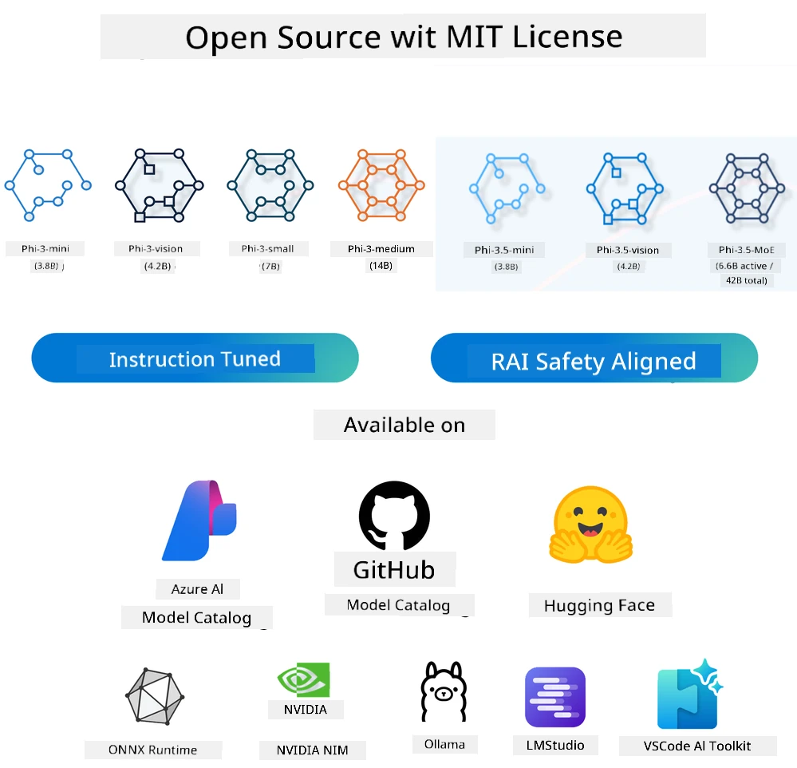
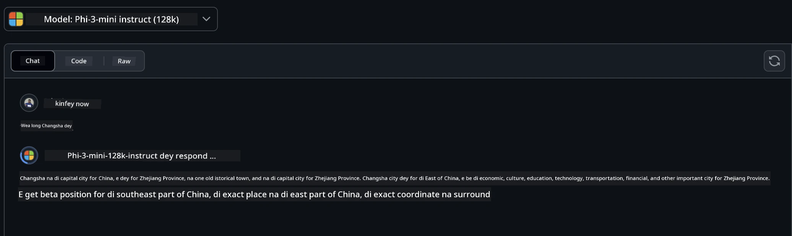
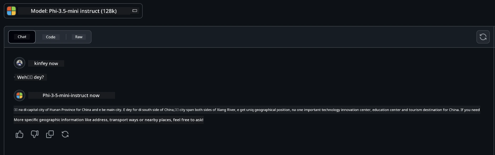

# Introduction to Small Language Models for Generative AI for Beginners
Generative AI na one kain area for artificial intelligence wey dey focus on how to create system wey fit generate new content. Dis content fit be text, image, music, or even full virtual environment. One of di most interesting way wey dem dey use generative AI na for language models.

## Wetin Be Small Language Models?

Small Language Model (SLM) na smaller version of di big language model (LLM), wey dey use di same architectural principles and techniques wey LLMs dey use, but e no dey use plenty computational resources like di big ones.

SLMs na one type of language model wey dem design to dey generate text wey be like wetin human go write. E no big like di big ones like GPT-4, but e dey more efficient, especially for places wey no get plenty computational resources. Even though e small, e still fit do plenty things. Normally, dem dey build SLMs by compress or distill di big LLMs, so e go still get plenty of di original model functionality and language ability. Di smaller size dey make am easy to use, e no dey use plenty memory or computational power. Even with di smaller size, SLMs fit still do plenty natural language processing (NLP) tasks:

- Text Generation: E dey create sentences or paragraphs wey make sense and dey relevant.
- Text Completion: E dey predict and finish sentences based on wetin you give am.
- Translation: E dey change text from one language to another.
- Summarization: E dey make long text short and easy to understand.

But e no dey perform reach di big ones or understand things deep like dem.

## How Small Language Models Dey Work?
SLMs dey train with plenty text data. As dem dey train am, e dey learn di pattern and structure of language, so e fit generate text wey correct and make sense. Di training process dey involve:

- Data Collection: Dem dey gather plenty text data from different places.
- Preprocessing: Dem dey clean and arrange di data so e go fit work for training.
- Training: Dem dey use machine learning algorithms to teach di model how e go understand and generate text.
- Fine-Tuning: Dem dey adjust di model to make e perform better for specific tasks.

Di way wey dem dey develop SLMs dey match di need for models wey fit work for places wey no get plenty resources, like mobile devices or edge computing platforms. SLMs dey focus on efficiency, so e go balance performance with accessibility, and e go fit work for plenty areas.


## Learning Objectives

For dis lesson, we wan introduce di knowledge of SLM and join am with Microsoft Phi-3 to learn different ways wey e fit work for text content, vision, and MoE.

By di end of dis lesson, you go fit answer di following questions:

- Wetin be SLM
- Wetin be di difference between SLM and LLM
- Wetin be Microsoft Phi-3/3.5 Family
- How to use Microsoft Phi-3/3.5 Family

Ready? Make we start.

## Di Difference Between Large Language Models (LLMs) and Small Language Models (SLMs)

Both LLMs and SLMs dey use di same machine learning principles, and dem dey follow similar ways for di design, training, data generation, and evaluation. But some things dey make dem different.

## Wetin Small Language Models Fit Do

SLMs get plenty ways wey dem fit use am, like:

- Chatbots: E dey help for customer support and dey talk with people like human.
- Content Creation: E dey help writers generate ideas or even write full articles.
- Education: E dey help students with writing assignments or to learn new languages.
- Accessibility: E dey create tools for people wey get disability, like text-to-speech systems.

**Size**
  
Di main difference between LLMs and SLMs na di size of di models. LLMs, like ChatGPT (GPT-4), fit get up to 1.76 trillion parameters, but open-source SLMs like Mistral 7B get only about 7 billion parameters. Dis difference dey because of di way dem design di models and train dem. For example, ChatGPT dey use self-attention mechanism inside encoder-decoder framework, but Mistral 7B dey use sliding window attention wey dey make training easy for decoder-only model. Dis difference for di design dey affect di complexity and performance of di models.

**Comprehension**

SLMs dey focus on performance for specific areas, so dem dey specialize well but dem no dey fit understand plenty things across different areas. LLMs dey try to act like human intelligence for plenty areas. Dem dey train with big and diverse datasets, so dem dey perform well for different areas. Dis make LLMs dey more flexible and fit do plenty tasks, like natural language processing and programming.

**Computing**

To train and use LLMs dey need plenty resources, like big GPU clusters. For example, to train ChatGPT from scratch fit need thousands of GPUs for long time. But SLMs, wey get smaller parameters, dey easy to use for places wey no get plenty resources. Models like Mistral 7B fit train and run for local machines wey get moderate GPU, even though training still dey take time.

**Bias**

Bias na one problem wey dey affect LLMs because of di kind training data wey dem dey use. Di data fit no represent some groups well, fit get wrong labeling, or fit show language bias because of dialect, location, or grammar rules. Di complex design of LLMs fit even make di bias worse if dem no fine-tune am well. SLMs, wey dem dey train with smaller and specific datasets, no dey get plenty bias like LLMs, but dem still fit get small bias.

**Inference**

Di smaller size of SLMs dey make dem fast for inference, so dem fit generate output quick for local hardware without needing plenty processing. LLMs, because of di size and complexity, dey need plenty computational resources to generate output fast. If plenty people dey use LLMs at di same time, e go slow down di response time, especially for big deployment.

To summarize, even though LLMs and SLMs dey use di same machine learning principles, dem get big difference for size, resources, understanding, bias, and inference speed. LLMs dey more flexible but e dey need plenty resources, while SLMs dey efficient for specific areas and no dey use plenty computational power.

***Note：For dis chapter, we go use Microsoft Phi-3 / 3.5 as example to explain SLM.***

## Wetin Be Phi-3 / Phi-3.5 Family

Phi-3 / 3.5 Family dey focus on text, vision, and Agent (MoE) application areas:

### Phi-3 / 3.5 Instruct

E dey focus on text generation, chat completion, and content information extraction.

**Phi-3-mini**

Di 3.8B language model dey available for Microsoft Azure AI Studio, Hugging Face, and Ollama. Phi-3 models dey perform better than language models wey get di same or bigger size for key benchmarks (di benchmark numbers dey below, higher numbers mean better). Phi-3-mini dey perform better than models wey big pass am, while Phi-3-small and Phi-3-medium dey perform better than bigger models, including GPT-3.5.

**Phi-3-small & medium**

Phi-3-small wey get 7B parameters dey perform better than GPT-3.5T for different language, reasoning, coding, and math benchmarks.

Phi-3-medium wey get 14B parameters dey continue di trend and e dey perform better than Gemini 1.0 Pro.

**Phi-3.5-mini**

Dis one na upgrade of Phi-3-mini. Even though di parameters no change, e dey support plenty languages (20+ languages: Arabic, Chinese, Czech, Danish, Dutch, English, Finnish, French, German, Hebrew, Hungarian, Italian, Japanese, Korean, Norwegian, Polish, Portuguese, Russian, Spanish, Swedish, Thai, Turkish, Ukrainian) and e dey support long context better.

Phi-3.5-mini wey get 3.8B parameters dey perform better than language models wey get di same size and e dey match models wey big pass am.

### Phi-3 / 3.5 Vision

We fit see di Instruct model of Phi-3/3.5 as di brain wey dey understand, and Vision na di eye wey dey help Phi understand di world.

**Phi-3-Vision**

Phi-3-vision wey get only 4.2B parameters dey perform better than bigger models like Claude-3 Haiku and Gemini 1.0 Pro V for general visual reasoning tasks, OCR, and table and diagram understanding tasks.

**Phi-3.5-Vision**

Phi-3.5-Vision na upgrade of Phi-3-Vision, e dey support multiple images. You fit see am as improvement for vision, e no dey only see pictures, e fit see videos too.

Phi-3.5-vision dey perform better than bigger models like Claude-3.5 Sonnet and Gemini 1.5 Flash for OCR, table and chart understanding tasks, and e dey match di bigger models for general visual knowledge reasoning tasks. E fit take multiple images as input and do reasoning on top di images.

### Phi-3.5-MoE

***Mixture of Experts(MoE)*** dey make models fit train with less compute, so you fit increase di model or dataset size with di same compute resources wey dense model dey use. MoE model fit reach di same quality as di dense model faster during training.

Phi-3.5-MoE get 16x3.8B expert modules. Phi-3.5-MoE wey get only 6.6B active parameters dey perform di same level of reasoning, language understanding, and math as bigger models.

We fit use di Phi-3/3.5 Family model based on different areas. Unlike LLM, you fit deploy Phi-3/3.5-mini or Phi-3/3.5-Vision for edge devices.

## How to Use Phi-3/3.5 Family Models

We wan use Phi-3/3.5 for different areas. Next, we go show how to use Phi-3/3.5 based on different areas.



### Inference Difference Cloud's API

**GitHub Models**

GitHub Models na di easiest way. You fit quickly access di Phi-3/3.5-Instruct model through GitHub Models. If you join am with Azure AI Inference SDK / OpenAI SDK, you fit use code to access di API and use Phi-3/3.5-Instruct. You fit also test different effects through Playground.

- Demo:Comparison of di effects of Phi-3-mini and Phi-3.5-mini for Chinese scenarios






**Azure AI Studio**

If you wan use di vision and MoE models, you fit use Azure AI Studio to access dem. If you wan learn more, you fit read di Phi-3 Cookbook to know how to use Phi-3/3.5 Instruct, Vision, MoE through Azure AI Studio [Click dis link](https://github.com/microsoft/Phi-3CookBook/blob/main/md/02.QuickStart/AzureAIStudio_QuickStart.md?WT.mc_id=academic-105485-koreyst)


**NVIDIA NIM**

Apart from di cloud-based Model Catalog solutions wey Azure and GitHub dey provide, you fit also use [Nivida NIM](https://developer.nvidia.com/nim?WT.mc_id=academic-105485-koreyst) to access di models. You fit visit NIVIDA NIM to use di API for di Phi-3/3.5 Family. NVIDIA NIM (NVIDIA Inference Microservices) na set of microservices wey dem design to help developers deploy AI models well for different environments, like cloud, data centers, and workstations.

Here be di key features of NVIDIA NIM:

- **Ease of Deployment:** NIM dey make am easy to deploy AI models with one command, so e go fit work well with di workflow wey you get.
- **Optimized Performance:** E dey use NVIDIA’s pre-optimized inference engines, like TensorRT and TensorRT-LLM, to make sure e fast and dey work well.
- **Scalability:** NIM fit scale automatically for Kubernetes, so e go fit handle different workloads well.
- **Security and Control:** Organizations fit keep control of dia data and applications by hosting NIM microservices for dia own managed infrastructure.
- **Standard APIs:** NIM dey provide industry-standard APIs wey make am easy to build and connect AI applications like chatbots, AI assistants, and others.

NIM na part of NVIDIA AI Enterprise, wey dey try make deployment and operationalization of AI models simple, and make sure say dem dey run well for NVIDIA GPUs.

- Demo: How to use Nividia NIM to call Phi-3.5-Vision-API  [[Click dis link](./python/Phi-3-Vision-Nividia-NIM.ipynb?WT.mc_id=academic-105485-koreyst)]


### Inference Phi-3/3.5 for local environment
Inference for Phi-3, or any language model like GPT-3, mean di process wey e dey use to generate answers or predictions based on di input wey e receive. If you give Phi-3 prompt or question, e go use di neural network wey dem train am with to find di most likely and relevant answer by checking di patterns and relationships for di data wey dem train am with.

**Hugging Face Transformer**
Hugging Face Transformers na strong library wey dem design for natural language processing (NLP) and other machine learning tasks. Dis na di main things about am:

1. **Pretrained Models**: E get thousands of pretrained models wey you fit use for different tasks like text classification, named entity recognition, question answering, summarization, translation, and text generation.

2. **Framework Interoperability**: Di library dey support many deep learning frameworks like PyTorch, TensorFlow, and JAX. Dis one mean say you fit train model for one framework and use am for another one.

3. **Multimodal Capabilities**: Apart from NLP, Hugging Face Transformers dey also support tasks for computer vision (like image classification, object detection) and audio processing (like speech recognition, audio classification).

4. **Ease of Use**: Di library get APIs and tools wey make am easy to download and fine-tune models, so e dey good for both beginners and experts.

5. **Community and Resources**: Hugging Face get strong community and plenty documentation, tutorials, and guides wey go help users start and use di library well.
[official documentation](https://huggingface.co/docs/transformers/index?WT.mc_id=academic-105485-koreyst) or dia [GitHub repository](https://github.com/huggingface/transformers?WT.mc_id=academic-105485-koreyst).

Dis na di most common method, but e need GPU acceleration. After all, scenes like Vision and MoE need plenty calculations, and CPU go dey very slow if dem no quantize am.


- Demo:How to use Transformer to call Phi-3.5-Instuct [Click dis link](./python/phi35-instruct-demo.ipynb?WT.mc_id=academic-105485-koreyst)

- Demo:How to use Transformer to call Phi-3.5-Vision[Click dis link](./python/phi35-vision-demo.ipynb?WT.mc_id=academic-105485-koreyst)

- Demo:How to use Transformer to call Phi-3.5-MoE[Click dis link](./python/phi35_moe_demo.ipynb?WT.mc_id=academic-105485-koreyst)

**Ollama**
[Ollama](https://ollama.com/?WT.mc_id=academic-105485-koreyst) na platform wey dem design to make am easy to run big language models (LLMs) for your machine. E dey support different models like Llama 3.1, Phi 3, Mistral, and Gemma 2, among others. Di platform dey simplify di process by putting model weights, configuration, and data inside one package, so e go dey easy for users to customize and create dia own models. Ollama dey available for macOS, Linux, and Windows. E dey good if you wan test or deploy LLMs without using cloud services. Ollama na di most direct way, you just need to run di statement wey dey below.


```bash

ollama run phi3.5

```


**ONNX Runtime for GenAI**

[ONNX Runtime](https://github.com/microsoft/onnxruntime-genai?WT.mc_id=academic-105485-koreyst) na cross-platform inference and training machine-learning accelerator. ONNX Runtime for Generative AI (GENAI) na strong tool wey go help you run generative AI models well for different platforms. 

## Wetin be ONNX Runtime?
ONNX Runtime na open-source project wey dey enable high-performance inference of machine learning models. E dey support models wey dey for Open Neural Network Exchange (ONNX) format, wey be standard for representing machine learning models. ONNX Runtime inference fit make customer experience faster and reduce cost, e dey support models from deep learning frameworks like PyTorch and TensorFlow/Keras as well as classical machine learning libraries like scikit-learn, LightGBM, XGBoost, etc. ONNX Runtime dey work with different hardware, drivers, and operating systems, and e dey provide better performance by using hardware accelerators where e dey possible plus graph optimizations and transforms.

## Wetin be Generative AI?
Generative AI na AI systems wey fit create new content, like text, images, or music, based on di data wey dem train am with. Examples na language models like GPT-3 and image generation models like Stable Diffusion. ONNX Runtime for GenAI library dey provide di generative AI loop for ONNX models, including inference with ONNX Runtime, logits processing, search and sampling, and KV cache management.

## ONNX Runtime for GENAI
ONNX Runtime for GENAI dey expand di features of ONNX Runtime to support generative AI models. Dis na di main features:

- **Broad Platform Support:** E dey work for different platforms, like Windows, Linux, macOS, Android, and iOS.
- **Model Support:** E dey support many popular generative AI models, like LLaMA, GPT-Neo, BLOOM, and others.
- **Performance Optimization:** E get optimizations for different hardware accelerators like NVIDIA GPUs, AMD GPUs, and others.
- **Ease of Use:** E dey provide APIs wey make am easy to add am to applications, so you fit generate text, images, and other content with small code.
- Users fit call high level generate() method, or run each iteration of di model inside loop, dey generate one token at a time, and fit change generation parameters inside di loop.
- ONNX runtime also dey support greedy/beam search and TopP, TopK sampling to generate token sequences and e get built-in logits processing like repetition penalties. You fit also add custom scoring easily.

## How to Start
To start with ONNX Runtime for GENAI, you fit follow dis steps:

### Install ONNX Runtime:
```Python
pip install onnxruntime
```
### Install di Generative AI Extensions:
```Python
pip install onnxruntime-genai
```

### Run Model: Dis na simple example for Python:
```Python
import onnxruntime_genai as og

model = og.Model('path_to_your_model.onnx')

tokenizer = og.Tokenizer(model)

input_text = "Hello, how are you?"

input_tokens = tokenizer.encode(input_text)

output_tokens = model.generate(input_tokens)

output_text = tokenizer.decode(output_tokens)

print(output_text) 
```
### Demo:How to use ONNX Runtime GenAI to call Phi-3.5-Vision


```python

import onnxruntime_genai as og

model_path = './Your Phi-3.5-vision-instruct ONNX Path'

img_path = './Your Image Path'

model = og.Model(model_path)

processor = model.create_multimodal_processor()

tokenizer_stream = processor.create_stream()

text = "Your Prompt"

prompt = "<|user|>\n"

prompt += "<|image_1|>\n"

prompt += f"{text}<|end|>\n"

prompt += "<|assistant|>\n"

image = og.Images.open(img_path)

inputs = processor(prompt, images=image)

params = og.GeneratorParams(model)

params.set_inputs(inputs)

params.set_search_options(max_length=3072)

generator = og.Generator(model, params)

while not generator.is_done():

    generator.compute_logits()
    
    generator.generate_next_token()

    new_token = generator.get_next_tokens()[0]
    
    code += tokenizer_stream.decode(new_token)
    
    print(tokenizer_stream.decode(new_token), end='', flush=True)

```


**Others**

Apart from ONNX Runtime and Ollama reference methods, we fit also use di reference of quantitative models based on di model reference methods wey different manufacturers provide. Like Apple MLX framework with Apple Metal, Qualcomm QNN with NPU, Intel OpenVINO with CPU/GPU, etc. You fit also get more content from [Phi-3 Cookbook](https://github.com/microsoft/phi-3cookbook?WT.mc_id=academic-105485-koreyst)


## More

We don learn di basics of Phi-3/3.5 Family, but to sabi more about SLM we need more knowledge. You fit find di answers for di Phi-3 Cookbook. If you wan learn more, abeg visit di [Phi-3 Cookbook](https://github.com/microsoft/phi-3cookbook?WT.mc_id=academic-105485-koreyst).

---

<!-- CO-OP TRANSLATOR DISCLAIMER START -->
**Disclaimer**:  
Dis dokyument don use AI translet service [Co-op Translator](https://github.com/Azure/co-op-translator) do di translet. Even as we dey try make am accurate, abeg make you sabi say AI translet fit get mistake or no dey correct well. Di original dokyument wey dey for im native language na di one wey you go take as di correct source. For important mata, e good make you use professional human translet. We no go fit take blame for any misunderstanding or wrong interpretation wey fit happen because you use dis translet.
<!-- CO-OP TRANSLATOR DISCLAIMER END -->