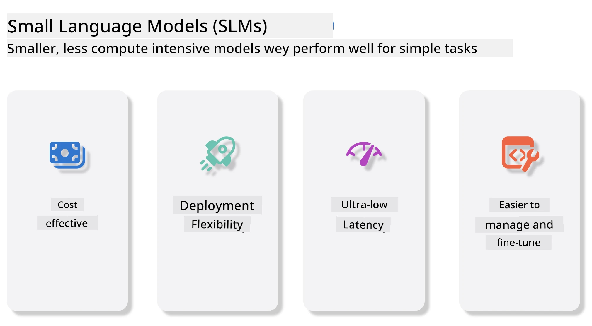
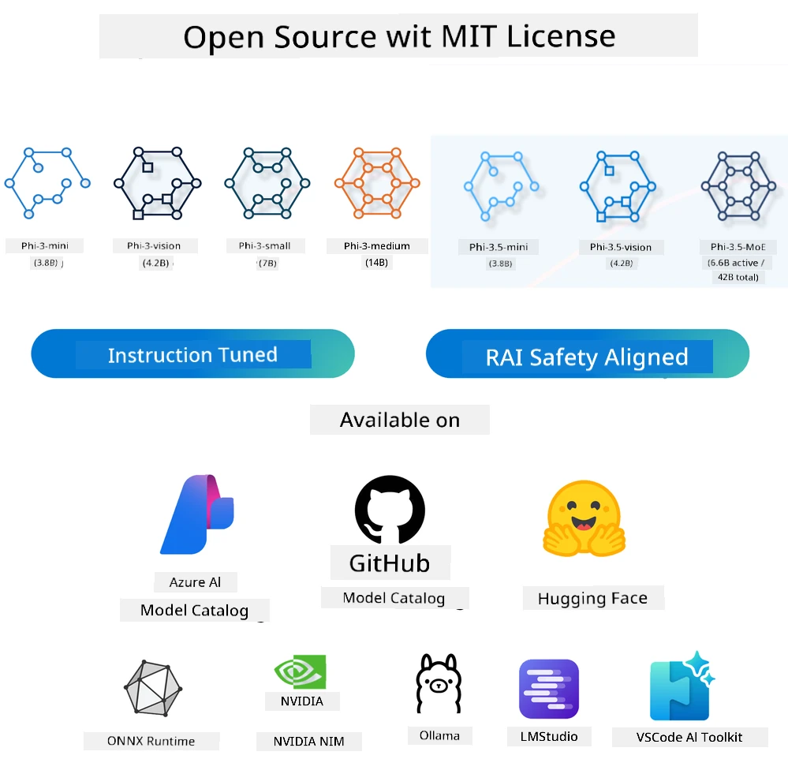
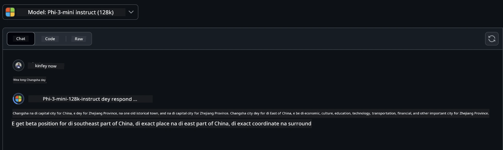
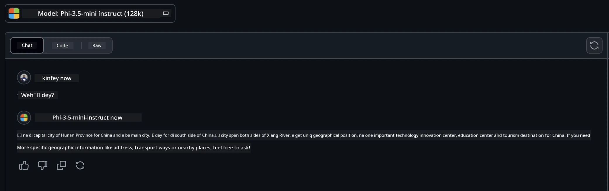

# Introduction to Small Language Models for Generative AI for Beginners
Generative AI na one kain interesting artificial intelligence wey dey focus on to create systems wey fit generate new content. Dis content fit range from text and images to music and even full virtual environments. One of di most exciting tins wey generative AI fit do na for language models.

## Wetin Be Small Language Models?

Small Language Model (SLM) na small version of big language model (LLM), wey still dey use many of di architectural principles and techniques of LLMs, but get way smaller computational footprint.

SLMs na subset of language models wey dem design to generate text wey sound like human talk. No be like their bigger brothers like GPT-4, SLMs small and efficient, so dem good for tings wey no get enough computational resources. Even though dem small, dem still fit do plenty different tasks. Normally, SLMs dey made by compressing or distilling LLMs, make dem still fit keep majority of di original model's features and language skill. Di small size make di model no too complex, so SLMs dey efficient for both memory usage and computation. Even with all dis optimizations, SLMs fit still do plenty natural language processing (NLP) tasks:

- Text Generation: To create sentences or paragraphs wey make sense and fit di context.
- Text Completion: To predict and finish sentences based on one prompt.
- Translation: To convert text from one language to another.
- Summarization: To make long text short and easy to understand.

But e get some trade-offs for how dem perform or how deep dem understand if you compare to di big ones.

## How Small Language Models Dey Work?
SLMs dey trained on plenty text data. During training, dem dey learn di patterns and structure of language so dem fit generate text wey dey grammatically correct and make sense for di context. Training process involve:

- Data Collection: Gather plenty datasets of text from different sources.
- Preprocessing: Clean and arrange di data to make am ready for training.
- Training: Use machine learning algorithms to teach di model how to understand and generate text.
- Fine-Tuning: Adjust di model to make am perform better for certain tasks.

Di development of SLMs dey follow di need to get models wey fit work for environment wey get small resources, like mobile devices or edge computing platforms, where full big LLMs no too work because dem heavy for resources. By focusing on efficiency, SLMs balance performance with accessibility, make people fit use dem for many different fields.



## Learning Objectives

For dis lesson, we want to introduce the knowledge of SLM and join am with Microsoft Phi-3 to learn different scenarios for text content, vision and MoE.

By di time you finish dis lesson, you suppose fit answer these questions:

- Wetin be SLM?
- Wetin be di difference between SLM and LLM?
- Wetin be Microsoft Phi-3/3.5 Family?
- How you go run inference with Microsoft Phi-3/3.5 Family?

Ready? Make we begin.

## The Differences between Large Language Models (LLMs) and Small Language Models (SLMs)

Both LLMs and SLMs suppose base on basic principles of probabilistic machine learning, dey use similar architecture design, training methods, data production, and evaluation techniques. But some important factors make dem different.

## Applications of Small Language Models

SLMs fit do plenty tings like:

- Chatbots: To give customer support and talk with users like normal conversation.
- Content Creation: Help writers generate ideas or even draft whole articles.
- Education: Help students with writing homework or learning new languages.
- Accessibility: Create tools for people wey get disabilities, like text-to-speech systems.

**Size**
  
Big difference between LLMs and SLMs na size of di models. LLMs like ChatGPT (GPT-4) fit get about 1.76 trillion parameters, while open-source SLMs like Mistral 7B get way fewer parameters—about 7 billion. Dis difference dey mainly because of di architecture and training process. For example, ChatGPT get self-attention mechanism inside encoder-decoder framework, but Mistral 7B dey use sliding window attention, wey dey make training more efficient for a decoder-only model. Dis difference for architecture get big effect on how complex di model be and how e perform.

**Comprehension**

SLMs dey optimize to perform well inside certain domains, so dem get special skills but fit no understand many different areas well. But LLMs dey try to imitate human-like intelligence across broad range. Dem receive training on big, diverse datasets, so LLMs fit do well for many different fields, and dem flexible. So LLMs better for many different tasks like natural language processing and programming.

**Computing**

Training and using LLMs dey heavy on resources, often need big infrastructure like lots of GPU clusters. For example, to train model like ChatGPT from zero fit need thousands GPUs over long time. But SLMs, because dem get fewer parameters, dem dey easier for machines wey no get plenty computing power. Models like Mistral 7B fit train and run on local machines with average GPU power, although training still fit take some hours using multiple GPUs.

**Bias**

Bias na well-known problem for LLMs because di training data nature. Dem dey use raw, openly available data from internet, wey fit no properly represent certain groups, fit get wrong labeling, or fit carry linguistic biases from dialect, geography, and grammar. Also LLM architecture complexity fit make bias worse, wey fit hard to see unless carefully fine-tuned. But SLMs, because dem train on limited, domain-specific datasets, no too suffer from bias like dat, but dem no completely free from am.

**Inference**

Small size of SLMs give dem big advantage for inference speed, so dem fit generate result fast lo local hardware without need for big parallel computing. Big LLMs need plenty parallel computing to get acceptable inference speed. When many users dey use di system at once, LLMs response get slow, especially if dem dey deployed for big scale.

Overall, LLMs and SLMs base on di same basics for machine learning, but differ in size, resource need, context understanding, bias sensitivity, and inference speed. Dem fit do different work based on wetin person need: LLMs dey versatile but heavy, SLMs dey efficient for specific domains and low resource use.

***Note: For dis lesson, we go use Microsoft Phi-3 / 3.5 as example to introduce SLM.***

## Introduce Phi-3 / Phi-3.5 Family

Phi-3 / 3.5 Family mainly focus on text, vision, and Agent (MoE) application scenarios:

### Phi-3 / 3.5 Instruct

Mainly for text generation, chat completion, and content information extraction, etc.

**Phi-3-mini**

Di 3.8B language model dey available for Microsoft Azure AI Studio, Hugging Face, and Ollama. Phi-3 models dey significantly better pass language models wey get same size or bigger for important benchmarks (see benchmark numbers below, high number better). Phi-3-mini pass models wey twice im size, and Phi-3-small and Phi-3-medium pass larger models, including GPT-3.5.

**Phi-3-small & medium**

With only 7B parameters, Phi-3-small pass GPT-3.5T for many language, reasoning, coding, and math benchmarks.

Phi-3-medium with 14B parameters continue this level and pass Gemini 1.0 Pro.

**Phi-3.5-mini**

You fit think am like upgrade of Phi-3-mini. Parameters no change, but im improve support for multiple languages (support 20+ languages: Arabic, Chinese, Czech, Danish, Dutch, English, Finnish, French, German, Hebrew, Hungarian, Italian, Japanese, Korean, Norwegian, Polish, Portuguese, Russian, Spanish, Swedish, Thai, Turkish, Ukrainian) and add better support for long context.

Phi-3.5-mini with 3.8B parameters pass language models of same size and dey equal to models twice im size.

### Phi-3 / 3.5 Vision

You fit think of Phi-3/3.5 Instruct model as Phi power to understand, and Vision na wat make Phi get eyes to see and understand world.


**Phi-3-Vision**

Phi-3-vision wey get only 4.2B parameters dey continue this level and fit pass bigger models like Claude-3 Haiku and Gemini 1.0 Pro V for general visual reasoning tasks, OCR, and table and diagram understanding.


**Phi-3.5-Vision**

Phi-3.5-Vision na upgrade of Phi-3-Vision, e add support for multiple images. You fit think am as better vision, you no go fit see pictures only, you fit also see videos.

Phi-3.5-vision pass bigger models like Claude-3.5 Sonnet and Gemini 1.5 Flash for OCR, table and chart understanding tasks and equal for general visual knowledge reasoning tasks. E support multi-frame input, wey mean e fit reason multiple pictures together.


### Phi-3.5-MoE

***Mixture of Experts (MoE)*** make models fit train with way less compute, so you fit scale model or dataset size big big, using di same compute budget wey normal dense model dey use. Especially, MoE model suppose reach same quality as dense model faster during pretraining.

Phi-3.5-MoE get 16x3.8B expert modules. Phi-3.5-MoE with only 6.6B active parameters fit get reasoning, language understanding, and math level wey near big models.

You fit use Phi-3/3.5 Family model for different scenarios. Unlike LLM, you fit deploy Phi-3/3.5-mini or Phi-3/3.5-Vision on edge devices.


## How to use Phi-3/3.5 Family models

We want use Phi-3/3.5 for different scenarios. Next, we go use Phi-3/3.5 for different scenarios.



### Inference via Cloud APIs

**GitHub Models**

GitHub Models na di easiest way. You fit quickly access Phi-3/3.5-Instruct model on GitHub Models. Join am with Azure AI Inference SDK / OpenAI SDK, you fit use code to call Phi-3/3.5-Instruct API. You fit also try different things through Playground.

- Demo: Comparison of Phi-3-mini and Phi-3.5-mini performance for Chinese scenarios






**Azure AI Studio**

If you want use vision and MoE models, you fit use Azure AI Studio to do am. If you like, you fit read Phi-3 Cookbook to learn how to call Phi-3/3.5 Instruct, Vision, MoE using Azure AI Studio [Click this link](https://github.com/microsoft/Phi-3CookBook/blob/main/md/02.QuickStart/AzureAIStudio_QuickStart.md?WT.mc_id=academic-105485-koreyst)


**NVIDIA NIM**

Besides cloud Model Catalog solutions from Azure and GitHub, you fit also use [NVIDIA NIM](https://developer.nvidia.com/nim?WT.mc_id=academic-105485-koreyst) to do related calls. You fit visit NVIDIA NIM to do API calls for Phi-3/3.5 Family. NVIDIA NIM (NVIDIA Inference Microservices) na set of accelerated inference microservices wey make am easy for developers to deploy AI models well-well across different places like cloud, data centers, and workstations.

Here are some key features of NVIDIA NIM:
- **Ease of Deployment:** NIM dey allow deployment of AI models wit just one command, e make am easy to fit inside your current workflow dem.  
- **Optimized Performance:** E dey use NVIDIA pre-optimized inference engines like TensorRT and TensorRT-LLM to make sure say e get low latency and high throughput.  
- **Scalability:** NIM dey support autoscaling for Kubernetes, so e fit handle different kain workloads well well.  
- **Security and Control:** Organizations fit hold control of their data and applications by self-hosting NIM microservices for their own managed infrastructure.  
- **Standard APIs:** NIM dey provide industry-standard APIs, e make am easy to build and integrate AI applications like chatbots, AI assistants, and more.  

NIM na part of NVIDIA AI Enterprise, wey dey aim to make deployment and running AI models easier, so dem fit run well for NVIDIA GPUs.  

- Demo: Using NVIDIA NIM to call Phi-3.5-Vision-API  [[Click this link](./python/Phi-3-Vision-Nividia-NIM.ipynb?WT.mc_id=academic-105485-koreyst)]  


### Running Phi-3/3.5 Locally  
Inference for Phi-3, or any language model like GPT-3, mean say na di process where e generate response or prediction based on wetin you give am. When you give Phi-3 prompt or question, e dey use im trained neural network to infer di most probable and relevant answer by analyzing patterns and relationships for di data wey e train on.  

**Hugging Face Transformer**  
Hugging Face Transformers na powerful library wey dem design for natural language processing (NLP) and other machine learning tasks. Here be some main points about am:  

1. **Pretrained Models**: E get thousands of pretrained models wey fit use for different tasks like text classification, named entity recognition, question answering, summarization, translation, and text generation.  

2. **Framework Interoperability**: Di library dey support plenty deep learning frameworks, including PyTorch, TensorFlow, and JAX. This one mean say you fit train model for one framework, and use am for another.  

3. **Multimodal Capabilities**: Besides NLP, Hugging Face Transformers still support computer vision work like image classification, object detection, and audio processing like speech recognition, audio classification.  

4. **Ease of Use**: Di library get APIs and tools to easily download and fine-tune models, so e easy to use both for beginners and experts.  

5. **Community and Resources**: Hugging Face get strong community with plenty documentation, tutorials, and guides to help users start well well and use di library beta.  
[official documentation](https://huggingface.co/docs/transformers/index?WT.mc_id=academic-105485-koreyst) or their [GitHub repository](https://github.com/huggingface/transformers?WT.mc_id=academic-105485-koreyst).  

Na di most popular method to use, but e still need GPU acceleration. After all, cases like Vision and MoE need plenty calculations, e go slow well well for CPU if dem no quantize am.  

- Demo: Using Transformer to call Phi-3.5-Instruct [Click this link](./python/phi35-instruct-demo.ipynb?WT.mc_id=academic-105485-koreyst)  

- Demo: Using Transformer to call Phi-3.5-Vision [Click this link](./python/phi35-vision-demo.ipynb?WT.mc_id=academic-105485-koreyst)  

- Demo: Using Transformer to call Phi-3.5-MoE [Click this link](./python/phi35_moe_demo.ipynb?WT.mc_id=academic-105485-koreyst)  

**Ollama**  
[Ollama](https://ollama.com/?WT.mc_id=academic-105485-koreyst) na platform wey dem design to make am easy to run large language models (LLMs) locally for your machine. E dey support models like Llama 3.1, Phi 3, Mistral, and Gemma 2 among others. Di platform simplify the process by bundling model weights, configuration, and data as one package, so e easy for users to customize and create their own models. Ollama dey available for macOS, Linux, and Windows. E good tool if you wan experiment or deploy LLMs without use cloud services. Ollama na di most direct way, you just need to run this command.  

```bash

ollama run phi3.5

```
  

**ONNX Runtime for GenAI**  

[ONNX Runtime](https://github.com/microsoft/onnxruntime-genai?WT.mc_id=academic-105485-koreyst) na cross-platform inference and training machine-learning accelerator. ONNX Runtime for Generative AI (GENAI) na powerful tool wey help you run generative AI models well for different platforms.  

## Wetin be ONNX Runtime?  
ONNX Runtime na open-source project wey allow high-performance inference of machine learning models. E dey support models wey dey Open Neural Network Exchange (ONNX) format, wey be standard for representing machine learning models. ONNX Runtime inference fit help make customer experience faster and reduce cost, e dey support models from deep learning frameworks like PyTorch and TensorFlow/Keras, plus classical machine learning libraries like scikit-learn, LightGBM, XGBoost, and others. ONNX Runtime fit run for different hardware, drivers, and operating systems, e dey give best performance by using hardware accelerators where e fit, plus graph optimizations and transforms.  

## Wetin be Generative AI?  
Generative AI na AI systems wey fit create new content like text, images, or music based on data dem train on. Examples include language models like GPT-3 and image generation models like Stable Diffusion. ONNX Runtime for GenAI library dey provide generative AI loop for ONNX models, including inference with ONNX Runtime, logits processing, search and sampling, and KV cache management.  

## ONNX Runtime for GENAI  
ONNX Runtime for GENAI extend ONNX Runtime to support generative AI models. Here be some main features:  

- **Broad Platform Support:** E dey work for many platforms, including Windows, Linux, macOS, Android, and iOS.  
- **Model Support:** E support many popular generative AI models like LLaMA, GPT-Neo, BLOOM and more.  
- **Performance Optimization:** E get optimizations for different hardware accelerators like NVIDIA GPUs, AMD GPUs, and more.  
- **Ease of Use:** E provide APIs to easily put am inside applications, so you fit generate text, images, and other content with small code.  
- Users fit call high level generate() method, or run each time of the model for loop, generating one token per time, and fit update generation parameters inside di loop if dem want.  
- ONNX runtime still get support for greedy/beam search and TopP, TopK sampling to generate token sequences and e get built-in logits processing like repetition penalties. You fit add your own custom scoring easy.  

## How to Start  
To start with ONNX Runtime for GENAI, you fit follow these steps:  

### Install ONNX Runtime:  
```Python
pip install onnxruntime
```
### Install the Generative AI Extensions:  
```Python
pip install onnxruntime-genai
```
  
### Run a Model: Here be simple example for Python:  
```Python
import onnxruntime_genai as og

model = og.Model('path_to_your_model.onnx')

tokenizer = og.Tokenizer(model)

input_text = "Hello, how are you?"

input_tokens = tokenizer.encode(input_text)

output_tokens = model.generate(input_tokens)

output_text = tokenizer.decode(output_tokens)

print(output_text) 
```
### Demo:Using ONNX Runtime GenAI to call Phi-3.5-Vision  

```python

import onnxruntime_genai as og

model_path = './Your Phi-3.5-vision-instruct ONNX Path'

img_path = './Your Image Path'

model = og.Model(model_path)

processor = model.create_multimodal_processor()

tokenizer_stream = processor.create_stream()

text = "Your Prompt"

prompt = "<|user|>\n"

prompt += "<|image_1|>\n"

prompt += f"{text}<|end|>\n"

prompt += "<|assistant|>\n"

image = og.Images.open(img_path)

inputs = processor(prompt, images=image)

params = og.GeneratorParams(model)

params.set_inputs(inputs)

params.set_search_options(max_length=3072)

generator = og.Generator(model, params)

while not generator.is_done():

    generator.compute_logits()
    
    generator.generate_next_token()

    new_token = generator.get_next_tokens()[0]
    
    output = tokenizer_stream.decode(new_token)
    
    print(tokenizer_stream.decode(new_token), end='', flush=True)

```
  

**Others**  

Besides ONNX Runtime and Ollama reference methods, we fit also complete the reference of quantitative models based on model reference methods from different manufacturers. For example, Apple MLX framework with Apple Metal, Qualcomm QNN with NPU, Intel OpenVINO with CPU/GPU, and others. You fit also find more content from [Phi-3 Cookbook](https://github.com/microsoft/phi-3cookbook?WT.mc_id=academic-105485-koreyst).  

## More  

We don learn the basics of Phi-3/3.5 Family, but to sabi more about SLM we go need more knowledge. You fit find the answers for the Phi-3 Cookbook. If you wan learn more, abeg visit the [Phi-3 Cookbook](https://github.com/microsoft/phi-3cookbook?WT.mc_id=academic-105485-koreyst).

---

<!-- CO-OP TRANSLATOR DISCLAIMER START -->
**Disclaimer**:  
Dis document na dem translate am wit AI translation service wey dem dey call [Co-op Translator](https://github.com/Azure/co-op-translator). Even though we try make am correct, abeg sabi say automated translation fit get some mistakes or no too correct. Di original document wey e dey for im own language na di correct one. If na serious matter, better make human professional translate am. We no go responsible if person misunderstand or reason wrong because of dis translation.
<!-- CO-OP TRANSLATOR DISCLAIMER END -->