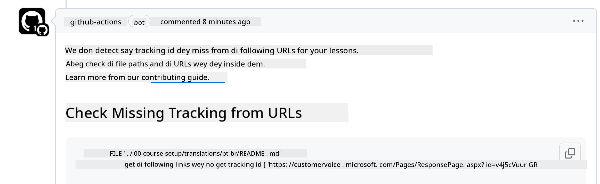

<!--
CO_OP_TRANSLATOR_METADATA:
{
  "original_hash": "57c41f2af71001a2cff9d8eb797cb843",
  "translation_date": "2025-11-12T08:48:37+00:00",
  "source_file": "CONTRIBUTING.md",
  "language_code": "pcm"
}
-->
# Contributin

Dis project dey welcome contribution and suggestion. Most contribution go need make you agree to Contributor License Agreement (CLA) wey go show say you get di right to, and you dey really give us di right to use wetin you contribute. For more info, go <https://cla.microsoft.com>.

> Important: wen you dey translate text for dis repo, abeg no use machine translation. We go check di translation wit di community, so abeg only volunteer for language wey you sabi well.

Wen you submit pull request, CLA-bot go automatically check if you need to provide CLA and go mark di PR well (e.g., label, comment). Just follow di instruction wey di bot give you. You go only need do dis one time for all di repositories wey dey use our CLA.

## Code of Conduct

Dis project don adopt di [Microsoft Open Source Code of Conduct](https://opensource.microsoft.com/codeofconduct/?WT.mc_id=academic-105485-koreyst).
For more info, read di [Code of Conduct FAQ](https://opensource.microsoft.com/codeofconduct/faq/?WT.mc_id=academic-105485-koreyst) or contact [opencode@microsoft.com](mailto:opencode@microsoft.com) if you get any extra question or comment.

## Question or Problem?

Abeg no open GitHub issues for general support question because di GitHub list na for feature request and bug report. Dis one go help us track di real issues or bugs from di code and keep di general talk separate from di code.

## Typos, Issues, Bugs and contribution

Anytime you wan submit change for di Generative AI for Beginners repository, abeg follow dis recommendation.

* Always fork di repository go your own account before you make di change
* No join plenty change for one pull request. Example, submit bug fix and documentation update as separate PRs
* If your pull request get merge conflict, make sure say you update your local main to match wetin dey di main repository before you make di change
* If you dey submit translation, abeg create one PR for all di translated files because we no dey accept half translation for di content
* If you dey submit typo or documentation fix, you fit join di change for one PR if e dey okay

## General Guidance for writing

- Make sure say all your URLs dey inside square bracket wey get parenthesis without extra space around or inside dem ``.
- Make sure say any relative link (i.e. link to other files and folders for di repository) dey start wit `./` wey dey refer to file or folder for di current working directory or `../` wey dey refer to file or folder for di parent working directory.
- Make sure say any relative link (i.e. link to other files and folders for di repository) get tracking ID (i.e. `?` or `&` then `wt.mc_id=` or `WT.mc_id=`) for di end.
- Make sure say any URL from di following domains _github.com, microsoft.com, visualstudio.com, aka.ms, and azure.com_ get tracking ID (i.e. `?` or `&` then `wt.mc_id=` or `WT.mc_id=`) for di end.
- Make sure say your links no get country specific locale inside dem (i.e. `/en-us/` or `/en/`).
- Make sure say all images dey inside di `./images` folder.
- Make sure say di images get descriptive name wey use English characters, numbers, and dash for di name.

## GitHub Workflows

Wen you submit pull request, four different workflows go run to check di rules wey we don talk.
Just follow di instruction wey dey here to pass di workflow checks.

- [Check Broken Relative Paths](../..)
- [Check Paths Have Tracking](../..)
- [Check URLs Have Tracking](../..)
- [Check URLs Don't Have Locale](../..)

### Check Broken Relative Paths

Dis workflow dey make sure say any relative path for your files dey work.
Dis repository dey deploy to GitHub pages so you need to type di links well make e no mislead person.

To make sure say your links dey work well, use VS code to check am.

Example, wen you hover over any link for your files, VS code go show you say make you press **ctrl + click** to follow di link.

If you click di link and e no work locally, e mean say e go trigger di workflow and e no go work for GitHub.

To fix dis issue, try type di link wit di help of VS code.

Wen you type `./` or `../` VS code go show you di available options wey match wetin you type.

Follow di path by clicking di file or folder wey you want and you go dey sure say your path no break.

Once you add di correct relative path, save am, and push your change, di workflow go run again to check your change.
If you pass di check, you dey good to go.

### Check Paths Have Tracking

Dis workflow dey make sure say any relative path get tracking inside am.
Dis repository dey deploy to GitHub pages so we need to track di movement between di different files and folders.

To make sure say your relative paths get tracking inside dem, just check for dis text `?wt.mc_id=` for di end of di path.
If e dey for your relative paths, you go pass dis check.

If e no dey, you fit see dis error.

To fix dis issue, try open di file path wey di workflow highlight and add di tracking ID for di end of di relative paths.

Once you add di tracking ID, save am, and push your change, di workflow go run again to check your change.
If you pass di check, you dey good to go.

### Check URLs Have Tracking

Dis workflow dey make sure say any web URL get tracking inside am.
Dis repository dey available to everybody so you need to make sure say you dey track di access to know where di traffic dey come from.

To make sure say your URLs get tracking inside dem, just check for dis text `?wt.mc_id=` for di end of di URL.
If e dey for your URLs, you go pass dis check.

If e no dey, you fit see dis error.

To fix dis issue, try open di file path wey di workflow highlight and add di tracking ID for di end of di URLs.

Once you add di tracking ID, save am, and push your change, di workflow go run again to check your change.
If you pass di check, you dey good to go.

### Check URLs Don't Have Locale

Dis workflow dey make sure say any web URL no get country specific locale inside am.
Dis repository dey available to everybody for di world so you need to make sure say you no add your country locale for URLs.

To make sure say your URLs no get country locale inside dem, just check for dis text `/en-us/` or `/en/` or any other language locale anywhere for di URL.
If e no dey for your URLs, you go pass dis check.

If e dey, you fit see dis error.

To fix dis issue, try open di file path wey di workflow highlight and remove di country locale from di URLs.

Once you remove di country locale, save am, and push your change, di workflow go run again to check your change.
If you pass di check, you dey good to go.

Congratulations! We go reach out to you as soon as possible wit feedback about your contribution.

---

<!-- CO-OP TRANSLATOR DISCLAIMER START -->
**Disclaimer**:  
Dis dokyument don translate wit AI translation service [Co-op Translator](https://github.com/Azure/co-op-translator). Even as we dey try make am accurate, abeg sabi say machine translation fit get mistake or no dey correct well. Di original dokyument for im native language na di main source wey you go fit trust. For important mata, na beta make you use professional human translation. We no go fit take blame for any misunderstanding or wrong interpretation wey fit happen because you use dis translation.
<!-- CO-OP TRANSLATOR DISCLAIMER END -->