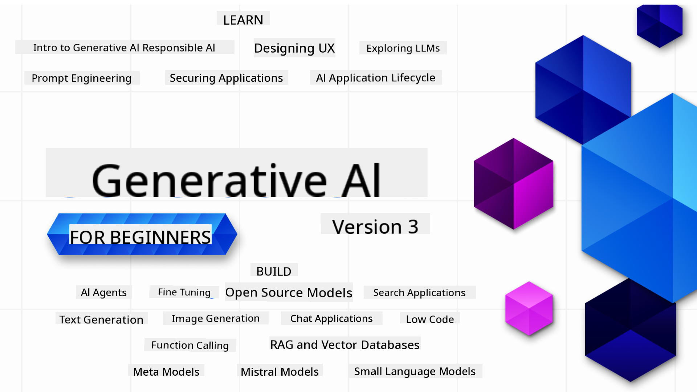

<!--
CO_OP_TRANSLATOR_METADATA:
{
  "original_hash": "d90bfd4a5d8b43f1d616dbc6e9dc8342",
  "translation_date": "2025-11-12T08:49:28+00:00",
  "source_file": "README.md",
  "language_code": "pcm"
}
-->

### 21 Lessons wey go teach you wetin you need sabi to start dey build Generative AI apps

### 🌐 Multi-Language Support

#### E dey work wit GitHub Action (Automated & Always Up-to-Date)

[Arabic](../ar/README.md) | [Bengali](../bn/README.md) | [Bulgarian](../bg/README.md) | [Burmese (Myanmar)](../my/README.md) | [Chinese (Simplified)](../zh/README.md) | [Chinese (Traditional, Hong Kong)](../hk/README.md) | [Chinese (Traditional, Macau)](../mo/README.md) | [Chinese (Traditional, Taiwan)](../tw/README.md) | [Croatian](../hr/README.md) | [Czech](../cs/README.md) | [Danish](../da/README.md) | [Dutch](../nl/README.md) | [Estonian](../et/README.md) | [Finnish](../fi/README.md) | [French](../fr/README.md) | [German](../de/README.md) | [Greek](../el/README.md) | [Hebrew](../he/README.md) | [Hindi](../hi/README.md) | [Hungarian](../hu/README.md) | [Indonesian](../id/README.md) | [Italian](../it/README.md) | [Japanese](../ja/README.md) | [Korean](../ko/README.md) | [Lithuanian](../lt/README.md) | [Malay](../ms/README.md) | [Marathi](../mr/README.md) | [Nepali](../ne/README.md) | [Nigerian Pidgin](./README.md) | [Norwegian](../no/README.md) | [Persian (Farsi)](../fa/README.md) | [Polish](../pl/README.md) | [Portuguese (Brazil)](../br/README.md) | [Portuguese (Portugal)](../pt/README.md) | [Punjabi (Gurmukhi)](../pa/README.md) | [Romanian](../ro/README.md) | [Russian](../ru/README.md) | [Serbian (Cyrillic)](../sr/README.md) | [Slovak](../sk/README.md) | [Slovenian](../sl/README.md) | [Spanish](../es/README.md) | [Swahili](../sw/README.md) | [Swedish](../sv/README.md) | [Tagalog (Filipino)](../tl/README.md) | [Tamil](../ta/README.md) | [Thai](../th/README.md) | [Turkish](../tr/README.md) | [Ukrainian](../uk/README.md) | [Urdu](../ur/README.md) | [Vietnamese](../vi/README.md)

# Generative AI for Beginners (Version 3) - One Course

Sabi di basics of how to dey build Generative AI apps wit dis 21-lesson course wey Microsoft Cloud Advocates don put together.

## 🌱 How to Start

Dis course get 21 lessons. Each lesson dey cover im own topic so you fit start from anywhere wey you like!

Lessons dey mark as "Learn" lessons wey dey explain one Generative AI idea or "Build" lessons wey dey explain idea plus code examples for both **Python** and **TypeScript** if e possible.

For .NET Developers, check [Generative AI for Beginners (.NET Edition)](https://github.com/microsoft/Generative-AI-for-beginners-dotnet?WT.mc_id=academic-105485-koreyst)!

Each lesson still get "Keep Learning" section wey dey give extra tools to learn more.

## Wetin You Need
### To run di code for dis course, you fit use:
 - [Azure OpenAI Service](https://aka.ms/genai-beginners/azure-open-ai?WT.mc_id=academic-105485-koreyst) - **Lessons:** "aoai-assignment"
 - [GitHub Marketplace Model Catalog](https://aka.ms/genai-beginners/gh-models?WT.mc_id=academic-105485-koreyst) - **Lessons:** "githubmodels"
 - [OpenAI API](https://aka.ms/genai-beginners/open-ai?WT.mc_id=academic-105485-koreyst) - **Lessons:** "oai-assignment" 
   
- Small knowledge of Python or TypeScript go help - \*For people wey no sabi anything at all, check dis [Python](https://aka.ms/genai-beginners/python?WT.mc_id=academic-105485-koreyst) and [TypeScript](https://aka.ms/genai-beginners/typescript?WT.mc_id=academic-105485-koreyst) courses
- GitHub account to [fork di whole repo](https://aka.ms/genai-beginners/github?WT.mc_id=academic-105485-koreyst) go your own GitHub account

We don create one **[Course Setup](./00-course-setup/README.md?WT.mc_id=academic-105485-koreyst)** lesson to help you set up your development environment.

No forget to [star (🌟) dis repo](https://docs.github.com/en/get-started/exploring-projects-on-github/saving-repositories-with-stars?WT.mc_id=academic-105485-koreyst) so you go fit find am later.

## 🧠 Ready to Deploy?

If you dey find advanced code samples, check our [collection of Generative AI Code Samples](https://aka.ms/genai-beg-code?WT.mc_id=academic-105485-koreyst) for both **Python** and **TypeScript**.

## 🗣️ Meet Other Learners, Get Support

Join our [official Azure AI Foundry Discord server](https://aka.ms/genai-discord?WT.mc_id=academic-105485-koreyst) to meet and connect wit other learners wey dey take dis course and get support.

Ask questions or share product feedback for our [Azure AI Foundry Developer Forum](https://aka.ms/azureaifoundry/forum) for Github.

## 🚀 You wan start one Startup?

Visit [Microsoft for Startups](https://www.microsoft.com/startups) to see how you fit start dey build wit Azure credits today.

## 🙏 You wan help?

You get suggestions or you see spelling or code errors? [Raise an issue](https://github.com/microsoft/generative-ai-for-beginners/issues?WT.mc_id=academic-105485-koreyst) or [Create a pull request](https://github.com/microsoft/generative-ai-for-beginners/pulls?WT.mc_id=academic-105485-koreyst)

## 📂 Each lesson get:

- One short video wey dey introduce di topic
- One written lesson wey dey for di README
- Python and TypeScript code samples wey dey support Azure OpenAI and OpenAI API
- Links to extra resources to continue your learning

## 🗃️ Lessons

| #   | **Lesson Link**                                                                                                                              | **Description**                                                                                 | **Video**                                                                   | **Extra Learning**                                                             |
| --- | -------------------------------------------------------------------------------------------------------------------------------------------- | ----------------------------------------------------------------------------------------------- | --------------------------------------------------------------------------- | ------------------------------------------------------------------------------ |
| 00  | [Course Setup](./00-course-setup/README.md?WT.mc_id=academic-105485-koreyst)                                                                 | **Learn:** How to Setup Your Development Environment                                            | Video dey come soon                                                                 | [Learn More](https://aka.ms/genai-collection?WT.mc_id=academic-105485-koreyst) |
| 01  | [Introduction to Generative AI and LLMs](./01-introduction-to-genai/README.md?WT.mc_id=academic-105485-koreyst)                              | **Learn:** Understand wetin Generative AI be and how Large Language Models (LLMs) dey work.     | [Video](https://aka.ms/gen-ai-lesson-1-gh?WT.mc_id=academic-105485-koreyst) | [Learn More](https://aka.ms/genai-collection?WT.mc_id=academic-105485-koreyst) |
| 02  | [Exploring and comparing different LLMs](./02-exploring-and-comparing-different-llms/README.md?WT.mc_id=academic-105485-koreyst)             | **Learn:** How to choose di correct model for your use case                                     | [Video](https://aka.ms/gen-ai-lesson2-gh?WT.mc_id=academic-105485-koreyst)  | [Learn More](https://aka.ms/genai-collection?WT.mc_id=academic-105485-koreyst) |
| 03  | [Using Generative AI Responsibly](./03-using-generative-ai-responsibly/README.md?WT.mc_id=academic-105485-koreyst)                           | **Learn:** How to build Generative AI Apps responsibly                                          | [Video](https://aka.ms/gen-ai-lesson3-gh?WT.mc_id=academic-105485-koreyst)  | [Learn More](https://aka.ms/genai-collection?WT.mc_id=academic-105485-koreyst) |
| 04  | [Understanding Prompt Engineering Fundamentals](./04-prompt-engineering-fundamentals/README.md?WT.mc_id=academic-105485-koreyst)             | **Learn:** Hands-on Prompt Engineering Best Practices                                           | [Video](https://aka.ms/gen-ai-lesson4-gh?WT.mc_id=academic-105485-koreyst)  | [Learn More](https://aka.ms/genai-collection?WT.mc_id=academic-105485-koreyst) |
| 05  | [How to Create Advanced Prompts](./05-advanced-prompts/README.md?WT.mc_id=academic-105485-koreyst)                                                | **Learn:** How you fit use prompt engineering techniques wey go make your prompts better. | [Video](https://aka.ms/gen-ai-lesson5-gh?WT.mc_id=academic-105485-koreyst)  | [Learn More](https://aka.ms/genai-collection?WT.mc_id=academic-105485-koreyst) |
| 06  | [How to Build Text Generation Apps](./06-text-generation-apps/README.md?WT.mc_id=academic-105485-koreyst)                                | **Build:** Text generation app wey dey use Azure OpenAI / OpenAI API                                | [Video](https://aka.ms/gen-ai-lesson6-gh?WT.mc_id=academic-105485-koreyst)  | [Learn More](https://aka.ms/genai-collection?WT.mc_id=academic-105485-koreyst) |
| 07  | [How to Build Chat Apps](./07-building-chat-applications/README.md?WT.mc_id=academic-105485-koreyst)                                     | **Build:** Techniques wey go help you build and connect chat apps well well.               | [Video](https://aka.ms/gen-ai-lessons7-gh?WT.mc_id=academic-105485-koreyst) | [Learn More](https://aka.ms/genai-collection?WT.mc_id=academic-105485-koreyst) |
| 08  | [How to Build Search Apps with Vector Databases](./08-building-search-applications/README.md?WT.mc_id=academic-105485-koreyst)                        | **Build:** Search app wey dey use Embeddings to find data.                        | [Video](https://aka.ms/gen-ai-lesson8-gh?WT.mc_id=academic-105485-koreyst)  | [Learn More](https://aka.ms/genai-collection?WT.mc_id=academic-105485-koreyst) |
| 09  | [How to Build Image Generation Apps](./09-building-image-applications/README.md?WT.mc_id=academic-105485-koreyst)                        | **Build:** App wey fit generate image                                                       | [Video](https://aka.ms/gen-ai-lesson9-gh?WT.mc_id=academic-105485-koreyst)  | [Learn More](https://aka.ms/genai-collection?WT.mc_id=academic-105485-koreyst) |
| 10  | [How to Build Low Code AI Apps](./10-building-low-code-ai-applications/README.md?WT.mc_id=academic-105485-koreyst)                       | **Build:** Generative AI app wey dey use Low Code tools                                     | [Video](https://aka.ms/gen-ai-lesson10-gh?WT.mc_id=academic-105485-koreyst) | [Learn More](https://aka.ms/genai-collection?WT.mc_id=academic-105485-koreyst) |
| 11  | [How to Connect External Apps with Function Calling](./11-integrating-with-function-calling/README.md?WT.mc_id=academic-105485-koreyst) | **Build:** Wetin be function calling and how e dey useful for apps                          | [Video](https://aka.ms/gen-ai-lesson11-gh?WT.mc_id=academic-105485-koreyst) | [Learn More](https://aka.ms/genai-collection?WT.mc_id=academic-105485-koreyst) |
| 12  | [How to Design UX for AI Apps](./12-designing-ux-for-ai-applications/README.md?WT.mc_id=academic-105485-koreyst)                         | **Learn:** How you fit use UX design principles when you dey develop Generative AI apps         | [Video](https://aka.ms/gen-ai-lesson12-gh?WT.mc_id=academic-105485-koreyst) | [Learn More](https://aka.ms/genai-collection?WT.mc_id=academic-105485-koreyst) |
| 13  | [How to Secure Your Generative AI Apps](./13-securing-ai-applications/README.md?WT.mc_id=academic-105485-koreyst)                         | **Learn:** The threats and risks wey dey AI systems and how you fit protect am.             | [Video](https://aka.ms/gen-ai-lesson13-gh?WT.mc_id=academic-105485-koreyst) | [Learn More](https://aka.ms/genai-collection?WT.mc_id=academic-105485-koreyst) |
| 14  | [Generative AI App Lifecycle](./14-the-generative-ai-application-lifecycle/README.md?WT.mc_id=academic-105485-koreyst)           | **Learn:** Tools and metrics wey go help you manage LLM Lifecycle and LLMOps                         | [Video](https://aka.ms/gen-ai-lesson14-gh?WT.mc_id=academic-105485-koreyst) | [Learn More](https://aka.ms/genai-collection?WT.mc_id=academic-105485-koreyst) |
| 15  | [Retrieval Augmented Generation (RAG) and Vector Databases](./15-rag-and-vector-databases/README.md?WT.mc_id=academic-105485-koreyst)        | **Build:** App wey dey use RAG Framework to retrieve embeddings from Vector Databases  | [Video](https://aka.ms/gen-ai-lesson15-gh?WT.mc_id=academic-105485-koreyst) | [Learn More](https://aka.ms/genai-collection?WT.mc_id=academic-105485-koreyst) |
| 16  | [Open Source Models and Hugging Face](./16-open-source-models/README.md?WT.mc_id=academic-105485-koreyst)                                    | **Build:** App wey dey use open source models wey dey Hugging Face                    | [Video](https://aka.ms/gen-ai-lesson16-gh?WT.mc_id=academic-105485-koreyst) | [Learn More](https://aka.ms/genai-collection?WT.mc_id=academic-105485-koreyst) |
| 17  | [AI Agents](./17-ai-agents/README.md?WT.mc_id=academic-105485-koreyst)                                                                       | **Build:** App wey dey use AI Agent Framework                                           | [Video](https://aka.ms/gen-ai-lesson17-gh?WT.mc_id=academic-105485-koreyst) | [Learn More](https://aka.ms/genai-collection?WT.mc_id=academic-105485-koreyst) |
| 18  | [Fine-Tuning LLMs](./18-fine-tuning/README.md?WT.mc_id=academic-105485-koreyst)                                                              | **Learn:** Wetin be fine-tuning LLMs, why e dey important and how you fit do am.                                            | [Video](https://aka.ms/gen-ai-lesson18-gh?WT.mc_id=academic-105485-koreyst) | [Learn More](https://aka.ms/genai-collection?WT.mc_id=academic-105485-koreyst) |
| 19  | [Building with SLMs](./19-slm/README.md?WT.mc_id=academic-105485-koreyst)                                                              | **Learn:** Benefits wey dey for building with Small Language Models                                            | Video Coming Soon | [Learn More](https://aka.ms/genai-collection?WT.mc_id=academic-105485-koreyst) |
| 20  | [Building with Mistral Models](./20-mistral/README.md?WT.mc_id=academic-105485-koreyst)                                                              | **Learn:** Features and differences wey dey Mistral Family Models                                           | Video Coming Soon | [Learn More](https://aka.ms/genai-collection?WT.mc_id=academic-105485-koreyst) |
| 21  | [Building with Meta Models](./21-meta/README.md?WT.mc_id=academic-105485-koreyst)                                                              | **Learn:** Features and differences wey dey Meta Family Models                                           | Video Coming Soon | [Learn More](https://aka.ms/genai-collection?WT.mc_id=academic-105485-koreyst) |

### 🌟 Special thanks

Special thanks to [**John Aziz**](https://www.linkedin.com/in/john0isaac/) for creating all the GitHub Actions and workflows

[**Bernhard Merkle**](https://www.linkedin.com/in/bernhard-merkle-738b73/) for making key contributions to each lesson to make the learner and code experience better. 

## 🎒 Other Courses

Our team dey produce other courses! Check dem out:

### Azure / Edge / MCP / Agents

---

### Generative AI Series

[-9333EA?style=for-the-badge&labelColor=E5E7EB&color=9333EA)](https://github.com/microsoft/Generative-AI-for-beginners-dotnet?WT.mc_id=academic-105485-koreyst)
[-C084FC?style=for-the-badge&labelColor=E5E7EB&color=C084FC)](https://github.com/microsoft/generative-ai-for-beginners-java?WT.mc_id=academic-105485-koreyst)
[-E879F9?style=for-the-badge&labelColor=E5E7EB&color=E879F9)](https://github.com/microsoft/generative-ai-with-javascript?WT.mc_id=academic-105485-koreyst)

---

### Core Learning

---

### Copilot Series

<!-- CO-OP TRANSLATOR OTHER COURSES END -->

## How to take get help

If e be say you dey stuck or you get any question about how to build AI apps, join:

If you wan give feedback about product or you dey see error when you dey build, go:

---

<!-- CO-OP TRANSLATOR DISCLAIMER START -->
**Disclaimer**:  
Dis dokyument don use AI translation service [Co-op Translator](https://github.com/Azure/co-op-translator) take translate am. Even though we dey try make sure say e dey accurate, abeg make you sabi say machine translation fit get mistake or no dey correct well. Di original dokyument for im native language na di main source wey you go trust. For important information, e good make professional human translation dey use. We no go fit take blame for any misunderstanding or wrong interpretation wey fit happen because you use dis translation.
<!-- CO-OP TRANSLATOR DISCLAIMER END -->