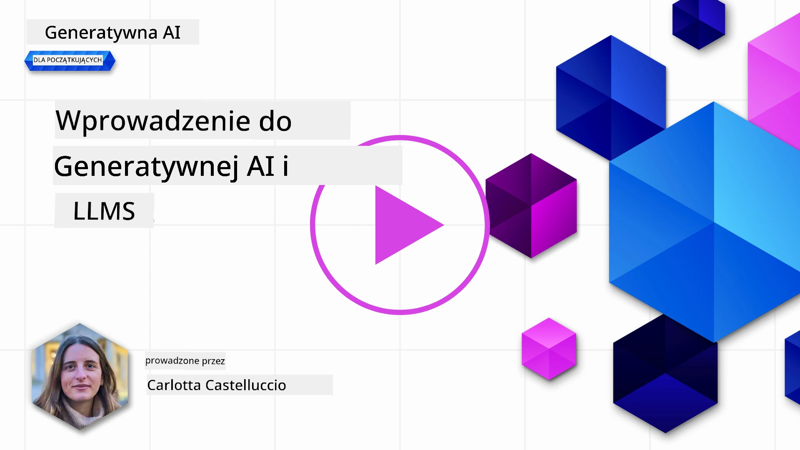
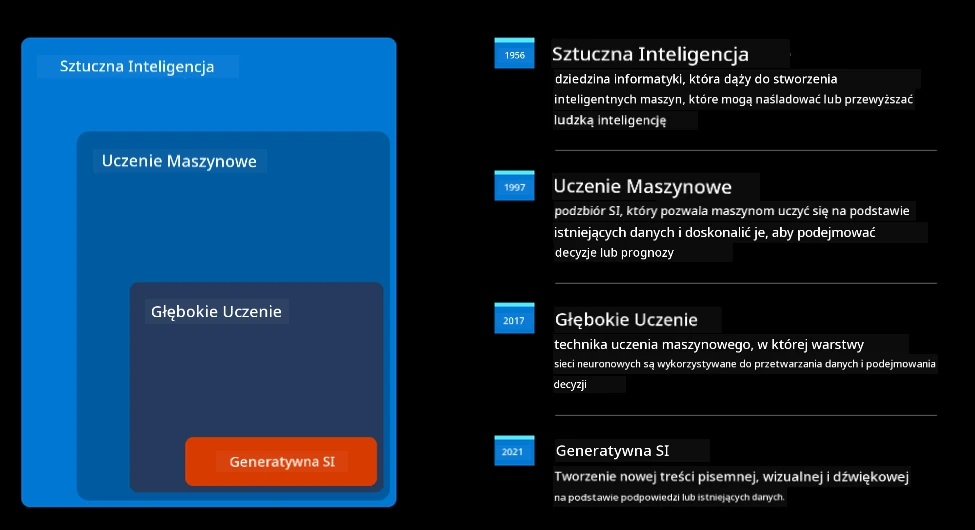
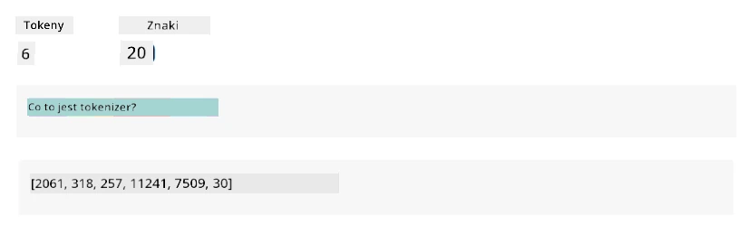
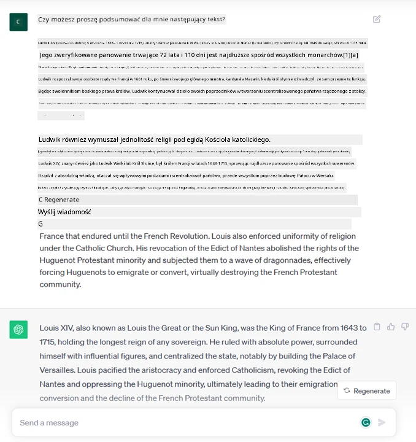
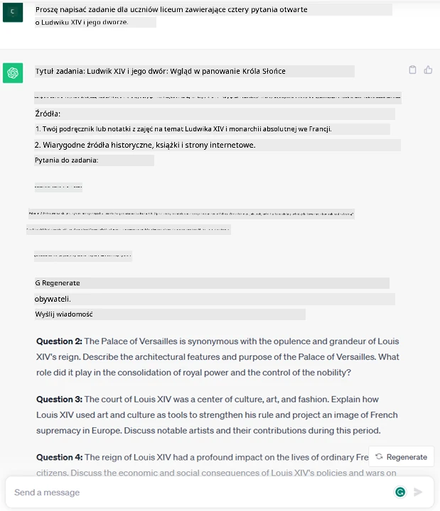
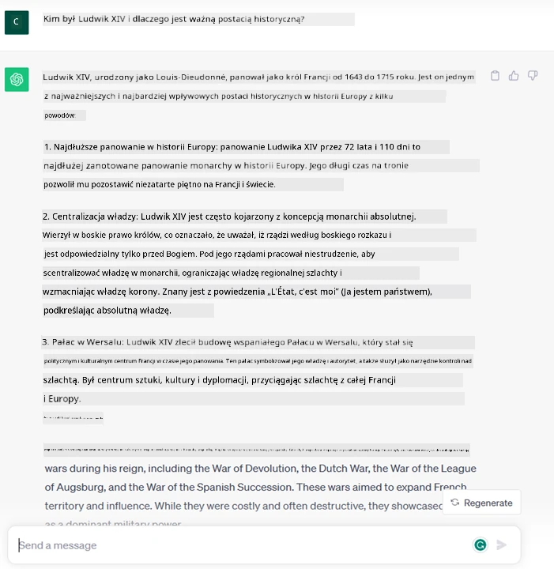
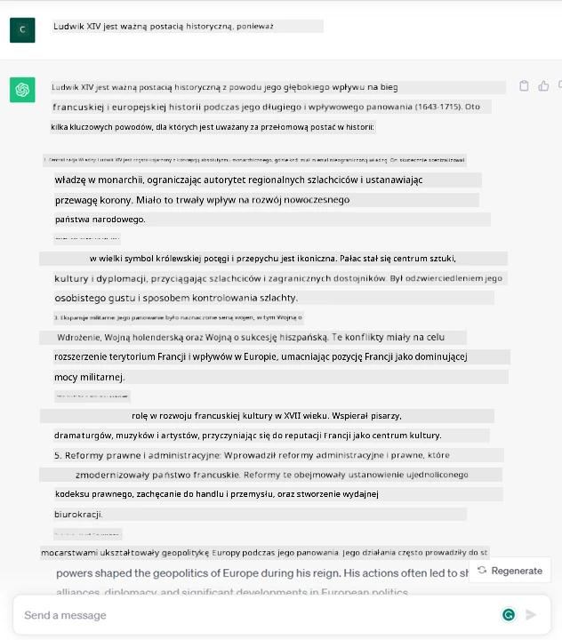
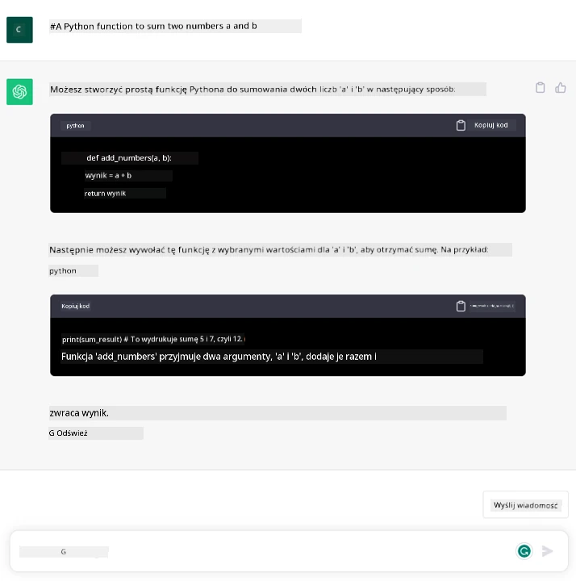

# Wprowadzenie do Generatywnej Sztucznej Inteligencji i Dużych Modeli Językowych

_(Kliknij powyższy obraz, aby obejrzeć wideo z tej lekcji)_

Generatywna SI to sztuczna inteligencja zdolna do generowania tekstu, obrazów i innych typów treści. To, co czyni tę technologię fantastyczną, to fakt, że demokratyzuje SI — każdy może jej używać z pomocą zaledwie prostego polecenia tekstowego, zdania napisanego w języku naturalnym. Nie musisz uczyć się języków takich jak Java czy SQL, aby zrobić coś wartościowego, wystarczy użyć swojego języka, określić, co chcesz, a otrzymujesz sugestię od modelu SI. Zastosowania i wpływ tej technologii są ogromne, możesz pisać lub rozumieć raporty, tworzyć aplikacje i wiele więcej, wszystko w kilka sekund.

W tym kursie przyjrzymy się, jak nasz startup wykorzystuje generatywną SI, aby otworzyć nowe scenariusze w świecie edukacji oraz jak radzimy sobie z nieuniknionymi wyzwaniami związanymi z społecznymi konsekwencjami jej zastosowania i ograniczeniami technologicznymi.

## Wprowadzenie

Ta lekcja omówi:

- Wprowadzenie do scenariusza biznesowego: pomysł i misja naszego startupu.
- Generatywna SI i jak dotarliśmy do obecnego krajobrazu technologicznego.
- Wewnętrzne działanie dużego modelu językowego.
- Główne możliwości i praktyczne zastosowania Dużych Modeli Językowych.

## Cele nauki

Po ukończeniu tej lekcji zrozumiesz:

- Czym jest generatywna SI i jak działają Duże Modele Językowe.
- Jak możesz wykorzystać duże modele językowe w różnych zastosowaniach, ze szczególnym uwzględnieniem scenariuszy edukacyjnych.

## Scenariusz: nasz startup edukacyjny

Generatywna sztuczna inteligencja (SI) reprezentuje szczyt technologii SI, przesuwając granice tego, co kiedyś uważano za niemożliwe. Modele generatywne mają wiele zdolności i zastosowań, ale w tym kursie skupimy się na tym, jak rewolucjonizują edukację poprzez fikcyjny startup. Nazwiemy ten startup _naszym startupem_. Nasz startup działa w obszarze edukacji z ambitnym celem

> _poprawy dostępności nauki na całym świecie, zapewniając sprawiedliwy dostęp do edukacji i oferując spersonalizowane doświadczenia edukacyjne każdemu uczniowi, zgodnie z jego potrzebami_.

Zespół naszego startupu zdaje sobie sprawę, że nie osiągniemy tego celu bez wykorzystania jednego z najpotężniejszych narzędzi współczesności – Dużych Modeli Językowych (LLM).

Generatywna SI ma zrewolucjonizować sposób, w jaki uczymy się i nauczamy dzisiaj, z uczniami mającymi do dyspozycji wirtualnych nauczycieli 24 godziny na dobę, którzy dostarczają ogromne ilości informacji i przykładów, oraz nauczycielami, którzy mogą korzystać z innowacyjnych narzędzi do oceny swoich uczniów i udzielania informacji zwrotnej.

Na początek zdefiniujmy kilka podstawowych pojęć i terminów, których będziemy używać w trakcie kursu.

## Jak doszliśmy do generatywnej SI?

Mimo ogromnego _hype'u_ wywołanego ostatnio przez zapowiedź modeli generatywnej SI, ta technologia rozwija się od dziesięcioleci, a pierwsze badania sięgają lat 60. Obecnie mamy SI dysponującą ludzkimi zdolnościami poznawczymi, np. prowadzącą rozmowę, jak pokazują na przykład [OpenAI ChatGPT](https://openai.com/chatgpt) czy [Microsoft Copilot](https://copilot.microsoft.com/?WT.mc_id=academic-105485-koreyst), który również wykorzystuje model GPT do swojej konwersacyjnej wyszukiwarki internetowej.

Cofając się trochę, pierwsze prototypy SI składały się z pisanych na maszynie chatbotów, opierających się na bazie wiedzy wyciągniętej od grupy ekspertów i zaimplementowanej w komputerze. Odpowiedzi w bazie wiedzy były wywoływane przez słowa kluczowe pojawiające się w tekście wejściowym.
Jednak szybko stało się jasne, że takie podejście, wykorzystujące pisane na maszynie chatboty, nie skalowało się dobrze.

### Statystyczne podejście do SI: uczenie maszynowe

Przełom nastąpił w latach 90., dzięki zastosowaniu statystycznego podejścia do analizy tekstu. Doprowadziło to do opracowania nowych algorytmów – nazywanych uczeniem maszynowym – zdolnych do uczenia się wzorców z danych bez potrzeby programowania na sztywno. To podejście pozwala maszynom symulować rozumienie języka ludzkiego: model statystyczny jest trenowany na parach tekst-etykieta, co umożliwia klasyfikowanie nieznanego tekstu wejściowego zgodnie z określoną etykietą reprezentującą intencję wiadomości.

### Sieci neuronowe i nowoczesni wirtualni asystenci

W ostatnich latach, rozwój technologiczny sprzętu, zdolnego do obsługi większych ilości danych i bardziej złożonych obliczeń, pobudził badania nad SI, prowadząc do rozwinięcia zaawansowanych algorytmów uczenia maszynowego znanych jako sieci neuronowe lub algorytmy głębokiego uczenia.

Sieci neuronowe (a w szczególności rekurencyjne sieci neuronowe – RNN) znacznie ulepszyły przetwarzanie języka naturalnego, umożliwiając reprezentację znaczenia tekstu w bardziej sensowny sposób, z uwzględnieniem kontekstu słowa w zdaniu.

To technologia, która zasilała wirtualnych asystentów powstałych w pierwszej dekadzie nowego stulecia, bardzo biegłych w interpretacji języka ludzkiego, identyfikowaniu potrzeb i wykonywaniu działań je zaspokajających – jak odpowiadanie według z góry ustalonego scenariusza lub korzystanie z usługi zewnętrznego dostawcy.

### Obecnie, generatywna SI

Tak oto doszliśmy do generatywnej SI dzisiaj, którą można uznać za podzbiór głębokiego uczenia.

Po dziesięcioleciach badań nad SI pojawiła się nowa architektura modelu – nazywana _Transformer_ – która pokonała ograniczenia RNN, będąc w stanie przyjąć jako wejście znacznie dłuższe sekwencje tekstu. Transformatory bazują na mechanizmie uwagi, pozwalając modelowi na nadawanie różnej wagi otrzymanym wejściom, „zwracając większą uwagę” tam, gdzie skoncentrowana jest najważniejsza informacja, niezależnie od ich kolejności w sekwencji tekstowej.

Większość współczesnych modeli generatywnej SI – znanych również jako Duże Modele Językowe (LLM), ponieważ operują na tekstowych danych wejściowych i wyjściowych – opiera się właśnie na tej architekturze. Co ciekawe, modele te – wytrenowane na ogromnej ilości nieoznakowanych danych pochodzących z różnorodnych źródeł, takich jak książki, artykuły i strony internetowe – mogą być dostosowane do szerokiej gamy zadań oraz generować gramatycznie poprawny tekst z pozorami kreatywności. Więc nie tylko znacznie zwiększyły zdolność maszyny do „rozumienia” tekstu wejściowego, lecz także umożliwiły generowanie przez nią oryginalnej odpowiedzi w języku ludzkim.

## Jak działają duże modele językowe?

W następnych rozdziałach przyjrzymy się różnym typom modeli generatywnej SI, ale na razie spójrzmy, jak działają duże modele językowe, z naciskiem na modele OpenAI GPT (Generative Pre-trained Transformer).

- **Tokenizator, tekst na liczby**: Duże Modele Językowe przyjmują tekst jako wejście i generują tekst jako wyjście. Jednak jako modele statystyczne działają znacznie lepiej na liczbach niż na sekwencjach tekstu. Dlatego każde wejście do modelu jest przetwarzane przez tokenizator, zanim zostanie użyte przez główny model. Token to fragment tekstu – składający się z zmiennej liczby znaków, dlatego głównym zadaniem tokenizatora jest podzielenie wejścia na tablicę tokenów. Następnie każdy token jest mapowany na indeks tokenu, czyli całkowitą reprezentację oryginalnego fragmentu tekstu.

- **Przewidywanie tokenów wyjściowych**: Mając n tokenów na wejściu (maksymalna liczba n różni się w zależności od modelu), model jest w stanie przewidzieć jeden token jako wyjście. Ten token jest następnie włączany do wejścia w kolejnej iteracji, w schemacie rozszerzającego się okna, co umożliwia lepsze doświadczenie użytkownika, otrzymującego jedno (lub więcej) zdanie jako odpowiedź. To tłumaczy, dlaczego, jeśli kiedykolwiek grałeś z ChatGPT, mogłeś zauważyć, że czasami wydaje się zatrzymywać w środku zdania.

- **Proces wyboru, rozkład prawdopodobieństwa**: Token wyjściowy jest wybierany przez model zgodnie z prawdopodobieństwem jego wystąpienia po obecnej sekwencji tekstu. Model przewiduje rozkład prawdopodobieństwa dla wszystkich możliwych „następnych tokenów”, obliczany na podstawie treningu. Jednak nie zawsze wybierany jest token o najwyższym prawdopodobieństwie w rozkładzie. Dodana jest pewna doza losowości, dzięki czemu model działa w sposób niedeterministyczny – nie otrzymujemy dokładnie takiej samej odpowiedzi dla tego samego wejścia. Ta losowość symuluje proces twórczego myślenia i może być regulowana przy pomocy parametru modelu nazwanego temperaturą.

## Jak nasz startup może wykorzystać Duże Modele Językowe?

Teraz, gdy lepiej rozumiemy działanie dużego modelu językowego, zobaczmy kilka praktycznych przykładów najczęstszych zadań, które potrafią wykonać całkiem dobrze, z uwzględnieniem naszego scenariusza biznesowego.
Powiedzieliśmy, że główną zdolnością Dużego Modelu Językowego jest _generowanie tekstu od zera, zaczynając od tekstowego wejścia, napisanego w języku naturalnym_.

Ale jaki rodzaj tekstowego wejścia i wyjścia?
Wejście do dużego modelu językowego nazywamy promptem, a wyjście – completion, termin odnoszący się do mechanizmu modelu generowania następnego tokenu w celu uzupełnienia aktualnego wejścia. Wkrótce zagłębimy się w to, czym jest prompt i jak go zaprojektować, aby jak najlepiej wykorzystać model. Na razie powiedzmy, że prompt może zawierać:

- **Instrukcję**, określającą typ oczekiwanego wyjścia modelu. Ta instrukcja czasami może zawierać przykłady lub dodatkowe dane.

  1. Streszczenie artykułu, książki, recenzji produktów i innych, wraz z wydobywaniem informacji z nieustrukturyzowanych danych.
    
    
  
  2. Kreatywne pomysły i projektowanie artykułów, esejów, prac domowych i innych.
      
     

- **Pytanie**, zadane w formie rozmowy z agentem.
  
  

- Fragment **tekstu do uzupełnienia**, co jest pośrednio prośbą o pomoc w pisaniu.
  
  

- Fragment **kodu** wraz z prośbą o wyjaśnienie i dokumentację lub komentarz proszący o wygenerowanie kawałka kodu wykonującego konkretne zadanie.
  
  

Przykłady powyżej są dość proste i nie mają na celu wyczerpującego pokazania możliwości Dużych Modeli Językowych. Mają pokazać potencjał wykorzystania generatywnej SI, szczególnie, ale nie wyłącznie, w kontekstach edukacyjnych.

Ponadto wynik modelu generatywnej SI nie jest idealny, a czasem kreatywność modelu może działać na jego niekorzyść, skutkując produktem będącym zlepkiem słów, który użytkownik ludzki może odczytać jako mistyfikację rzeczywistości lub jako treść obraźliwą. Generatywna SI nie jest inteligentna – przynajmniej w szerszym rozumieniu inteligencji, obejmującym myślenie krytyczne, twórcze czy inteligencję emocjonalną; nie jest deterministyczna i nie jest godna zaufania, ponieważ zmyślenia, takie jak błędne odniesienia, treści i stwierdzenia, mogą być połączone z poprawnymi informacjami i przedstawione w przekonujący i pewny sposób. W kolejnych lekcjach będziemy zajmować się tymi ograniczeniami i zobaczymy, co można zrobić, aby je złagodzić.

## Zadanie

Twoim zadaniem jest zapoznać się bliżej z [generatywną SI](https://en.wikipedia.org/wiki/Generative_artificial_intelligence?WT.mc_id=academic-105485-koreyst) i spróbować zidentyfikować obszar, w którym dzisiaj dodałbyś generatywną SI, mimo że jej tam nie ma. Jak różniłby się wpływ w porównaniu do podejścia „starej szkoły”, czy możesz zrobić coś, czego wcześniej nie mogłeś, lub czy jesteś szybszy? Napisz 300-słowne streszczenie swojego wymarzonego startupu AI i dołącz nagłówki takie jak „Problem”, „Jak bym użył SI”, „Wpływ” i opcjonalnie plan biznesowy.

Jeśli wykonasz to zadanie, możesz być nawet gotowy do aplikacji do inkubatora Microsoftu, [Microsoft for Startups Founders Hub](https://www.microsoft.com/startups?WT.mc_id=academic-105485-koreyst), oferujemy kredyty na Azure, OpenAI, mentoring i wiele więcej, sprawdź to!

## Sprawdzenie wiedzy

Co jest prawdą o dużych modelach językowych?

1. Za każdym razem otrzymujesz dokładnie tę samą odpowiedź.
1. Robią wszystko perfekcyjnie, świetnie liczą, generują działający kod itd.
1. Odpowiedź może się różnić mimo użycia tego samego promptu. Są też świetne w dawaniu pierwszej wersji czegoś, czy to tekstu czy kodu. Ale musisz poprawić wyniki.

A: 3, LLM jest niedeterministyczny, odpowiedź się różni, jednak możesz kontrolować jej zmienność przez ustawienie temperatury. Nie powinieneś też oczekiwać, że zrobi coś perfekcyjnie, chodzi o to, aby wykonać ciężką pracę za Ciebie, co często oznacza, że otrzymujesz dobry pierwszy szkic czegoś, co musisz stopniowo poprawiać.

## Świetna robota! Kontynuuj podróż

Po ukończeniu tej lekcji sprawdź naszą [kolekcję kursów Generatywnej SI](https://aka.ms/genai-collection?WT.mc_id=academic-105485-koreyst), aby dalej rozwijać swoją wiedzę o Generatywnej SI!

Przejdź do Lekcji 2, gdzie przyjrzymy się, jak [eksplorować i porównywać różne typy LLM](../02-exploring-and-comparing-different-llms/README.md?WT.mc_id=academic-105485-koreyst)!

---

<!-- CO-OP TRANSLATOR DISCLAIMER START -->
**Zastrzeżenie**:
Niniejszy dokument został przetłumaczony za pomocą usługi tłumaczenia AI [Co-op Translator](https://github.com/Azure/co-op-translator). Choć dążymy do dokładności, prosimy pamiętać, że automatyczne tłumaczenia mogą zawierać błędy lub niedokładności. Oryginalny dokument w jego języku źródłowym należy uznawać za autorytatywne źródło. W przypadku informacji krytycznych zalecane jest skorzystanie z profesjonalnego tłumaczenia wykonanego przez człowieka. Nie ponosimy odpowiedzialności za jakiekolwiek nieporozumienia lub błędne interpretacje wynikające z użycia tego tłumaczenia.
<!-- CO-OP TRANSLATOR DISCLAIMER END -->