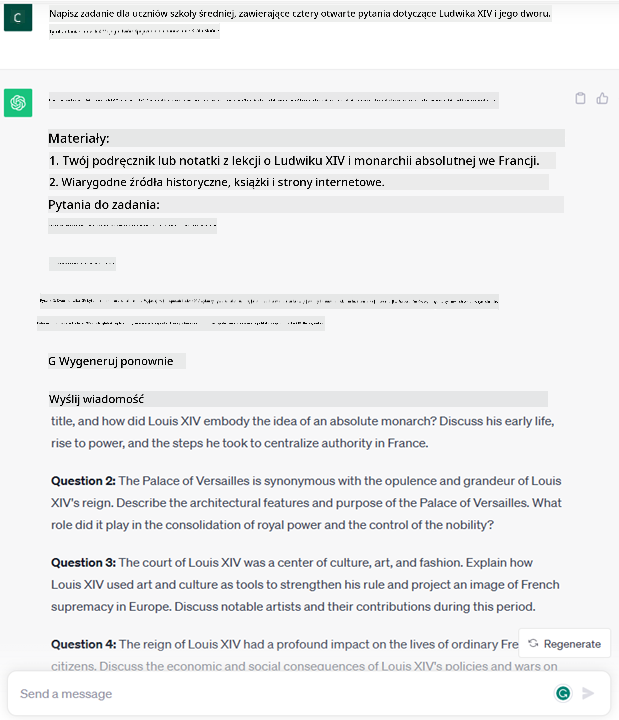
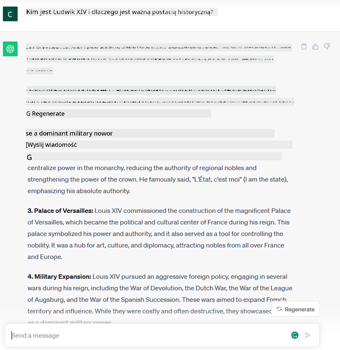

<!--
CO_OP_TRANSLATOR_METADATA:
{
  "original_hash": "bfb7901bdbece1ba3e9f35c400ca33e8",
  "translation_date": "2025-10-18T00:57:01+00:00",
  "source_file": "01-introduction-to-genai/README.md",
  "language_code": "pl"
}
-->
# Wprowadzenie do generatywnej sztucznej inteligencji i dużych modeli językowych

_(Kliknij obrazek powyżej, aby obejrzeć wideo z tej lekcji)_

Generatywna sztuczna inteligencja to technologia zdolna do generowania tekstu, obrazów i innych rodzajów treści. To, co czyni ją wyjątkową, to fakt, że demokratyzuje dostęp do AI – każdy może z niej korzystać, używając jedynie prostego tekstowego polecenia, zdania napisanego w języku naturalnym. Nie musisz znać języków programowania takich jak Java czy SQL, aby osiągnąć coś wartościowego – wystarczy, że użyjesz swojego języka, wyrazisz swoje potrzeby, a model AI zaproponuje odpowiednie rozwiązanie. Zastosowania i wpływ tej technologii są ogromne – od pisania i rozumienia raportów, przez tworzenie aplikacji, aż po wiele innych zadań, wszystko w zaledwie kilka sekund.

W tym programie nauczania zbadamy, jak nasz startup wykorzystuje generatywną sztuczną inteligencję, aby otworzyć nowe możliwości w świecie edukacji, oraz jak radzimy sobie z nieuniknionymi wyzwaniami związanymi z jej społecznymi implikacjami i ograniczeniami technologicznymi.

## Wprowadzenie

Ta lekcja obejmie:

- Wprowadzenie do scenariusza biznesowego: nasz pomysł na startup i misję.
- Generatywną sztuczną inteligencję i jej miejsce w obecnym krajobrazie technologicznym.
- Działanie dużych modeli językowych.
- Główne możliwości i praktyczne zastosowania dużych modeli językowych.

## Cele nauki

Po ukończeniu tej lekcji zrozumiesz:

- Czym jest generatywna sztuczna inteligencja i jak działają duże modele językowe.
- Jak można wykorzystać duże modele językowe w różnych zastosowaniach, ze szczególnym uwzględnieniem scenariuszy edukacyjnych.

## Scenariusz: nasz edukacyjny startup

Generatywna sztuczna inteligencja (AI) reprezentuje szczyt technologii AI, przesuwając granice tego, co kiedyś uważano za niemożliwe. Modele generatywnej AI mają wiele możliwości i zastosowań, ale w ramach tego programu nauczania zbadamy, jak rewolucjonizują edukację za pomocą fikcyjnego startupu. Nazwiemy ten startup _naszym startupem_. Nasz startup działa w obszarze edukacji, realizując ambitną misję:

> _poprawa dostępności edukacji na skalę globalną, zapewnienie równego dostępu do nauki oraz dostarczanie spersonalizowanych doświadczeń edukacyjnych każdemu uczniowi, zgodnie z jego potrzebami_.

Zespół naszego startupu zdaje sobie sprawę, że nie uda nam się osiągnąć tego celu bez wykorzystania jednego z najpotężniejszych narzędzi współczesnych czasów – dużych modeli językowych (LLM).

Generatywna sztuczna inteligencja ma potencjał, aby zrewolucjonizować sposób, w jaki uczymy się i nauczamy. Uczniowie mogą korzystać z wirtualnych nauczycieli dostępnych przez całą dobę, którzy dostarczają ogromne ilości informacji i przykładów, a nauczyciele mogą wykorzystywać innowacyjne narzędzia do oceny swoich uczniów i udzielania im informacji zwrotnej.

Na początek zdefiniujmy kilka podstawowych pojęć i terminów, które będziemy używać w całym programie nauczania.

## Jak powstała generatywna sztuczna inteligencja?

Pomimo ogromnego _szumu_ wywołanego ostatnio przez ogłoszenie modeli generatywnej AI, technologia ta powstawała przez dekady, a pierwsze badania w tej dziedzinie sięgają lat 60. Obecnie AI osiągnęła poziom zdolności poznawczych zbliżonych do ludzkich, takich jak prowadzenie rozmów, co można zaobserwować na przykładzie [OpenAI ChatGPT](https://openai.com/chatgpt) czy [Bing Chat](https://www.microsoft.com/edge/features/bing-chat?WT.mc_id=academic-105485-koreyst), który również korzysta z modelu GPT do rozmów w wyszukiwarce Bing.

Wracając do początków, pierwsze prototypy AI składały się z chatbotów obsługiwanych za pomocą pisma maszynowego, które opierały się na bazie wiedzy pozyskanej od grupy ekspertów i zapisanej w komputerze. Odpowiedzi w bazie wiedzy były wywoływane przez słowa kluczowe pojawiające się w tekście wejściowym. Jednak szybko okazało się, że takie podejście, oparte na pisanych chatbotach, nie jest skalowalne.

### Statystyczne podejście do AI: Uczenie maszynowe

Przełom nastąpił w latach 90., kiedy zastosowano statystyczne podejście do analizy tekstu. Doprowadziło to do opracowania nowych algorytmów – znanych jako uczenie maszynowe – zdolnych do nauki wzorców z danych bez konieczności ich jawnego programowania. Podejście to pozwoliło maszynom na symulację rozumienia języka ludzkiego: model statystyczny był trenowany na parach tekst-etykieta, co umożliwiało klasyfikację nieznanego tekstu wejściowego z przypisaną wcześniej etykietą reprezentującą intencję wiadomości.

### Sieci neuronowe i nowoczesne wirtualne asystenty

W ostatnich latach rozwój technologii sprzętowej, zdolnej do obsługi większych ilości danych i bardziej złożonych obliczeń, zachęcił do badań nad AI, prowadząc do opracowania zaawansowanych algorytmów uczenia maszynowego, znanych jako sieci neuronowe lub algorytmy głębokiego uczenia.

Sieci neuronowe (a w szczególności rekurencyjne sieci neuronowe – RNN) znacząco poprawiły przetwarzanie języka naturalnego, umożliwiając bardziej znaczące reprezentowanie sensu tekstu, uwzględniając kontekst słowa w zdaniu.

To właśnie ta technologia napędzała wirtualnych asystentów, którzy pojawili się w pierwszej dekadzie nowego stulecia. Byli oni bardzo biegli w interpretowaniu języka ludzkiego, identyfikowaniu potrzeb i wykonywaniu działań, aby je zaspokoić – takich jak udzielanie odpowiedzi na podstawie z góry określonego skryptu czy korzystanie z usług zewnętrznych.

### Obecnie: Generatywna sztuczna inteligencja

Tak doszliśmy do dzisiejszej generatywnej sztucznej inteligencji, która może być postrzegana jako podzbiór głębokiego uczenia.

Po dekadach badań w dziedzinie AI, nowa architektura modelu – zwana _Transformer_ – pokonała ograniczenia RNN, umożliwiając przetwarzanie znacznie dłuższych sekwencji tekstu jako danych wejściowych. Transformatory opierają się na mechanizmie uwagi, który pozwala modelowi przypisywać różne wagi do otrzymanych danych wejściowych, „zwracając większą uwagę” na najbardziej istotne informacje, niezależnie od ich kolejności w sekwencji tekstowej.

Większość współczesnych modeli generatywnej AI – znanych również jako duże modele językowe (LLM), ponieważ pracują z tekstowymi danymi wejściowymi i wyjściowymi – opiera się właśnie na tej architekturze. Co ciekawe, modele te – trenowane na ogromnych ilościach nieoznaczonych danych z różnych źródeł, takich jak książki, artykuły i strony internetowe – mogą być dostosowywane do szerokiej gamy zadań i generować gramatycznie poprawny tekst z pozorami kreatywności. Nie tylko znacznie zwiększyły zdolność maszyny do „rozumienia” tekstu wejściowego, ale także umożliwiły generowanie oryginalnych odpowiedzi w języku ludzkim.

## Jak działają duże modele językowe?

W następnym rozdziale przyjrzymy się różnym typom modeli generatywnej AI, ale na razie zobaczmy, jak działają duże modele językowe, koncentrując się na modelach OpenAI GPT (Generative Pre-trained Transformer).

- **Tokenizacja, tekst na liczby**: Duże modele językowe otrzymują tekst jako dane wejściowe i generują tekst jako dane wyjściowe. Jednak jako modele statystyczne, lepiej radzą sobie z liczbami niż z sekwencjami tekstowymi. Dlatego każdy tekst wejściowy jest najpierw przetwarzany przez tokenizator, zanim zostanie użyty przez główny model. Token to fragment tekstu – składający się z zmiennej liczby znaków, więc głównym zadaniem tokenizatora jest podzielenie tekstu wejściowego na tablicę tokenów. Następnie każdy token jest mapowany na indeks tokenu, który jest liczbą całkowitą kodującą oryginalny fragment tekstu.

- **Przewidywanie tokenów wyjściowych**: Mając n tokenów jako dane wejściowe (gdzie maksymalne n różni się w zależności od modelu), model jest w stanie przewidzieć jeden token jako dane wyjściowe. Ten token jest następnie włączany do danych wejściowych kolejnej iteracji, w rozszerzającym się wzorcu okna, co umożliwia lepsze doświadczenie użytkownika, który otrzymuje jedno (lub kilka) zdań jako odpowiedź. To wyjaśnia, dlaczego, jeśli kiedykolwiek korzystałeś z ChatGPT, mogłeś zauważyć, że czasami wygląda, jakby zatrzymywał się w połowie zdania.

- **Proces wyboru, rozkład prawdopodobieństwa**: Token wyjściowy jest wybierany przez model zgodnie z jego prawdopodobieństwem wystąpienia po obecnej sekwencji tekstowej. Dzieje się tak, ponieważ model przewiduje rozkład prawdopodobieństwa dla wszystkich możliwych „następnych tokenów”, obliczany na podstawie jego treningu. Jednak nie zawsze wybierany jest token o najwyższym prawdopodobieństwie z wynikowego rozkładu. Do tego wyboru dodawany jest stopień losowości, dzięki czemu model działa w sposób niedeterministyczny – nie otrzymujemy dokładnie takiego samego wyniku dla tego samego wejścia. Ten stopień losowości można dostosować za pomocą parametru modelu zwanego temperaturą.

## Jak nasz startup może wykorzystać duże modele językowe?

Teraz, gdy lepiej rozumiemy działanie dużego modelu językowego, zobaczmy kilka praktycznych przykładów najczęstszych zadań, które mogą być przez nie dobrze wykonywane, z uwzględnieniem naszego scenariusza biznesowego. Powiedzieliśmy, że główną zdolnością dużego modelu językowego jest _generowanie tekstu od podstaw, na podstawie tekstowego wejścia napisanego w języku naturalnym_.

Ale jaki rodzaj tekstowego wejścia i wyjścia?
Wejście dużego modelu językowego nazywane jest promptem, a wyjście nazywane jest completion, co odnosi się do mechanizmu modelu generowania kolejnego tokenu w celu uzupełnienia obecnego wejścia. Zgłębimy, czym jest prompt i jak go zaprojektować, aby jak najlepiej wykorzystać możliwości modelu. Na razie powiedzmy tylko, że prompt może zawierać:

- **Instrukcję** określającą rodzaj oczekiwanego wyjścia z modelu. Instrukcja ta czasami może zawierać przykłady lub dodatkowe dane.

  1. Podsumowanie artykułu, książki, recenzji produktów i innych, wraz z wyciąganiem wniosków z nieustrukturyzowanych danych.
    
    
  
  2. Kreatywne pomysły i projektowanie artykułu, eseju, zadania lub innych treści.
      
     

- **Pytanie**, zadane w formie rozmowy z agentem.
  
  

- Fragment **tekstu do uzupełnienia**, który implikuje prośbę o pomoc w pisaniu.
  
  

- Fragment **kodu** wraz z prośbą o jego wyjaśnienie i dokumentację, lub komentarz z prośbą o wygenerowanie fragmentu kodu wykonującego określone zadanie.
  
  

Powyższe przykłady są dość proste i nie mają na celu wyczerpującego przedstawienia możliwości dużych modeli językowych. Mają one na celu pokazanie potencjału wykorzystania generatywnej AI, szczególnie, ale nie tylko, w kontekstach edukacyjnych.

Należy również pamiętać, że wyjście generatywnego modelu AI nie jest doskonałe, a czasami kreatywność modelu może działać przeciwko niemu, prowadząc do wyników, które użytkownik może interpretować jako zniekształcenie rzeczywistości lub mogą być obraźliwe. Generatywna AI nie jest inteligentna – przynajmniej w bardziej kompleksowym znaczeniu inteligencji, obejmującym krytyczne i kreatywne myślenie czy inteligencję emocjonalną; nie jest deterministyczna i nie jest w pełni godna zaufania, ponieważ może łączyć błędne odniesienia, treści i stwierdzenia z poprawnymi informacjami, prezentując je w przekonujący i pewny sposób. W kolejnych lekcjach zajmiemy się wszystkimi tymi ograniczeniami i zobaczymy, co możemy zrobić, aby je zminimalizować.

## Zadanie

Twoim zadaniem jest zapoznanie się z tematem [generatywnej AI](https://en.wikipedia.org/wiki/Generative_artificial_intelligence?WT.mc_id=academic-105485-koreyst) i próba zidentyfikowania obszaru, w którym można by dziś zastosować generatywną AI, a który jeszcze jej nie wykorzystuje. Jakie byłyby różnice w porównaniu do tradycyjnego podejścia? Czy można zrobić coś, czego wcześniej nie można było? Czy można działać szybciej? Napisz podsumowanie na 300 słów, opisując, jak wyglądałby Twój wymarzony startup AI, i uwzględnij nagłówki takie jak "Problem", "Jak wykorzystałbym AI", "Wpływ" oraz opcjonalnie plan biznesowy.

Jeśli wykonasz to zadanie, możesz być gotowy, aby aplikować do inkubatora Microsoftu, [Microsoft for Startups Founders Hub](https://www.microsoft.com/startups?WT.mc_id=academic-105485-koreyst), gdzie oferujemy kredyty na usługi Azure, OpenAI, mentoring i wiele więcej. Sprawdź to!

## Sprawdzenie wiedzy

Co jest prawdą o dużych modelach językowych?

1. Za każdym razem otrzymujesz dokładnie tę samą odpowiedź.
1. Działa idealnie, świetnie dodaje liczby, generuje działający kod itp.
1. Odpowiedź może się różnić, mimo użycia tego samego promptu. Jest również świetna w dostarczaniu pierwszej wersji czegoś, czy to tekstu, czy kodu. Jednak wyniki wymagają dalszego dopracowania.

Odpowiedź: 3, LLM jest niedeterministyczny, odpowiedź może się różnić, jednak można kontrolować jej zmienność za pomocą ustawienia temperatury. Nie należy również oczekiwać, że będzie działać perfekcyjnie – jego zadaniem jest wykonanie ciężkiej pracy, co często oznacza dostarczenie dobrego pierwszego szkicu, który należy stopniowo poprawiać.

## Świetna robota! Kontynuuj naukę

Po ukończeniu tej lekcji, sprawdź naszą [kolekcję nauki o generatywnej AI](https://aka.ms/genai-collection?WT.mc_id=academic-105485-koreyst), aby dalej rozwijać swoją wiedzę
Przejdź do Lekcji 2, gdzie przyjrzymy się, jak [eksplorować i porównywać różne typy LLM](../02-exploring-and-comparing-different-llms/README.md?WT.mc_id=academic-105485-koreyst)!

---

**Zastrzeżenie**:  
Ten dokument został przetłumaczony za pomocą usługi tłumaczenia AI [Co-op Translator](https://github.com/Azure/co-op-translator). Chociaż staramy się zapewnić dokładność, prosimy pamiętać, że automatyczne tłumaczenia mogą zawierać błędy lub nieścisłości. Oryginalny dokument w jego rodzimym języku powinien być uznawany za autorytatywne źródło. W przypadku informacji krytycznych zaleca się skorzystanie z profesjonalnego tłumaczenia przez człowieka. Nie ponosimy odpowiedzialności za jakiekolwiek nieporozumienia lub błędne interpretacje wynikające z użycia tego tłumaczenia.