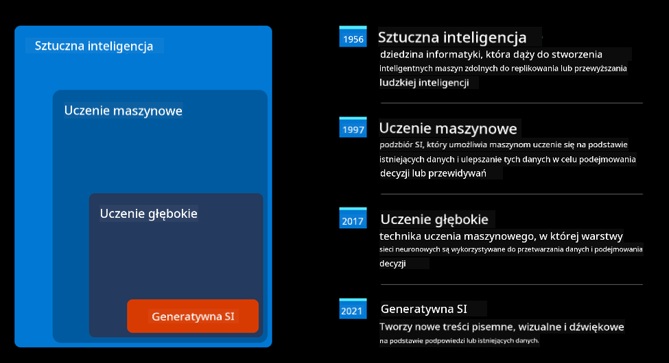
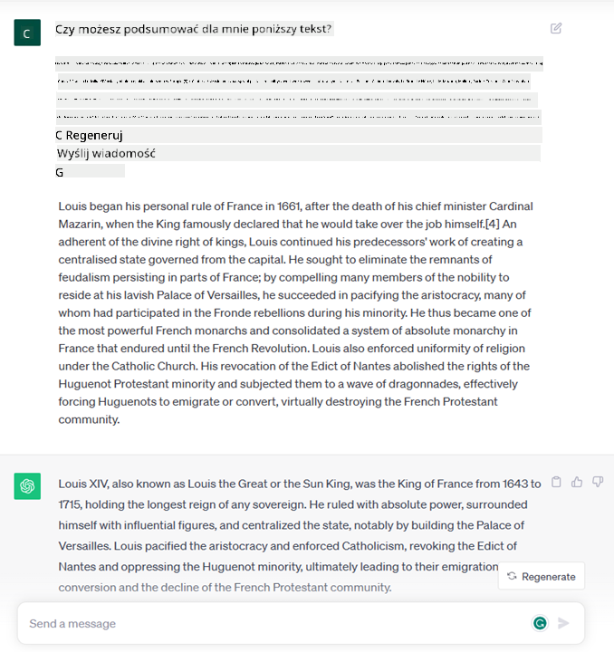
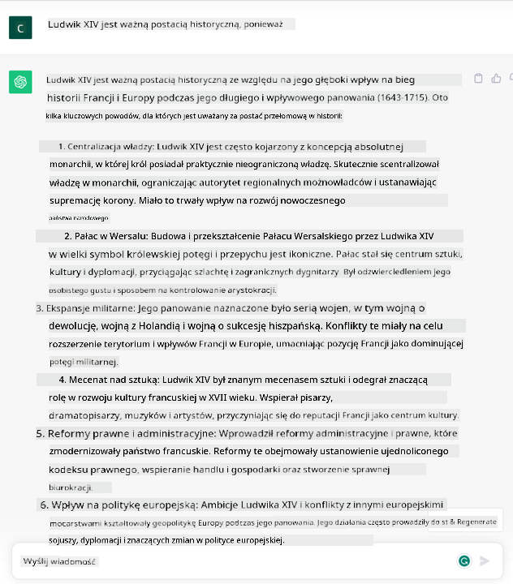

<!--
CO_OP_TRANSLATOR_METADATA:
{
  "original_hash": "f53ba0fa49164f9323043f1c6b11f2b1",
  "translation_date": "2025-07-09T07:51:59+00:00",
  "source_file": "01-introduction-to-genai/README.md",
  "language_code": "pl"
}
-->
# Wprowadzenie do Generative AI i dużych modeli językowych

_(Kliknij powyższy obraz, aby obejrzeć wideo z tej lekcji)_

Generative AI to sztuczna inteligencja zdolna do generowania tekstu, obrazów i innych rodzajów treści. To, co czyni ją fantastyczną technologią, to fakt, że demokratyzuje AI – każdy może z niej korzystać, podając jedynie prostą wskazówkę tekstową, zdanie napisane w naturalnym języku. Nie musisz uczyć się języków takich jak Java czy SQL, aby osiągnąć coś wartościowego, wystarczy użyć swojego języka, określić, czego chcesz, a model AI zaproponuje odpowiedź. Zastosowania i wpływ tej technologii są ogromne – możesz pisać lub rozumieć raporty, tworzyć aplikacje i wiele więcej, wszystko w kilka sekund.

W tym kursie przyjrzymy się, jak nasz startup wykorzystuje generatywną AI, aby otworzyć nowe możliwości w edukacji oraz jak radzimy sobie z nieuniknionymi wyzwaniami związanymi z społecznymi konsekwencjami jej zastosowania i ograniczeniami technologicznymi.

## Wprowadzenie

Ta lekcja obejmie:

- Wprowadzenie do scenariusza biznesowego: nasz pomysł na startup i misja.
- Generatywna AI i jak doszliśmy do obecnego krajobrazu technologicznego.
- Wewnętrzne działanie dużego modelu językowego.
- Główne możliwości i praktyczne zastosowania dużych modeli językowych.

## Cele nauki

Po ukończeniu tej lekcji zrozumiesz:

- Czym jest generatywna AI i jak działają duże modele językowe.
- Jak możesz wykorzystać duże modele językowe do różnych zastosowań, ze szczególnym uwzględnieniem scenariuszy edukacyjnych.

## Scenariusz: nasz startup edukacyjny

Generatywna sztuczna inteligencja (AI) to szczytowa forma technologii AI, przesuwająca granice tego, co kiedyś uważano za niemożliwe. Modele generatywne AI mają wiele możliwości i zastosowań, ale w tym kursie skupimy się na tym, jak rewolucjonizują edukację poprzez fikcyjny startup. Nazwiemy go _naszym startupem_. Nasz startup działa w obszarze edukacji z ambitnym celem:

> _poprawa dostępności do nauki na całym świecie, zapewnienie równego dostępu do edukacji oraz dostarczanie spersonalizowanych doświadczeń edukacyjnych każdemu uczniowi, zgodnie z jego potrzebami_.

Nasz zespół zdaje sobie sprawę, że nie osiągniemy tego celu bez wykorzystania jednego z najpotężniejszych narzędzi współczesności – dużych modeli językowych (LLM).

Generatywna AI ma zrewolucjonizować sposób, w jaki dziś uczymy się i nauczamy, dając uczniom dostęp do wirtualnych nauczycieli 24 godziny na dobę, którzy dostarczają ogromne ilości informacji i przykładów, a nauczycielom umożliwiają korzystanie z innowacyjnych narzędzi do oceny uczniów i udzielania informacji zwrotnej.

Na początek zdefiniujmy kilka podstawowych pojęć i terminów, które będziemy używać w całym kursie.

## Skąd wzięła się Generative AI?

Pomimo ogromnego _hype’u_ wywołanego ostatnio przez ogłoszenie modeli generatywnej AI, ta technologia powstaje od dziesięcioleci, a pierwsze badania sięgają lat 60. Obecnie AI osiągnęła zdolności poznawcze zbliżone do ludzkich, takie jak prowadzenie rozmowy, co pokazują na przykład [OpenAI ChatGPT](https://openai.com/chatgpt) czy [Bing Chat](https://www.microsoft.com/edge/features/bing-chat?WT.mc_id=academic-105485-koreyst), który również korzysta z modelu GPT do rozmów w wyszukiwarce Bing.

Cofnijmy się trochę – pierwsze prototypy AI to były chatboty oparte na pisanym tekście, korzystające z bazy wiedzy stworzonej przez ekspertów i zakodowanej w komputerze. Odpowiedzi w bazie były wywoływane przez słowa kluczowe pojawiające się w tekście wejściowym. Jednak szybko okazało się, że takie podejście nie skalowało się dobrze.

### Statystyczne podejście do AI: uczenie maszynowe

Przełom nastąpił w latach 90., gdy zastosowano statystyczne podejście do analizy tekstu. Doprowadziło to do powstania nowych algorytmów – zwanych uczeniem maszynowym – które potrafią uczyć się wzorców z danych bez konieczności programowania ich wprost. Podejście to pozwala maszynom symulować rozumienie języka ludzkiego: model statystyczny jest trenowany na parach tekst-etykieta, co umożliwia klasyfikację nieznanego tekstu wejściowego do z góry określonej kategorii reprezentującej intencję wiadomości.

### Sieci neuronowe i nowoczesne asystenty wirtualne

W ostatnich latach rozwój technologii sprzętowej, zdolnej do przetwarzania większych ilości danych i bardziej złożonych obliczeń, pobudził badania nad AI, prowadząc do powstania zaawansowanych algorytmów uczenia maszynowego zwanych sieciami neuronowymi lub głębokim uczeniem.

Sieci neuronowe (a w szczególności rekurencyjne sieci neuronowe – RNN) znacznie poprawiły przetwarzanie języka naturalnego, umożliwiając lepsze odwzorowanie znaczenia tekstu, uwzględniając kontekst słowa w zdaniu.

To właśnie ta technologia zasilała wirtualnych asystentów powstałych w pierwszej dekadzie XXI wieku, którzy świetnie radzili sobie z interpretacją języka ludzkiego, rozpoznawaniem potrzeb i wykonywaniem działań, takich jak odpowiadanie według z góry ustalonego scenariusza lub korzystanie z usług zewnętrznych.

### Obecnie, Generative AI

Tak właśnie doszliśmy do dzisiejszej generatywnej AI, którą można traktować jako podzbiór głębokiego uczenia.

Po dekadach badań w dziedzinie AI, nowa architektura modelu – zwana _Transformer_ – pokonała ograniczenia RNN, umożliwiając przetwarzanie znacznie dłuższych sekwencji tekstu. Transformery opierają się na mechanizmie uwagi (attention), który pozwala modelowi przypisywać różne wagi otrzymywanym danym, „zwracając większą uwagę” tam, gdzie skoncentrowane są najważniejsze informacje, niezależnie od ich kolejności w tekście.

Większość współczesnych modeli generatywnej AI – znanych również jako duże modele językowe (LLM), ponieważ operują na tekstowych danych wejściowych i wyjściowych – opiera się właśnie na tej architekturze. Co ciekawe, modele te, trenowane na ogromnej ilości nieoznakowanych danych z różnych źródeł, takich jak książki, artykuły czy strony internetowe, można dostosować do wielu zadań i generować gramatycznie poprawny tekst z pozorami kreatywności. Dzięki temu nie tylko znacznie zwiększyły zdolność maszyny do „rozumienia” tekstu, ale także umożliwiły generowanie oryginalnych odpowiedzi w języku ludzkim.

## Jak działają duże modele językowe?

W kolejnym rozdziale przyjrzymy się różnym typom modeli generatywnej AI, ale na razie spójrzmy, jak działają duże modele językowe, ze szczególnym uwzględnieniem modeli OpenAI GPT (Generative Pre-trained Transformer).

- **Tokenizer, tekst na liczby**: Duże modele językowe otrzymują tekst na wejściu i generują tekst na wyjściu. Jednak jako modele statystyczne lepiej radzą sobie z liczbami niż z sekwencjami tekstu. Dlatego każde wejście jest najpierw przetwarzane przez tokenizer, zanim trafi do głównego modelu. Token to fragment tekstu – składający się z zmiennej liczby znaków, więc głównym zadaniem tokenizera jest podzielenie wejścia na tablicę tokenów. Następnie każdy token jest mapowany na indeks tokenu, czyli liczbowe kodowanie oryginalnego fragmentu tekstu.

- **Przewidywanie tokenów wyjściowych**: Mając n tokenów na wejściu (maksymalna liczba n różni się w zależności od modelu), model potrafi przewidzieć jeden token na wyjściu. Ten token jest następnie dołączany do wejścia kolejnej iteracji, w rozszerzającym się oknie, co pozwala na lepsze doświadczenie użytkownika, otrzymującego jedno (lub więcej) zdań jako odpowiedź. To tłumaczy, dlaczego jeśli kiedykolwiek korzystałeś z ChatGPT, mogłeś zauważyć, że czasem przerywa w połowie zdania.

- **Proces wyboru, rozkład prawdopodobieństwa**: Token wyjściowy jest wybierany przez model na podstawie prawdopodobieństwa jego wystąpienia po aktualnej sekwencji tekstu. Model przewiduje rozkład prawdopodobieństwa dla wszystkich możliwych „następnych tokenów”, obliczany na podstawie treningu. Jednak nie zawsze wybierany jest token o najwyższym prawdopodobieństwie. Do wyboru dodawany jest element losowości, dzięki czemu model działa w sposób niedeterministyczny – nie otrzymujemy dokładnie takiej samej odpowiedzi dla tego samego wejścia. Ten stopień losowości symuluje proces twórczego myślenia i można go regulować za pomocą parametru modelu zwanego temperaturą.

## Jak nasz startup może wykorzystać duże modele językowe?

Teraz, gdy lepiej rozumiemy działanie dużego modelu językowego, zobaczmy kilka praktycznych przykładów najczęstszych zadań, które potrafią wykonywać całkiem dobrze, z uwzględnieniem naszego scenariusza biznesowego. Powiedzieliśmy, że główną zdolnością dużego modelu językowego jest _generowanie tekstu od podstaw, zaczynając od tekstowego wejścia, napisanego w naturalnym języku_.

Ale jaki rodzaj tekstowego wejścia i wyjścia?
Wejście dużego modelu językowego nazywamy promptem, a wyjście – completion, co odnosi się do mechanizmu modelu generującego kolejny token, aby uzupełnić aktualne wejście. Zagłębimy się w to, czym jest prompt i jak go projektować, aby jak najlepiej wykorzystać model. Na razie powiedzmy, że prompt może zawierać:

- **Instrukcję** określającą rodzaj oczekiwanego wyjścia. Instrukcja ta czasem zawiera przykłady lub dodatkowe dane.

  1. Streszczenie artykułu, książki, recenzji produktów i więcej, wraz z wydobywaniem wniosków z nieustrukturyzowanych danych.
    
    
  
  2. Kreatywne pomysły i projektowanie artykułu, eseju, zadania i innych.
      
     

- **Pytanie**, zadane w formie rozmowy z agentem.
  
  

- Fragment **tekstu do uzupełnienia**, co jest pośrednio prośbą o pomoc w pisaniu.
  
  

- Fragment **kodu** wraz z prośbą o wyjaśnienie i dokumentację lub komentarz proszący o wygenerowanie fragmentu kodu wykonującego określone zadanie.
  
  

Powyższe przykłady są dość proste i nie mają na celu wyczerpującego pokazania możliwości dużych modeli językowych. Mają pokazać potencjał wykorzystania generatywnej AI, szczególnie, ale nie tylko, w kontekstach edukacyjnych.

Należy też pamiętać, że wynik generatywnego modelu AI nie jest idealny i czasem kreatywność modelu może działać na jego niekorzyść, skutkując odpowiedzią, którą użytkownik może odebrać jako zniekształcenie rzeczywistości lub nawet obraźliwą. Generatywna AI nie jest inteligentna – przynajmniej w szerszym rozumieniu inteligencji, obejmującym krytyczne i twórcze myślenie czy inteligencję emocjonalną; nie jest deterministyczna i nie jest w pełni wiarygodna, ponieważ fałszywe informacje, takie jak błędne odniesienia, treści i stwierdzenia, mogą być połączone z prawdziwymi danymi i przedstawione w przekonujący i pewny sposób. W kolejnych lekcjach zajmiemy się tymi ograniczeniami i zobaczymy, co możemy zrobić, aby je złagodzić.

## Zadanie

Twoim zadaniem jest pogłębienie wiedzy na temat [generatywnej AI](https://en.wikipedia.org/wiki/Generative_artificial_intelligence?WT.mc_id=academic-105485-koreyst) i próba wskazania obszaru, w którym dziś dodałbyś generatywną AI, a który jej jeszcze nie ma. Jak różniłby się wpływ w porównaniu z „tradycyjnym” podejściem? Czy możesz zrobić coś, czego wcześniej nie dało się zrobić, albo jesteś szybszy? Napisz 300-słowne podsumowanie, jak wyglądałby Twój wymarzony startup AI, uwzględniając nagłówki takie jak „Problem”, „Jak wykorzystałbym AI”, „Wpływ” oraz opcjonalnie plan biznesowy.

Jeśli wykonasz to zadanie, możesz być gotowy, by aplikować do inkubatora Microsoftu, [Microsoft for Startups Founders Hub](https://www.microsoft.com/startups?WT.mc_id=academic-105485-koreyst) – oferujemy kredyty na Azure, OpenAI, mentoring i wiele więcej, sprawdź to!

## Sprawdzenie wiedzy

Co jest prawdą o dużych modelach językowych?

1. Za każdym razem otrzymujesz dokładnie tę samą odpowiedź.
1. Robią wszystko perfekcyjnie, świetnie dodają liczby, generują działający kod itd.
1. Odpowiedź może się różnić mimo użycia tego samego promptu. Są też świetne w tworzeniu pierwszych wersji czegoś, czy to tekstu, czy kodu. Ale musisz poprawiać wyniki.

Odpowiedź: 3, LLM jest niedeterministyczny, odpowiedź się różni, jednak możesz kontrolować tę zmienność za pomocą ustawienia temperatury. Nie powinieneś też oczekiwać, że zrobi wszystko perfekcyjnie – ma odciążyć Cię w ciężkiej pracy, często dając dobry pierwszy szkic, który trzeba stopniowo ulepszać.

## Świetna robota! Kontynuuj podróż

Po ukończeniu tej lekcji sprawdź naszą [kolekcję nauki o Generative AI](https://aka.ms/genai-collection?WT.mc_id=academic-105485-koreyst), aby dalej rozwijać swoją wiedzę o Generative AI!
Przejdź do Lekcji 2, gdzie przyjrzymy się, jak [badać i porównywać różne typy LLM](../02-exploring-and-comparing-different-llms/README.md?WT.mc_id=academic-105485-koreyst)!

**Zastrzeżenie**:  
Niniejszy dokument został przetłumaczony przy użyciu usługi tłumaczenia AI [Co-op Translator](https://github.com/Azure/co-op-translator). Chociaż dokładamy starań, aby tłumaczenie było jak najbardziej precyzyjne, prosimy mieć na uwadze, że automatyczne tłumaczenia mogą zawierać błędy lub nieścisłości. Oryginalny dokument w języku źródłowym powinien być uznawany za źródło autorytatywne. W przypadku informacji o kluczowym znaczeniu zalecane jest skorzystanie z profesjonalnego tłumaczenia wykonanego przez człowieka. Nie ponosimy odpowiedzialności za jakiekolwiek nieporozumienia lub błędne interpretacje wynikające z korzystania z tego tłumaczenia.