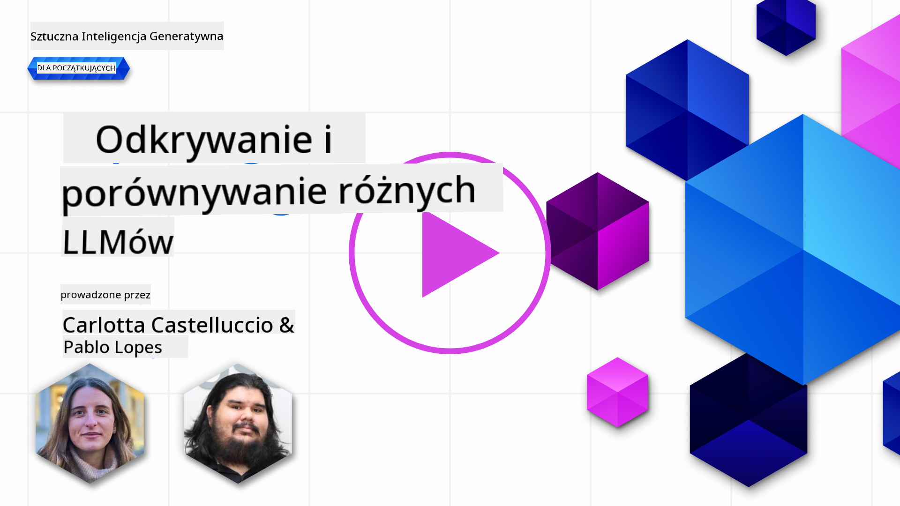
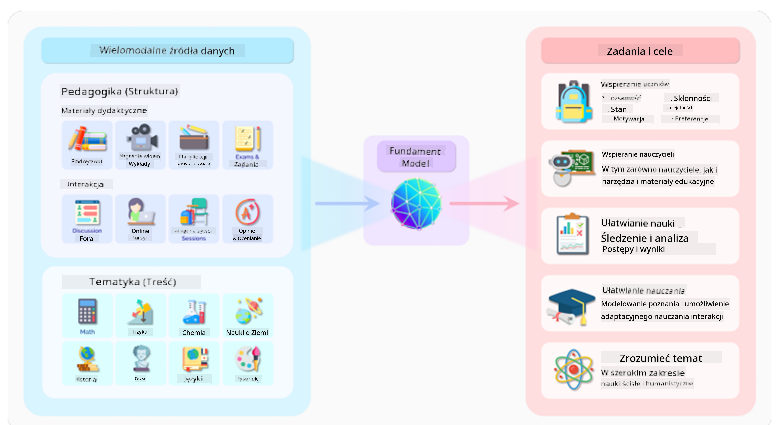
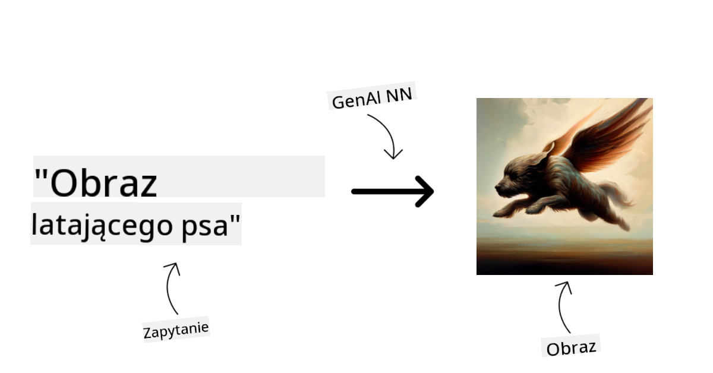
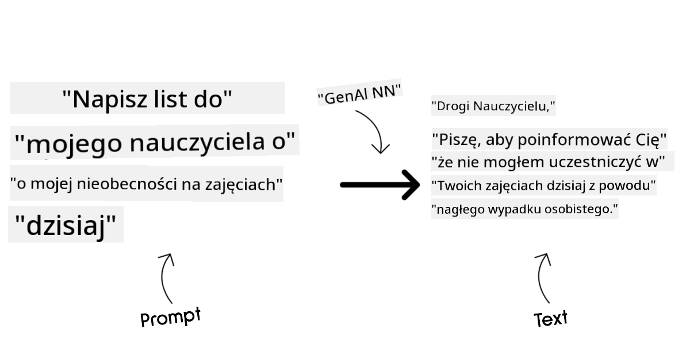
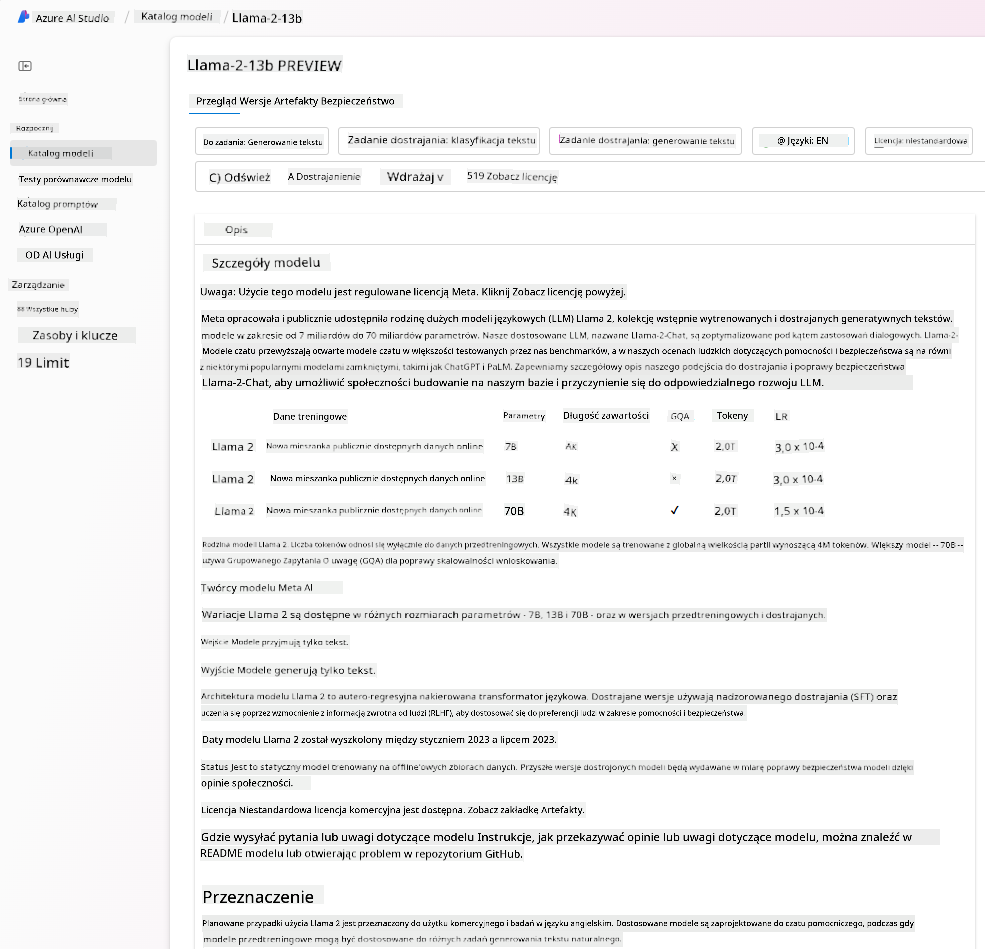
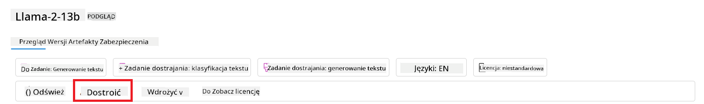
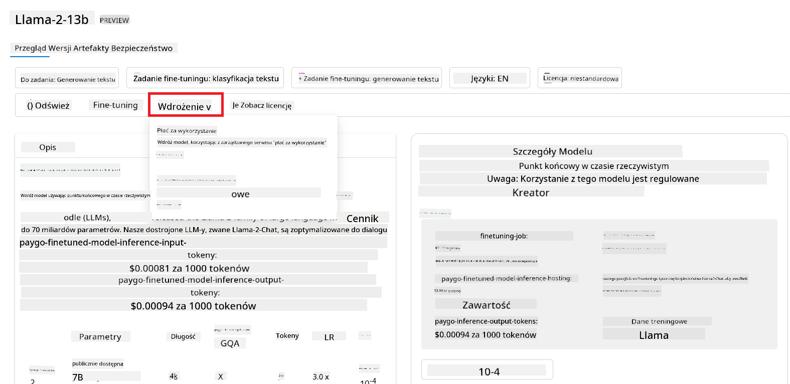
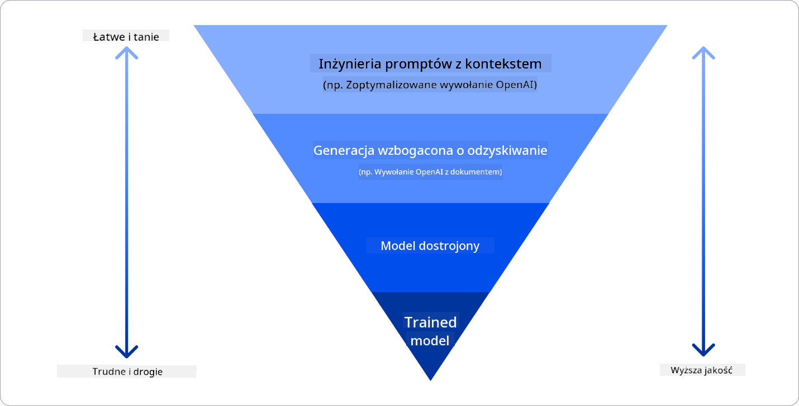

<!--
CO_OP_TRANSLATOR_METADATA:
{
  "original_hash": "e2f686f2eb794941761252ac5e8e090b",
  "translation_date": "2025-07-09T08:24:43+00:00",
  "source_file": "02-exploring-and-comparing-different-llms/README.md",
  "language_code": "pl"
}
-->
# Eksploracja i porównanie różnych LLM

> _Kliknij powyższy obraz, aby obejrzeć wideo z tej lekcji_

W poprzedniej lekcji zobaczyliśmy, jak Generative AI zmienia krajobraz technologiczny, jak działają duże modele językowe (LLM) oraz jak firma – taka jak nasz startup – może je zastosować do swoich przypadków użycia i rozwijać się! W tym rozdziale porównamy i skonfrontujemy różne typy dużych modeli językowych (LLM), aby zrozumieć ich zalety i wady.

Kolejnym krokiem w podróży naszego startupu jest zbadanie obecnego krajobrazu LLM i zrozumienie, które z nich są odpowiednie dla naszego przypadku użycia.

## Wprowadzenie

Ta lekcja obejmie:

- Różne typy LLM dostępne obecnie na rynku.
- Testowanie, iterowanie i porównywanie różnych modeli dla Twojego przypadku użycia w Azure.
- Jak wdrożyć LLM.

## Cele nauki

Po ukończeniu tej lekcji będziesz potrafił:

- Wybrać odpowiedni model dla swojego przypadku użycia.
- Zrozumieć, jak testować, iterować i poprawiać wydajność modelu.
- Wiedzieć, jak firmy wdrażają modele.

## Zrozumienie różnych typów LLM

LLM można podzielić na różne kategorie w zależności od ich architektury, danych treningowych i zastosowania. Zrozumienie tych różnic pomoże naszemu startupowi wybrać odpowiedni model do danego scenariusza oraz zrozumieć, jak testować, iterować i poprawiać wydajność.

Istnieje wiele różnych typów modeli LLM, a wybór zależy od tego, do czego chcesz ich używać, jakie masz dane, ile jesteś gotów zapłacić i innych czynników.

W zależności od tego, czy chcesz używać modeli do tekstu, dźwięku, wideo, generowania obrazów itp., możesz wybrać inny typ modelu.

- **Rozpoznawanie dźwięku i mowy**. Do tego celu świetnie nadają się modele typu Whisper, ponieważ są uniwersalne i przeznaczone do rozpoznawania mowy. Model jest trenowany na różnorodnych danych audio i potrafi rozpoznawać mowę w wielu językach. Dowiedz się więcej o [modelach typu Whisper tutaj](https://platform.openai.com/docs/models/whisper?WT.mc_id=academic-105485-koreyst).

- **Generowanie obrazów**. Do generowania obrazów bardzo popularne są DALL-E i Midjourney. DALL-E jest dostępny w Azure OpenAI. [Przeczytaj więcej o DALL-E tutaj](https://platform.openai.com/docs/models/dall-e?WT.mc_id=academic-105485-koreyst) oraz w rozdziale 9 tego kursu.

- **Generowanie tekstu**. Większość modeli jest trenowana do generowania tekstu i masz szeroki wybór od GPT-3.5 do GPT-4. Koszty różnią się, przy czym GPT-4 jest najdroższy. Warto sprawdzić [Azure OpenAI playground](https://oai.azure.com/portal/playground?WT.mc_id=academic-105485-koreyst), aby ocenić, które modele najlepiej odpowiadają Twoim potrzebom pod względem możliwości i kosztów.

- **Multi-modalność**. Jeśli chcesz obsługiwać różne typy danych na wejściu i wyjściu, warto zainteresować się modelami takimi jak [gpt-4 turbo z wizją lub gpt-4o](https://learn.microsoft.com/azure/ai-services/openai/concepts/models#gpt-4-and-gpt-4-turbo-models?WT.mc_id=academic-105485-koreyst) – najnowszymi modelami OpenAI – które łączą przetwarzanie języka naturalnego z rozumieniem wizualnym, umożliwiając interakcje przez interfejsy multimodalne.

Wybór modelu oznacza, że otrzymujesz podstawowe możliwości, które jednak mogą nie wystarczyć. Często masz dane specyficzne dla firmy, o których musisz w jakiś sposób poinformować LLM. Istnieje kilka sposobów podejścia do tego tematu, o czym więcej w kolejnych sekcjach.

### Modele Foundation a LLM

Termin Foundation Model został [wprowadzony przez badaczy ze Stanford](https://arxiv.org/abs/2108.07258?WT.mc_id=academic-105485-koreyst) i definiuje model AI spełniający pewne kryteria, takie jak:

- **Są trenowane za pomocą uczenia bez nadzoru lub samonadzoru**, co oznacza, że uczą się na nieoznakowanych, multimodalnych danych i nie wymagają ręcznego oznaczania danych przez ludzi.
- **Są bardzo dużymi modelami**, opartymi na bardzo głębokich sieciach neuronowych trenowanych na miliardach parametrów.
- **Zazwyczaj służą jako „podstawa” dla innych modeli**, co oznacza, że mogą być punktem wyjścia do budowy innych modeli poprzez dostrajanie (fine-tuning).

Źródło obrazu: [Essential Guide to Foundation Models and Large Language Models | by Babar M Bhatti | Medium](https://thebabar.medium.com/essential-guide-to-foundation-models-and-large-language-models-27dab58f7404)

Aby lepiej wyjaśnić tę różnicę, weźmy za przykład ChatGPT. Do stworzenia pierwszej wersji ChatGPT wykorzystano model GPT-3.5 jako model bazowy. Oznacza to, że OpenAI użyło danych specyficznych dla czatu, aby stworzyć dostosowaną wersję GPT-3.5, specjalizującą się w dobrym działaniu w scenariuszach konwersacyjnych, takich jak chatboty.

Źródło obrazu: [2108.07258.pdf (arxiv.org)](https://arxiv.org/pdf/2108.07258.pdf?WT.mc_id=academic-105485-koreyst)

### Modele open source a modele własnościowe

Innym sposobem kategoryzacji LLM jest podział na modele open source i własnościowe.

Modele open source to modele udostępnione publicznie i mogą być używane przez każdego. Często są udostępniane przez firmę, która je stworzyła, lub przez społeczność badawczą. Modele te można przeglądać, modyfikować i dostosowywać do różnych zastosowań. Jednak nie zawsze są zoptymalizowane do użytku produkcyjnego i mogą nie być tak wydajne jak modele własnościowe. Finansowanie modeli open source może być ograniczone, a ich utrzymanie i aktualizacje nie zawsze są długoterminowe. Przykładami popularnych modeli open source są [Alpaca](https://crfm.stanford.edu/2023/03/13/alpaca.html?WT.mc_id=academic-105485-koreyst), [Bloom](https://huggingface.co/bigscience/bloom) oraz [LLaMA](https://llama.meta.com).

Modele własnościowe to modele należące do firm i niedostępne publicznie. Są często zoptymalizowane do użytku produkcyjnego. Nie można ich przeglądać, modyfikować ani dostosowywać do różnych zastosowań. Zazwyczaj nie są dostępne za darmo i mogą wymagać subskrypcji lub opłaty za korzystanie. Użytkownicy nie mają kontroli nad danymi używanymi do trenowania modelu, co oznacza, że muszą zaufać właścicielowi modelu w kwestii ochrony prywatności danych i odpowiedzialnego użycia AI. Przykładami popularnych modeli własnościowych są [modele OpenAI](https://platform.openai.com/docs/models/overview?WT.mc_id=academic-105485-koreyst), [Google Bard](https://sapling.ai/llm/bard?WT.mc_id=academic-105485-koreyst) czy [Claude 2](https://www.anthropic.com/index/claude-2?WT.mc_id=academic-105485-koreyst).

### Embedding a generowanie obrazów a generowanie tekstu i kodu

LLM można również podzielić ze względu na rodzaj generowanego wyjścia.

Embeddingi to zestaw modeli, które potrafią przekształcić tekst w formę numeryczną, zwaną embeddingiem, czyli reprezentacją liczbową tekstu wejściowego. Embeddingi ułatwiają maszynom rozumienie relacji między słowami lub zdaniami i mogą być wykorzystywane jako dane wejściowe dla innych modeli, takich jak modele klasyfikacyjne czy klastrowania, które lepiej radzą sobie z danymi numerycznymi. Modele embeddingowe często stosuje się w transfer learningu, gdzie model jest trenowany na zadaniu zastępczym, dla którego jest dużo danych, a następnie wagi modelu (embeddingi) są wykorzystywane do innych zadań. Przykładem są [embeddingi OpenAI](https://platform.openai.com/docs/models/embeddings?WT.mc_id=academic-105485-koreyst).

Modele generujące obrazy to modele, które tworzą obrazy. Często są wykorzystywane do edycji obrazów, syntezy czy tłumaczenia obrazów. Modele te są trenowane na dużych zbiorach obrazów, takich jak [LAION-5B](https://laion.ai/blog/laion-5b/?WT.mc_id=academic-105485-koreyst), i mogą generować nowe obrazy lub edytować istniejące za pomocą technik takich jak inpainting, super-rozdzielczość czy koloryzacja. Przykłady to [DALL-E-3](https://openai.com/dall-e-3?WT.mc_id=academic-105485-koreyst) oraz [Stable Diffusion](https://github.com/Stability-AI/StableDiffusion?WT.mc_id=academic-105485-koreyst).

Modele generujące tekst i kod to modele, które tworzą tekst lub kod. Często są wykorzystywane do streszczania tekstu, tłumaczeń czy odpowiadania na pytania. Modele generujące tekst są trenowane na dużych zbiorach tekstów, takich jak [BookCorpus](https://www.cv-foundation.org/openaccess/content_iccv_2015/html/Zhu_Aligning_Books_and_ICCV_2015_paper.html?WT.mc_id=academic-105485-koreyst), i mogą generować nowy tekst lub odpowiadać na pytania. Modele generujące kod, takie jak [CodeParrot](https://huggingface.co/codeparrot?WT.mc_id=academic-105485-koreyst), są trenowane na dużych zbiorach kodu, np. z GitHub, i mogą generować nowy kod lub naprawiać błędy w istniejącym.

### Encoder-Decoder a tylko Decoder

Aby omówić różne typy architektur LLM, posłużmy się analogią.

Wyobraź sobie, że Twój przełożony zlecił Ci przygotowanie quizu dla studentów. Masz dwóch współpracowników; jeden zajmuje się tworzeniem treści, a drugi ich przeglądem.

Twórca treści jest jak model tylko Decoder, może spojrzeć na temat i to, co już napisałeś, a następnie stworzyć kurs na tej podstawie. Są bardzo dobrzy w pisaniu angażujących i informacyjnych treści, ale nie radzą sobie najlepiej ze zrozumieniem tematu i celów nauczania. Przykładami modeli tylko Decoder są modele z rodziny GPT, takie jak GPT-3.

Recenzent jest jak model tylko Encoder, analizuje napisany kurs i odpowiedzi, zauważa relacje między nimi i rozumie kontekst, ale nie potrafi generować treści. Przykładem modelu tylko Encoder jest BERT.

Wyobraź sobie, że mamy kogoś, kto potrafi zarówno tworzyć, jak i recenzować quiz – to jest model Encoder-Decoder. Przykładami są BART i T5.

### Usługa a model

Teraz porozmawiajmy o różnicy między usługą a modelem. Usługa to produkt oferowany przez dostawcę chmury i często jest kombinacją modeli, danych i innych komponentów. Model to podstawowy element usługi, często model bazowy, taki jak LLM.

Usługi są zazwyczaj zoptymalizowane do użytku produkcyjnego i łatwiejsze w użyciu niż modele, dzięki interfejsowi graficznemu. Jednak usługi nie zawsze są dostępne za darmo i mogą wymagać subskrypcji lub opłaty, w zamian za korzystanie ze sprzętu i zasobów właściciela usługi, co pozwala optymalizować koszty i łatwo skalować. Przykładem usługi jest [Azure OpenAI Service](https://learn.microsoft.com/azure/ai-services/openai/overview?WT.mc_id=academic-105485-koreyst), która oferuje model rozliczeń pay-as-you-go, czyli użytkownicy płacą proporcjonalnie do wykorzystania usługi. Azure OpenAI Service zapewnia też bezpieczeństwo klasy korporacyjnej oraz ramy odpowiedzialnego AI, oprócz możliwości modeli.

Modele to tylko sieć neuronowa z parametrami, wagami i innymi elementami. Firmy mogą uruchamiać je lokalnie, ale muszą wtedy kupić sprzęt, zbudować infrastrukturę do skalowania oraz kupić licencję lub użyć modelu open source. Model taki jak LLaMA jest dostępny do użytku, ale wymaga mocy obliczeniowej do działania.

## Jak testować i iterować z różnymi modelami, aby zrozumieć ich wydajność w Azure

Gdy nasz zespół zbada obecny krajobraz LLM i wyłoni kilka dobrych kandydatów do swoich scenariuszy, kolejnym krokiem jest testowanie ich na własnych danych i obciążeniu. To proces iteracyjny, realizowany poprzez eksperymenty i pomiary.
Większość modeli, o których wspomnieliśmy w poprzednich akapitach (modele OpenAI, modele open source takie jak Llama2 oraz transformery Hugging Face), jest dostępna w [Model Catalog](https://learn.microsoft.com/azure/ai-studio/how-to/model-catalog-overview?WT.mc_id=academic-105485-koreyst) w [Azure AI Studio](https://ai.azure.com/?WT.mc_id=academic-105485-koreyst).

[Azure AI Studio](https://learn.microsoft.com/azure/ai-studio/what-is-ai-studio?WT.mc_id=academic-105485-koreyst) to platforma chmurowa zaprojektowana dla deweloperów, umożliwiająca tworzenie aplikacji generatywnej AI oraz zarządzanie całym cyklem rozwoju – od eksperymentów po ewaluację – łącząc wszystkie usługi Azure AI w jednym miejscu z wygodnym interfejsem GUI. Model Catalog w Azure AI Studio pozwala użytkownikowi na:

- Znalezienie interesującego Foundation Model w katalogu – zarówno własnościowego, jak i open source, z możliwością filtrowania według zadania, licencji lub nazwy. Aby ułatwić wyszukiwanie, modele są pogrupowane w kolekcje, takie jak kolekcja Azure OpenAI, kolekcja Hugging Face i inne.

- Przejrzenie karty modelu, zawierającej szczegółowy opis przeznaczenia i danych treningowych, przykłady kodu oraz wyniki ewaluacji w wewnętrznej bibliotece ocen.

- Porównanie benchmarków modeli i zestawów danych dostępnych w branży, aby ocenić, który model najlepiej odpowiada scenariuszowi biznesowemu, za pomocą panelu [Model Benchmarks](https://learn.microsoft.com/azure/ai-studio/how-to/model-benchmarks?WT.mc_id=academic-105485-koreyst).

- Dostosowanie modelu (fine-tuning) na własnych danych treningowych, aby poprawić jego wydajność w konkretnym zadaniu, korzystając z możliwości eksperymentowania i śledzenia w Azure AI Studio.

- Wdrożenie oryginalnego modelu wstępnie wytrenowanego lub wersji dostosowanej na zdalny endpoint do inferencji w czasie rzeczywistym – zarządzany compute – lub bezserwerowy endpoint API – [pay-as-you-go](https://learn.microsoft.com/azure/ai-studio/how-to/model-catalog-overview#model-deployment-managed-compute-and-serverless-api-pay-as-you-go?WT.mc_id=academic-105485-koreyst) – aby umożliwić aplikacjom korzystanie z modelu.

> [!NOTE]
> Nie wszystkie modele w katalogu są obecnie dostępne do fine-tuningu i/lub wdrożenia w modelu pay-as-you-go. Sprawdź kartę modelu, aby poznać szczegóły dotyczące możliwości i ograniczeń modelu.

## Poprawa wyników LLM

Nasz zespół startupowy testował różne rodzaje LLM oraz platformę chmurową (Azure Machine Learning), która pozwala porównywać modele, oceniać je na danych testowych, poprawiać ich wydajność i wdrażać na endpointach inferencyjnych.

Kiedy jednak warto rozważyć fine-tuning modelu zamiast korzystania z modelu wstępnie wytrenowanego? Czy istnieją inne metody poprawy wydajności modelu w konkretnych zadaniach?

Istnieje kilka podejść, które firma może zastosować, aby uzyskać oczekiwane wyniki z LLM. Można wybrać różne typy modeli o różnym stopniu wytrenowania podczas wdrażania LLM w produkcji, z różnym poziomem złożoności, kosztów i jakości. Oto kilka podejść:

- **Inżynieria promptów z kontekstem**. Chodzi o dostarczenie wystarczającego kontekstu w promptcie, aby uzyskać potrzebne odpowiedzi.

- **Retrieval Augmented Generation, RAG**. Twoje dane mogą istnieć np. w bazie danych lub na endpointzie webowym; aby zapewnić, że te dane lub ich podzbiór są uwzględnione podczas promptowania, można pobrać odpowiednie dane i dołączyć je do promptu użytkownika.

- **Model dostosowany (fine-tuned)**. Tutaj model jest dalej trenowany na własnych danych, co sprawia, że jest bardziej precyzyjny i lepiej odpowiada na potrzeby, ale może być kosztowne.

Źródło obrazka: [Four Ways that Enterprises Deploy LLMs | Fiddler AI Blog](https://www.fiddler.ai/blog/four-ways-that-enterprises-deploy-llms?WT.mc_id=academic-105485-koreyst)

### Inżynieria promptów z kontekstem

Wstępnie wytrenowane LLM świetnie radzą sobie z ogólnymi zadaniami języka naturalnego, nawet przy krótkim promptcie, np. zdaniu do dokończenia lub pytaniu – tzw. „zero-shot” learning.

Jednak im bardziej użytkownik potrafi sformułować zapytanie, podając szczegółowe żądanie i przykłady – czyli kontekst – tym odpowiedź będzie dokładniejsza i bliższa oczekiwaniom. Mówimy wtedy o „one-shot” learning, jeśli prompt zawiera jeden przykład, oraz „few-shot learning”, jeśli zawiera ich kilka.
Inżynieria promptów z kontekstem to najbardziej opłacalne podejście na start.

### Retrieval Augmented Generation (RAG)

LLM mają ograniczenie, że mogą korzystać tylko z danych, na których były trenowane, aby wygenerować odpowiedź. Oznacza to, że nie znają faktów, które wydarzyły się po procesie treningu, ani nie mają dostępu do informacji niepublicznych (np. danych firmowych).
Można to obejść dzięki RAG, technice, która wzbogaca prompt o zewnętrzne dane w formie fragmentów dokumentów, z uwzględnieniem limitów długości promptu. Wspierają to narzędzia baz danych wektorowych (np. [Azure Vector Search](https://learn.microsoft.com/azure/search/vector-search-overview?WT.mc_id=academic-105485-koreyst)), które wyszukują przydatne fragmenty z różnych zdefiniowanych źródeł danych i dodają je do kontekstu promptu.

Ta technika jest bardzo pomocna, gdy firma nie ma wystarczająco dużo danych, czasu lub zasobów na fine-tuning LLM, ale chce poprawić wydajność w konkretnym zadaniu i zmniejszyć ryzyko generowania fałszywych informacji, czyli zniekształcenia rzeczywistości lub szkodliwych treści.

### Model dostosowany (fine-tuned)

Fine-tuning to proces wykorzystujący transfer learning do „dopasowania” modelu do konkretnego zadania lub problemu. W przeciwieństwie do few-shot learning i RAG, skutkuje wygenerowaniem nowego modelu z zaktualizowanymi wagami i biasami. Wymaga zestawu przykładów treningowych składających się z pojedynczego wejścia (promptu) i odpowiadającego mu wyjścia (completion).
To podejście jest preferowane, gdy:

- **Korzysta się z modeli fine-tuned**. Firma chce używać dostosowanych, mniej zaawansowanych modeli (np. modeli embeddingowych) zamiast modeli o wysokiej wydajności, co daje bardziej ekonomiczne i szybsze rozwiązanie.

- **Ważna jest latencja**. Latencja ma znaczenie w danym zastosowaniu, więc nie można używać bardzo długich promptów lub liczba przykładów, które model powinien się nauczyć, nie mieści się w limicie długości promptu.

- **Chce się być na bieżąco**. Firma dysponuje dużą ilością wysokiej jakości danych i etykiet ground truth oraz zasobami do utrzymania tych danych aktualnych w czasie.

### Model trenowany od podstaw

Trenowanie LLM od zera to bez wątpienia najtrudniejsze i najbardziej złożone podejście, wymagające ogromnych ilości danych, wykwalifikowanych zasobów i odpowiedniej mocy obliczeniowej. Opcja ta powinna być rozważana tylko wtedy, gdy firma ma specyficzne zastosowanie domenowe i dużą ilość danych skoncentrowanych na tej dziedzinie.

## Sprawdzenie wiedzy

Jakie podejście może być dobre do poprawy wyników generowanych przez LLM?

1. Inżynieria promptów z kontekstem  
1. RAG  
1. Model dostosowany (fine-tuned)

Odpowiedź: 3 – jeśli masz czas, zasoby i wysokiej jakości dane, fine-tuning jest lepszą opcją, aby być na bieżąco. Jednak jeśli chcesz szybko poprawić wyniki i brakuje Ci czasu, warto najpierw rozważyć RAG.

## 🚀 Wyzwanie

Dowiedz się więcej o tym, jak możesz [wykorzystać RAG](https://learn.microsoft.com/azure/search/retrieval-augmented-generation-overview?WT.mc_id=academic-105485-koreyst) w swojej firmie.

## Świetna robota, kontynuuj naukę

Po ukończeniu tej lekcji sprawdź naszą [kolekcję Generative AI Learning](https://aka.ms/genai-collection?WT.mc_id=academic-105485-koreyst), aby dalej rozwijać swoją wiedzę o Generative AI!

Przejdź do Lekcji 3, gdzie omówimy, jak [budować z Generative AI odpowiedzialnie](../03-using-generative-ai-responsibly/README.md?WT.mc_id=academic-105485-koreyst)!

**Zastrzeżenie**:  
Niniejszy dokument został przetłumaczony przy użyciu automatycznej usługi tłumaczeniowej AI [Co-op Translator](https://github.com/Azure/co-op-translator). Mimo że dokładamy starań, aby tłumaczenie było jak najbardziej precyzyjne, prosimy mieć na uwadze, że tłumaczenia automatyczne mogą zawierać błędy lub nieścisłości. Oryginalny dokument w języku źródłowym należy traktować jako źródło wiążące. W przypadku informacji o kluczowym znaczeniu zalecane jest skorzystanie z profesjonalnego tłumaczenia wykonanego przez człowieka. Nie ponosimy odpowiedzialności za jakiekolwiek nieporozumienia lub błędne interpretacje wynikające z korzystania z tego tłumaczenia.