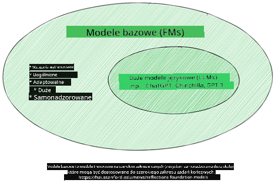
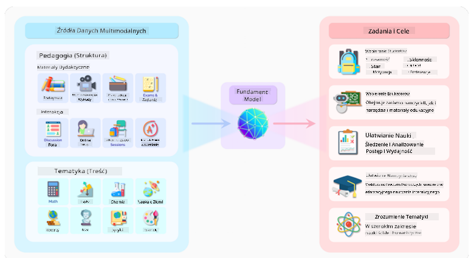
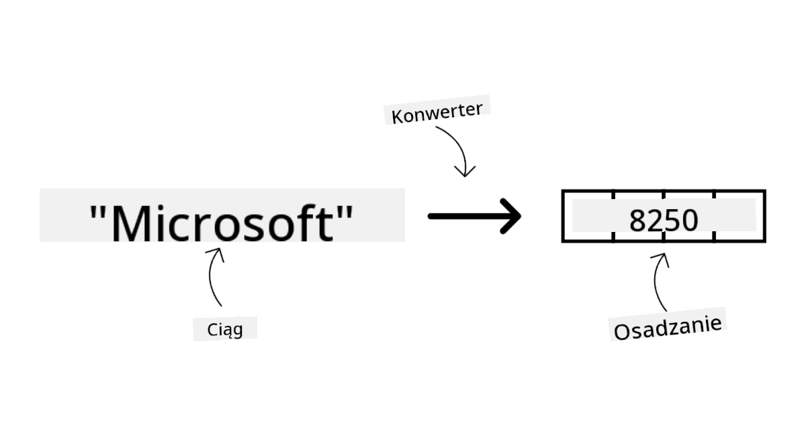
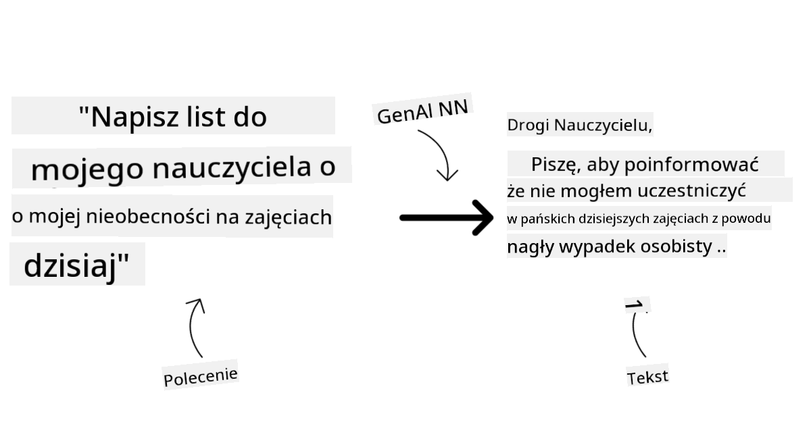
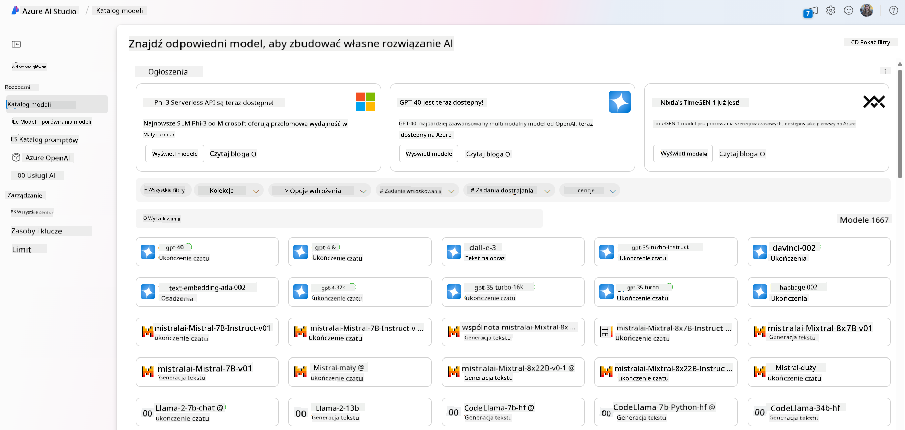
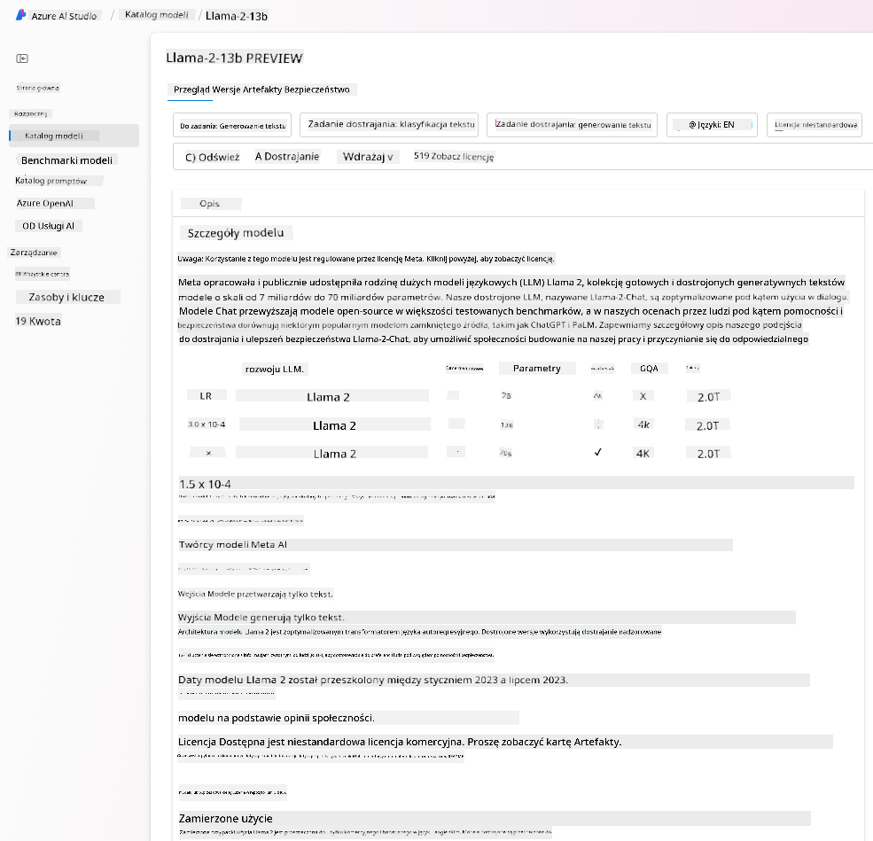
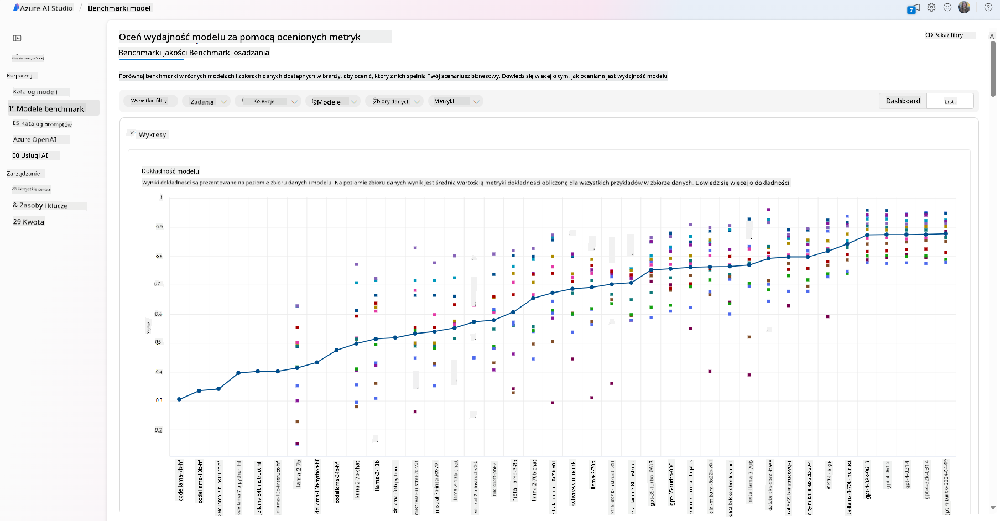
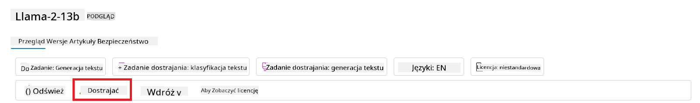
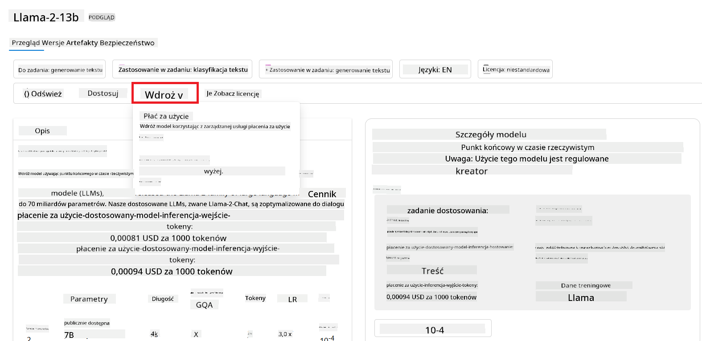
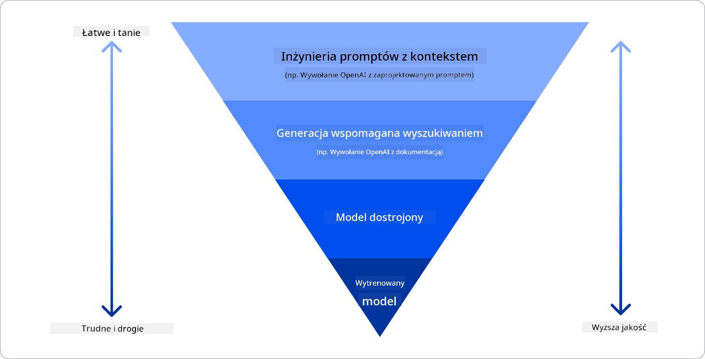

<!--
CO_OP_TRANSLATOR_METADATA:
{
  "original_hash": "e2f686f2eb794941761252ac5e8e090b",
  "translation_date": "2025-05-19T09:16:13+00:00",
  "source_file": "02-exploring-and-comparing-different-llms/README.md",
  "language_code": "pl"
}
-->
# Odkrywanie i porównywanie różnych LLM

> _Kliknij powyższy obrazek, aby obejrzeć wideo z tej lekcji_

W poprzedniej lekcji zobaczyliśmy, jak Generatywna AI zmienia krajobraz technologii, jak działają Duże Modele Językowe (LLM) i jak firma - taka jak nasz startup - może je zastosować do swoich przypadków użycia i rozwijać się! W tym rozdziale zamierzamy porównać i skontrastować różne typy dużych modeli językowych (LLM), aby zrozumieć ich zalety i wady.

Kolejnym krokiem w podróży naszego startupu jest eksploracja obecnego krajobrazu LLM i zrozumienie, które są odpowiednie dla naszego przypadku użycia.

## Wprowadzenie

Ta lekcja obejmie:

- Różne typy LLM w obecnym krajobrazie.
- Testowanie, iterowanie i porównywanie różnych modeli dla Twojego przypadku użycia w Azure.
- Jak wdrożyć LLM.

## Cele nauki

Po ukończeniu tej lekcji będziesz w stanie:

- Wybrać odpowiedni model dla swojego przypadku użycia.
- Zrozumieć, jak testować, iterować i poprawiać wydajność swojego modelu.
- Wiedzieć, jak firmy wdrażają modele.

## Zrozum różne typy LLM

LLM mogą mieć różne kategorie w zależności od ich architektury, danych treningowych i przypadku użycia. Zrozumienie tych różnic pomoże naszemu startupowi wybrać odpowiedni model dla scenariusza oraz zrozumieć, jak testować, iterować i poprawiać wydajność.

Istnieje wiele różnych typów modeli LLM, a Twój wybór modelu zależy od tego, do czego chcesz je używać, jakie masz dane, ile jesteś gotów zapłacić i więcej.

W zależności od tego, czy zamierzasz używać modeli do generowania tekstu, dźwięku, wideo, obrazów i tak dalej, możesz zdecydować się na inny typ modelu.

- **Rozpoznawanie dźwięku i mowy**. Do tego celu modele typu Whisper są doskonałym wyborem, ponieważ są uniwersalne i przeznaczone do rozpoznawania mowy. Są trenowane na różnorodnych dźwiękach i mogą wykonywać wielojęzyczne rozpoznawanie mowy. Dowiedz się więcej o [modelach typu Whisper tutaj](https://platform.openai.com/docs/models/whisper?WT.mc_id=academic-105485-koreyst).

- **Generowanie obrazów**. Do generowania obrazów DALL-E i Midjourney to dwa bardzo znane wybory. DALL-E jest oferowany przez Azure OpenAI. [Przeczytaj więcej o DALL-E tutaj](https://platform.openai.com/docs/models/dall-e?WT.mc_id=academic-105485-koreyst) oraz w rozdziale 9 tego programu nauczania.

- **Generowanie tekstu**. Większość modeli jest trenowana na generowanie tekstu i masz szeroki wybór od GPT-3.5 do GPT-4. Mają różne koszty, przy czym GPT-4 jest najdroższy. Warto zajrzeć do [Azure OpenAI playground](https://oai.azure.com/portal/playground?WT.mc_id=academic-105485-koreyst), aby ocenić, które modele najlepiej pasują do Twoich potrzeb pod względem możliwości i kosztów.

- **Multi-modalność**. Jeśli chcesz obsługiwać wiele typów danych w wejściu i wyjściu, możesz zainteresować się modelami takimi jak [gpt-4 turbo z wizją lub gpt-4o](https://learn.microsoft.com/azure/ai-services/openai/concepts/models#gpt-4-and-gpt-4-turbo-models?WT.mc_id=academic-105485-koreyst) - najnowsze wydania modeli OpenAI - które są w stanie połączyć przetwarzanie języka naturalnego z rozumieniem wizualnym, umożliwiając interakcje przez interfejsy multi-modalne.

Wybór modelu oznacza, że uzyskujesz pewne podstawowe możliwości, które mogą jednak nie wystarczyć. Często masz specyficzne dane firmowe, o których musisz jakoś poinformować LLM. Istnieje kilka różnych sposobów podejścia do tego, więcej na ten temat w nadchodzących sekcjach.

### Modele bazowe versus LLM

Termin Model Bazowy został [wymyślony przez badaczy z Stanford](https://arxiv.org/abs/2108.07258?WT.mc_id=academic-105485-koreyst) i zdefiniowany jako model AI, który spełnia pewne kryteria, takie jak:

- **Są trenowane za pomocą uczenia się bez nadzoru lub samonadzoru**, co oznacza, że są trenowane na nieoznakowanych danych wielomodalnych i nie wymagają ludzkiej adnotacji ani oznaczania danych do procesu treningowego.
- **Są bardzo dużymi modelami**, opartymi na bardzo głębokich sieciach neuronowych trenowanych na miliardach parametrów.
- **Są zwykle przeznaczone do służenia jako 'podstawa' dla innych modeli**, co oznacza, że mogą być używane jako punkt wyjścia dla innych modeli, które mogą być budowane na ich podstawie, co można zrobić poprzez dostrajanie.

Źródło obrazu: [Essential Guide to Foundation Models and Large Language Models | by Babar M Bhatti | Medium](https://thebabar.medium.com/essential-guide-to-foundation-models-and-large-language-models-27dab58f7404)

Aby lepiej wyjaśnić tę różnicę, weźmy ChatGPT jako przykład. Aby zbudować pierwszą wersję ChatGPT, model zwany GPT-3.5 służył jako model bazowy. Oznacza to, że OpenAI użyło pewnych danych specyficznych dla czatu, aby stworzyć dostrojoną wersję GPT-3.5, która była specjalizowana w dobrze działaniu w scenariuszach konwersacyjnych, takich jak chatboty.

Źródło obrazu: [2108.07258.pdf (arxiv.org)](https://arxiv.org/pdf/2108.07258.pdf?WT.mc_id=academic-105485-koreyst)

### Modele open source versus modele własnościowe

Innym sposobem kategoryzowania LLM jest to, czy są one open source czy własnościowe.

Modele open source to modele, które są udostępniane publicznie i mogą być używane przez każdego. Są często udostępniane przez firmę, która je stworzyła, lub przez społeczność badawczą. Te modele mogą być przeglądane, modyfikowane i dostosowywane do różnych przypadków użycia w LLM. Jednak nie zawsze są zoptymalizowane do użytku produkcyjnego i mogą nie być tak wydajne jak modele własnościowe. Ponadto, finansowanie dla modeli open source może być ograniczone, a modele te mogą nie być utrzymywane długoterminowo lub mogą nie być aktualizowane zgodnie z najnowszymi badaniami. Przykłady popularnych modeli open source to [Alpaca](https://crfm.stanford.edu/2023/03/13/alpaca.html?WT.mc_id=academic-105485-koreyst), [Bloom](https://huggingface.co/bigscience/bloom) i [LLaMA](https://llama.meta.com).

Modele własnościowe to modele, które są własnością firmy i nie są udostępniane publicznie. Te modele są często zoptymalizowane do użytku produkcyjnego. Jednak nie można ich przeglądać, modyfikować ani dostosowywać do różnych przypadków użycia. Ponadto nie zawsze są dostępne za darmo i mogą wymagać subskrypcji lub opłaty za użycie. Użytkownicy nie mają kontroli nad danymi, które są używane do trenowania modelu, co oznacza, że powinni zaufać właścicielowi modelu, że zapewni ochronę prywatności danych i odpowiedzialne użycie AI. Przykłady popularnych modeli własnościowych to [modele OpenAI](https://platform.openai.com/docs/models/overview?WT.mc_id=academic-105485-koreyst), [Google Bard](https://sapling.ai/llm/bard?WT.mc_id=academic-105485-koreyst) lub [Claude 2](https://www.anthropic.com/index/claude-2?WT.mc_id=academic-105485-koreyst).

### Wstawianie versus Generowanie obrazów versus Generowanie tekstu i kodu

LLM mogą być również kategoryzowane według generowanego wyjścia.

Wstawienia to zestaw modeli, które mogą konwertować tekst na formę numeryczną, zwaną wstawieniem, która jest numeryczną reprezentacją wejściowego tekstu. Wstawienia ułatwiają maszynom zrozumienie relacji między słowami lub zdaniami i mogą być wykorzystywane jako wejścia przez inne modele, takie jak modele klasyfikacyjne lub modele klastrowania, które mają lepszą wydajność na danych numerycznych. Modele wstawień są często używane do transferu uczenia, gdzie model jest budowany dla zadania zastępczego, dla którego jest dużo danych, a następnie wagi modelu (wstawienia) są ponownie używane do innych zadań. Przykładem tej kategorii jest [wstawienia OpenAI](https://platform.openai.com/docs/models/embeddings?WT.mc_id=academic-105485-koreyst).

Modele generowania obrazów to modele, które generują obrazy. Te modele są często używane do edycji obrazów, syntezy obrazów i tłumaczenia obrazów. Modele generowania obrazów są często trenowane na dużych zestawach danych obrazów, takich jak [LAION-5B](https://laion.ai/blog/laion-5b/?WT.mc_id=academic-105485-koreyst), i mogą być używane do generowania nowych obrazów lub do edytowania istniejących obrazów za pomocą technik inpaintingu, super-rozdzielczości i koloryzacji. Przykłady to [DALL-E-3](https://openai.com/dall-e-3?WT.mc_id=academic-105485-koreyst) i [Stable Diffusion models](https://github.com/Stability-AI/StableDiffusion?WT.mc_id=academic-105485-koreyst).

Modele generowania tekstu i kodu to modele, które generują tekst lub kod. Te modele są często używane do podsumowywania tekstu, tłumaczenia i odpowiadania na pytania. Modele generowania tekstu są często trenowane na dużych zestawach danych tekstowych, takich jak [BookCorpus](https://www.cv-foundation.org/openaccess/content_iccv_2015/html/Zhu_Aligning_Books_and_ICCV_2015_paper.html?WT.mc_id=academic-105485-koreyst), i mogą być używane do generowania nowego tekstu lub do odpowiadania na pytania. Modele generowania kodu, takie jak [CodeParrot](https://huggingface.co/codeparrot?WT.mc_id=academic-105485-koreyst), są często trenowane na dużych zestawach danych kodu, takich jak GitHub, i mogą być używane do generowania nowego kodu lub do naprawiania błędów w istniejącym kodzie.

### Model kodera-dekodera versus tylko dekoder

Aby omówić różne typy architektur LLM, użyjmy analogii.

Wyobraź sobie, że Twój menedżer dał Ci zadanie napisania quizu dla studentów. Masz dwóch kolegów; jeden zajmuje się tworzeniem treści, a drugi zajmuje się ich przeglądaniem.

Twórca treści jest jak model tylko dekodera, może spojrzeć na temat i zobaczyć, co już napisałeś, a następnie napisać kurs na tej podstawie. Są bardzo dobrzy w pisaniu angażujących i informacyjnych treści, ale nie są zbyt dobrzy w rozumieniu tematu i celów nauczania. Przykłady modeli dekodera to modele rodziny GPT, takie jak GPT-3.

Recenzent jest jak model tylko kodera, patrzą na napisany kurs i odpowiedzi, zauważając relacje między nimi i rozumiejąc kontekst, ale nie są dobrzy w generowaniu treści. Przykładem modelu tylko kodera byłby BERT.

Wyobraź sobie, że możemy mieć kogoś, kto mógłby tworzyć i przeglądać quiz, to jest model kodera-dekodera. Przykładami byłyby BART i T5.

### Usługa versus model

Teraz porozmawiajmy o różnicy między usługą a modelem. Usługa to produkt oferowany przez dostawcę usług w chmurze i często jest kombinacją modeli, danych i innych komponentów. Model jest głównym komponentem usługi i często jest modelem bazowym, takim jak LLM.

Usługi są często zoptymalizowane do użytku produkcyjnego i są często łatwiejsze w użyciu niż modele, za pomocą graficznego interfejsu użytkownika. Jednak usługi nie zawsze są dostępne za darmo i mogą wymagać subskrypcji lub opłaty za użycie, w zamian za wykorzystanie sprzętu i zasobów właściciela usługi, optymalizację wydatków i łatwe skalowanie. Przykładem usługi jest [Azure OpenAI Service](https://learn.microsoft.com/azure/ai-services/openai/overview?WT.mc_id=academic-105485-koreyst), która oferuje plan opłat proporcjonalnych do wykorzystania, co oznacza, że użytkownicy są obciążani proporcjonalnie do tego, jak dużo korzystają z usługi. Ponadto, Azure OpenAI Service oferuje zabezpieczenia klasy korporacyjnej i odpowiedzialne ramy AI na bazie możliwości modeli.

Modele to tylko sieć neuronowa, z parametrami, wagami i innymi. Pozwalają firmom działać lokalnie, jednak potrzebują zakupu sprzętu, budowy struktury do skalowania i zakupu licencji lub użycia modelu open source. Model taki jak LLaMA jest dostępny do użycia, wymagając mocy obliczeniowej do uruchomienia modelu.

## Jak testować i iterować z różnymi modelami, aby zrozumieć wydajność na Azure

Gdy nasz zespół zbadał obecny krajobraz LLM i zidentyfikował kilku dobrych kandydatów do swoich scenariuszy, kolejnym krokiem jest ich testowanie na swoich danych i obciążeniu. Jest to proces iteracyjny, wykonywany przez eksperymenty i pomiary.
Większość modeli, które wspomnieliśmy w poprzednich paragrafach (modele OpenAI, modele open source takie jak Llama2 i transformatory Hugging Face) są dostępne w [Katalogu Modeli](https://learn.microsoft.com/azure/ai-studio/how-to/model-catalog-overview?WT.mc_id=academic-105485-koreyst) w [Azure AI Studio](https://ai.azure.com/?WT.mc_id=academic-105485-koreyst).

[Azure AI Studio](https://learn.microsoft.com/azure/ai-studio/what-is-ai-studio?WT.mc_id=academic-105485-koreyst) to platforma chmurowa zaprojektowana dla deweloperów do budowy aplikacji generatywnej AI i zarządzania całym cyklem rozwoju - od eksperymentacji do oceny - łącząc wszystkie usługi AI Azure w jednym centrum z wygodnym GUI. Katalog Modeli w Azure AI Studio umożliwia użytkownikowi:

- Znalezienie modelu bazowego interesującego w katalogu - zarówno własnościowego, jak i open source, filtrując według zadania, licencji lub nazwy. Aby poprawić wyszukiwalność, modele są zorganizowane w kolekcje, takie jak kolekcja Azure OpenAI, kolekcja Hugging Face i więcej.

- Przegląd karty modelu, w tym szczegółowy opis zamierzonego użycia i danych treningowych, przykłady kodu oraz wyniki oceny w wewnętrznej bibliotece ocen.

- Porównaj wyniki testów różnych modeli i zestawów danych dostępnych w branży, aby ocenić, który z nich najlepiej pasuje do scenariusza biznesowego, korzystając z panelu [Model Benchmarks](https://learn.microsoft.com/azure/ai-studio/how-to/model-benchmarks?WT.mc_id=academic-105485-koreyst).

- Dostosuj model do własnych danych treningowych, aby poprawić jego wydajność w konkretnym obciążeniu, korzystając z możliwości eksperymentowania i śledzenia w Azure AI Studio.

- Wdróż oryginalny, wstępnie wytrenowany model lub jego dostosowaną wersję do zdalnego punktu inferencji w czasie rzeczywistym - zarządzanego obliczenia - lub punktu końcowego API bez serwera - [pay-as-you-go](https://learn.microsoft.com/azure/ai-studio/how-to/model-catalog-overview#model-deployment-managed-compute-and-serverless-api-pay-as-you-go?WT.mc_id=academic-105485-koreyst) - aby umożliwić aplikacjom korzystanie z niego.

> [!NOTE]
> Nie wszystkie modele w katalogu są obecnie dostępne do dostosowania i/lub wdrożenia w modelu pay-as-you-go. Sprawdź kartę modelu, aby uzyskać szczegółowe informacje na temat jego możliwości i ograniczeń.

## Poprawa wyników LLM

Zespół startupowy przeanalizował różne rodzaje LLM oraz platformę chmurową (Azure Machine Learning), która umożliwia porównywanie różnych modeli, ocenianie ich na danych testowych, poprawę wydajności i wdrażanie ich na punktach inferencji.

Ale kiedy powinni rozważyć dostosowanie modelu zamiast używania wstępnie wytrenowanego? Czy są inne podejścia do poprawy wydajności modelu w określonych obciążeniach?

Istnieje kilka podejść, które firma może zastosować, aby uzyskać wyniki, których potrzebuje od LLM. Możesz wybrać różne typy modeli o różnym stopniu treningu podczas wdrażania LLM w produkcji, z różnym poziomem złożoności, kosztów i jakości. Oto kilka różnych podejść:

- **Inżynieria promptów z kontekstem**. Chodzi o to, aby zapewnić wystarczający kontekst podczas promptu, aby upewnić się, że otrzymasz potrzebne odpowiedzi.

- **Retrieval Augmented Generation, RAG**. Twoje dane mogą znajdować się w bazie danych lub punkcie końcowym w sieci, na przykład, aby upewnić się, że te dane lub ich podzbiór są uwzględniane podczas promptu, możesz pobrać odpowiednie dane i uczynić je częścią promptu użytkownika.

- **Dostosowany model**. Tutaj, wytrenowałeś model dalej na własnych danych, co sprawiło, że model jest bardziej precyzyjny i odpowiadający na twoje potrzeby, ale może być kosztowny.

Źródło obrazka: [Four Ways that Enterprises Deploy LLMs | Fiddler AI Blog](https://www.fiddler.ai/blog/four-ways-that-enterprises-deploy-llms?WT.mc_id=academic-105485-koreyst)

### Inżynieria promptów z kontekstem

Wstępnie wytrenowane LLM dobrze radzą sobie z ogólnymi zadaniami związanymi z językiem naturalnym, nawet przy krótkim promptcie, takim jak zdanie do dokończenia lub pytanie – tzw. „zero-shot” learning.

Jednak im bardziej użytkownik może sformułować swoje zapytanie, z szczegółową prośbą i przykładami – kontekstem – tym bardziej dokładna i bliższa oczekiwaniom użytkownika będzie odpowiedź. W tym przypadku mówimy o „one-shot” learning, jeśli prompt zawiera tylko jeden przykład, oraz „few-shot learning”, jeśli zawiera wiele przykładów. Inżynieria promptów z kontekstem to najbardziej opłacalne podejście do rozpoczęcia pracy.

### Retrieval Augmented Generation (RAG)

LLM mają ograniczenie polegające na tym, że mogą używać tylko danych, które zostały użyte podczas ich treningu do generowania odpowiedzi. Oznacza to, że nie wiedzą nic o faktach, które wydarzyły się po procesie treningowym, i nie mogą uzyskać dostępu do informacji niepublicznych (jak dane firmowe). Można to przezwyciężyć dzięki RAG, technice, która wzbogaca prompt o zewnętrzne dane w postaci fragmentów dokumentów, uwzględniając ograniczenia długości promptu. Jest to wspierane przez narzędzia baz danych wektorowych (takie jak [Azure Vector Search](https://learn.microsoft.com/azure/search/vector-search-overview?WT.mc_id=academic-105485-koreyst)), które pobierają użyteczne fragmenty z różnych zdefiniowanych źródeł danych i dodają je do kontekstu promptu.

Ta technika jest bardzo pomocna, gdy firma nie ma wystarczającej ilości danych, czasu ani zasobów, aby dostosować LLM, ale nadal chce poprawić wydajność w określonym obciążeniu i zmniejszyć ryzyko fałszerstw, czyli mistyfikacji rzeczywistości lub szkodliwych treści.

### Dostosowany model

Dostosowanie to proces wykorzystujący transfer learning do „adaptacji” modelu do zadania końcowego lub rozwiązania konkretnego problemu. W przeciwieństwie do few-shot learning i RAG, skutkuje wygenerowaniem nowego modelu z zaktualizowanymi wagami i odchyleniami. Wymaga zestawu przykładów treningowych składających się z pojedynczego wejścia (promptu) i jego powiązanego wyjścia (ukończenia). Byłoby to preferowane podejście, jeśli:

- **Używanie dostosowanych modeli**. Firma chciałaby używać mniej wydajnych dostosowanych modeli (jak modele osadzania) zamiast modeli o wysokiej wydajności, co skutkuje bardziej opłacalnym i szybkim rozwiązaniem.

- **Rozważanie opóźnienia**. Opóźnienie jest ważne dla konkretnego przypadku użycia, więc nie można używać bardzo długich promptów ani liczba przykładów, które model powinien nauczyć się, nie pasuje do limitu długości promptu.

- **Utrzymanie aktualności**. Firma ma dużo danych wysokiej jakości i etykiety prawdziwej oraz zasoby potrzebne do utrzymania tych danych na bieżąco.

### Wytrenowany model

Trenowanie LLM od podstaw jest bez wątpienia najtrudniejszym i najbardziej skomplikowanym podejściem, wymagającym ogromnych ilości danych, wykwalifikowanych zasobów i odpowiedniej mocy obliczeniowej. Ta opcja powinna być rozważana tylko w scenariuszu, gdy firma ma specyficzny przypadek użycia dla danego domeny i dużą ilość danych skoncentrowanych na domenie.

## Sprawdzenie wiedzy

Co może być dobrym podejściem do poprawy wyników ukończenia LLM?

1. Inżynieria promptów z kontekstem
1. RAG
1. Dostosowany model

A:3, jeśli masz czas i zasoby oraz dane wysokiej jakości, dostosowanie jest lepszą opcją, aby być na bieżąco. Jednak jeśli chcesz poprawić wyniki i brakuje ci czasu, warto najpierw rozważyć RAG.

## 🚀 Wyzwanie

Dowiedz się więcej o tym, jak możesz [użyć RAG](https://learn.microsoft.com/azure/search/retrieval-augmented-generation-overview?WT.mc_id=academic-105485-koreyst) dla swojej firmy.

## Świetna robota, kontynuuj naukę

Po ukończeniu tej lekcji, zapoznaj się z naszą [kolekcją nauki o generatywnej AI](https://aka.ms/genai-collection?WT.mc_id=academic-105485-koreyst), aby kontynuować rozwijanie wiedzy o generatywnej AI!

Przejdź do Lekcji 3, gdzie przyjrzymy się, jak [budować odpowiedzialnie z generatywną AI](../03-using-generative-ai-responsibly/README.md?WT.mc_id=academic-105485-koreyst)!

**Zastrzeżenie**:  
Ten dokument został przetłumaczony za pomocą usługi tłumaczenia AI [Co-op Translator](https://github.com/Azure/co-op-translator). Chociaż staramy się zapewnić dokładność, prosimy pamiętać, że automatyczne tłumaczenia mogą zawierać błędy lub nieścisłości. Oryginalny dokument w jego rodzimym języku powinien być uznawany za autorytatywne źródło. W przypadku istotnych informacji zaleca się profesjonalne tłumaczenie przez człowieka. Nie ponosimy odpowiedzialności za wszelkie nieporozumienia lub błędne interpretacje wynikające z użycia tego tłumaczenia.