# Eksploracja i porównanie różnych LLM

[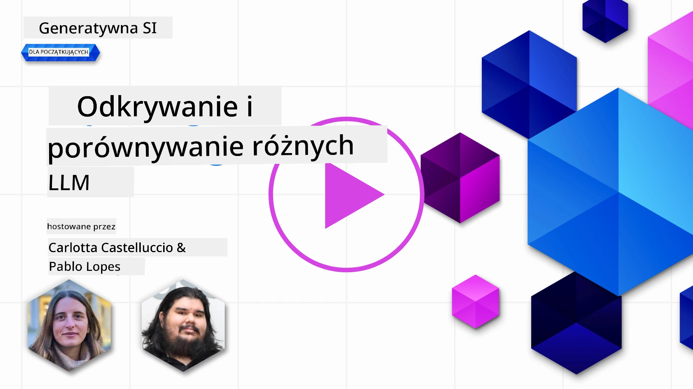](https://youtu.be/KIRUeDKscfI?si=8BHX1zvwzQBn-PlK)

> _Kliknij powyższy obraz, aby zobaczyć wideo z tej lekcji_

W poprzedniej lekcji zobaczyliśmy, jak Generatywna AI zmienia krajobraz technologiczny, jak działają Duże Modele Językowe (LLM) oraz jak firma – taka jak nasz startup – może je zastosować w swoich przypadkach użycia i rozwijać się! W tym rozdziale porównamy różne typy dużych modeli językowych (LLM), aby zrozumieć ich zalety i wady.

Kolejnym krokiem w podróży naszego startupu jest eksploracja obecnego krajobrazu LLM i zrozumienie, które z nich są odpowiednie dla naszego przypadku użycia.

## Wprowadzenie

Ta lekcja obejmie:

- Różne typy LLM w obecnym krajobrazie.
- Testowanie, iterowanie i porównywanie różnych modeli dla Twojego przypadku użycia w Azure.
- Jak wdrożyć LLM.

## Cele nauki

Po ukończeniu tej lekcji będziesz w stanie:

- Wybrać odpowiedni model dla swojego przypadku użycia.
- Zrozumieć, jak testować, iterować i poprawiać wydajność swojego modelu.
- Wiedzieć, jak firmy wdrażają modele.

## Zrozumienie różnych typów LLM

LLM można sklasyfikować na wiele sposobów, w zależności od ich architektury, danych treningowych i zastosowania. Zrozumienie tych różnic pomoże naszemu startupowi wybrać odpowiedni model dla scenariusza oraz zrozumieć, jak testować, iterować i poprawiać wydajność.

Istnieje wiele różnych typów modeli LLM, a wybór modelu zależy od tego, do czego chcesz go użyć, jakie masz dane, ile jesteś gotów zapłacić i innych czynników.

W zależności od tego, czy chcesz używać modeli do tekstu, audio, wideo, generowania obrazów itp., możesz wybrać inny typ modelu.

- **Rozpoznawanie dźwięku i mowy**. Modele w stylu Whisper nadal są przydatne jako ogólne modele rozpoznawania mowy, ale w produkcji używa się także nowszych modeli zamiany mowy na tekst, takich jak `gpt-4o-transcribe`, `gpt-4o-mini-transcribe` oraz warianty diarizacji. Oceń wsparcie językowe, diarizację, obsługę czasu rzeczywistego, opóźnienia i koszt dla swojego scenariusza. Dowiedz się więcej w [dokumentacji OpenAI dotyczącej zamiany mowy na tekst](https://platform.openai.com/docs/guides/speech-to-text?WT.mc_id=academic-105485-koreyst).

- **Generowanie obrazów**. DALL-E i Midjourney są dobrze znanymi opcjami generowania obrazów, ale obecne API OpenAI koncentrują się na modelach GPT Image, takich jak `gpt-image-2`, podczas gdy Stable Diffusion, Imagen, Flux i inne rodziny modeli także są popularnymi wyborami. Porównaj zgodność z poleceniem, wsparcie edycji, kontrolę stylu, wymagania bezpieczeństwa i licencjonowanie. Dowiedz się więcej w [przewodniku OpenAI dotyczącym generowania obrazów](https://platform.openai.com/docs/guides/images?WT.mc_id=academic-105485-koreyst) oraz w rozdziale 9 tego programu nauczania.

- **Generowanie tekstu**. Modele tekstowe obejmują modele czołowe, modele rozumowania, mniejsze modele o niskim opóźnieniu oraz modele o otwartych wagach. Aktualne przykłady to modele OpenAI GPT-5.x, Anthropic Claude 4.x, Google Gemini 3.x, Meta Llama 4 i Mistral. Nie wybieraj wyłącznie według daty wydania czy ceny; porównaj jakość zadania, opóźnienie, okno kontekstowe, wykorzystanie narzędzi, zachowanie bezpieczeństwa, dostępność regionalną i całkowity koszt. [Katalog modeli Microsoft Foundry](https://ai.azure.com/catalog?WT.mc_id=academic-105485-koreyst) to dobre miejsce do porównania modeli dostępnych w Azure.

- **Multi-modalność**. Wiele obecnych modeli potrafi przetwarzać więcej niż tylko tekst. Niektóre akceptują obrazy, dźwięk lub wideo jako dane wejściowe; inne mogą korzystać z narzędzi; modele specjalistyczne mogą generować obrazy, dźwięk lub wideo. Na przykład obecne modele OpenAI obsługują wejścia tekstowe i obrazowe, modele Gemini mogą obsługiwać tekst, kod, obraz, dźwięk i wideo w zależności od wariantu, a Llama 4 Scout oraz Maverick to otwarte modele natywnie multimodalne. Zawsze sprawdzaj specyfikację modelu dotyczącą obsługiwanych modalności wejściowych i wyjściowych przed budowaniem na nim rozwiązania.

Wybierając model, otrzymujesz pewne podstawowe możliwości, które mogą jednak nie być wystarczające. Często posiadasz firmowe dane, o których musisz w jakiś sposób poinformować LLM. Istnieje kilka różnych podejść do tego zagadnienia, o czym więcej w nadchodzących sekcjach.

### Modele bazowe versus LLM

Termin Model Bazowy został [ukuty przez badaczy z Stanford](https://arxiv.org/abs/2108.07258?WT.mc_id=academic-105485-koreyst) i zdefiniowany jako model AI spełniający pewne kryteria, takie jak:

- **Trenowane za pomocą uczenia bez nadzoru lub samonadzorowanego**, co oznacza, że są trenowane na nieoznaczonych danych multimodalnych i nie wymagają ręcznej anotacji ani etykietowania danych w trakcie treningu.
- **Są to bardzo duże modele**, oparte na bardzo głębokich sieciach neuronowych trenowanych na miliardach parametrów.
- **Są zaprojektowane jako „podstawa” dla innych modeli**, co oznacza, że mogą być wykorzystywane jako punkt wyjścia do tworzenia innych modeli poprzez dostrajanie.

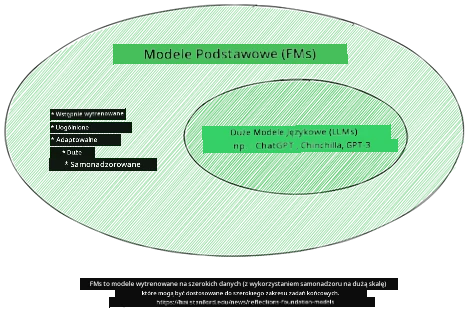

Źródło obrazu: [Essential Guide to Foundation Models and Large Language Models | by Babar M Bhatti | Medium
](https://thebabar.medium.com/essential-guide-to-foundation-models-and-large-language-models-27dab58f7404)

Aby jeszcze bardziej wyjaśnić to rozróżnienie, weźmy ChatGPT jako historyczny przykład. Wczesne wersje ChatGPT używały GPT-3.5 jako modelu bazowego. OpenAI następnie wykorzystało dane specyficzne dla rozmów i techniki dopasowania, aby stworzyć dostrojoną wersję lepiej działającą w scenariuszach konwersacyjnych, takich jak chatboty. Nowoczesne usługi AI często korzystają z kilku wariantów modeli, więc nazwa usługi i nazwa bazowego modelu nie zawsze są tym samym.

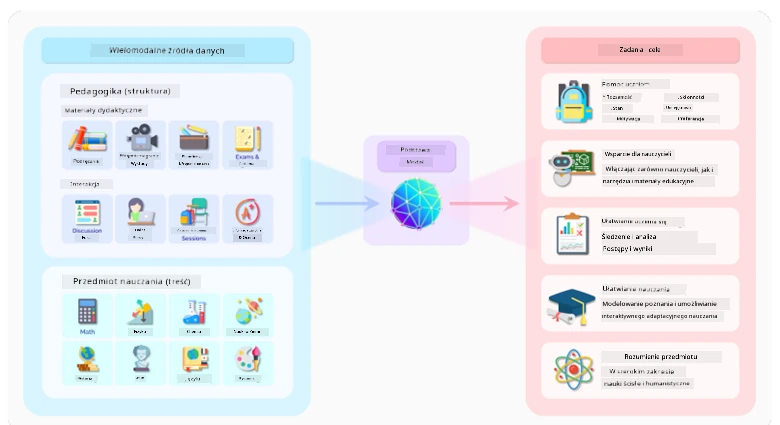

Źródło obrazu: [2108.07258.pdf (arxiv.org)](https://arxiv.org/pdf/2108.07258.pdf?WT.mc_id=academic-105485-koreyst)

### Modele otwarte (open-weight/open-source) versus własnościowe

Innym sposobem kategoryzacji LLM jest podział na modele open-weight, open-source lub własnościowe.

Modele open-source oraz open-weight udostępniają artefakty modelu do inspekcji, pobrania lub dostosowania, jednak ich licencje różnią się. Niektóre są w pełni otwartoźródłowe, podczas gdy inne to modele open-weight z ograniczeniami użycia. Są przydatne, gdy firma potrzebuje większej kontroli nad wdrożeniem, lokalizacją danych, kosztami lub personalizacją. Jednak zespoły nadal muszą sprawdzić warunki licencji, koszty obsługi, aktualizacje zabezpieczeń i jakość oceny przed wykorzystaniem ich w produkcji. Przykłady to [Meta Llama 4](https://ai.meta.com/blog/llama-4-multimodal-intelligence/?WT.mc_id=academic-105485-koreyst), niektóre [modele Mistral](https://docs.mistral.ai/models/overview?WT.mc_id=academic-105485-koreyst) oraz wiele modeli dostępnych na [Hugging Face](https://huggingface.co/models?WT.mc_id=academic-105485-koreyst).

Modele własnościowe są własnością i hostowane przez dostawcę. Modele te często są zoptymalizowane pod kątem zarządzanego użytku produkcyjnego i oferują silne wsparcie, systemy bezpieczeństwa, integrację narzędzi i skalowalność. Jednak klienci zazwyczaj nie mogą przeglądać lub modyfikować wag modeli i muszą dokładnie zapoznać się z warunkami dostawcy dotyczącymi prywatności, przechowywania danych, zgodności i akceptowalnego użycia. Przykłady to [modele OpenAI](https://platform.openai.com/docs/models?WT.mc_id=academic-105485-koreyst), [Google Gemini](https://deepmind.google/models/gemini/pro/?WT.mc_id=academic-105485-koreyst) oraz [Anthropic Claude](https://platform.claude.com/docs/en/about-claude/models/overview?WT.mc_id=academic-105485-koreyst).

### Różnice między embeddingiem, generowaniem obrazów a generowaniem tekstu i kodu

LLM można także kategoryzować według rodzaju generowanego wyjścia.

Embeddingi to zbiór modeli, które przekształcają tekst w postać numeryczną, zwaną embeddingiem, będącą numeryczną reprezentacją tekstu wejściowego. Embeddingi ułatwiają maszynom rozumienie relacji między słowami lub zdaniami i mogą służyć jako dane wejściowe dla innych modeli, takich jak modele klasyfikacji lub klasteryzacji, które lepiej radzą sobie z danymi numerycznymi. Modele embeddingowe są często używane do transfer learningu, gdzie model jest tworzony dla zadania zastępczego, dla którego jest dużo danych, a następnie wagi modelu (embeddingi) są ponownie wykorzystywane do innych zadań. Przykładem jest [embedding OpenAI](https://platform.openai.com/docs/models/embeddings?WT.mc_id=academic-105485-koreyst).

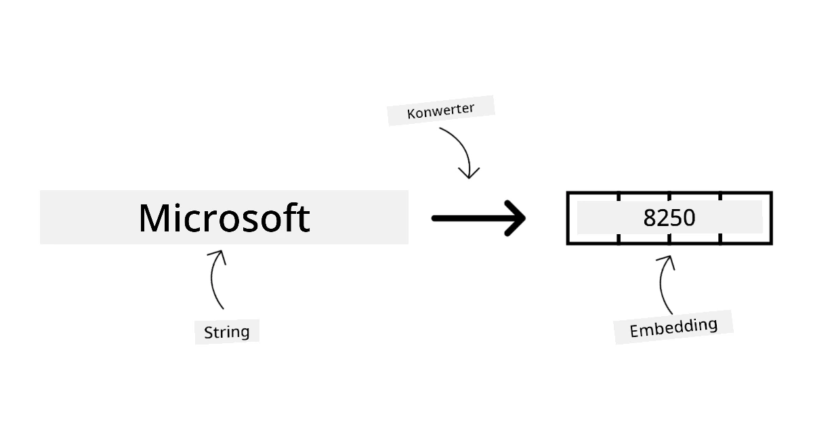

Modele generujące obrazy to modele, które tworzą obrazy. Modele te są często używane do edycji, syntezy i tłumaczenia obrazów. Modele generowania obrazów są trenowane na dużych zbiorach obrazów, takich jak [LAION-5B](https://laion.ai/blog/laion-5b/?WT.mc_id=academic-105485-koreyst), i mogą służyć do tworzenia nowych obrazów lub edycji istniejących za pomocą technik takich jak inpainting, super-rozdzielczość i koloryzacja. Przykłady to [modele GPT Image](https://platform.openai.com/docs/guides/images?WT.mc_id=academic-105485-koreyst), [modele Stable Diffusion](https://github.com/Stability-AI/StableDiffusion?WT.mc_id=academic-105485-koreyst) oraz modele Imagen.

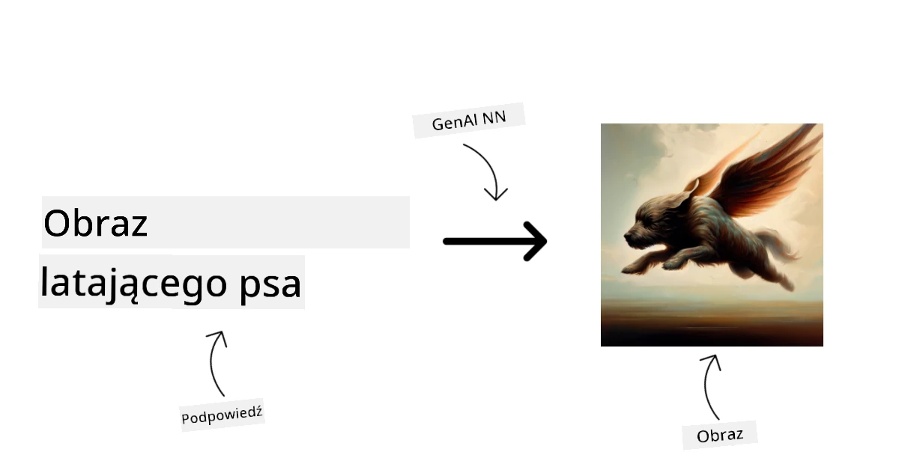

Modele generujące tekst i kod to modele, które tworzą tekst lub kod. Modele te są często używane do podsumowania tekstu, tłumaczenia i odpowiadania na pytania. Modele generujące tekst są trenowane na dużych zbiorach tekstów, takich jak [BookCorpus](https://www.cv-foundation.org/openaccess/content_iccv_2015/html/Zhu_Aligning_Books_and_ICCV_2015_paper.html?WT.mc_id=academic-105485-koreyst), i mogą służyć do generowania nowego tekstu lub odpowiadania na pytania. Modele generowania kodu, takie jak [CodeParrot](https://huggingface.co/codeparrot?WT.mc_id=academic-105485-koreyst), są trenowane na dużych zestawach kodu, takich jak GitHub, i mogą generować nowy kod lub naprawiać błędy w istniejącym kodzie.

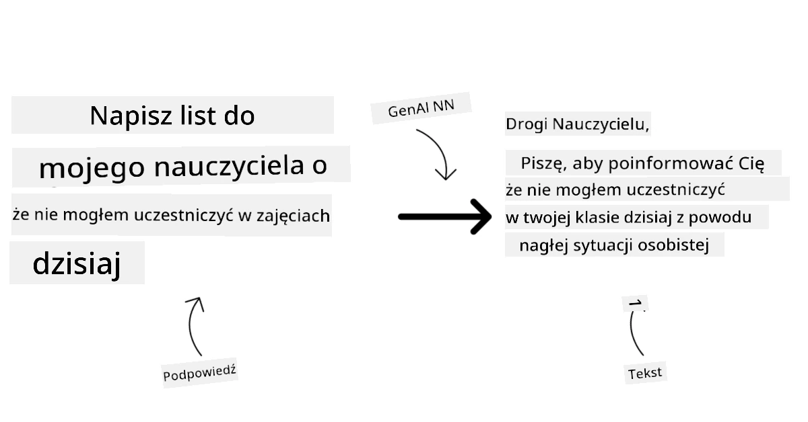

### Architectures: Encoder-Decoder versus Decoder-only

Aby omówić różne typy architektur LLM, użyjmy analogii.

Wyobraź sobie, że Twój menedżer zlecił Ci stworzenie quizu dla studentów. Masz dwóch kolegów: jeden zajmuje się tworzeniem treści, drugi nadzoruje ich sprawdzanie.

Twórca treści jest jak model decoder-only: może spojrzeć na temat, zobaczyć, co już napisałeś, i kontynuować generowanie treści na podstawie tego kontekstu. Są bardzo dobrzy w pisaniu angażujących i informacyjnych materiałów, ale nie zawsze sprawdzają się, gdy zadaniem jest klasyfikacja, wyszukiwanie czy kodowanie informacji. Przykładami rodzin modeli decoder-only są modele GPT i Llama.

Recenzent jest jak model Encoder-only: sprawdza napisany materiał i odpowiedzi, zauważa relacje między nimi i rozumie kontekst, ale nie jest dobry w generowaniu treści. Przykładem modelu Encoder-only jest BERT.

Wyobraź sobie, że mamy osobę, która może tworzyć i sprawdzać quiz — to jest model Encoder-Decoder. Przykładami są BART i T5.

### Usługa versus model

Teraz porozmawiajmy o różnicy między usługą a modelem. Usługa to produkt oferowany przez Dostawcę Usług Chmurowych, często będący kombinacją modeli, danych i innych komponentów. Model to podstawowy element usługi, często model bazowy, taki jak LLM.

Usługi często są zoptymalizowane do użytku produkcyjnego i łatwiejsze w użyciu niż modele, np. poprzez graficzny interfejs użytkownika. Jednak usługi nie zawsze są darmowe i mogą wymagać subskrypcji lub płatności, w zamian za korzystanie ze sprzętu i zasobów właściciela usługi, optymalizując koszty i umożliwiając łatwe skalowanie. Przykładem usługi jest [Azure OpenAI Service](https://learn.microsoft.com/azure/ai-services/openai/overview?WT.mc_id=academic-105485-koreyst), która oferuje model płatności według zużycia, co oznacza, że użytkownicy są naliczani proporcjonalnie do ilości korzystania z usługi. Azure OpenAI Service zapewnia także zabezpieczenia na poziomie przedsiębiorstwa i odpowiedzialne ramy AI oparte na możliwościach modeli.

Modele to artefakty sieci neuronowej: parametry, wagi, architektura, tokenizer i konfiguracja wspierająca. Uruchamianie modelu lokalnie lub w środowisku prywatnym wymaga odpowiedniego sprzętu, infrastruktury serwującej, monitoringu oraz kompatybilnej licencji open-source/open-weight lub licencji komercyjnej. Modele open-weight, takie jak Llama 4 lub modele Mistral, mogą być hostowane samodzielnie, ale nadal wymagają mocy obliczeniowej i wiedzy operacyjnej.

## Jak testować i iterować różne modele, aby zrozumieć ich wydajność w Azure

Gdy nasz zespół zbadał obecny krajobraz LLM i zidentyfikował dobre kandydatury do ich scenariuszy, następnym krokiem jest przetestowanie ich na ich danych i obciążeniach pracy. Jest to proces iteracyjny, realizowany poprzez eksperymenty i pomiary.
Większość modeli, które wspomnieliśmy w poprzednich akapitach (modele OpenAI, modele z otwartymi wagami, takie jak Llama 4 i Mistral, oraz modele Hugging Face) jest dostępna w [Microsoft Foundry Models](https://learn.microsoft.com/azure/foundry/concepts/foundry-models-overview?WT.mc_id=academic-105485-koreyst).

[Microsoft Foundry](https://learn.microsoft.com/azure/foundry/what-is-foundry?WT.mc_id=academic-105485-koreyst), dawniej Azure AI Studio/Azure AI Foundry, to zunifikowana platforma Azure do tworzenia aplikacji i agentów AI. Pomaga programistom zarządzać cyklem życia od eksperymentowania i oceny po wdrożenie, monitorowanie i zarządzanie. Katalog modeli w Microsoft Foundry pozwala użytkownikowi:

- Znaleźć interesujący model bazowy w katalogu, w tym modele sprzedawane przez Azure oraz modele od partnerów i dostawców społecznościowych. Użytkownicy mogą filtrować według zadania, dostawcy, licencji, opcji wdrożenia lub nazwy.

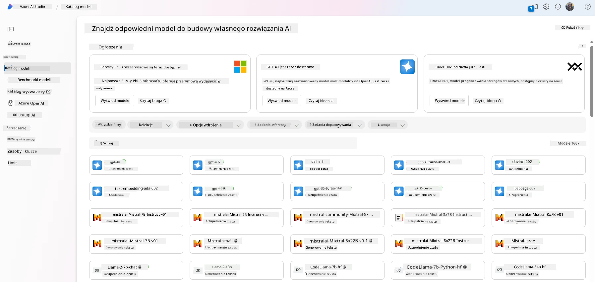

- Przejrzeć kartę modelu, w tym szczegółowy opis zamierzonego zastosowania i danych treningowych, przykłady kodu oraz wyniki ewaluacji w wewnętrznej bibliotece ocen.

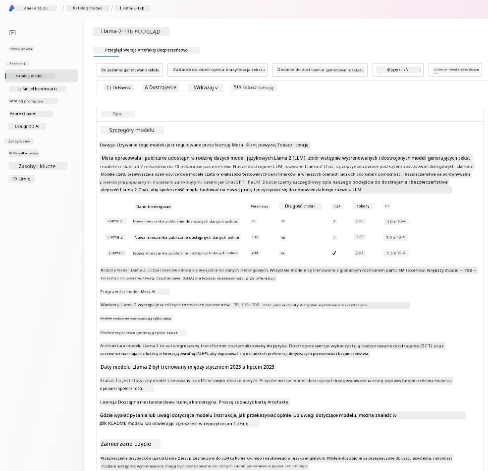

- Porównać benchmarki między modelami i zestawami danych dostępnymi w branży, aby ocenić, który spełnia wymagania biznesowe, za pomocą panelu [Model Benchmarks](https://learn.microsoft.com/azure/ai-studio/how-to/model-benchmarks?WT.mc_id=academic-105485-koreyst).

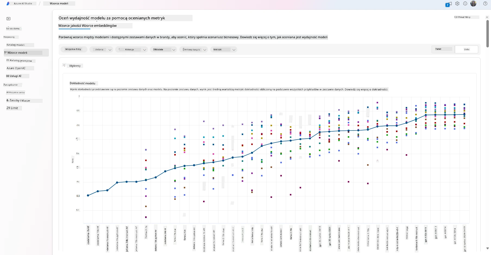

- Dostrajać obsługiwane modele na niestandardowych danych szkoleniowych, aby poprawić wydajność modelu w konkretnym obciążeniu pracy, wykorzystując możliwości eksperymentowania i monitorowania w Microsoft Foundry.

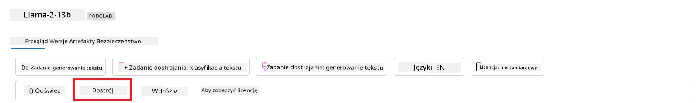

- Wdrożyć oryginalny model wstępnie wytrenowany lub wersję dostrojoną na zdalny punkt końcowy inferencji w czasie rzeczywistym, używając zarządzanych zasobów obliczeniowych lub opcji wdrożenia bezserwerowego, aby umożliwić aplikacjom korzystanie z niego.

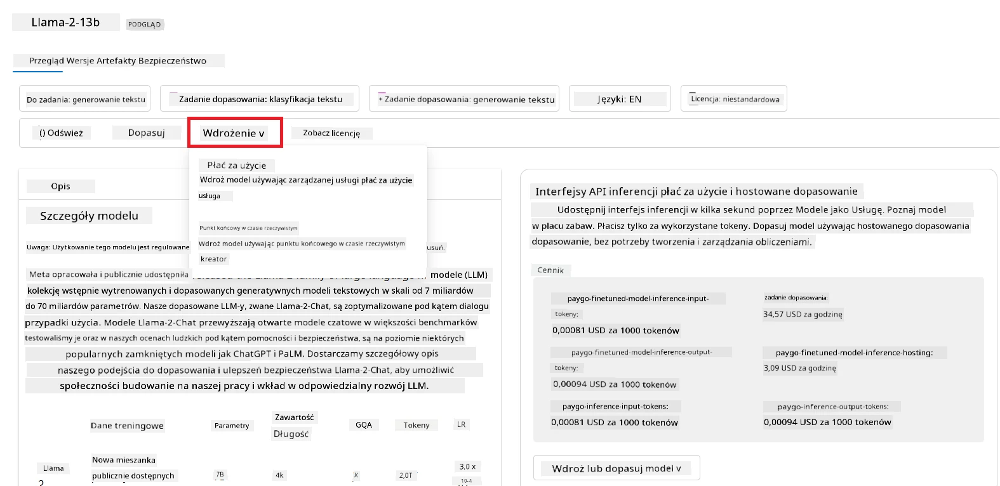

> [!NOTE]
> Nie wszystkie modele w katalogu są obecnie dostępne do dostrajania i/lub wdrożeń typu pay-as-you-go. Sprawdź kartę modelu, aby poznać szczegóły dotyczące możliwości i ograniczeń modelu.

## Poprawa wyników LLM

Nasz zespół startupowy zbadał różne typy LLM oraz platformę w chmurze (Microsoft Foundry), która umożliwia porównywanie różnych modeli, ich ocenę na danych testowych, poprawę wydajności oraz wdrażanie ich na końcówkach inferencyjnych.

Ale kiedy powinni rozważyć dostrajanie modelu zamiast używania modelu wstępnie wytrenowanego? Czy istnieją inne podejścia do poprawy wydajności modelu przy konkretnych obciążeniach pracy?

Istnieje kilka podejść, które firma może wykorzystać, aby uzyskać potrzebne wyniki z LLM. Możesz wybrać różne typy modeli o różnym stopniu wytrenowania podczas wdrażania LLM w produkcji, o różnym poziomie złożoności, kosztów i jakości. Oto kilka różnych podejść:

- **Inżynieria promptów z kontekstem**. Pomysł polega na dostarczeniu wystarczającego kontekstu podczas wywoływania promptu, aby zapewnić uzyskanie potrzebnych odpowiedzi.

- **Retrieval Augmented Generation, RAG**. Twoje dane mogą na przykład istnieć w bazie danych lub punkcie końcowym sieci Web. Aby zapewnić uwzględnienie tych danych lub ich podzbioru w momencie podawania promptu, można pobrać odpowiednie dane i dołączyć je do promptu użytkownika.

- **Model dostrojony**. Tutaj trenowałeś model dalej na własnych danych, co sprawiło, że model był bardziej precyzyjny i responsywny na Twoje potrzeby, ale może być kosztowne.

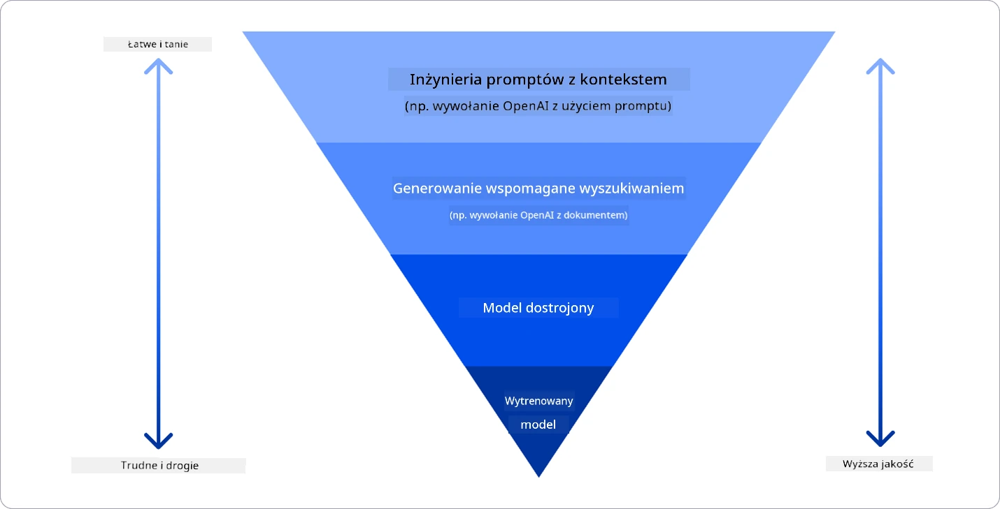

Źródło obrazka: [Four Ways that Enterprises Deploy LLMs | Fiddler AI Blog](https://www.fiddler.ai/blog/four-ways-that-enterprises-deploy-llms?WT.mc_id=academic-105485-koreyst)

### Inżynieria promptów z kontekstem

Wstępnie wytrenowane LLM świetnie radzą sobie z uogólnionymi zadaniami języka naturalnego, nawet wywołane krótkim promptem, jak zdanie do uzupełnienia lub pytanie – tak zwanym uczeniem „zero-shot”.

Jednak im bardziej użytkownik może sformułować swoje zapytanie, z dokładnym żądaniem i przykładami – Kontekstem – tym bardziej precyzyjna i zgodna z oczekiwaniami użytkownika będzie odpowiedź. W tym przypadku mówimy o uczeniu „one-shot”, jeśli prompt zawiera tylko jeden przykład, oraz o uczeniu „few-shot”, jeśli zawiera wiele przykładów.
Inżynieria promptów z kontekstem to najbardziej opłacalne podejście na rozpoczęcie pracy.

### Retrieval Augmented Generation (RAG)

LLM mają ograniczenie, że mogą używać tylko danych, które zostały wykorzystane podczas ich treningu, aby wygenerować odpowiedź. Oznacza to, że nie wiedzą nic o faktach, które wydarzyły się po procesie treningu i nie mają dostępu do informacji niepublicznych (np. danych firmowych).
Można to przezwyciężyć za pomocą RAG, techniki, która rozszerza prompt o zewnętrzne dane w postaci fragmentów dokumentów, biorąc pod uwagę limit długości promptu. Wspierają to narzędzia baz danych wektorowych (np. [Azure Vector Search](https://learn.microsoft.com/azure/search/vector-search-overview?WT.mc_id=academic-105485-koreyst)), które pobierają przydatne fragmenty z różnych zdefiniowanych źródeł danych i dodają je do kontekstu promptu.

Technika ta jest bardzo pomocna, gdy firma nie ma wystarczająco dużo danych, czasu lub zasobów na dostrajanie LLM, ale chce poprawić wydajność na konkretnym obciążeniu oraz zmniejszyć ryzyko halucynacji, nieaktualnych lub niepopartych odpowiedzi.

### Model dostrojony

Dostrajanie to proces wykorzystujący transfer learning do „dostosowania” modelu do zadania końcowego lub rozwiązania konkretnego problemu. W przeciwieństwie do uczenia few-shot i RAG, skutkuje wygenerowaniem nowego modelu z zaktualizowanymi wagami i biasami. Wymaga zestawu przykładów treningowych składających się z pojedynczego wejścia (promptu) i powiązanego wyjścia (uzupełnienia).
To byłoby preferowane podejście w przypadku:

- **Używania mniejszych modeli dedykowanych do konkretnych zadań**. Firma chciałaby dostroić mniejszy model do wąskiego zadania, zamiast wielokrotnie wywoływać większy model z czołówki, co skutkuje bardziej opłacalnym i szybszym rozwiązaniem.

- **Uwzględnienia opóźnień**. Opóźnienie jest ważne dla konkretnego przypadku, więc nie można używać bardzo długich promptów lub liczby przykładów, które model powinien przyswoić, nie mieszczących się w limicie długości promptu.

- **Dostosowania stabilnego zachowania**. Firma ma wiele wysokiej jakości przykładów i chce, aby model konsekwentnie podążał za wzorcem zadania, formatem wyjścia, tonem lub specyficznym stylem domenowym. Jeśli głównym problemem są świeże fakty lub prywatna wiedza, która często się zmienia, użyj RAG zamiast polegać wyłącznie na dostrajaniu.

### Model trenowany

Trenowanie LLM od podstaw to bez wątpienia najbardziej trudne i skomplikowane podejście, wymagające ogromnych ilości danych, wykwalifikowanych zasobów i odpowiedniej mocy obliczeniowej. Opcja ta powinna być rozważana tylko w scenariuszu, gdy firma ma przypadek użycia specyficzny dla domeny i dużą ilość danych zorientowanych na tę domenę.

## Sprawdzenie wiedzy

Co mogłoby być dobrym podejściem do poprawy wyników uzupełniania LLM?

1. Inżynieria promptów z kontekstem
1. RAG
1. Model dostrojony

A: Wszystkie trzy mogą pomóc. Zacznij od inżynierii promptów i kontekstu dla szybkich ulepszeń, a użyj RAG, gdy model potrzebuje aktualnych faktów lub prywatnych danych biznesowych. Wybierz dostrajanie, gdy masz wystarczająco dużo wysokiej jakości przykładów i chcesz, aby model konsekwentnie podążał za zadaniem, formatem, tonem lub wzorcem domenowym.

## 🚀 Wyzwanie

Dowiedz się więcej, jak możesz [użyć RAG](https://learn.microsoft.com/azure/search/retrieval-augmented-generation-overview?WT.mc_id=academic-105485-koreyst) dla swojego biznesu.

## Świetna robota, kontynuuj naukę

Po ukończeniu tej lekcji, zapoznaj się z naszą kolekcją [Generative AI Learning collection](https://aka.ms/genai-collection?WT.mc_id=academic-105485-koreyst), aby dalej rozwijać swoją wiedzę o Generatywnej Sztucznej Inteligencji!

Przejdź do Lekcji 3, gdzie zobaczymy, jak [budować odpowiedzialnie z Generatywną AI](../03-using-generative-ai-responsibly/README.md?WT.mc_id=academic-105485-koreyst)!

---

<!-- CO-OP TRANSLATOR DISCLAIMER START -->
**Zastrzeżenie**:
Niniejszy dokument został przetłumaczony za pomocą usługi tłumaczenia AI [Co-op Translator](https://github.com/Azure/co-op-translator). Choć dążymy do dokładności, prosimy pamiętać, że automatyczne tłumaczenia mogą zawierać błędy lub niedokładności. Oryginalny dokument w jego języku źródłowym należy uznawać za autorytatywne źródło. W przypadku informacji krytycznych zalecane jest skorzystanie z profesjonalnego tłumaczenia wykonanego przez człowieka. Nie ponosimy odpowiedzialności za jakiekolwiek nieporozumienia lub błędne interpretacje wynikające z użycia tego tłumaczenia.
<!-- CO-OP TRANSLATOR DISCLAIMER END -->