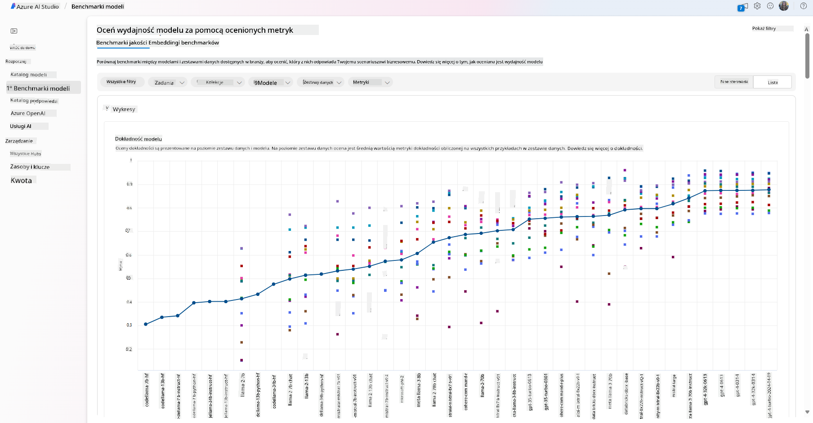
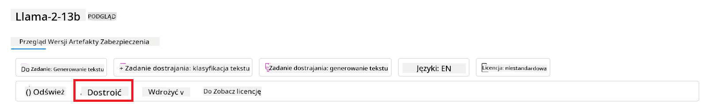
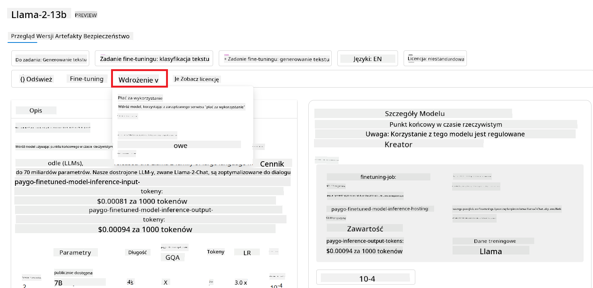
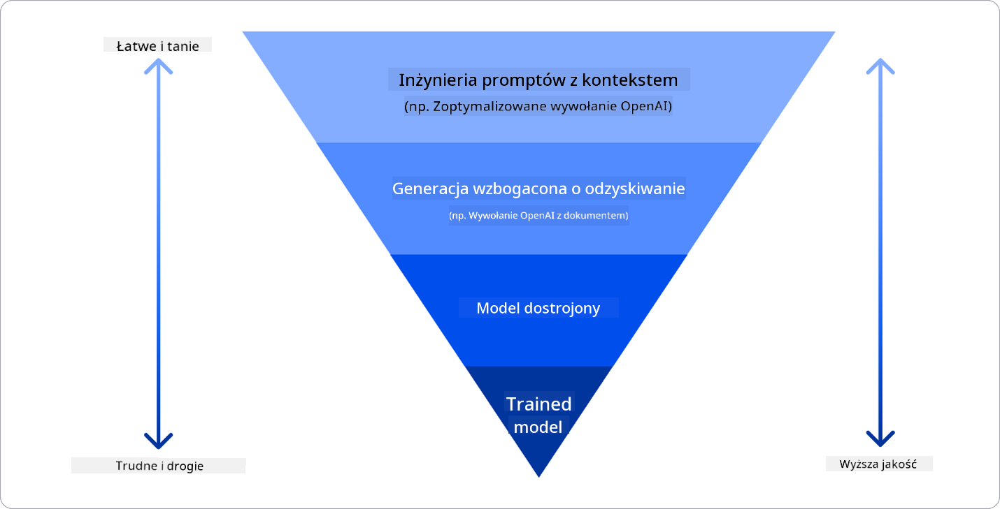

<!--
CO_OP_TRANSLATOR_METADATA:
{
  "original_hash": "e2f686f2eb794941761252ac5e8e090b",
  "translation_date": "2025-06-25T10:38:17+00:00",
  "source_file": "02-exploring-and-comparing-different-llms/README.md",
  "language_code": "pl"
}
-->
# Odkrywanie i porównywanie różnych LLM

> _Kliknij powyższy obrazek, aby obejrzeć wideo z tej lekcji_

W poprzedniej lekcji zobaczyliśmy, jak Generatywna AI zmienia krajobraz technologiczny, jak działają duże modele językowe (LLM) i jak firma - taka jak nasz startup - może je zastosować do swoich przypadków użycia i rozwijać się! W tym rozdziale zamierzamy porównać różne typy dużych modeli językowych (LLM), aby zrozumieć ich zalety i wady.

Kolejnym krokiem w podróży naszego startupu jest zbadanie obecnego krajobrazu LLM i zrozumienie, które są odpowiednie dla naszego przypadku użycia.

## Wprowadzenie

Ta lekcja obejmie:

- Różne typy LLM w obecnym krajobrazie.
- Testowanie, iterowanie i porównywanie różnych modeli dla Twojego przypadku użycia w Azure.
- Jak wdrożyć LLM.

## Cele nauki

Po ukończeniu tej lekcji będziesz w stanie:

- Wybrać odpowiedni model dla swojego przypadku użycia.
- Zrozumieć, jak testować, iterować i poprawiać wydajność swojego modelu.
- Wiedzieć, jak firmy wdrażają modele.

## Zrozumienie różnych typów LLM

LLM mogą mieć różne kategorie w zależności od ich architektury, danych treningowych i przypadku użycia. Zrozumienie tych różnic pomoże naszemu startupowi wybrać odpowiedni model dla scenariusza i zrozumieć, jak testować, iterować i poprawiać wydajność.

Istnieje wiele różnych typów modeli LLM, wybór modelu zależy od tego, do czego zamierzasz go używać, jakie masz dane, ile jesteś gotów zapłacić i więcej.

W zależności od tego, czy zamierzasz używać modeli do generowania tekstu, dźwięku, wideo, obrazów itd., możesz zdecydować się na inny typ modelu.

- **Rozpoznawanie dźwięku i mowy**. W tym celu modele typu Whisper są doskonałym wyborem, ponieważ są uniwersalne i przeznaczone do rozpoznawania mowy. Są szkolone na różnorodnych dźwiękach i mogą wykonywać rozpoznawanie mowy wielojęzycznej.

- **Generowanie obrazów**. Do generowania obrazów, DALL-E i Midjourney to dwa bardzo znane wybory. DALL-E jest oferowany przez Azure OpenAI.

- **Generowanie tekstu**. Większość modeli jest szkolona na generowanie tekstu i masz szeroki wybór od GPT-3.5 do GPT-4. Różnią się kosztami, przy czym GPT-4 jest najdroższy. Warto przyjrzeć się [Azure OpenAI playground](https://oai.azure.com/portal/playground?WT.mc_id=academic-105485-koreyst), aby ocenić, które modele najlepiej pasują do Twoich potrzeb pod względem możliwości i kosztów.

- **Multi-modalność**. Jeśli chcesz obsługiwać wiele typów danych na wejściu i wyjściu, możesz zainteresować się modelami takimi jak [gpt-4 turbo z wizją lub gpt-4o](https://learn.microsoft.com/azure/ai-services/openai/concepts/models#gpt-4-and-gpt-4-turbo-models?WT.mc_id=academic-105485-koreyst) - najnowsze wydania modeli OpenAI - które są w stanie łączyć przetwarzanie języka naturalnego z rozumieniem wizualnym, umożliwiając interakcje poprzez interfejsy multi-modalne.

Wybór modelu oznacza, że otrzymujesz pewne podstawowe możliwości, które jednak mogą nie być wystarczające. Często masz dane specyficzne dla firmy, które w jakiś sposób musisz przekazać LLM. Istnieje kilka różnych sposobów podejścia do tego, więcej na ten temat w nadchodzących sekcjach.

### Modele podstawowe kontra LLM

Termin Model Podstawowy został [wymyślony przez badaczy ze Stanford](https://arxiv.org/abs/2108.07258?WT.mc_id=academic-105485-koreyst) i zdefiniowany jako model AI, który spełnia pewne kryteria, takie jak:

- **Są szkolone za pomocą uczenia niesuperwizowanego lub samonadzorowanego**, co oznacza, że są szkolone na nieoznakowanych danych wielomodalnych i nie wymagają ludzkiej adnotacji ani oznaczania danych w procesie szkolenia.
- **Są bardzo dużymi modelami**, opartymi na bardzo głębokich sieciach neuronowych szkolonych na miliardach parametrów.
- **Zwykle mają służyć jako 'podstawa' dla innych modeli**, co oznacza, że mogą być używane jako punkt wyjścia dla innych modeli, które można budować na ich bazie, co można zrobić poprzez dostrajanie.

Aby jeszcze bardziej wyjaśnić tę różnicę, weźmy ChatGPT jako przykład. Aby zbudować pierwszą wersję ChatGPT, model GPT-3.5 służył jako model podstawowy. Oznacza to, że OpenAI użyło niektórych danych specyficznych dla czatu, aby stworzyć dostrojony model GPT-3.5, który był specjalizowany w dobrze działaniu w scenariuszach konwersacyjnych, takich jak chatboty.

### Modele open source kontra modele właścicielskie

Innym sposobem kategoryzacji LLM jest to, czy są one open source czy właścicielskie.

Modele open-source to modele, które są udostępniane publicznie i mogą być używane przez każdego. Często są udostępniane przez firmę, która je stworzyła, lub przez społeczność badawczą. Te modele można przeglądać, modyfikować i dostosowywać do różnych przypadków użycia w LLM. Jednak nie zawsze są zoptymalizowane do użytku produkcyjnego i mogą nie być tak wydajne jak modele właścicielskie. Ponadto finansowanie modeli open-source może być ograniczone, a mogą nie być utrzymywane długoterminowo lub nie być aktualizowane o najnowsze badania.

Modele właścicielskie to modele, które są własnością firmy i nie są udostępniane publicznie. Te modele są często zoptymalizowane do użytku produkcyjnego. Jednak nie można ich przeglądać, modyfikować ani dostosowywać do różnych przypadków użycia. Ponadto nie zawsze są dostępne za darmo i mogą wymagać subskrypcji lub opłaty za użycie. Użytkownicy nie mają kontroli nad danymi używanymi do trenowania modelu, co oznacza, że powinni zaufać właścicielowi modelu w zakresie zapewnienia prywatności danych i odpowiedzialnego użycia AI.

### Osadzanie kontra generowanie obrazów kontra generowanie tekstu i kodu

LLM mogą być również kategoryzowane według generowanego przez nie wyniku.

Osadzanie to zestaw modeli, które mogą przekształcić tekst w formę numeryczną, zwaną osadzaniem, która jest numerycznym przedstawieniem tekstu wejściowego. Osadzanie ułatwia maszynom zrozumienie relacji między słowami lub zdaniami i może być używane jako wejście przez inne modele, takie jak modele klasyfikacji czy modele klasteryzacji, które mają lepszą wydajność na danych numerycznych.

Modele generowania obrazów to modele, które generują obrazy. Te modele są często używane do edycji obrazów, syntezy obrazów i tłumaczenia obrazów. Modele generowania obrazów są często szkolone na dużych zbiorach danych obrazów i mogą być używane do generowania nowych obrazów lub edycji istniejących obrazów za pomocą technik inpaintingu, super-rozdzielczości i kolorowania.

Modele generowania tekstu i kodu to modele, które generują tekst lub kod. Te modele są często używane do streszczania tekstu, tłumaczenia i odpowiadania na pytania. Modele generowania tekstu są często szkolone na dużych zbiorach danych tekstu i mogą być używane do generowania nowego tekstu lub odpowiadania na pytania. Modele generowania kodu są często szkolone na dużych zbiorach danych kodu i mogą być używane do generowania nowego kodu lub naprawiania błędów w istniejącym kodzie.

### Encoder-Decoder kontra tylko Decoder

Aby omówić różne typy architektur LLM, użyjmy analogii.

Wyobraź sobie, że Twój kierownik dał Ci zadanie napisania quizu dla studentów. Masz dwóch kolegów; jeden zajmuje się tworzeniem treści, a drugi ich recenzowaniem.

Twórca treści jest jak model tylko Decoder, potrafi spojrzeć na temat i zobaczyć, co już napisałeś, a następnie napisać kurs na tej podstawie. Są bardzo dobrzy w pisaniu angażujących i informacyjnych treści, ale nie są zbyt dobrzy w rozumieniu tematu i celów nauczania. Przykładami modeli tylko Decoder są modele z rodziny GPT, takie jak GPT-3.

Recenzent jest jak model tylko Encoder, patrzy na napisany kurs i odpowiedzi, zauważając relacje między nimi i rozumiejąc kontekst, ale nie jest dobry w generowaniu treści. Przykładem modelu tylko Encoder byłby BERT.

Wyobraź sobie, że możemy mieć również kogoś, kto potrafi tworzyć i recenzować quiz, to jest model Encoder-Decoder. Przykładami byłyby BART i T5.

### Usługa kontra Model

Teraz porozmawiajmy o różnicy między usługą a modelem. Usługa to produkt oferowany przez dostawcę usług chmurowych i często jest kombinacją modeli, danych i innych komponentów. Model to rdzeń usługi i często jest modelem podstawowym, takim jak LLM.

Usługi są często zoptymalizowane do użytku produkcyjnego i często łatwiejsze w użyciu niż modele, za pomocą graficznego interfejsu użytkownika. Jednak usługi nie zawsze są dostępne za darmo i mogą wymagać subskrypcji lub opłaty za użycie, w zamian za korzystanie z zasobów i sprzętu właściciela usługi, optymalizując wydatki i łatwo skalując. Przykładem usługi jest [Azure OpenAI Service](https://learn.microsoft.com/azure/ai-services/openai/overview?WT.mc_id=academic-105485-koreyst), która oferuje plan opłat proporcjonalnych do użycia, co oznacza, że użytkownicy są obciążani proporcjonalnie do tego, ile korzystają z usługi. Ponadto, Azure OpenAI Service oferuje bezpieczeństwo klasy korporacyjnej i odpowiedzialne podejście do AI na bazie możliwości modeli.

Modele to tylko sieci neuronowe, z parametrami, wagami i innymi. Pozwalają firmom na lokalne uruchamianie, jednak wymagałoby to zakupu sprzętu, budowy struktury do skalowania i zakupu licencji lub użycia modelu open-source. Model taki jak LLaMA jest dostępny do użycia, wymagając mocy obliczeniowej do uruchomienia modelu.

## Jak testować i iterować z różnymi modelami, aby zrozumieć wydajność na Azure

Gdy nasz zespół zbadał obecny krajobraz LLM i zidentyfikował kilku dobrych kandydatów do swoich scenariuszy, następnym krokiem jest testowanie ich na swoich danych i obciążeniu. Jest to proces iteracyjny, wykonywany przez eksperymenty i pomiary. Większość modeli, o których wspomnieliśmy w poprzednich akapitach (modele OpenAI, modele open-source takie jak Llama2 i transformery Hugging Face) są dostępne w [Katalogu Modeli](https://learn.microsoft.com/azure/ai-studio/how-to/model-catalog-overview?WT.mc_id=academic-105485-koreyst) w [Azure AI Studio](https://ai.azure.com/?WT.mc_id=academic-105485-koreyst).

[Azure AI Studio](https://learn.microsoft.com/azure/ai-studio/what-is-ai-studio?WT.mc_id=academic-105485-koreyst) to platforma chmurowa zaprojektowana dla deweloperów do budowy aplikacji generatywnej AI i zarządzania całym cyklem rozwoju - od eksperymentów po ocenę - poprzez połączenie wszystkich usług Azure AI w jedno centrum z wygodnym GUI. Katalog Modeli w Azure AI Studio umożliwia użytkownikowi:

- Znalezienie Modelu Podstawowego w katalogu - właścicielskiego lub open-source, filtrując według zadania, licencji lub nazwy. Aby poprawić wyszukiwalność, modele są zorganizowane w kolekcje, takie jak kolekcja Azure OpenAI, kolekcja Hugging Face i inne.

- Przegląd karty modelu, w tym szczegółowy opis zamierzonego użycia i danych treningowych, przykłady kodu oraz wyniki oceny w wewnętrznej bibliotece ocen.
- Porównaj benchmarki modeli i zestawów danych dostępnych w branży, aby ocenić, który z nich spełnia scenariusz biznesowy, za pomocą panelu [Model Benchmarks](https://learn.microsoft.com/azure/ai-studio/how-to/model-benchmarks?WT.mc_id=academic-105485-koreyst).

- Dostosuj model do własnych danych treningowych, aby poprawić jego wydajność w określonym zadaniu, korzystając z możliwości eksperymentacji i śledzenia w Azure AI Studio.

- Wdrażaj oryginalny model wstępnie wytrenowany lub dostosowaną wersję do zdalnego wnioskowania w czasie rzeczywistym - zarządzane obliczenia - lub bezserwerowy punkt końcowy API - [płatność zgodnie z użyciem](https://learn.microsoft.com/azure/ai-studio/how-to/model-catalog-overview#model-deployment-managed-compute-and-serverless-api-pay-as-you-go?WT.mc_id=academic-105485-koreyst) - aby umożliwić aplikacjom jego wykorzystanie.

> [!NOTE]
> Nie wszystkie modele w katalogu są obecnie dostępne do dostosowywania i/lub wdrażania na zasadzie płatności zgodnie z użyciem. Sprawdź kartę modelu, aby uzyskać szczegóły dotyczące możliwości i ograniczeń modelu.

## Poprawa wyników LLM

Zespół naszego startupu zbadał różne rodzaje LLM i platformę chmurową (Azure Machine Learning), która umożliwia nam porównanie różnych modeli, ocenę ich na danych testowych, poprawę wydajności i wdrażanie na punktach końcowych wnioskowania.

Ale kiedy powinni rozważyć dostosowanie modelu zamiast korzystania z wstępnie wytrenowanego? Czy są inne podejścia do poprawy wydajności modelu w określonych zadaniach?

Istnieje kilka podejść, które firma może zastosować, aby uzyskać potrzebne wyniki z LLM. Możesz wybrać różne typy modeli z różnym stopniem wytrenowania podczas wdrażania LLM w produkcji, z różnym poziomem złożoności, kosztów i jakości. Oto kilka różnych podejść:

- **Inżynieria promptów z kontekstem**. Pomysł polega na dostarczeniu wystarczającego kontekstu podczas promptowania, aby zapewnić uzyskanie potrzebnych odpowiedzi.

- **Generacja wspomagana odzyskiwaniem, RAG**. Twoje dane mogą znajdować się w bazie danych lub punkcie końcowym sieci, na przykład, aby zapewnić, że te dane lub ich podzbiór są uwzględniane w czasie promptowania, możesz pobrać odpowiednie dane i uczynić je częścią promptu użytkownika.

- **Model dostosowany**. Tutaj dalej trenowałeś model na własnych danych, co sprawiło, że model stał się bardziej dokładny i reagujący na twoje potrzeby, ale może być kosztowny.

Źródło obrazu: [Cztery sposoby wdrażania LLM przez przedsiębiorstwa | Blog Fiddler AI](https://www.fiddler.ai/blog/four-ways-that-enterprises-deploy-llms?WT.mc_id=academic-105485-koreyst)

### Inżynieria promptów z kontekstem

Wstępnie wytrenowane LLM doskonale radzą sobie z uogólnionymi zadaniami języka naturalnego, nawet przy wywoływaniu ich krótkim promptem, takim jak zdanie do dokończenia lub pytanie – tzw. uczenie "zero-shot".

Jednak im bardziej użytkownik może sformułować swoje zapytanie, z szczegółową prośbą i przykładami – Kontekstem – tym dokładniejsza i bliższa oczekiwaniom użytkownika będzie odpowiedź. W tym przypadku mówimy o uczeniu "one-shot", jeśli prompt zawiera tylko jeden przykład i "few-shot", jeśli zawiera wiele przykładów. Inżynieria promptów z kontekstem to najbardziej opłacalne podejście na początek.

### Generacja wspomagana odzyskiwaniem (RAG)

LLM mają ograniczenie, że mogą korzystać tylko z danych, które zostały użyte podczas ich trenowania, aby generować odpowiedzi. Oznacza to, że nie wiedzą nic o faktach, które miały miejsce po zakończeniu procesu trenowania, i nie mają dostępu do informacji niepublicznych (jak dane firmowe).
Można to przezwyciężyć za pomocą RAG, techniki, która wzbogaca prompt o zewnętrzne dane w postaci fragmentów dokumentów, biorąc pod uwagę limity długości promptu. Jest to wspierane przez narzędzia baz danych wektorowych (takie jak [Azure Vector Search](https://learn.microsoft.com/azure/search/vector-search-overview?WT.mc_id=academic-105485-koreyst)), które pobierają użyteczne fragmenty z różnych predefiniowanych źródeł danych i dodają je do kontekstu promptu.

Ta technika jest bardzo pomocna, gdy firma nie ma wystarczającej ilości danych, czasu ani zasobów na dostosowanie LLM, ale nadal chce poprawić wydajność w określonym zadaniu i zmniejszyć ryzyko fabrykacji, tj. mistyfikacji rzeczywistości lub szkodliwych treści.

### Model dostosowany

Dostosowanie to proces, który wykorzystuje transfer learning do 'adaptacji' modelu do zadania końcowego lub rozwiązania konkretnego problemu. W przeciwieństwie do uczenia few-shot i RAG, skutkuje to wygenerowaniem nowego modelu, z zaktualizowanymi wagami i przesunięciami. Wymaga zestawu przykładów treningowych składających się z pojedynczego wejścia (prompt) i jego powiązanego wyjścia (ukończenie).
To byłoby preferowane podejście, jeśli:

- **Korzystanie z dostosowanych modeli**. Firma chciałaby korzystać z dostosowanych mniej wydajnych modeli (jak modele osadzające) zamiast modeli o wysokiej wydajności, co skutkuje bardziej opłacalnym i szybkim rozwiązaniem.

- **Uwzględnianie opóźnień**. Opóźnienie jest ważne dla określonego przypadku użycia, więc nie można używać bardzo długich promptów ani liczba przykładów, z których model powinien się uczyć, nie mieści się w limicie długości promptu.

- **Pozostawanie na bieżąco**. Firma ma dużo wysokiej jakości danych i etykiet prawdy podstawowej oraz zasoby potrzebne do utrzymania tych danych na bieżąco z czasem.

### Trenowany model

Trenowanie LLM od podstaw jest bez wątpienia najtrudniejszym i najbardziej złożonym podejściem do przyjęcia, wymagającym ogromnych ilości danych, wykwalifikowanych zasobów i odpowiedniej mocy obliczeniowej. Ta opcja powinna być rozważana tylko w scenariuszu, w którym firma ma przypadek użycia specyficzny dla domeny i dużą ilość danych skoncentrowanych na domenie.

## Sprawdzenie wiedzy

Jakie może być dobre podejście do poprawy wyników uzupełniania LLM?

1. Inżynieria promptów z kontekstem
1. RAG
1. Model dostosowany

A:3, jeśli masz czas i zasoby oraz wysokiej jakości dane, dostosowanie jest lepszą opcją, aby pozostać na bieżąco. Jednak jeśli chcesz poprawić rzeczy i brakuje ci czasu, warto najpierw rozważyć RAG.

## 🚀 Wyzwanie

Przeczytaj więcej o tym, jak możesz [używać RAG](https://learn.microsoft.com/azure/search/retrieval-augmented-generation-overview?WT.mc_id=academic-105485-koreyst) dla swojej firmy.

## Świetna praca, kontynuuj naukę

Po ukończeniu tej lekcji, zapoznaj się z naszą [kolekcją nauki o generatywnej AI](https://aka.ms/genai-collection?WT.mc_id=academic-105485-koreyst), aby kontynuować rozwijanie swojej wiedzy na temat generatywnej AI!

Przejdź do Lekcji 3, gdzie przyjrzymy się, jak [budować odpowiedzialnie z generatywną AI](../03-using-generative-ai-responsibly/README.md?WT.mc_id=academic-105485-koreyst)!

**Zastrzeżenie**:  
Ten dokument został przetłumaczony za pomocą usługi tłumaczenia AI [Co-op Translator](https://github.com/Azure/co-op-translator). Choć staramy się zapewnić dokładność, prosimy mieć na uwadze, że automatyczne tłumaczenia mogą zawierać błędy lub nieścisłości. Oryginalny dokument w jego rodzimym języku powinien być uważany za źródło autorytatywne. W przypadku informacji krytycznych zaleca się profesjonalne tłumaczenie przez człowieka. Nie ponosimy odpowiedzialności za jakiekolwiek nieporozumienia lub błędne interpretacje wynikające z użycia tego tłumaczenia.