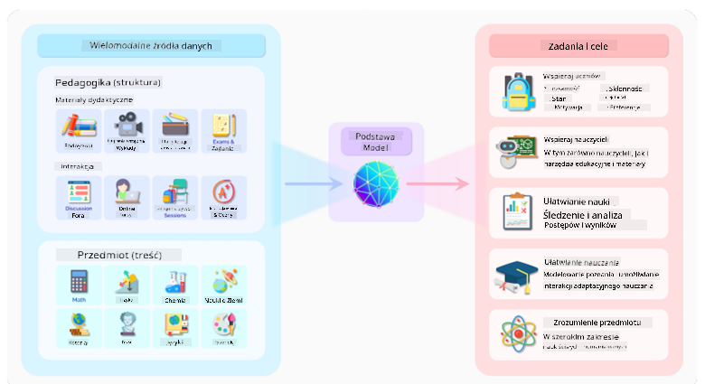
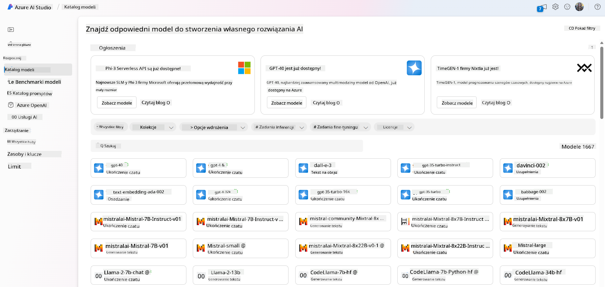
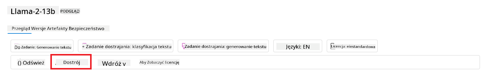
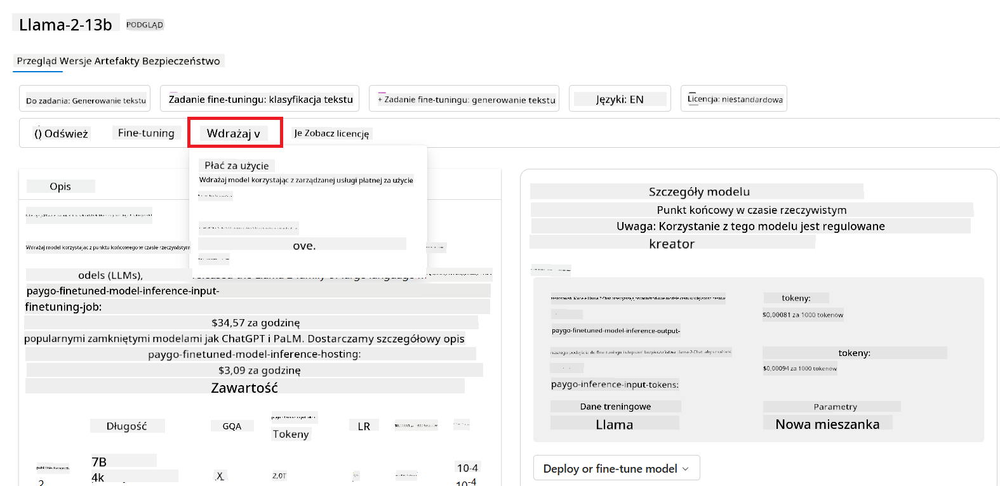

<!--
CO_OP_TRANSLATOR_METADATA:
{
  "original_hash": "6b7629b8ee4d7d874a27213e903d86a7",
  "translation_date": "2025-10-18T00:53:56+00:00",
  "source_file": "02-exploring-and-comparing-different-llms/README.md",
  "language_code": "pl"
}
-->
# Eksploracja i porównanie różnych LLM-ów

> _Kliknij obrazek powyżej, aby obejrzeć wideo z tej lekcji_

W poprzedniej lekcji dowiedzieliśmy się, jak Generatywna AI zmienia krajobraz technologiczny, jak działają duże modele językowe (LLM) oraz jak firma - taka jak nasz startup - może je zastosować w swoich przypadkach użycia i rozwijać się! W tym rozdziale zamierzamy porównać różne typy dużych modeli językowych (LLM), aby zrozumieć ich zalety i wady.

Kolejnym krokiem w podróży naszego startupu jest eksploracja obecnego krajobrazu LLM-ów i zrozumienie, które z nich są odpowiednie dla naszego przypadku użycia.

## Wprowadzenie

Ta lekcja obejmie:

- Różne typy LLM-ów w obecnym krajobrazie.
- Testowanie, iterację i porównanie różnych modeli dla Twojego przypadku użycia w Azure.
- Jak wdrożyć LLM.

## Cele nauki

Po ukończeniu tej lekcji będziesz w stanie:

- Wybrać odpowiedni model dla swojego przypadku użycia.
- Zrozumieć, jak testować, iterować i poprawiać wydajność swojego modelu.
- Wiedzieć, jak firmy wdrażają modele.

## Zrozumienie różnych typów LLM-ów

LLM-y można klasyfikować na różne sposoby w zależności od ich architektury, danych treningowych i przypadku użycia. Zrozumienie tych różnic pomoże naszemu startupowi wybrać odpowiedni model dla danego scenariusza oraz zrozumieć, jak testować, iterować i poprawiać wydajność.

Istnieje wiele różnych typów modeli LLM, a wybór odpowiedniego zależy od tego, do czego zamierzasz ich używać, jakie dane posiadasz, ile jesteś gotów zapłacić i innych czynników.

W zależności od tego, czy zamierzasz używać modeli do generowania tekstu, dźwięku, wideo, obrazów i tak dalej, możesz wybrać inny typ modelu.

- **Rozpoznawanie dźwięku i mowy**. W tym celu modele typu Whisper są świetnym wyborem, ponieważ są uniwersalne i przeznaczone do rozpoznawania mowy. Są trenowane na różnorodnych danych audio i potrafią rozpoznawać mowę w wielu językach. Dowiedz się więcej o [modelach typu Whisper tutaj](https://platform.openai.com/docs/models/whisper?WT.mc_id=academic-105485-koreyst).

- **Generowanie obrazów**. Do generowania obrazów DALL-E i Midjourney to dwa bardzo znane wybory. DALL-E jest oferowany przez Azure OpenAI. [Przeczytaj więcej o DALL-E tutaj](https://platform.openai.com/docs/models/dall-e?WT.mc_id=academic-105485-koreyst) oraz w rozdziale 9 tego kursu.

- **Generowanie tekstu**. Większość modeli jest trenowana do generowania tekstu i masz szeroki wybór od GPT-3.5 do GPT-4. Koszty są różne, przy czym GPT-4 jest najdroższy. Warto zajrzeć do [Azure OpenAI playground](https://oai.azure.com/portal/playground?WT.mc_id=academic-105485-koreyst), aby ocenić, które modele najlepiej odpowiadają Twoim potrzebom pod względem możliwości i kosztów.

- **Multi-modalność**. Jeśli chcesz obsługiwać wiele typów danych w wejściu i wyjściu, możesz rozważyć modele takie jak [gpt-4 turbo z wizją lub gpt-4o](https://learn.microsoft.com/azure/ai-services/openai/concepts/models#gpt-4-and-gpt-4-turbo-models?WT.mc_id=academic-105485-koreyst) - najnowsze wersje modeli OpenAI - które łączą przetwarzanie języka naturalnego ze zrozumieniem wizualnym, umożliwiając interakcje przez interfejsy multi-modalne.

Wybór modelu oznacza uzyskanie pewnych podstawowych możliwości, które jednak mogą nie być wystarczające. Często posiadasz dane specyficzne dla firmy, które w jakiś sposób musisz przekazać LLM. Istnieje kilka różnych podejść do tego, więcej na ten temat w kolejnych sekcjach.

### Modele bazowe a LLM-y

Termin Model Bazowy został [wprowadzony przez badaczy z Uniwersytetu Stanforda](https://arxiv.org/abs/2108.07258?WT.mc_id=academic-105485-koreyst) i zdefiniowany jako model AI spełniający pewne kryteria, takie jak:

- **Są trenowane za pomocą uczenia niesuperwizowanego lub samonadzorowanego**, co oznacza, że są trenowane na nieoznaczonych danych multimodalnych i nie wymagają ludzkiego oznaczania danych w procesie treningowym.
- **Są bardzo dużymi modelami**, opartymi na bardzo głębokich sieciach neuronowych trenowanych na miliardach parametrów.
- **Zazwyczaj służą jako „podstawa” dla innych modeli**, co oznacza, że mogą być używane jako punkt wyjścia do budowy innych modeli, co można osiągnąć poprzez ich dostrajanie.

Źródło obrazu: [Essential Guide to Foundation Models and Large Language Models | by Babar M Bhatti | Medium
](https://thebabar.medium.com/essential-guide-to-foundation-models-and-large-language-models-27dab58f7404)

Aby lepiej wyjaśnić tę różnicę, weźmy jako przykład ChatGPT. Aby zbudować pierwszą wersję ChatGPT, model GPT-3.5 posłużył jako model bazowy. Oznacza to, że OpenAI użyło danych specyficznych dla czatu, aby stworzyć dostrojony wariant GPT-3.5, który był wyspecjalizowany w osiąganiu dobrych wyników w scenariuszach konwersacyjnych, takich jak chatboty.

Źródło obrazu: [2108.07258.pdf (arxiv.org)](https://arxiv.org/pdf/2108.07258.pdf?WT.mc_id=academic-105485-koreyst)

### Modele open source a modele własnościowe

Innym sposobem klasyfikacji LLM-ów jest podział na modele open source i własnościowe.

Modele open source to modele udostępniane publicznie, które mogą być używane przez każdego. Często są udostępniane przez firmę, która je stworzyła, lub przez społeczność badawczą. Te modele można przeglądać, modyfikować i dostosowywać do różnych przypadków użycia LLM-ów. Jednak nie zawsze są one zoptymalizowane do użytku produkcyjnego i mogą nie być tak wydajne jak modele własnościowe. Ponadto finansowanie modeli open source może być ograniczone, a ich długoterminowe utrzymanie lub aktualizacje zgodne z najnowszymi badaniami mogą być niepewne. Przykłady popularnych modeli open source to [Alpaca](https://crfm.stanford.edu/2023/03/13/alpaca.html?WT.mc_id=academic-105485-koreyst), [Bloom](https://huggingface.co/bigscience/bloom) i [LLaMA](https://llama.meta.com).

Modele własnościowe to modele należące do firmy i nieudostępniane publicznie. Te modele są często zoptymalizowane do użytku produkcyjnego. Jednak nie można ich przeglądać, modyfikować ani dostosowywać do różnych przypadków użycia. Ponadto nie zawsze są dostępne za darmo i mogą wymagać subskrypcji lub opłaty za korzystanie. Użytkownicy nie mają również kontroli nad danymi używanymi do trenowania modelu, co oznacza, że muszą zaufać właścicielowi modelu w kwestii zapewnienia prywatności danych i odpowiedzialnego korzystania z AI. Przykłady popularnych modeli własnościowych to [modele OpenAI](https://platform.openai.com/docs/models/overview?WT.mc_id=academic-105485-koreyst), [Google Bard](https://sapling.ai/llm/bard?WT.mc_id=academic-105485-koreyst) czy [Claude 2](https://www.anthropic.com/index/claude-2?WT.mc_id=academic-105485-koreyst).

### Embedding a generowanie obrazów a generowanie tekstu i kodu

LLM-y można również klasyfikować według rodzaju generowanego wyjścia.

Embeddings to zestaw modeli, które mogą konwertować tekst na formę numeryczną, zwaną embeddingiem, czyli numeryczną reprezentację wejściowego tekstu. Embeddings ułatwiają maszynom zrozumienie relacji między słowami lub zdaniami i mogą być wykorzystywane jako dane wejściowe przez inne modele, takie jak modele klasyfikacyjne czy modele klastrowania, które lepiej radzą sobie z danymi numerycznymi. Modele embedding są często używane w uczeniu transferowym, gdzie model jest budowany dla zadania zastępczego, dla którego dostępne są obfite dane, a następnie wagi modelu (embeddingi) są ponownie wykorzystywane do innych zadań. Przykładem tej kategorii są [embeddingi OpenAI](https://platform.openai.com/docs/models/embeddings?WT.mc_id=academic-105485-koreyst).

Modele generowania obrazów to modele, które generują obrazy. Te modele są często używane do edycji obrazów, syntezy obrazów i tłumaczenia obrazów. Modele generowania obrazów są często trenowane na dużych zbiorach danych obrazów, takich jak [LAION-5B](https://laion.ai/blog/laion-5b/?WT.mc_id=academic-105485-koreyst), i mogą być używane do generowania nowych obrazów lub edycji istniejących obrazów za pomocą technik takich jak inpainting, super-rozdzielczość i kolorowanie. Przykłady to [DALL-E-3](https://openai.com/dall-e-3?WT.mc_id=academic-105485-koreyst) i [Stable Diffusion models](https://github.com/Stability-AI/StableDiffusion?WT.mc_id=academic-105485-koreyst).

Modele generowania tekstu i kodu to modele, które generują tekst lub kod. Te modele są często używane do streszczania tekstu, tłumaczenia i odpowiadania na pytania. Modele generowania tekstu są często trenowane na dużych zbiorach danych tekstowych, takich jak [BookCorpus](https://www.cv-foundation.org/openaccess/content_iccv_2015/html/Zhu_Aligning_Books_and_ICCV_2015_paper.html?WT.mc_id=academic-105485-koreyst), i mogą być używane do generowania nowego tekstu lub odpowiadania na pytania. Modele generowania kodu, takie jak [CodeParrot](https://huggingface.co/codeparrot?WT.mc_id=academic-105485-koreyst), są często trenowane na dużych zbiorach danych kodu, takich jak GitHub, i mogą być używane do generowania nowego kodu lub naprawiania błędów w istniejącym kodzie.

### Encoder-Decoder versus Decoder-only

Aby omówić różne typy architektur LLM-ów, użyjmy analogii.

Wyobraź sobie, że Twój menedżer zlecił Ci zadanie napisania quizu dla studentów. Masz dwóch kolegów; jeden zajmuje się tworzeniem treści, a drugi ich recenzowaniem.

Twórca treści jest jak model typu Decoder-only, może spojrzeć na temat i to, co już napisałeś, a następnie stworzyć kurs na tej podstawie. Są bardzo dobrzy w pisaniu angażujących i informacyjnych treści, ale nie są zbyt dobrzy w rozumieniu tematu i celów nauczania. Przykładami modeli typu Decoder są modele z rodziny GPT, takie jak GPT-3.

Recenzent jest jak model typu Encoder-only, patrzy na napisany kurs i odpowiedzi, zauważając relacje między nimi i rozumiejąc kontekst, ale nie jest dobry w generowaniu treści. Przykładem modelu typu Encoder-only byłby BERT.

Wyobraź sobie, że mamy kogoś, kto mógłby zarówno tworzyć, jak i recenzować quiz, to jest model typu Encoder-Decoder. Przykładami takich modeli byłyby BART i T5.

### Usługa versus Model

Teraz porozmawiajmy o różnicy między usługą a modelem. Usługa to produkt oferowany przez dostawcę usług w chmurze, który często jest kombinacją modeli, danych i innych komponentów. Model jest podstawowym elementem usługi i często jest modelem bazowym, takim jak LLM.

Usługi są często zoptymalizowane do użytku produkcyjnego i często łatwiejsze w użyciu niż modele, dzięki graficznemu interfejsowi użytkownika. Jednak usługi nie zawsze są dostępne za darmo i mogą wymagać subskrypcji lub opłaty za korzystanie, w zamian za wykorzystanie sprzętu i zasobów właściciela usługi, optymalizację kosztów i łatwe skalowanie. Przykładem usługi jest [Azure OpenAI Service](https://learn.microsoft.com/azure/ai-services/openai/overview?WT.mc_id=academic-105485-koreyst), która oferuje plan opłat proporcjonalnych do wykorzystania usługi. Ponadto Azure OpenAI Service oferuje bezpieczeństwo klasy korporacyjnej i ramy odpowiedzialnego korzystania z AI, które uzupełniają możliwości modeli.

Modele to tylko sieci neuronowe, z parametrami, wagami i innymi elementami. Pozwalają firmom na lokalne uruchamianie, jednak wymagają zakupu sprzętu, budowy infrastruktury do skalowania oraz zakupu licencji lub korzystania z modelu open source. Model taki jak LLaMA jest dostępny do użycia, ale wymaga mocy obliczeniowej do uruchomienia.

## Jak testować i iterować różne modele, aby zrozumieć ich wydajność w Azure

Gdy nasz zespół zbada krajobraz LLM-ów i zidentyfikuje kilka dobrych kandydatów dla swoich scenariuszy, kolejnym krokiem jest ich testowanie na własnych danych i obciążeniach. Jest to proces iteracyjny, realizowany poprzez eksperymenty i pomiary.
Większość modeli, które wspomnieliśmy w poprzednich akapitach (modele OpenAI, modele open source, takie jak Llama2, oraz transformery Hugging Face), jest dostępna w [Katalogu Modeli](https://learn.microsoft.com/azure/ai-studio/how-to/model-catalog-overview?WT.mc_id=academic-105485-koreyst) w [Azure AI Studio](https://ai.azure.com/?WT.mc_id=academic-105485-koreyst).

[Azure AI Studio](https://learn.microsoft.com/azure/ai-studio/what-is-ai-studio?WT.mc_id=academic-105485-koreyst) to platforma chmurowa zaprojektowana dla programistów, umożliwiająca tworzenie aplikacji generatywnej AI oraz zarządzanie całym cyklem rozwoju - od eksperymentowania po ocenę - poprzez połączenie wszystkich usług Azure AI w jednym centrum z wygodnym interfejsem graficznym. Katalog Modeli w Azure AI Studio pozwala użytkownikowi na:

- Znalezienie interesującego modelu bazowego w katalogu - zarówno własnościowego, jak i open source, filtrując według zadania, licencji lub nazwy. Aby ułatwić wyszukiwanie, modele są zorganizowane w kolekcje, takie jak kolekcja Azure OpenAI, kolekcja Hugging Face i inne.

- Przeglądanie karty modelu, w tym szczegółowego opisu zamierzonego zastosowania i danych treningowych, przykładów kodu oraz wyników oceny w wewnętrznej bibliotece ewaluacyjnej.

- Porównywanie wyników benchmarków między modelami i zestawami danych dostępnymi w branży, aby ocenić, który z nich najlepiej odpowiada na potrzeby biznesowe, za pomocą panelu [Model Benchmarks](https://learn.microsoft.com/azure/ai-studio/how-to/model-benchmarks?WT.mc_id=academic-105485-koreyst).

- Dostosowanie modelu do własnych danych treningowych, aby poprawić jego wydajność w określonym obciążeniu, korzystając z możliwości eksperymentowania i śledzenia w Azure AI Studio.

- Wdrożenie oryginalnego modelu wstępnie wytrenowanego lub jego dostosowanej wersji do zdalnego wnioskowania w czasie rzeczywistym - zarządzanej infrastruktury obliczeniowej - lub serwerowego punktu końcowego API - [pay-as-you-go](https://learn.microsoft.com/azure/ai-studio/how-to/model-catalog-overview#model-deployment-managed-compute-and-serverless-api-pay-as-you-go?WT.mc_id=academic-105485-koreyst) - aby umożliwić aplikacjom korzystanie z niego.

> [!NOTE]
> Nie wszystkie modele w katalogu są obecnie dostępne do dostosowania i/lub wdrożenia w modelu pay-as-you-go. Sprawdź kartę modelu, aby uzyskać szczegóły dotyczące możliwości i ograniczeń modelu.

## Poprawa wyników LLM

Razem z zespołem startupowym zbadaliśmy różne rodzaje LLM oraz platformę chmurową (Azure Machine Learning), która umożliwia porównywanie różnych modeli, ocenę ich na danych testowych, poprawę wydajności i wdrożenie ich na punktach końcowych wnioskowania.

Ale kiedy warto rozważyć dostosowanie modelu zamiast korzystania z wstępnie wytrenowanego? Czy istnieją inne podejścia do poprawy wydajności modelu w określonych obciążeniach?

Istnieje kilka podejść, które firma może zastosować, aby uzyskać oczekiwane wyniki z LLM. Można wybrać różne typy modeli z różnym stopniem wytrenowania podczas wdrażania LLM w produkcji, z różnym poziomem złożoności, kosztów i jakości. Oto kilka różnych podejść:

- **Inżynieria promptów z kontekstem**. Chodzi o dostarczenie wystarczającego kontekstu podczas promptowania, aby zapewnić uzyskanie potrzebnych odpowiedzi.

- **Retrieval Augmented Generation, RAG**. Twoje dane mogą znajdować się na przykład w bazie danych lub punkcie końcowym w sieci. Aby upewnić się, że te dane lub ich podzbiór są uwzględnione podczas promptowania, możesz pobrać odpowiednie dane i uczynić je częścią promptu użytkownika.

- **Dostosowany model**. Tutaj model jest dodatkowo trenowany na własnych danych, co sprawia, że jest bardziej precyzyjny i dostosowany do Twoich potrzeb, ale może być kosztowny.

Źródło obrazka: [Four Ways that Enterprises Deploy LLMs | Fiddler AI Blog](https://www.fiddler.ai/blog/four-ways-that-enterprises-deploy-llms?WT.mc_id=academic-105485-koreyst)

### Inżynieria promptów z kontekstem

Wstępnie wytrenowane LLM bardzo dobrze radzą sobie z ogólnymi zadaniami związanymi z językiem naturalnym, nawet gdy są wywoływane za pomocą krótkiego promptu, takiego jak zdanie do uzupełnienia lub pytanie – tak zwane uczenie „zero-shot”.

Jednak im bardziej użytkownik potrafi sformułować swoje zapytanie, podając szczegółowe żądanie i przykłady – Kontekst – tym bardziej precyzyjna i zgodna z oczekiwaniami użytkownika będzie odpowiedź. W takim przypadku mówimy o uczeniu „one-shot”, jeśli prompt zawiera tylko jeden przykład, oraz o „few-shot learning”, jeśli zawiera wiele przykładów. Inżynieria promptów z kontekstem jest najbardziej opłacalnym podejściem na początek.

### Retrieval Augmented Generation (RAG)

LLM mają ograniczenie polegające na tym, że mogą korzystać tylko z danych użytych podczas ich treningu do generowania odpowiedzi. Oznacza to, że nie wiedzą nic o faktach, które miały miejsce po procesie treningowym, i nie mają dostępu do informacji niepublicznych (np. danych firmowych). 

Można to przezwyciężyć za pomocą RAG, techniki, która wzbogaca prompt o zewnętrzne dane w formie fragmentów dokumentów, uwzględniając ograniczenia długości promptu. Jest to wspierane przez narzędzia baz danych wektorowych (takie jak [Azure Vector Search](https://learn.microsoft.com/azure/search/vector-search-overview?WT.mc_id=academic-105485-koreyst)), które pobierają użyteczne fragmenty z różnych zdefiniowanych źródeł danych i dodają je do kontekstu promptu.

Ta technika jest bardzo pomocna, gdy firma nie ma wystarczającej ilości danych, czasu lub zasobów, aby dostosować LLM, ale nadal chce poprawić wydajność w określonym obciążeniu i zmniejszyć ryzyko fałszerstw, czyli zniekształceń rzeczywistości lub szkodliwych treści.

### Dostosowany model

Dostosowanie modelu to proces, który wykorzystuje transfer learning do „adaptacji” modelu do zadania końcowego lub rozwiązania konkretnego problemu. W przeciwieństwie do uczenia few-shot i RAG, skutkuje to wygenerowaniem nowego modelu z zaktualizowanymi wagami i przesunięciami. Wymaga zestawu przykładów treningowych składających się z pojedynczego wejścia (promptu) i powiązanego z nim wyjścia (wyniku).

To podejście byłoby preferowane, jeśli:

- **Używanie dostosowanych modeli**. Firma chciałaby używać dostosowanych mniej zaawansowanych modeli (np. modeli osadzających) zamiast modeli o wysokiej wydajności, co prowadzi do bardziej opłacalnego i szybszego rozwiązania.

- **Rozważanie opóźnień**. Opóźnienia są istotne dla konkretnego przypadku użycia, więc nie jest możliwe użycie bardzo długich promptów lub liczba przykładów, które model powinien się nauczyć, nie mieści się w ograniczeniach długości promptu.

- **Aktualność danych**. Firma dysponuje dużą ilością wysokiej jakości danych i etykietami prawdy podstawowej oraz zasobami potrzebnymi do utrzymania tych danych na bieżąco.

### Trenowany model

Trenowanie LLM od podstaw jest bez wątpienia najtrudniejszym i najbardziej złożonym podejściem, wymagającym ogromnych ilości danych, wykwalifikowanych zasobów i odpowiedniej mocy obliczeniowej. Ta opcja powinna być rozważana tylko w scenariuszu, w którym firma ma specyficzny przypadek użycia dla danej dziedziny i dużą ilość danych związanych z tą dziedziną.

## Sprawdź swoją wiedzę

Jakie podejście może być dobre, aby poprawić wyniki generowane przez LLM?

1. Inżynieria promptów z kontekstem  
1. RAG  
1. Dostosowany model  

Odpowiedź: 3, jeśli masz czas, zasoby i wysokiej jakości dane, dostosowanie modelu jest lepszą opcją, aby być na bieżąco. Jednak jeśli chcesz poprawić wyniki, a brakuje Ci czasu, warto najpierw rozważyć RAG.

## 🚀 Wyzwanie

Przeczytaj więcej o tym, jak możesz [używać RAG](https://learn.microsoft.com/azure/search/retrieval-augmented-generation-overview?WT.mc_id=academic-105485-koreyst) w swojej firmie.

## Świetna robota, kontynuuj naukę

Po ukończeniu tej lekcji, sprawdź naszą [kolekcję nauki o generatywnej AI](https://aka.ms/genai-collection?WT.mc_id=academic-105485-koreyst), aby dalej rozwijać swoją wiedzę na temat generatywnej AI!

Przejdź do Lekcji 3, gdzie przyjrzymy się, jak [budować z Generatywną AI w sposób odpowiedzialny](../03-using-generative-ai-responsibly/README.md?WT.mc_id=academic-105485-koreyst)!

---

**Zastrzeżenie**:  
Ten dokument został przetłumaczony za pomocą usługi tłumaczenia AI [Co-op Translator](https://github.com/Azure/co-op-translator). Chociaż dokładamy wszelkich starań, aby tłumaczenie było precyzyjne, prosimy pamiętać, że automatyczne tłumaczenia mogą zawierać błędy lub nieścisłości. Oryginalny dokument w jego rodzimym języku powinien być uznawany za autorytatywne źródło. W przypadku informacji krytycznych zaleca się skorzystanie z profesjonalnego tłumaczenia przez człowieka. Nie ponosimy odpowiedzialności za jakiekolwiek nieporozumienia lub błędne interpretacje wynikające z użycia tego tłumaczenia.