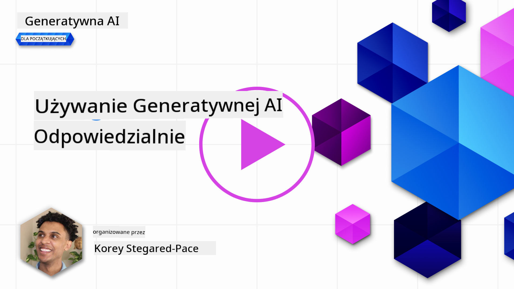
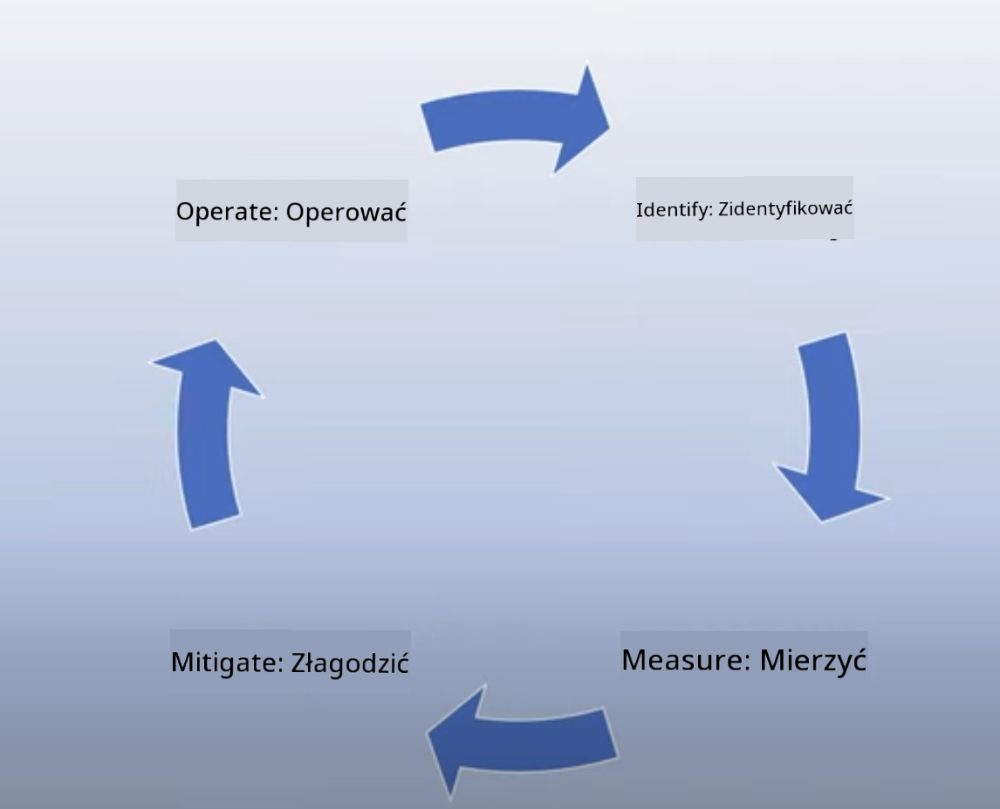
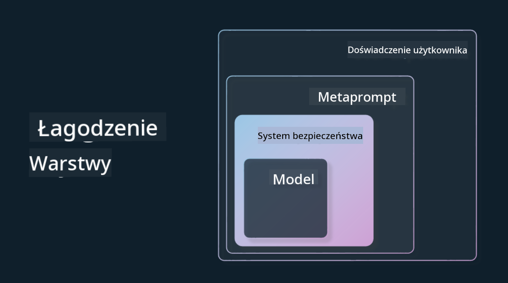

<!--
CO_OP_TRANSLATOR_METADATA:
{
  "original_hash": "7f8f4c11f8c1cb6e1794442dead414ea",
  "translation_date": "2025-07-09T08:55:14+00:00",
  "source_file": "03-using-generative-ai-responsibly/README.md",
  "language_code": "pl"
}
-->
# Odpowiedzialne korzystanie z Generatywnej AI

> _Kliknij powyższy obraz, aby obejrzeć wideo z tej lekcji_

Łatwo jest zafascynować się AI, a szczególnie generatywną AI, ale trzeba zastanowić się, jak korzystać z niej odpowiedzialnie. Należy wziąć pod uwagę takie kwestie, jak zapewnienie, że wyniki są sprawiedliwe, nieszkodliwe i inne. Ten rozdział ma na celu dostarczyć Ci kontekstu, na co zwracać uwagę i jak podejmować aktywne kroki, aby poprawić sposób korzystania z AI.

## Wprowadzenie

W tej lekcji omówimy:

- Dlaczego warto priorytetowo traktować Responsible AI podczas tworzenia aplikacji Generatywnej AI.
- Podstawowe zasady Responsible AI i ich związek z Generatywną AI.
- Jak wdrożyć zasady Responsible AI w praktyce poprzez strategię i narzędzia.

## Cele nauki

Po ukończeniu tej lekcji będziesz wiedzieć:

- Jak ważne jest Responsible AI przy tworzeniu aplikacji Generatywnej AI.
- Kiedy myśleć o i stosować podstawowe zasady Responsible AI podczas tworzenia aplikacji Generatywnej AI.
- Jakie narzędzia i strategie są dostępne, aby wprowadzić koncepcję Responsible AI w życie.

## Zasady Responsible AI

Ekscytacja wokół Generatywnej AI nigdy nie była większa. Ta ekscytacja przyciągnęła wielu nowych deweloperów, uwagę i finansowanie do tej dziedziny. Choć jest to bardzo pozytywne dla każdego, kto chce budować produkty i firmy wykorzystujące Generatywną AI, ważne jest, aby działać odpowiedzialnie.

W trakcie tego kursu skupiamy się na budowaniu naszego startupu i produktu edukacyjnego opartego na AI. Będziemy korzystać z zasad Responsible AI: Sprawiedliwość, Włączanie, Niezawodność/Bezpieczeństwo, Bezpieczeństwo i Prywatność, Przejrzystość oraz Odpowiedzialność. Na podstawie tych zasad przeanalizujemy, jak odnoszą się one do naszego wykorzystania Generatywnej AI w produktach.

## Dlaczego warto priorytetowo traktować Responsible AI

Podczas tworzenia produktu podejście skoncentrowane na człowieku, z myślą o dobru użytkownika, prowadzi do najlepszych rezultatów.

Unikalność Generatywnej AI polega na jej zdolności do tworzenia pomocnych odpowiedzi, informacji, wskazówek i treści dla użytkowników. Można to osiągnąć bez wielu ręcznych kroków, co może prowadzić do imponujących efektów. Jednak bez odpowiedniego planowania i strategii może to niestety prowadzić do szkodliwych skutków dla użytkowników, produktu i społeczeństwa jako całości.

Przyjrzyjmy się niektórym (choć nie wszystkim) potencjalnie szkodliwym skutkom:

### Halucynacje

Halucynacje to termin używany do opisania sytuacji, gdy LLM generuje treści, które są całkowicie bezsensowne lub wiemy, że są faktograficznie błędne na podstawie innych źródeł informacji.

Weźmy na przykład funkcję w naszym startupie, która pozwala studentom zadawać pytania historyczne modelowi. Student pyta: `Kto był jedynym ocalałym z Titanica?`

Model generuje odpowiedź podobną do poniższej:

> _(Źródło: [Flying bisons](https://flyingbisons.com?WT.mc_id=academic-105485-koreyst))_

To bardzo pewna i szczegółowa odpowiedź. Niestety jest błędna. Nawet przy minimalnym researchu można odkryć, że ocalałych z katastrofy Titanica było więcej niż jeden. Dla studenta, który dopiero zaczyna zgłębiać ten temat, odpowiedź może być na tyle przekonująca, że nie zostanie poddana w wątpliwość i potraktowana jako fakt. Konsekwencje tego mogą sprawić, że system AI stanie się niewiarygodny i negatywnie wpłynie na reputację naszego startupu.

Z każdą kolejną wersją dowolnego LLM obserwujemy poprawę w minimalizowaniu halucynacji. Mimo tych postępów my, jako twórcy aplikacji i użytkownicy, musimy być świadomi tych ograniczeń.

### Szkodliwe treści

W poprzedniej sekcji omówiliśmy sytuacje, gdy LLM generuje niepoprawne lub bezsensowne odpowiedzi. Innym ryzykiem, o którym musimy pamiętać, jest sytuacja, gdy model odpowiada szkodliwymi treściami.

Szkodliwe treści można zdefiniować jako:

- Udzielanie instrukcji lub zachęcanie do samookaleczenia lub krzywdzenia określonych grup.
- Treści nienawistne lub poniżające.
- Pomoc w planowaniu ataków lub aktów przemocy.
- Udzielanie instrukcji, jak znaleźć nielegalne treści lub popełnić przestępstwa.
- Prezentowanie treści o charakterze seksualnym.

Dla naszego startupu ważne jest, aby mieć odpowiednie narzędzia i strategie zapobiegające wyświetlaniu tego typu treści studentom.

### Brak sprawiedliwości

Sprawiedliwość definiuje się jako „zapewnienie, że system AI jest wolny od uprzedzeń i dyskryminacji oraz traktuje wszystkich uczciwie i równo.” W świecie Generatywnej AI chcemy mieć pewność, że wykluczające poglądy na temat grup marginalizowanych nie są wzmacniane przez wyniki modelu.

Takie wyniki nie tylko niszczą pozytywne doświadczenia użytkowników, ale także powodują dalsze szkody społeczne. Jako twórcy aplikacji powinniśmy zawsze mieć na uwadze szeroką i zróżnicowaną bazę użytkowników podczas tworzenia rozwiązań z wykorzystaniem Generatywnej AI.

## Jak korzystać z Generatywnej AI odpowiedzialnie

Skoro już wiemy, jak ważne jest Responsible Generative AI, przyjrzyjmy się 4 krokom, które możemy podjąć, aby budować nasze rozwiązania AI odpowiedzialnie:

### Mierzenie potencjalnych szkód

W testowaniu oprogramowania sprawdzamy oczekiwane działania użytkownika w aplikacji. Podobnie testowanie różnorodnych promptów, które użytkownicy najprawdopodobniej będą używać, to dobry sposób na ocenę potencjalnych szkód.

Ponieważ nasz startup tworzy produkt edukacyjny, warto przygotować listę promptów związanych z edukacją. Mogą one dotyczyć określonych przedmiotów, faktów historycznych oraz życia studenckiego.

### Minimalizowanie potencjalnych szkód

Nadszedł czas, aby znaleźć sposoby zapobiegania lub ograniczania potencjalnych szkód spowodowanych przez model i jego odpowiedzi. Możemy to rozpatrywać na 4 różnych poziomach:

- **Model**. Wybór odpowiedniego modelu do konkretnego zastosowania. Większe i bardziej złożone modele, takie jak GPT-4, mogą stwarzać większe ryzyko generowania szkodliwych treści, gdy są stosowane w mniejszych i bardziej specyficznych przypadkach użycia. Dostosowanie modelu na podstawie własnych danych treningowych również zmniejsza ryzyko szkodliwych treści.

- **System bezpieczeństwa**. System bezpieczeństwa to zestaw narzędzi i konfiguracji na platformie obsługującej model, które pomagają ograniczać szkody. Przykładem jest system filtrowania treści w usłudze Azure OpenAI. Systemy te powinny także wykrywać ataki typu jailbreak oraz niepożądane działania, takie jak zapytania od botów.

- **Metaprompt**. Metaprompt i grounding to sposoby, dzięki którym możemy kierować lub ograniczać model na podstawie określonych zachowań i informacji. Może to być wykorzystanie wejść systemowych do definiowania pewnych ograniczeń modelu. Dodatkowo, dostarczanie wyników bardziej adekwatnych do zakresu lub domeny systemu.

Może to również obejmować techniki takie jak Retrieval Augmented Generation (RAG), które pozwalają modelowi pobierać informacje tylko z wybranych, zaufanych źródeł. W dalszej części kursu znajduje się lekcja dotycząca [budowania aplikacji wyszukiwawczych](../08-building-search-applications/README.md?WT.mc_id=academic-105485-koreyst).

- **Doświadczenie użytkownika**. Ostatnia warstwa to miejsce, gdzie użytkownik bezpośrednio wchodzi w interakcję z modelem za pośrednictwem interfejsu naszej aplikacji. Możemy zaprojektować UI/UX tak, aby ograniczyć użytkownika w zakresie typów danych wejściowych, które może wysyłać do modelu, a także tekstów lub obrazów wyświetlanych użytkownikowi. Podczas wdrażania aplikacji AI musimy być również transparentni co do tego, co nasza aplikacja Generatywnej AI potrafi, a czego nie.

Mamy całą lekcję poświęconą [projektowaniu UX dla aplikacji AI](../12-designing-ux-for-ai-applications/README.md?WT.mc_id=academic-105485-koreyst).

- **Ocena modelu**. Praca z LLM bywa wyzwaniem, ponieważ nie zawsze mamy kontrolę nad danymi, na których model był trenowany. Mimo to powinniśmy zawsze oceniać wydajność i wyniki modelu. Ważne jest mierzenie dokładności, podobieństwa, ugruntowania i trafności wyników. To pomaga zapewnić przejrzystość i budować zaufanie wśród interesariuszy i użytkowników.

### Zarządzanie odpowiedzialnym rozwiązaniem Generatywnej AI

Budowanie praktyki operacyjnej wokół aplikacji AI to ostatni etap. Obejmuje to współpracę z innymi działami naszego startupu, takimi jak dział prawny i bezpieczeństwa, aby zapewnić zgodność z obowiązującymi przepisami. Przed uruchomieniem chcemy także opracować plany dotyczące dostarczania, obsługi incydentów i wycofywania zmian, aby zapobiec szkodom dla naszych użytkowników.

## Narzędzia

Choć praca nad tworzeniem rozwiązań Responsible AI może wydawać się wymagająca, jest to wysiłek wart podjęcia. W miarę rozwoju Generatywnej AI pojawia się coraz więcej narzędzi, które pomagają deweloperom efektywnie integrować odpowiedzialność w ich procesach. Na przykład [Azure AI Content Safety](https://learn.microsoft.com/azure/ai-services/content-safety/overview?WT.mc_id=academic-105485-koreyst) może pomóc wykrywać szkodliwe treści i obrazy za pomocą zapytań API.

## Sprawdzenie wiedzy

O czym musisz pamiętać, aby zapewnić odpowiedzialne korzystanie z AI?

1. Żeby odpowiedź była poprawna.  
1. Unikanie szkodliwego użycia, aby AI nie było wykorzystywane do celów przestępczych.  
1. Zapewnienie, że AI jest wolne od uprzedzeń i dyskryminacji.

Odpowiedź: 2 i 3 są poprawne. Responsible AI pomaga rozważyć, jak ograniczać szkodliwe skutki, uprzedzenia i inne kwestie.

## 🚀 Wyzwanie

Przeczytaj o [Azure AI Content Safety](https://learn.microsoft.com/azure/ai-services/content-safety/overview?WT.mc_id=academic-105485-koreyst) i sprawdź, co możesz zaadaptować do swojego zastosowania.

## Świetna robota, kontynuuj naukę

Po ukończeniu tej lekcji sprawdź naszą [kolekcję nauki o Generatywnej AI](https://aka.ms/genai-collection?WT.mc_id=academic-105485-koreyst), aby dalej rozwijać swoją wiedzę o Generatywnej AI!

Przejdź do Lekcji 4, gdzie omówimy [Podstawy inżynierii promptów](../04-prompt-engineering-fundamentals/README.md?WT.mc_id=academic-105485-koreyst)!

**Zastrzeżenie**:  
Niniejszy dokument został przetłumaczony przy użyciu automatycznej usługi tłumaczeniowej AI [Co-op Translator](https://github.com/Azure/co-op-translator). Mimo że dokładamy starań, aby tłumaczenie było jak najbardziej precyzyjne, prosimy mieć na uwadze, że automatyczne tłumaczenia mogą zawierać błędy lub nieścisłości. Oryginalny dokument w języku źródłowym należy traktować jako źródło wiążące. W przypadku informacji o kluczowym znaczeniu zalecane jest skorzystanie z profesjonalnego tłumaczenia wykonanego przez człowieka. Nie ponosimy odpowiedzialności za jakiekolwiek nieporozumienia lub błędne interpretacje wynikające z korzystania z tego tłumaczenia.