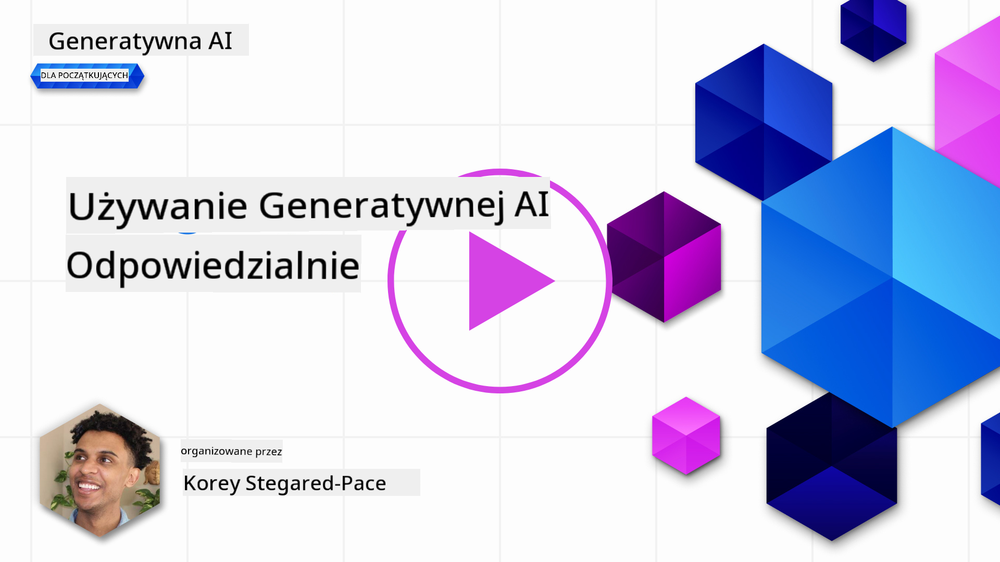
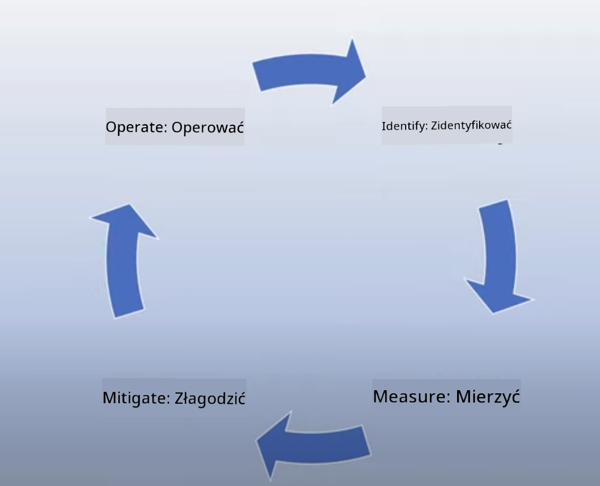
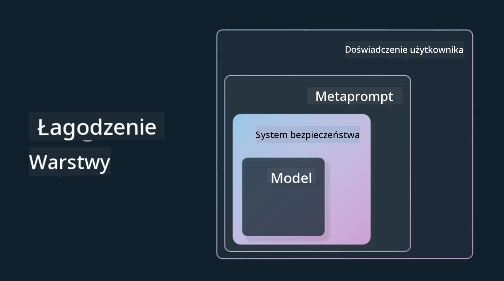

<!--
CO_OP_TRANSLATOR_METADATA:
{
  "original_hash": "13084c6321a2092841b9a081b29497ba",
  "translation_date": "2025-06-25T11:22:05+00:00",
  "source_file": "03-using-generative-ai-responsibly/README.md",
  "language_code": "pl"
}
-->
# Odpowiedzialne korzystanie z Generatywnej AI

> _Kliknij obrazek powyżej, aby obejrzeć wideo z tej lekcji_

Łatwo jest być zafascynowanym AI, a szczególnie generatywną AI, ale musisz zastanowić się, jak korzystać z niej odpowiedzialnie. Powinieneś rozważyć takie aspekty jak zapewnienie, że wyniki są sprawiedliwe, nie szkodliwe i wiele więcej. Ten rozdział ma na celu dostarczenie kontekstu, co należy wziąć pod uwagę i jak podjąć aktywne kroki, aby poprawić swoje korzystanie z AI.

## Wprowadzenie

Ta lekcja obejmie:

- Dlaczego powinieneś priorytetowo traktować Odpowiedzialną AI podczas tworzenia aplikacji Generatywnej AI.
- Główne zasady Odpowiedzialnej AI i ich związek z Generatywną AI.
- Jak wdrażać te zasady Odpowiedzialnej AI poprzez strategię i narzędzia.

## Cele nauki

Po ukończeniu tej lekcji będziesz wiedział:

- Znaczenie Odpowiedzialnej AI podczas tworzenia aplikacji Generatywnej AI.
- Kiedy myśleć i stosować główne zasady Odpowiedzialnej AI podczas tworzenia aplikacji Generatywnej AI.
- Jakie narzędzia i strategie są dostępne, aby wdrożyć koncepcję Odpowiedzialnej AI.

## Zasady Odpowiedzialnej AI

Ekscytacja związana z Generatywną AI nigdy nie była większa. Ta ekscytacja przyciągnęła wielu nowych deweloperów, uwagę i finansowanie do tej przestrzeni. Choć jest to bardzo pozytywne dla każdego, kto chce budować produkty i firmy wykorzystujące Generatywną AI, ważne jest, aby działać odpowiedzialnie.

W całym kursie skupiamy się na budowaniu naszego startupu i naszego produktu edukacyjnego AI. Wykorzystamy zasady Odpowiedzialnej AI: Sprawiedliwość, Włączanie, Niezawodność/Bezpieczeństwo, Zabezpieczenia i Prywatność, Przejrzystość i Odpowiedzialność. Dzięki tym zasadom zbadamy, jak odnoszą się do naszego wykorzystania Generatywnej AI w naszych produktach.

## Dlaczego powinieneś priorytetowo traktować Odpowiedzialną AI

Podczas budowania produktu, podejście skoncentrowane na człowieku, z uwzględnieniem najlepszych interesów użytkownika, prowadzi do najlepszych rezultatów.

Unikalność Generatywnej AI polega na jej zdolności do tworzenia pomocnych odpowiedzi, informacji, porad i treści dla użytkowników. Można to zrobić bez wielu ręcznych kroków, co może prowadzić do bardzo imponujących wyników. Bez odpowiedniego planowania i strategii może niestety prowadzić do szkodliwych rezultatów dla użytkowników, produktu i społeczeństwa jako całości.

Przyjrzyjmy się niektórym (ale nie wszystkim) potencjalnie szkodliwym rezultatom:

### Halucynacje

Halucynacje to termin używany do opisania sytuacji, gdy LLM generuje treści, które są albo całkowicie bezsensowne, albo coś, co wiemy, że jest błędne w oparciu o inne źródła informacji.

Załóżmy na przykład, że budujemy funkcję dla naszego startupu, która pozwala studentom zadawać pytania historyczne modelowi. Student zadaje pytanie `Who was the sole survivor of Titanic?`

Model generuje odpowiedź taką jak poniżej:

> _(Źródło: [Flying bisons](https://flyingbisons.com?WT.mc_id=academic-105485-koreyst))_

To bardzo pewna i szczegółowa odpowiedź. Niestety, jest błędna. Nawet przy minimalnym wysiłku badawczym, można by odkryć, że było więcej niż jeden ocalały z katastrofy Titanica. Dla studenta, który dopiero zaczyna badać ten temat, odpowiedź ta może być wystarczająco przekonująca, aby jej nie kwestionować i traktować jako fakt. Konsekwencje tego mogą prowadzić do tego, że system AI jest niewiarygodny i negatywnie wpływa na reputację naszego startupu.

Z każdą iteracją danego LLM, obserwujemy poprawę wydajności w minimalizowaniu halucynacji. Nawet przy tej poprawie, jako twórcy aplikacji i użytkownicy, musimy być świadomi tych ograniczeń.

### Szkodliwe treści

Omówiliśmy w poprzedniej sekcji sytuacje, gdy LLM generuje błędne lub bezsensowne odpowiedzi. Innym ryzykiem, o którym musimy być świadomi, jest sytuacja, gdy model odpowiada szkodliwymi treściami.

Szkodliwe treści można zdefiniować jako:

- Dostarczanie instrukcji lub zachęcanie do samookaleczenia lub krzywdzenia określonych grup.
- Treści pełne nienawiści lub poniżające.
- Planowanie jakiegokolwiek rodzaju ataku lub aktów przemocy.
- Dostarczanie instrukcji, jak znaleźć nielegalne treści lub popełnić nielegalne czyny.
- Wyświetlanie treści o charakterze seksualnym.

Dla naszego startupu chcemy upewnić się, że mamy odpowiednie narzędzia i strategie, aby zapobiec wyświetlaniu tego typu treści studentom.

### Brak sprawiedliwości

Sprawiedliwość definiowana jest jako „zapewnienie, że system AI jest wolny od uprzedzeń i dyskryminacji oraz że traktuje wszystkich sprawiedliwie i równo.” W świecie Generatywnej AI chcemy zapewnić, że wykluczające światopoglądy marginalizowanych grup nie są wzmacniane przez wyniki modelu.

Tego typu wyniki są nie tylko destrukcyjne dla budowania pozytywnych doświadczeń produktowych dla naszych użytkowników, ale także powodują dalsze szkody społeczne. Jako twórcy aplikacji, zawsze powinniśmy mieć na uwadze szeroką i zróżnicowaną bazę użytkowników, budując rozwiązania z Generatywną AI.

## Jak używać Generatywnej AI odpowiedzialnie

Teraz, gdy zidentyfikowaliśmy znaczenie Odpowiedzialnej Generatywnej AI, przyjrzyjmy się 4 krokom, które możemy podjąć, aby budować nasze rozwiązania AI odpowiedzialnie:

### Mierzenie potencjalnych szkód

W testowaniu oprogramowania testujemy oczekiwane działania użytkownika na aplikacji. Podobnie, testowanie różnorodnego zestawu promptów, które użytkownicy najprawdopodobniej będą używać, jest dobrym sposobem na mierzenie potencjalnych szkód.

Ponieważ nasz startup buduje produkt edukacyjny, warto przygotować listę promptów związanych z edukacją. Może to obejmować określony temat, fakty historyczne i prompty dotyczące życia studenckiego.

### Łagodzenie potencjalnych szkód

Teraz nadszedł czas, aby znaleźć sposoby, dzięki którym możemy zapobiec lub ograniczyć potencjalne szkody spowodowane przez model i jego odpowiedzi. Możemy spojrzeć na to na 4 różnych warstwach:

- **Model**. Wybór odpowiedniego modelu dla odpowiedniego przypadku użycia. Większe i bardziej skomplikowane modele, takie jak GPT-4, mogą powodować większe ryzyko szkodliwych treści, gdy są stosowane do mniejszych i bardziej specyficznych przypadków użycia. Używanie danych treningowych do dostrajania również zmniejsza ryzyko szkodliwych treści.

- **System bezpieczeństwa**. System bezpieczeństwa to zestaw narzędzi i konfiguracji na platformie obsługującej model, które pomagają w łagodzeniu szkód. Przykładem tego jest system filtrowania treści w usłudze Azure OpenAI. Systemy powinny także wykrywać ataki jailbreak i niepożądane działania, takie jak żądania od botów.

- **Metaprompt**. Metaprompty i uziemienie to sposoby, dzięki którym możemy kierować lub ograniczać model na podstawie określonych zachowań i informacji. Może to być używanie danych systemowych do definiowania określonych limitów modelu. Dodatkowo, dostarczanie wyników bardziej odpowiednich dla zakresu lub domeny systemu.

Może to być również używanie technik takich jak Retrieval Augmented Generation (RAG), aby model pobierał informacje tylko z wybranych zaufanych źródeł. Jest lekcja później w tym kursie dotycząca [budowania aplikacji wyszukiwania](../08-building-search-applications/README.md?WT.mc_id=academic-105485-koreyst)

- **Doświadczenie użytkownika**. Ostatnia warstwa to miejsce, gdzie użytkownik bezpośrednio wchodzi w interakcję z modelem poprzez interfejs naszej aplikacji w jakiś sposób. W ten sposób możemy projektować UI/UX, aby ograniczyć użytkownika w rodzaju danych wejściowych, które mogą wysyłać do modelu, a także teksty lub obrazy wyświetlane użytkownikowi. Podczas wdrażania aplikacji AI musimy także być przejrzyści co do tego, co nasza aplikacja Generatywna AI może, a czego nie może zrobić.

Mamy całą lekcję poświęconą [Projektowaniu UX dla aplikacji AI](../12-designing-ux-for-ai-applications/README.md?WT.mc_id=academic-105485-koreyst)

- **Ocena modelu**. Praca z LLM może być trudna, ponieważ nie zawsze mamy kontrolę nad danymi, na których model był trenowany. Niemniej jednak, zawsze powinniśmy oceniać wydajność i wyniki modelu. Nadal ważne jest, aby mierzyć dokładność modelu, podobieństwo, ugruntowanie i trafność wyników. Pomaga to zapewnić przejrzystość i zaufanie interesariuszom i użytkownikom.

### Operowanie odpowiedzialnym rozwiązaniem Generatywnej AI

Budowanie praktyki operacyjnej wokół twoich aplikacji AI jest ostatnim etapem. Obejmuje to współpracę z innymi częściami naszego startupu, takimi jak Dział Prawny i Bezpieczeństwo, aby zapewnić zgodność ze wszystkimi regulacyjnymi politykami. Przed uruchomieniem chcemy także budować plany dotyczące dostawy, obsługi incydentów i cofania zmian, aby zapobiec wzrostowi szkód dla naszych użytkowników.

## Narzędzia

Choć praca nad rozwijaniem rozwiązań Odpowiedzialnej AI może wydawać się duża, jest to praca warta wysiłku. W miarę jak obszar Generatywnej AI rośnie, więcej narzędzi, które pomogą deweloperom efektywnie integrować odpowiedzialność w ich przepływy pracy, będzie dojrzewać. Na przykład, [Azure AI Content Safety](https://learn.microsoft.com/azure/ai-services/content-safety/overview?WT.mc_id=academic-105485-koreyst) może pomóc w wykrywaniu szkodliwych treści i obrazów poprzez żądanie API.

## Sprawdzenie wiedzy

O czym musisz się martwić, aby zapewnić odpowiedzialne korzystanie z AI?

1. Że odpowiedź jest poprawna.
1. Szkodliwe użycie, że AI nie jest wykorzystywana do celów przestępczych.
1. Zapewnienie, że AI jest wolna od uprzedzeń i dyskryminacji.

A: 2 i 3 są poprawne. Odpowiedzialna AI pomaga rozważyć, jak złagodzić szkodliwe skutki i uprzedzenia i więcej.

## 🚀 Wyzwanie

Przeczytaj o [Azure AI Content Safety](https://learn.microsoft.com/azure/ai-services/content-safety/overview?WT.mc_id=academic-105485-koreyst) i zobacz, co możesz zaadoptować dla swojego użytkowania.

## Świetna praca, kontynuuj naukę

Po ukończeniu tej lekcji, sprawdź naszą [kolekcję nauki Generatywnej AI](https://aka.ms/genai-collection?WT.mc_id=academic-105485-koreyst), aby kontynuować rozwijanie swojej wiedzy o Generatywnej AI!

Przejdź do Lekcji 4, gdzie przyjrzymy się [Podstawom inżynierii promptów](../04-prompt-engineering-fundamentals/README.md?WT.mc_id=academic-105485-koreyst)!

**Zastrzeżenie**:  
Ten dokument został przetłumaczony przy użyciu usługi tłumaczenia AI [Co-op Translator](https://github.com/Azure/co-op-translator). Chociaż staramy się zapewnić dokładność, prosimy pamiętać, że automatyczne tłumaczenia mogą zawierać błędy lub nieścisłości. Oryginalny dokument w jego rodzimym języku powinien być uznawany za źródło autorytatywne. W przypadku informacji krytycznych zaleca się profesjonalne tłumaczenie przez człowieka. Nie ponosimy odpowiedzialności za wszelkie nieporozumienia lub błędne interpretacje wynikające z użycia tego tłumaczenia.