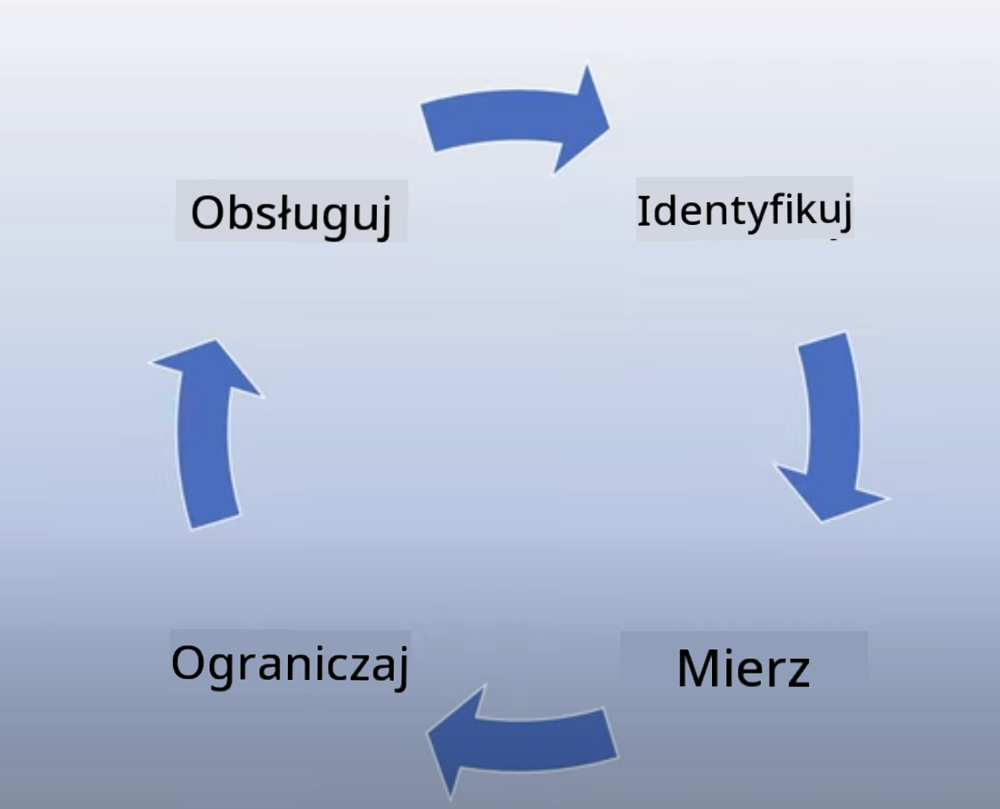

<!--
CO_OP_TRANSLATOR_METADATA:
{
  "original_hash": "4d57fad773cbeb69c5dd62e65c34200d",
  "translation_date": "2025-10-18T00:52:42+00:00",
  "source_file": "03-using-generative-ai-responsibly/README.md",
  "language_code": "pl"
}
-->
# Odpowiedzialne korzystanie z generatywnej AI

> _Kliknij obrazek powyżej, aby obejrzeć wideo z tej lekcji_

Łatwo jest fascynować się sztuczną inteligencją, a w szczególności generatywną AI, ale należy zastanowić się, jak korzystać z niej w sposób odpowiedzialny. Trzeba wziąć pod uwagę takie kwestie jak zapewnienie, że wyniki są sprawiedliwe, nie szkodzą i wiele więcej. Ten rozdział ma na celu dostarczenie kontekstu, wskazanie, na co zwrócić uwagę, oraz jak podjąć aktywne kroki w celu poprawy korzystania z AI.

## Wprowadzenie

Ta lekcja obejmie:

- Dlaczego warto priorytetowo traktować odpowiedzialne podejście do AI podczas tworzenia aplikacji generatywnej AI.
- Podstawowe zasady odpowiedzialnej AI i ich związek z generatywną AI.
- Jak wdrożyć te zasady w praktyce za pomocą strategii i narzędzi.

## Cele nauki

Po ukończeniu tej lekcji będziesz wiedzieć:

- Jak ważna jest odpowiedzialna AI podczas tworzenia aplikacji generatywnej AI.
- Kiedy należy myśleć o zasadach odpowiedzialnej AI i stosować je podczas tworzenia aplikacji generatywnej AI.
- Jakie narzędzia i strategie są dostępne, aby wdrożyć koncepcję odpowiedzialnej AI w praktyce.

## Zasady odpowiedzialnej AI

Ekscytacja generatywną AI nigdy nie była większa. Ten entuzjazm przyciągnął wielu nowych programistów, uwagę i finansowanie w tej dziedzinie. Choć jest to bardzo pozytywne dla każdego, kto chce budować produkty i firmy wykorzystujące generatywną AI, równie ważne jest, aby działać odpowiedzialnie.

W całym kursie skupiamy się na budowaniu naszego startupu i produktu edukacyjnego opartego na AI. Wykorzystamy zasady odpowiedzialnej AI: Sprawiedliwość, Włączanie, Niezawodność/Bezpieczeństwo, Ochrona danych i prywatności, Przejrzystość oraz Odpowiedzialność. Dzięki tym zasadom zbadamy, jak odnoszą się one do naszego wykorzystania generatywnej AI w naszych produktach.

## Dlaczego warto priorytetowo traktować odpowiedzialną AI

Podczas tworzenia produktu, podejście skoncentrowane na człowieku, które uwzględnia najlepsze interesy użytkownika, prowadzi do najlepszych rezultatów.

Unikalność generatywnej AI polega na jej zdolności do tworzenia pomocnych odpowiedzi, informacji, wskazówek i treści dla użytkowników. Może to być realizowane bez wielu ręcznych kroków, co prowadzi do bardzo imponujących wyników. Jednak bez odpowiedniego planowania i strategii może to niestety prowadzić do szkodliwych rezultatów dla użytkowników, produktu i całego społeczeństwa.

Przyjrzyjmy się niektórym (choć nie wszystkim) potencjalnie szkodliwym rezultatom:

### Halucynacje

Halucynacje to termin używany do opisania sytuacji, gdy model językowy generuje treści, które są albo całkowicie bezsensowne, albo ewidentnie błędne w świetle innych źródeł informacji.

Załóżmy, że tworzymy funkcję dla naszego startupu, która pozwala uczniom zadawać modelowi pytania historyczne. Uczeń zadaje pytanie: `Kto był jedynym ocalałym z Titanica?`

Model generuje odpowiedź, taką jak poniżej:

> _(Źródło: [Flying bisons](https://flyingbisons.com?WT.mc_id=academic-105485-koreyst))_

To bardzo pewna siebie i szczegółowa odpowiedź. Niestety, jest ona błędna. Nawet przy minimalnym wysiłku badawczym można odkryć, że z katastrofy Titanica ocalało więcej niż jedna osoba. Dla ucznia, który dopiero zaczyna zgłębiać ten temat, taka odpowiedź może być na tyle przekonująca, że nie zostanie zakwestionowana i potraktowana jako fakt. Konsekwencje tego mogą prowadzić do tego, że system AI stanie się niewiarygodny i negatywnie wpłynie na reputację naszego startupu.

Z każdą kolejną wersją danego modelu językowego widzimy poprawę w zakresie minimalizowania halucynacji. Mimo tych postępów, jako twórcy aplikacji i użytkownicy, musimy być świadomi tych ograniczeń.

### Szkodliwe treści

W poprzedniej sekcji omówiliśmy sytuacje, w których model językowy generuje błędne lub bezsensowne odpowiedzi. Kolejnym ryzykiem, które musimy brać pod uwagę, jest generowanie przez model szkodliwych treści.

Szkodliwe treści można zdefiniować jako:

- Podawanie instrukcji lub zachęcanie do samookaleczenia lub krzywdzenia określonych grup.
- Treści nienawistne lub poniżające.
- Pomoc w planowaniu jakichkolwiek ataków lub aktów przemocy.
- Podawanie instrukcji, jak znaleźć nielegalne treści lub popełnić nielegalne czyny.
- Wyświetlanie treści o charakterze seksualnym.

W naszym startupie chcemy upewnić się, że mamy odpowiednie narzędzia i strategie, aby zapobiec wyświetlaniu tego rodzaju treści uczniom.

### Brak sprawiedliwości

Sprawiedliwość definiuje się jako „zapewnienie, że system AI jest wolny od uprzedzeń i dyskryminacji oraz że traktuje wszystkich sprawiedliwie i równo”. W świecie generatywnej AI chcemy upewnić się, że wykluczające światopoglądy grup marginalizowanych nie są wzmacniane przez wyniki generowane przez model.

Tego rodzaju wyniki nie tylko niszczą pozytywne doświadczenia użytkowników z naszym produktem, ale także powodują dalsze szkody społeczne. Jako twórcy aplikacji powinniśmy zawsze mieć na uwadze szeroką i zróżnicowaną bazę użytkowników podczas tworzenia rozwiązań z wykorzystaniem generatywnej AI.

## Jak odpowiedzialnie korzystać z generatywnej AI

Teraz, gdy zidentyfikowaliśmy znaczenie odpowiedzialnej generatywnej AI, przyjrzyjmy się 4 krokom, które możemy podjąć, aby budować nasze rozwiązania AI w sposób odpowiedzialny:

### Ocena potencjalnych szkód

W testowaniu oprogramowania sprawdzamy oczekiwane działania użytkownika w aplikacji. Podobnie, testowanie różnorodnego zestawu zapytań, które użytkownicy najprawdopodobniej będą zadawać, jest dobrym sposobem na ocenę potencjalnych szkód.

Ponieważ nasz startup buduje produkt edukacyjny, warto przygotować listę zapytań związanych z edukacją. Mogą one dotyczyć określonych przedmiotów, faktów historycznych oraz życia studenckiego.

### Ograniczanie potencjalnych szkód

Teraz nadszedł czas, aby znaleźć sposoby zapobiegania lub ograniczania potencjalnych szkód spowodowanych przez model i jego odpowiedzi. Możemy to rozważyć na 4 różnych poziomach:

- **Model**. Wybór odpowiedniego modelu do odpowiedniego zastosowania. Większe i bardziej złożone modele, takie jak GPT-4, mogą stwarzać większe ryzyko generowania szkodliwych treści, gdy są stosowane w mniejszych i bardziej specyficznych przypadkach. Użycie danych treningowych do dostosowania modelu również zmniejsza ryzyko szkodliwych treści.

- **System bezpieczeństwa**. System bezpieczeństwa to zestaw narzędzi i konfiguracji na platformie obsługującej model, które pomagają ograniczyć szkody. Przykładem może być system filtrowania treści w usłudze Azure OpenAI. Systemy powinny również wykrywać ataki typu jailbreak i niepożądane działania, takie jak żądania od botów.

- **Metaprompt**. Metaprompty i ugruntowanie to sposoby, dzięki którym możemy kierować lub ograniczać model na podstawie określonych zachowań i informacji. Może to polegać na użyciu danych wejściowych systemu do zdefiniowania określonych ograniczeń modelu. Dodatkowo, dostarczanie wyników bardziej odpowiednich dla zakresu lub dziedziny systemu.

Można również stosować techniki takie jak Retrieval Augmented Generation (RAG), aby model korzystał wyłącznie z wybranych, zaufanych źródeł informacji. W późniejszej lekcji tego kursu omówimy [budowanie aplikacji wyszukiwania](../08-building-search-applications/README.md?WT.mc_id=academic-105485-koreyst).

- **Doświadczenie użytkownika**. Ostatnia warstwa to miejsce, w którym użytkownik bezpośrednio wchodzi w interakcję z modelem za pośrednictwem interfejsu naszej aplikacji. W ten sposób możemy zaprojektować interfejs użytkownika (UI/UX), aby ograniczyć typy danych wejściowych, które użytkownik może wysyłać do modelu, a także tekst lub obrazy wyświetlane użytkownikowi. Podczas wdrażania aplikacji AI musimy również być transparentni w kwestii tego, co nasza aplikacja generatywnej AI może, a czego nie może zrobić.

Cała lekcja poświęcona jest [projektowaniu UX dla aplikacji AI](../12-designing-ux-for-ai-applications/README.md?WT.mc_id=academic-105485-koreyst).

- **Ocena modelu**. Praca z modelami językowymi może być wyzwaniem, ponieważ nie zawsze mamy kontrolę nad danymi, na których model był trenowany. Niemniej jednak zawsze powinniśmy oceniać wydajność i wyniki modelu. Ważne jest, aby mierzyć dokładność, podobieństwo, ugruntowanie i trafność wyników modelu. Pomaga to zapewnić przejrzystość i zaufanie dla interesariuszy i użytkowników.

### Operowanie odpowiedzialnym rozwiązaniem generatywnej AI

Budowanie praktyki operacyjnej wokół aplikacji AI to ostatni etap. Obejmuje to współpracę z innymi działami naszego startupu, takimi jak dział prawny i bezpieczeństwa, aby upewnić się, że jesteśmy zgodni ze wszystkimi regulacjami. Przed uruchomieniem chcemy również opracować plany dotyczące dostarczania, obsługi incydentów i wycofywania, aby zapobiec wszelkim szkodom dla naszych użytkowników.

## Narzędzia

Choć praca nad tworzeniem odpowiedzialnych rozwiązań AI może wydawać się wymagająca, jest to wysiłek wart podjęcia. W miarę rozwoju obszaru generatywnej AI, dojrzewają również narzędzia pomagające programistom efektywnie integrować odpowiedzialność w ich procesach. Na przykład [Azure AI Content Safety](https://learn.microsoft.com/azure/ai-services/content-safety/overview?WT.mc_id=academic-105485-koreyst) może pomóc w wykrywaniu szkodliwych treści i obrazów za pomocą żądania API.

## Sprawdzenie wiedzy

Na co należy zwrócić uwagę, aby zapewnić odpowiedzialne korzystanie z AI?

1. Czy odpowiedź jest poprawna.
1. Szkodliwe użycie, aby AI nie była wykorzystywana do celów przestępczych.
1. Zapewnienie, że AI jest wolna od uprzedzeń i dyskryminacji.

Odpowiedź: 2 i 3 są poprawne. Odpowiedzialna AI pomaga rozważyć, jak ograniczyć szkodliwe skutki, uprzedzenia i inne kwestie.

## 🚀 Wyzwanie

Przeczytaj o [Azure AI Content Safety](https://learn.microsoft.com/azure/ai-services/content-safety/overview?WT.mc_id=academic-105485-koreyst) i zobacz, co możesz zaadoptować do własnego użytku.

## Świetna robota, kontynuuj naukę

Po ukończeniu tej lekcji, sprawdź naszą [kolekcję nauki o generatywnej AI](https://aka.ms/genai-collection?WT.mc_id=academic-105485-koreyst), aby dalej rozwijać swoją wiedzę na temat generatywnej AI!

Przejdź do Lekcji 4, gdzie omówimy [Podstawy inżynierii zapytań](../04-prompt-engineering-fundamentals/README.md?WT.mc_id=academic-105485-koreyst)!

---

**Zastrzeżenie**:  
Ten dokument został przetłumaczony za pomocą usługi tłumaczenia AI [Co-op Translator](https://github.com/Azure/co-op-translator). Chociaż staramy się zapewnić dokładność, prosimy pamiętać, że automatyczne tłumaczenia mogą zawierać błędy lub nieścisłości. Oryginalny dokument w jego rodzimym języku powinien być uznawany za autorytatywne źródło. W przypadku informacji krytycznych zaleca się skorzystanie z profesjonalnego tłumaczenia przez człowieka. Nie ponosimy odpowiedzialności za jakiekolwiek nieporozumienia lub błędne interpretacje wynikające z użycia tego tłumaczenia.