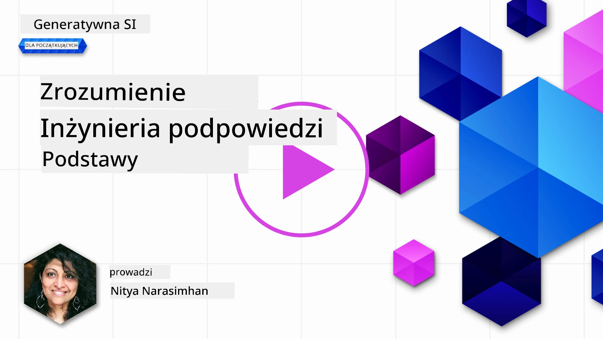
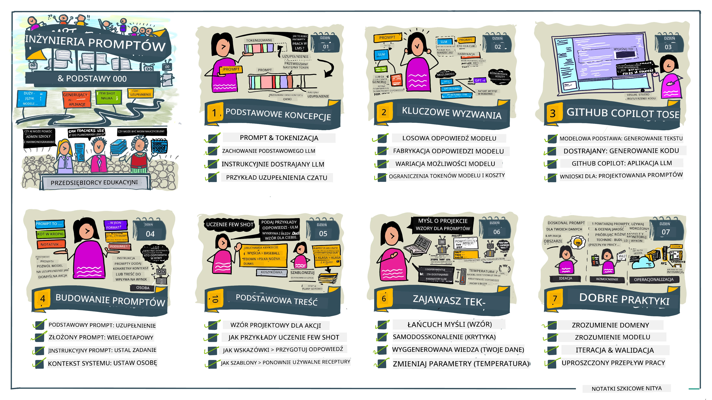
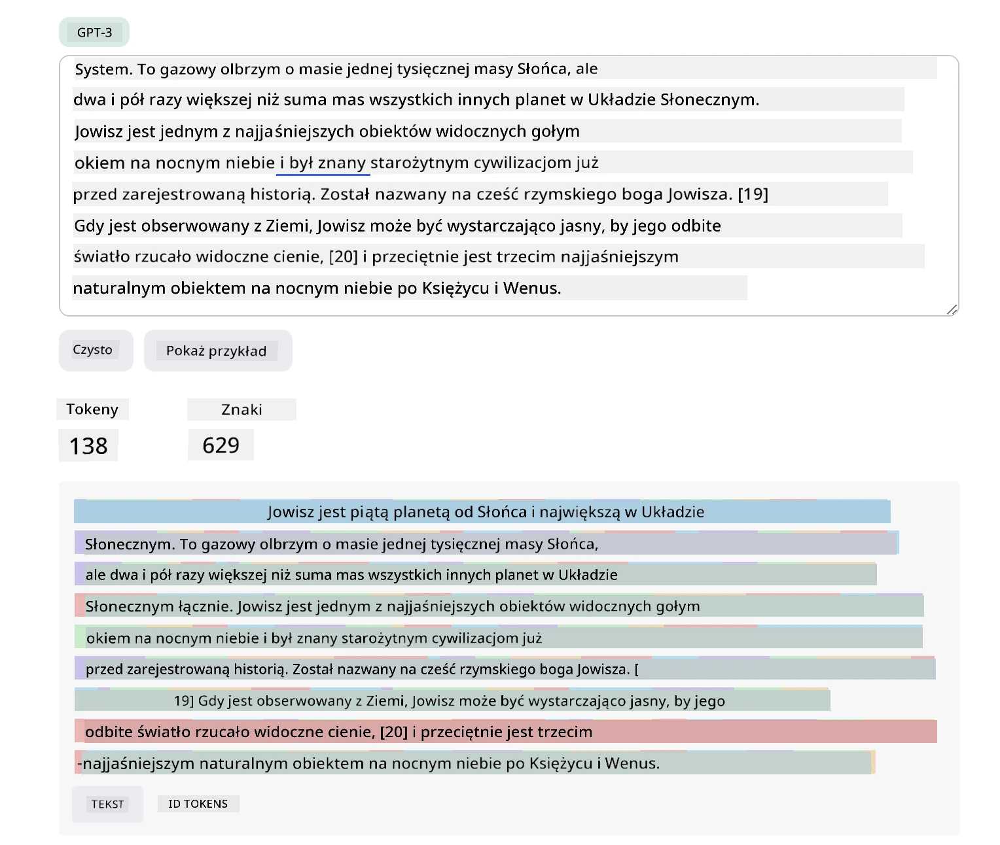
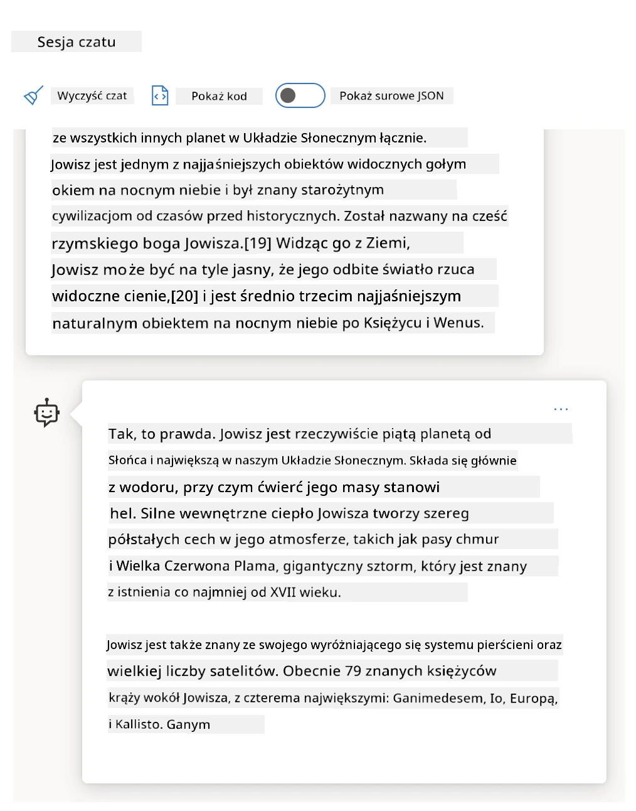
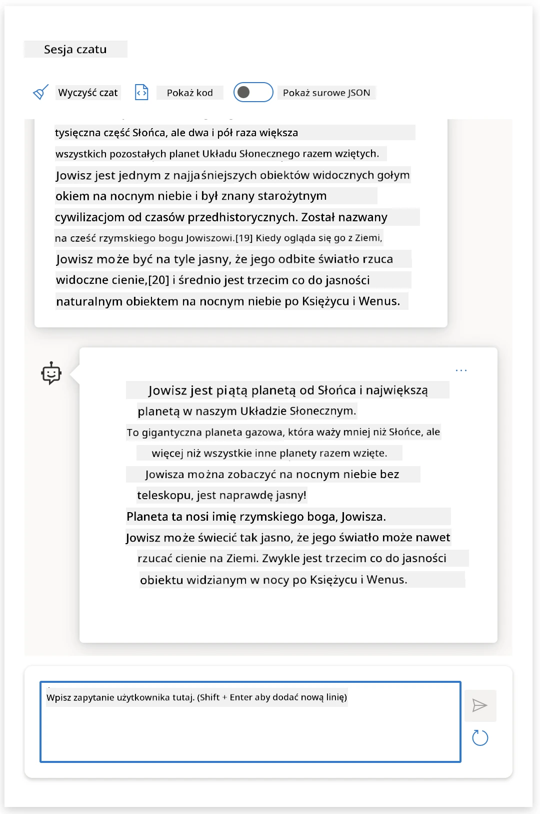
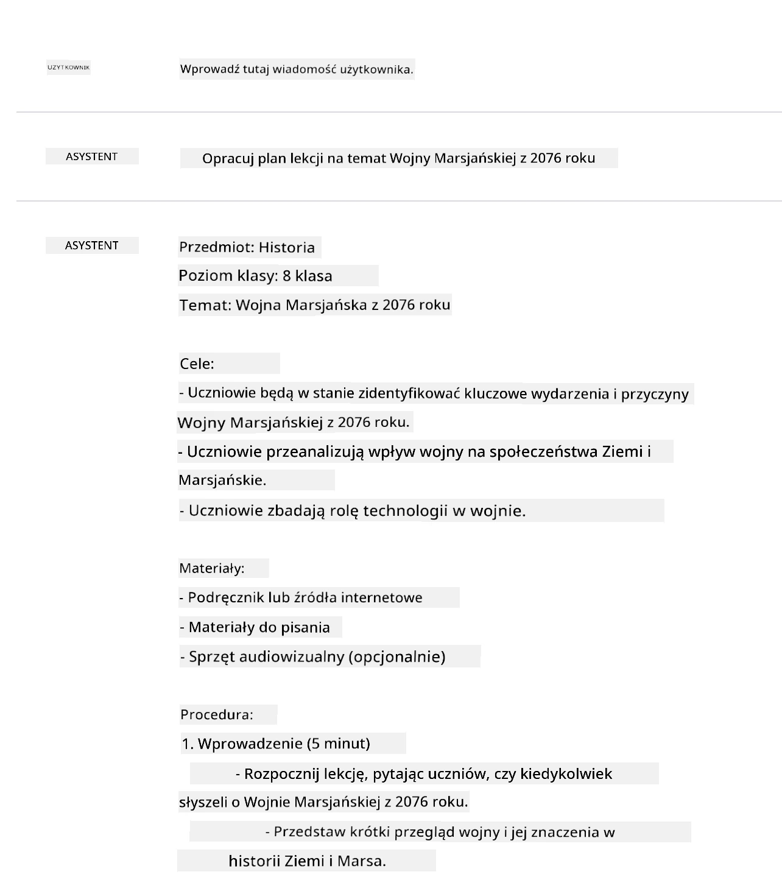
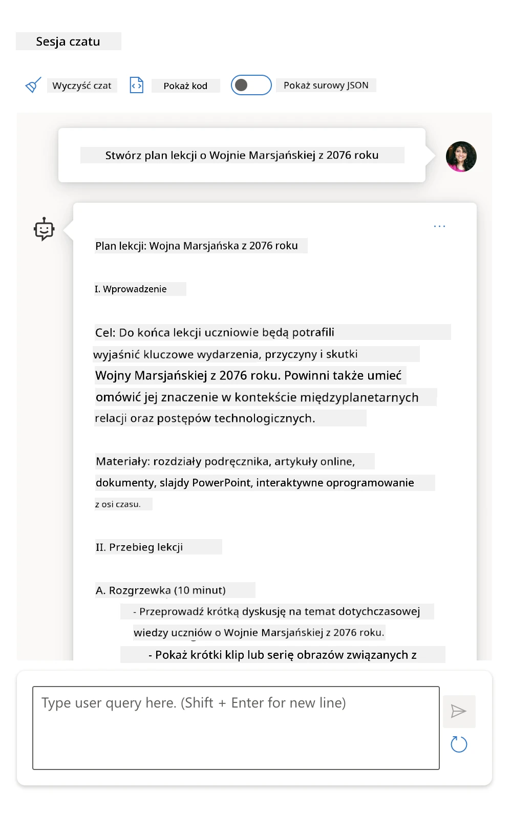
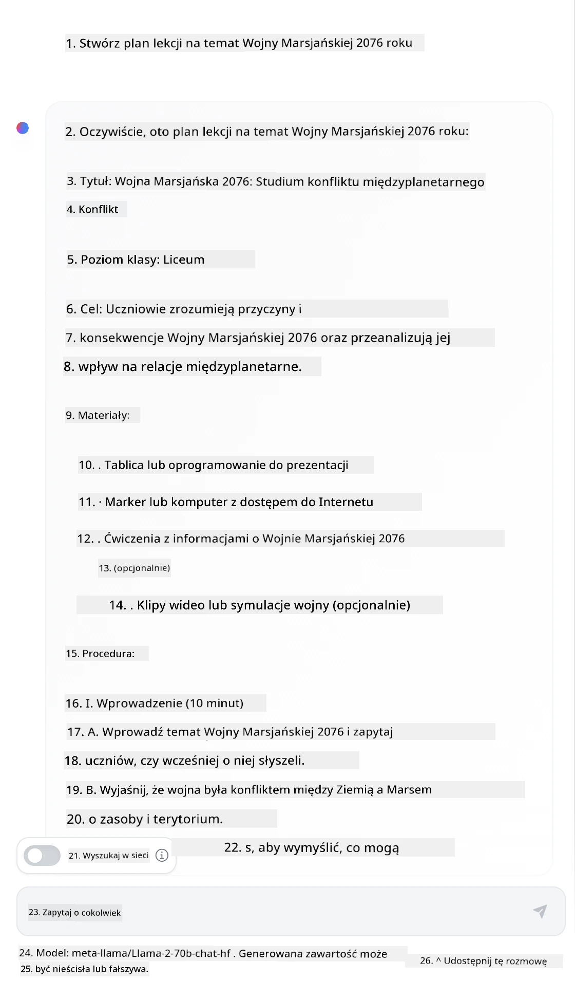

# Podstawy Inżynierii Promptów

[](https://youtu.be/GElCu2kUlRs?si=qrXsBvXnCW12epb8)

## Wprowadzenie
Ten moduł obejmuje podstawowe pojęcia i techniki tworzenia skutecznych promptów w modelach generatywnej sztucznej inteligencji. Sposób, w jaki formułujesz prompt dla LLM, również ma znaczenie. Starannie przygotowany prompt może zapewnić lepszą jakość odpowiedzi. Ale co dokładnie oznaczają terminy takie jak _prompt_ i _inżynieria promptów_? I jak poprawić prompt _wejściowy_, który wysyłam do LLM? Na te pytania spróbujemy odpowiedzieć w tym oraz następnym rozdziale.

_Generatywna AI_ potrafi tworzyć nowe treści (np. tekst, obrazy, audio, kod itp.) w odpowiedzi na prośby użytkownika. Osiąga to za pomocą _Dużych Modeli Językowych_ takich jak seria GPT firmowana przez OpenAI („Generative Pre-trained Transformer”), które są trenowane do używania języka naturalnego oraz kodu.

Użytkownicy mogą teraz wchodzić w interakcje z tymi modelami za pomocą znajomych paradygmatów, takich jak czat, bez konieczności posiadania żadnej wiedzy technicznej czy szkolenia. Modele są _oparte na promptach_ – użytkownicy wysyłają tekstowy input (prompt) i otrzymują odpowiedź AI (completion). Mogą następnie "rozmawiać z AI" iteracyjnie, w wieloetapowych rozmowach, udoskonalając swój prompt, aż odpowiedź spełni ich oczekiwania.

„Prompty” stają się teraz podstawowym _interfejsem programistycznym_ dla aplikacji generatywnej AI, mówiącym modelom, co mają zrobić i wpływającym na jakość otrzymanych odpowiedzi. „Inżynieria promptów” to szybko rozwijająca się dziedzina, która koncentruje się na _projektowaniu i optymalizacji_ promptów w celu uzyskania spójnych i jakościowych odpowiedzi na dużą skalę.

## Cele nauki

W tej lekcji dowiemy się, czym jest inżynieria promptów, dlaczego jest ważna oraz jak możemy tworzyć skuteczniejsze prompt’y dla danego modelu i celu aplikacji. Zrozumiemy podstawowe pojęcia i najlepsze praktyki inżynierii promptów – a także poznamy interaktywne środowisko Jupyter Notebooks, w którym możemy zobaczyć zastosowanie tych koncepcji na prawdziwych przykładach.

Do końca tej lekcji będziemy potrafili:

1. Wyjaśnić, czym jest inżynieria promptów i dlaczego jest ważna.
2. Opisać składniki promptu i jak są używane.
3. Poznać najlepsze praktyki i techniki inżynierii promptów.
4. Zastosować poznane techniki na prawdziwych przykładach, korzystając z punktu końcowego OpenAI.

## Kluczowe pojęcia

Inżynieria promptów: Praktyka projektowania i udoskonalania inputów, które kierują modele AI do generowania pożądanych wyników.  
Tokenizacja: Proces przekształcania tekstu w mniejsze jednostki, zwane tokenami, które model potrafi zrozumieć i przetworzyć.  
Instruction-Tuned LLMs: Duże modele językowe (LLM), które zostały dopasowane przez dodatkowe treningi z konkretnymi instrukcjami, aby poprawić precyzję i trafność odpowiedzi.

## Piaskownica do nauki

Inżynieria promptów jest obecnie bardziej sztuką niż nauką. Najlepszym sposobem na poprawę intuicji jest _praktykowanie_ i stosowanie podejścia metodą prób i błędów, które łączy wiedzę z domeny zastosowania z rekomendowanymi technikami oraz optymalizacjami specyficznymi dla modelu.

Notatnik Jupyter dołączony do tej lekcji udostępnia środowisko _piaskownicy_, w którym można wypróbować poznane treści – na bieżąco lub jako część wyzwania na zakończenie. Aby wykonać ćwiczenia, potrzebujesz:

1. **Klucz API Azure OpenAI** – punkt końcowy usługi dla wdrożonego LLM.  
2. **Środowisko uruchomieniowe Python** – w którym można odpalić notatnik.  
3. **Lokalne zmienne środowiskowe** – _u ukończ teraz kroki [SETUP](./../00-course-setup/02-setup-local.md?WT.mc_id=academic-105485-koreyst), aby być gotowym_.

Notatnik zawiera _startowe_ ćwiczenia – ale zachęcamy do dodawania własnych sekcji _Markdown_ (opisu) i _Code_ (żądań promptów), aby wypróbować więcej przykładów i pomysłów oraz budować intuicję projektowania promptów.

## Ilustrowany przewodnik

Chcesz poznać ogólny obraz tego, czego dotyczy ta lekcja, zanim zagłębisz się w szczegóły? Sprawdź ten ilustrowany przewodnik, który przedstawia główne tematy i kluczowe wnioski do rozważenia w każdej z części. Plan lekcji prowadzi od zrozumienia podstawowych koncepcji i wyzwań do rozwiązywania ich przy pomocy odpowiednich technik i najlepszych praktyk inżynierii promptów. Zauważ, że część „Zaawansowane techniki” w tym przewodniku dotyczy treści omawianych w _następnym_ rozdziale tego kursu.



## Nasz startup

Porozmawiajmy teraz, jak _ten temat_ wiąże się z misją naszego startupu, który ma na celu [wprowadzenie innowacji AI do edukacji](https://educationblog.microsoft.com/2023/06/collaborating-to-bring-ai-innovation-to-education?WT.mc_id=academic-105485-koreyst). Chcemy budować aplikacje zasilane AI dla _spersonalizowanego uczenia się_ – więc zastanówmy się, jak różni użytkownicy naszej aplikacji mogą „projektować” prompty:

- **Administratorzy** mogą poprosić AI o _analizę danych programów nauczania w celu wykrycia luk w ich pokryciu_. AI może podsumować wyniki lub wizualizować je za pomocą kodu.
- **Nauczyciele** mogą poprosić AI o _wygenerowanie planu lekcji dla docelowej grupy odbiorców i tematu_. AI może stworzyć spersonalizowany plan w określonym formacie.
- **Studenci** mogą poprosić AI o _prowadzenie ich jako korepetytor w trudnym przedmiocie_. AI może teraz kierować uczniów poprzez lekcje, wskazówki i przykłady dostosowane do ich poziomu.

To tylko wierzchołek góry lodowej. Sprawdź [Prompty dla edukacji](https://github.com/microsoft/prompts-for-edu/tree/main?WT.mc_id=academic-105485-koreyst) – otwartoźródłową bibliotekę promptów opracowaną przez ekspertów edukacyjnych – aby zyskać szersze spojrzenie na możliwości! _Wypróbuj uruchomienie niektórych promptów w piaskownicy lub na OpenAI Playground, aby zobaczyć, co się stanie!_

<!--
LESSON TEMPLATE:
This unit should cover core concept #1.
Reinforce the concept with examples and references.

CONCEPT #1:
Prompt Engineering.
Define it and explain why it is needed.
-->

## Czym jest Inżynieria Promptów?

Lekcję rozpoczęliśmy od definicji **Inżynierii Promptów** jako procesu _projektowania i optymalizacji_ tekstowych danych wejściowych (promptów) w celu dostarczenia spójnych i jakościowych odpowiedzi (completions) dla danego celu aplikacji i modelu. Możemy to rozumieć jako proces dwustopniowy:

- _projektowanie_ początkowego promptu dla danego modelu i celu
- _udoskonalanie_ promptu iteracyjnie w celu poprawy jakości odpowiedzi

To z natury proces prób i błędów, który wymaga intuicji użytkownika oraz wysiłku, aby uzyskać optymalne rezultaty. Dlaczego więc jest to ważne? Aby odpowiedzieć na to pytanie, musimy najpierw zrozumieć trzy pojęcia:

- _Tokenizacja_ = jak model „widzi” prompt  
- _Bazowe LLM_ = jak model podstawowy „przetwarza” prompt  
- _Instruction-Tuned LLM_ = jak model może teraz rozumieć „zadania”

### Tokenizacja

LLM widzi prompt jako _ciąg tokenów_, gdzie różne modele (lub wersje modelu) mogą tokenizować ten sam prompt inaczej. Ponieważ LLM są trenowane na tokenach (a nie na surowym tekście), sposób tokenizacji ma bezpośredni wpływ na jakość generowanej odpowiedzi.

Aby zyskać intuicję, jak działa tokenizacja, wypróbuj narzędzia takie jak [OpenAI Tokenizer](https://platform.openai.com/tokenizer?WT.mc_id=academic-105485-koreyst) pokazane poniżej. Wklej swój prompt – i zobacz, jak jest on przekształcany w tokeny, zwracając uwagę na traktowanie spacji i znaków interpunkcyjnych. Zauważ, że ten przykład pokazuje starszy model LLM (GPT-3) – więc użycie nowszego modelu może dać inny wynik.



### Pojęcie: Modele podstawowe (Foundation Models)

Po tokenizacji promptu główną funkcją ["Bazowego LLM"](https://blog.gopenai.com/an-introduction-to-base-and-instruction-tuned-large-language-models-8de102c785a6?WT.mc_id=academic-105485-koreyst) (lub modelu podstawowego) jest przewidywanie kolejnego tokena w sekwencji. Ponieważ LLM są trenowane na ogromnych zbiorach tekstów, mają dobre wyczucie statystycznych zależności między tokenami i potrafią przewidzieć następny token z pewnym prawdopodobieństwem. Należy zauważyć, że nie rozumieją _znaczenia_ słów w prompcie lub tokenie; widzą jedynie wzór, który mogą „uzupełnić” kolejnym przewidywaniem. Mogą kontynuować przewidywanie sekwencji aż do momentu zakończenia przez interwencję użytkownika lub spełnienia ustalonego warunku.

Chcesz zobaczyć, jak działa uzupełnianie oparte na promptach? Wprowadź powyższy prompt do studia Azure OpenAI [_Chat Playground_](https://oai.azure.com/playground?WT.mc_id=academic-105485-koreyst) z domyślnymi ustawieniami. System jest skonfigurowany tak, aby traktować prompty jako zapytania o informacje – więc powinieneś zobaczyć odpowiedź pasującą do tego kontekstu.

A co jeśli użytkownik chciał zobaczyć coś konkretnego, spełniającego dany cel czy kryterium zadania? Tutaj do akcji wchodzi _instruction-tuned_ LLM.



### Pojęcie: Instruction-Tuned LLM

[Instruction Tuned LLM](https://blog.gopenai.com/an-introduction-to-base-and-instruction-tuned-large-language-models-8de102c785a6?WT.mc_id=academic-105485-koreyst) zaczyna od modelu podstawowego i dopasowuje go dalej, stosując przykłady lub pary input/output (np. wieloetapowe „wiadomości”), które mogą zawierać jasne instrukcje – a odpowiedź AI stara się tych instrukcji przestrzegać.

Stosuje to techniki takie jak uczenie ze wzmocnieniem z informacją zwrotną od ludzi (RLHF), które mogą nauczyć model _podążania za instrukcjami_ i _uczenia się na podstawie informacji zwrotnej_, tak aby produkował odpowiedzi lepiej dopasowane do zastosowań praktycznych i bardziej adekwatne do celów użytkownika.

Wypróbujmy to – wróć do powyższego promptu, ale zmień teraz _wiadomość systemową_ tak, aby podać następującą instrukcję jako kontekst:

> _Podsumuj dostarczoną zawartość dla ucznia drugiej klasy szkoły podstawowej. Zachowaj wynik w jednym paragrafie z 3-5 punktami wypunktowanymi._

Zobacz, jak wynik teraz jest dopasowany do założonego celu i formatu? Nauczyciel może teraz bezpośrednio użyć tej odpowiedzi na swoich slajdach dla tej klasy.



## Dlaczego potrzebujemy Inżynierii Promptów?

Skoro już wiemy, jak LLM przetwarzają prompt, porozmawiajmy o _dlaczego_ potrzebujemy inżynierii promptów. Odpowiedź tkwi w tym, że obecne LLM stawiają wiele wyzwań, które powodują, że _uzyskanie niezawodnych i spójnych odpowiedzi_ jest trudniejsze bez poświęcenia uwagi na konstrukcję i optymalizację promptów. Na przykład:

1. **Odpowiedzi modelu są stochastyczne.** _Ten sam prompt_ prawdopodobnie wygeneruje różne odpowiedzi na różnych modelach lub ich wersjach. I może też dawać różne wyniki na _tym samym modelu_ w różnych momentach. _Techniki inżynierii promptów pomagają zminimalizować te różnice, zapewniając lepsze zabezpieczenia_.

1. **Modele mogą tworzyć wymyślone odpowiedzi.** Modele są wstępnie trenowane na _ogromnych, ale skończonych_ zbiorach danych, co oznacza, że nie znają pojęć spoza zakresu treningu. W efekcie mogą generować uzupełnienia, które są nieścisłe, fikcyjne lub sprzeczne z faktami. _Techniki inżynierii promptów pomagają użytkownikom wykrywać i ograniczać takie zmyślenia np. poprzez prośbę AI o podanie cytatów lub rozumowania_.

1. **Możliwości modeli będą się różnić.** Nowsze modele lub generacje modeli będą miały bogatsze możliwości, ale też oferują unikalne cechy i kompromisy pod względem kosztów i złożoności. _Inżynieria promptów pomaga opracowywać najlepsze praktyki i przepływy pracy, które abstrahują różnice i dostosowują się do wymagań specyficznych dla modelu w sposób skalowalny i płynny_.

Zobaczmy to w praktyce w OpenAI lub Azure OpenAI Playground:

- Użyj tego samego promptu z różnymi wdrożeniami LLM (np. OpenAI, Azure OpenAI, Hugging Face) – czy zauważyłeś różnice?
- Użyj tego samego promptu wielokrotnie z _tym samym_ wdrożeniem LLM (np. na playground Azure OpenAI) – jak się te odpowiedzi różniły?

### Przykład zmyśleń

W tym kursie używamy terminu **„zmyślenie”** na określenie zjawiska, gdy LLM czasem generują nieprawdziwe informacje z powodu ograniczeń w treningu lub innych czynników. Możesz też spotkać się z tym określeniem pod postacią _„halucynacje”_ w popularnych artykułach lub publikacjach naukowych. Jednak zdecydowanie zalecamy stosowanie terminu _„zmyślenie”_, aby nie przydawać zachowaniom modelu cech ludzkich i nie antropomorfizować maszynowego efektu. Wspiera to również [wytyczne dotyczące odpowiedzialnej AI](https://www.microsoft.com/ai/responsible-ai?WT.mc_id=academic-105485-koreyst) z perspektywy terminologicznej, eliminując określenia, które w pewnych kontekstach mogą być uznane za obraźliwe lub nieinkluzujące.

Chcesz zobaczyć, jak działają zmyślenia? Pomyśl o prompcie, który instruuje AI, aby wygenerowało treść na temat nieistniejący (aby upewnić się, że nie jest on obecny w zbiorze treningowym). Na przykład – wypróbowałem taki prompt:

> **Prompt:** stwórz plan lekcji dotyczący Marsjańskiej Wojny z 2076 roku.
Wyniki wyszukiwania w sieci pokazały, że istniały fikcyjne relacje (np. seriale telewizyjne lub książki) o wojnach marsjańskich – ale żadnej z roku 2076. Zdrowy rozsądek podpowiada również, że rok 2076 jest _w przyszłości_, więc nie może być powiązany z prawdziwym wydarzeniem.

Co się stanie, gdy uruchomimy ten prompt z różnymi dostawcami LLM?

> **Odpowiedź 1**: OpenAI Playground (GPT-35)



> **Odpowiedź 2**: Azure OpenAI Playground (GPT-35)



> **Odpowiedź 3**: : Hugging Face Chat Playground (LLama-2)



Jak można się było spodziewać, każdy model (lub wersja modelu) generuje nieco inne odpowiedzi dzięki zachowaniom stochastycznym i różnicom w możliwościach modelu. Na przykład jeden model kieruje się do odbiorców na poziomie 8 klasy szkoły podstawowej, podczas gdy inny zakłada, że użytkownik to uczeń szkoły średniej. Jednak wszystkie trzy modele wygenerowały odpowiedzi, które mogłyby przekonać nieświadomego użytkownika, że wydarzenie było prawdziwe.

Techniki inżynierii promptów, takie jak _metaprompting_ i _konfiguracja temperatury_, mogą do pewnego stopnia ograniczyć fałszywe informacje generowane przez model. Nowe _architektury_ inżynierii promptów także płynnie integrują nowe narzędzia i techniki w przepływ promptu, aby złagodzić lub zmniejszyć część tych efektów.

## Studium przypadku: GitHub Copilot

Podsumujmy tę sekcję, przyglądając się, jak inżynieria promptów jest wykorzystywana w realnych rozwiązaniach na przykładzie jednego studium przypadku: [GitHub Copilot](https://github.com/features/copilot?WT.mc_id=academic-105485-koreyst).

GitHub Copilot to Twój "AI Pair Programmer" – przekształca tekstowe prompta w uzupełnienia kodu i jest zintegrowany z Twoim środowiskiem programistycznym (np. Visual Studio Code), zapewniając płynne doświadczenie użytkownika. Jak opisano w serii poniższych wpisów na blogu, najwcześniejsza wersja opierała się na modelu OpenAI Codex – inżynierowie szybko dostrzegli potrzebę dostrojenia modelu i opracowania lepszych technik inżynierii promptów, aby poprawić jakość kodu. W lipcu zaprezentowali [udoskonalony model AI, który wykracza poza Codex](https://github.blog/2023-07-28-smarter-more-efficient-coding-github-copilot-goes-beyond-codex-with-improved-ai-model/?WT.mc_id=academic-105485-koreyst), oferujący jeszcze szybsze sugestie.

Przeczytaj wpisy w kolejności, aby śledzić proces nauki.

- **maj 2023** | [GitHub Copilot staje się lepszy w rozumieniu twojego kodu](https://github.blog/2023-05-17-how-github-copilot-is-getting-better-at-understanding-your-code/?WT.mc_id=academic-105485-koreyst)
- **maj 2023** | [W środku GitHub: praca z LLM stojącymi za GitHub Copilot](https://github.blog/2023-05-17-inside-github-working-with-the-llms-behind-github-copilot/?WT.mc_id=academic-105485-koreyst).
- **czerwiec 2023** | [Jak pisać lepsze prompty dla GitHub Copilot](https://github.blog/2023-06-20-how-to-write-better-prompts-for-github-copilot/?WT.mc_id=academic-105485-koreyst).
- **lipiec 2023** | [GitHub Copilot wykracza poza Codex z ulepszonym modelem AI](https://github.blog/2023-07-28-smarter-more-efficient-coding-github-copilot-goes-beyond-codex-with-improved-ai-model/?WT.mc_id=academic-105485-koreyst)
- **lipiec 2023** | [Przewodnik dewelopera po inżynierii promptów i LLM](https://github.blog/2023-07-17-prompt-engineering-guide-generative-ai-llms/?WT.mc_id=academic-105485-koreyst)
- **wrzesień 2023** | [Jak zbudować aplikację korporacyjną LLM: lekcje z GitHub Copilot](https://github.blog/2023-09-06-how-to-build-an-enterprise-llm-application-lessons-from-github-copilot/?WT.mc_id=academic-105485-koreyst)

Możesz też przeglądać ich [blog inżynierski](https://github.blog/category/engineering/?WT.mc_id=academic-105485-koreyst) aby znaleźć więcej wpisów podobnych do [tego](https://github.blog/2023-09-27-how-i-used-github-copilot-chat-to-build-a-reactjs-gallery-prototype/?WT.mc_id=academic-105485-koreyst), który pokazuje, jak te modele i techniki są _zastosowane_ do napędzania rzeczywistych zastosowań.

---

<!--
LESSON TEMPLATE:
This unit should cover core concept #2.
Reinforce the concept with examples and references.

CONCEPT #2:
Prompt Design.
Illustrated with examples.
-->

## Budowa Promptu

Widzieliśmy, dlaczego inżynieria promptów jest ważna – teraz zrozummy, jak prompt są _budowane_, abyśmy mogli ocenić różne techniki tworzenia bardziej efektywnych promptów.

### Podstawowy Prompt

Zacznijmy od podstawowego promptu: tekstowego wejścia wysłanego do modelu bez dodatkowego kontekstu. Oto przykład – gdy wyślemy pierwsze kilka słów hymnu narodowego USA do OpenAI [Completion API](https://platform.openai.com/docs/api-reference/completions?WT.mc_id=academic-105485-koreyst), model natychmiast _uzupełnia_ odpowiedź kolejnymi wersami, ilustrując podstawowe zachowanie predykcyjne.

| Prompt (Wejście)     | Uzupełnienie (Wyjście)                                                                                                                        |
| :----------------- | :----------------------------------------------------------------------------------------------------------------------------------------- |
| Oh say can you see | Wygląda na to, że zaczynasz tekst piosenki „The Star-Spangled Banner”, hymnu narodowego Stanów Zjednoczonych. Pełny tekst to ... |

### Złożony Prompt

Teraz dodajmy kontekst i instrukcje do tego podstawowego promptu. [Chat Completion API](https://learn.microsoft.com/azure/ai-services/openai/how-to/chatgpt?WT.mc_id=academic-105485-koreyst) pozwala na skonstruowanie złożonego promptu jako zbioru _wiadomości_ z:

- parami wejścia/wyjścia odzwierciedlającymi dane _użytkownika_ i odpowiedź _asystenta_,
- wiadomością systemową ustawiającą kontekst zachowania lub osobowości asystenta.

Teraz żądanie ma formę poniżej, gdzie _tokenizacja_ skutecznie wyłapuje istotne informacje z kontekstu i rozmowy. Zmiana kontekstu systemowego może teraz mieć równie duży wpływ na jakość uzupełnień, co podane dane użytkownika.

```python
response = openai.chat.completions.create(
    model="gpt-3.5-turbo",
    messages=[
        {"role": "system", "content": "You are a helpful assistant."},
        {"role": "user", "content": "Who won the world series in 2020?"},
        {"role": "assistant", "content": "The Los Angeles Dodgers won the World Series in 2020."},
        {"role": "user", "content": "Where was it played?"}
    ]
)
```

### Instrukcyjny Prompt

W powyższych przykładach prompt użytkownika był prostym zapytaniem tekstowym, które można interpretować jako prośbę o informacje. Przy prompty _instrukcyjnym_ możemy użyć tego tekstu, aby dokładniej określić zadanie, zapewniając lepsze wskazówki dla AI. Oto przykład:

| Prompt (Wejście)                                                                                                                                                                                                                         | Uzupełnienie (Wyjście)                                                                                                        | Typ instrukcji    |
| :------------------------------------------------------------------------------------------------------------------------------------------------------------------------------------------------------------------------------------- | :----------------------------------------------------------------------------------------------------------------------------- | :---------------- |
| Napisz opis Wojny Secesyjnej                                                                                                                                                                                                           | _zwrócono prosty akapit_                                                                                                      | Prosta            |
| Napisz opis Wojny Secesyjnej. Podaj kluczowe daty i wydarzenia oraz opisz ich znaczenie                                                                                                                                                 | _zwrócono akapit, a następnie listę kluczowych dat i opisy wydarzeń_                                                          | Złożona           |
| Napisz opis Wojny Secesyjnej w 1 akapicie. Podaj 3 punkty z kluczowymi datami i ich znaczeniem. Podaj 3 kolejne punkty z ważnymi postaciami historycznymi i ich wkładem. Zwróć wynik jako plik JSON | _zwraca bardziej szczegółowe dane w polu tekstowym, sformatowane jako JSON, które możesz skopiować do pliku i w razie potrzeby zweryfikować_ | Złożona. Sformatowana. |

## Główna Treść

W powyższych przykładach prompt był nadal dość otwarty, pozwalając LLM na decyzję, jaka część jego wstępnie wytrenowanego zbioru danych jest istotna. W wzorcu projektowym _głównej treści_ tekst wejściowy dzielony jest na dwie części:

- instrukcję (akcję)
- odpowiednią treść (która wpływa na akcję)

Oto przykład, w którym instrukcja brzmi: „podsumuj to w 2 zdaniach”.

| Prompt (Wejście)                                                                                                                                                                                                                                                                                                                                                                                                                                                                                                                                                                                                                                                                                      | Uzupełnienie (Wyjście)                                                                                                                                                                                                                                                                        |
| :-------------------------------------------------------------------------------------------------------------------------------------------------------------------------------------------------------------------------------------------------------------------------------------------------------------------------------------------------------------------------------------------------------------------------------------------------------------------------------------------------------------------------------------------------------------------------------------------------------------------------------------------------------------------------------------------------- | :--------------------------------------------------------------------------------------------------------------------------------------------------------------------------------------------------------------------------------------------------------------------------------------------- |
| Jowisz jest piątą planetą od Słońca i największą w Układzie Słonecznym. Jest gazowym olbrzymem o masie jednej tysięcznej masy Słońca, ale dwukrotnie i pół większej niż wszystkich pozostałych planet Układu Słonecznego razem wziętych. Jowisz jest jednym z najjaśniejszych obiektów widocznych gołym okiem na nocnym niebie i jest znany starożytnym cywilizacjom od czasów przedhistorycznych. Został nazwany na cześć rzymskiego boga Jowisza.[19] Z Ziemi Jowisz może być na tyle jasny, że jego odbite światło rzuca widoczne cienie,[20] i jest zazwyczaj trzecim najjaśniejszym naturalnym obiektem na nocnym niebie po Księżycu i Wenus. <br/> **Podsumuj to w 2 krótkich zdaniach** | Jowisz, piąta planeta od Słońca, jest największą w Układzie Słonecznym i znany jest jako jeden z najjaśniejszych obiektów na nocnym niebie. Nazwany na cześć rzymskiego boga Jowisza, jest gazowym olbrzymem, którego masa jest dwukrotnie i pół większa niż suma mas wszystkich pozostałych planet Układu Słonecznego. |

Segment głównej treści można stosować na różne sposoby, aby prowadzić bardziej skuteczne instrukcje:

- **Przykłady** – zamiast mówić modelowi, co ma zrobić w jawnej instrukcji, podaj mu przykłady oczekiwanego wyniku i pozwól wywnioskować wzorzec.
- **Wskazówki** – po instrukcji dołącz „wskazówkę”, która zapoczątkuje uzupełnienie, kierując model do odpowiedzi bardziej zgodnej z oczekiwaniami.
- **Szablony** – to powtarzalne „przepisy” na prompt z polami (zmiennymi), które można konfigurować danymi dla konkretnych zastosowań.

Przyjrzyjmy się tym podejściom w praktyce.

### Użycie Przykładów

To podejście, w którym wykorzystujesz główną treść do „nakarmienia modelu” przykładami oczekiwanego wyjścia dla danej instrukcji i pozwalasz mu wywnioskować wzorzec oczekiwanego rezultatu. W zależności od liczby przykładów możemy mieć zero-shot prompting, one-shot prompting, few-shot prompting itd.

Prompt składa się teraz z trzech części:

- Opis zadania
- Kilka przykładów oczekiwanego wyjścia
- Początek nowego przykładu (który staje się niejawnie opisem zadania)

| Typ Nauki     | Prompt (Wejście)                                                                                                                                        | Uzupełnienie (Wyjście)       |
| :------------ | :---------------------------------------------------------------------------------------------------------------------------------------------------- | :---------------------------- |
| Zero-shot     | „The Sun is Shining”. Przetłumacz na hiszpański                                                                                                      | „El Sol está brillando”.      |
| One-shot      | „The Sun is Shining” => „El Sol está brillando”. <br> „It's a Cold and Windy Day” =>                                                                  | „Es un día frío y ventoso”.   |
| Few-shot      | The player ran the bases => Baseball <br/> The player hit an ace => Tennis <br/> The player hit a six => Cricket <br/> The player made a slam-dunk =>   | Koszykówka                   |
|               |                                                                                                                                                       |                              |

Zauważ, jak w zero-shot prompting podajemy explicite instrukcję („Przetłumacz na hiszpański”), ale w przykładzie one-shot instrukcja zostaje wywnioskowana. Przykład few-shot pokazuje, jak dodanie większej liczby przykładów pozwala modelom na dokładniejsze wnioskowanie bez dodatkowych instrukcji.

### Wskazówki do Promptu

Inną techniką korzystania z głównej treści jest podawanie _wskazówek_ zamiast przykładów. W takim przypadku dajemy modelowi impuls w postaci fragmentu, który odzwierciedla pożądany format odpowiedzi. Model „bierze wskazówkę” i kontynuuje w tym stylu.

| Liczba Wskazówek | Prompt (Wejście)                                                                                                                                                                                                                                                                                                                                                                                                                                               | Uzupełnienie (Wyjście)                                                                                                                                                                                                                                                                                  |
| :------------- | :----------------------------------------------------------------------------------------------------------------------------------------------------------------------------------------------------------------------------------------------------------------------------------------------------------------------------------------------------------------------------------------------------------------------------------------------------------- | :------------------------------------------------------------------------------------------------------------------------------------------------------------------------------------------------------------------------------------------------------------------------------------------------------- |
| 0              | Jowisz jest piątą planetą od Słońca i największą w Układzie Słonecznym. Jest gazowym olbrzymem o masie jednej tysięcznej masy Słońca, ale dwukrotnie i pół większej niż wszystkich pozostałych planet Układu Słonecznego razem wziętych. Jowisz jest jednym z najjaśniejszych obiektów widocznych gołym okiem na nocnym niebie i jest znany starożytnym cywilizacjom od czasów przedhistorycznych. <br/>**Podsumuj to**                                         | Jowisz jest największą planetą w naszym Układzie Słonecznym i piątą od Słońca. Jest gazowym olbrzymem o masie 1/1000 masy Słońca, ale cięższym niż wszystkie pozostałe planety razem wzięte. Starożytne cywilizacje znały Jowisza od dawna i jest on łatwo widoczny na nocnym niebie. |
| 1              | Jowisz jest piątą planetą od Słońca i największą w Układzie Słonecznym. To gazowy olbrzym o masie jednej tysięcznej masy Słońca, ale dwukrotnie i pół większej niż wszystkich pozostałych planet Układu Słonecznego razem wziętych. Jowisz jest jednym z najjaśniejszych obiektów widocznych gołym okiem na nocnym niebie i był znany starożytnym cywilizacjom od czasów przed zapisanymi dziejami. <br/>**Podsumuj to** <br/> Czego się dowiedzieliśmy, to że Jowisz | jest piątą planetą od Słońca i największą w Układzie Słonecznym. To gazowy olbrzym o masie jednej tysięcznej masy Słońca, ale dwukrotnie i pół większej niż wszystkich pozostałych planet razem wziętych. Jest łatwo widoczny gołym okiem i znany od czasów starożytnych.                        |
| 2              | Jowisz jest piątą planetą od Słońca i największą w Układzie Słonecznym. To gazowy olbrzym o masie jednej tysięcznej masy Słońca, ale dwukrotnie i pół większej niż wszystkich pozostałych planet w Układzie Słonecznym razem wziętych. Jowisz jest jednym z najjaśniejszych obiektów widocznych gołym okiem na nocnym niebie i był znany starożytnym cywilizacjom od czasów przed zapisanymi dziejami. <br/>**Podsumuj to** <br/> 3 najważniejsze fakty, które poznaliśmy:         | 1. Jowisz jest piątą planetą od Słońca i największą w Układzie Słonecznym. <br/> 2. Jest gazowym olbrzymem o masie jednej tysięcznej masy Słońca...<br/> 3. Jowisz był widoczny gołym okiem od czasów starożytnych...                                                                       |
|                |                                                                                                                                                                                                                                                                                                                                                                                                                                                              |                                                                                                                                                                                                                                                                                                           |

### Szablony Promptów

Szablon promptu to _wstępnie zdefiniowany przepis na prompt_, który można przechowywać i ponownie wykorzystywać w razie potrzeby, aby zapewnić bardziej spójne doświadczenia użytkownika na dużą skalę. W najprostszej formie jest to po prostu zbiór przykładów promptów takich jak [ten od OpenAI](https://platform.openai.com/examples?WT.mc_id=academic-105485-koreyst), który zapewnia zarówno interaktywne komponenty promptu (wiadomości użytkownika i systemu), jak i format żądania sterowany przez API - aby umożliwić ponowne użycie.

W bardziej zaawansowanej formie, jak [ten przykład z LangChain](https://python.langchain.com/docs/concepts/prompt_templates/?WT.mc_id=academic-105485-koreyst), zawiera _miejsca na dane_ (placeholders), które można zastąpić danymi z różnych źródeł (wejście użytkownika, kontekst systemu, zewnętrzne źródła danych itp.) w celu dynamicznego generowania promptu. Pozwala to na stworzenie biblioteki wielokrotnego użytku promptów, które można programowo wykorzystać do zapewniania spójnych doświadczeń użytkownika na dużą skalę.

Ostatecznie prawdziwa wartość szablonów polega na możliwości tworzenia i publikowania _bibliotek promptów_ dla pionowych domen zastosowań – gdzie szablon promptu jest _optymalizowany_ pod kątem specyficznego kontekstu aplikacji lub przykładów, które sprawiają, że odpowiedzi są bardziej trafne i dokładne dla docelowej grupy użytkowników. Repozytorium [Prompts For Edu](https://github.com/microsoft/prompts-for-edu?WT.mc_id=academic-105485-koreyst) jest świetnym przykładem tego podejścia, gromadząc bibliotekę promptów dla edukacji z naciskiem na kluczowe cele, takie jak planowanie lekcji, projektowanie programów nauczania, tutoring uczniów itd.

## Wspierająca zawartość

Jeśli myślimy o konstrukcji promptu jako o instrukcji (zadaniu) i celu (głównej treści), to _dodatkowa zawartość_ jest jak dodatkowy kontekst, który dostarczamy, aby **wpłynąć na wynik w jakiś sposób**. Mogą to być parametry ustawień, instrukcje formatowania, taksonomie tematyczne itp., które pomagają modelowi _dostosować_ odpowiedź do oczekiwanych celów użytkownika.

Na przykład: Mając katalog kursów z rozległymi metadanymi (nazwa, opis, poziom, tagi metadanych, instruktor itp.) dla wszystkich dostępnych kursów w programie nauczania:

- możemy zdefiniować instrukcję "podsumuj katalog kursów na semestr jesienny 2023"
- możemy użyć głównej zawartości, aby podać kilka przykładów pożądanego wyniku
- możemy użyć dodatkowej zawartości, aby wskazać 5 najważniejszych "tagów" zainteresowania.

Teraz model może dostarczyć podsumowanie w formacie pokazanym przez kilka przykładów - ale jeśli wynik zawiera wiele tagów, może priorytetowo traktować te 5 tagów wskazanych w dodatkowej zawartości.

---

<!--
SZABLON LEKCJI:
Ta jednostka powinna obejmować podstawową koncepcję #1.
Wzmocnij tę koncepcję przykładami i odniesieniami.

KONCEPCJA #3:
Techniki inżynierii promptów.
Jakie są podstawowe techniki inżynierii promptów?
Zilustruj to na ćwiczeniach.
-->

## Najlepsze praktyki tworzenia promptów

Teraz, gdy wiemy, jak można _konstruować_ prompty, możemy zacząć myśleć o tym, jak je _projektować_, aby odzwierciedlały najlepsze praktyki. Możemy to rozważać w dwóch aspektach – posiadaniu odpowiedniego _nastawienia_ oraz stosowaniu odpowiednich _technik_.

### Nastawienie do inżynierii promptów

Inżynieria promptów to proces prób i błędów, więc trzy szerokie czynniki przewodnie trzeba mieć na uwadze:

1. **Znajomość domeny ma znaczenie.** Dokładność i trafność odpowiedzi zależą od _domeny_, w której działa dana aplikacja lub użytkownik. Stosuj swoją intuicję i wiedzę dziedzinową, aby **dalszej personalizacji technik**. Na przykład zdefiniuj _osobowości specyficzne dla domeny_ w promptach systemowych lub użyj _szablonów specyficznych dla domeny_ w promptach użytkownika. Dostarczaj dodatkową zawartość odzwierciedlającą konteksty specyficzne domeny albo stosuj _wskazówki i przykłady specyficzne dla domeny_, aby nakierować model na znane wzorce użycia.

2. **Znajomość modelu ma znaczenie.** Wiemy, że modele są z natury stochastyczne. Jednak implementacje modeli mogą także różnić się zestawem danych treningowych (wiedza wstępna), możliwościami jakie oferują (np. za pośrednictwem API lub SDK) oraz rodzajem optymalizacji pod kątem konkretnej zawartości (np. kod kontra obrazy czy tekst). Zrozum mocne i słabe strony używanego modelu i korzystaj z tej wiedzy, aby _priorytetować zadania_ lub tworzyć _dostosowane szablony_, które są zoptymalizowane pod kątem możliwości modelu.

3. **Iteracja i walidacja mają znaczenie.** Modele szybko się rozwijają, podobnie jak techniki inżynierii promptów. Jako ekspert dziedzinowy możesz mieć inny kontekst czy kryteria dla konkretnej aplikacji, które nie muszą odnosić się do szerszej społeczności. Użyj narzędzi i technik inżynierii promptów, by "szybko rozpocząć" konstrukcję promptu, następnie iteruj i waliduj wyniki korzystając z własnej intuicji i wiedzy dziedzinowej. Zapisuj swoje spostrzeżenia i twórz **bazę wiedzy** (np. biblioteki promptów), którą inni będą mogli wykorzystać jako nową podstawę do szybszych iteracji.

## Najlepsze praktyki

Przyjrzyjmy się teraz powszechnie rekomendowanym najlepszym praktykom przez [OpenAI](https://help.openai.com/en/articles/6654000-best-practices-for-prompt-engineering-with-openai-api?WT.mc_id=academic-105485-koreyst) oraz [Azure OpenAI](https://learn.microsoft.com/azure/ai-services/openai/concepts/prompt-engineering#best-practices?WT.mc_id=academic-105485-koreyst).

| Co                              | Dlaczego                                                                                                                                                                                                                                            |
| :------------------------------ | :-------------------------------------------------------------------------------------------------------------------------------------------------------------------------------------------------------------------------------------------------- |
| Oceń najnowsze modele.           | Nowe generacje modeli prawdopodobnie mają ulepszone cechy i jakość — ale też mogą generować wyższe koszty. Oceń ich wpływ, a następnie podejmij decyzje o migracji.                                                                                 |
| Oddziel instrukcje i kontekst   | Sprawdź, czy twój model/dostawca definiuje _odgraniczniki_ dla jasnego rozróżnienia instrukcji, zawartości podstawowej i dodatkowej. To może pomóc modelom dokładniej przypisywać wagi do tokenów.                                                 |
| Bądź precyzyjny i jasny          | Podawaj więcej szczegółów dotyczących oczekiwanego kontekstu, wyniku, długości, formatu, stylu itd. Poprawi to zarówno jakość, jak i spójność odpowiedzi. Rejestruj przepisy w wielokrotnego użytku szablonach.                                    |
| Bądź opisowy, używaj przykładów  | Modele mogą lepiej reagować na podejście „pokaż i powiedz”. Zacznij od podejścia `zero-shot`, gdzie dajesz instrukcję (ale bez przykładów), a potem wypróbuj `few-shot` jako doprecyzowanie, dostarczając kilka przykładów oczekiwanego wyniku. Używaj analogii. |
| Używaj wskazówek do inicjacji ukończenia | Nakieruj model ku oczekiwanemu wynikowi, podając niektóre słowa lub frazy startowe, z których może skorzystać jako punkt wyjścia przy generowaniu odpowiedzi.                                                                                    |
| Wzmacniaj komunikację            | Czasem trzeba powtórzyć instrukcje modelowi. Daj instrukcje przed i po głównej treści, użyj instrukcji i wskazówki itd. Iteruj i waliduj, aby zobaczyć, co działa.                                                                                |
| Kolejność ma znaczenie           | Kolejność, w jakiej dostarczasz informacje modelowi, może wpływać na wynik, nawet w przykładach uczących, ze względu na efekt świeżości. Wypróbuj różne opcje, aby zobaczyć, co działa najlepiej.                                                 |
| Daj modelowi „wyjście awaryjne” | Daj modelowi _zapasową_ odpowiedź, którą może wygenerować, jeśli z jakiegoś powodu nie będzie w stanie ukończyć zadania. To może zmniejszyć ryzyko fałszywych lub zmyślonych odpowiedzi.                                                             |
|                                |                                                                                                                                                                                                                                                    |

Jak przy każdej najlepszej praktyce, pamiętaj, że _wyniki mogą się różnić_ w zależności od modelu, zadania i domeny. Używaj ich jako punktu wyjścia i iteruj, aby znaleźć to, co działa najlepiej dla ciebie. Nieustannie oceniaj na nowo swój proces inżynierii promptów w miarę pojawiania się nowych modeli i narzędzi, ze szczególnym uwzględnieniem skalowalności procesu i jakości odpowiedzi.

<!--
SZABLON LEKCJI:
Ta jednostka powinna dostarczyć wyzwanie kodowe, jeśli ma zastosowanie

WYZWANIE:
Link do Jupyter Notebook z tylko komentarzami w instrukcjach (sekcje kodu są puste).

ROZWIĄZANIE:
Link do kopii tego Notebooka z wypełnionymi promptami i wynikami, pokazującymi przykładowe rozwiązanie.
-->

## Zadanie

Gratulacje! Dotarłeś do końca lekcji! Czas przetestować niektóre z tych koncepcji i technik na prawdziwych przykładach!

Do zadania użyjemy Jupyter Notebook z ćwiczeniami, które możesz wykonywać interaktywnie. Możesz też rozszerzyć Notebook o własne komórki Markdown i kodu, aby samodzielnie eksplorować pomysły i techniki.

### Aby zacząć, zrób fork repozytorium, a następnie

- (Zalecane) Uruchom GitHub Codespaces
- (Alternatywnie) Sklonuj repozytorium na lokalne urządzenie i użyj go z Docker Desktop
- (Alternatywnie) Otwórz Notebook w preferowanym środowisku uruchomieniowym Notebooków

### Następnie skonfiguruj zmienne środowiskowe

- Skopiuj plik `.env.copy` z katalogu głównego repo do `.env` i uzupełnij wartości `AZURE_OPENAI_API_KEY`, `AZURE_OPENAI_ENDPOINT` oraz `AZURE_OPENAI_DEPLOYMENT`. Wróć do sekcji [Learning Sandbox](../../../04-prompt-engineering-fundamentals), aby dowiedzieć się jak to zrobić.

### Następnie otwórz Jupyter Notebook

- Wybierz kernel uruchomieniowy. Jeśli używasz opcji 1 lub 2, po prostu wybierz domyślny kernel Python 3.10.x dostarczony przez kontener deweloperski.

Jesteś gotowy, aby wykonywać ćwiczenia. Pamiętaj, że nie ma tutaj jednoznacznych odpowiedzi — to raczej eksploracja przez próbę i błąd oraz budowanie intuicji, co działa dla danego modelu i dziedziny zastosowania.

_Z tego powodu lekcja nie zawiera segmentów z rozwiązaniem kodowym. Zamiast tego Notebook będzie miał komórki Markdown zatytułowane „Moje rozwiązanie:”, które pokażą przykładowy wynik jako odniesienie._

 <!--
SZABLON LEKCJI:
Zakończ sekcję podsumowaniem i zasobami do samodzielnej nauki.
-->

## Sprawdzenie wiedzy

Który z poniższych promptów jest dobrym promptem zgodnym z rozsądnymi najlepszymi praktykami?

1. Pokaż mi obraz czerwonego samochodu  
2. Pokaż mi obraz czerwonego samochodu marki Volvo i modelu XC90 zaparkowanego przy klifie o zachodzie słońca  
3. Pokaż mi obraz czerwonego samochodu marki Volvo i modelu XC90

Odp.: 2, to najlepszy prompt, ponieważ podaje szczegóły dotyczące "czego" i wchodzi w konkret (nie byle jaki samochód, ale konkretna marka i model), a także opisuje ogólne otoczenie. 3 jest następny, ponieważ też zawiera sporo opisu.

## 🚀 Wyzwanie

Sprawdź, czy potrafisz skorzystać z techniki "wskazówki" z promptem: Ukończ zdanie "Pokaż mi obraz czerwonego samochodu marki Volvo i ". Co model odpowiada, i jak byś to poprawił?

## Świetna robota! Kontynuuj naukę

Chcesz dowiedzieć się więcej o różnych koncepcjach inżynierii promptów? Przejdź na [stronę kontynuacji nauki](https://aka.ms/genai-collection?WT.mc_id=academic-105485-koreyst), aby znaleźć inne świetne materiały na ten temat.

Przejdź do Lekcji 5, gdzie przyjrzymy się [zaawansowanym technikom tworzenia promptów](../05-advanced-prompts/README.md?WT.mc_id=academic-105485-koreyst)!

---

<!-- CO-OP TRANSLATOR DISCLAIMER START -->
**Zastrzeżenie**:  
Ten dokument został przetłumaczony przy użyciu usługi tłumaczenia AI [Co-op Translator](https://github.com/Azure/co-op-translator). Mimo że dokładamy starań, aby tłumaczenie było jak najdokładniejsze, prosimy mieć na uwadze, że automatyczne tłumaczenia mogą zawierać błędy lub nieścisłości. Oryginalny dokument w języku źródłowym powinien być uznawany za autorytatywne źródło informacji. W przypadku istotnych informacji rekomendowane jest skorzystanie z profesjonalnego, ludzkiego tłumaczenia. Nie ponosimy odpowiedzialności za jakiekolwiek nieporozumienia lub błędne interpretacje wynikające z korzystania z tego tłumaczenia.
<!-- CO-OP TRANSLATOR DISCLAIMER END -->