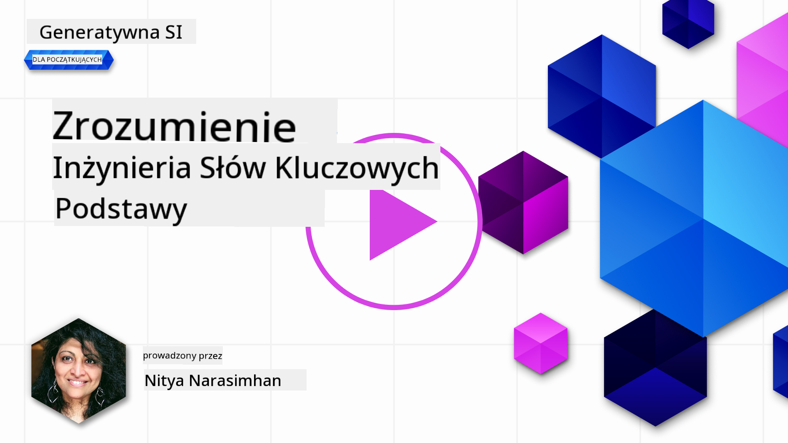
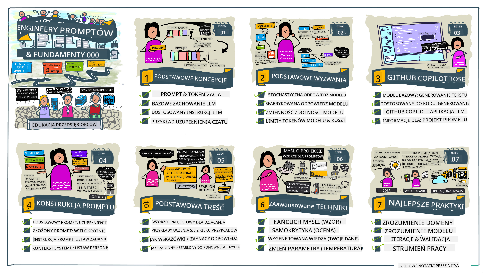
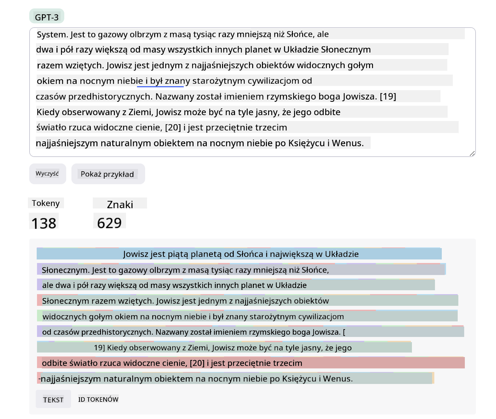
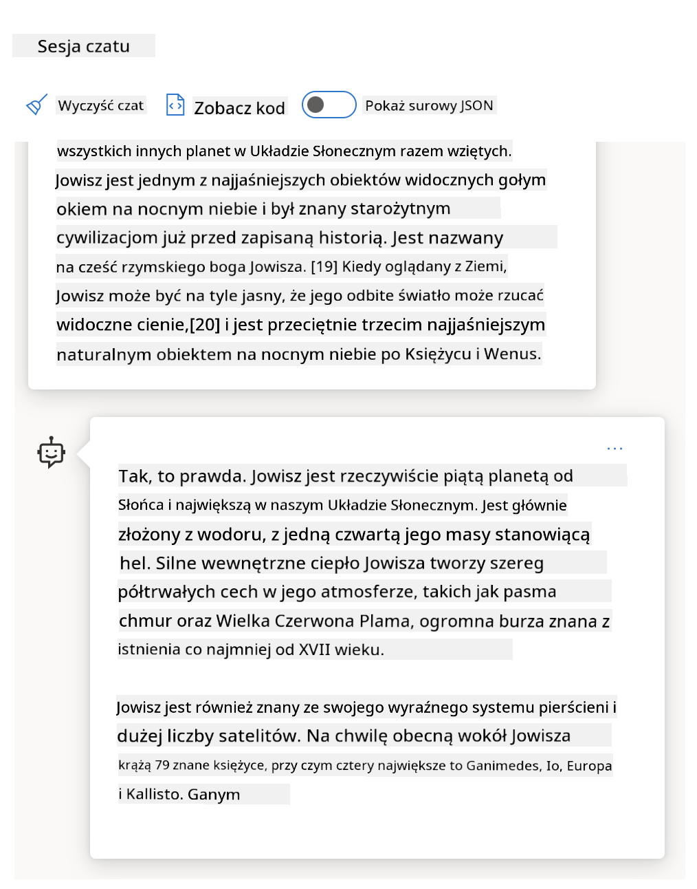
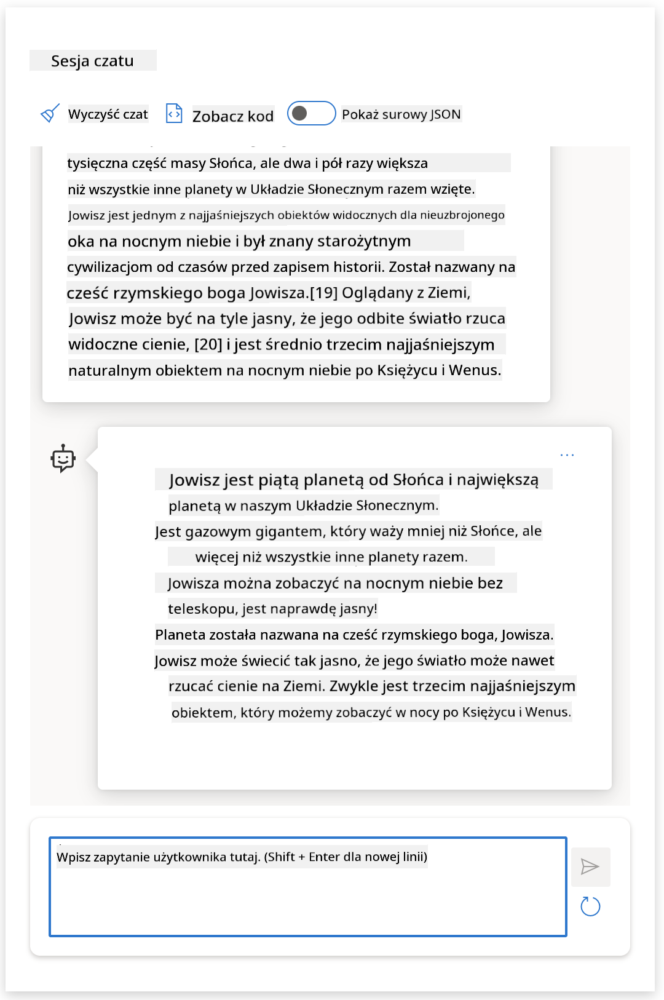
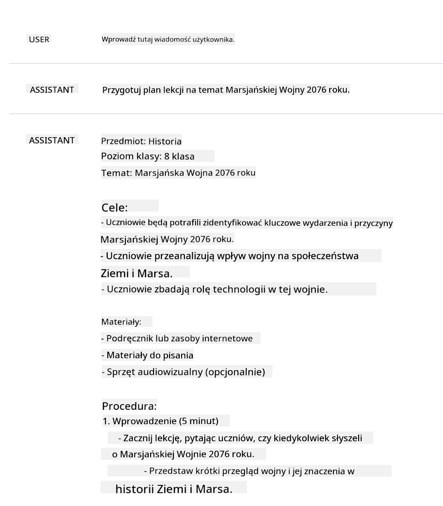
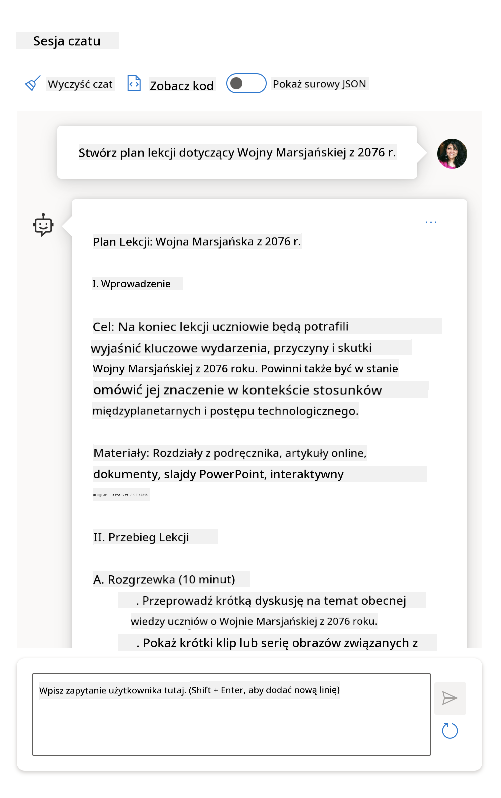
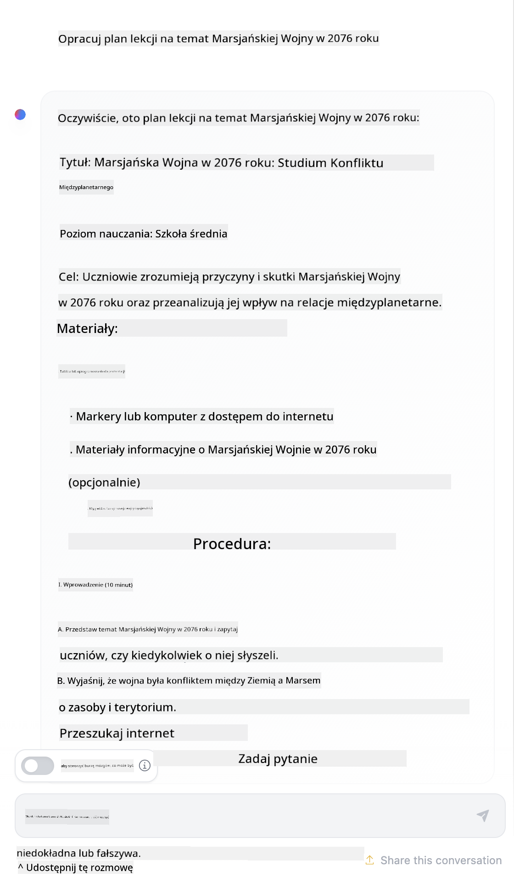

<!--
CO_OP_TRANSLATOR_METADATA:
{
  "original_hash": "a45c318dc6ebc2604f35b8b829f93af2",
  "translation_date": "2025-07-09T10:11:00+00:00",
  "source_file": "04-prompt-engineering-fundamentals/README.md",
  "language_code": "pl"
}
-->
# Podstawy Inżynierii Promptów

[](https://aka.ms/gen-ai-lesson4-gh?WT.mc_id=academic-105485-koreyst)

## Wprowadzenie
Ten moduł obejmuje kluczowe pojęcia i techniki tworzenia skutecznych promptów w modelach generatywnej sztucznej inteligencji. Sposób, w jaki formułujesz prompt do LLM, ma znaczenie. Starannie przygotowany prompt może zapewnić lepszą jakość odpowiedzi. Ale co dokładnie oznaczają terminy takie jak _prompt_ i _inżynieria promptów_? I jak poprawić _wejście_ promptu, które wysyłam do LLM? Na te pytania postaramy się odpowiedzieć w tym i następnym rozdziale.

_Generatywna AI_ potrafi tworzyć nowe treści (np. tekst, obrazy, dźwięk, kod itp.) w odpowiedzi na zapytania użytkownika. Osiąga to dzięki _Dużym Modelom Językowym_ (LLM), takim jak seria GPT firmy OpenAI („Generative Pre-trained Transformer”), które są trenowane do pracy z językiem naturalnym i kodem.

Użytkownicy mogą teraz wchodzić w interakcje z tymi modelami za pomocą znanych paradygmatów, takich jak czat, bez potrzeby posiadania specjalistycznej wiedzy technicznej czy szkolenia. Modele są _oparte na promptach_ – użytkownicy wysyłają tekstowe wejście (prompt) i otrzymują odpowiedź AI (completion). Mogą następnie „rozmawiać z AI” iteracyjnie, w wieloetapowych konwersacjach, dopracowując prompt, aż odpowiedź spełni ich oczekiwania.

„Prompty” stają się teraz głównym _interfejsem programistycznym_ dla aplikacji generatywnej AI, mówiąc modelom, co mają robić i wpływając na jakość zwracanych odpowiedzi. „Inżynieria promptów” to szybko rozwijająca się dziedzina, która koncentruje się na _projektowaniu i optymalizacji_ promptów, aby dostarczać spójne i wysokiej jakości odpowiedzi na dużą skalę.

## Cele nauki

W tej lekcji dowiemy się, czym jest inżynieria promptów, dlaczego jest ważna oraz jak tworzyć skuteczniejsze prompty dla danego modelu i celu aplikacji. Poznamy podstawowe pojęcia i najlepsze praktyki inżynierii promptów – oraz zapoznamy się z interaktywnym środowiskiem Jupyter Notebook „sandbox”, gdzie zobaczymy zastosowanie tych koncepcji na rzeczywistych przykładach.

Pod koniec tej lekcji będziemy potrafili:

1. Wyjaśnić, czym jest inżynieria promptów i dlaczego jest ważna.
2. Opisać składniki promptu i sposób ich użycia.
3. Poznać najlepsze praktyki i techniki inżynierii promptów.
4. Zastosować poznane techniki na rzeczywistych przykładach, korzystając z punktu końcowego OpenAI.

## Kluczowe pojęcia

Inżynieria promptów: Praktyka projektowania i udoskonalania wejść, które kierują modele AI do generowania pożądanych wyników.  
Tokenizacja: Proces zamiany tekstu na mniejsze jednostki, zwane tokenami, które model może zrozumieć i przetworzyć.  
Instruction-Tuned LLMs: Duże modele językowe (LLM), które zostały dostrojone za pomocą konkretnych instrukcji, aby poprawić dokładność i trafność odpowiedzi.

## Środowisko do nauki

Inżynieria promptów to obecnie bardziej sztuka niż nauka. Najlepszym sposobem na rozwinięcie intuicji jest _praktyka_ i podejście metodą prób i błędów, które łączy wiedzę z dziedziny zastosowania z zalecanymi technikami i optymalizacjami specyficznymi dla modelu.

Dołączony do tej lekcji Jupyter Notebook oferuje środowisko _sandbox_, w którym możesz wypróbować to, czego się uczysz – na bieżąco lub jako część wyzwania kodowego na końcu. Aby wykonać ćwiczenia, potrzebujesz:

1. **Klucz API Azure OpenAI** – punkt końcowy usługi dla wdrożonego LLM.  
2. **Środowisko uruchomieniowe Pythona** – w którym można uruchomić Notebook.  
3. **Lokalne zmienne środowiskowe** – _ukończ teraz kroki z [SETUP](./../00-course-setup/SETUP.md?WT.mc_id=academic-105485-koreyst), aby się przygotować_.

Notebook zawiera _początkowe_ ćwiczenia – ale zachęcamy do dodawania własnych sekcji _Markdown_ (opis) i _Code_ (zapytania promptów), aby wypróbować więcej przykładów lub pomysłów – i rozwijać intuicję projektowania promptów.

## Ilustrowany przewodnik

Chcesz zobaczyć ogólny obraz tego, co obejmuje ta lekcja, zanim zaczniesz? Sprawdź ten ilustrowany przewodnik, który przedstawia główne tematy i kluczowe wnioski do przemyślenia w każdym z nich. Mapa lekcji prowadzi od zrozumienia podstawowych pojęć i wyzwań do ich rozwiązania za pomocą odpowiednich technik inżynierii promptów i najlepszych praktyk. Zwróć uwagę, że sekcja „Zaawansowane techniki” w tym przewodniku odnosi się do treści omawianych w _następnym_ rozdziale tego kursu.



## Nasz startup

Porozmawiajmy teraz o tym, jak _ten temat_ wiąże się z misją naszego startupu, który ma na celu [wprowadzenie innowacji AI do edukacji](https://educationblog.microsoft.com/2023/06/collaborating-to-bring-ai-innovation-to-education?WT.mc_id=academic-105485-koreyst). Chcemy tworzyć aplikacje AI wspierające _spersonalizowaną naukę_ – pomyślmy więc, jak różni użytkownicy naszej aplikacji mogą „projektować” prompty:

- **Administratorzy** mogą poprosić AI o _analizę danych programów nauczania w celu zidentyfikowania luk w materiałach_. AI może podsumować wyniki lub zwizualizować je za pomocą kodu.  
- **Nauczyciele** mogą poprosić AI o _wygenerowanie planu lekcji dla określonej grupy odbiorców i tematu_. AI może stworzyć spersonalizowany plan w określonym formacie.  
- **Uczniowie** mogą poprosić AI o _prowadzenie korepetycji z trudnego przedmiotu_. AI może teraz prowadzić uczniów, oferując lekcje, wskazówki i przykłady dostosowane do ich poziomu.

To tylko wierzchołek góry lodowej. Sprawdź [Prompts For Education](https://github.com/microsoft/prompts-for-edu/tree/main?WT.mc_id=academic-105485-koreyst) – otwartą bibliotekę promptów opracowaną przez ekspertów edukacyjnych – aby zobaczyć szersze możliwości! _Spróbuj uruchomić niektóre z tych promptów w sandboxie lub w OpenAI Playground, aby zobaczyć, co się stanie!_

<!--
SZABLON LEKCJI:
Ta jednostka powinna obejmować podstawowe pojęcie nr 1.
Wzmocnij pojęcie przykładami i odniesieniami.

POJĘCIE NR 1:
Inżynieria promptów.
Zdefiniuj je i wyjaśnij, dlaczego jest potrzebne.
-->

## Czym jest inżynieria promptów?

Zaczęliśmy tę lekcję od zdefiniowania **inżynierii promptów** jako procesu _projektowania i optymalizacji_ tekstowych wejść (promptów), aby dostarczać spójne i wysokiej jakości odpowiedzi (completion) dla określonego celu aplikacji i modelu. Możemy to traktować jako proces dwuetapowy:

- _projektowanie_ początkowego promptu dla danego modelu i celu  
- _doprecyzowywanie_ promptu iteracyjnie, aby poprawić jakość odpowiedzi

To z konieczności proces metodą prób i błędów, który wymaga intuicji i wysiłku użytkownika, aby uzyskać optymalne wyniki. Dlaczego jest to ważne? Aby odpowiedzieć na to pytanie, musimy najpierw zrozumieć trzy pojęcia:

- _Tokenizacja_ = jak model „widzi” prompt  
- _Podstawowe LLM_ = jak model bazowy „przetwarza” prompt  
- _Instruction-Tuned LLM_ = jak model może teraz rozumieć „zadania”

### Tokenizacja

LLM widzi prompt jako _ciąg tokenów_, gdzie różne modele (lub wersje modelu) mogą tokenizować ten sam prompt na różne sposoby. Ponieważ LLM są trenowane na tokenach (a nie na surowym tekście), sposób tokenizacji promptu ma bezpośredni wpływ na jakość generowanej odpowiedzi.

Aby zrozumieć, jak działa tokenizacja, wypróbuj narzędzia takie jak [OpenAI Tokenizer](https://platform.openai.com/tokenizer?WT.mc_id=academic-105485-koreyst) pokazane poniżej. Wklej swój prompt – i zobacz, jak jest zamieniany na tokeny, zwracając uwagę na to, jak traktowane są znaki białe i interpunkcja. Zwróć uwagę, że ten przykład pokazuje starszy model LLM (GPT-3) – więc próba z nowszym modelem może dać inny wynik.



### Pojęcie: Modele bazowe

Po tokenizacji promptu, główną funkcją ["Podstawowego LLM"](https://blog.gopenai.com/an-introduction-to-base-and-instruction-tuned-large-language-models-8de102c785a6?WT.mc_id=academic-105485-koreyst) (lub modelu bazowego) jest przewidywanie kolejnego tokena w sekwencji. Ponieważ LLM są trenowane na ogromnych zbiorach tekstów, mają dobre wyczucie statystycznych zależności między tokenami i mogą dokonać tego przewidywania z pewnym prawdopodobieństwem. Należy zauważyć, że nie rozumieją _znaczenia_ słów w promptach czy tokenach; widzą jedynie wzór, który mogą „uzupełnić” kolejnym przewidywaniem. Mogą kontynuować przewidywanie sekwencji aż do przerwania przez użytkownika lub spełnienia określonego warunku.

Chcesz zobaczyć, jak działa uzupełnianie oparte na promptach? Wprowadź powyższy prompt do Azure OpenAI Studio [_Chat Playground_](https://oai.azure.com/playground?WT.mc_id=academic-105485-koreyst) z domyślnymi ustawieniami. System jest skonfigurowany tak, aby traktować prompt jako zapytanie o informacje – więc powinieneś zobaczyć odpowiedź spełniającą ten kontekst.

A co jeśli użytkownik chciałby zobaczyć coś konkretnego, spełniającego określone kryteria lub cel zadania? Wtedy na scenę wchodzą _instruction-tuned_ LLM.



### Pojęcie: Instruction Tuned LLM

[Instruction Tuned LLM](https://blog.gopenai.com/an-introduction-to-base-and-instruction-tuned-large-language-models-8de102c785a6?WT.mc_id=academic-105485-koreyst) zaczyna się od modelu bazowego i jest dostrajany za pomocą przykładów lub par wejście/wyjście (np. wieloetapowych „wiadomości”), które zawierają jasne instrukcje – a odpowiedź AI stara się te instrukcje realizować.

Wykorzystuje to techniki takie jak Reinforcement Learning with Human Feedback (RLHF), które uczą model _podążania za instrukcjami_ i _uczenia się na podstawie informacji zwrotnej_, dzięki czemu generuje odpowiedzi lepiej dopasowane do praktycznych zastosowań i bardziej adekwatne do celów użytkownika.

Wypróbujmy to – wróć do powyższego promptu, ale teraz zmień _wiadomość systemową_, aby zawierała następującą instrukcję jako kontekst:

> _Podsumuj dostarczone treści dla ucznia drugiej klasy. Zachowaj wynik w jednym akapicie z 3-5 punktami._

Zobacz, jak wynik jest teraz dostosowany do pożądanego celu i formatu? Nauczyciel może teraz bezpośrednio wykorzystać tę odpowiedź na swoich slajdach na lekcji.



## Dlaczego potrzebujemy inżynierii promptów?

Teraz, gdy wiemy, jak LLM przetwarzają prompty, porozmawiajmy o _dlaczego_ potrzebujemy inżynierii promptów. Odpowiedź leży w tym, że obecne LLM stawiają szereg wyzwań, które utrudniają _uzyskanie wiarygodnych i spójnych odpowiedzi_ bez wysiłku włożonego w konstrukcję i optymalizację promptów. Na przykład:

1. **Odpowiedzi modelu są stochastyczne.** _Ten sam prompt_ prawdopodobnie wygeneruje różne odpowiedzi w różnych modelach lub wersjach modelu. Może też dawać różne wyniki w _tym samym modelu_ w różnych momentach. _Techniki inżynierii promptów pomagają zminimalizować te różnice, zapewniając lepsze zabezpieczenia_.

1. **Modele mogą tworzyć fałszywe odpowiedzi.** Modele są trenowane na _dużych, ale skończonych_ zbiorach danych, co oznacza, że nie znają pojęć spoza zakresu treningu. W efekcie mogą generować odpowiedzi nieścisłe, wymyślone lub sprzeczne z faktami. _Techniki inżynierii promptów pomagają użytkownikom wykrywać i ograniczać takie fałszywki, np. prosząc AI o podanie źródeł lub uzasadnienia_.

1. **Możliwości modeli będą się różnić.** Nowsze modele lub generacje modeli mają bogatsze możliwości, ale też unikalne cechy i kompromisy w kosztach i złożoności. _Inżynieria promptów pomaga opracować najlepsze praktyki i procesy, które ukrywają różnice i dostosowują się do wymagań specyficznych dla modelu w sposób skalowalny i bezproblemowy_.

Zobaczmy to w praktyce w OpenAI lub Azure OpenAI Playground:

- Użyj tego samego promptu z różnymi wdrożeniami LLM (np. OpenAI, Azure OpenAI, Hugging Face) – czy zauważyłeś różnice?  
- Użyj tego samego promptu wielokrotnie z _tym samym_ wdrożeniem LLM (np. Azure OpenAI playground) – jak różniły się te odpowiedzi?

### Przykład fałszywek

W tym kursie używamy terminu **„fałszywka”** (fabrication) na określenie zjawiska, gdy LLM czasem generują informacje niezgodne z faktami z powodu ograniczeń w treningu lub innych czynników. Możesz też spotkać się z określeniem _„halucynacje”_ w popularnych artykułach lub publikacjach naukowych. Jednak zdecydowanie zalecamy używanie terminu _„fałszywka”_, aby nie antropomorfizować zachowania, przypisując maszynie cechy ludzkie. Wzmacnia to również [wytyczne dotyczące odpowiedzialnej AI](https://www.microsoft.com/ai/responsible-ai?WT.mc_id=academic-105485-koreyst) z perspektywy terminologii, eliminując terminy, które mogą być uznane za obraźliwe lub nieinkluzywne w niektórych kontekstach.

Chcesz zobaczyć, jak działają fałszywki? Pomyśl o promptcie, który instruuje AI, aby wygenerowało treść na temat nieistniejący (aby mieć pewność, że nie znajduje się w zbiorze treningowym). Na przykład – wypróbowałem taki prompt:
# Plan lekcji: Wojna Marsjańska 2076

## Cel lekcji
Poznanie przyczyn, przebiegu oraz skutków Wojny Marsjańskiej 2076, a także zrozumienie jej wpływu na rozwój technologii i stosunki międzyplanetarne.

## Wprowadzenie (10 minut)
- Krótkie omówienie tła historycznego: kolonizacja Marsa i napięcia między Ziemią a Marsjańskimi koloniami.
- Przedstawienie głównych stron konfliktu.

## Główna część (30 minut)
### 1. Przyczyny Wojny Marsjańskiej
- Nierówności ekonomiczne i polityczne między Ziemią a Marsjańskimi koloniami.
- Konflikty o zasoby naturalne.
- Rola korporacji i rządów w eskalacji napięć.

### 2. Przebieg konfliktu
- Najważniejsze bitwy i wydarzenia.
- Technologie wojskowe używane podczas wojny.
- Strategie i taktyki obu stron.

### 3. Skutki wojny
- Zmiany polityczne i społeczne na Marsie i Ziemi.
- Postęp technologiczny wynikający z konfliktu.
- Długoterminowe konsekwencje dla stosunków międzyplanetarnych.

## Podsumowanie (10 minut)
- Dyskusja na temat lekcji wyniesionych z Wojny Marsjańskiej.
- Refleksja nad znaczeniem pokoju i współpracy międzyplanetarnej.

## Zadanie domowe
- Napisz krótki esej na temat: „Jak Wojna Marsjańska 2076 wpłynęła na przyszłość eksploracji kosmosu?”
Wyszukiwanie w sieci pokazało, że istniały fikcyjne relacje (np. seriale telewizyjne lub książki) o wojnach marsjańskich – ale żadnych z roku 2076. Zdrowy rozsądek podpowiada również, że 2076 to _przyszłość_, więc nie może być powiązany z prawdziwym wydarzeniem.

Co się więc dzieje, gdy uruchomimy ten prompt u różnych dostawców LLM?

> **Odpowiedź 1**: OpenAI Playground (GPT-35)



> **Odpowiedź 2**: Azure OpenAI Playground (GPT-35)



> **Odpowiedź 3**: : Hugging Face Chat Playground (LLama-2)



Jak można się było spodziewać, każdy model (lub jego wersja) generuje nieco inne odpowiedzi dzięki losowemu zachowaniu i różnicom w możliwościach modelu. Na przykład jeden model kieruje odpowiedź do uczniów ósmej klasy, podczas gdy inny zakłada odbiorcę na poziomie szkoły średniej. Jednak wszystkie trzy modele wygenerowały odpowiedzi, które mogłyby przekonać nieświadomego użytkownika, że wydarzenie było prawdziwe.

Techniki inżynierii promptów, takie jak _metaprompting_ i _konfiguracja temperatury_, mogą w pewnym stopniu ograniczyć fałszywe informacje generowane przez modele. Nowe _architektury_ inżynierii promptów również bezproblemowo integrują nowe narzędzia i techniki w przepływ promptu, aby złagodzić lub zmniejszyć niektóre z tych efektów.

## Studium przypadku: GitHub Copilot

Zakończmy tę sekcję, przyglądając się, jak inżynieria promptów jest wykorzystywana w rzeczywistych rozwiązaniach, na przykładzie jednego studium przypadku: [GitHub Copilot](https://github.com/features/copilot?WT.mc_id=academic-105485-koreyst).

GitHub Copilot to Twój „AI Pair Programmer” – zamienia tekstowe prompt’y na uzupełnienia kodu i jest zintegrowany z Twoim środowiskiem programistycznym (np. Visual Studio Code), zapewniając płynne doświadczenie użytkownika. Jak udokumentowano w serii poniższych blogów, najwcześniejsza wersja opierała się na modelu OpenAI Codex – a inżynierowie szybko zdali sobie sprawę z potrzeby dostrojenia modelu i opracowania lepszych technik inżynierii promptów, aby poprawić jakość kodu. W lipcu [zaprezentowali ulepszony model AI, który wykracza poza Codex](https://github.blog/2023-07-28-smarter-more-efficient-coding-github-copilot-goes-beyond-codex-with-improved-ai-model/?WT.mc_id=academic-105485-koreyst), oferujący jeszcze szybsze sugestie.

Przeczytaj wpisy w kolejności, aby śledzić ich drogę rozwoju.

- **Maj 2023** | [GitHub Copilot coraz lepiej rozumie Twój kod](https://github.blog/2023-05-17-how-github-copilot-is-getting-better-at-understanding-your-code/?WT.mc_id=academic-105485-koreyst)
- **Maj 2023** | [Od kuchni GitHub: Praca z LLM stojącymi za GitHub Copilot](https://github.blog/2023-05-17-inside-github-working-with-the-llms-behind-github-copilot/?WT.mc_id=academic-105485-koreyst)
- **Cze 2023** | [Jak pisać lepsze prompt’y dla GitHub Copilot](https://github.blog/2023-06-20-how-to-write-better-prompts-for-github-copilot/?WT.mc_id=academic-105485-koreyst)
- **Lip 2023** | [.. GitHub Copilot wykracza poza Codex dzięki ulepszonemu modelowi AI](https://github.blog/2023-07-28-smarter-more-efficient-coding-github-copilot-goes-beyond-codex-with-improved-ai-model/?WT.mc_id=academic-105485-koreyst)
- **Lip 2023** | [Przewodnik programisty po inżynierii promptów i LLM](https://github.blog/2023-07-17-prompt-engineering-guide-generative-ai-llms/?WT.mc_id=academic-105485-koreyst)
- **Wrz 2023** | [Jak zbudować aplikację LLM dla przedsiębiorstw: Lekcje od GitHub Copilot](https://github.blog/2023-09-06-how-to-build-an-enterprise-llm-application-lessons-from-github-copilot/?WT.mc_id=academic-105485-koreyst)

Możesz też przeglądać ich [blog inżynierski](https://github.blog/category/engineering/?WT.mc_id=academic-105485-koreyst) w poszukiwaniu kolejnych wpisów, takich jak [ten](https://github.blog/2023-09-27-how-i-used-github-copilot-chat-to-build-a-reactjs-gallery-prototype/?WT.mc_id=academic-105485-koreyst), który pokazuje, jak te modele i techniki są _stosowane_ do tworzenia rzeczywistych aplikacji.

---

<!--
SZABLON LEKCJI:
Ta jednostka powinna obejmować podstawową koncepcję #2.
Wzmocnij koncepcję przykładami i odniesieniami.

KONCEPCJA #2:
Projektowanie promptów.
Ilustrowane przykładami.
-->

## Budowa promptu

Widzieliśmy, dlaczego inżynieria promptów jest ważna – teraz zrozummy, jak prompt’y są _budowane_, abyśmy mogli ocenić różne techniki dla skuteczniejszego projektowania promptów.

### Podstawowy prompt

Zacznijmy od podstawowego promptu: tekstowego wejścia wysłanego do modelu bez dodatkowego kontekstu. Oto przykład – gdy wysyłamy pierwsze kilka słów hymnu narodowego USA do OpenAI [Completion API](https://platform.openai.com/docs/api-reference/completions?WT.mc_id=academic-105485-koreyst), model natychmiast _uzupełnia_ odpowiedź kolejnymi wersami, ilustrując podstawowe zachowanie predykcyjne.

| Prompt (Wejście)   | Uzupełnienie (Wyjście)                                                                                                                      |
| :----------------- | :----------------------------------------------------------------------------------------------------------------------------------------- |
| Oh say can you see | Wygląda na to, że zaczynasz słowa „The Star-Spangled Banner”, hymnu narodowego Stanów Zjednoczonych. Pełny tekst to ...                    |

### Złożony prompt

Teraz dodajmy kontekst i instrukcje do tego podstawowego promptu. [Chat Completion API](https://learn.microsoft.com/azure/ai-services/openai/how-to/chatgpt?WT.mc_id=academic-105485-koreyst) pozwala nam zbudować złożony prompt jako zbiór _wiadomości_ z:

- parami wejście/wyjście odzwierciedlającymi dane _użytkownika_ i odpowiedź _asystenta_,
- wiadomością systemową ustawiającą kontekst zachowania lub osobowości asystenta.

Żądanie ma teraz poniższą formę, gdzie _tokenizacja_ skutecznie wyłapuje istotne informacje z kontekstu i rozmowy. Zmiana kontekstu systemowego może mieć równie duży wpływ na jakość uzupełnień, co podane dane użytkownika.

```python
response = openai.chat.completions.create(
    model="gpt-3.5-turbo",
    messages=[
        {"role": "system", "content": "You are a helpful assistant."},
        {"role": "user", "content": "Who won the world series in 2020?"},
        {"role": "assistant", "content": "The Los Angeles Dodgers won the World Series in 2020."},
        {"role": "user", "content": "Where was it played?"}
    ]
)
```

### Prompt z instrukcją

W powyższych przykładach prompt użytkownika był prostym zapytaniem tekstowym, które można interpretować jako prośbę o informację. W promptach z _instrukcją_ możemy użyć tego tekstu, aby dokładniej określić zadanie, dając AI lepsze wskazówki. Oto przykład:

| Prompt (Wejście)                                                                                                                                                                                                                         | Uzupełnienie (Wyjście)                                                                                                        | Typ instrukcji      |
| :------------------------------------------------------------------------------------------------------------------------------------------------------------------------------------------------------------------------------------- | :----------------------------------------------------------------------------------------------------------------------------- | :------------------ |
| Napisz opis Wojny Secesyjnej                                                                                                                                                                                                           | _zwrócono prosty akapit_                                                                                                      | Prosty              |
| Napisz opis Wojny Secesyjnej. Podaj kluczowe daty i wydarzenia oraz opisz ich znaczenie                                                                                                                                                 | _zwrócono akapit, a następnie listę kluczowych dat wydarzeń z opisami_                                                        | Złożony             |
| Napisz opis Wojny Secesyjnej w 1 akapicie. Podaj 3 punkty z kluczowymi datami i ich znaczeniem. Podaj 3 kolejne punkty z ważnymi postaciami historycznymi i ich wkładem. Zwróć wynik jako plik JSON | _zwraca bardziej rozbudowane szczegóły w polu tekstowym, sformatowane jako JSON, które można skopiować do pliku i zweryfikować_ | Złożony. Sformatowany.|

## Główna treść

W powyższych przykładach prompt był nadal dość otwarty, pozwalając LLM zdecydować, która część jego wstępnie wytrenowanego zbioru danych jest istotna. W wzorcu projektowym _główna treść_ tekst wejściowy dzielony jest na dwie części:

- instrukcję (akcję),
- odpowiednią treść (która wpływa na akcję).

Oto przykład, gdzie instrukcja brzmi: „podsumuj to w 2 zdaniach”.

| Prompt (Wejście)                                                                                                                                                                                                                                                                                                                                                                                                                                                                                                                                                                                                                                                                                      | Uzupełnienie (Wyjście)                                                                                                                                                                                                                                                                             |
| :-------------------------------------------------------------------------------------------------------------------------------------------------------------------------------------------------------------------------------------------------------------------------------------------------------------------------------------------------------------------------------------------------------------------------------------------------------------------------------------------------------------------------------------------------------------------------------------------------------------------------------------------------------------------------------------------------- | :---------------------------------------------------------------------------------------------------------------------------------------------------------------------------------------------------------------------------------------------------------------------------------------------- |
| Jowisz jest piątą planetą od Słońca i największą w Układzie Słonecznym. To gazowy olbrzym o masie jednej tysięcznej masy Słońca, ale dwukrotnie i pół większej niż wszystkich pozostałych planet Układu Słonecznego razem wziętych. Jowisz jest jednym z najjaśniejszych obiektów widocznych gołym okiem na nocnym niebie i był znany starożytnym cywilizacjom jeszcze przed zapisem historii. Został nazwany na cześć rzymskiego boga Jowisza.[19] Widoczny z Ziemi, Jowisz może być na tyle jasny, że jego odbite światło rzuca widoczne cienie,[20] i jest średnio trzecim najjaśniejszym naturalnym obiektem na nocnym niebie po Księżycu i Wenus. <br/> **Podsumuj to w 2 krótkich zdaniach** | Jowisz, piąta planeta od Słońca, jest największą w Układzie Słonecznym i jednym z najjaśniejszych obiektów na nocnym niebie. Nazwany na cześć rzymskiego boga Jowisza, to gazowy olbrzym o masie dwukrotnie i pół większej niż wszystkich pozostałych planet Układu Słonecznego razem wziętych. |

Segment głównej treści można wykorzystać na różne sposoby, aby uzyskać skuteczniejsze instrukcje:

- **Przykłady** – zamiast mówić modelowi, co ma zrobić za pomocą jawnej instrukcji, podaj mu przykłady, a on sam wywnioskuje wzór.
- **Wskazówki** – po instrukcji dodaj „wskazówkę”, która przygotowuje uzupełnienie, kierując model ku bardziej trafnym odpowiedziom.
- **Szablony** – to powtarzalne „przepisy” na prompt’y z miejscami na zmienne, które można dostosować danymi do konkretnych zastosowań.

Przyjrzyjmy się temu w praktyce.

### Używanie przykładów

To podejście polega na wykorzystaniu głównej treści do „nakarmienia modelu” przykładami pożądanego wyniku dla danej instrukcji i pozwoleniu mu wywnioskować wzór pożądanego wyjścia. W zależności od liczby podanych przykładów możemy mieć zero-shot prompting, one-shot prompting, few-shot prompting itd.

Prompt składa się teraz z trzech elementów:

- opisu zadania,
- kilku przykładów pożądanego wyniku,
- rozpoczęcia nowego przykładu (który staje się niejawnie opisem zadania).

| Typ nauki    | Prompt (Wejście)                                                                                                                                        | Uzupełnienie (Wyjście)         |
| :----------- | :---------------------------------------------------------------------------------------------------------------------------------------------------- | :----------------------------- |
| Zero-shot    | „The Sun is Shining”. Przetłumacz na hiszpański                                                                                                      | „El Sol está brillando”.       |
| One-shot     | „The Sun is Shining” => „El Sol está brillando”. <br> „It's a Cold and Windy Day” =>                                                                 | „Es un día frío y ventoso”.    |
| Few-shot     | The player ran the bases => Baseball <br/> The player hit an ace => Tennis <br/> The player hit a six => Cricket <br/> The player made a slam-dunk => | Basketball                    |
|              |                                                                                                                                                       |                               |

Zauważ, że w zero-shot prompting musieliśmy podać wyraźną instrukcję („Przetłumacz na hiszpański”), ale w przykładzie one-shot jest ona wywnioskowana. Przykład few-shot pokazuje, jak dodanie większej liczby przykładów pozwala modelom na dokładniejsze wnioskowanie bez dodatkowych instrukcji.

### Wskazówki do promptu

Inną techniką wykorzystania głównej treści jest podawanie _wskazówek_ zamiast przykładów. W tym przypadku dajemy modelowi delikatny impuls, _zaczynając_ od fragmentu, który odzwierciedla pożądany format odpowiedzi. Model „łapie wskazówkę” i kontynuuje w tym stylu.

| Liczba wskazówek | Prompt (Wejście)                                                                                                                                                                                                                                                                                                                                                                                                                                               | Uzupełnienie (Wyjście)                                                                                                                                                                                                                                                                                       |
| :---------------- | :----------------------------------------------------------------------------------------------------------------------------------------------------------------------------------------------------------------------------------------------------------------------------------------------------------------------------------------------------------------------------------------------------------------------------------------------------------- | :-------------------------------------------------------------------------------------------------------------------------------------------------------------------------------------------------------------------------------------------------------------------------------------------------------- |
| 0                 | Jowisz jest piątą planetą od Słońca i największą w Układzie Słonecznym. To gazowy olbrzym o masie jednej tysięcznej masy Słońca, ale dwukrotnie i pół większej niż wszystkich pozostałych planet Układu Słonecznego razem wziętych. Jowisz jest jednym z najjaśniejszych obiektów widocznych gołym okiem na nocnym niebie, i był znany starożytnym cywilizacjom jeszcze przed zapisem historii.

**Podsumuj to**                                       | Jowisz jest największą planetą w Układzie Słonecznym i piątą od Słońca. To gazowy olbrzym o masie 1/1000 masy Słońca, ale cięższy niż wszystkie pozostałe planety razem wzięte. Starożytne cywilizacje znały Jowisza od dawna, a planeta jest łatwo widoczna na nocnym niebie. |
| 1              | Jowisz jest piątą planetą od Słońca i największą w Układzie Słonecznym. To gazowy olbrzym o masie jednej tysięcznej masy Słońca, ale dwa i pół razy większej niż wszystkich pozostałych planet razem wziętych. Jowisz jest jednym z najjaśniejszych obiektów widocznych gołym okiem na nocnym niebie i był znany starożytnym cywilizacjom jeszcze przed początkiem zapisanej historii. <br/>**Podsumuj to** <br/> Dowiedzieliśmy się, że Jowisz | jest piątą planetą od Słońca i największą w Układzie Słonecznym. To gazowy olbrzym o masie jednej tysięcznej masy Słońca, ale dwa i pół razy większej niż wszystkich pozostałych planet razem wziętych. Jest łatwo widoczny gołym okiem i znany od czasów starożytnych.                        |
| 2              | Jowisz jest piątą planetą od Słońca i największą w Układzie Słonecznym. To gazowy olbrzym o masie jednej tysięcznej masy Słońca, ale dwa i pół razy większej niż wszystkich pozostałych planet razem wziętych. Jowisz jest jednym z najjaśniejszych obiektów widocznych gołym okiem na nocnym niebie i był znany starożytnym cywilizacjom jeszcze przed początkiem zapisanej historii. <br/>**Podsumuj to** <br/> Top 3 fakty, które poznaliśmy:         | 1. Jowisz jest piątą planetą od Słońca i największą w Układzie Słonecznym. <br/> 2. To gazowy olbrzym o masie jednej tysięcznej masy Słońca...<br/> 3. Jowisz jest widoczny gołym okiem od czasów starożytnych ...                                                                       |
|                |                                                                                                                                                                                                                                                                                                                                                                                                                                                              |                                                                                                                                                                                                                                                                                                           |

### Szablony promptów

Szablon promptu to _zdefiniowany wcześniej przepis na prompt_, który można przechowywać i wykorzystywać wielokrotnie, aby zapewnić bardziej spójne doświadczenia użytkownika na dużą skalę. W najprostszej formie jest to po prostu zbiór przykładów promptów, takich jak [ten od OpenAI](https://platform.openai.com/examples?WT.mc_id=academic-105485-koreyst), który zawiera zarówno interaktywne komponenty promptu (wiadomości użytkownika i systemu), jak i format zapytania API – wspierając ponowne użycie.

W bardziej złożonej formie, jak [ten przykład od LangChain](https://python.langchain.com/docs/concepts/prompt_templates/?WT.mc_id=academic-105485-koreyst), zawiera _placeholdy_, które można zastąpić danymi z różnych źródeł (wejście użytkownika, kontekst systemu, zewnętrzne źródła danych itp.), aby dynamicznie generować prompt. Pozwala to tworzyć bibliotekę wielokrotnego użytku promptów, które mogą programowo zapewniać spójne doświadczenia użytkownika na dużą skalę.

Ostatecznie prawdziwa wartość szablonów polega na możliwości tworzenia i publikowania _bibliotek promptów_ dla konkretnych dziedzin zastosowań – gdzie szablon promptu jest _optymalizowany_ pod kątem kontekstu aplikacji lub przykładów, które sprawiają, że odpowiedzi są bardziej trafne i precyzyjne dla docelowej grupy użytkowników. Repozytorium [Prompts For Edu](https://github.com/microsoft/prompts-for-edu?WT.mc_id=academic-105485-koreyst) jest świetnym przykładem takiego podejścia, gromadząc bibliotekę promptów dla edukacji z naciskiem na kluczowe cele, takie jak planowanie lekcji, projektowanie programów nauczania, tutoring uczniów itp.

## Wspierające treści

Jeśli myślimy o konstrukcji promptu jako o instrukcji (zadaniu) i celu (głównych treściach), to _treści wtórne_ są jak dodatkowy kontekst, który dostarczamy, aby **wpłynąć na wynik w jakiś sposób**. Mogą to być parametry strojenia, instrukcje formatowania, taksonomie tematów itp., które pomagają modelowi _dostosować_ odpowiedź do oczekiwanych celów lub wymagań użytkownika.

Na przykład: Mając katalog kursów z rozbudowanymi metadanymi (nazwa, opis, poziom, tagi metadanych, prowadzący itp.) dla wszystkich dostępnych kursów w programie nauczania:

- możemy zdefiniować instrukcję „podsumuj katalog kursów na semestr jesień 2023”
- możemy użyć głównych treści, aby podać kilka przykładów oczekiwanego wyniku
- możemy użyć treści wtórnych, aby wskazać 5 najważniejszych „tagów” zainteresowania.

Wtedy model może wygenerować podsumowanie w formacie pokazanym przez przykłady – ale jeśli wynik zawiera wiele tagów, może priorytetowo traktować 5 tagów wskazanych w treściach wtórnych.

---

<!--
SZABLON LEKCJI:
Ta jednostka powinna obejmować podstawową koncepcję #1.
Wzmocnij koncepcję przykładami i odniesieniami.

KONCEPCJA #3:
Techniki inżynierii promptów.
Jakie są podstawowe techniki inżynierii promptów?
Zilustruj je kilkoma ćwiczeniami.
-->

## Najlepsze praktyki w promptowaniu

Teraz, gdy wiemy, jak można _konstruować_ prompty, możemy zacząć myśleć o tym, jak je _projektować_, aby odzwierciedlały najlepsze praktyki. Możemy rozważać to w dwóch aspektach – posiadanie odpowiedniego _nastawienia_ i stosowanie właściwych _technik_.

### Nastawienie w inżynierii promptów

Inżynieria promptów to proces metodą prób i błędów, więc miej na uwadze trzy szerokie czynniki przewodnie:

1. **Znajomość dziedziny ma znaczenie.** Dokładność i trafność odpowiedzi zależy od _dziedziny_, w której działa aplikacja lub użytkownik. Wykorzystaj swoją intuicję i wiedzę dziedzinową, aby **dostosować techniki**. Na przykład, definiuj _osobowości specyficzne dla dziedziny_ w promptach systemowych lub używaj _szablonów specyficznych dla dziedziny_ w promptach użytkownika. Dostarczaj treści wtórne odzwierciedlające kontekst dziedzinowy lub stosuj _wskazówki i przykłady specyficzne dla dziedziny_, aby nakierować model na znane wzorce użycia.

2. **Znajomość modelu ma znaczenie.** Wiemy, że modele są z natury stochastyczne. Jednak implementacje modeli mogą się różnić pod względem użytego zbioru treningowego (wiedza wstępna), oferowanych możliwości (np. przez API lub SDK) oraz rodzaju treści, do których są optymalizowane (np. kod, obrazy, tekst). Poznaj mocne i słabe strony używanego modelu i wykorzystaj tę wiedzę, aby _priorytetyzować zadania_ lub tworzyć _dostosowane szablony_ zoptymalizowane pod kątem możliwości modelu.

3. **Iteracja i walidacja mają znaczenie.** Modele szybko się rozwijają, podobnie jak techniki inżynierii promptów. Jako ekspert dziedzinowy możesz mieć dodatkowy kontekst lub kryteria specyficzne dla _Twojej_ aplikacji, które niekoniecznie dotyczą szerszej społeczności. Używaj narzędzi i technik inżynierii promptów, aby „rozpocząć” konstrukcję promptu, a następnie iteruj i weryfikuj wyniki, korzystając z własnej intuicji i wiedzy dziedzinowej. Zapisuj swoje spostrzeżenia i twórz **bazę wiedzy** (np. biblioteki promptów), która może służyć jako nowa podstawa dla innych, przyspieszając kolejne iteracje.

## Najlepsze praktyki

Przyjrzyjmy się teraz powszechnym najlepszym praktykom rekomendowanym przez praktyków z [OpenAI](https://help.openai.com/en/articles/6654000-best-practices-for-prompt-engineering-with-openai-api?WT.mc_id=academic-105485-koreyst) i [Azure OpenAI](https://learn.microsoft.com/azure/ai-services/openai/concepts/prompt-engineering#best-practices?WT.mc_id=academic-105485-koreyst).

| Co                              | Dlaczego                                                                                                                                                                                                                                               |
| :-------------------------------- | :------------------------------------------------------------------------------------------------------------------------------------------------------------------------------------------------------------------------------------------------ |
| Testuj najnowsze modele.       | Nowe generacje modeli prawdopodobnie mają ulepszone funkcje i jakość – ale mogą też generować wyższe koszty. Oceń ich wpływ, a następnie podejmij decyzję o migracji.                                                                                |
| Oddziel instrukcje i kontekst   | Sprawdź, czy Twój model/dostawca definiuje _delimitery_ do wyraźniejszego rozróżnienia instrukcji, treści głównych i wtórnych. To pomaga modelom dokładniej przypisywać wagi do tokenów.                                                         |
| Bądź konkretny i jasny             | Podaj więcej szczegółów dotyczących oczekiwanego kontekstu, rezultatu, długości, formatu, stylu itp. To poprawi zarówno jakość, jak i spójność odpowiedzi. Zapisuj przepisy w wielokrotnego użytku szablonach.                                                          |
| Bądź opisowy, używaj przykładów      | Modele mogą lepiej reagować na podejście „pokaż i opowiedz”. Zacznij od podejścia `zero-shot`, gdzie dajesz instrukcję (bez przykładów), a następnie spróbuj `few-shot` jako doprecyzowanie, podając kilka przykładów oczekiwanego wyniku. Używaj analogii. |
| Używaj wskazówek do rozpoczęcia odpowiedzi | Nakieruj model na oczekiwany rezultat, podając kilka początkowych słów lub fraz, które może wykorzystać jako punkt startowy odpowiedzi.                                                                                                               |
| Powtarzaj (Double Down)                       | Czasem trzeba powtórzyć instrukcje modelowi. Podawaj instrukcje przed i po treści głównej, używaj instrukcji i wskazówek itd. Iteruj i weryfikuj, co działa najlepiej.                                                         |
| Kolejność ma znaczenie                     | Kolejność prezentowania informacji modelowi może wpływać na wynik, nawet w przykładach uczących, ze względu na efekt świeżości. Wypróbuj różne opcje, aby zobaczyć, co działa najlepiej.                                                               |
| Daj modelowi „wyjście awaryjne”           | Zapewnij modelowi _alternatywną_ odpowiedź, którą może zwrócić, jeśli z jakiegoś powodu nie jest w stanie wykonać zadania. To zmniejsza ryzyko generowania fałszywych lub wymyślonych odpowiedzi.                                                         |
|                                   |                                                                                                                                                                                                                                                   |

Jak w przypadku każdej najlepszej praktyki, pamiętaj, że _Twoje doświadczenia mogą się różnić_ w zależności od modelu, zadania i dziedziny. Traktuj je jako punkt wyjścia i iteruj, aby znaleźć to, co działa najlepiej dla Ciebie. Nieustannie oceniaj proces inżynierii promptów, gdy pojawiają się nowe modele i narzędzia, koncentrując się na skalowalności procesu i jakości odpowiedzi.

<!--
SZABLON LEKCJI:
Ta jednostka powinna zawierać wyzwanie kodowe, jeśli to możliwe

WYZWANIE:
Link do Jupyter Notebook z samymi komentarzami w instrukcjach (sekcje kodu są puste).

ROZWIĄZANIE:
Link do kopii tego Notebooka z wypełnionymi promptami i uruchomionym kodem, pokazującym jeden przykładowy wynik.
-->

## Zadanie

Gratulacje! Dotarłeś do końca lekcji! Czas przetestować niektóre z poznanych koncepcji i technik na prawdziwych przykładach!

Do zadania użyjemy Jupyter Notebook z ćwiczeniami, które możesz wykonywać interaktywnie. Możesz też rozszerzyć Notebook o własne komórki Markdown i kodu, aby samodzielnie eksplorować pomysły i techniki.

### Aby zacząć, zrób fork repozytorium, a następnie

- (Zalecane) Uruchom GitHub Codespaces
- (Alternatywnie) Sklonuj repozytorium na lokalne urządzenie i użyj go z Docker Desktop
- (Alternatywnie) Otwórz Notebook w preferowanym środowisku uruchomieniowym Notebooków.

### Następnie skonfiguruj zmienne środowiskowe

- Skopiuj plik `.env.copy` z katalogu głównego repozytorium do `.env` i uzupełnij wartości `AZURE_OPENAI_API_KEY`, `AZURE_OPENAI_ENDPOINT` oraz `AZURE_OPENAI_DEPLOYMENT`. Wróć do sekcji [Learning Sandbox](../../../04-prompt-engineering-fundamentals/04-prompt-engineering-fundamentals), aby dowiedzieć się jak.

### Następnie otwórz Jupyter Notebook

- Wybierz kernel środowiska uruchomieniowego. Jeśli korzystasz z opcji 1 lub 2, po prostu wybierz domyślny kernel Python 3.10.x dostarczany przez kontener deweloperski.

Jesteś gotowy do uruchamiania ćwiczeń. Pamiętaj, że nie ma tu _dobrych i złych_ odpowiedzi – chodzi o eksplorację opcji metodą prób i błędów oraz budowanie intuicji, co działa dla danego modelu i dziedziny zastosowania.

_Z tego powodu w tej lekcji nie ma segmentów z rozwiązaniami kodu. Zamiast tego w Notebooku znajdziesz komórki Markdown zatytułowane „Moje rozwiązanie:”, które pokazują jeden przykładowy wynik do odniesienia._

 <!--
SZABLON LEKCJI:
Podsumuj sekcję i podaj zasoby do samodzielnej nauki.
-->

## Sprawdzenie wiedzy

Który z poniższych promptów jest dobry i spełnia rozsądne najlepsze praktyki?

1. Pokaż mi obraz czerwonego samochodu  
2. Pokaż mi obraz czerwonego samochodu marki Volvo, model XC90, zaparkowanego na klifie podczas zachodu słońca  
3. Pokaż mi obraz czerwonego samochodu marki Volvo, model XC90

Odp.: 2, to najlepszy prompt, ponieważ podaje szczegóły „co” i wchodzi w konkret (nie tylko dowolny samochód, ale konkretną markę i model) oraz opisuje ogólne otoczenie. 3 jest kolejnym najlepszym, bo też zawiera dużo opisu.

## 🚀 Wyzwanie

Sprawdź, czy potrafisz wykorzystać technikę „wskazówki” z promptem: Uzupełnij zdanie „Pokaż mi obraz czerwonego samochodu marki Volvo i …”. Jaką odpowiedź otrzymujesz i jak byś ją ulepszył?

## Świetna robota! Kontynuuj naukę

Chcesz dowiedzieć się więcej o różnych koncepcjach inżynierii promptów? Przejdź do [strony z dalszą nauką](https://aka.ms/genai-collection?WT.mc_id=academic-105485-koreyst), gdzie znajdziesz inne świetne materiały na ten temat.

Przejdź do Lekcji 5, gdzie omówimy [zaawansowane techniki promptowania](../05-advanced-prompts/README.md?WT.mc_id=academic-105485-koreyst)!

**Zastrzeżenie**:  
Niniejszy dokument został przetłumaczony za pomocą usługi tłumaczenia AI [Co-op Translator](https://github.com/Azure/co-op-translator). Mimo że dążymy do jak największej dokładności, prosimy mieć na uwadze, że tłumaczenia automatyczne mogą zawierać błędy lub nieścisłości. Oryginalny dokument w języku źródłowym powinien być uznawany za źródło autorytatywne. W przypadku informacji o kluczowym znaczeniu zalecane jest skorzystanie z profesjonalnego tłumaczenia wykonanego przez człowieka. Nie ponosimy odpowiedzialności za jakiekolwiek nieporozumienia lub błędne interpretacje wynikające z korzystania z tego tłumaczenia.