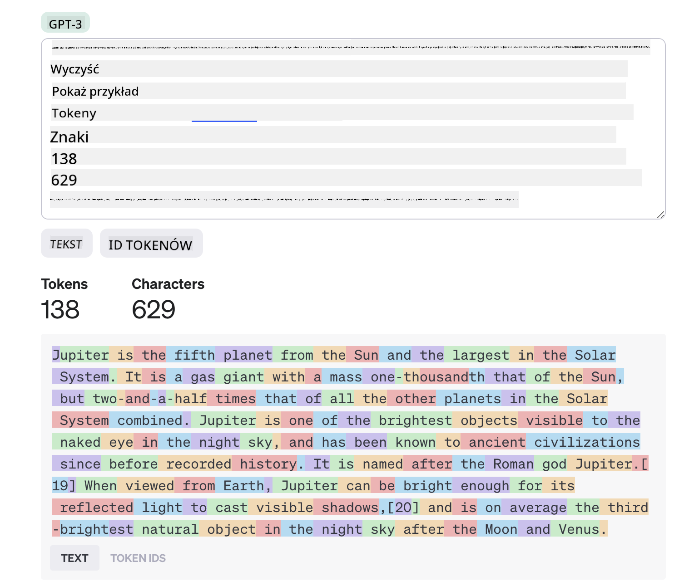
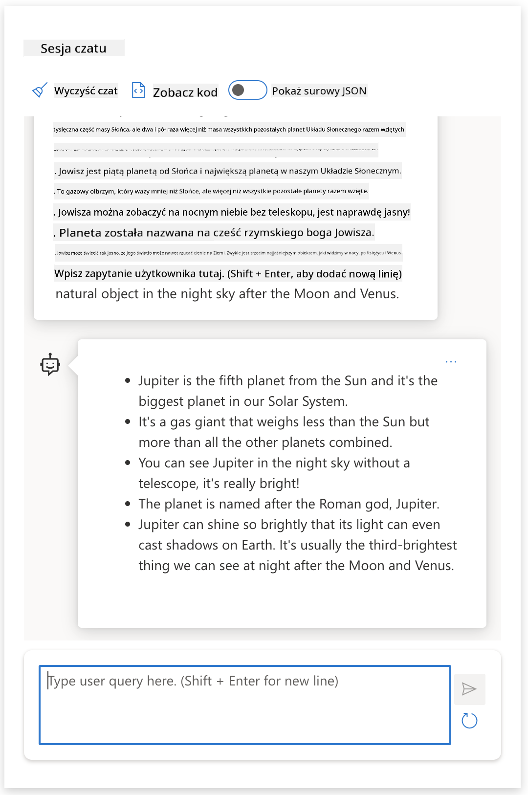

<!--
CO_OP_TRANSLATOR_METADATA:
{
  "original_hash": "8b3cb38518cf4fe7714d2f5e74dfa3eb",
  "translation_date": "2025-10-03T09:20:08+00:00",
  "source_file": "04-prompt-engineering-fundamentals/README.md",
  "language_code": "pl"
}
-->
# Podstawy Inżynierii Promptów

[](https://aka.ms/gen-ai-lesson4-gh?WT.mc_id=academic-105485-koreyst)

## Wprowadzenie
Ten moduł obejmuje kluczowe koncepcje i techniki tworzenia skutecznych promptów dla modeli generatywnej sztucznej inteligencji. Sposób, w jaki piszesz swój prompt do LLM, ma znaczenie. Starannie skonstruowany prompt może zapewnić lepszą jakość odpowiedzi. Ale co dokładnie oznaczają terminy takie jak _prompt_ i _inżynieria promptów_? Jak mogę poprawić dane wejściowe _promptu_, które wysyłam do LLM? Na te pytania spróbujemy odpowiedzieć w tym rozdziale i następnym.

_Generatywna sztuczna inteligencja_ potrafi tworzyć nowe treści (np. teksty, obrazy, dźwięki, kod itp.) w odpowiedzi na zapytania użytkowników. Osiąga to dzięki _Large Language Models_ (LLM), takich jak seria GPT ("Generative Pre-trained Transformer") od OpenAI, które są trenowane do pracy z językiem naturalnym i kodem.

Użytkownicy mogą teraz wchodzić w interakcje z tymi modelami za pomocą znanych paradygmatów, takich jak czat, bez potrzeby posiadania wiedzy technicznej czy szkolenia. Modele są _oparte na promptach_ - użytkownicy wysyłają tekstowe dane wejściowe (prompt) i otrzymują odpowiedź AI (completion). Mogą następnie "rozmawiać z AI" iteracyjnie, w wieloetapowych konwersacjach, dopracowując swój prompt, aż odpowiedź spełni ich oczekiwania.

"Prompty" stają się teraz głównym _interfejsem programistycznym_ dla aplikacji generatywnej AI, określając, co modele mają robić i wpływając na jakość zwracanych odpowiedzi. "Inżynieria promptów" to szybko rozwijająca się dziedzina badań, która koncentruje się na _projektowaniu i optymalizacji_ promptów w celu uzyskania spójnych i wysokiej jakości odpowiedzi na dużą skalę.

## Cele nauki

W tej lekcji dowiemy się, czym jest inżynieria promptów, dlaczego jest ważna i jak możemy tworzyć bardziej skuteczne prompty dla danego modelu i celu aplikacji. Zrozumiemy podstawowe koncepcje i najlepsze praktyki w zakresie inżynierii promptów - oraz poznamy interaktywne środowisko "sandbox" w Jupyter Notebooks, gdzie możemy zastosować te koncepcje na rzeczywistych przykładach.

Pod koniec tej lekcji będziemy w stanie:

1. Wyjaśnić, czym jest inżynieria promptów i dlaczego jest ważna.
2. Opisać elementy promptu i sposób ich wykorzystania.
3. Poznać najlepsze praktyki i techniki inżynierii promptów.
4. Zastosować poznane techniki na rzeczywistych przykładach, korzystając z punktu końcowego OpenAI.

## Kluczowe terminy

Inżynieria promptów: Praktyka projektowania i udoskonalania danych wejściowych w celu ukierunkowania modeli AI na generowanie pożądanych wyników.  
Tokenizacja: Proces konwersji tekstu na mniejsze jednostki, zwane tokenami, które model może zrozumieć i przetworzyć.  
LLM dostrojone do instrukcji: Duże modele językowe (LLM), które zostały dostrojone za pomocą konkretnych instrukcji w celu poprawy dokładności i trafności odpowiedzi.

## Åšrodowisko nauki

Inżynieria promptów jest obecnie bardziej sztuką niż nauką. Najlepszym sposobem na poprawę intuicji w tym zakresie jest _praktyka_ i podejście prób i błędów, które łączy wiedzę z dziedziny aplikacji z zalecanymi technikami i optymalizacjami specyficznymi dla modelu.

Notebook Jupyter towarzyszący tej lekcji zapewnia środowisko _sandbox_, w którym możesz wypróbować to, czego się uczysz - na bieżąco lub w ramach wyzwania kodowego na końcu. Aby wykonać ćwiczenia, będziesz potrzebować:

1. **Klucza API Azure OpenAI** - punktu końcowego dla wdrożonego LLM.  
2. **Środowiska uruchomieniowego Python** - w którym można uruchomić Notebook.  
3. **Lokalnych zmiennych środowiskowych** - _ukończ kroki [SETUP](./../00-course-setup/02-setup-local.md?WT.mc_id=academic-105485-koreyst), aby się przygotować_.  

Notebook zawiera ćwiczenia _startowe_ - ale zachęcamy do dodawania własnych sekcji _Markdown_ (opis) i _Code_ (żądania promptów), aby wypróbować więcej przykładów lub pomysłów - i zbudować intuicję w zakresie projektowania promptów.

## Przewodnik ilustrowany

Chcesz zrozumieć ogólny obraz tego, co obejmuje ta lekcja, zanim zagłębisz się w szczegóły? Sprawdź ten przewodnik ilustrowany, który daje wyobrażenie o głównych tematach i kluczowych wnioskach, które warto przemyśleć w każdym z nich. Plan lekcji prowadzi od zrozumienia podstawowych koncepcji i wyzwań do ich rozwiązania za pomocą odpowiednich technik inżynierii promptów i najlepszych praktyk. Zauważ, że sekcja "Zaawansowane techniki" w tym przewodniku odnosi się do treści omówionych w _następnym_ rozdziale tego programu nauczania.


## Nasz startup

Porozmawiajmy teraz o tym, jak _ten temat_ odnosi się do naszej misji startupu, aby [wprowadzać innowacje AI do edukacji](https://educationblog.microsoft.com/2023/06/collaborating-to-bring-ai-innovation-to-education?WT.mc_id=academic-105485-koreyst). Chcemy budować aplikacje wspierane przez AI dla _spersonalizowanego uczenia się_ - więc zastanówmy się, jak różni użytkownicy naszej aplikacji mogą "projektować" prompty:

- **Administratorzy** mogą poprosić AI o _analizę danych programowych w celu zidentyfikowania luk w pokryciu_. AI może podsumować wyniki lub zwizualizować je za pomocą kodu.  
- **Nauczyciele** mogą poprosić AI o _stworzenie planu lekcji dla określonej grupy docelowej i tematu_. AI może zbudować spersonalizowany plan w określonym formacie.  
- **Uczniowie** mogą poprosić AI o _pomoc w trudnym przedmiocie_. AI może teraz prowadzić uczniów za pomocą lekcji, wskazówek i przykładów dostosowanych do ich poziomu.  

To tylko wierzchołek góry lodowej. Sprawdź [Prompty dla edukacji](https://github.com/microsoft/prompts-for-edu/tree/main?WT.mc_id=academic-105485-koreyst) - otwartą bibliotekę promptów, kuratorowaną przez ekspertów edukacyjnych - aby uzyskać szersze wyobrażenie o możliwościach! _Spróbuj uruchomić niektóre z tych promptów w sandboxie lub w OpenAI Playground, aby zobaczyć, co się stanie!_

<!--
SZABLON LEKCJI:
Ta jednostka powinna obejmować podstawową koncepcję #1.
Wzmocnij koncepcję za pomocą przykładów i odniesień.

KONCEPCJA #1:
Inżynieria promptów.
Zdefiniuj ją i wyjaśnij, dlaczego jest potrzebna.
-->

## Czym jest inżynieria promptów?

Rozpoczęliśmy tę lekcję od zdefiniowania **inżynierii promptów** jako procesu _projektowania i optymalizacji_ danych wejściowych tekstowych (promptów) w celu uzyskania spójnych i wysokiej jakości odpowiedzi (completions) dla danego celu aplikacji i modelu. Możemy myśleć o tym jako o procesie 2-etapowym:

- _projektowanie_ poczÄ…tkowego promptu dla danego modelu i celu  
- _udoskonalanie_ promptu iteracyjnie w celu poprawy jakości odpowiedzi  

Jest to koniecznie proces prób i błędów, który wymaga intuicji użytkownika i wysiłku, aby uzyskać optymalne wyniki. Dlaczego więc jest to ważne? Aby odpowiedzieć na to pytanie, musimy najpierw zrozumieć trzy koncepcje:

- _Tokenizacja_ = jak model "widzi" prompt  
- _Podstawowe LLM_ = jak model bazowy "przetwarza" prompt  
- _LLM dostrojone do instrukcji_ = jak model może teraz widzieć "zadania"  

### Tokenizacja

LLM widzi prompty jako _sekwencję tokenów_, gdzie różne modele (lub wersje modelu) mogą tokenizować ten sam prompt w różny sposób. Ponieważ LLM są trenowane na tokenach (a nie na surowym tekście), sposób, w jaki prompty są tokenizowane, ma bezpośredni wpływ na jakość generowanej odpowiedzi.

Aby zrozumieć, jak działa tokenizacja, wypróbuj narzędzia takie jak [OpenAI Tokenizer](https://platform.openai.com/tokenizer?WT.mc_id=academic-105485-koreyst) pokazane poniżej. Skopiuj swój prompt - i zobacz, jak zostaje przekształcony w tokeny, zwracając uwagę na sposób obsługi znaków odstępu i znaków interpunkcyjnych. Zauważ, że ten przykład pokazuje starszy LLM (GPT-3) - więc wypróbowanie tego z nowszym modelem może dać inny wynik.



### Koncepcja: Modele bazowe

Po tokenizacji promptu główną funkcją ["Podstawowego LLM"](https://blog.gopenai.com/an-introduction-to-base-and-instruction-tuned-large-language-models-8de102c785a6?WT.mc_id=academic-105485-koreyst) (lub modelu bazowego) jest przewidywanie tokenu w tej sekwencji. Ponieważ LLM są trenowane na ogromnych zbiorach danych tekstowych, mają dobre wyczucie statystycznych relacji między tokenami i mogą dokonać tego przewidywania z pewnym stopniem pewności. Zauważ, że nie rozumieją _znaczenia_ słów w promptach czy tokenach; widzą jedynie wzór, który mogą "uzupełnić" swoim kolejnym przewidywaniem. Mogą kontynuować przewidywanie sekwencji, aż zostaną zatrzymane przez interwencję użytkownika lub jakiś wcześniej ustalony warunek.

Chcesz zobaczyć, jak działa uzupełnianie oparte na promptach? Wprowadź powyższy prompt do [_Chat Playground_](https://oai.azure.com/playground?WT.mc_id=academic-105485-koreyst) w Azure OpenAI Studio z domyślnymi ustawieniami. System jest skonfigurowany tak, aby traktować prompty jako zapytania o informacje - więc powinieneś zobaczyć uzupełnienie, które spełnia ten kontekst.

Ale co, jeśli użytkownik chciałby zobaczyć coś konkretnego, co spełnia określone kryteria lub cel zadania? Tutaj wkraczają _LLM dostrojone do instrukcji_.


### Koncepcja: LLM dostrojone do instrukcji

[LLM dostrojony do instrukcji](https://blog.gopenai.com/an-introduction-to-base-and-instruction-tuned-large-language-models-8de102c785a6?WT.mc_id=academic-105485-koreyst) zaczyna się od modelu bazowego i dostraja go za pomocą przykładów lub par wejście/wyjście (np. wieloetapowych "wiadomości"), które mogą zawierać jasne instrukcje - a odpowiedź AI próbuje podążać za tą instrukcją.

Wykorzystuje to techniki takie jak Reinforcement Learning with Human Feedback (RLHF), które mogą trenować model do _podążania za instrukcjami_ i _uczenia się na podstawie opinii_, aby generował odpowiedzi lepiej dostosowane do praktycznych zastosowań i bardziej trafne dla celów użytkownika.

Spróbujmy - wróć do powyższego promptu, ale teraz zmień _wiadomość systemową_, aby dostarczyć następującą instrukcję jako kontekst:

> _Podsumuj treść, którą otrzymasz, dla ucznia drugiej klasy. Utrzymaj wynik w jednym akapicie z 3-5 punktami wypunktowanymi._

Zobacz, jak wynik jest teraz dostrojony, aby odzwierciedlać pożądany cel i format? Nauczyciel może teraz bezpośrednio wykorzystać tę odpowiedź w swoich slajdach dla tej klasy.



## Dlaczego potrzebujemy inżynierii promptów?

Teraz, gdy wiemy, jak prompty są przetwarzane przez LLM, porozmawiajmy o _dlaczego_ potrzebujemy inżynierii promptów. Odpowiedź leży w fakcie, że obecne LLM stawiają szereg wyzwań, które sprawiają, że _wiarygodne i spójne uzupełnienia_ są trudniejsze do osiągnięcia bez wysiłku włożonego w konstrukcję i optymalizację promptów. Na przykład:

1. **Odpowiedzi modeli są stochastyczne.** _Ten sam prompt_ prawdopodobnie wygeneruje różne odpowiedzi w różnych modelach lub wersjach modeli. Może również wygenerować różne wyniki w _tym samym modelu_ w różnych momentach. _Techniki inżynierii promptów mogą pomóc nam zminimalizować te wariacje, zapewniając lepsze zabezpieczenia_.  

1. **Modele mogą fabrykować odpowiedzi.** Modele są wstępnie trenowane na _dużych, ale skończonych_ zbiorach danych, co oznacza, że nie mają wiedzy na temat pojęć poza zakresem tego treningu. W rezultacie mogą generować uzupełnienia, które są nieścisłe, wymyślone lub bezpośrednio sprzeczne z znanymi faktami. _Techniki inżynierii promptów pomagają użytkownikom identyfikować i łagodzić takie fabrykacje, np. prosząc AI o cytaty lub uzasadnienia_.  

1. **Zdolności modeli będą się różnić.** Nowsze modele lub generacje modeli będą miały bogatsze możliwości, ale także wprowadzą unikalne dziwactwa i kompromisy w kosztach i złożoności. _Inżynieria promptów może pomóc nam opracować najlepsze praktyki i przepływy pracy, które abstrahują różnice i dostosowują się do wymagań specyficznych dla modelu w skalowalny, płynny sposób_.  

Zobaczmy to w akcji w OpenAI lub Azure OpenAI Playground:

- Użyj tego samego promptu z różnymi wdrożeniami LLM (np. OpenAI, Azure OpenAI, Hugging Face) - czy zauważyłeś różnice?  
- Użyj tego samego promptu wielokrotnie w _tym samym_ wdrożeniu LLM (np. Azure OpenAI Playground) - jak różniły się te wariacje?  

### Przykład fabrykacji

W tym kursie używamy terminu **"fabrykacja"**, aby odnieść się do zjawiska, w którym LLM czasami generują informacje niezgodne z faktami z powodu ograniczeń w ich treningu lub innych ograniczeń. Możesz również spotkać się z określeniem _"halucynacje"_ w popularnych artykułach lub pracach naukowych. Jednak zdecydowanie zalecamy używanie terminu _"fabrykacja"_, aby nie przypisywać zachowaniu cechy ludzkiej, która mogłaby sugerować antropomorfizację wyniku generowanego przez maszynę. Wzmacnia to również [wytyczne dotyczące odpowiedzialnej AI](https://www.microsoft.com/ai/responsible-ai?WT.mc_id=academic-105485-koreyst) z perspektywy terminologii, eliminując terminy, które mogą być uznane za obraźliwe lub nieinkluzywne w niektórych kontekstach.

Chcesz zrozumieć, jak działają fabrykacje? Pomyśl o promptcie, który instruuje AI, aby wygenerowało treść na temat nieistniejącego zagadnienia (aby upewnić się, że nie znajduje się ono w zbiorze danych treningowych
Wyszukiwanie w internecie pokazało, że istnieją fikcyjne opowieści (np. seriale telewizyjne lub książki) o wojnach na Marsie – ale żadna z nich nie dotyczy roku 2076. Zdrowy rozsądek podpowiada również, że rok 2076 jest _przyszłością_ i nie może być związany z rzeczywistym wydarzeniem.

Co się dzieje, gdy uruchamiamy ten prompt z różnymi dostawcami LLM?

> **Odpowiedź 1**: OpenAI Playground (GPT-35)


> **Odpowiedź 2**: Azure OpenAI Playground (GPT-35)


> **Odpowiedź 3**: Hugging Face Chat Playground (LLama-2)


Zgodnie z oczekiwaniami, każdy model (lub wersja modelu) generuje nieco inne odpowiedzi dzięki stochastycznemu zachowaniu i różnicom w możliwościach modelu. Na przykład jeden model celuje w odbiorców na poziomie ósmej klasy, podczas gdy drugi zakłada poziom ucznia szkoły średniej. Jednak wszystkie trzy modele wygenerowały odpowiedzi, które mogłyby przekonać nieświadomego użytkownika, że wydarzenie było prawdziwe.

Techniki inżynierii promptów, takie jak _metaprompting_ i _konfiguracja temperatury_, mogą w pewnym stopniu zmniejszyć fabrykacje modelu. Nowe _architektury_ inżynierii promptów również płynnie integrują nowe narzędzia i techniki w przepływie promptów, aby ograniczyć lub zmniejszyć niektóre z tych efektów.

## Studium przypadku: GitHub Copilot

Zakończmy tę sekcję, uzyskując wgląd w to, jak inżynieria promptów jest wykorzystywana w rzeczywistych rozwiązaniach, przyglądając się jednemu studium przypadku: [GitHub Copilot](https://github.com/features/copilot?WT.mc_id=academic-105485-koreyst).

GitHub Copilot to Twój "AI Pair Programmer" – przekształca tekstowe prompty w uzupełnienia kodu i jest zintegrowany z Twoim środowiskiem programistycznym (np. Visual Studio Code) dla płynnego doświadczenia użytkownika. Jak udokumentowano w serii poniższych blogów, najwcześniejsza wersja była oparta na modelu OpenAI Codex – inżynierowie szybko zdali sobie sprawę z potrzeby dostrajania modelu i opracowania lepszych technik inżynierii promptów, aby poprawić jakość kodu. W lipcu [zaprezentowali ulepszony model AI, który wykracza poza Codex](https://github.blog/2023-07-28-smarter-more-efficient-coding-github-copilot-goes-beyond-codex-with-improved-ai-model/?WT.mc_id=academic-105485-koreyst) dla jeszcze szybszych sugestii.

Przeczytaj posty w kolejności, aby śledzić ich proces nauki.

- **Maj 2023** | [GitHub Copilot coraz lepiej rozumie Twój kod](https://github.blog/2023-05-17-how-github-copilot-is-getting-better-at-understanding-your-code/?WT.mc_id=academic-105485-koreyst)
- **Maj 2023** | [WewnÄ…trz GitHub: Praca z LLM-ami za GitHub Copilot](https://github.blog/2023-05-17-inside-github-working-with-the-llms-behind-github-copilot/?WT.mc_id=academic-105485-koreyst).
- **Czerwiec 2023** | [Jak pisać lepsze prompty dla GitHub Copilot](https://github.blog/2023-06-20-how-to-write-better-prompts-for-github-copilot/?WT.mc_id=academic-105485-koreyst).
- **Lipiec 2023** | [.. GitHub Copilot wykracza poza Codex dzięki ulepszonemu modelowi AI](https://github.blog/2023-07-28-smarter-more-efficient-coding-github-copilot-goes-beyond-codex-with-improved-ai-model/?WT.mc_id=academic-105485-koreyst)
- **Lipiec 2023** | [Przewodnik dla programistów po inżynierii promptów i LLM-ach](https://github.blog/2023-07-17-prompt-engineering-guide-generative-ai-llms/?WT.mc_id=academic-105485-koreyst)
- **Wrzesień 2023** | [Jak zbudować aplikację LLM dla przedsiębiorstw: Lekcje z GitHub Copilot](https://github.blog/2023-09-06-how-to-build-an-enterprise-llm-application-lessons-from-github-copilot/?WT.mc_id=academic-105485-koreyst)

Możesz również przeglądać ich [blog inżynieryjny](https://github.blog/category/engineering/?WT.mc_id=academic-105485-koreyst) dla większej liczby postów, takich jak [ten](https://github.blog/2023-09-27-how-i-used-github-copilot-chat-to-build-a-reactjs-gallery-prototype/?WT.mc_id=academic-105485-koreyst), który pokazuje, jak te modele i techniki są _stosowane_ w celu napędzania rzeczywistych aplikacji.

---

## Konstrukcja promptów

Zobaczyliśmy, dlaczego inżynieria promptów jest ważna – teraz zrozummy, jak prompty są _konstruowane_, abyśmy mogli ocenić różne techniki dla bardziej efektywnego projektowania promptów.

### Podstawowy prompt

Zacznijmy od podstawowego promptu: tekstowego wejścia wysyłanego do modelu bez dodatkowego kontekstu. Oto przykład – gdy wysyłamy pierwsze słowa hymnu narodowego USA do OpenAI [Completion API](https://platform.openai.com/docs/api-reference/completions?WT.mc_id=academic-105485-koreyst), natychmiast _uzupełnia_ odpowiedź kolejnymi liniami, ilustrując podstawowe zachowanie predykcyjne.

| Prompt (Wejście) | Completion (Wyjście)                                                                                                                        |
| :--------------- | :----------------------------------------------------------------------------------------------------------------------------------------- |
| Oh say can you see | Wygląda na to, że zaczynasz tekst "The Star-Spangled Banner", hymnu narodowego Stanów Zjednoczonych. Pełny tekst to ... |

### Złożony prompt

Teraz dodajmy kontekst i instrukcje do tego podstawowego promptu. [Chat Completion API](https://learn.microsoft.com/azure/ai-services/openai/how-to/chatgpt?WT.mc_id=academic-105485-koreyst) pozwala nam skonstruować złożony prompt jako kolekcję _wiadomości_ z:

- Parami wejście/wyjście odzwierciedlającymi _wejście użytkownika_ i _odpowiedź asystenta_.
- Wiadomością systemową ustawiającą kontekst dla zachowania lub osobowości asystenta.

Żądanie ma teraz poniższą formę, gdzie _tokenizacja_ skutecznie wychwytuje istotne informacje z kontekstu i rozmowy. Zmiana kontekstu systemowego może być równie wpływowa na jakość uzupełnień, jak dostarczone wejścia użytkownika.

```python
response = openai.chat.completions.create(
    model="gpt-3.5-turbo",
    messages=[
        {"role": "system", "content": "You are a helpful assistant."},
        {"role": "user", "content": "Who won the world series in 2020?"},
        {"role": "assistant", "content": "The Los Angeles Dodgers won the World Series in 2020."},
        {"role": "user", "content": "Where was it played?"}
    ]
)
```


### Prompt instrukcji

W powyższych przykładach prompt użytkownika był prostym zapytaniem tekstowym, które można interpretować jako prośbę o informacje. W przypadku promptów _instrukcji_ możemy użyć tego tekstu, aby bardziej szczegółowo określić zadanie, zapewniając lepsze wskazówki dla AI. Oto przykład:

| Prompt (Wejście)                                                                                                                                                                                                                         | Completion (Wyjście)                                                                                                        | Typ instrukcji      |
| :------------------------------------------------------------------------------------------------------------------------------------------------------------------------------------------------------------------------------------- | :------------------------------------------------------------------------------------------------------------------------- | :------------------ |
| Napisz opis Wojny Secesyjnej                                                                                                                                                                                                   | _zwrócono prosty akapit_                                                                                              | Prosty              |
| Napisz opis Wojny Secesyjnej. Podaj kluczowe daty i wydarzenia oraz opisz ich znaczenie                                                                                                                                     | _zwrócono akapit, a następnie listę kluczowych dat wydarzeń z opisami_                                             | Złożony             |
| Napisz opis Wojny Secesyjnej w 1 akapicie. Podaj 3 punkty z kluczowymi datami i ich znaczeniem. Podaj 3 kolejne punkty z kluczowymi postaciami historycznymi i ich wkładem. Zwróć wynik jako plik JSON | _zwrócono bardziej szczegółowe dane w polu tekstowym, sformatowane jako JSON, który można skopiować i wkleić do pliku oraz zweryfikować według potrzeb_ | Złożony. Sformatowany. |

## Treść główna

W powyższych przykładach prompt był nadal dość otwarty, pozwalając LLM zdecydować, która część jego wstępnie wytrenowanego zestawu danych była istotna. W przypadku wzorca projektowego _treści głównej_ tekst wejściowy jest podzielony na dwie części:

- instrukcję (działanie)
- istotną treść (która wpływa na działanie)

Oto przykład, w którym instrukcja brzmi "podsumuj to w 2 zdaniach".

| Prompt (Wejście)                                                                                                                                                                                                                                                                                                                                                                                                                                                                                                                                                                                                                                                                                      | Completion (Wyjście)                                                                                                                                                                                                                                                                             |
| :-------------------------------------------------------------------------------------------------------------------------------------------------------------------------------------------------------------------------------------------------------------------------------------------------------------------------------------------------------------------------------------------------------------------------------------------------------------------------------------------------------------------------------------------------------------------------------------------------------------------------------------------------------------------------------------------------- | :---------------------------------------------------------------------------------------------------------------------------------------------------------------------------------------------------------------------------------------------------------------------------------------------- |
| Jowisz jest piątą planetą od Słońca i największą w Układzie Słonecznym. Jest gazowym olbrzymem o masie jednej tysięcznej masy Słońca, ale dwa i pół razy większej niż masa wszystkich innych planet w Układzie Słonecznym razem wziętych. Jowisz jest jednym z najjaśniejszych obiektów widocznych gołym okiem na nocnym niebie i był znany starożytnym cywilizacjom od czasów przedhistorycznych. Został nazwany na cześć rzymskiego boga Jowisza.[19] Oglądany z Ziemi, Jowisz może być na tyle jasny, że jego odbite światło rzuca widoczne cienie,[20] i jest średnio trzecim najjaśniejszym naturalnym obiektem na nocnym niebie po Księżycu i Wenus. <br/> **Podsumuj to w 2 krótkich zdaniach** | Jowisz, piąta planeta od Słońca, jest największą w Układzie Słonecznym i znany jest jako jeden z najjaśniejszych obiektów na nocnym niebie. Nazwany na cześć rzymskiego boga Jowisza, jest gazowym olbrzymem o masie dwa i pół razy większej niż masa wszystkich innych planet razem wziętych. |

Segment treści głównej może być używany na różne sposoby, aby skuteczniej kierować instrukcjami:

- **Przykłady** – zamiast mówić modelowi, co ma zrobić za pomocą wyraźnej instrukcji, podaj mu przykłady tego, co ma zrobić, i pozwól mu wywnioskować wzorzec.
- **Wskazówki** – podążaj za instrukcją z "wskazówką", która przygotowuje uzupełnienie, kierując model w stronę bardziej istotnych odpowiedzi.
- **Szablony** – są to powtarzalne "przepisy" na prompty z miejscami na zmienne (dane), które można dostosować do konkretnych przypadków użycia.

Przyjrzyjmy siÄ™ tym technikom w praktyce.

### Korzystanie z przykładów

To podejście, w którym używasz treści głównej, aby "nakarmić model" kilkoma przykładami pożądanego wyniku dla danej instrukcji i pozwolić mu wywnioskować wzorzec dla pożądanego wyniku. W zależności od liczby podanych przykładów możemy mieć promptowanie zero-shot, one-shot, few-shot itd.

Prompt składa się teraz z trzech komponentów:

- Opis zadania
- Kilka przykładów pożądanego wyniku
- Początek nowego przykładu (który staje się domyślnym opisem zadania)

| Typ uczenia | Prompt (Wejście)                                                                                                                                        | Completion (Wyjście)         |
| :---------- | :---------------------------------------------------------------------------------------------------------------------------------------------------- | :-------------------------- |
| Zero-shot   | "Słońce świeci". Przetłumacz na hiszpański                                                                                                            | "El Sol está brillando".    |
| One-shot    | "Słońce świeci" => ""El Sol está brillando". <br> "To zimny i wietrzny dzień" =>                                                                 | "Es un día frío y ventoso". |
| Few-shot    | Zawodnik przebiegł bazy => Baseball <br/> Zawodnik zdobył asa => Tenis <br/> Zawodnik zdobył szóstkę => Krykiet <br/> Zawodnik wykonał wsad => | Koszykówka                  |
|             |                                                                                                                                                       |                             |

Zauważ, że musieliśmy podać wyraźną instrukcję ("Przetłumacz na hiszpański") w przypadku promptowania zero-shot, ale jest ona wywnioskowana w przykładzie one-shot. Przykład few-shot pokazuje, jak dodanie większej liczby przykładów pozwala modelom na bardziej precyzyjne wnioskowanie bez dodatkowych instrukcji.

### Wskazówki w promptach

Inną techniką wykorzystania treści głównej jest dostarczanie _wskazówek_ zamiast przykładów. W tym przypadku dajemy modelowi "zachętę" w odpowiednim kierunku, _rozpoczynając_ go fragmentem, który odzwierciedla pożądany format odpowiedzi. Model następnie "podąża za wskazówką", kontynuując w tym stylu.

| Liczba wskazówek | Prompt (Wejście)                                                                                                                                                                                                                                                                                                                                                                                                                                               | Completion (Wyjście)                                                                                                                                                                                                                                                                                       |
| :-------------- | :----------------------------------------------------------------------------------------------------------------------------------------------------------------------------------------------------------------------------------------------------------------------------------------------------------------------------------------------------------------------------------------------------------------------------------------------------------- | :-------------------------------------------------------------------------------------------------------------------------------------------------------------------------------------------------------------------------------------------------------------------------------------------------------- |
| 0               | Jowisz jest piątą planetą od Słońca i największą w Układzie Słonecznym. Jest gazowym olbrzymem o masie jednej tysięcznej masy Słońca, ale dwa i pół razy większej niż masa wszystkich innych planet w Układzie Słonecznym razem wziętych. Jowisz jest jednym z najjaśniejszych obiektów widocznych gołym okiem na nocnym niebie i był znany starożytnym cywilizacjom od czasów przedhistorycznych. <br/>**Podsumuj to**                                       | Jowisz jest największą planetą w naszym Układzie Słonecznym i piątą od Słońca. Jest gazowym olbrzymem o masie 1/1000 masy Słońca, ale jest cięższy niż wszystkie inne planety razem wzięte. Starożytne cywilizacje znały Jowisza od dawna, a jest on łatwo widoczny na nocnym niebie. |
| 1              | Jowisz jest piątą planetą od Słońca i największą w Układzie Słonecznym. Jest gazowym olbrzymem o masie jednej tysięcznej masy Słońca, ale dwa i pół razy większej niż masa wszystkich innych planet w Układzie Słonecznym razem wziętych. Jowisz jest jednym z najjaśniejszych obiektów widocznych gołym okiem na nocnym niebie i był znany starożytnym cywilizacjom jeszcze przed rozpoczęciem pisanej historii. <br/>**Podsumuj to** <br/> Dowiedzieliśmy się, że Jowisz | jest piątą planetą od Słońca i największą w Układzie Słonecznym. Jest gazowym olbrzymem o masie jednej tysięcznej masy Słońca, ale dwa i pół razy większej niż masa wszystkich innych planet razem wziętych. Jest łatwo widoczny gołym okiem i był znany od czasów starożytnych.                        |
| 2              | Jowisz jest piątą planetą od Słońca i największą w Układzie Słonecznym. Jest gazowym olbrzymem o masie jednej tysięcznej masy Słońca, ale dwa i pół razy większej niż masa wszystkich innych planet w Układzie Słonecznym razem wziętych. Jowisz jest jednym z najjaśniejszych obiektów widocznych gołym okiem na nocnym niebie i był znany starożytnym cywilizacjom jeszcze przed rozpoczęciem pisanej historii. <br/>**Podsumuj to** <br/> Top 3 Fakty, które poznaliśmy:         | 1. Jowisz jest piątą planetą od Słońca i największą w Układzie Słonecznym. <br/> 2. Jest gazowym olbrzymem o masie jednej tysięcznej masy Słońca...<br/> 3. Jowisz był widoczny gołym okiem od czasów starożytnych ...                                                                       |
|                |                                                                                                                                                                                                                                                                                                                                                                                                                                                              |                                                                                                                                                                                                                                                                                                           |

### Szablony promptów

Szablon promptu to _z góry zdefiniowany przepis na prompt_, który można przechowywać i używać w razie potrzeby, aby zapewnić bardziej spójne doświadczenia użytkownika na dużą skalę. W najprostszej formie jest to po prostu zbiór przykładów promptów, takich jak [ten od OpenAI](https://platform.openai.com/examples?WT.mc_id=academic-105485-koreyst), który zawiera zarówno interaktywne komponenty promptu (wiadomości użytkownika i systemu), jak i format żądania API - wspierając ponowne użycie.

W bardziej złożonej formie, jak [ten przykład od LangChain](https://python.langchain.com/docs/concepts/prompt_templates/?WT.mc_id=academic-105485-koreyst), zawiera _placeholdery_, które można zastąpić danymi z różnych źródeł (dane wejściowe użytkownika, kontekst systemu, zewnętrzne źródła danych itp.), aby dynamicznie wygenerować prompt. Pozwala to na stworzenie biblioteki wielokrotnego użytku promptów, które mogą być używane do programowego zapewnienia spójnych doświadczeń użytkownika na dużą skalę.

Ostatecznie prawdziwa wartość szablonów polega na możliwości tworzenia i publikowania _bibliotek promptów_ dla pionowych domen aplikacji - gdzie szablon promptu jest teraz _optymalizowany_ w celu odzwierciedlenia specyficznego dla aplikacji kontekstu lub przykładów, które sprawiają, że odpowiedzi są bardziej trafne i dokładne dla docelowej grupy użytkowników. Repozytorium [Prompts For Edu](https://github.com/microsoft/prompts-for-edu?WT.mc_id=academic-105485-koreyst) jest świetnym przykładem tego podejścia, kurując bibliotekę promptów dla domeny edukacyjnej z naciskiem na kluczowe cele, takie jak planowanie lekcji, projektowanie programów nauczania, korepetycje dla uczniów itp.

## Treści wspierające

Jeśli myślimy o konstrukcji promptu jako o instrukcji (zadaniu) i celu (głównej treści), to _treści dodatkowe_ są jak dodatkowy kontekst, który dostarczamy, aby **wpłynąć na wynik w jakiś sposób**. Mogą to być parametry dostrajania, instrukcje formatowania, taksonomie tematów itp., które mogą pomóc modelowi _dopasować_ swoją odpowiedź do oczekiwań użytkownika.

Na przykład: Mając katalog kursów z rozbudowanymi metadanymi (nazwa, opis, poziom, tagi metadanych, instruktor itp.) dotyczącymi wszystkich dostępnych kursów w programie nauczania:

- możemy zdefiniować instrukcję "podsumuj katalog kursów na jesień 2023"
- możemy użyć głównej treści, aby dostarczyć kilka przykładów pożądanego wyniku
- możemy użyć treści dodatkowych, aby zidentyfikować 5 najważniejszych "tagów" zainteresowania.

Teraz model może dostarczyć podsumowanie w formacie pokazanym przez kilka przykładów - ale jeśli wynik ma wiele tagów, może priorytetowo traktować 5 tagów zidentyfikowanych w treściach dodatkowych.

---

<!--
SZABLON LEKCJI:
Ta jednostka powinna obejmować podstawowy koncept #1.
Wzmocnij koncept przykładami i odniesieniami.

KONCEPT #3:
Techniki inżynierii promptów.
Jakie są podstawowe techniki inżynierii promptów?
Zilustruj je ćwiczeniami.
-->

## Najlepsze praktyki w tworzeniu promptów

Teraz, gdy wiemy, jak można _konstruować_ prompty, możemy zacząć myśleć o tym, jak je _projektować_, aby odzwierciedlały najlepsze praktyki. Możemy podzielić to na dwie części - posiadanie odpowiedniego _nastawienia_ i stosowanie odpowiednich _technik_.

### Nastawienie w inżynierii promptów

Inżynieria promptów to proces prób i błędów, więc pamiętaj o trzech szerokich czynnikach przewodnich:

1. **Zrozumienie domeny ma znaczenie.** Dokładność i trafność odpowiedzi zależy od _domeny_, w której działa aplikacja lub użytkownik. Zastosuj swoją intuicję i wiedzę domenową, aby **dostosować techniki**. Na przykład, zdefiniuj _osobowości specyficzne dla domeny_ w swoich promptach systemowych lub użyj _szablonów specyficznych dla domeny_ w promptach użytkownika. Dostarcz treści dodatkowe, które odzwierciedlają konteksty specyficzne dla domeny, lub użyj _wskazówek i przykładów specyficznych dla domeny_, aby skierować model w stronę znanych wzorców użycia.

2. **Zrozumienie modelu ma znaczenie.** Wiemy, że modele są z natury stochastyczne. Ale implementacje modeli mogą również różnić się pod względem używanego zestawu danych treningowych (wiedza wstępnie wytrenowana), oferowanych możliwości (np. za pośrednictwem API lub SDK) i rodzaju treści, do których są optymalizowane (np. kod vs. obrazy vs. tekst). Zrozum mocne i słabe strony modelu, którego używasz, i wykorzystaj tę wiedzę, aby _priorytetyzować zadania_ lub budować _dostosowane szablony_ zoptymalizowane pod kątem możliwości modelu.

3. **Iteracja i walidacja mają znaczenie.** Modele szybko się rozwijają, podobnie jak techniki inżynierii promptów. Jako ekspert domeny możesz mieć inne konteksty lub kryteria specyficzne dla _twojej_ aplikacji, które mogą nie mieć zastosowania w szerszej społeczności. Użyj narzędzi i technik inżynierii promptów, aby "rozpocząć" konstrukcję promptu, a następnie iteruj i waliduj wyniki, korzystając z własnej intuicji i wiedzy domenowej. Zapisz swoje spostrzeżenia i stwórz **bazę wiedzy** (np. biblioteki promptów), która może być używana jako nowa baza przez innych, aby przyspieszyć iteracje w przyszłości.

## Najlepsze praktyki

Przyjrzyjmy się teraz wspólnym najlepszym praktykom zalecanym przez [OpenAI](https://help.openai.com/en/articles/6654000-best-practices-for-prompt-engineering-with-openai-api?WT.mc_id=academic-105485-koreyst) i praktyków [Azure OpenAI](https://learn.microsoft.com/azure/ai-services/openai/concepts/prompt-engineering#best-practices?WT.mc_id=academic-105485-koreyst).

| Co                                | Dlaczego                                                                                                                                                                                                                                               |
| :-------------------------------- | :---------------------------------------------------------------------------------------------------------------------------------------------------------------------------------------------------------------------------------------------------- |
| Oceń najnowsze modele.            | Nowe generacje modeli prawdopodobnie mają ulepszone funkcje i jakość - ale mogą również wiązać się z wyższymi kosztami. Oceń ich wpływ, a następnie podejmij decyzje migracyjne.                                                                       |
| Oddziel instrukcje i kontekst     | Sprawdź, czy twój model/dostawca definiuje _delimitery_, aby wyraźniej rozróżnić instrukcje, treści główne i dodatkowe. Może to pomóc modelom dokładniej przypisywać wagi do tokenów.                                                                  |
| Bądź konkretny i jasny            | Podaj więcej szczegółów na temat pożądanego kontekstu, wyniku, długości, formatu, stylu itp. Poprawi to zarówno jakość, jak i spójność odpowiedzi. Zapisz przepisy w szablonach wielokrotnego użytku.                                                  |
| Bądź opisowy, używaj przykładów   | Modele mogą lepiej reagować na podejście "pokaż i powiedz". Zacznij od podejścia `zero-shot`, w którym podajesz instrukcję (ale bez przykładów), a następnie spróbuj `few-shot` jako udoskonalenie, dostarczając kilka przykładów pożądanego wyniku. Używaj analogii. |
| Używaj wskazówek do rozpoczęcia   | Skieruj model w stronę pożądanego wyniku, podając mu kilka wiodących słów lub fraz, które może wykorzystać jako punkt wyjścia do odpowiedzi.                                                                                                         |
| Powtarzaj                         | Czasami może być konieczne powtórzenie instrukcji modelowi. Podaj instrukcje przed i po głównej treści, użyj instrukcji i wskazówki itp. Iteruj i waliduj, aby zobaczyć, co działa.                                                                  |
| Kolejność ma znaczenie            | Kolejność, w jakiej przedstawiasz informacje modelowi, może wpłynąć na wynik, nawet w przykładach uczenia, dzięki efektowi świeżości. Wypróbuj różne opcje, aby zobaczyć, co działa najlepiej.                                                          |
| Daj modelowi "wyjście"            | Podaj modelowi _odpowiedź awaryjną_, którą może dostarczyć, jeśli z jakiegoś powodu nie może wykonać zadania. Może to zmniejszyć szanse na generowanie przez model fałszywych lub wymyślonych odpowiedzi.                                             |
|                                   |                                                                                                                                                                                                                                                       |

Jak w przypadku każdej najlepszej praktyki, pamiętaj, że _twoje doświadczenia mogą się różnić_ w zależności od modelu, zadania i domeny. Używaj ich jako punktu wyjścia i iteruj, aby znaleźć to, co działa najlepiej dla ciebie. Stale oceniaj proces inżynierii promptów, gdy pojawiają się nowe modele i narzędzia, koncentrując się na skalowalności procesu i jakości odpowiedzi.

<!--
SZABLON LEKCJI:
Ta jednostka powinna zawierać wyzwanie kodowe, jeśli dotyczy.

WYZWANIE:
Link do Jupyter Notebook z tylko komentarzami w instrukcjach (sekcje kodu sÄ… puste).

ROZWIÄ„ZANIE:
Link do kopii tego Notebooka z wypełnionymi i uruchomionymi promptami, pokazującymi, jak może wyglądać jeden przykład.
-->

## Zadanie

Gratulacje! Dotarłeś do końca lekcji! Czas przetestować niektóre z tych koncepcji i technik na prawdziwych przykładach!

W naszym zadaniu będziemy korzystać z Jupyter Notebook z ćwiczeniami, które możesz wykonywać interaktywnie. Możesz również rozszerzyć Notebook o własne komórki Markdown i kodu, aby samodzielnie eksplorować pomysły i techniki.

### Aby rozpocząć, zrób fork repozytorium, a następnie

- (Zalecane) Uruchom GitHub Codespaces
- (Alternatywnie) Sklonuj repozytorium na swoje lokalne urządzenie i użyj go z Docker Desktop
- (Alternatywnie) Otwórz Notebook w preferowanym środowisku uruchomieniowym Notebooka.

### Następnie skonfiguruj zmienne środowiskowe

- Skopiuj plik `.env.copy` w katalogu głównym repozytorium do `.env` i wypełnij wartości `AZURE_OPENAI_API_KEY`, `AZURE_OPENAI_ENDPOINT` i `AZURE_OPENAI_DEPLOYMENT`. Wróć do sekcji [Learning Sandbox](../../../04-prompt-engineering-fundamentals/04-prompt-engineering-fundamentals), aby dowiedzieć się więcej.

### Następnie otwórz Jupyter Notebook

- Wybierz kernel uruchomieniowy. Jeśli używasz opcji 1 lub 2, po prostu wybierz domyślny kernel Python 3.10.x dostarczony przez kontener deweloperski.

Jesteś gotowy do uruchomienia ćwiczeń. Zauważ, że tutaj nie ma _dobrych i złych_ odpowiedzi - chodzi o eksplorowanie opcji metodą prób i błędów oraz budowanie intuicji, co działa dla danego modelu i domeny aplikacji.

_Z tego powodu w tej lekcji nie ma segmentów Rozwiązania Kodowe. Zamiast tego Notebook będzie zawierał komórki Markdown zatytułowane "Moje rozwiązanie:", które pokazują jeden przykład wyniku dla odniesienia._

 <!--
SZABLON LEKCJI:
Podsumuj sekcjÄ™ z podsumowaniem i zasobami do samodzielnej nauki.
-->

## Sprawdzenie wiedzy

Który z poniższych promptów jest dobry, zgodnie z rozsądnymi najlepszymi praktykami?

1. Pokaż mi obraz czerwonego samochodu
2. Pokaż mi obraz czerwonego samochodu marki Volvo i modelu XC90 zaparkowanego przy klifie z zachodzącym słońcem
3. Pokaż mi obraz czerwonego samochodu marki Volvo i modelu XC90

Odpowiedź: 2, to najlepszy prompt, ponieważ dostarcza szczegóły dotyczące "czego" i przechodzi do konkretów (nie tylko dowolny samochód, ale konkretną markę i model), a także opisuje ogólne otoczenie. 3 jest następny najlepszy, ponieważ również zawiera wiele opisów.

## 🚀 Wyzwanie

Spróbuj wykorzystać technikę "wskazówki" z promptem: Uzupełnij zdanie "Pokaż mi obraz czerwonego samochodu marki Volvo i ". Co odpowiada model, i jak byś to poprawił?

## Åšwietna robota! Kontynuuj naukÄ™

Chcesz dowiedzieć się więcej o różnych koncepcjach inżynierii promptów? Przejdź na [stronę kontynuacji nauki](https://aka.ms/genai-collection?WT.mc_id=academic-105485-koreyst), aby znaleźć inne świetne zasoby na ten temat.

Przejdź do Lekcji 5, gdzie przyjrzymy się [zaawansowanym technikom promptów](../05-advanced-prompts/README.md?WT.mc_id=academic-105485-koreyst)!

---

**Zastrzeżenie**:  
Ten dokument został przetłumaczony za pomocą usługi tłumaczenia AI [Co-op Translator](https://github.com/Azure/co-op-translator). Chociaż dokładamy wszelkich starań, aby tłumaczenie było precyzyjne, prosimy pamiętać, że automatyczne tłumaczenia mogą zawierać błędy lub nieścisłości. Oryginalny dokument w jego języku źródłowym powinien być uznawany za autorytatywne źródło. W przypadku informacji o kluczowym znaczeniu zaleca się skorzystanie z profesjonalnego tłumaczenia przez człowieka. Nie ponosimy odpowiedzialności za jakiekolwiek nieporozumienia lub błędne interpretacje wynikające z użycia tego tłumaczenia.