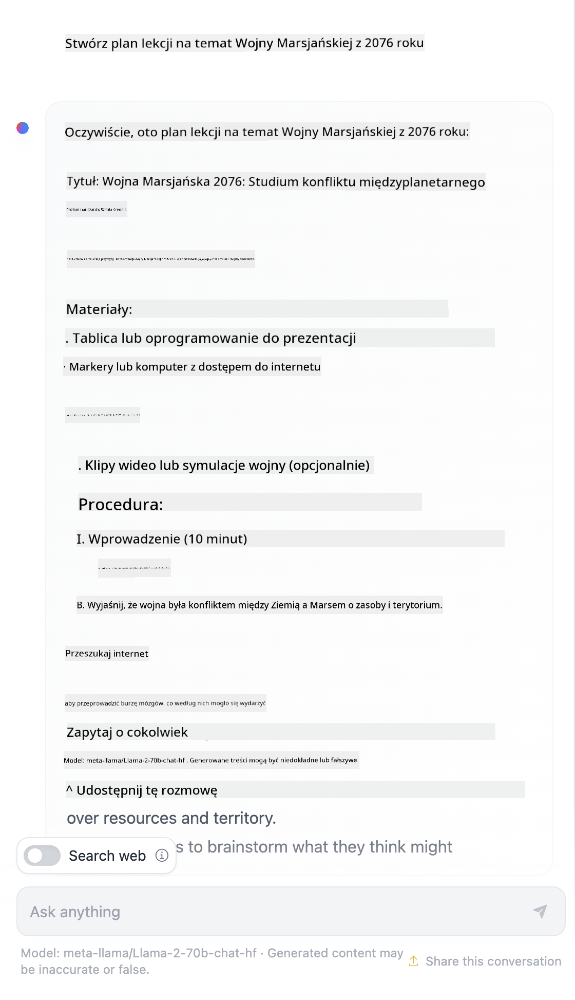

<!--
CO_OP_TRANSLATOR_METADATA:
{
  "original_hash": "dcbaaae026cb50fee071e690685b5843",
  "translation_date": "2025-08-26T16:42:41+00:00",
  "source_file": "04-prompt-engineering-fundamentals/README.md",
  "language_code": "pl"
}
-->
# Podstawy Inżynierii Promptów

[](https://aka.ms/gen-ai-lesson4-gh?WT.mc_id=academic-105485-koreyst)

## Wprowadzenie
Ten moduł omawia kluczowe pojęcia i techniki tworzenia skutecznych promptów dla generatywnych modeli AI. Sposób, w jaki napiszesz prompt do LLM, ma znaczenie. Starannie przygotowany prompt może zapewnić lepszą jakość odpowiedzi. Ale co właściwie oznaczają terminy _prompt_ i _inżynieria promptów_? I jak mogę ulepszyć _input promptu_, który wysyłam do LLM? Na te pytania postaramy się odpowiedzieć w tym rozdziale i kolejnym.

_Generatywna AI_ potrafi tworzyć nowe treści (np. tekst, obrazy, dźwięk, kod itd.) w odpowiedzi na zapytania użytkownika. Osiąga to dzięki _Dużym Modelom Językowym_ takim jak seria GPT ("Generative Pre-trained Transformer") od OpenAI, które są trenowane do pracy z językiem naturalnym i kodem.

Użytkownicy mogą teraz korzystać z tych modeli w znanych formatach, takich jak czat, bez potrzeby posiadania wiedzy technicznej czy specjalistycznego szkolenia. Modele te są _oparte na promptach_ – użytkownik wysyła tekstowy input (prompt), a AI zwraca odpowiedź (completion). Następnie można "rozmawiać z AI" w kilku turach, stopniowo dopracowując prompt, aż odpowiedź spełni oczekiwania.

"Prompt" staje się głównym _interfejsem programistycznym_ dla aplikacji generatywnej AI, określając, co model ma zrobić i wpływając na jakość zwracanych odpowiedzi. "Inżynieria promptów" to szybko rozwijająca się dziedzina, skupiająca się na _projektowaniu i optymalizacji_ promptów, by uzyskiwać spójne i wysokiej jakości odpowiedzi na dużą skalę.

## Cele nauki

W tej lekcji dowiemy się, czym jest inżynieria promptów, dlaczego jest ważna i jak możemy tworzyć bardziej skuteczne prompt dla wybranego modelu i celu aplikacji. Poznamy podstawowe pojęcia i dobre praktyki w inżynierii promptów – oraz środowisko "piaskownicy" w Jupyter Notebook, gdzie zobaczymy te koncepcje na prawdziwych przykładach.

Po ukończeniu tej lekcji będziesz w stanie:

1. Wyjaśnić, czym jest inżynieria promptów i dlaczego jest istotna.
2. Opisać elementy promptu i sposób ich wykorzystania.
3. Poznać dobre praktyki i techniki inżynierii promptów.
4. Zastosować poznane techniki na prawdziwych przykładach, korzystając z endpointu OpenAI.

## Kluczowe pojęcia

Inżynieria promptów: Praktyka projektowania i udoskonalania inputów, by kierować modele AI do generowania pożądanych wyników.
Tokenizacja: Proces przekształcania tekstu w mniejsze jednostki, zwane tokenami, które model potrafi zrozumieć i przetwarzać.
LLM-y dostrojone instrukcjami: Duże modele językowe (LLM), które zostały dodatkowo wytrenowane na konkretnych instrukcjach, by poprawić trafność i precyzję odpowiedzi.

## Piaskownica nauki

Inżynieria promptów to obecnie bardziej sztuka niż nauka. Najlepszy sposób na rozwinięcie intuicji w tym zakresie to _praktyka_ i podejście prób i błędów, łączące wiedzę z danej dziedziny z zalecanymi technikami i optymalizacjami specyficznymi dla modelu.

Jupyter Notebook dołączony do tej lekcji zapewnia środowisko _piaskownicy_, w którym możesz testować to, czego się uczysz – na bieżąco lub w ramach wyzwania kodowego na końcu. Do wykonania ćwiczeń potrzebujesz:

1. **Klucz API Azure OpenAI** – endpoint usługi dla wdrożonego LLM.
2. **Środowisko Python** – w którym można uruchomić Notebook.
3. **Lokalne zmienne środowiskowe** – _zrealizuj teraz kroki z [SETUP](./../00-course-setup/02-setup-local.md?WT.mc_id=academic-105485-koreyst), by się przygotować_.

Notebook zawiera _ćwiczenia startowe_ – ale zachęcamy, by dodawać własne sekcje _Markdown_ (opis) i _Code_ (zapytania prompt), by testować więcej przykładów lub pomysłów – i rozwijać swoją intuicję w projektowaniu promptów.

## Przewodnik ilustrowany

Chcesz najpierw zobaczyć ogólny obraz tego, co obejmuje ta lekcja? Sprawdź ten ilustrowany przewodnik, który pokazuje główne tematy i kluczowe wnioski, nad którymi warto się zastanowić w każdym z nich. Mapa lekcji prowadzi od zrozumienia podstawowych pojęć i wyzwań do ich rozwiązania za pomocą odpowiednich technik inżynierii promptów i dobrych praktyk. Zwróć uwagę, że sekcja "Zaawansowane techniki" w tym przewodniku odnosi się do treści omawianych w _następnym_ rozdziale tego kursu.


## Nasz startup

Porozmawiajmy teraz, jak _ten temat_ łączy się z naszą misją startupową, by [wprowadzać innowacje AI do edukacji](https://educationblog.microsoft.com/2023/06/collaborating-to-bring-ai-innovation-to-education?WT.mc_id=academic-105485-koreyst). Chcemy budować aplikacje AI wspierające _spersonalizowaną naukę_ – więc zastanówmy się, jak różni użytkownicy naszej aplikacji mogą "projektować" prompt:

- **Administratorzy** mogą poprosić AI o _analizę danych programowych w celu wykrycia luk w zakresie materiału_. AI może podsumować wyniki lub zwizualizować je za pomocą kodu.
- **Nauczyciele** mogą poprosić AI o _stworzenie planu lekcji dla określonej grupy odbiorców i tematu_. AI może przygotować spersonalizowany plan w wybranym formacie.
- **Uczniowie** mogą poprosić AI o _pomoc w trudnym przedmiocie_. AI może prowadzić ucznia przez lekcje, wskazówki i przykłady dostosowane do jego poziomu.

To tylko wierzchołek góry lodowej. Zajrzyj do [Prompts For Education](https://github.com/microsoft/prompts-for-edu/tree/main?WT.mc_id=academic-105485-koreyst) – otwartej biblioteki promptów przygotowanej przez ekspertów edukacyjnych – by zobaczyć, jak szerokie są możliwości! _Spróbuj uruchomić niektóre z tych promptów w piaskownicy lub w OpenAI Playground i zobacz, co się stanie!_

<!--
SZABLON LEKCJI:
Ta jednostka powinna obejmować podstawową koncepcję #1.
Wzmocnij koncepcję przykładami i odniesieniami.

KONCEPCJA #1:
Inżynieria promptów.
Zdefiniuj ją i wyjaśnij, dlaczego jest potrzebna.
-->

## Czym jest inżynieria promptów?

Na początku tej lekcji zdefiniowaliśmy **inżynierię promptów** jako proces _projektowania i optymalizacji_ tekstowych inputów (promptów), by uzyskiwać spójne i wysokiej jakości odpowiedzi (completions) dla określonego celu aplikacji i modelu. Można to potraktować jako proces dwuetapowy:

- _projektowanie_ poczÄ…tkowego promptu dla wybranego modelu i celu
- _udoskonalanie_ promptu w kolejnych iteracjach, by poprawić jakość odpowiedzi

To proces oparty na próbach i błędach, wymagający intuicji i zaangażowania użytkownika, by osiągnąć optymalne rezultaty. Dlaczego jest to ważne? By odpowiedzieć na to pytanie, musimy najpierw zrozumieć trzy pojęcia:

- _Tokenizacja_ = jak model "widzi" prompt
- _Bazowe LLM-y_ = jak model bazowy "przetwarza" prompt
- _LLM-y dostrojone instrukcjami_ = jak model może "widzieć zadania"

### Tokenizacja

LLM widzi prompt jako _ciąg tokenów_, przy czym różne modele (lub ich wersje) mogą tokenizować ten sam prompt w różny sposób. Ponieważ LLM-y są trenowane na tokenach (a nie na surowym tekście), sposób tokenizacji promptu bezpośrednio wpływa na jakość generowanej odpowiedzi.

Aby lepiej zrozumieć, jak działa tokenizacja, wypróbuj narzędzia takie jak [OpenAI Tokenizer](https://platform.openai.com/tokenizer?WT.mc_id=academic-105485-koreyst) pokazane poniżej. Wklej swój prompt – i zobacz, jak zostaje przekształcony w tokeny, zwracając uwagę na sposób traktowania spacji i znaków interpunkcyjnych. Zwróć uwagę, że ten przykład pokazuje starszy LLM (GPT-3) – więc użycie nowszego modelu może dać inny rezultat.


### Koncepcja: Modele bazowe

Gdy prompt zostanie ztokenizowany, główną funkcją ["bazowego LLM"](https://blog.gopenai.com/an-introduction-to-base-and-instruction-tuned-large-language-models-8de102c785a6?WT.mc_id=academic-105485-koreyst) (czyli modelu bazowego) jest przewidywanie kolejnego tokenu w tym ciągu. Ponieważ LLM-y są trenowane na ogromnych zbiorach tekstów, dobrze rozpoznają statystyczne zależności między tokenami i potrafią dokonać takiego przewidywania z pewną pewnością. Warto zauważyć, że nie rozumieją _znaczenia_ słów czy tokenów w promptach; widzą jedynie wzór, który mogą "dokończyć" kolejną prognozą. Mogą kontynuować przewidywanie ciągu aż do zakończenia przez użytkownika lub spełnienia ustalonego warunku.

Chcesz zobaczyć, jak działa generowanie odpowiedzi na podstawie promptu? Wprowadź powyższy prompt do [_Chat Playground_](https://oai.azure.com/playground?WT.mc_id=academic-105485-koreyst) w Azure OpenAI Studio z domyślnymi ustawieniami. System traktuje prompt jako prośbę o informację – więc powinieneś zobaczyć odpowiedź pasującą do tego kontekstu.

A co jeśli użytkownik chce zobaczyć coś konkretnego, spełniającego określone kryteria lub cel zadania? Tu pojawiają się LLM-y dostrojone instrukcjami.


### Koncepcja: LLM-y dostrojone instrukcjami

[LLM dostrojony instrukcjami](https://blog.gopenai.com/an-introduction-to-base-and-instruction-tuned-large-language-models-8de102c785a6?WT.mc_id=academic-105485-koreyst) zaczyna od modelu bazowego i jest dodatkowo trenowany na przykładach lub parach input/output (np. wieloturowych "wiadomościach"), które mogą zawierać jasne instrukcje – a odpowiedź AI próbuje je wykonać.

Wykorzystuje to techniki takie jak uczenie ze wzmocnieniem z informacją zwrotną od człowieka (RLHF), które pozwalają modelowi _podążać za instrukcjami_ i _uczyć się na podstawie feedbacku_, by generować odpowiedzi lepiej dopasowane do praktycznych zastosowań i bardziej trafne względem celów użytkownika.

Spróbujmy – wróć do powyższego promptu, ale teraz zmień _wiadomość systemową_, by dodać następującą instrukcję jako kontekst:

> _Streszczaj treści, które otrzymujesz, dla ucznia drugiej klasy. Ogranicz wynik do jednego akapitu z 3-5 punktami wypunktowanymi._

Zobacz, jak wynik jest teraz dostosowany do oczekiwanego celu i formatu? Nauczyciel może bezpośrednio wykorzystać taką odpowiedź w swoich materiałach dla tej klasy.


## Dlaczego potrzebujemy inżynierii promptów?

Skoro wiemy, jak LLM-y przetwarzają prompt, porozmawiajmy o _powodach_, dla których inżynieria promptów jest potrzebna. Odpowiedź tkwi w tym, że obecne LLM-y stawiają przed nami szereg wyzwań, przez które _uzyskanie wiarygodnych i spójnych odpowiedzi_ jest trudniejsze bez odpowiedniego wysiłku w projektowanie i optymalizację promptów. Na przykład:

1. **Odpowiedzi modeli są stochastyczne.** _Ten sam prompt_ prawdopodobnie wygeneruje różne odpowiedzi w różnych modelach lub wersjach modelu. Może też dać różne wyniki w _tym samym modelu_ w różnych momentach. _Techniki inżynierii promptów pomagają ograniczyć te różnice, zapewniając lepsze "ramy" dla odpowiedzi_.

1. **Modele mogą wymyślać odpowiedzi.** Modele są trenowane na _dużych, ale skończonych_ zbiorach danych, więc nie mają wiedzy o zagadnieniach spoza tego zakresu. W efekcie mogą generować odpowiedzi nieprawdziwe, zmyślone lub sprzeczne z faktami. _Techniki inżynierii promptów pomagają wykrywać i ograniczać takie wymysły, np. prosząc AI o cytowanie źródeł lub uzasadnienie odpowiedzi_.

1. **Możliwości modeli będą się różnić.** Nowsze modele lub generacje mają większe możliwości, ale też własne specyficzne cechy i kompromisy kosztowe czy złożoności. _Inżynieria promptów pozwala wypracować dobre praktyki i procesy, które niwelują różnice i dostosowują się do wymagań konkretnych modeli w skalowalny, płynny sposób_.

Zobacz to w praktyce w OpenAI lub Azure OpenAI Playground:

- Użyj tego samego promptu w różnych wdrożeniach LLM (np. OpenAI, Azure OpenAI, Hugging Face) – czy zauważyłeś różnice?
- Użyj tego samego promptu wielokrotnie w _tym samym_ wdrożeniu LLM (np. Azure OpenAI playground) – jak różniły się odpowiedzi?

### Przykład wymyślania odpowiedzi

W tym kursie używamy terminu **"wymyślanie"** (ang. "fabrication") na określenie zjawiska, gdy LLM-y generują nieprawdziwe informacje z powodu ograniczeń treningowych lub innych czynników. Możesz też spotkać się z określeniem _"halucynacje"_ w artykułach czy publikacjach naukowych. Zalecamy jednak używanie terminu _"wymyślanie"_, by nie przypisywać maszynie cech ludzkich i nie antropomorfizować jej działania. To także zgodne z [wytycznymi Responsible AI](https://www.microsoft.com/ai/responsible-ai?WT.mc_id=academic-105485-koreyst) pod względem terminologii, eliminując określenia, które mogą być uznane za nieodpowiednie lub wykluczające w niektórych kontekstach.

Chcesz zobaczyć, jak działa wymyślanie odpowiedzi? Wymyśl prompt, który poleca AI wygenerować treść na temat nieistniejący (by mieć pewność, że nie występuje w zbiorze treningowym). Na przykład – użyłem takiego promptu:
# Plan lekcji: Wojna Marsjańska 2076

## Cel lekcji

- Poznanie przyczyn, przebiegu i skutków Wojny Marsjańskiej 2076
- Analiza wpływu konfliktu na społeczeństwo marsjańskie i ziemskie
- Rozwijanie umiejętności krytycznego myślenia poprzez dyskusję na temat etyki i technologii wojennych

## Wprowadzenie (10 minut)

- Krótkie przypomnienie kolonizacji Marsa i napięć między Ziemią a Marsjanami
- Wprowadzenie do tematu: Dlaczego doszło do wojny w 2076 roku?

## Prezentacja multimedialna (15 minut)

- Pokaz slajdów przedstawiający kluczowe wydarzenia wojny
- Omówienie głównych stron konfliktu: Rząd Marsjański, Sojusz Ziemski, niezależne frakcje
- Przykłady użycia nowoczesnych technologii wojennych (np. drony, sztuczna inteligencja, broń orbitalna)

## Praca w grupach (20 minut)

- Podział uczniów na grupy, każda analizuje inny aspekt wojny:
    - Przyczyny konfliktu
    - Przebieg najważniejszych bitew
    - Skutki dla Marsa i Ziemi
    - Rola mediów i propagandy
- Grupy przygotowują krótkie prezentacje

## Prezentacje grupowe (15 minut)

- Każda grupa przedstawia swoje wnioski
- Dyskusja na temat różnych perspektyw

## Debata klasowa (15 minut)

- Temat: Czy wojna była nieunikniona? Jak można było jej zapobiec?
- Uczniowie argumentujÄ… za i przeciw, nauczyciel moderuje dyskusjÄ™

## Podsumowanie i refleksja (10 minut)

- Omówienie najważniejszych wniosków z lekcji
- Krótkie zadanie pisemne: Jakie lekcje możemy wyciągnąć z Wojny Marsjańskiej 2076?

## Praca domowa

- Napisz esej na temat: "Wpływ Wojny Marsjańskiej 2076 na przyszłość relacji międzyplanetarnych"
- Przeczytaj rozdział z podręcznika dotyczący technologii wojennych użytych podczas konfliktu

## Materiały dodatkowe

- Linki do artykułów, filmów dokumentalnych i wywiadów z uczestnikami wojny
- Lista książek i powieści science fiction inspirowanych wydarzeniami z 2076 roku
Wyszukiwanie w internecie pokazało, że istnieją fikcyjne opowieści (np. seriale telewizyjne lub książki) o wojnach marsjańskich – ale żadna z nich nie dotyczy roku 2076. Zdrowy rozsądek podpowiada też, że rok 2076 jest _przyszłością_, więc nie może być powiązany z prawdziwym wydarzeniem.

Co się stanie, gdy uruchomimy ten prompt u różnych dostawców LLM?

> **Odpowiedź 1**: OpenAI Playground (GPT-35)


> **Odpowiedź 2**: Azure OpenAI Playground (GPT-35)


> **Odpowiedź 3**: Hugging Face Chat Playground (LLama-2)



Jak można się spodziewać, każdy model (lub jego wersja) generuje nieco inne odpowiedzi ze względu na stochastyczne działanie i różnice w możliwościach. Na przykład jeden model kieruje odpowiedź do ucznia ósmej klasy, a drugi do licealisty. Jednak wszystkie trzy odpowiedzi mogłyby przekonać nieświadomego użytkownika, że wydarzenie było prawdziwe.

Techniki inżynierii promptów, takie jak _metaprompting_ czy _konfiguracja temperatury_, mogą w pewnym stopniu ograniczyć zmyślone odpowiedzi modeli. Nowe _architektury_ inżynierii promptów płynnie włączają nowe narzędzia i techniki do procesu tworzenia promptów, by łagodzić lub ograniczać te efekty.

## Studium przypadku: GitHub Copilot

Na zakończenie tej sekcji zobaczmy, jak inżynieria promptów jest wykorzystywana w praktycznych rozwiązaniach, na przykładzie [GitHub Copilot](https://github.com/features/copilot?WT.mc_id=academic-105485-koreyst).

GitHub Copilot to Twój â€AI Pair Programmer†– zamienia tekstowe polecenia na uzupeÅ‚nienia kodu i jest zintegrowany z Twoim Å›rodowiskiem programistycznym (np. Visual Studio Code), zapewniajÄ…c pÅ‚ynne doÅ›wiadczenie użytkownika. Jak opisano w serii poniższych wpisów na blogu, najwczeÅ›niejsza wersja opieraÅ‚a siÄ™ na modelu OpenAI Codex – inżynierowie szybko zauważyli potrzebÄ™ dostrajania modelu i opracowania lepszych technik inżynierii promptów, by poprawić jakość kodu. W lipcu [zaprezentowano ulepszony model AI, który wykracza poza Codex](https://github.blog/2023-07-28-smarter-more-efficient-coding-github-copilot-goes-beyond-codex-with-improved-ai-model/?WT.mc_id=academic-105485-koreyst), oferujÄ…c jeszcze szybsze sugestie.

Przeczytaj wpisy po kolei, by śledzić ich drogę rozwoju.

- **Maj 2023** | [GitHub Copilot coraz lepiej rozumie Twój kod](https://github.blog/2023-05-17-how-github-copilot-is-getting-better-at-understanding-your-code/?WT.mc_id=academic-105485-koreyst)
- **Maj 2023** | [WewnÄ…trz GitHub: Praca z LLM stojÄ…cymi za GitHub Copilot](https://github.blog/2023-05-17-inside-github-working-with-the-llms-behind-github-copilot/?WT.mc_id=academic-105485-koreyst).
- **Czerwiec 2023** | [Jak pisać lepsze prompt’y dla GitHub Copilot](https://github.blog/2023-06-20-how-to-write-better-prompts-for-github-copilot/?WT.mc_id=academic-105485-koreyst).
- **Lipiec 2023** | [.. GitHub Copilot wykracza poza Codex dzięki ulepszonemu modelowi AI](https://github.blog/2023-07-28-smarter-more-efficient-coding-github-copilot-goes-beyond-codex-with-improved-ai-model/?WT.mc_id=academic-105485-koreyst)
- **Lipiec 2023** | [Przewodnik programisty po inżynierii promptów i LLM](https://github.blog/2023-07-17-prompt-engineering-guide-generative-ai-llms/?WT.mc_id=academic-105485-koreyst)
- **Wrzesień 2023** | [Jak zbudować aplikację LLM dla firmy: Lekcje z GitHub Copilot](https://github.blog/2023-09-06-how-to-build-an-enterprise-llm-application-lessons-from-github-copilot/?WT.mc_id=academic-105485-koreyst)

Możesz też przejrzeć ich [blog inżynierski](https://github.blog/category/engineering/?WT.mc_id=academic-105485-koreyst) po więcej wpisów, takich jak [ten](https://github.blog/2023-09-27-how-i-used-github-copilot-chat-to-build-a-reactjs-gallery-prototype/?WT.mc_id=academic-105485-koreyst), pokazujący jak te modele i techniki są _stosowane_ w rzeczywistych aplikacjach.

---

## Konstrukcja promptów

Widzieliśmy już, dlaczego inżynieria promptów jest ważna – teraz przyjrzyjmy się, jak prompt’y są _budowane_, by móc ocenić różne techniki skutecznego projektowania promptów.

### Podstawowy prompt

Zacznijmy od najprostszego promptu: tekstowego wejścia wysyłanego do modelu bez dodatkowego kontekstu. Oto przykład – gdy wyślemy pierwsze słowa amerykańskiego hymnu narodowego do OpenAI [Completion API](https://platform.openai.com/docs/api-reference/completions?WT.mc_id=academic-105485-koreyst), model natychmiast _uzupełnia_ odpowiedź kolejnymi wersami, pokazując podstawowe zachowanie predykcyjne.

| Prompt (Wejście)     | Uzupełnienie (Wyjście)                                                                                                                        |
| :------------------- | :-------------------------------------------------------------------------------------------------------------------------------------------- |
| Oh say can you see   | WyglÄ…da na to, że zaczynasz tekst â€The Star-Spangled Bannerâ€, hymnu narodowego Stanów Zjednoczonych. PeÅ‚ny tekst to ...                      |

### Złożony prompt

Teraz dodajmy kontekst i instrukcje do podstawowego promptu. [Chat Completion API](https://learn.microsoft.com/azure/ai-services/openai/how-to/chatgpt?WT.mc_id=academic-105485-koreyst) pozwala zbudować złożony prompt jako zbiór _wiadomości_ z:

- Parami wejście/wyjście odzwierciedlającymi _użytkownika_ i _asystenta_.
- Wiadomością systemową ustawiającą kontekst zachowania lub osobowości asystenta.

Żądanie wygląda teraz jak poniżej, gdzie _tokenizacja_ skutecznie wyłapuje istotne informacje z kontekstu i rozmowy. Zmiana kontekstu systemowego może mieć równie duży wpływ na jakość odpowiedzi, jak podane przez użytkownika dane wejściowe.

```python
response = openai.chat.completions.create(
    model="gpt-3.5-turbo",
    messages=[
        {"role": "system", "content": "You are a helpful assistant."},
        {"role": "user", "content": "Who won the world series in 2020?"},
        {"role": "assistant", "content": "The Los Angeles Dodgers won the World Series in 2020."},
        {"role": "user", "content": "Where was it played?"}
    ]
)
```

### Prompt instrukcyjny

W powyższych przykładach prompt użytkownika był prostym zapytaniem tekstowym, które można zinterpretować jako prośbę o informację. W promptach _instrukcyjnych_ możemy użyć tekstu, by dokładniej określić zadanie, dając AI lepsze wskazówki. Oto przykład:

| Prompt (Wejście)                                                                                                                                                                                                                         | Uzupełnienie (Wyjście)                                                                                                        | Typ instrukcji      |
| :--------------------------------------------------------------------------------------------------------------------------------------------------------------------------------------------------------------------------------------- | :---------------------------------------------------------------------------------------------------------------------------- | :------------------ |
| Napisz opis wojny secesyjnej                                                                                                                                                                      | _zwrócono prosty akapit_                                                                                                     | Prosta              |
| Napisz opis wojny secesyjnej. Podaj kluczowe daty i wydarzenia oraz opisz ich znaczenie                                                                                                           | _zwrócono akapit, a następnie listę kluczowych dat z opisami wydarzeń_                                                       | Złożona             |
| Napisz opis wojny secesyjnej w 1 akapicie. Podaj 3 punkty z kluczowymi datami i ich znaczeniem. Podaj 3 kolejne punkty z kluczowymi postaciami historycznymi i ich wkładem. Zwróć wynik jako plik JSON | _zwrócono bardziej szczegółowe dane w polu tekstowym, sformatowane jako JSON, który można skopiować do pliku i zweryfikować_ | Złożona. Sformatowana. |

## Treść główna

W powyższych przykładach prompt był dość otwarty, pozwalając LLM zdecydować, która część jego wytrenowanego zbioru danych jest istotna. W wzorcu _treści głównej_ wejście dzielimy na dwie części:

- instrukcjÄ™ (akcjÄ™)
- istotną treść (wpływającą na akcję)

Oto przykÅ‚ad, gdzie instrukcja brzmi â€podsumuj to w 2 zdaniachâ€.

| Prompt (Wejście)                                                                                                                                                                                                                                                                                                                                                                                                                                                                                                                                                                                                                                                                                      | Uzupełnienie (Wyjście)                                                                                                                                                                                                                                                                             |
| :-------------------------------------------------------------------------------------------------------------------------------------------------------------------------------------------------------------------------------------------------------------------------------------------------------------------------------------------------------------------------------------------------------------------------------------------------------------------------------------------------------------------------------------------------------------------------------------------------------------------------------------------------------------------------------------------------- | :---------------------------------------------------------------------------------------------------------------------------------------------------------------------------------------------------------------------------------------------------------------------------------------------- |
| Jowisz to piąta planeta od Słońca i największa w Układzie Słonecznym. Jest gazowym olbrzymem o masie tysięcznej masy Słońca, ale dwa i pół razy większej niż masa wszystkich pozostałych planet razem wziętych. Jowisz jest jednym z najjaśniejszych obiektów widocznych gołym okiem na nocnym niebie i był znany starożytnym cywilizacjom jeszcze przed początkiem historii. Nazwa pochodzi od rzymskiego boga Jowisza.[19] Oglądany z Ziemi, Jowisz może być na tyle jasny, że jego odbite światło rzuca widoczne cienie,[20] a średnio jest trzecim najjaśniejszym naturalnym obiektem na nocnym niebie po Księżycu i Wenus. <br/> **Podsumuj to w 2 krótkich zdaniach** | Jowisz, piąta planeta od Słońca, jest największą w Układzie Słonecznym i jednym z najjaśniejszych obiektów na nocnym niebie. Nazwany na cześć rzymskiego boga, jest gazowym olbrzymem o masie dwa i pół razy większej niż masa wszystkich pozostałych planet razem wziętych. |

Segment treści głównej można wykorzystać na różne sposoby, by skuteczniej przekazywać instrukcje:

- **Przykłady** – zamiast mówić modelowi, co ma zrobić, podaj przykłady oczekiwanego wyniku i pozwól mu wywnioskować wzorzec.
- **Wskazówki** – po instrukcji dodaj â€wskazówkÄ™â€, która naprowadza model na odpowiedni format odpowiedzi.
- **Szablony** – powtarzalne â€przepisy†na prompt’y z miejscami na zmienne, które można uzupeÅ‚nić danymi dla konkretnych zastosowaÅ„.

Przyjrzyjmy siÄ™ tym technikom w praktyce.

### Wykorzystanie przykładów

To podejÅ›cie polega na â€nakarmieniu modelu†przykÅ‚adami oczekiwanego wyniku dla danej instrukcji i pozwoleniu mu wywnioskować wzorzec. W zależnoÅ›ci od liczby podanych przykÅ‚adów, możemy mieć prompt zero-shot, one-shot, few-shot itd.

Prompt składa się teraz z trzech elementów:

- Opisu zadania
- Kilku przykładów oczekiwanego wyniku
- Początku nowego przykładu (który staje się domyślną instrukcją)

| Typ uczenia   | Prompt (Wejście)                                                                                                                                        | Uzupełnienie (Wyjście)         |
| :------------ | :------------------------------------------------------------------------------------------------------------------------------------------------------ | :----------------------------- |
| Zero-shot     | "The Sun is Shining". Przetłumacz na hiszpański                                                                                                        | "El Sol está brillando".       |
| One-shot      | "The Sun is Shining" => ""El Sol está brillando". <br> "It's a Cold and Windy Day" =>                                                                  | "Es un día frío y ventoso".    |
| Few-shot      | The player ran the bases => Baseball <br/> The player hit an ace => Tennis <br/> The player hit a six => Cricket <br/> The player made a slam-dunk => | Basketball                     |
|               |                                                                                                                                                         |                                |

Zwróć uwagÄ™, że w prompt zero-shot musieliÅ›my podać wyraźnÄ… instrukcjÄ™ (â€PrzetÅ‚umacz na hiszpaÅ„skiâ€), ale w one-shot model już jÄ… wywnioskowaÅ‚. PrzykÅ‚ad few-shot pokazuje, jak dodanie wiÄ™kszej liczby przykÅ‚adów pozwala modelom trafniej wnioskować bez dodatkowych instrukcji.

### Wskazówki w promptach

InnÄ… technikÄ… wykorzystania treÅ›ci głównej jest podanie _wskazówek_ zamiast przykÅ‚adów. W tym przypadku dajemy modelowi â€zaczepkꆖ fragment, który odzwierciedla pożądany format odpowiedzi. Model â€Å‚apie wskazówkę†i kontynuuje w tym stylu.

| Liczba wskazówek | Prompt (Wejście)                                                                                                                                                                                                                                                                                                                                                                                                                                               | Uzupełnienie (Wyjście)                                                                                                                                                                                                                                                                                       |
| :--------------- | :------------------------------------------------------------------------------------------------------------------------------------------------------------------------------------------------------------------------------------------------------------------------------------------------------------------------------------------------------------------------------------------------------------------------------------------------------------- | :------------------------------------------------------------------------------------------------------------------------------------------------------------------------------------------------------------------------------------------------------------------------------------------------------------ |
| 0                | Jowisz to piąta planeta od Słońca i największa w Układzie Słonecznym. Jest gazowym olbrzymem o masie tysięcznej masy Słońca, ale dwa i pół razy większej niż masa wszystkich pozostałych planet razem wziętych. Jowisz jest jednym z najjaśniejszych obiektów widocznych gołym okiem na nocnym niebie i był znany starożytnym cywilizacjom jeszcze przed początkiem historii.

**Podsumuj to**                                       | Jowisz jest największą planetą w naszym Układzie Słonecznym i piątą od Słońca. To gazowy olbrzym o masie stanowiącej 1/1000 masy Słońca, ale cięższy niż wszystkie pozostałe planety razem wzięte. Starożytne cywilizacje znały Jowisza od dawna, a na nocnym niebie jest łatwo widoczny. |
| 1              | Jowisz to piąta planeta od Słońca i największa w Układzie Słonecznym. Jest gazowym olbrzymem o masie stanowiącej jedną tysięczną masy Słońca, ale dwa i pół razy większej niż masa wszystkich pozostałych planet razem wziętych. Jowisz jest jednym z najjaśniejszych obiektów widocznych gołym okiem na nocnym niebie i był znany starożytnym cywilizacjom jeszcze przed powstaniem pisma. <br/>**Podsumuj to** <br/> Dowiedzieliśmy się, że Jowisz | jest piątą planetą od Słońca i największą w Układzie Słonecznym. To gazowy olbrzym o masie stanowiącej jedną tysięczną masy Słońca, ale dwa i pół razy większej niż masa wszystkich pozostałych planet razem wziętych. Jest łatwo widoczny gołym okiem i znany od czasów starożytnych.                        |
| 2              | Jowisz to piąta planeta od Słońca i największa w Układzie Słonecznym. Jest gazowym olbrzymem o masie stanowiącej jedną tysięczną masy Słońca, ale dwa i pół razy większej niż masa wszystkich pozostałych planet razem wziętych. Jowisz jest jednym z najjaśniejszych obiektów widocznych gołym okiem na nocnym niebie i był znany starożytnym cywilizacjom jeszcze przed powstaniem pisma. <br/>**Podsumuj to** <br/> Top 3 Fakty, których się dowiedzieliśmy:         | 1. Jowisz to piąta planeta od Słońca i największa w Układzie Słonecznym. <br/> 2. Jest gazowym olbrzymem o masie stanowiącej jedną tysięczną masy Słońca...<br/> 3. Jowisz jest widoczny gołym okiem od czasów starożytnych ...                                                                       |
|                |                                                                                                                                                                                                                                                                                                                                                                                                                                                              |                                                                                                                                                                                                                                                                                                           |

### Szablony promptów

Szablon promptu to _z góry zdefiniowany przepis na prompt_, który można zapisać i ponownie wykorzystać w razie potrzeby, aby zapewnić bardziej spójne doświadczenia użytkowników na dużą skalę. W najprostszej formie jest to po prostu zbiór przykładów promptów jak [ten od OpenAI](https://platform.openai.com/examples?WT.mc_id=academic-105485-koreyst), który zawiera zarówno interaktywne komponenty promptu (wiadomości użytkownika i systemu), jak i format żądania obsługiwany przez API – co umożliwia ponowne użycie.

W bardziej złożonej formie, jak [ten przykład z LangChain](https://python.langchain.com/docs/concepts/prompt_templates/?WT.mc_id=academic-105485-koreyst), zawiera _pola zastępcze_, które można zastąpić danymi z różnych źródeł (wejście użytkownika, kontekst systemowy, zewnętrzne źródła danych itd.), aby dynamicznie generować prompt. Pozwala to tworzyć bibliotekę gotowych promptów, które można programistycznie wykorzystywać do zapewnienia spójnych doświadczeń użytkowników na dużą skalę.

Prawdziwa wartość szablonów polega na możliwości tworzenia i publikowania _bibliotek promptów_ dla konkretnych dziedzin – gdzie szablon promptu jest _optymalizowany_ pod kątem specyficznego kontekstu aplikacji lub przykładów, które sprawiają, że odpowiedzi są bardziej trafne i precyzyjne dla docelowych użytkowników. Repozytorium [Prompts For Edu](https://github.com/microsoft/prompts-for-edu?WT.mc_id=academic-105485-koreyst) jest świetnym przykładem takiego podejścia – gromadzi bibliotekę promptów dla edukacji z naciskiem na kluczowe cele, takie jak planowanie lekcji, projektowanie programów nauczania, wsparcie uczniów itd.

## Treści wspierające

Jeśli potraktujemy konstruowanie promptów jako mające instrukcję (zadanie) i cel (główna treść), to _treść drugorzędna_ to dodatkowy kontekst, który dostarczamy, aby **w jakiś sposób wpłynąć na wynik**. Mogą to być parametry dostrajające, instrukcje formatowania, taksonomie tematów itd., które pomagają modelowi _dostosować_ odpowiedź do oczekiwań lub celów użytkownika.

Na przykład: Mając katalog kursów z rozbudowanymi metadanymi (nazwa, opis, poziom, tagi, prowadzący itd.) wszystkich dostępnych kursów w programie nauczania:

- możemy zdefiniować instrukcjÄ™ â€podsumuj katalog kursów na semestr jesienny 2023â€
- możemy użyć głównej treści, by podać kilka przykładów oczekiwanego wyniku
- możemy użyć treÅ›ci drugorzÄ™dnej, by wskazać 5 najważniejszych â€tagów†do uwzglÄ™dnienia.

Teraz model może wygenerować podsumowanie w formacie pokazanym w przykładach, ale jeśli wynik zawiera wiele tagów, może nadać priorytet 5 wskazanym w treści drugorzędnej.

---

<!--
SZABLON LEKCJI:
Ta jednostka powinna obejmować kluczową koncepcję #1.
Wzmocnij koncepcję przykładami i odniesieniami.

KONCEPCJA #3:
Techniki inżynierii promptów.
Jakie są podstawowe techniki inżynierii promptów?
Zilustruj to ćwiczeniami.
-->

## Najlepsze praktyki tworzenia promptów

Teraz, gdy wiemy, jak można _konstruować_ prompt, możemy zacząć myśleć o tym, jak je _projektować_, by odzwierciedlały najlepsze praktyki. Możemy podzielić to na dwie części – odpowiednie _nastawienie_ i stosowanie właściwych _technik_.

### Nastawienie do inżynierii promptów

Inżynieria promptów to proces prób i błędów, więc miej na uwadze trzy ogólne czynniki przewodnie:

1. **Zrozumienie domeny ma znaczenie.** Trafność i dokładność odpowiedzi zależy od _domeny_, w której działa aplikacja lub użytkownik. Wykorzystaj swoją intuicję i wiedzę domenową, by **dostosować techniki**. Na przykład, zdefiniuj _osobowości specyficzne dla domeny_ w promptach systemowych lub użyj _szablonów specyficznych dla domeny_ w promptach użytkownika. Dodaj treści drugorzędne odzwierciedlające kontekst domenowy lub użyj _wskazówek i przykładów z danej dziedziny_, by ukierunkować model na znane wzorce użycia.

2. **Zrozumienie modelu ma znaczenie.** Wiemy, że modele są z natury stochastyczne. Jednak implementacje modeli mogą się różnić pod względem zbioru danych treningowych (wiedza wstępna), oferowanych możliwości (np. przez API lub SDK) i rodzaju treści, do których są zoptymalizowane (np. kod, obrazy, tekst). Poznaj mocne i słabe strony używanego modelu i wykorzystaj tę wiedzę, by _priorytetyzować zadania_ lub budować _dostosowane szablony_ zoptymalizowane pod możliwości modelu.

3. **Iteracja i walidacja majÄ… znaczenie.** Modele rozwijajÄ… siÄ™ bardzo szybko, podobnie jak techniki inżynierii promptów. Jako ekspert domenowy możesz mieć inne kryteria lub kontekst dla _swojej_ aplikacji, które nie muszÄ… dotyczyć szerszej spoÅ‚ecznoÅ›ci. Wykorzystaj narzÄ™dzia i techniki inżynierii promptów, by â€rozpocząć†budowÄ™ promptu, a nastÄ™pnie iteruj i weryfikuj wyniki, korzystajÄ…c z wÅ‚asnej intuicji i wiedzy. Zapisuj swoje spostrzeżenia i twórz **bazÄ™ wiedzy** (np. biblioteki promptów), która może sÅ‚użyć innym jako nowy punkt wyjÅ›cia do szybszych iteracji w przyszÅ‚oÅ›ci.

## Najlepsze praktyki

Przyjrzyjmy się teraz najczęściej zalecanym najlepszym praktykom według [OpenAI](https://help.openai.com/en/articles/6654000-best-practices-for-prompt-engineering-with-openai-api?WT.mc_id=academic-105485-koreyst) i specjalistów [Azure OpenAI](https://learn.microsoft.com/azure/ai-services/openai/concepts/prompt-engineering#best-practices?WT.mc_id=academic-105485-koreyst).

| Co                              | Dlaczego                                                                                                                                                                                                                                               |
| :-------------------------------- | :------------------------------------------------------------------------------------------------------------------------------------------------------------------------------------------------------------------------------------------------ |
| Testuj najnowsze modele.       | Nowe generacje modeli prawdopodobnie mają lepsze funkcje i jakość – ale mogą być też droższe. Oceń ich wpływ, a potem podejmij decyzję o migracji.                                                                                |
| Oddziel instrukcje i kontekst   | Sprawdź, czy Twój model/dostawca definiuje _znaczniki_, które wyraźniej oddzielają instrukcje, treść główną i drugorzędną. To może pomóc modelom lepiej przypisywać wagi do tokenów.                                                         |
| Bądź precyzyjny i jasny             | Podaj więcej szczegółów dotyczących oczekiwanego kontekstu, wyniku, długości, formatu, stylu itd. To poprawi jakość i spójność odpowiedzi. Zapisuj przepisy w szablonach do ponownego użycia.                                                          |
| BÄ…dź opisowy, używaj przykÅ‚adów      | Modele czÄ™sto lepiej reagujÄ… na podejÅ›cie â€pokaż i opowiedzâ€. Zacznij od podejÅ›cia `zero-shot`, gdzie dajesz tylko instrukcjÄ™ (bez przykÅ‚adów), a potem spróbuj `few-shot` jako doprecyzowanie, podajÄ…c kilka przykÅ‚adów oczekiwanego wyniku. Używaj analogii. |
| Używaj wskazówek do rozpoczęcia odpowiedzi | Skieruj model w stronę oczekiwanego wyniku, podając kilka wiodących słów lub fraz, które może wykorzystać jako punkt wyjścia do odpowiedzi.                                                                                                               |
| Powtarzaj                       | Czasem trzeba powtórzyć instrukcję modelowi. Podaj instrukcję przed i po głównej treści, użyj instrukcji i wskazówki itd. Iteruj i sprawdzaj, co działa najlepiej.                                                         |
| Kolejność ma znaczenie                     | Kolejność prezentowania informacji modelowi może wpływać na wynik, nawet w przykładach uczących, ze względu na efekt świeżości. Przetestuj różne opcje, by zobaczyć, co działa najlepiej.                                                               |
| Daj modelowi â€wyjÅ›cie†          | Podaj modelowi _odpowiedź awaryjnÄ…_, którÄ… może zwrócić, jeÅ›li z jakiegoÅ› powodu nie może wykonać zadania. To może zmniejszyć ryzyko generowania faÅ‚szywych lub zmyÅ›lonych odpowiedzi.                                                         |
|                                   |                                                                                                                                                                                                                                                   |

Jak w przypadku każdej najlepszej praktyki, _Twoje rezultaty mogą się różnić_ w zależności od modelu, zadania i domeny. Potraktuj je jako punkt wyjścia i iteruj, by znaleźć to, co działa najlepiej dla Ciebie. Regularnie oceniaj swój proces inżynierii promptów, gdy pojawiają się nowe modele i narzędzia, skupiając się na skalowalności procesu i jakości odpowiedzi.

<!--
SZABLON LEKCJI:
Ta jednostka powinna zawierać wyzwanie programistyczne, jeśli to możliwe

WYZWANIE:
Link do notatnika Jupyter z samymi komentarzami w instrukcjach (sekcje kodu sÄ… puste).

ROZWIÄ„ZANIE:
Link do kopii tego notatnika z uzupełnionymi i uruchomionymi promptami, pokazującej przykładowe rozwiązanie.
-->

## Zadanie

Gratulacje! Dotarłeś do końca lekcji! Czas sprawdzić niektóre z tych koncepcji i technik na prawdziwych przykładach!

W naszym zadaniu będziemy korzystać z notatnika Jupyter z ćwiczeniami, które możesz wykonać interaktywnie. Możesz też rozbudować notatnik o własne komórki Markdown i kodu, by samodzielnie eksplorować pomysły i techniki.

### Aby zacząć, zforkuj repozytorium, a następnie

- (Zalecane) Uruchom GitHub Codespaces
- (Alternatywnie) Sklonuj repozytorium na swoje urządzenie i użyj go z Docker Desktop
- (Alternatywnie) Otwórz notatnik w swoim ulubionym środowisku do pracy z notatnikami.

### Następnie skonfiguruj zmienne środowiskowe

- Skopiuj plik `.env.copy` z głównego katalogu repozytorium do `.env` i uzupełnij wartości `AZURE_OPENAI_API_KEY`, `AZURE_OPENAI_ENDPOINT` oraz `AZURE_OPENAI_DEPLOYMENT`. Wróć do sekcji [Learning Sandbox](../../../04-prompt-engineering-fundamentals/04-prompt-engineering-fundamentals), aby dowiedzieć się jak to zrobić.

### Następnie otwórz notatnik Jupyter

- Wybierz kernel uruchomieniowy. Jeśli korzystasz z opcji 1 lub 2, po prostu wybierz domyślny kernel Python 3.10.x dostarczony przez kontener deweloperski.

Jesteś gotowy do wykonania ćwiczeń. Pamiętaj, że tutaj nie ma _dobrych i złych_ odpowiedzi – chodzi o eksplorowanie opcji metodą prób i błędów oraz budowanie intuicji, co działa dla danego modelu i domeny aplikacji.

_Z tego powodu w tej lekcji nie ma segmentów z rozwiÄ…zaniami kodu. Zamiast tego, w notatniku znajdziesz komórki Markdown zatytuÅ‚owane â€Moje rozwiÄ…zanie:â€, które pokazujÄ… przykÅ‚adowy wynik dla odniesienia._

 <!--
SZABLON LEKCJI:
Zakończ sekcję podsumowaniem i zasobami do samodzielnej nauki.
-->

## Sprawdzenie wiedzy

Który z poniższych promptów jest dobry, zgodnie z rozsądnymi najlepszymi praktykami?

1. Pokaż mi obraz czerwonego samochodu
2. Pokaż mi obraz czerwonego samochodu marki Volvo, model XC90, zaparkowanego przy klifie o zachodzie słońca
3. Pokaż mi obraz czerwonego samochodu marki Volvo, model XC90

Odpowiedź: 2, to najlepszy prompt, bo podaje szczegóły dotyczÄ…ce â€czego†i jest bardzo precyzyjny (nie po prostu dowolny samochód, ale konkretny model i marka), a także opisuje ogólne otoczenie. 3 jest kolejnym dobrym wyborem, bo również zawiera dużo opisu.

## 🚀 Wyzwanie

Spróbuj wykorzystać technikÄ™ â€wskazówki†z promptem: DokoÅ„cz zdanie â€Pokaż mi obraz czerwonego samochodu marki Volvo i â€. Co odpowiada model i jak byÅ› to poprawiÅ‚?

## Åšwietna robota! Kontynuuj naukÄ™

Chcesz dowiedzieć się więcej o różnych koncepcjach inżynierii promptów? Przejdź na [stronę z materiałami do dalszej nauki](https://aka.ms/genai-collection?WT.mc_id=academic-105485-koreyst), gdzie znajdziesz inne świetne zasoby na ten temat.

Przejdź do lekcji 5, gdzie przyjrzymy się [zaawansowanym technikom promptowania](../05-advanced-prompts/README.md?WT.mc_id=academic-105485-koreyst)!

---

**Zastrzeżenie**:  
Ten dokument został przetłumaczony przy użyciu usługi tłumaczenia AI [Co-op Translator](https://github.com/Azure/co-op-translator). Chociaż dokładamy wszelkich starań, aby tłumaczenie było dokładne, prosimy pamiętać, że tłumaczenia automatyczne mogą zawierać błędy lub nieścisłości. Oryginalny dokument w jego ojczystym języku powinien być traktowany jako źródło nadrzędne. W przypadku informacji krytycznych zalecane jest skorzystanie z profesjonalnych usług tłumaczeniowych. Nie ponosimy odpowiedzialności za wszelkie nieporozumienia lub błędne interpretacje wynikające z korzystania z tego tłumaczenia.