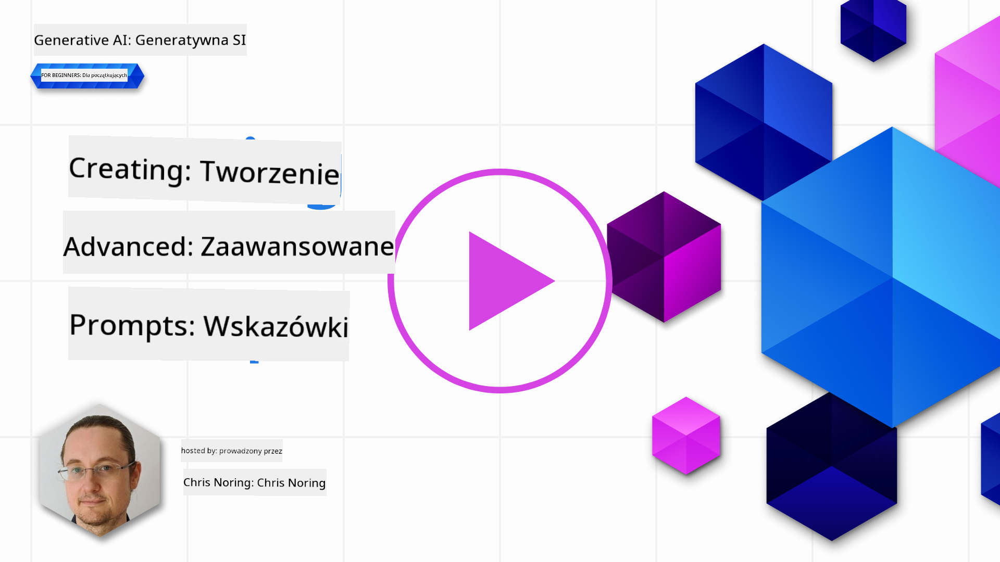

<!--
CO_OP_TRANSLATOR_METADATA:
{
  "original_hash": "b2651fb16bcfbc62b8e518751ed90fdb",
  "translation_date": "2025-10-18T00:49:36+00:00",
  "source_file": "05-advanced-prompts/README.md",
  "language_code": "pl"
}
-->
# Tworzenie zaawansowanych promptów

[](https://youtu.be/BAjzkaCdRok?si=NmUIyRf7-cDgbjtt)

Podsumujmy najważniejsze informacje z poprzedniego rozdziału:

> Inżynieria promptów to proces, w którym **kierujemy model w stronę bardziej trafnych odpowiedzi**, dostarczając bardziej użyteczne instrukcje lub kontekst.

Pisanie promptów składa się z dwóch etapów: konstruowania promptu poprzez dostarczenie odpowiedniego kontekstu oraz _optymalizacji_, czyli stopniowego ulepszania promptu.

Na tym etapie mamy już podstawowe zrozumienie, jak pisać prompty, ale musimy zagłębić się w temat. W tym rozdziale przejdziesz od testowania różnych promptów do zrozumienia, dlaczego jeden prompt jest lepszy od drugiego. Nauczysz się, jak konstruować prompty, stosując podstawowe techniki, które można zastosować w każdym LLM.

## Wprowadzenie

W tym rozdziale omówimy następujące tematy:

- Rozszerzenie wiedzy na temat inżynierii promptów poprzez zastosowanie różnych technik.
- Konfigurowanie promptów w celu uzyskania zróżnicowanych wyników.

## Cele nauki

Po ukończeniu tej lekcji będziesz w stanie:

- Zastosować techniki inżynierii promptów, które poprawiają wyniki.
- Tworzyć prompty generujące wyniki zróżnicowane lub deterministyczne.

## Inżynieria promptów

Inżynieria promptów to proces tworzenia promptów, które generują pożądane wyniki. Inżynieria promptów to coś więcej niż tylko pisanie tekstowego promptu. Nie jest to dyscyplina inżynierska, ale raczej zestaw technik, które można zastosować, aby osiągnąć zamierzony rezultat.

### Przykład promptu

Weźmy podstawowy prompt, taki jak ten:

> Wygeneruj 10 pytań dotyczących geografii.

W tym promptcie faktycznie stosujesz zestaw różnych technik.

Rozłóżmy go na części.

- **Kontekst**, określasz, że ma dotyczyć "geografii".
- **Ograniczenie wyniku**, chcesz, aby było nie więcej niż 10 pytań.

### Ograniczenia prostych promptów

Możesz, ale nie musisz, uzyskać pożądany wynik. Pytania zostaną wygenerowane, ale geografia to szeroki temat i możesz nie uzyskać tego, czego oczekujesz z następujących powodów:

- **Szeroki temat**, nie wiesz, czy będzie to dotyczyć krajów, stolic, rzek itd.
- **Format**, co jeśli chciałbyś, aby pytania miały określony format?

Jak widać, jest wiele rzeczy do rozważenia podczas tworzenia promptów.

Do tej pory widzieliśmy prosty przykład promptu, ale generatywna sztuczna inteligencja jest zdolna do znacznie więcej, aby pomóc ludziom w różnych rolach i branżach. Przyjrzyjmy się teraz podstawowym technikom.

### Techniki tworzenia promptów

Najpierw musimy zrozumieć, że tworzenie promptów jest _właściwością emergentną_ LLM, co oznacza, że nie jest to funkcja wbudowana w model, ale raczej coś, co odkrywamy podczas jego używania.

Istnieje kilka podstawowych technik, które możemy zastosować do tworzenia promptów w LLM. Przyjrzyjmy się im.

- **Zero-shot prompting**, to najprostsza forma tworzenia promptów. Polega na pojedynczym promptcie, który prosi o odpowiedź od LLM wyłącznie na podstawie jego danych treningowych.
- **Few-shot prompting**, ten rodzaj promptu prowadzi LLM, dostarczając 1 lub więcej przykładów, na których może się oprzeć, aby wygenerować odpowiedź.
- **Chain-of-thought**, ten rodzaj promptu instruuje LLM, jak rozłożyć problem na kroki.
- **Generated knowledge**, aby poprawić odpowiedź promptu, możesz dostarczyć dodatkowe fakty lub wiedzę wygenerowaną w ramach promptu.
- **Least to most**, podobnie jak chain-of-thought, ta technika polega na rozbiciu problemu na serię kroków, które następnie są wykonywane w określonej kolejności.
- **Self-refine**, ta technika polega na krytycznej ocenie odpowiedzi LLM i poproszeniu go o jej poprawienie.
- **Maieutic prompting**, tutaj chodzi o upewnienie się, że odpowiedź LLM jest poprawna, prosząc go o wyjaśnienie różnych części odpowiedzi. Jest to forma self-refine.

### Zero-shot prompting

Ten styl promptu jest bardzo prosty, składa się z pojedynczego promptu. Ta technika jest prawdopodobnie tym, czego używasz, gdy zaczynasz uczyć się o LLM. Oto przykład:

- Prompt: "Co to jest algebra?"
- Odpowiedź: "Algebra to gałąź matematyki zajmująca się badaniem symboli matematycznych i zasad ich manipulacji."

### Few-shot prompting

Ten styl promptu pomaga modelowi, dostarczając kilka przykładów wraz z zapytaniem. Składa się z pojedynczego promptu z dodatkowymi danymi specyficznymi dla zadania. Oto przykład:

- Prompt: "Napisz wiersz w stylu Szekspira. Oto kilka przykładów sonetów Szekspira:
  Sonet 18: 'Czy mam cię porównać do letniego dnia? Jesteś bardziej piękny i bardziej umiarkowany...'
  Sonet 116: 'Niech nie będzie przeszkód w małżeństwie prawdziwych umysłów. Miłość nie jest miłością, która zmienia się, gdy zmiana się pojawia...'
  Sonet 132: 'Twoje oczy kocham, a one, jakby litując się nade mną, Znając twoje serce, dręczą mnie pogardą,...'
  Teraz napisz sonet o pięknie księżyca."
- Odpowiedź: "Na niebie księżyc łagodnie lśni, W srebrzystym blasku, który rzuca swą łaskę,..."

Przykłady dostarczają LLM kontekstu, formatu lub stylu pożądanego wyniku. Pomagają modelowi zrozumieć konkretne zadanie i generować bardziej trafne odpowiedzi.

### Chain-of-thought

Chain-of-thought to bardzo interesująca technika, ponieważ polega na przeprowadzeniu LLM przez serię kroków. Pomysł polega na instruowaniu LLM w taki sposób, aby zrozumiał, jak coś zrobić. Rozważmy następujący przykład, z i bez chain-of-thought:

    - Prompt: "Alicja ma 5 jabłek, rzuca 3 jabłka, daje 2 Bobowi, a Bob oddaje jedno, ile jabłek ma Alicja?"
    - Odpowiedź: 5

LLM odpowiada 5, co jest błędne. Poprawna odpowiedź to 1 jabłko, biorąc pod uwagę obliczenia (5 - 3 - 2 + 1 = 1).

Jak możemy nauczyć LLM, aby zrobił to poprawnie?

Spróbujmy chain-of-thought. Zastosowanie chain-of-thought oznacza:

1. Podaj LLM podobny przykład.
1. Pokaż obliczenia i jak je poprawnie wykonać.
1. Dostarcz oryginalny prompt.

Oto jak to wygląda:

- Prompt: "Lisa ma 7 jabłek, rzuca 1 jabłko, daje 4 jabłka Bartowi, a Bart oddaje jedno:
  7 -1 = 6
  6 -4 = 2
  2 +1 = 3  
  Alicja ma 5 jabłek, rzuca 3 jabłka, daje 2 Bobowi, a Bob oddaje jedno, ile jabłek ma Alicja?"
  Odpowiedź: 1

Zauważ, jak piszemy znacznie dłuższe prompty z innym przykładem, obliczeniami, a następnie oryginalnym promptem i dochodzimy do poprawnej odpowiedzi 1.

Jak widać, chain-of-thought to bardzo potężna technika.

### Generated knowledge

Często, gdy chcesz skonstruować prompt, chcesz to zrobić, używając danych swojej firmy. Chcesz, aby część promptu pochodziła z firmy, a druga część była faktycznym promptem, który Cię interesuje.

Na przykład, jeśli pracujesz w branży ubezpieczeniowej, Twój prompt może wyglądać tak:

```text
{{company}}: {{company_name}}
{{products}}:
{{products_list}}
Please suggest an insurance given the following budget and requirements:
Budget: {{budget}}
Requirements: {{requirements}}
```

Powyżej widzisz, jak prompt jest skonstruowany za pomocą szablonu. W szablonie znajduje się kilka zmiennych, oznaczonych jako `{{variable}}`, które zostaną zastąpione rzeczywistymi wartościami z API firmy.

Oto przykład, jak może wyglądać prompt po zastąpieniu zmiennych treścią z Twojej firmy:

```text
Insurance company: ACME Insurance
Insurance products (cost per month):
- Car, cheap, 500 USD
- Car, expensive, 1100 USD
- Home, cheap, 600 USD
- Home, expensive, 1200 USD
- Life, cheap, 100 USD

Please suggest an insurance given the following budget and requirements:
Budget: $1000
Requirements: Car, Home, and Life insurance
```

Uruchomienie tego promptu w LLM wygeneruje odpowiedź taką jak ta:

```output
Given the budget and requirements, we suggest the following insurance package from ACME Insurance:
- Car, cheap, 500 USD
- Home, cheap, 600 USD
- Life, cheap, 100 USD
Total cost: $1,200 USD
```

Jak widać, sugeruje również ubezpieczenie na życie, czego nie powinien. Ten wynik wskazuje, że musimy zoptymalizować prompt, zmieniając go tak, aby był bardziej precyzyjny. Po kilku _próbach i błędach_ dochodzimy do następującego promptu:

```text
Insurance company: ACME Insurance
Insurance products (cost per month):
- type: Car, cheap, cost: 500 USD
- type: Car, expensive, cost: 1100 USD
- type: Home, cheap, cost: 600 USD
- type: Home, expensive, cost: 1200 USD
- type: Life, cheap, cost: 100 USD

Please suggest an insurance given the following budget and requirements:
Budget: $1000 restrict choice to types: Car, Home
```

Zauważ, jak dodanie _typu_ i _kosztu_, a także użycie słowa kluczowego _ograniczenie_ pomaga LLM zrozumieć, czego chcemy.

Teraz otrzymujemy następującą odpowiedź:

```output
Given the budget and requirements, we suggest the Car, Cheap insurance product which costs 500 USD per month.
```

Celem tego przykładu było pokazanie, że nawet jeśli używamy podstawowej techniki, takiej jak _generated knowledge_, w większości przypadków nadal musimy zoptymalizować prompt, aby uzyskać pożądany wynik.

### Least-to-most

Pomysł na Least-to-most prompting polega na rozbiciu większego problemu na podproblemy. W ten sposób pomagasz LLM "pokonać" większy problem. Dobrym przykładem może być analiza danych, gdzie możesz poprosić LLM o podzielenie problemu w następujący sposób:

> Prompt: Jak przeprowadzić analizę danych w 5 krokach?

Twoja odpowiedź od asystenta AI:

1. Zbierz dane
1. Oczyść dane
1. Przeanalizuj dane
1. Zrób wykres danych
1. Przedstaw dane

### Self-refine, krytyka wyników

W przypadku generatywnej sztucznej inteligencji i LLM nie można w pełni ufać wynikom. Musisz je zweryfikować. W końcu LLM prezentuje tylko to, co jest najbardziej prawdopodobne do powiedzenia, a nie to, co jest poprawne. Dlatego dobrym pomysłem jest poproszenie LLM o krytykę własnych wyników, co prowadzi nas do techniki self-refine.

Jak to działa? Postępuj zgodnie z następującymi krokami:

1. Początkowy prompt, w którym prosisz LLM o rozwiązanie problemu.
1. LLM odpowiada.
1. Krytykujesz odpowiedź i prosisz AI o poprawę.
1. LLM odpowiada ponownie, tym razem uwzględniając krytykę i sugerując rozwiązania, które wymyślił.

Możesz powtarzać ten proces tyle razy, ile chcesz.

Oto przykład użycia tej techniki:

> Prompt: "Stwórz Python Web API z trasami products i customers"

Odpowiedź AI:

```python
import flask
app = Flask(__name__)

@app.route('/products')
def products():
    return 'Products'

@app.route('/customers')
def customers():
    return 'Customers'
```

> Prompt: zaproponuj 3 ulepszenia powyższego kodu

Odpowiedź AI:

```text
Sure, here are three suggestions to improve the code:

Import the correct module: The first line should import Flask instead of flask. The correct import statement should be from flask import Flask.

Add a main function: Add a if __name__ == '__main__': block to the end of the file to run the application when the file is executed.

Use f-strings: Use f-strings to format the return statements in the route functions. For example, return 'Products' can be changed to return f'This is the {request.path} page'.
```

```python
from flask import Flask, request

app = Flask(__name__)

@app.route('/products')
def products():
    return f'This is the {request.path} page'

@app.route('/customers')
def customers():
    return f'This is the {request.path} page'

if __name__ == '__main__':
    app.run()
```

Jak widać, powyższa odpowiedź AI poprawia pierwszy zaproponowany kod dzięki krytyce pierwszej odpowiedzi.

### Maieutic prompting

Maieutic prompting to technika podobna do self-refine, ale bardziej polega na proszeniu LLM o wyjaśnienie swoich odpowiedzi. Celem jest zmniejszenie niespójności w wynikach LLM, aby upewnić się, że dochodzi do poprawnej odpowiedzi. Proces wygląda następująco:

1. Poproś LLM o odpowiedź na pytanie.
1. Dla każdej części odpowiedzi poproś LLM o bardziej szczegółowe wyjaśnienie.
1. Jeśli występują niespójności, odrzuć części, które są niespójne.

Powtarzaj kroki 2 i 3, aż przejdziesz przez wszystkie części i będziesz zadowolony z odpowiedzi.

Oto przykład promptu:

> prompt: Jak mogę stworzyć plan kryzysowy, aby złagodzić skutki pandemii w 5 krokach?
> Odpowiedź LLM:

```text
1. Identify the risks
1. Identify the stakeholders
1. Identify the resources
1. Identify the actions
1. Identify the communication channels
```

Zidentyfikowano 5 kroków, ale czy możemy stwierdzić, że są poprawne? Zapytajmy LLM o wyjaśnienie każdego kroku:

> prompt: Wyjaśnij pierwszy krok bardziej szczegółowo, jakie są szczegółowe ryzyka związane z pandemią?

```text
The risks are the following:

- Loss of life
- Loss of business
- Loss of reputation
- Loss of customers
- Loss of employees
```

Na tym etapie chcemy upewnić się, że LLM jest poprawny, więc prosimy go o wyjaśnienie pierwszego ryzyka bardziej szczegółowo i mamy nadzieję, że jest zgodne z powyższą odpowiedzią:

> prompt: W pandemii, jakie jest największe ryzyko i dlaczego?

```text
The biggest risk is loss of life because it's the most important thing to protect.
```

> Jakie są dwa największe ryzyka w pandemii?

```text
The two biggest risks are loss of life and loss of business.
```

Na tym etapie LLM jest spójny i wspomina "życie" i "biznes" jako dwa największe ryzyka. Możemy teraz przejść do następnego kroku i czuć się dość pewnie. Jednak nie powinniśmy ślepo ufać LLM, zawsze należy weryfikować wyniki.

## Zróżnicowanie wyników

LLM są z natury niedeterministyczne, co oznacza, że za każdym razem, gdy uruchomisz ten sam prompt, możesz otrzymać różne wyniki. Spróbuj na przykład tego promptu:

> "Wygeneruj kod dla Python Web API"

```python
# Import necessary modules
import flask
from flask import request, jsonify

# Create a Flask app
app = flask.Flask(__name__)

# Create a route for the API
@app.route('/api', methods=['GET'])
def api():
    # Get the data from the request
    data = request.args

    # Process the data
    result = process_data(data)

    # Return the result as JSON
    return jsonify(result)

# Function to process the data
def process_data(data):
    # Do something with the data
    result = data + 1

    # Return the result
    return result

# Run the app
if __name__ == '__main__':
    app.run()

```

Uruchomienie tego samego promptu ponownie generuje nieco inną odpowiedź:

```python
#import necessary packages
import flask
from flask import request, jsonify

#create the Flask application
app = flask.Flask(__name__)
app.config["DEBUG"] = True

#create a list of books
books = [
    {'id': 0,
     'title': 'A Fire Upon the Deep',
     'author': 'Vernor Vinge',
     'first_sentence': 'The coldsleep itself was dreamless.',
     'year_published': '1992'},
    {'id': 1,
     'title': 'The Ones Who Walk Away From Omelas',
     'author': 'Ursula K. Le Guin',
     'first_sentence': 'With a clamor of bells that set the swallows soaring, the Festival of Summer came to the city Omelas, bright-towered by the sea.',
     'published': '1973'},
    {'id': 2,
     'title': 'Dhalgren',
     'author': 'Samuel R. Delany',
     'first_sentence': 'to wound the autumnal city.',
     'published': '1975'}
]

#create an endpoint for the API
@app.route('/', methods=['GET'])
def home():
    return '''<h1>Books API</h1>
<p>A prototype API for retrieving books.</p>'''

#create an endpoint to return all books
@app.route('/api/v1/resources/books/all', methods=['GET'])
def api_all():
    return jsonify(books)

#create an endpoint to return a single book
@app.route('/api/v1/resources/books', methods=['GET'])
def api_id():
    #check if an ID was provided as part of the URL
    #if ID is provided, assign it to a variable
    #if no ID is provided, display an error
    if 'id' in request.args:
        id = int(request.args['id'])
    else:
        return "Error: No id field provided. Please specify an id."

    #create an empty list for our results
    results = []

    #loop through the data and match results that fit the requested ID
    #IDs are unique, but other fields might return many results
    for book in books:
        if book['id'] == id:
            results.append(book)

    #use the jsonify function from Flask to convert our list of
    #Python dictionaries to the JSON format
    return jsonify(results)

app.run()
```

> Czy zróżnicowane wyniki są problemem?

To zależy od tego, co próbujesz osiągnąć. Jeśli chcesz uzyskać konkretną odpowiedź, to jest to problem. Jeśli akceptujesz zróżnicowane wyniki, takie jak "Wygeneruj dowolne 3 pytania dotyczące geografii", to nie jest to problem.

### Użycie temperatury do zróżnicowania wyników

Ok, więc zdecydowaliśmy, że chcemy ograniczyć wyniki, aby były bardziej przewidywalne, czyli bardziej deterministyczne. Jak to zrobić?

Temperatura to wartość między 0 a 1, gdzie 0 oznacza najbardziej deterministyczne wyniki, a 1 najbardziej zróżnicowane. Domyślna wartość to 0.7. Zobaczmy, co się stanie przy dwóch uruchomieniach tego samego promptu z ustawioną temperaturą na 0.1:

> "Wygeneruj kod dla Python Web API"

```python
#import necessary libraries
import flask
from flask import request, jsonify

#create an instance of the Flask class
app = flask.Flask(__name__)

#create an endpoint for the API
@app.route('/api/v1/endpoint', methods=['GET'])
def api_endpoint():
    #get the request data
    data = request.get_json()

    #process the data
    result = process_data(data)

    #return the result
    return jsonify(result)

#function to process the data
def process_data(data):
    #process the data
    result = {'result': 'success'}

    #return the result
    return result

#run the Flask app
if __name__ == '__main__':
    app.run()

```

Ponowne uruchomienie promptu daje taki wynik:

```python
#import necessary libraries
import flask
from flask import request, jsonify

#create a Flask app
app = flask.Flask(__name__)

#create a route for the API
@app.route('/api', methods=['GET'])
def api_call():
    #get the data from the request
    data = request.get_json()

    #process the data
    result = process_data(data)

    #return the result
    return jsonify(result)

#define the process_data function
def process_data(data):
    #do something with the data
    result = data + 1

    #return the result
    return result

#run the app
if __name__ == '__main__':
    app.run()

```

Różnica między tymi dwoma wynikami jest minimalna. Tym razem zróbmy odwrotnie, ustawmy temperaturę na 0.9:

```python
# Import necessary libraries
import flask
from flask import request, jsonify

# Create a Flask app
app = flask.Flask(__name__)

# Create a route for the API
@app.route('/api', methods=['GET'])
def api_call():
    # Get the data from the request
    data = request.args

    # Process the data
    result = process_data(data)

    # Return the result
    return jsonify(result)

# Function to process the data
def process_data(data):
    # Do something with the data
    result = data + 1

    # Return the result
    return result

# Run the app
if __name__ == '__main__':
    app.run()

```

i drugie podejście przy wartości temperatury 0.9:

```python
import flask
from flask import request, jsonify

# create the Flask app
app = flask.Flask(__name__)
app.config['DEBUG'] = True

# create some test data
books = [
    {'id': 0, 'title': 'A Fire Upon The Deep', 'author': 'Vernor Vinge', 'first_sentence': 'The coldsleep itself was dreamless.', 'year_published': '1992'},
    {'id': 1, 'title': 'The Ones Who Walk Away From Omelas', 'author': 'Ursula K. Le Guin', 'first_sentence': 'With a clamor of bells that set the swallows soaring, the Festival of Summer came to the city Omelas, bright-towered by the sea.', 'published': '1973'},
    {'id': 2, 'title': 'Dhalgren', 'author': 'Samuel R. Delany', 'first_sentence': 'to wound the autumnal city.', 'published': '1975'}
]

# create an endpoint
@app.route('/', methods=['GET'])
def home():
    return '''<h1>Welcome to our book API!</h1>'''

@app.route('/api/v1/resources/books

```

Jak widać, wyniki nie mogłyby być bardziej zróżnicowane.

> Pamiętaj, że istnieje więcej parametrów, które możesz zmienić, aby zróżnicować wyniki, takich jak top-k, top-p, kara za powtórzenia, kara za długość i kara za różnorodność, ale są one poza zakresem tego programu nauczania.

## Dobre praktyki

Istnieje wiele praktyk, które możesz zastosować, aby osiągnąć zamierzony efekt. Z czasem, korzystając z techniki promptingu, wypracujesz swój własny styl.

Oprócz technik, które omówiliśmy, warto wziąć pod uwagę kilka dobrych praktyk podczas tworzenia promptów dla LLM.

Oto kilka dobrych praktyk, które warto rozważyć:

- **Określ kontekst**. Kontekst ma znaczenie – im więcej szczegółów podasz, takich jak dziedzina, temat itd., tym lepiej.
- Ogranicz wynik. Jeśli chcesz określoną liczbę elementów lub konkretną długość, wyraźnie to zaznacz.
- **Określ zarówno co, jak i jak**. Pamiętaj, aby wspomnieć zarówno, co chcesz, jak i jak chcesz to osiągnąć, na przykład: "Stwórz Python Web API z trasami dla produktów i klientów, podziel je na 3 pliki".
- **Używaj szablonów**. Często będziesz chciał wzbogacić swoje prompty o dane z Twojej firmy. Używaj szablonów, aby to zrobić. Szablony mogą zawierać zmienne, które zastępujesz rzeczywistymi danymi.
- **Pisownia ma znaczenie**. LLM może dostarczyć poprawną odpowiedź, ale jeśli piszesz poprawnie, otrzymasz lepszą odpowiedź.

## Zadanie

Oto kod w Pythonie pokazujący, jak zbudować prosty API za pomocą Flask:

```python
from flask import Flask, request

app = Flask(__name__)

@app.route('/')
def hello():
    name = request.args.get('name', 'World')
    return f'Hello, {name}!'

if __name__ == '__main__':
    app.run()
```

Użyj asystenta AI, takiego jak GitHub Copilot lub ChatGPT, i zastosuj technikę "self-refine", aby ulepszyć kod.

## Rozwiązanie

Spróbuj rozwiązać zadanie, dodając odpowiednie prompty do kodu.

> [!TIP]
> Sformułuj prompt, aby poprosić o ulepszenie. Dobrym pomysłem jest ograniczenie liczby ulepszeń. Możesz również poprosić o ulepszenie w określony sposób, na przykład pod kątem architektury, wydajności, bezpieczeństwa itd.

[Rozwiązanie](../../../05-advanced-prompts/python/aoai-solution.py)

## Sprawdzenie wiedzy

Dlaczego warto używać promptingu typu chain-of-thought? Pokaż 1 poprawną odpowiedź i 2 niepoprawne odpowiedzi.

1. Aby nauczyć LLM, jak rozwiązać problem.
1. B, Aby nauczyć LLM znajdowania błędów w kodzie.
1. C, Aby instruować LLM, aby wymyśliło różne rozwiązania.

A: 1, ponieważ chain-of-thought polega na pokazaniu LLM, jak rozwiązać problem, dostarczając mu serię kroków, podobnych problemów i sposobów ich rozwiązania.

## 🚀 Wyzwanie

Właśnie użyłeś techniki self-refine w zadaniu. Weź dowolny program, który stworzyłeś, i zastanów się, jakie ulepszenia chciałbyś wprowadzić. Następnie użyj techniki self-refine, aby zastosować proponowane zmiany. Co sądzisz o wyniku – lepszy czy gorszy?

## Świetna robota! Kontynuuj naukę

Po ukończeniu tej lekcji, sprawdź naszą [kolekcję nauki o generatywnej AI](https://aka.ms/genai-collection?WT.mc_id=academic-105485-koreyst), aby dalej rozwijać swoją wiedzę o generatywnej AI!

Przejdź do Lekcji 6, gdzie zastosujemy naszą wiedzę o inżynierii promptów, [budując aplikacje do generowania tekstu](../06-text-generation-apps/README.md?WT.mc_id=academic-105485-koreyst).

---

**Zastrzeżenie**:  
Ten dokument został przetłumaczony za pomocą usługi tłumaczenia AI [Co-op Translator](https://github.com/Azure/co-op-translator). Chociaż staramy się zapewnić dokładność, prosimy pamiętać, że automatyczne tłumaczenia mogą zawierać błędy lub nieścisłości. Oryginalny dokument w jego rodzimym języku powinien być uznawany za wiarygodne źródło. W przypadku informacji krytycznych zaleca się skorzystanie z profesjonalnego tłumaczenia przez człowieka. Nie ponosimy odpowiedzialności za jakiekolwiek nieporozumienia lub błędne interpretacje wynikające z użycia tego tłumaczenia.