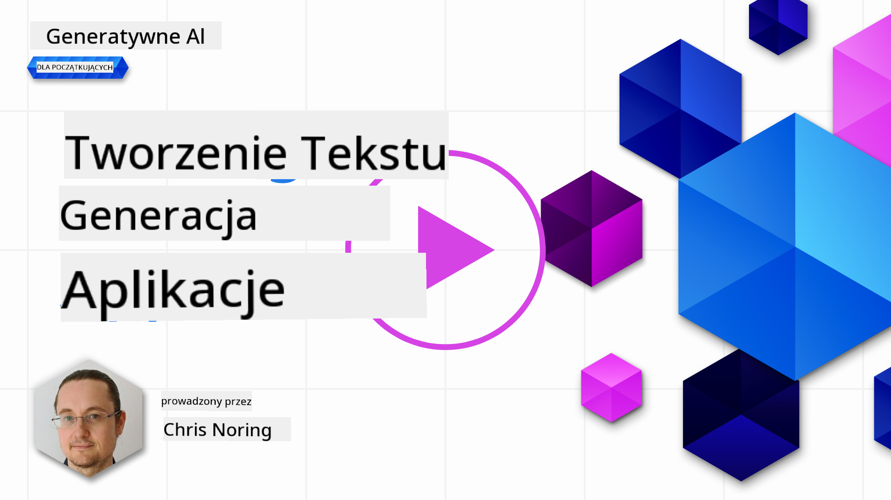

<!--
CO_OP_TRANSLATOR_METADATA:
{
  "original_hash": "ce8224073b86b728ed52b19bed7932fd",
  "translation_date": "2025-07-09T11:56:20+00:00",
  "source_file": "06-text-generation-apps/README.md",
  "language_code": "pl"
}
-->
# Tworzenie aplikacji do generowania tekstu

[](https://aka.ms/gen-ai-lesson6-gh?WT.mc_id=academic-105485-koreyst)

> _(Kliknij powyższy obraz, aby obejrzeć wideo z tej lekcji)_

Do tej pory w tym kursie widziałeś, że istnieją podstawowe pojęcia, takie jak prompt, a nawet cała dziedzina zwana „inżynierią promptów”. Wiele narzędzi, z którymi możesz się komunikować, jak ChatGPT, Office 365, Microsoft Power Platform i inne, wspiera Cię w używaniu promptów do realizacji różnych zadań.

Aby dodać takie doświadczenie do aplikacji, musisz zrozumieć pojęcia takie jak prompt, completion oraz wybrać bibliotekę do pracy. Dokładnie tego nauczysz się w tym rozdziale.

## Wprowadzenie

W tym rozdziale:

- Poznasz bibliotekę openai i jej podstawowe pojęcia.
- Zbudujesz aplikację do generowania tekstu z użyciem openai.
- Zrozumiesz, jak używać pojęć takich jak prompt, temperature i tokens do tworzenia aplikacji generującej tekst.

## Cele nauki

Po zakończeniu tej lekcji będziesz potrafił:

- Wyjaśnić, czym jest aplikacja do generowania tekstu.
- Zbudować aplikację do generowania tekstu z użyciem openai.
- Skonfigurować aplikację tak, aby używała więcej lub mniej tokenów oraz zmieniać temperaturę, aby uzyskać różnorodne wyniki.

## Czym jest aplikacja do generowania tekstu?

Zazwyczaj, gdy tworzysz aplikację, ma ona jakiś interfejs, na przykład:

- Oparty na poleceniach. Aplikacje konsolowe to typowe programy, w których wpisujesz polecenie, a ono wykonuje zadanie. Na przykład `git` to aplikacja oparta na poleceniach.
- Interfejs użytkownika (UI). Niektóre aplikacje mają graficzne interfejsy użytkownika (GUI), gdzie klikasz przyciski, wpisujesz tekst, wybierasz opcje i więcej.

### Aplikacje konsolowe i UI mają ograniczenia

Porównaj to z aplikacją opartą na poleceniach, gdzie wpisujesz komendę:

- **Jest ograniczona**. Nie możesz wpisać dowolnej komendy, tylko te, które aplikacja obsługuje.
- **Specyficzna dla języka**. Niektóre aplikacje obsługują wiele języków, ale domyślnie są zbudowane pod konkretny język, nawet jeśli można dodać wsparcie dla innych.

### Zalety aplikacji do generowania tekstu

Czym więc różni się aplikacja do generowania tekstu?

W takiej aplikacji masz większą elastyczność, nie jesteś ograniczony do zestawu poleceń czy konkretnego języka wejściowego. Zamiast tego możesz używać naturalnego języka do interakcji z aplikacją. Kolejną zaletą jest to, że korzystasz z modelu, który został wytrenowany na ogromnym zbiorze danych, podczas gdy tradycyjna aplikacja może być ograniczona do tego, co jest w bazie danych.

### Co mogę zbudować z aplikacją do generowania tekstu?

Możesz stworzyć wiele rzeczy, na przykład:

- **Chatbota**. Chatbot odpowiadający na pytania dotyczące tematów, takich jak Twoja firma i jej produkty, może być dobrym rozwiązaniem.
- **Pomocnika**. LLM świetnie radzą sobie z zadaniami takimi jak streszczanie tekstu, wyciąganie wniosków, tworzenie tekstów, np. CV i wiele innych.
- **Asystenta kodu**. W zależności od używanego modelu językowego, możesz stworzyć asystenta kodu, który pomoże Ci pisać kod. Na przykład możesz użyć produktów takich jak GitHub Copilot czy ChatGPT, aby wspierać pisanie kodu.

## Jak zacząć?

Musisz znaleźć sposób na integrację z LLM, co zwykle oznacza dwie metody:

- Użycie API. Tworzysz zapytania webowe z promptem i otrzymujesz wygenerowany tekst.
- Użycie biblioteki. Biblioteki ułatwiają wywoływanie API i sprawiają, że jest to prostsze.

## Biblioteki/SDK

Istnieje kilka dobrze znanych bibliotek do pracy z LLM, takich jak:

- **openai** – ta biblioteka ułatwia połączenie z modelem i wysyłanie promptów.

Są też biblioteki działające na wyższym poziomie, takie jak:

- **Langchain** – popularna biblioteka wspierająca Pythona.
- **Semantic Kernel** – biblioteka Microsoftu wspierająca języki C#, Python i Java.

## Pierwsza aplikacja z użyciem openai

Zobaczmy, jak zbudować pierwszą aplikację, jakie biblioteki są potrzebne, ile to zajmuje i tak dalej.

### Instalacja openai

Istnieje wiele bibliotek do interakcji z OpenAI lub Azure OpenAI. Można używać różnych języków programowania, takich jak C#, Python, JavaScript, Java i inne. My wybraliśmy bibliotekę `openai` dla Pythona, więc użyjemy `pip` do instalacji.

```bash
pip install openai
```

### Utwórz zasób

Musisz wykonać następujące kroki:

- Załóż konto na Azure [https://azure.microsoft.com/free/](https://azure.microsoft.com/free/?WT.mc_id=academic-105485-koreyst).
- Uzyskaj dostęp do Azure OpenAI. Przejdź do [https://learn.microsoft.com/azure/ai-services/openai/overview#how-do-i-get-access-to-azure-openai](https://learn.microsoft.com/azure/ai-services/openai/overview#how-do-i-get-access-to-azure-openai?WT.mc_id=academic-105485-koreyst) i złóż wniosek o dostęp.

  > [!NOTE]
  > W momencie pisania tego tekstu, musisz złożyć wniosek o dostęp do Azure OpenAI.

- Zainstaluj Pythona <https://www.python.org/>
- Utwórz zasób Azure OpenAI Service. Zobacz przewodnik, jak [utworzyć zasób](https://learn.microsoft.com/azure/ai-services/openai/how-to/create-resource?pivots=web-portal?WT.mc_id=academic-105485-koreyst).

### Znajdź klucz API i endpoint

Na tym etapie musisz powiedzieć bibliotece `openai`, którego klucza API użyć. Aby znaleźć swój klucz API, przejdź do sekcji „Keys and Endpoint” w zasobie Azure OpenAI i skopiuj wartość „Key 1”.


Mając te informacje, poinstruujmy bibliotekę, aby z nich korzystała.

> [!NOTE]
> Warto oddzielić klucz API od kodu. Możesz to zrobić, używając zmiennych środowiskowych.
>
> - Ustaw zmienną środowiskową `OPENAI_API_KEY` na swój klucz API.
>   `export OPENAI_API_KEY='sk-...'`

### Konfiguracja Azure

Jeśli korzystasz z Azure OpenAI, oto jak skonfigurować ustawienia:

```python
openai.api_type = 'azure'
openai.api_key = os.environ["OPENAI_API_KEY"]
openai.api_version = '2023-05-15'
openai.api_base = os.getenv("API_BASE")
```

Powyżej ustawiamy:

- `api_type` na `azure`. Informuje to bibliotekę, że ma używać Azure OpenAI, a nie OpenAI.
- `api_key` – Twój klucz API znaleziony w Azure Portal.
- `api_version` – wersja API, której chcesz użyć. W momencie pisania najnowsza to `2023-05-15`.
- `api_base` – endpoint API. Znajdziesz go w Azure Portal obok klucza API.

> [!NOTE] > `os.getenv` to funkcja, która odczytuje zmienne środowiskowe. Możesz jej użyć do odczytu zmiennych takich jak `OPENAI_API_KEY` i `API_BASE`. Ustaw te zmienne w terminalu lub użyj biblioteki takiej jak `dotenv`.

## Generowanie tekstu

Aby wygenerować tekst, używamy klasy `Completion`. Oto przykład:

```python
prompt = "Complete the following: Once upon a time there was a"

completion = openai.Completion.create(model="davinci-002", prompt=prompt)
print(completion.choices[0].text)
```

W powyższym kodzie tworzymy obiekt completion, przekazujemy model, którego chcemy użyć, oraz prompt. Następnie wypisujemy wygenerowany tekst.

### Chat completions

Do tej pory widziałeś, jak używamy `Completion` do generowania tekstu. Jest jednak inna klasa, `ChatCompletion`, która lepiej nadaje się do chatbotów. Oto przykład jej użycia:

```python
import openai

openai.api_key = "sk-..."

completion = openai.ChatCompletion.create(model="gpt-3.5-turbo", messages=[{"role": "user", "content": "Hello world"}])
print(completion.choices[0].message.content)
```

Więcej o tej funkcjonalności w nadchodzącym rozdziale.

## Ćwiczenie – Twoja pierwsza aplikacja do generowania tekstu

Teraz, gdy nauczyliśmy się, jak skonfigurować openai, czas zbudować pierwszą aplikację do generowania tekstu. Aby to zrobić, wykonaj następujące kroki:

1. Utwórz wirtualne środowisko i zainstaluj openai:

   ```bash
   python -m venv venv
   source venv/bin/activate
   pip install openai
   ```

   > [!NOTE]
   > Jeśli używasz Windows, wpisz `venv\Scripts\activate` zamiast `source venv/bin/activate`.

   > [!NOTE]
   > Znajdź swój klucz Azure OpenAI, przechodząc do [https://portal.azure.com/](https://portal.azure.com/?WT.mc_id=academic-105485-koreyst), wyszukaj `Open AI`, wybierz `Open AI resource`, a następnie `Keys and Endpoint` i skopiuj wartość `Key 1`.

1. Utwórz plik _app.py_ i wklej do niego następujący kod:

   ```python
   import openai

   openai.api_key = "<replace this value with your open ai key or Azure OpenAI key>"

   openai.api_type = 'azure'
   openai.api_version = '2023-05-15'
   openai.api_base = "<endpoint found in Azure Portal where your API key is>"
   deployment_name = "<deployment name>"

   # add your completion code
   prompt = "Complete the following: Once upon a time there was a"
   messages = [{"role": "user", "content": prompt}]

   # make completion
   completion = openai.chat.completions.create(model=deployment_name, messages=messages)

   # print response
   print(completion.choices[0].message.content)
   ```

   > [!NOTE]
   > Jeśli używasz Azure OpenAI, musisz ustawić `api_type` na `azure` i `api_key` na swój klucz Azure OpenAI.

   Powinieneś zobaczyć wynik podobny do poniższego:

   ```output
    very unhappy _____.

   Once upon a time there was a very unhappy mermaid.
   ```

## Różne typy promptów, do różnych zastosowań

Teraz widziałeś, jak generować tekst za pomocą promptu. Masz nawet działający program, który możesz modyfikować, aby generować różne rodzaje tekstu.

Promptów można używać do wielu zadań, na przykład:

- **Generowanie określonego typu tekstu**. Na przykład możesz wygenerować wiersz, pytania do quizu itp.
- **Wyszukiwanie informacji**. Możesz użyć promptów do znalezienia informacji, np. „Co oznacza CORS w tworzeniu stron internetowych?”.
- **Generowanie kodu**. Możesz generować kod, np. wyrażenia regularne do walidacji e-maili lub nawet cały program, np. aplikację webową.

## Bardziej praktyczny przykład: generator przepisów

Wyobraź sobie, że masz w domu składniki i chcesz coś ugotować. Do tego potrzebujesz przepisu. Możesz użyć wyszukiwarki lub LLM, aby go znaleźć.

Możesz napisać prompt tak:

> „Pokaż mi 5 przepisów na danie z następującymi składnikami: kurczak, ziemniaki i marchew. W każdym przepisie wypisz wszystkie użyte składniki.”

Na podstawie powyższego promptu możesz otrzymać odpowiedź podobną do:

```output
1. Roasted Chicken and Vegetables:
Ingredients:
- 4 chicken thighs
- 2 potatoes, cut into cubes
- 2 carrots, cut into cubes
- 2 tablespoons olive oil
- 2 cloves garlic, minced
- 1 teaspoon dried thyme
- 1 teaspoon dried oregano
- Salt and pepper, to taste

2. Chicken and Potato Stew:
Ingredients:
- 2 tablespoons olive oil
- 1 onion, diced
- 2 cloves garlic, minced
- 2 chicken breasts, cut into cubes
- 2 potatoes, cut into cubes
- 2 carrots, cut into cubes
- 1 teaspoon dried oregano
- 1 teaspoon dried thyme
- 1 cup chicken broth
- Salt and pepper, to taste

3. Chicken and Potato Bake:
Ingredients:
- 2 tablespoons olive oil
- 2 chicken breasts, cut into cubes
- 2 potatoes, cut into cubes
- 2 carrots, cut into cubes
- 1 onion, diced
- 2 cloves garlic, minced
- 1 teaspoon dried oregano
- 1 teaspoon dried thyme
- 1 cup chicken broth
- Salt and pepper, to taste

4. Chicken and Potato Soup:
Ingredients:
- 2 tablespoons olive oil
- 1 onion, diced
- 2 cloves garlic, minced
- 2 chicken breasts, cut into cubes
- 2 potatoes, cut into cubes
- 2 carrots, cut into cubes
- 1 teaspoon dried oregano
- 1 teaspoon dried thyme
- 4 cups chicken broth
- Salt and pepper, to taste

5. Chicken and Potato Hash:
Ingredients:
- 2 tablespoons olive oil
- 2 chicken breasts, cut into cubes
- 2 potatoes, cut into cubes
- 2 carrots, cut into cubes
- 1 onion, diced
- 2 cloves garlic, minced
- 1 teaspoon dried oregano
```

To świetny wynik, wiem, co ugotować. Na tym etapie przydatne mogłyby być następujące ulepszenia:

- Filtrowanie składników, których nie lubię lub na które jestem uczulony.
- Wygenerowanie listy zakupów, jeśli nie mam wszystkich składników w domu.

Dla powyższych przypadków dodajmy dodatkowy prompt:

> „Proszę usuń przepisy z czosnkiem, ponieważ jestem na niego uczulony i zastąp go czymś innym. Proszę też wygeneruj listę zakupów dla tych przepisów, biorąc pod uwagę, że mam już w domu kurczaka, ziemniaki i marchew.”

Teraz masz nowy wynik, mianowicie:

```output
1. Roasted Chicken and Vegetables:
Ingredients:
- 4 chicken thighs
- 2 potatoes, cut into cubes
- 2 carrots, cut into cubes
- 2 tablespoons olive oil
- 1 teaspoon dried thyme
- 1 teaspoon dried oregano
- Salt and pepper, to taste

2. Chicken and Potato Stew:
Ingredients:
- 2 tablespoons olive oil
- 1 onion, diced
- 2 chicken breasts, cut into cubes
- 2 potatoes, cut into cubes
- 2 carrots, cut into cubes
- 1 teaspoon dried oregano
- 1 teaspoon dried thyme
- 1 cup chicken broth
- Salt and pepper, to taste

3. Chicken and Potato Bake:
Ingredients:
- 2 tablespoons olive oil
- 2 chicken breasts, cut into cubes
- 2 potatoes, cut into cubes
- 2 carrots, cut into cubes
- 1 onion, diced
- 1 teaspoon dried oregano
- 1 teaspoon dried thyme
- 1 cup chicken broth
- Salt and pepper, to taste

4. Chicken and Potato Soup:
Ingredients:
- 2 tablespoons olive oil
- 1 onion, diced
- 2 chicken breasts, cut into cubes
- 2 potatoes, cut into cubes
- 2 carrots, cut into cubes
- 1 teaspoon dried oregano
- 1 teaspoon dried thyme
- 4 cups chicken broth
- Salt and pepper, to taste

5. Chicken and Potato Hash:
Ingredients:
- 2 tablespoons olive oil
- 2 chicken breasts, cut into cubes
- 2 potatoes, cut into cubes
- 2 carrots, cut into cubes
- 1 onion, diced
- 1 teaspoon dried oregano

Shopping List:
- Olive oil
- Onion
- Thyme
- Oregano
- Salt
- Pepper
```

To Twoje pięć przepisów bez czosnku i lista zakupów uwzględniająca to, co masz w domu.

## Ćwiczenie – zbuduj generator przepisów

Teraz, gdy przećwiczyliśmy scenariusz, napiszmy kod odpowiadający temu scenariuszowi. Wykonaj następujące kroki:

1. Użyj istniejącego pliku _app.py_ jako punktu wyjścia.
1. Znajdź zmienną `prompt` i zmień jej zawartość na następującą:

   ```python
   prompt = "Show me 5 recipes for a dish with the following ingredients: chicken, potatoes, and carrots. Per recipe, list all the ingredients used"
   ```

   Jeśli teraz uruchomisz kod, powinieneś zobaczyć wynik podobny do:

   ```output
   -Chicken Stew with Potatoes and Carrots: 3 tablespoons oil, 1 onion, chopped, 2 cloves garlic, minced, 1 carrot, peeled and chopped, 1 potato, peeled and chopped, 1 bay leaf, 1 thyme sprig, 1/2 teaspoon salt, 1/4 teaspoon black pepper, 1 1/2 cups chicken broth, 1/2 cup dry white wine, 2 tablespoons chopped fresh parsley, 2 tablespoons unsalted butter, 1 1/2 pounds boneless, skinless chicken thighs, cut into 1-inch pieces
   -Oven-Roasted Chicken with Potatoes and Carrots: 3 tablespoons extra-virgin olive oil, 1 tablespoon Dijon mustard, 1 tablespoon chopped fresh rosemary, 1 tablespoon chopped fresh thyme, 4 cloves garlic, minced, 1 1/2 pounds small red potatoes, quartered, 1 1/2 pounds carrots, quartered lengthwise, 1/2 teaspoon salt, 1/4 teaspoon black pepper, 1 (4-pound) whole chicken
   -Chicken, Potato, and Carrot Casserole: cooking spray, 1 large onion, chopped, 2 cloves garlic, minced, 1 carrot, peeled and shredded, 1 potato, peeled and shredded, 1/2 teaspoon dried thyme leaves, 1/4 teaspoon salt, 1/4 teaspoon black pepper, 2 cups fat-free, low-sodium chicken broth, 1 cup frozen peas, 1/4 cup all-purpose flour, 1 cup 2% reduced-fat milk, 1/4 cup grated Parmesan cheese

   -One Pot Chicken and Potato Dinner: 2 tablespoons olive oil, 1 pound boneless, skinless chicken thighs, cut into 1-inch pieces, 1 large onion, chopped, 3 cloves garlic, minced, 1 carrot, peeled and chopped, 1 potato, peeled and chopped, 1 bay leaf, 1 thyme sprig, 1/2 teaspoon salt, 1/4 teaspoon black pepper, 2 cups chicken broth, 1/2 cup dry white wine

   -Chicken, Potato, and Carrot Curry: 1 tablespoon vegetable oil, 1 large onion, chopped, 2 cloves garlic, minced, 1 carrot, peeled and chopped, 1 potato, peeled and chopped, 1 teaspoon ground coriander, 1 teaspoon ground cumin, 1/2 teaspoon ground turmeric, 1/2 teaspoon ground ginger, 1/4 teaspoon cayenne pepper, 2 cups chicken broth, 1/2 cup dry white wine, 1 (15-ounce) can chickpeas, drained and rinsed, 1/2 cup raisins, 1/2 cup chopped fresh cilantro
   ```

   > NOTE, Twój LLM jest niedeterministyczny, więc możesz za każdym razem otrzymać inne wyniki.

   Świetnie, zobaczmy, jak możemy to ulepszyć. Aby to zrobić, chcemy, aby kod był elastyczny, tak aby można było zmieniać składniki i liczbę przepisów.

1. Zmieńmy kod w następujący sposób:

   ```python
   no_recipes = input("No of recipes (for example, 5): ")

   ingredients = input("List of ingredients (for example, chicken, potatoes, and carrots): ")

   # interpolate the number of recipes into the prompt an ingredients
   prompt = f"Show me {no_recipes} recipes for a dish with the following ingredients: {ingredients}. Per recipe, list all the ingredients used"
   ```

   Testowy przebieg kodu może wyglądać tak:

   ```output
   No of recipes (for example, 5): 3
   List of ingredients (for example, chicken, potatoes, and carrots): milk,strawberries

   -Strawberry milk shake: milk, strawberries, sugar, vanilla extract, ice cubes
   -Strawberry shortcake: milk, flour, baking powder, sugar, salt, unsalted butter, strawberries, whipped cream
   -Strawberry milk: milk, strawberries, sugar, vanilla extract
   ```

### Ulepszanie przez dodanie filtra i listy zakupów

Mamy teraz działającą aplikację, która potrafi generować przepisy i jest elastyczna, ponieważ opiera się na danych wejściowych od użytkownika, zarówno co do liczby przepisów, jak i użytych składników.

Aby ją dalej ulepszyć, dodajmy:

- **Filtrowanie składników**. Chcemy móc odfiltrować składniki, których nie lubimy lub na które jesteśmy uczuleni. Aby to zrobić, możemy edytować istniejący prompt i dodać na końcu warunek filtra, tak jak poniżej:

  ```python
  filter = input("Filter (for example, vegetarian, vegan, or gluten-free): ")

  prompt = f"Show me {no_recipes} recipes for a dish with the following ingredients: {ingredients}. Per recipe, list all the ingredients used, no {filter}"
  ```

  Powyżej dodajemy `{filter}` na końcu promptu i pobieramy wartość filtra od użytkownika.

  Przykładowe uruchomienie programu może wyglądać tak:

  ```output
  No of recipes (for example, 5): 3
  List of ingredients (for example, chicken, potatoes, and carrots): onion,milk
  Filter (for example, vegetarian, vegan, or gluten-free): no milk

  1. French Onion Soup

  Ingredients:

  -1 large onion, sliced
  -3 cups beef broth
  -1 cup milk
  -6 slices french bread
  -1/4 cup shredded Parmesan cheese
  -1 tablespoon butter
  -1 teaspoon dried thyme
  -1/4 teaspoon salt
  -1/4 teaspoon black pepper

  Instructions:

  1. In a large pot, sauté onions in butter until golden brown.
  2. Add beef broth, milk, thyme, salt, and pepper. Bring to a boil.
  3. Reduce heat and simmer for 10 minutes.
  4. Place french bread slices on soup bowls.
  5. Ladle soup over bread.
  6. Sprinkle with Parmesan cheese.

  2. Onion and Potato Soup

  Ingredients:

  -1 large onion, chopped
  -2 cups potatoes, diced
  -3 cups vegetable broth
  -1 cup milk
  -1/4 teaspoon black pepper

  Instructions:

  1. In a large pot, sauté onions in butter until golden brown.
  2. Add potatoes, vegetable broth, milk, and pepper. Bring to a boil.
  3. Reduce heat and simmer for 10 minutes.
  4. Serve hot.

  3. Creamy Onion Soup

  Ingredients:

  -1 large onion, chopped
  -3 cups vegetable broth
  -1 cup milk
  -1/4 teaspoon black pepper
  -1/4 cup all-purpose flour
  -1/2 cup shredded Parmesan cheese

  Instructions:

  1. In a large pot, sauté onions in butter until golden brown.
  2. Add vegetable broth, milk, and pepper. Bring to a boil.
  3. Reduce heat and simmer for 10 minutes.
  4. In a small bowl, whisk together flour and Parmesan cheese until smooth.
  5. Add to soup and simmer for an additional 5 minutes, or until soup has thickened.
  ```

  Jak widzisz, przepisy zawierające mleko zostały odfiltrowane. Jeśli jesteś nietolerancyjny na laktozę, możesz chcieć też odfiltrować przepisy z serem, więc ważne jest, aby być precyzyjnym.

- **Generowanie listy zakupów**. Chcemy wygenerować listę zakupów, biorąc pod uwagę, co już mamy w domu.

  W tym celu możemy spróbować rozwiązać wszystko w jednym promptcie lub podzielić to na dwa prompt’y. Spróbujmy drugiego podejścia. Proponujemy dodać dodatkowy prompt, ale aby to zadziałało, musimy dodać wynik pierwszego promptu jako kontekst do drugiego.

  Znajdź w kodzie miejsce, gdzie wypisywany jest wynik pierwszego promptu i dodaj poniższy kod poniżej:

  ```python
  old_prompt_result = completion.choices[0].message.content
  prompt = "Produce a shopping list for the generated recipes and please don't include ingredients that I already have."

  new_prompt = f"{old_prompt_result} {prompt}"
  messages = [{"role": "user", "content": new_prompt}]
  completion = openai.Completion.create(engine=deployment_name, messages=messages, max_tokens=1200)

  # print response
  print("Shopping list:")
  print(completion.choices[0].message.content)
  ```

  Zwróć uwagę na następujące:

  1. Tworzymy nowy prompt, dodając wynik z pierwszego promptu do nowego promptu:

     ```python
     new_prompt = f"{old_prompt_result} {prompt}"
     ```
  1. Tworzymy nowe zapytanie, ale bierzemy też pod uwagę liczbę tokenów, o które prosiliśmy w pierwszym promptcie, więc tym razem ustawiamy `max_tokens` na 1200.

     ```python
     completion = openai.Completion.create(engine=deployment_name, prompt=new_prompt, max_tokens=1200)
     ```

     Uruchamiając ten kod, otrzymujemy następujący wynik:

     ```output
     No of recipes (for example, 5): 2
     List of ingredients (for example, chicken, potatoes, and carrots): apple,flour
     Filter (for example, vegetarian, vegan, or gluten-free): sugar


     -Apple and flour pancakes: 1 cup flour, 1/2 tsp baking powder, 1/2 tsp baking soda, 1/4 tsp salt, 1 tbsp sugar, 1 egg, 1 cup buttermilk or sour milk, 1/4 cup melted butter, 1 Granny Smith apple, peeled and grated
     -Apple fritters: 1-1/2 cups flour, 1 tsp baking powder, 1/4 tsp salt, 1/4 tsp baking soda, 1/4 tsp nutmeg, 1/4 tsp cinnamon, 1/4 tsp allspice, 1/4 cup sugar, 1/4 cup vegetable shortening, 1/4 cup milk, 1 egg, 2 cups shredded, peeled apples
     Shopping list:
     -Flour, baking powder, baking soda, salt, sugar, egg, buttermilk, butter, apple, nutmeg, cinnamon, allspice
     ```

## Ulepsz swoje środowisko

To, co mamy do tej pory, to działający kod, ale warto wprowadzić kilka poprawek, aby go jeszcze usprawnić. Oto kilka rzeczy, które powinniśmy zrobić:

- **Oddziel tajne dane od kodu**, takie jak klucz API. Sekrety nie powinny znajdować się w kodzie i powinny być przechowywane w bezpiecznym miejscu. Aby oddzielić tajne dane od kodu, możemy użyć zmiennych środowiskowych oraz bibliotek takich jak `python-dotenv`, które ładują je z pliku. Oto jak to może wyglądać w kodzie:

  1. Utwórz plik `.env` z następującą zawartością:

     ```bash
     OPENAI_API_KEY=sk-...
     ```

     
> Uwaga, dla Azure należy ustawić następujące zmienne środowiskowe:

     ```bash
     OPENAI_API_TYPE=azure
     OPENAI_API_VERSION=2023-05-15
     OPENAI_API_BASE=<replace>
     ```

     W kodzie zmienne środowiskowe ładujemy w ten sposób:

     ```python
     from dotenv import load_dotenv

     load_dotenv()

     openai.api_key = os.environ["OPENAI_API_KEY"]
     ```

- **Kilka słów o długości tokenów**. Powinniśmy zastanowić się, ile tokenów potrzebujemy do wygenerowania tekstu, który chcemy uzyskać. Tokeny kosztują, więc tam, gdzie to możliwe, warto oszczędzać na ich liczbie. Na przykład, czy możemy sformułować prompt tak, aby użyć mniej tokenów?

  Aby zmienić liczbę używanych tokenów, można użyć parametru `max_tokens`. Na przykład, jeśli chcesz użyć 100 tokenów, zrobisz to tak:

  ```python
  completion = client.chat.completions.create(model=deployment, messages=messages, max_tokens=100)
  ```

- **Eksperymentowanie z temperaturą**. Temperatura to parametr, o którym jeszcze nie wspomnieliśmy, a który ma duże znaczenie dla działania programu. Im wyższa wartość temperatury, tym bardziej losowy będzie wynik. Natomiast im niższa wartość, tym bardziej przewidywalny będzie rezultat. Zastanów się, czy chcesz, aby wynik był bardziej zróżnicowany, czy raczej spójny.

  Aby zmienić temperaturę, użyj parametru `temperature`. Na przykład, jeśli chcesz ustawić temperaturę na 0.5, zrobisz to tak:

  ```python
  completion = client.chat.completions.create(model=deployment, messages=messages, temperature=0.5)
  ```

  > Uwaga, im bliżej 1.0, tym bardziej zróżnicowany wynik.

## Zadanie

W tym zadaniu możesz wybrać, co chcesz zbudować.

Oto kilka propozycji:

- Dopracuj aplikację generatora przepisów, aby działała jeszcze lepiej. Eksperymentuj z wartościami temperatury i promptami, aby zobaczyć, co uda Ci się stworzyć.
- Zbuduj „study buddy” (towarzysza nauki). Ta aplikacja powinna odpowiadać na pytania dotyczące wybranego tematu, na przykład Pythona. Możesz mieć prompt typu „Co to jest dany temat w Pythonie?” lub „Pokaż mi kod dotyczący danego tematu” itd.
- Bot historyczny – ożyw historię, instruuj bota, aby wcielił się w wybraną postać historyczną i zadawaj mu pytania o jej życie i czasy.

## Rozwiązanie

### Study buddy

Poniżej znajduje się przykładowy prompt startowy, zobacz, jak możesz go użyć i dostosować do swoich potrzeb.

```text
- "You're an expert on the Python language

    Suggest a beginner lesson for Python in the following format:

    Format:
    - concepts:
    - brief explanation of the lesson:
    - exercise in code with solutions"
```

### Bot historyczny

Oto kilka promptów, które możesz wykorzystać:

```text
- "You are Abe Lincoln, tell me about yourself in 3 sentences, and respond using grammar and words like Abe would have used"
- "You are Abe Lincoln, respond using grammar and words like Abe would have used:

   Tell me about your greatest accomplishments, in 300 words"
```

## Sprawdzenie wiedzy

Co robi parametr temperatura?

1. Kontroluje, jak losowy jest wynik.
1. Kontroluje, jak duża jest odpowiedź.
1. Kontroluje, ile tokenów jest używanych.

## 🚀 Wyzwanie

Podczas pracy nad zadaniem spróbuj zmieniać temperaturę, ustaw ją na 0, 0.5 i 1. Pamiętaj, że 0 oznacza najmniejszą zmienność, a 1 największą. Która wartość najlepiej sprawdza się w Twojej aplikacji?

## Świetna robota! Kontynuuj naukę

Po ukończeniu tej lekcji sprawdź naszą [kolekcję Generative AI Learning](https://aka.ms/genai-collection?WT.mc_id=academic-105485-koreyst), aby dalej rozwijać swoją wiedzę o Generative AI!

Przejdź do Lekcji 7, gdzie pokażemy, jak [budować aplikacje czatu](../07-building-chat-applications/README.md?WT.mc_id=academic-105485-koreyst)!

**Zastrzeżenie**:  
Niniejszy dokument został przetłumaczony za pomocą usługi tłumaczenia AI [Co-op Translator](https://github.com/Azure/co-op-translator). Mimo że dążymy do jak największej dokładności, prosimy mieć na uwadze, że automatyczne tłumaczenia mogą zawierać błędy lub nieścisłości. Oryginalny dokument w języku źródłowym powinien być uznawany za źródło autorytatywne. W przypadku informacji o kluczowym znaczeniu zalecane jest skorzystanie z profesjonalnego tłumaczenia wykonanego przez człowieka. Nie ponosimy odpowiedzialności za jakiekolwiek nieporozumienia lub błędne interpretacje wynikające z korzystania z tego tłumaczenia.