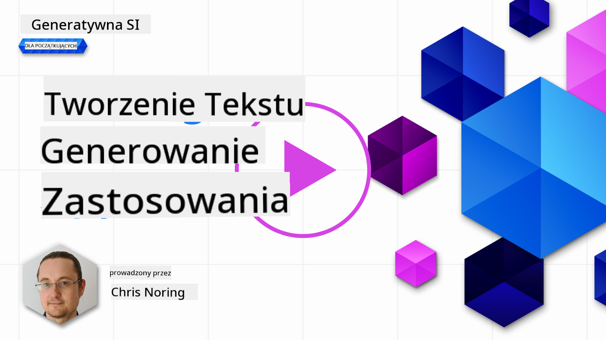

<!--
CO_OP_TRANSLATOR_METADATA:
{
  "original_hash": "5ec6c92b629564538ef397c550adb73e",
  "translation_date": "2025-05-19T10:00:21+00:00",
  "source_file": "06-text-generation-apps/README.md",
  "language_code": "pl"
}
-->
# Tworzenie aplikacji do generowania tekstu

[](https://aka.ms/gen-ai-lesson6-gh?WT.mc_id=academic-105485-koreyst)

> _(Kliknij powyższy obrazek, aby obejrzeć wideo z tej lekcji)_

Do tej pory w tym programie nauczania zobaczyłeś, że istnieją podstawowe pojęcia, takie jak podpowiedzi, a nawet cała dziedzina zwana "inżynierią podpowiedzi". Wiele narzędzi, z którymi możesz się komunikować, takich jak ChatGPT, Office 365, Microsoft Power Platform i inne, umożliwia korzystanie z podpowiedzi w celu osiągnięcia czegoś.

Aby dodać takie doświadczenie do aplikacji, musisz zrozumieć pojęcia takie jak podpowiedzi, zakończenia i wybrać bibliotekę do pracy. Dokładnie tego nauczysz się w tym rozdziale.

## Wprowadzenie

W tym rozdziale:

- Poznasz bibliotekę openai i jej podstawowe pojęcia.
- Zbudujesz aplikację do generowania tekstu za pomocą openai.
- Zrozumiesz, jak używać pojęć takich jak podpowiedź, temperatura i tokeny do budowy aplikacji generującej tekst.

## Cele nauki

Na końcu tej lekcji będziesz w stanie:

- Wyjaśnić, czym jest aplikacja do generowania tekstu.
- Zbudować aplikację do generowania tekstu za pomocą openai.
- Skonfigurować swoją aplikację do używania więcej lub mniej tokenów oraz zmieniać temperaturę dla zróżnicowanego wyniku.

## Czym jest aplikacja do generowania tekstu?

Zwykle, gdy budujesz aplikację, ma ona jakiś rodzaj interfejsu, jak poniżej:

- Oparty na poleceniach. Typowe aplikacje konsolowe, w których wpisujesz polecenie, a ono wykonuje zadanie. Na przykład `git` to aplikacja oparta na poleceniach.
- Interfejs użytkownika (UI). Niektóre aplikacje mają graficzne interfejsy użytkownika (GUI), gdzie klikasz przyciski, wpisujesz tekst, wybierasz opcje i więcej.

### Aplikacje konsolowe i UI są ograniczone

Porównaj to z aplikacją opartą na poleceniach, gdzie wpisujesz polecenie:

- **Jest ograniczona**. Nie możesz wpisać dowolnego polecenia, tylko te, które aplikacja obsługuje.
- **Specyficzna dla języka**. Niektóre aplikacje obsługują wiele języków, ale domyślnie aplikacja jest zbudowana dla konkretnego języka, nawet jeśli można dodać więcej obsługi języków.

### Korzyści z aplikacji generujących tekst

Jak więc aplikacja generująca tekst jest inna?

W aplikacji generującej tekst masz większą elastyczność, nie jesteś ograniczony do zestawu poleceń czy konkretnego języka wejściowego. Zamiast tego możesz używać naturalnego języka do interakcji z aplikacją. Kolejną zaletą jest to, że ponieważ już komunikujesz się z źródłem danych, które zostało przeszkolone na ogromnym korpusie informacji, tradycyjna aplikacja może być ograniczona do tego, co jest w bazie danych.

### Co mogę zbudować za pomocą aplikacji generującej tekst?

Jest wiele rzeczy, które możesz zbudować. Na przykład:

- **Chatbot**. Chatbot odpowiadający na pytania dotyczące tematów, takich jak Twoja firma i jej produkty, może być dobrym wyborem.
- **Pomocnik**. LLM są świetne w takich rzeczach jak podsumowywanie tekstu, uzyskiwanie wglądów z tekstu, tworzenie tekstu, takiego jak CV i więcej.
- **Asystent kodu**. W zależności od modelu językowego, którego używasz, możesz zbudować asystenta kodu, który pomaga w pisaniu kodu. Na przykład możesz użyć produktu takiego jak GitHub Copilot oraz ChatGPT do pomocy w pisaniu kodu.

## Jak mogę zacząć?

Musisz znaleźć sposób na integrację z LLM, co zazwyczaj wiąże się z następującymi dwoma podejściami:

- Użycie API. Tutaj konstruujesz zapytania webowe z podpowiedzią i otrzymujesz wygenerowany tekst.
- Użycie biblioteki. Biblioteki pomagają kapsułkować wywołania API i ułatwiają ich użycie.

## Biblioteki/SDK

Istnieje kilka dobrze znanych bibliotek do pracy z LLM, takich jak:

- **openai**, ta biblioteka ułatwia połączenie z modelem i wysyłanie podpowiedzi.

Są też biblioteki, które działają na wyższym poziomie, takie jak:

- **Langchain**. Langchain jest dobrze znany i obsługuje Pythona.
- **Semantic Kernel**. Semantic Kernel to biblioteka Microsoftu obsługująca języki C#, Python i Java.

## Pierwsza aplikacja używająca openai

Zobaczmy, jak możemy zbudować naszą pierwszą aplikację, jakie biblioteki potrzebujemy, ile jest wymagane i tak dalej.

### Instalacja openai

Istnieje wiele bibliotek do komunikacji z OpenAI lub Azure OpenAI. Możliwe jest użycie wielu języków programowania, takich jak C#, Python, JavaScript, Java i więcej. Wybraliśmy bibliotekę `openai` Python, więc użyjemy `pip` do jej instalacji.

```bash
pip install openai
```

### Tworzenie zasobu

Musisz wykonać następujące kroki:

- Utwórz konto na Azure [https://azure.microsoft.com/free/](https://azure.microsoft.com/free/?WT.mc_id=academic-105485-koreyst).
- Uzyskaj dostęp do Azure OpenAI. Przejdź do [https://learn.microsoft.com/azure/ai-services/openai/overview#how-do-i-get-access-to-azure-openai](https://learn.microsoft.com/azure/ai-services/openai/overview#how-do-i-get-access-to-azure-openai?WT.mc_id=academic-105485-koreyst) i złóż wniosek o dostęp.

  > [!NOTE]
  > W momencie pisania, musisz złożyć wniosek o dostęp do Azure OpenAI.

- Zainstaluj Python <https://www.python.org/>
- Utwórz zasób Azure OpenAI Service. Zobacz ten przewodnik, jak [utworzyć zasób](https://learn.microsoft.com/azure/ai-services/openai/how-to/create-resource?pivots=web-portal?WT.mc_id=academic-105485-koreyst).

### Lokalizacja klucza API i punktu końcowego

W tym momencie musisz poinformować swoją bibliotekę `openai`, jaki klucz API użyć. Aby znaleźć swój klucz API, przejdź do sekcji "Keys and Endpoint" zasobu Azure OpenAI i skopiuj wartość "Key 1".


Teraz, gdy masz skopiowane te informacje, poinstruuj biblioteki, aby ich używały.

> [!NOTE]
> Warto oddzielić klucz API od kodu. Możesz to zrobić, używając zmiennych środowiskowych.
>
> - Ustaw zmienną środowiskową `OPENAI_API_KEY` to your API key.
>   `export OPENAI_API_KEY='sk-...'`

### Konfiguracja Azure

Jeśli używasz Azure OpenAI, oto jak skonfigurować:

```python
openai.api_type = 'azure'
openai.api_key = os.environ["OPENAI_API_KEY"]
openai.api_version = '2023-05-15'
openai.api_base = os.getenv("API_BASE")
```

Powyżej ustawiamy następujące:

- `api_type` to `azure`. This tells the library to use Azure OpenAI and not OpenAI.
- `api_key`, this is your API key found in the Azure Portal.
- `api_version`, this is the version of the API you want to use. At the time of writing, the latest version is `2023-05-15`.
- `api_base`, this is the endpoint of the API. You can find it in the Azure Portal next to your API key.

> [!NOTE] > `os.getenv` is a function that reads environment variables. You can use it to read environment variables like `OPENAI_API_KEY` and `API_BASE`. Set these environment variables in your terminal or by using a library like `dotenv`.

## Generate text

The way to generate text is to use the `Completion` class. Oto przykład:

```python
prompt = "Complete the following: Once upon a time there was a"

completion = openai.Completion.create(model="davinci-002", prompt=prompt)
print(completion.choices[0].text)
```

W powyższym kodzie tworzymy obiekt zakończenia i przekazujemy model, którego chcemy użyć, oraz podpowiedź. Następnie drukujemy wygenerowany tekst.

### Zakończenia rozmowy

Do tej pory widziałeś, jak używaliśmy `Completion` to generate text. But there's another class called `ChatCompletion`, które jest bardziej odpowiednie dla chatbotów. Oto przykład użycia:

```python
import openai

openai.api_key = "sk-..."

completion = openai.ChatCompletion.create(model="gpt-3.5-turbo", messages=[{"role": "user", "content": "Hello world"}])
print(completion.choices[0].message.content)
```

Więcej na temat tej funkcji w nadchodzącym rozdziale.

## Ćwiczenie - twoja pierwsza aplikacja generująca tekst

Teraz, gdy nauczyliśmy się, jak skonfigurować i skonfigurować openai, czas zbudować swoją pierwszą aplikację generującą tekst. Aby zbudować aplikację, wykonaj następujące kroki:

1. Utwórz wirtualne środowisko i zainstaluj openai:

   ```bash
   python -m venv venv
   source venv/bin/activate
   pip install openai
   ```

   > [!NOTE]
   > Jeśli używasz systemu Windows, wpisz `venv\Scripts\activate` instead of `source venv/bin/activate`.

   > [!NOTE]
   > Locate your Azure OpenAI key by going to [https://portal.azure.com/](https://portal.azure.com/?WT.mc_id=academic-105485-koreyst) and search for `Open AI` and select the `Open AI resource` and then select `Keys and Endpoint` and copy the `Key 1` value.

1. Utwórz plik _app.py_ i wprowadź do niego następujący kod:

   ```python
   import openai

   openai.api_key = "<replace this value with your open ai key or Azure OpenAI key>"

   openai.api_type = 'azure'
   openai.api_version = '2023-05-15'
   openai.api_base = "<endpoint found in Azure Portal where your API key is>"
   deployment_name = "<deployment name>"

   # add your completion code
   prompt = "Complete the following: Once upon a time there was a"
   messages = [{"role": "user", "content": prompt}]

   # make completion
   completion = openai.chat.completions.create(model=deployment_name, messages=messages)

   # print response
   print(completion.choices[0].message.content)
   ```

   > [!NOTE]
   > Jeśli używasz Azure OpenAI, musisz ustawić `api_type` to `azure` and set the `api_key` na swój klucz Azure OpenAI.

   Powinieneś zobaczyć wynik podobny do poniższego:

   ```output
    very unhappy _____.

   Once upon a time there was a very unhappy mermaid.
   ```

## Różne typy podpowiedzi, dla różnych rzeczy

Teraz widziałeś, jak generować tekst za pomocą podpowiedzi. Masz nawet program działający, który możesz modyfikować i zmieniać, aby generować różne typy tekstu.

Podpowiedzi mogą być używane do różnych zadań. Na przykład:

- **Generowanie typu tekstu**. Na przykład możesz wygenerować wiersz, pytania do quizu itp.
- **Wyszukiwanie informacji**. Możesz używać podpowiedzi do wyszukiwania informacji, jak w poniższym przykładzie 'Co oznacza CORS w rozwoju webowym?'.
- **Generowanie kodu**. Możesz używać podpowiedzi do generowania kodu, na przykład tworzenia wyrażenia regularnego używanego do walidacji e-maili, a nawet generowania całego programu, jak aplikacja webowa.

## Bardziej praktyczne zastosowanie: generator przepisów

Wyobraź sobie, że masz składniki w domu i chcesz coś ugotować. Do tego potrzebujesz przepisu. Możesz znaleźć przepisy, korzystając z wyszukiwarki lub użyć LLM.

Możesz napisać podpowiedź w ten sposób:

> "Pokaż mi 5 przepisów na danie z następującymi składnikami: kurczak, ziemniaki i marchewki. Na każdy przepis, wymień wszystkie użyte składniki"

Podając powyższą podpowiedź, możesz otrzymać odpowiedź podobną do:

```output
1. Roasted Chicken and Vegetables:
Ingredients:
- 4 chicken thighs
- 2 potatoes, cut into cubes
- 2 carrots, cut into cubes
- 2 tablespoons olive oil
- 2 cloves garlic, minced
- 1 teaspoon dried thyme
- 1 teaspoon dried oregano
- Salt and pepper, to taste

2. Chicken and Potato Stew:
Ingredients:
- 2 tablespoons olive oil
- 1 onion, diced
- 2 cloves garlic, minced
- 2 chicken breasts, cut into cubes
- 2 potatoes, cut into cubes
- 2 carrots, cut into cubes
- 1 teaspoon dried oregano
- 1 teaspoon dried thyme
- 1 cup chicken broth
- Salt and pepper, to taste

3. Chicken and Potato Bake:
Ingredients:
- 2 tablespoons olive oil
- 2 chicken breasts, cut into cubes
- 2 potatoes, cut into cubes
- 2 carrots, cut into cubes
- 1 onion, diced
- 2 cloves garlic, minced
- 1 teaspoon dried oregano
- 1 teaspoon dried thyme
- 1 cup chicken broth
- Salt and pepper, to taste

4. Chicken and Potato Soup:
Ingredients:
- 2 tablespoons olive oil
- 1 onion, diced
- 2 cloves garlic, minced
- 2 chicken breasts, cut into cubes
- 2 potatoes, cut into cubes
- 2 carrots, cut into cubes
- 1 teaspoon dried oregano
- 1 teaspoon dried thyme
- 4 cups chicken broth
- Salt and pepper, to taste

5. Chicken and Potato Hash:
Ingredients:
- 2 tablespoons olive oil
- 2 chicken breasts, cut into cubes
- 2 potatoes, cut into cubes
- 2 carrots, cut into cubes
- 1 onion, diced
- 2 cloves garlic, minced
- 1 teaspoon dried oregano
```

Ten wynik jest świetny, wiem co gotować. Na tym etapie, przydatne ulepszenia mogą być:

- Odfiltrowanie składników, których nie lubię lub na które jestem uczulony.
- Stworzenie listy zakupów, na wypadek gdybym nie miał wszystkich składników w domu.

Dla powyższych przypadków, dodajmy dodatkową podpowiedź:

> "Proszę usuń przepisy z czosnkiem, ponieważ jestem uczulony i zastąp go czymś innym. Proszę również stworzyć listę zakupów dla przepisów, biorąc pod uwagę, że już mam kurczaka, ziemniaki i marchewki w domu."

Teraz masz nowy wynik, mianowicie:

```output
1. Roasted Chicken and Vegetables:
Ingredients:
- 4 chicken thighs
- 2 potatoes, cut into cubes
- 2 carrots, cut into cubes
- 2 tablespoons olive oil
- 1 teaspoon dried thyme
- 1 teaspoon dried oregano
- Salt and pepper, to taste

2. Chicken and Potato Stew:
Ingredients:
- 2 tablespoons olive oil
- 1 onion, diced
- 2 chicken breasts, cut into cubes
- 2 potatoes, cut into cubes
- 2 carrots, cut into cubes
- 1 teaspoon dried oregano
- 1 teaspoon dried thyme
- 1 cup chicken broth
- Salt and pepper, to taste

3. Chicken and Potato Bake:
Ingredients:
- 2 tablespoons olive oil
- 2 chicken breasts, cut into cubes
- 2 potatoes, cut into cubes
- 2 carrots, cut into cubes
- 1 onion, diced
- 1 teaspoon dried oregano
- 1 teaspoon dried thyme
- 1 cup chicken broth
- Salt and pepper, to taste

4. Chicken and Potato Soup:
Ingredients:
- 2 tablespoons olive oil
- 1 onion, diced
- 2 chicken breasts, cut into cubes
- 2 potatoes, cut into cubes
- 2 carrots, cut into cubes
- 1 teaspoon dried oregano
- 1 teaspoon dried thyme
- 4 cups chicken broth
- Salt and pepper, to taste

5. Chicken and Potato Hash:
Ingredients:
- 2 tablespoons olive oil
- 2 chicken breasts, cut into cubes
- 2 potatoes, cut into cubes
- 2 carrots, cut into cubes
- 1 onion, diced
- 1 teaspoon dried oregano

Shopping List:
- Olive oil
- Onion
- Thyme
- Oregano
- Salt
- Pepper
```

To są twoje pięć przepisów, bez wzmianki o czosnku i masz również listę zakupów biorąc pod uwagę, co już masz w domu.

## Ćwiczenie - zbuduj generator przepisów

Teraz, gdy przeanalizowaliśmy scenariusz, napiszmy kod, aby dopasować się do przedstawionego scenariusza. Aby to zrobić, wykonaj następujące kroki:

1. Użyj istniejącego pliku _app.py_ jako punktu wyjścia
1. Zlokalizuj zmienną `prompt` i zmień jej kod na następujący:

   ```python
   prompt = "Show me 5 recipes for a dish with the following ingredients: chicken, potatoes, and carrots. Per recipe, list all the ingredients used"
   ```

   Jeśli teraz uruchomisz kod, powinieneś zobaczyć wynik podobny do:

   ```output
   -Chicken Stew with Potatoes and Carrots: 3 tablespoons oil, 1 onion, chopped, 2 cloves garlic, minced, 1 carrot, peeled and chopped, 1 potato, peeled and chopped, 1 bay leaf, 1 thyme sprig, 1/2 teaspoon salt, 1/4 teaspoon black pepper, 1 1/2 cups chicken broth, 1/2 cup dry white wine, 2 tablespoons chopped fresh parsley, 2 tablespoons unsalted butter, 1 1/2 pounds boneless, skinless chicken thighs, cut into 1-inch pieces
   -Oven-Roasted Chicken with Potatoes and Carrots: 3 tablespoons extra-virgin olive oil, 1 tablespoon Dijon mustard, 1 tablespoon chopped fresh rosemary, 1 tablespoon chopped fresh thyme, 4 cloves garlic, minced, 1 1/2 pounds small red potatoes, quartered, 1 1/2 pounds carrots, quartered lengthwise, 1/2 teaspoon salt, 1/4 teaspoon black pepper, 1 (4-pound) whole chicken
   -Chicken, Potato, and Carrot Casserole: cooking spray, 1 large onion, chopped, 2 cloves garlic, minced, 1 carrot, peeled and shredded, 1 potato, peeled and shredded, 1/2 teaspoon dried thyme leaves, 1/4 teaspoon salt, 1/4 teaspoon black pepper, 2 cups fat-free, low-sodium chicken broth, 1 cup frozen peas, 1/4 cup all-purpose flour, 1 cup 2% reduced-fat milk, 1/4 cup grated Parmesan cheese

   -One Pot Chicken and Potato Dinner: 2 tablespoons olive oil, 1 pound boneless, skinless chicken thighs, cut into 1-inch pieces, 1 large onion, chopped, 3 cloves garlic, minced, 1 carrot, peeled and chopped, 1 potato, peeled and chopped, 1 bay leaf, 1 thyme sprig, 1/2 teaspoon salt, 1/4 teaspoon black pepper, 2 cups chicken broth, 1/2 cup dry white wine

   -Chicken, Potato, and Carrot Curry: 1 tablespoon vegetable oil, 1 large onion, chopped, 2 cloves garlic, minced, 1 carrot, peeled and chopped, 1 potato, peeled and chopped, 1 teaspoon ground coriander, 1 teaspoon ground cumin, 1/2 teaspoon ground turmeric, 1/2 teaspoon ground ginger, 1/4 teaspoon cayenne pepper, 2 cups chicken broth, 1/2 cup dry white wine, 1 (15-ounce) can chickpeas, drained and rinsed, 1/2 cup raisins, 1/2 cup chopped fresh cilantro
   ```

   > UWAGA, twój LLM jest niedeterministyczny, więc możesz otrzymać różne wyniki za każdym razem, gdy uruchomisz program.

   Świetnie, zobaczmy, jak możemy poprawić rzeczy. Aby poprawić rzeczy, chcemy upewnić się, że kod jest elastyczny, więc składniki i liczba przepisów mogą być ulepszone i zmienione.

1. Zmieńmy kod w następujący sposób:

   ```python
   no_recipes = input("No of recipes (for example, 5): ")

   ingredients = input("List of ingredients (for example, chicken, potatoes, and carrots): ")

   # interpolate the number of recipes into the prompt an ingredients
   prompt = f"Show me {no_recipes} recipes for a dish with the following ingredients: {ingredients}. Per recipe, list all the ingredients used"
   ```

   Testując kod, może wyglądać to tak:

   ```output
   No of recipes (for example, 5): 3
   List of ingredients (for example, chicken, potatoes, and carrots): milk,strawberries

   -Strawberry milk shake: milk, strawberries, sugar, vanilla extract, ice cubes
   -Strawberry shortcake: milk, flour, baking powder, sugar, salt, unsalted butter, strawberries, whipped cream
   -Strawberry milk: milk, strawberries, sugar, vanilla extract
   ```

### Poprawa poprzez dodanie filtru i listy zakupów

Teraz mamy działającą aplikację zdolną do tworzenia przepisów i jest elastyczna, ponieważ opiera się na danych wejściowych od użytkownika, zarówno dotyczących liczby przepisów, jak i użytych składników.

Aby dalej ją poprawić, chcemy dodać następujące:

- **Odfiltrowanie składników**. Chcemy móc odfiltrować składniki, których nie lubimy lub na które jesteśmy uczuleni. Aby osiągnąć tę zmianę, możemy edytować naszą istniejącą podpowiedź i dodać warunek filtru na końcu, jak poniżej:

  ```python
  filter = input("Filter (for example, vegetarian, vegan, or gluten-free): ")

  prompt = f"Show me {no_recipes} recipes for a dish with the following ingredients: {ingredients}. Per recipe, list all the ingredients used, no {filter}"
  ```

  Powyżej dodajemy `{filter}` na końcu podpowiedzi i również przechwytujemy wartość filtru od użytkownika.

  Przykładowe dane wejściowe z uruchomienia programu mogą teraz wyglądać tak:

  ```output
  No of recipes (for example, 5): 3
  List of ingredients (for example, chicken, potatoes, and carrots): onion,milk
  Filter (for example, vegetarian, vegan, or gluten-free): no milk

  1. French Onion Soup

  Ingredients:

  -1 large onion, sliced
  -3 cups beef broth
  -1 cup milk
  -6 slices french bread
  -1/4 cup shredded Parmesan cheese
  -1 tablespoon butter
  -1 teaspoon dried thyme
  -1/4 teaspoon salt
  -1/4 teaspoon black pepper

  Instructions:

  1. In a large pot, sauté onions in butter until golden brown.
  2. Add beef broth, milk, thyme, salt, and pepper. Bring to a boil.
  3. Reduce heat and simmer for 10 minutes.
  4. Place french bread slices on soup bowls.
  5. Ladle soup over bread.
  6. Sprinkle with Parmesan cheese.

  2. Onion and Potato Soup

  Ingredients:

  -1 large onion, chopped
  -2 cups potatoes, diced
  -3 cups vegetable broth
  -1 cup milk
  -1/4 teaspoon black pepper

  Instructions:

  1. In a large pot, sauté onions in butter until golden brown.
  2. Add potatoes, vegetable broth, milk, and pepper. Bring to a boil.
  3. Reduce heat and simmer for 10 minutes.
  4. Serve hot.

  3. Creamy Onion Soup

  Ingredients:

  -1 large onion, chopped
  -3 cups vegetable broth
  -1 cup milk
  -1/4 teaspoon black pepper
  -1/4 cup all-purpose flour
  -1/2 cup shredded Parmesan cheese

  Instructions:

  1. In a large pot, sauté onions in butter until golden brown.
  2. Add vegetable broth, milk, and pepper. Bring to a boil.
  3. Reduce heat and simmer for 10 minutes.
  4. In a small bowl, whisk together flour and Parmesan cheese until smooth.
  5. Add to soup and simmer for an additional 5 minutes, or until soup has thickened.
  ```

  Jak widać, wszelkie przepisy zawierające mleko zostały odfiltrowane. Ale jeśli jesteś nietolerancyjny na laktozę, możesz chcieć odfiltrować przepisy zawierające ser, więc trzeba być jasnym.

- **Tworzenie listy zakupów**. Chcemy stworzyć listę zakupów, biorąc pod uwagę to, co już mamy w domu.

  Dla tej funkcjonalności możemy spróbować rozwiązać wszystko w jednej podpowiedzi lub podzielić ją na dwie podpowiedzi. Spróbujmy tego drugiego podejścia. Tutaj sugerujemy dodanie dodatkowej podpowiedzi, ale aby to zadziałało, musimy dodać wynik pierwszej podpowiedzi jako kontekst do drugiej podpowiedzi.

  Znajdź część kodu, która drukuje wynik pierwszej podpowiedzi i dodaj poniższy kod:

  ```python
  old_prompt_result = completion.choices[0].message.content
  prompt = "Produce a shopping list for the generated recipes and please don't include ingredients that I already have."

  new_prompt = f"{old_prompt_result} {prompt}"
  messages = [{"role": "user", "content": new_prompt}]
  completion = openai.Completion.create(engine=deployment_name, messages=messages, max_tokens=1200)

  # print response
  print("Shopping list:")
  print(completion.choices[0].message.content)
  ```

  Zauważ następujące:

  1. Tworzymy nową podpowiedź, dodając wynik pierwszej podpowiedzi do nowej podpowiedzi:

     ```python
     new_prompt = f"{old_prompt_result} {prompt}"
     ```

  1. Robimy nowe zapytanie, ale również biorąc pod uwagę liczbę tokenów, o które prosiliśmy w pierwszej podpowiedzi, więc tym razem mówimy `max_tokens` to 1200.

     ```python
     completion = openai.Completion.create(engine=deployment_name, prompt=new_prompt, max_tokens=1200)
     ```

     Testując ten kod, teraz otrzymujemy następujący wynik:

     ```output
     No of recipes (for example, 5): 2
     List of ingredients (for example, chicken, potatoes, and carrots): apple,flour
     Filter (for example, vegetarian, vegan, or gluten-free): sugar


     -Apple and flour pancakes: 1 cup flour, 1/2 tsp baking powder, 1/2 tsp baking soda, 1/4 tsp salt, 1 tbsp sugar, 1 egg, 1 cup buttermilk or sour milk, 1/4 cup melted butter, 1 Granny Smith apple, peeled and grated
     -Apple fritters: 1-1/2 cups flour, 1 tsp baking powder, 1/4 tsp salt, 1/4 tsp baking soda, 1/4 tsp nutmeg, 1/4 tsp cinnamon, 1/4 tsp allspice, 1/4 cup sugar, 1/4 cup vegetable shortening, 1/4 cup milk, 1 egg, 2 cups shredded, peeled apples
     Shopping list:
     -Flour, baking powder, baking soda, salt, sugar, egg, buttermilk, butter, apple, nutmeg, cinnamon, allspice
     ```

## Popraw swoje ustawienia

To, co mamy do tej pory, to kod, który działa, ale są pewne poprawki, które powinniśmy zrobić, aby jeszcze bardziej poprawić rzeczy. Niektóre rzeczy, które powinniśmy zrobić, to:

- **Oddziel tajemnice od kodu**, takie jak klucz API. Tajemnice nie należą do kodu i powinny być przechowywane w bezpiecznym miejscu. Aby oddzielić tajemnice od kodu, możemy użyć zmiennych środowiskowych i bibliotek takich jak `python-dotenv` to load them from a file. Here's how that would look like in code:

  1. Create a `.env` file with the following content:

     ```bash
     OPENAI_API_KEY=sk-...
     ```

     > Uwaga, dla Azure, musisz ustawić następujące zmienne środowiskowe:

     ```bash
     OPENAI_API_TYPE=azure
     OPENAI_API_VERSION=2023-05-15
     OPENAI_API_BASE=<replace>
     ```

     W kodzie, ładowałbyś zmienne środowiskowe w ten sposób:

     ```python
     from dotenv import load_dotenv

     load_dotenv()

     openai.api_key = os.environ["OPENAI_API_KEY"]
     ```

- **Słowo o długości tokenów**. Powinniśmy rozważyć, ile tokenów potrzebujemy, aby wygenerować tekst, który chcemy. Tokeny kosztują pieniądze, więc tam, gdzie to możliwe, powinniśmy próbować być ekonomicznym w liczbie używanych tokenów. Na przykład, czy możemy sformułować podpowiedź tak, aby użyć mniej tokenów?

  Aby zmienić używane tokeny, możesz użyć parametru `max_tokens`. Na przykład, jeśli chcesz użyć 100 tokenów, zrobisz to:

  ```python
  completion = client.chat.completions.create(model=deployment, messages=messages, max_tokens=100)
  ```

- **Eksperymentowanie z temperaturą**. Temperatura to coś, o czym do

**Zastrzeżenie**:  
Ten dokument został przetłumaczony za pomocą usługi tłumaczenia AI [Co-op Translator](https://github.com/Azure/co-op-translator). Chociaż staramy się zapewnić dokładność, prosimy mieć świadomość, że automatyczne tłumaczenia mogą zawierać błędy lub nieścisłości. Oryginalny dokument w jego ojczystym języku powinien być uznawany za autorytatywne źródło. W przypadku informacji krytycznych zaleca się profesjonalne tłumaczenie przez człowieka. Nie ponosimy odpowiedzialności za wszelkie nieporozumienia lub błędne interpretacje wynikające z użycia tego tłumaczenia.