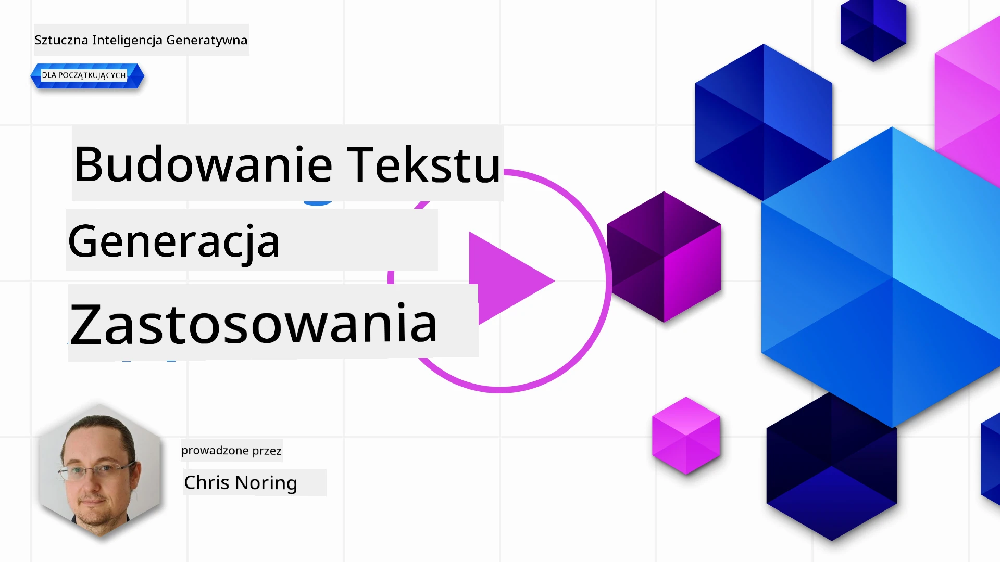

# Budowanie aplikacji do generowania tekstu

[](https://youtu.be/0Y5Luf5sRQA?si=t_xVg0clnAI4oUFZ)

> _(Kliknij powyższy obraz, aby obejrzeć wideo z tej lekcji)_

Do tej pory w ramach tego programu nauczania widziałeś, że istnieją kluczowe pojęcia takie jak prompt i nawet cała dyscyplina zwana „inżynierią promptów”. Wielu narzędzi, z którymi możesz się komunikować, takich jak ChatGPT, Office 365, Microsoft Power Platform i inne, wspiera korzystanie z promptów do wykonania określonych zadań.

Aby dodać takie doświadczenie do aplikacji, musisz zrozumieć pojęcia takie jak prompty, completions oraz wybrać bibliotekę, z którą będziesz pracować. Dokładnie tego nauczysz się w tym rozdziale.

## Wprowadzenie

W tym rozdziale dowiesz się:

- Poznasz bibliotekę openai i jej podstawowe pojęcia.
- Zbudujesz aplikację do generowania tekstu, używając openai.
- Zrozumiesz, jak używać pojęć takich jak prompt, temperatura i tokeny do stworzenia aplikacji generującej tekst.

## Cele nauki

Po zakończeniu tej lekcji będziesz potrafił:

- Wytłumaczyć, czym jest aplikacja do generowania tekstu.
- Zbudować aplikację do generowania tekstu, używając openai.
- Skonfigurować swoją aplikację tak, aby wykorzystywała więcej lub mniej tokenów oraz zmieniać temperaturę, dla uzyskania zróżnicowanych wyników.

## Czym jest aplikacja do generowania tekstu?

Zazwyczaj, gdy budujesz aplikację, ma ona jakiś rodzaj interfejsu, na przykład taki:

- Oparta na poleceniach. Aplikacje konsolowe to typowe aplikacje, w których wpisujesz polecenie, a program wykonuje zadanie. Na przykład `git` jest aplikacją opartą na poleceniach.
- Interfejs użytkownika (UI). Niektóre aplikacje mają graficzne interfejsy użytkownika (GUI), gdzie klikasz przyciski, wpisujesz tekst, wybierasz opcje i więcej.

### Aplikacje konsolowe i UI mają ograniczenia

Porównajmy to do aplikacji opartej na poleceniach, gdzie wpisujesz komendę:

- **To jest ograniczone**. Nie możesz po prostu wpisać dowolnej komendy, tylko te, które aplikacja obsługuje.
- **Specyficzne dla języka**. Niektóre aplikacje obsługują wiele języków, ale domyślnie aplikacja jest zbudowana dla konkretnego języka, nawet jeśli możesz dodać wsparcie dla innych języków.

### Zalety aplikacji do generowania tekstu

Czym więc różni się aplikacja do generowania tekstu?

W aplikacji do generowania tekstu masz większą elastyczność, nie jesteś ograniczony do zestawu poleceń lub konkretnego języka wejściowego. Zamiast tego możesz używać języka naturalnego do interakcji z aplikacją. Kolejną zaletą jest to, że już korzystasz ze źródła danych, które zostało przeszkolone na obszernym korpusie informacji, podczas gdy tradycyjna aplikacja może być ograniczona do tego, co jest w bazie danych.

### Co mogę zbudować z aplikacją do generowania tekstu?

Możesz zbudować wiele rzeczy. Na przykład:

- **Chatbota**. Chatbot odpowiadający na pytania o tematy takie jak twoja firma i jej produkty mógłby być dobrym wyborem.
- **Pomocnika**. Duże modele językowe (LLM) są świetne w takich zadaniach jak streszczanie tekstu, uzyskiwanie informacji z tekstu, tworzenie tekstów takich jak CV i inne.
- **Asystenta kodu**. W zależności od używanego modelu językowego, możesz zbudować asystenta kodu, który pomoże ci pisać kod. Na przykład, możesz skorzystać z produktów takich jak GitHub Copilot oraz ChatGPT, aby pomóc w pisaniu kodu.

## Jak mogę zacząć?

Cóż, musisz znaleźć sposób na integrację z dużym modelem językowym (LLM), co zwykle wiąże się z dwoma podejściami:

- Użycie API. Tutaj budujesz zapytania sieciowe ze swoim promptem i otrzymujesz wygenerowany tekst zwrotnie.
- Użycie biblioteki. Biblioteki pomagają opakować wywołania API i ułatwiają ich użycie.

## Biblioteki/SDK

Jest kilka dobrze znanych bibliotek do pracy z LLM, takich jak:

- **openai**, ta biblioteka ułatwia połączenie z Twoim modelem i wysyłanie promptów.

Są też biblioteki działające na wyższym poziomie, takie jak:

- **Langchain**. Langchain jest dobrze znany i wspiera Pythona.
- **Semantic Kernel**. Semantic Kernel to biblioteka Microsoftu wspierająca języki C#, Python i Java.

## Pierwsza aplikacja z użyciem openai

Zobaczmy, jak możemy zbudować naszą pierwszą aplikację, jakie biblioteki są potrzebne, ile jest to skomplikowane i tak dalej.

### Instalacja openai

Istnieje wiele bibliotek do interakcji z OpenAI lub Azure OpenAI. Możliwe jest użycie wielu języków programowania, takich jak C#, Python, JavaScript, Java i inne. My wybraliśmy bibliotekę Python `openai`, więc użyjemy `pip` do jej instalacji.

```bash
pip install openai
```

### Utwórz zasób

Musisz wykonać następujące kroki:

- Załóż konto na Azure [https://azure.microsoft.com/free/](https://azure.microsoft.com/free/?WT.mc_id=academic-105485-koreyst).
- Uzyskaj dostęp do Azure OpenAI. Przejdź do [https://learn.microsoft.com/azure/ai-services/openai/overview#how-do-i-get-access-to-azure-openai](https://learn.microsoft.com/azure/ai-services/openai/overview#how-do-i-get-access-to-azure-openai?WT.mc_id=academic-105485-koreyst) i złóż prośbę o dostęp.

  > [!NOTE]
  > W momencie pisania tego tekstu, należy złożyć wniosek o dostęp do Azure OpenAI.

- Zainstaluj Pythona <https://www.python.org/>
- Utwórz zasób usługi Azure OpenAI. W tym przewodniku znajdziesz informacje o tym, jak [utworzyć zasób](https://learn.microsoft.com/azure/ai-services/openai/how-to/create-resource?pivots=web-portal?WT.mc_id=academic-105485-koreyst).

### Znajdź klucz API i punkt końcowy (endpoint)

Na tym etapie musisz powiedzieć bibliotece `openai`, którego klucza API ma użyć. Aby znaleźć swój klucz API, przejdź do sekcji „Keys and Endpoint” swojego zasobu Azure OpenAI i skopiuj wartość „Key 1”.


Teraz, gdy masz tę informację skopiowaną, wskażemy bibliotekom, aby z niej skorzystały.

> [!NOTE]
> Warto oddzielić Twój klucz API od kodu. Możesz to zrobić, korzystając ze zmiennych środowiskowych.
>
> - Ustaw zmienną środowiskową `OPENAI_API_KEY` na swój klucz API.
>   `export OPENAI_API_KEY='sk-...'`

### Konfiguracja Azure

Jeśli korzystasz z Azure OpenAI (obecnie w Microsoft Foundry), oto jak ustawić konfigurację. Używamy standardowego klienta `OpenAI` wskazanego na Azure OpenAI `/openai/v1/` endpoint, który działa z Responses API i nie wymaga parametru `api_version`:

```python
import os
from openai import OpenAI

client = OpenAI(
    api_key=os.environ["AZURE_OPENAI_API_KEY"],
    base_url=f"{os.environ['AZURE_OPENAI_ENDPOINT'].rstrip('/')}/openai/v1/",
)
```

Powyżej ustawiamy:

- `api_key`, to Twój klucz API znaleziony w Azure Portal lub portalu Microsoft Foundry.
- `base_url`, to punkt końcowy zasobu Foundry z dodanym `/openai/v1/`. Stabilny endpoint v1 działa zarówno z OpenAI, jak i Azure OpenAI bez konieczności zarządzania wersją API.

> [!NOTE] > `os.environ` czyta zmienne środowiskowe. Możesz go użyć do odczytu zmiennych środowiskowych, takich jak `AZURE_OPENAI_API_KEY` i `AZURE_OPENAI_ENDPOINT`. Ustaw te zmienne środowiskowe w terminalu lub użyj biblioteki takiej jak `dotenv`.

## Generowanie tekstu

Sposobem generowania tekstu jest użycie Responses API przez metodę `responses.create`. Oto przykład:

```python
prompt = "Complete the following: Once upon a time there was a"

response = client.responses.create(
    model="gpt-4o-mini",  # to jest nazwa twojego wdrożenia modelu
    input=prompt,
    store=False,
)
print(response.output_text)
```

W powyższym kodzie tworzymy odpowiedź i przekazujemy model, którego chcemy użyć oraz prompt. Następnie drukujemy wygenerowany tekst przez `response.output_text`.

### Rozmowy wieloetapowe

Responses API jest dobrze przystosowane zarówno do generowania tekstu jednokrotnego, jak i chatbotów wieloetapowych — dostarczasz listę wiadomości w `input`, aby zbudować konwersację:

```python
from openai import OpenAI

client = OpenAI(api_key="sk-...")

response = client.responses.create(model="gpt-4o-mini", input="Hello world", store=False)
print(response.output_text)
```

Więcej o tej funkcjonalności w nadchodzącym rozdziale.

## Ćwiczenie - Twoja pierwsza aplikacja do generowania tekstu

Teraz, gdy nauczyliśmy się jak skonfigurować i ustawić openai, czas zbudować Twoją pierwszą aplikację do generowania tekstu. Aby ją zbudować, wykonaj następujące kroki:

1. Utwórz środowisko wirtualne i zainstaluj openai:

   ```bash
   python -m venv venv
   source venv/bin/activate
   pip install openai
   ```

   > [!NOTE]
   > Jeśli korzystasz z Windows, wpisz `venv\Scripts\activate` zamiast `source venv/bin/activate`.

   > [!NOTE]
   > Znajdź klucz Azure OpenAI, przechodząc do [https://portal.azure.com/](https://portal.azure.com/?WT.mc_id=academic-105485-koreyst) i wyszukaj `Open AI`, wybierz `Open AI resource`, następnie `Keys and Endpoint` i skopiuj wartość `Key 1`.

1. Utwórz plik _app.py_ i wklej do niego następujący kod:

   ```python
   import os
   from openai import OpenAI

   client = OpenAI(
       api_key="<replace this value with your Azure OpenAI key>",
       base_url="<endpoint found in Azure Portal>/openai/v1/",
   )
   deployment_name = "<deployment name>"

   # dodaj swój kod uzupełniający
   prompt = "Complete the following: Once upon a time there was a"

   # wykonaj zapytanie korzystając z API Responses
   response = client.responses.create(model=deployment_name, input=prompt, store=False)

   # wypisz odpowiedź
   print(response.output_text)
   ```

   > [!NOTE]
   > Jeśli używasz czystego OpenAI (nie Azure), użyj `client = OpenAI(api_key="<replace this value with your OpenAI key>")` (bez `base_url`) i przekaż nazwę modelu, np. `gpt-4o-mini` zamiast nazwy wdrożenia.

   Powinieneś zobaczyć wynik podobny do poniższego:

   ```output
    very unhappy _____.

   Once upon a time there was a very unhappy mermaid.
   ```

## Różne typy promptów, do różnych zastosowań

Teraz, gdy widziałeś, jak generować tekst za pomocą promptu, masz nawet program działający, który możesz modyfikować i zmieniać, aby generować różne typy tekstu.

Promptów można używać do różnych zadań. Na przykład:

- **Generowanie określonego typu tekstu**. Na przykład możesz wygenerować wiersz, pytania do quizu itd.
- **Wyszukiwanie informacji**. Możesz użyć promptów do wyszukania informacji, np. 'Co oznacza CORS w programowaniu webowym?'.
- **Generowanie kodu**. Możesz użyć promptów do generowania kodu, na przykład tworzenia wyrażeń regularnych do walidacji adresów e-mail lub nawet wygenerować cały program, taki jak aplikacja webowa.

## Bardziej praktyczny przypadek: generator przepisów

Wyobraź sobie, że masz w domu składniki i chcesz coś ugotować. Do tego potrzebujesz przepisu. Możesz skorzystać z wyszukiwarki lub użyć LLM do tego celu.

Możesz napisać prompt w taki sposób:

> "Pokaż mi 5 przepisów na danie z następującymi składnikami: kurczak, ziemniaki i marchewki. W każdym przepisie wymień wszystkie użyte składniki"

W odpowiedzi możesz otrzymać coś takiego:

```output
1. Roasted Chicken and Vegetables:
Ingredients:
- 4 chicken thighs
- 2 potatoes, cut into cubes
- 2 carrots, cut into cubes
- 2 tablespoons olive oil
- 2 cloves garlic, minced
- 1 teaspoon dried thyme
- 1 teaspoon dried oregano
- Salt and pepper, to taste

2. Chicken and Potato Stew:
Ingredients:
- 2 tablespoons olive oil
- 1 onion, diced
- 2 cloves garlic, minced
- 2 chicken breasts, cut into cubes
- 2 potatoes, cut into cubes
- 2 carrots, cut into cubes
- 1 teaspoon dried oregano
- 1 teaspoon dried thyme
- 1 cup chicken broth
- Salt and pepper, to taste

3. Chicken and Potato Bake:
Ingredients:
- 2 tablespoons olive oil
- 2 chicken breasts, cut into cubes
- 2 potatoes, cut into cubes
- 2 carrots, cut into cubes
- 1 onion, diced
- 2 cloves garlic, minced
- 1 teaspoon dried oregano
- 1 teaspoon dried thyme
- 1 cup chicken broth
- Salt and pepper, to taste

4. Chicken and Potato Soup:
Ingredients:
- 2 tablespoons olive oil
- 1 onion, diced
- 2 cloves garlic, minced
- 2 chicken breasts, cut into cubes
- 2 potatoes, cut into cubes
- 2 carrots, cut into cubes
- 1 teaspoon dried oregano
- 1 teaspoon dried thyme
- 4 cups chicken broth
- Salt and pepper, to taste

5. Chicken and Potato Hash:
Ingredients:
- 2 tablespoons olive oil
- 2 chicken breasts, cut into cubes
- 2 potatoes, cut into cubes
- 2 carrots, cut into cubes
- 1 onion, diced
- 2 cloves garlic, minced
- 1 teaspoon dried oregano
```

Ten wynik jest świetny, wiem co ugotować. W tym momencie przydatne mogą być następujące ulepszenia:

- Filtrowanie składników, których nie lubię lub na które jestem uczulony.
- Tworzenie listy zakupów, na wypadek, gdybym nie miał wszystkich składników w domu.

Dla powyższych przypadków dodajmy dodatkowy prompt:

> "Proszę usuń przepisy z czosnkiem, ponieważ jestem na niego uczulony i zastąp go czymś innym. Proszę też przygotuj listę zakupów do tych przepisów, biorąc pod uwagę, że mam już w domu kurczaka, ziemniaki i marchewki."

Teraz masz nowy wynik, a mianowicie:

```output
1. Roasted Chicken and Vegetables:
Ingredients:
- 4 chicken thighs
- 2 potatoes, cut into cubes
- 2 carrots, cut into cubes
- 2 tablespoons olive oil
- 1 teaspoon dried thyme
- 1 teaspoon dried oregano
- Salt and pepper, to taste

2. Chicken and Potato Stew:
Ingredients:
- 2 tablespoons olive oil
- 1 onion, diced
- 2 chicken breasts, cut into cubes
- 2 potatoes, cut into cubes
- 2 carrots, cut into cubes
- 1 teaspoon dried oregano
- 1 teaspoon dried thyme
- 1 cup chicken broth
- Salt and pepper, to taste

3. Chicken and Potato Bake:
Ingredients:
- 2 tablespoons olive oil
- 2 chicken breasts, cut into cubes
- 2 potatoes, cut into cubes
- 2 carrots, cut into cubes
- 1 onion, diced
- 1 teaspoon dried oregano
- 1 teaspoon dried thyme
- 1 cup chicken broth
- Salt and pepper, to taste

4. Chicken and Potato Soup:
Ingredients:
- 2 tablespoons olive oil
- 1 onion, diced
- 2 chicken breasts, cut into cubes
- 2 potatoes, cut into cubes
- 2 carrots, cut into cubes
- 1 teaspoon dried oregano
- 1 teaspoon dried thyme
- 4 cups chicken broth
- Salt and pepper, to taste

5. Chicken and Potato Hash:
Ingredients:
- 2 tablespoons olive oil
- 2 chicken breasts, cut into cubes
- 2 potatoes, cut into cubes
- 2 carrots, cut into cubes
- 1 onion, diced
- 1 teaspoon dried oregano

Shopping List:
- Olive oil
- Onion
- Thyme
- Oregano
- Salt
- Pepper
```

To są twoje pięć przepisów, bez czosnku, i masz listę zakupów biorąc pod uwagę to, co już masz w domu.

## Ćwiczenie - zbuduj generator przepisów

Teraz, gdy przećwiczyliśmy scenariusz, napiszmy kod odpowiadający temu scenariuszowi. Aby to zrobić, wykonaj następujące kroki:

1. Skorzystaj z istniejącego pliku _app.py_ jako punktu wyjścia
1. Znajdź zmienną `prompt` i zmień jej kod na następujący:

   ```python
   prompt = "Show me 5 recipes for a dish with the following ingredients: chicken, potatoes, and carrots. Per recipe, list all the ingredients used"
   ```

   Jeśli teraz uruchomisz kod, powinieneś zobaczyć wynik podobny do:

   ```output
   -Chicken Stew with Potatoes and Carrots: 3 tablespoons oil, 1 onion, chopped, 2 cloves garlic, minced, 1 carrot, peeled and chopped, 1 potato, peeled and chopped, 1 bay leaf, 1 thyme sprig, 1/2 teaspoon salt, 1/4 teaspoon black pepper, 1 1/2 cups chicken broth, 1/2 cup dry white wine, 2 tablespoons chopped fresh parsley, 2 tablespoons unsalted butter, 1 1/2 pounds boneless, skinless chicken thighs, cut into 1-inch pieces
   -Oven-Roasted Chicken with Potatoes and Carrots: 3 tablespoons extra-virgin olive oil, 1 tablespoon Dijon mustard, 1 tablespoon chopped fresh rosemary, 1 tablespoon chopped fresh thyme, 4 cloves garlic, minced, 1 1/2 pounds small red potatoes, quartered, 1 1/2 pounds carrots, quartered lengthwise, 1/2 teaspoon salt, 1/4 teaspoon black pepper, 1 (4-pound) whole chicken
   -Chicken, Potato, and Carrot Casserole: cooking spray, 1 large onion, chopped, 2 cloves garlic, minced, 1 carrot, peeled and shredded, 1 potato, peeled and shredded, 1/2 teaspoon dried thyme leaves, 1/4 teaspoon salt, 1/4 teaspoon black pepper, 2 cups fat-free, low-sodium chicken broth, 1 cup frozen peas, 1/4 cup all-purpose flour, 1 cup 2% reduced-fat milk, 1/4 cup grated Parmesan cheese

   -One Pot Chicken and Potato Dinner: 2 tablespoons olive oil, 1 pound boneless, skinless chicken thighs, cut into 1-inch pieces, 1 large onion, chopped, 3 cloves garlic, minced, 1 carrot, peeled and chopped, 1 potato, peeled and chopped, 1 bay leaf, 1 thyme sprig, 1/2 teaspoon salt, 1/4 teaspoon black pepper, 2 cups chicken broth, 1/2 cup dry white wine

   -Chicken, Potato, and Carrot Curry: 1 tablespoon vegetable oil, 1 large onion, chopped, 2 cloves garlic, minced, 1 carrot, peeled and chopped, 1 potato, peeled and chopped, 1 teaspoon ground coriander, 1 teaspoon ground cumin, 1/2 teaspoon ground turmeric, 1/2 teaspoon ground ginger, 1/4 teaspoon cayenne pepper, 2 cups chicken broth, 1/2 cup dry white wine, 1 (15-ounce) can chickpeas, drained and rinsed, 1/2 cup raisins, 1/2 cup chopped fresh cilantro
   ```

   > Uwaga, twój LLM działa niedeterministycznie, więc możesz otrzymać różne wyniki za każdym razem, gdy uruchamiasz program.

   Świetnie, zobaczmy, jak możemy to ulepszyć. Aby to zrobić, chcemy, aby kod był elastyczny, tak aby można było zmieniać i ulepszać składniki oraz liczbę przepisów.

1. Zmieńmy kod w następujący sposób:

   ```python
   no_recipes = input("No of recipes (for example, 5): ")

   ingredients = input("List of ingredients (for example, chicken, potatoes, and carrots): ")

   # interpoluj liczbę przepisów w zapytaniu i składnikach
   prompt = f"Show me {no_recipes} recipes for a dish with the following ingredients: {ingredients}. Per recipe, list all the ingredients used"
   ```

   Testowe uruchomienie kodu mogłoby wyglądać tak:

   ```output
   No of recipes (for example, 5): 3
   List of ingredients (for example, chicken, potatoes, and carrots): milk,strawberries

   -Strawberry milk shake: milk, strawberries, sugar, vanilla extract, ice cubes
   -Strawberry shortcake: milk, flour, baking powder, sugar, salt, unsalted butter, strawberries, whipped cream
   -Strawberry milk: milk, strawberries, sugar, vanilla extract
   ```

### Ulepsz poprzez dodanie filtru i listy zakupów

Teraz mamy działającą aplikację zdolną do generowania przepisów, która jest elastyczna, ponieważ opiera się na danych wejściowych od użytkownika, zarówno pod kątem liczby przepisów, jak i użytych składników.

Aby ją dalej ulepszyć, dodajemy następujące funkcje:

- **Filtrowanie składników**. Chcemy móc odfiltrować składniki, których nie lubimy lub na które jesteśmy uczuleni. Aby to osiągnąć, możemy edytować nasz istniejący prompt i dodać warunek filtru na końcu, tak jak poniżej:

  ```python
  filter = input("Filter (for example, vegetarian, vegan, or gluten-free): ")

  prompt = f"Show me {no_recipes} recipes for a dish with the following ingredients: {ingredients}. Per recipe, list all the ingredients used, no {filter}"
  ```

  Powyżej dodajemy `{filter}` na końcu promptu i pobieramy wartość filtru od użytkownika.

  Przykładowe dane wejściowe przy uruchamianiu programu mogą wyglądać następująco:

  ```output
  No of recipes (for example, 5): 3
  List of ingredients (for example, chicken, potatoes, and carrots): onion,milk
  Filter (for example, vegetarian, vegan, or gluten-free): no milk

  1. French Onion Soup

  Ingredients:

  -1 large onion, sliced
  -3 cups beef broth
  -1 cup milk
  -6 slices french bread
  -1/4 cup shredded Parmesan cheese
  -1 tablespoon butter
  -1 teaspoon dried thyme
  -1/4 teaspoon salt
  -1/4 teaspoon black pepper

  Instructions:

  1. In a large pot, sauté onions in butter until golden brown.
  2. Add beef broth, milk, thyme, salt, and pepper. Bring to a boil.
  3. Reduce heat and simmer for 10 minutes.
  4. Place french bread slices on soup bowls.
  5. Ladle soup over bread.
  6. Sprinkle with Parmesan cheese.

  2. Onion and Potato Soup

  Ingredients:

  -1 large onion, chopped
  -2 cups potatoes, diced
  -3 cups vegetable broth
  -1 cup milk
  -1/4 teaspoon black pepper

  Instructions:

  1. In a large pot, sauté onions in butter until golden brown.
  2. Add potatoes, vegetable broth, milk, and pepper. Bring to a boil.
  3. Reduce heat and simmer for 10 minutes.
  4. Serve hot.

  3. Creamy Onion Soup

  Ingredients:

  -1 large onion, chopped
  -3 cups vegetable broth
  -1 cup milk
  -1/4 teaspoon black pepper
  -1/4 cup all-purpose flour
  -1/2 cup shredded Parmesan cheese

  Instructions:

  1. In a large pot, sauté onions in butter until golden brown.
  2. Add vegetable broth, milk, and pepper. Bring to a boil.
  3. Reduce heat and simmer for 10 minutes.
  4. In a small bowl, whisk together flour and Parmesan cheese until smooth.
  5. Add to soup and simmer for an additional 5 minutes, or until soup has thickened.
  ```

  Jak widać, wszystkie przepisy zawierające mleko zostały odfiltrowane. Jednak jeśli masz nietolerancję laktozy, możesz chcieć odfiltrować przepisy zawierające ser, więc trzeba być precyzyjnym.


- **Stwórz listę zakupów**. Chcemy stworzyć listę zakupów, biorąc pod uwagę to, co już mamy w domu.

  Dla tej funkcjonalności możemy spróbować rozwiązać wszystko w jednym promptcie lub podzielić to na dwa promptty. Spróbujmy tego drugiego podejścia. Tutaj proponujemy dodanie dodatkowego promptu, ale aby to działało, musimy dodać wynik pierwszego promptu jako kontekst do drugiego promptu.

  Znajdź w kodzie miejsce, które wypisuje wynik z pierwszego promptu i dodaj poniższy kod poniżej:

  ```python
  old_prompt_result = response.output_text
  prompt = "Produce a shopping list for the generated recipes and please don't include ingredients that I already have."

  new_prompt = f"{old_prompt_result} {prompt}"
  response = client.responses.create(model=deployment_name, input=new_prompt, max_output_tokens=1200, store=False)

  # wydrukuj odpowiedź
  print("Shopping list:")
  print(response.output_text)
  ```

  Zwróć uwagę na następujące kwestie:

  1. Tworzymy nowy prompt, dodając wynik z pierwszego promptu do nowego promptu:

     ```python
     new_prompt = f"{old_prompt_result} {prompt}"
     ```

  1. Robimy nowe zapytanie, ale z uwzględnieniem liczby tokenów, o które prosiliśmy w pierwszym promptcie, więc tym razem ustawiamy `max_output_tokens` na 1200.

     ```python
     response = client.responses.create(model=deployment_name, input=new_prompt, max_output_tokens=1200, store=False)
     ```

     Testując ten kod, otrzymujemy następujący wynik:

     ```output
     No of recipes (for example, 5): 2
     List of ingredients (for example, chicken, potatoes, and carrots): apple,flour
     Filter (for example, vegetarian, vegan, or gluten-free): sugar


     -Apple and flour pancakes: 1 cup flour, 1/2 tsp baking powder, 1/2 tsp baking soda, 1/4 tsp salt, 1 tbsp sugar, 1 egg, 1 cup buttermilk or sour milk, 1/4 cup melted butter, 1 Granny Smith apple, peeled and grated
     -Apple fritters: 1-1/2 cups flour, 1 tsp baking powder, 1/4 tsp salt, 1/4 tsp baking soda, 1/4 tsp nutmeg, 1/4 tsp cinnamon, 1/4 tsp allspice, 1/4 cup sugar, 1/4 cup vegetable shortening, 1/4 cup milk, 1 egg, 2 cups shredded, peeled apples
     Shopping list:
     -Flour, baking powder, baking soda, salt, sugar, egg, buttermilk, butter, apple, nutmeg, cinnamon, allspice
     ```

## Ulepsz swoje środowisko

To, co mamy do tej pory, to działający kod, ale jest kilka poprawek, które powinniśmy wprowadzić, aby jeszcze bardziej go usprawnić. Kilka rzeczy, które powinniśmy zrobić, to:

- **Oddziel sekrety od kodu**, takich jak klucz API. Sekrety nie powinny znajdować się w kodzie i należy je przechowywać w bezpiecznym miejscu. Aby oddzielić sekrety od kodu, możemy użyć zmiennych środowiskowych oraz bibliotek takich jak `python-dotenv`, aby ładować je z pliku. Oto jak to może wyglądać w kodzie:

  1. Utwórz plik `.env` z następującą zawartością:

     ```bash
     OPENAI_API_KEY=sk-...
     ```

     > Uwaga, dla Azure OpenAI w Microsoft Foundry musisz ustawić następujące zmienne środowiskowe zamiast tego:

     ```bash
     AZURE_OPENAI_API_KEY=<replace>
     AZURE_OPENAI_ENDPOINT=<replace>
     AZURE_OPENAI_API_VERSION=2024-10-21
     ```

     W kodzie zmienne środowiskowe załadujesz tak:

     ```python
     import os
     from dotenv import load_dotenv
     from openai import OpenAI

     load_dotenv()

     client = OpenAI(api_key=os.environ["OPENAI_API_KEY"])
     ```

- **Kilka słów o długości tokenów**. Powinniśmy rozważyć, ile tokenów potrzebujemy do wygenerowania tekstu, który chcemy uzyskać. Tokeny kosztują, więc tam, gdzie to możliwe, powinniśmy starać się być oszczędni co do liczby używanych tokenów. Na przykład, czy możemy sformułować prompt tak, aby użyć mniej tokenów?

  Aby zmienić liczbę używanych tokenów, możesz skorzystać z parametru `max_output_tokens`. Na przykład, jeśli chcesz użyć 100 tokenów, zrobisz to tak:

  ```python
  response = client.responses.create(model=deployment, input=prompt, max_output_tokens=100, store=False)
  ```

- **Eksperymentowanie z temperaturą**. Temperatura to coś, o czym jak dotąd nie wspominaliśmy, ale jest to ważny kontekst dla działania naszego programu. Im wyższa wartość temperatury, tym bardziej losowy będzie wynik. Odwrotnie, im niższa wartość temperatury, tym bardziej przewidywalny będzie wynik. Zastanów się, czy chcesz mieć zmienność w swoim wyniku, czy nie.

  Aby zmienić temperaturę, możesz użyć parametru `temperature`. Na przykład, jeśli chcesz użyć temperatury 0.5, zrobisz to tak:

  ```python
  response = client.responses.create(model=deployment, input=prompt, temperature=0.5, store=False)
  ```

  > Uwaga, im bliżej 1.0, tym bardziej urozmaicony wynik.

## Zadanie

W tym zadaniu możesz wybrać, co zbudować.

Oto kilka sugestii:

- Dopracuj aplikację generatora przepisów, aby jeszcze bardziej ją ulepszyć. Eksperymentuj z wartościami temperatury i promptami, aby zobaczyć, co wymyślisz.
- Zbuduj „kolegę do nauki”. Ta aplikacja powinna odpowiadać na pytania o dany temat, na przykład Python; możesz mieć prompt typu „Co to jest określony temat w Pythonie?” albo prompt „Pokaż mi kod dla określonego tematu” itp.
- Bot historyczny, ożyw historię, poleć botowi wcielić się w postać historyczną i zadawaj pytania o jego życie i czasy.

## Rozwiązanie

### Kolega do nauki

Poniżej znajduje się początkowy prompt, zobacz, jak możesz go użyć i dostosować według własnych upodobań.

```text
- "You're an expert on the Python language

    Suggest a beginner lesson for Python in the following format:

    Format:
    - concepts:
    - brief explanation of the lesson:
    - exercise in code with solutions"
```

### Bot historyczny

Oto kilka promptów, których możesz używać:

```text
- "You are Abe Lincoln, tell me about yourself in 3 sentences, and respond using grammar and words like Abe would have used"
- "You are Abe Lincoln, respond using grammar and words like Abe would have used:

   Tell me about your greatest accomplishments, in 300 words"
```

## Sprawdzenie wiedzy

Co robi parametr temperatura?

1. Kontroluje, jak losowy jest wynik.
1. Kontroluje, jak duża jest odpowiedź.
1. Kontroluje, ile tokenów jest używanych.

## 🚀 Wyzwanie

Pracując nad zadaniem, spróbuj zmieniać temperaturę, ustaw ją na 0, 0.5 i 1. Pamiętaj, że 0 oznacza najmniejszą zmienność, a 1 największą. Jaka wartość działa najlepiej w Twojej aplikacji?

## Świetna robota! Kontynuuj naukę

Po ukończeniu tej lekcji sprawdź naszą [kolekcję materiałów do nauki Generatywnej Sztucznej Inteligencji](https://aka.ms/genai-collection?WT.mc_id=academic-105485-koreyst), aby dalej rozwijać swoją wiedzę o Generatywnej SI!

Przejdź do Lekcji 7, gdzie omówimy, jak [budować aplikacje chatowe](../07-building-chat-applications/README.md?WT.mc_id=academic-105485-koreyst)!

---

<!-- CO-OP TRANSLATOR DISCLAIMER START -->
**Zastrzeżenie**:
Niniejszy dokument został przetłumaczony za pomocą usługi tłumaczenia AI [Co-op Translator](https://github.com/Azure/co-op-translator). Choć dążymy do dokładności, prosimy pamiętać, że automatyczne tłumaczenia mogą zawierać błędy lub niedokładności. Oryginalny dokument w jego języku źródłowym należy uznawać za autorytatywne źródło. W przypadku informacji krytycznych zalecane jest skorzystanie z profesjonalnego tłumaczenia wykonanego przez człowieka. Nie ponosimy odpowiedzialności za jakiekolwiek nieporozumienia lub błędne interpretacje wynikające z użycia tego tłumaczenia.
<!-- CO-OP TRANSLATOR DISCLAIMER END -->