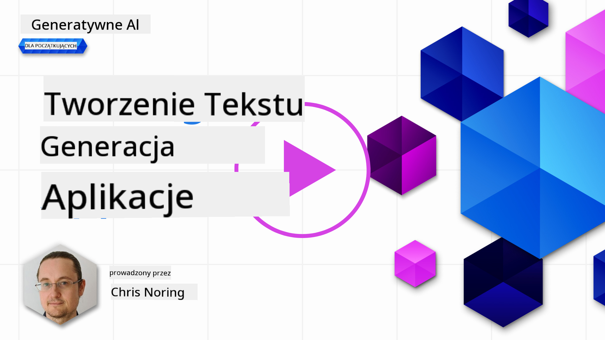

<!--
CO_OP_TRANSLATOR_METADATA:
{
  "original_hash": "5ec6c92b629564538ef397c550adb73e",
  "translation_date": "2025-06-25T14:22:03+00:00",
  "source_file": "06-text-generation-apps/README.md",
  "language_code": "pl"
}
-->
# Budowanie aplikacji do generowania tekstu

[](https://aka.ms/gen-ai-lesson6-gh?WT.mc_id=academic-105485-koreyst)

> _(Kliknij obrazek powyżej, aby obejrzeć wideo z tej lekcji)_

Jak dotąd widziałeś w tym programie nauczania, że istnieją podstawowe pojęcia takie jak podpowiedzi, a nawet cała dziedzina zwana "inżynierią podpowiedzi". Wiele narzędzi, z którymi możesz wchodzić w interakcje, takich jak ChatGPT, Office 365, Microsoft Power Platform i inne, wspiera cię w używaniu podpowiedzi do osiągnięcia celu.

Aby dodać takie doświadczenie do aplikacji, musisz zrozumieć pojęcia takie jak podpowiedzi, uzupełnienia i wybrać bibliotekę do pracy. Tego właśnie nauczysz się w tym rozdziale.

## Wprowadzenie

W tym rozdziale:

- Dowiesz się o bibliotece openai i jej podstawowych pojęciach.
- Zbudujesz aplikację do generowania tekstu używając openai.
- Zrozumiesz, jak używać pojęć takich jak podpowiedź, temperatura i tokeny do budowy aplikacji do generowania tekstu.

## Cele nauki

Po zakończeniu tej lekcji będziesz w stanie:

- Wyjaśnić, czym jest aplikacja do generowania tekstu.
- Zbudować aplikację do generowania tekstu używając openai.
- Skonfigurować swoją aplikację, aby używać więcej lub mniej tokenów oraz zmieniać temperaturę, dla zróżnicowanego wyniku.

## Czym jest aplikacja do generowania tekstu?

Zazwyczaj, gdy budujesz aplikację, ma ona jakiś rodzaj interfejsu, jak na przykład:

- Oparty na komendach. Aplikacje konsolowe to typowe aplikacje, w których wpisujesz komendę i wykonuje ona zadanie. Na przykład, `git` to aplikacja oparta na komendach.
- Interfejs użytkownika (UI). Niektóre aplikacje mają graficzne interfejsy użytkownika (GUI), gdzie klikasz przyciski, wpisujesz tekst, wybierasz opcje i inne.

### Aplikacje konsolowe i UI są ograniczone

Porównaj to z aplikacją opartą na komendach, gdzie wpisujesz komendę:

- **Jest ograniczona**. Nie możesz wpisać dowolnej komendy, tylko te, które aplikacja obsługuje.
- **Specyficzna dla języka**. Niektóre aplikacje obsługują wiele języków, ale domyślnie aplikacja jest zbudowana dla konkretnego języka, nawet jeśli można dodać obsługę innych języków.

### Korzyści z aplikacji do generowania tekstu

Więc czym różni się aplikacja do generowania tekstu?

W aplikacji do generowania tekstu masz większą elastyczność, nie jesteś ograniczony do zestawu komend lub konkretnego języka wejściowego. Zamiast tego możesz używać języka naturalnego do interakcji z aplikacją. Kolejną korzyścią jest to, że już wchodzisz w interakcję z źródłem danych, które zostało wytrenowane na ogromnym korpusie informacji, podczas gdy tradycyjna aplikacja może być ograniczona do tego, co jest w bazie danych.

### Co mogę zbudować z aplikacją do generowania tekstu?

Możesz zbudować wiele rzeczy. Na przykład:

- **Chatbot**. Chatbot odpowiadający na pytania dotyczące tematów, takich jak twoja firma i jej produkty, może być dobrym wyborem.
- **Pomocnik**. LLM-y świetnie nadają się do takich rzeczy jak podsumowywanie tekstu, uzyskiwanie wglądu z tekstu, produkowanie tekstu jak CV i więcej.
- **Asystent kodu**. W zależności od modelu językowego, którego używasz, możesz zbudować asystenta kodu, który pomoże ci pisać kod. Na przykład, możesz użyć produktu takiego jak GitHub Copilot oraz ChatGPT, aby pomóc ci pisać kod.

## Jak mogę zacząć?

Musisz znaleźć sposób na integrację z LLM, co zazwyczaj obejmuje dwa podejścia:

- Użyj API. Tutaj tworzysz żądania sieciowe z twoją podpowiedzią i otrzymujesz wygenerowany tekst.
- Użyj biblioteki. Biblioteki pomagają enkapsulować wywołania API i ułatwiają ich użycie.

## Biblioteki/SDK

Istnieje kilka dobrze znanych bibliotek do pracy z LLM, takich jak:

- **openai**, ta biblioteka ułatwia połączenie z twoim modelem i wysyłanie podpowiedzi.

Następnie są biblioteki, które działają na wyższym poziomie, takie jak:

- **Langchain**. Langchain jest dobrze znany i obsługuje Pythona.
- **Semantic Kernel**. Semantic Kernel to biblioteka Microsoftu obsługująca języki C#, Python i Java.

## Pierwsza aplikacja używająca openai

Zobaczmy, jak możemy zbudować naszą pierwszą aplikację, jakie biblioteki są potrzebne, ile to wymaga i tak dalej.

### Instalacja openai

Istnieje wiele bibliotek do interakcji z OpenAI lub Azure OpenAI. Można używać różnych języków programowania, takich jak C#, Python, JavaScript, Java i inne. Wybraliśmy użycie biblioteki `openai` Python, więc użyjemy `pip`, aby ją zainstalować.

```bash
pip install openai
```

### Tworzenie zasobu

Musisz wykonać następujące kroki:

- Utwórz konto na Azure [https://azure.microsoft.com/free/](https://azure.microsoft.com/free/?WT.mc_id=academic-105485-koreyst).
- Uzyskaj dostęp do Azure OpenAI. Przejdź do [https://learn.microsoft.com/azure/ai-services/openai/overview#how-do-i-get-access-to-azure-openai](https://learn.microsoft.com/azure/ai-services/openai/overview#how-do-i-get-access-to-azure-openai?WT.mc_id=academic-105485-koreyst) i poproś o dostęp.

  > [!NOTE]
  > W momencie pisania tego tekstu, musisz złożyć wniosek o dostęp do Azure OpenAI.

- Zainstaluj Python <https://www.python.org/>
- Utwórz zasób Azure OpenAI Service. Zobacz ten przewodnik, jak [utworzyć zasób](https://learn.microsoft.com/azure/ai-services/openai/how-to/create-resource?pivots=web-portal?WT.mc_id=academic-105485-koreyst).

### Lokalizowanie klucza API i punktu końcowego

W tym momencie musisz powiedzieć swojej bibliotece `openai`, jakiego klucza API użyć. Aby znaleźć swój klucz API, przejdź do sekcji "Keys and Endpoint" swojego zasobu Azure OpenAI i skopiuj wartość "Key 1".


Teraz, gdy masz te informacje skopiowane, poinstruuj biblioteki, aby je używały.

> [!NOTE]
> Warto oddzielić klucz API od kodu. Możesz to zrobić, używając zmiennych środowiskowych.
>
> - Ustaw zmienną środowiskową `OPENAI_API_KEY` to your API key.
>   `export OPENAI_API_KEY='sk-...'`

### Konfiguracja Azure

Jeśli używasz Azure OpenAI, oto jak skonfigurować ustawienia:

```python
openai.api_type = 'azure'
openai.api_key = os.environ["OPENAI_API_KEY"]
openai.api_version = '2023-05-15'
openai.api_base = os.getenv("API_BASE")
```

Powyżej ustawiamy następujące elementy:

- `api_type` to `azure`. This tells the library to use Azure OpenAI and not OpenAI.
- `api_key`, this is your API key found in the Azure Portal.
- `api_version`, this is the version of the API you want to use. At the time of writing, the latest version is `2023-05-15`.
- `api_base`, this is the endpoint of the API. You can find it in the Azure Portal next to your API key.

> [!NOTE] > `os.getenv` is a function that reads environment variables. You can use it to read environment variables like `OPENAI_API_KEY` and `API_BASE`. Set these environment variables in your terminal or by using a library like `dotenv`.

## Generate text

The way to generate text is to use the `Completion` class. Oto przykład:

```python
prompt = "Complete the following: Once upon a time there was a"

completion = openai.Completion.create(model="davinci-002", prompt=prompt)
print(completion.choices[0].text)
```

W powyższym kodzie tworzymy obiekt uzupełnienia i przekazujemy model, którego chcemy użyć oraz podpowiedź. Następnie drukujemy wygenerowany tekst.

### Uzupełnienia czatu

Jak dotąd widziałeś, jak używamy `Completion` to generate text. But there's another class called `ChatCompletion`, który jest bardziej odpowiedni dla chatbotów. Oto przykład jego użycia:

```python
import openai

openai.api_key = "sk-..."

completion = openai.ChatCompletion.create(model="gpt-3.5-turbo", messages=[{"role": "user", "content": "Hello world"}])
print(completion.choices[0].message.content)
```

Więcej na temat tej funkcji w nadchodzącym rozdziale.

## Ćwiczenie - twoja pierwsza aplikacja do generowania tekstu

Teraz, gdy nauczyliśmy się, jak skonfigurować i skonfigurować openai, czas zbudować swoją pierwszą aplikację do generowania tekstu. Aby zbudować swoją aplikację, wykonaj te kroki:

1. Utwórz wirtualne środowisko i zainstaluj openai:

   ```bash
   python -m venv venv
   source venv/bin/activate
   pip install openai
   ```

   > [!NOTE]
   > Jeśli używasz Windows, wpisz `venv\Scripts\activate` instead of `source venv/bin/activate`.

   > [!NOTE]
   > Locate your Azure OpenAI key by going to [https://portal.azure.com/](https://portal.azure.com/?WT.mc_id=academic-105485-koreyst) and search for `Open AI` and select the `Open AI resource` and then select `Keys and Endpoint` and copy the `Key 1` value.

1. Utwórz plik _app.py_ i umieść w nim następujący kod:

   ```python
   import openai

   openai.api_key = "<replace this value with your open ai key or Azure OpenAI key>"

   openai.api_type = 'azure'
   openai.api_version = '2023-05-15'
   openai.api_base = "<endpoint found in Azure Portal where your API key is>"
   deployment_name = "<deployment name>"

   # add your completion code
   prompt = "Complete the following: Once upon a time there was a"
   messages = [{"role": "user", "content": prompt}]

   # make completion
   completion = openai.chat.completions.create(model=deployment_name, messages=messages)

   # print response
   print(completion.choices[0].message.content)
   ```

   > [!NOTE]
   > Jeśli używasz Azure OpenAI, musisz ustawić `api_type` to `azure` and set the `api_key` na swój klucz Azure OpenAI.

   Powinieneś zobaczyć wynik podobny do poniższego:

   ```output
    very unhappy _____.

   Once upon a time there was a very unhappy mermaid.
   ```

## Różne typy podpowiedzi, do różnych rzeczy

Teraz widziałeś, jak generować tekst za pomocą podpowiedzi. Masz nawet działający program, który możesz modyfikować i zmieniać, aby generować różne typy tekstu.

Podpowiedzi mogą być używane do różnych zadań. Na przykład:

- **Generowanie typu tekstu**. Na przykład, możesz wygenerować wiersz, pytania do quizu itp.
- **Wyszukiwanie informacji**. Możesz używać podpowiedzi do wyszukiwania informacji, jak na przykład 'Co oznacza CORS w tworzeniu stron internetowych?'.
- **Generowanie kodu**. Możesz używać podpowiedzi do generowania kodu, na przykład tworząc wyrażenie regularne używane do walidacji e-maili lub dlaczego nie wygenerować całego programu, jak aplikacja webowa?

## Bardziej praktyczne zastosowanie: generator przepisów

Wyobraź sobie, że masz składniki w domu i chcesz coś ugotować. Do tego potrzebujesz przepisu. Sposobem na znalezienie przepisów jest użycie wyszukiwarki lub możesz użyć LLM do tego celu.

Możesz napisać podpowiedź w ten sposób:

> "Pokaż mi 5 przepisów na danie z następującymi składnikami: kurczak, ziemniaki i marchewki. Na przepis, wymień wszystkie użyte składniki"

W odpowiedzi na powyższą podpowiedź możesz otrzymać odpowiedź podobną do:

```output
1. Roasted Chicken and Vegetables:
Ingredients:
- 4 chicken thighs
- 2 potatoes, cut into cubes
- 2 carrots, cut into cubes
- 2 tablespoons olive oil
- 2 cloves garlic, minced
- 1 teaspoon dried thyme
- 1 teaspoon dried oregano
- Salt and pepper, to taste

2. Chicken and Potato Stew:
Ingredients:
- 2 tablespoons olive oil
- 1 onion, diced
- 2 cloves garlic, minced
- 2 chicken breasts, cut into cubes
- 2 potatoes, cut into cubes
- 2 carrots, cut into cubes
- 1 teaspoon dried oregano
- 1 teaspoon dried thyme
- 1 cup chicken broth
- Salt and pepper, to taste

3. Chicken and Potato Bake:
Ingredients:
- 2 tablespoons olive oil
- 2 chicken breasts, cut into cubes
- 2 potatoes, cut into cubes
- 2 carrots, cut into cubes
- 1 onion, diced
- 2 cloves garlic, minced
- 1 teaspoon dried oregano
- 1 teaspoon dried thyme
- 1 cup chicken broth
- Salt and pepper, to taste

4. Chicken and Potato Soup:
Ingredients:
- 2 tablespoons olive oil
- 1 onion, diced
- 2 cloves garlic, minced
- 2 chicken breasts, cut into cubes
- 2 potatoes, cut into cubes
- 2 carrots, cut into cubes
- 1 teaspoon dried oregano
- 1 teaspoon dried thyme
- 4 cups chicken broth
- Salt and pepper, to taste

5. Chicken and Potato Hash:
Ingredients:
- 2 tablespoons olive oil
- 2 chicken breasts, cut into cubes
- 2 potatoes, cut into cubes
- 2 carrots, cut into cubes
- 1 onion, diced
- 2 cloves garlic, minced
- 1 teaspoon dried oregano
```

Ten wynik jest świetny, wiem, co gotować. W tym momencie, co mogłoby być przydatnymi ulepszeniami, to:

- Filtrowanie składników, których nie lubię lub na które jestem uczulony.
- Stworzenie listy zakupów, na wypadek, gdyby zabrakło mi składników w domu.

Dla powyższych przypadków, dodajmy dodatkową podpowiedź:

> "Proszę usuń przepisy z czosnkiem, ponieważ jestem na niego uczulony i zastąp go czymś innym. Również, proszę stwórz listę zakupów dla przepisów, biorąc pod uwagę, że mam już kurczaka, ziemniaki i marchewki w domu."

Teraz masz nowy wynik, mianowicie:

```output
1. Roasted Chicken and Vegetables:
Ingredients:
- 4 chicken thighs
- 2 potatoes, cut into cubes
- 2 carrots, cut into cubes
- 2 tablespoons olive oil
- 1 teaspoon dried thyme
- 1 teaspoon dried oregano
- Salt and pepper, to taste

2. Chicken and Potato Stew:
Ingredients:
- 2 tablespoons olive oil
- 1 onion, diced
- 2 chicken breasts, cut into cubes
- 2 potatoes, cut into cubes
- 2 carrots, cut into cubes
- 1 teaspoon dried oregano
- 1 teaspoon dried thyme
- 1 cup chicken broth
- Salt and pepper, to taste

3. Chicken and Potato Bake:
Ingredients:
- 2 tablespoons olive oil
- 2 chicken breasts, cut into cubes
- 2 potatoes, cut into cubes
- 2 carrots, cut into cubes
- 1 onion, diced
- 1 teaspoon dried oregano
- 1 teaspoon dried thyme
- 1 cup chicken broth
- Salt and pepper, to taste

4. Chicken and Potato Soup:
Ingredients:
- 2 tablespoons olive oil
- 1 onion, diced
- 2 chicken breasts, cut into cubes
- 2 potatoes, cut into cubes
- 2 carrots, cut into cubes
- 1 teaspoon dried oregano
- 1 teaspoon dried thyme
- 4 cups chicken broth
- Salt and pepper, to taste

5. Chicken and Potato Hash:
Ingredients:
- 2 tablespoons olive oil
- 2 chicken breasts, cut into cubes
- 2 potatoes, cut into cubes
- 2 carrots, cut into cubes
- 1 onion, diced
- 1 teaspoon dried oregano

Shopping List:
- Olive oil
- Onion
- Thyme
- Oregano
- Salt
- Pepper
```

To twoje pięć przepisów, bez wspomnienia o czosnku i masz również listę zakupów, biorąc pod uwagę to, co już masz w domu.

## Ćwiczenie - zbuduj generator przepisów

Teraz, gdy przećwiczyliśmy scenariusz, napiszmy kod, aby dopasować się do przedstawionego scenariusza. Aby to zrobić, wykonaj te kroki:

1. Użyj istniejącego pliku _app.py_ jako punktu wyjścia
1. Zlokalizuj zmienną `prompt` i zmień jej kod na następujący:

   ```python
   prompt = "Show me 5 recipes for a dish with the following ingredients: chicken, potatoes, and carrots. Per recipe, list all the ingredients used"
   ```

   Jeśli teraz uruchomisz kod, powinieneś zobaczyć wynik podobny do:

   ```output
   -Chicken Stew with Potatoes and Carrots: 3 tablespoons oil, 1 onion, chopped, 2 cloves garlic, minced, 1 carrot, peeled and chopped, 1 potato, peeled and chopped, 1 bay leaf, 1 thyme sprig, 1/2 teaspoon salt, 1/4 teaspoon black pepper, 1 1/2 cups chicken broth, 1/2 cup dry white wine, 2 tablespoons chopped fresh parsley, 2 tablespoons unsalted butter, 1 1/2 pounds boneless, skinless chicken thighs, cut into 1-inch pieces
   -Oven-Roasted Chicken with Potatoes and Carrots: 3 tablespoons extra-virgin olive oil, 1 tablespoon Dijon mustard, 1 tablespoon chopped fresh rosemary, 1 tablespoon chopped fresh thyme, 4 cloves garlic, minced, 1 1/2 pounds small red potatoes, quartered, 1 1/2 pounds carrots, quartered lengthwise, 1/2 teaspoon salt, 1/4 teaspoon black pepper, 1 (4-pound) whole chicken
   -Chicken, Potato, and Carrot Casserole: cooking spray, 1 large onion, chopped, 2 cloves garlic, minced, 1 carrot, peeled and shredded, 1 potato, peeled and shredded, 1/2 teaspoon dried thyme leaves, 1/4 teaspoon salt, 1/4 teaspoon black pepper, 2 cups fat-free, low-sodium chicken broth, 1 cup frozen peas, 1/4 cup all-purpose flour, 1 cup 2% reduced-fat milk, 1/4 cup grated Parmesan cheese

   -One Pot Chicken and Potato Dinner: 2 tablespoons olive oil, 1 pound boneless, skinless chicken thighs, cut into 1-inch pieces, 1 large onion, chopped, 3 cloves garlic, minced, 1 carrot, peeled and chopped, 1 potato, peeled and chopped, 1 bay leaf, 1 thyme sprig, 1/2 teaspoon salt, 1/4 teaspoon black pepper, 2 cups chicken broth, 1/2 cup dry white wine

   -Chicken, Potato, and Carrot Curry: 1 tablespoon vegetable oil, 1 large onion, chopped, 2 cloves garlic, minced, 1 carrot, peeled and chopped, 1 potato, peeled and chopped, 1 teaspoon ground coriander, 1 teaspoon ground cumin, 1/2 teaspoon ground turmeric, 1/2 teaspoon ground ginger, 1/4 teaspoon cayenne pepper, 2 cups chicken broth, 1/2 cup dry white wine, 1 (15-ounce) can chickpeas, drained and rinsed, 1/2 cup raisins, 1/2 cup chopped fresh cilantro
   ```

   > UWAGA, twój LLM jest niedeterministyczny, więc możesz otrzymywać różne wyniki za każdym razem, gdy uruchamiasz program.

   Świetnie, zobaczmy, jak możemy poprawić rzeczy. Aby poprawić rzeczy, chcemy upewnić się, że kod jest elastyczny, więc składniki i liczba przepisów mogą być poprawiane i zmieniane.

1. Zmieńmy kod w następujący sposób:

   ```python
   no_recipes = input("No of recipes (for example, 5): ")

   ingredients = input("List of ingredients (for example, chicken, potatoes, and carrots): ")

   # interpolate the number of recipes into the prompt an ingredients
   prompt = f"Show me {no_recipes} recipes for a dish with the following ingredients: {ingredients}. Per recipe, list all the ingredients used"
   ```

   Testowe uruchomienie kodu może wyglądać tak:

   ```output
   No of recipes (for example, 5): 3
   List of ingredients (for example, chicken, potatoes, and carrots): milk,strawberries

   -Strawberry milk shake: milk, strawberries, sugar, vanilla extract, ice cubes
   -Strawberry shortcake: milk, flour, baking powder, sugar, salt, unsalted butter, strawberries, whipped cream
   -Strawberry milk: milk, strawberries, sugar, vanilla extract
   ```

### Ulepszanie poprzez dodanie filtru i listy zakupów

Teraz mamy działającą aplikację zdolną do produkcji przepisów i jest elastyczna, ponieważ opiera się na danych wejściowych od użytkownika, zarówno co do liczby przepisów, jak i użytych składników.

Aby dalej to ulepszyć, chcemy dodać następujące:

- **Filtrowanie składników**. Chcemy móc filtrować składniki, których nie lubimy lub na które jesteśmy uczuleni. Aby dokonać tej zmiany, możemy edytować naszą istniejącą podpowiedź i dodać warunek filtru na końcu, jak poniżej:

  ```python
  filter = input("Filter (for example, vegetarian, vegan, or gluten-free): ")

  prompt = f"Show me {no_recipes} recipes for a dish with the following ingredients: {ingredients}. Per recipe, list all the ingredients used, no {filter}"
  ```

  Powyżej, dodajemy `{filter}` na końcu podpowiedzi i również przechwytujemy wartość filtru od użytkownika.

  Przykładowe dane wejściowe przy uruchomieniu programu mogą teraz wyglądać tak:

  ```output
  No of recipes (for example, 5): 3
  List of ingredients (for example, chicken, potatoes, and carrots): onion,milk
  Filter (for example, vegetarian, vegan, or gluten-free): no milk

  1. French Onion Soup

  Ingredients:

  -1 large onion, sliced
  -3 cups beef broth
  -1 cup milk
  -6 slices french bread
  -1/4 cup shredded Parmesan cheese
  -1 tablespoon butter
  -1 teaspoon dried thyme
  -1/4 teaspoon salt
  -1/4 teaspoon black pepper

  Instructions:

  1. In a large pot, sauté onions in butter until golden brown.
  2. Add beef broth, milk, thyme, salt, and pepper. Bring to a boil.
  3. Reduce heat and simmer for 10 minutes.
  4. Place french bread slices on soup bowls.
  5. Ladle soup over bread.
  6. Sprinkle with Parmesan cheese.

  2. Onion and Potato Soup

  Ingredients:

  -1 large onion, chopped
  -2 cups potatoes, diced
  -3 cups vegetable broth
  -1 cup milk
  -1/4 teaspoon black pepper

  Instructions:

  1. In a large pot, sauté onions in butter until golden brown.
  2. Add potatoes, vegetable broth, milk, and pepper. Bring to a boil.
  3. Reduce heat and simmer for 10 minutes.
  4. Serve hot.

  3. Creamy Onion Soup

  Ingredients:

  -1 large onion, chopped
  -3 cups vegetable broth
  -1 cup milk
  -1/4 teaspoon black pepper
  -1/4 cup all-purpose flour
  -1/2 cup shredded Parmesan cheese

  Instructions:

  1. In a large pot, sauté onions in butter until golden brown.
  2. Add vegetable broth, milk, and pepper. Bring to a boil.
  3. Reduce heat and simmer for 10 minutes.
  4. In a small bowl, whisk together flour and Parmesan cheese until smooth.
  5. Add to soup and simmer for an additional 5 minutes, or until soup has thickened.
  ```

  Jak widać, wszelkie przepisy z mlekiem zostały odfiltrowane. Ale, jeśli jesteś nietolerancyjny laktozy, możesz chcieć odfiltrować również przepisy z serem, więc istnieje potrzeba, aby być precyzyjnym.

- **Stworzenie listy zakupów**. Chcemy stworzyć listę zakupów, biorąc pod uwagę to, co już mamy w domu.

  Dla tej funkcjonalności, możemy albo spróbować rozwiązać wszystko w jednej podpowiedzi, albo podzielić to na dwie podpowiedzi. Spróbujmy drugiego podejścia. Tutaj sugerujemy dodanie dodatkowej podpowiedzi, ale aby to zadziałało, musimy dodać wynik pierwszej podpowiedzi jako kontekst do drugiej podpowiedzi.

  Zlokalizuj część w kodzie, która drukuje wynik z pierwszej podpowiedzi i dodaj poniższy kod poniżej:

  ```python
  old_prompt_result = completion.choices[0].message.content
  prompt = "Produce a shopping list for the generated recipes and please don't include ingredients that I already have."

  new_prompt = f"{old_prompt_result} {prompt}"
  messages = [{"role": "user", "content": new_prompt}]
  completion = openai.Completion.create(engine=deployment_name, messages=messages, max_tokens=1200)

  # print response
  print("Shopping list:")
  print(completion.choices[0].message.content)
  ```

  Zwróć uwagę na następujące:

  1. Konstruujemy nową podpowiedź, dodając wynik z pierwszej podpowiedzi do nowej podpowiedzi:

     ```python
     new_prompt = f"{old_prompt_result} {prompt}"
     ```

  1. Robimy nowe żądanie, ale również biorąc pod uwagę liczbę tokenów, o które prosiliśmy w pierwszej podpowiedzi, więc tym razem mówimy `max_tokens` to 1200.

     ```python
     completion = openai.Completion.create(engine=deployment_name, prompt=new_prompt, max_tokens=1200)
     ```

     Przeprowadzając test z tym kodem, otrzymujemy następujący wynik:

     ```output
     No of recipes (for example, 5): 2
     List of ingredients (for example, chicken, potatoes, and carrots): apple,flour
     Filter (for example, vegetarian, vegan, or gluten-free): sugar


     -Apple and flour pancakes: 1 cup flour, 1/2 tsp baking powder, 1/2 tsp baking soda, 1/4 tsp salt, 1 tbsp sugar, 1 egg, 1 cup buttermilk or sour milk, 1/4 cup melted butter, 1 Granny Smith apple, peeled and grated
     -Apple fritters: 1-1/2 cups flour, 1 tsp baking powder, 1/4 tsp salt, 1/4 tsp baking soda, 1/4 tsp nutmeg, 1/4 tsp cinnamon, 1/4 tsp allspice, 1/4 cup sugar, 1/4 cup vegetable shortening, 1/4 cup milk, 1 egg, 2 cups shredded, peeled apples
     Shopping list:
     -Flour, baking powder, baking soda, salt, sugar, egg, buttermilk, butter, apple, nutmeg, cinnamon, allspice
     ```

## Popraw swoją konfigurację

To, co mamy do tej pory, to kod, który działa, ale są pewne poprawki, które powinniśmy wprowadzić, aby dalej poprawić rzeczy. Niektóre rzeczy, które powinniśmy zrobić, to:

- **Oddzielenie sekretów od kodu**, takich jak klucz API. Sekrety nie należą do kodu i powinny być przechowywane w bezpiecznym miejscu. Aby oddzielić sekrety od kodu, możemy użyć zmiennych środowiskowych i bibliotek takich jak `python-dotenv` to load them from a file. Here's how that would look like in code:

  1. Create a `.env` file with the following content:

     ```bash
     OPENAI_API_KEY=sk-...
     ```

     > Uwaga, dla Azure, musisz ustawić następujące zmienne środowiskowe:

     ```bash
     OPENAI_API_TYPE=azure
     OPENAI_API_VERSION=2023-05-15
     OPENAI_API_BASE=<replace>
     ```

     W kodzie, załadujesz zmienne środowiskowe w następujący sposób:

     ```python
     from dotenv import load_dotenv

     load_dotenv()

     openai.api_key = os.environ["OPENAI_API_KEY"]
     ```

- **Słowo o długości tokenów**. Powinniśmy rozważyć, ile tokenów potrzebujemy, aby wygenerować tekst, który chcemy. Tokeny kosztują, więc tam, gdzie to możliwe, powinniśmy starać się być oszczędni z liczbą używanych tokenów. Na przykład, czy możemy

**Zastrzeżenie**:  
Ten dokument został przetłumaczony za pomocą usługi tłumaczenia AI [Co-op Translator](https://github.com/Azure/co-op-translator). Chociaż dążymy do dokładności, prosimy pamiętać, że automatyczne tłumaczenia mogą zawierać błędy lub nieścisłości. Oryginalny dokument w jego rodzimym języku powinien być uznawany za źródło autorytatywne. W przypadku informacji krytycznych zalecane jest profesjonalne tłumaczenie przez człowieka. Nie ponosimy odpowiedzialności za jakiekolwiek nieporozumienia lub błędne interpretacje wynikające z użycia tego tłumaczenia.