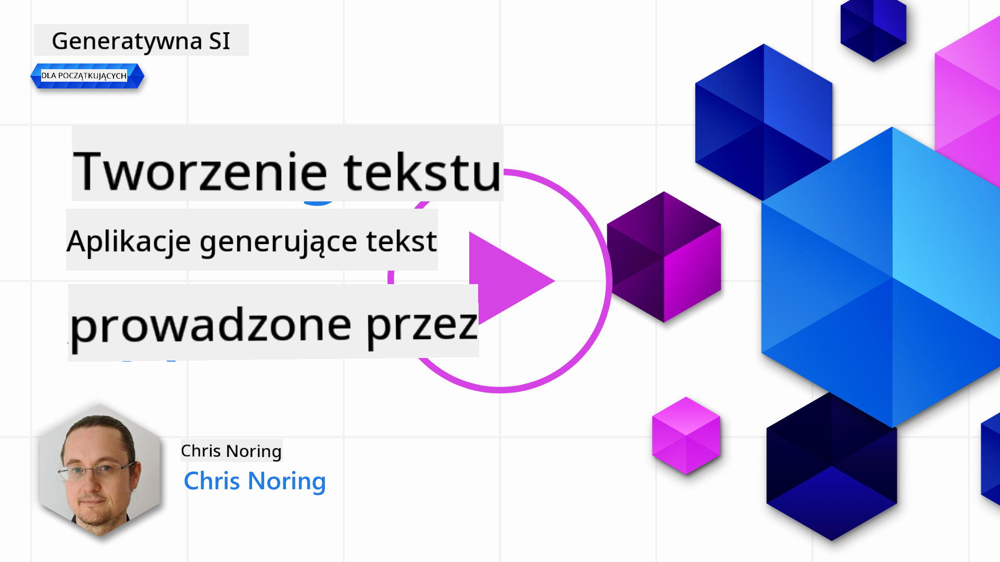

<!--
CO_OP_TRANSLATOR_METADATA:
{
  "original_hash": "df027997f1448323d6159b78a1b669bf",
  "translation_date": "2025-10-18T00:50:11+00:00",
  "source_file": "06-text-generation-apps/README.md",
  "language_code": "pl"
}
-->
# Tworzenie aplikacji generujących tekst

[](https://youtu.be/0Y5Luf5sRQA?si=t_xVg0clnAI4oUFZ)

> _(Kliknij obrazek powyżej, aby obejrzeć wideo z tej lekcji)_

Jak dotąd w tym kursie poznaliśmy kluczowe pojęcia, takie jak podpowiedzi (prompts) oraz całą dziedzinę zwaną "inżynierią podpowiedzi". Wiele narzędzi, z którymi możesz się zetknąć, takich jak ChatGPT, Office 365, Microsoft Power Platform i inne, umożliwia korzystanie z podpowiedzi w celu osiągnięcia określonych celów.

Aby dodać takie doświadczenie do swojej aplikacji, musisz zrozumieć pojęcia takie jak podpowiedzi, wyniki (completions) i wybrać odpowiednią bibliotekę do pracy. Właśnie tego nauczysz się w tym rozdziale.

## Wprowadzenie

W tym rozdziale dowiesz się:

- Czym jest biblioteka openai i jakie są jej podstawowe pojęcia.
- Jak zbudować aplikację generującą tekst za pomocą openai.
- Jak używać pojęć takich jak podpowiedź, temperatura i tokeny do stworzenia aplikacji generującej tekst.

## Cele nauki

Na końcu tej lekcji będziesz w stanie:

- Wyjaśnić, czym jest aplikacja generująca tekst.
- Zbudować aplikację generującą tekst za pomocą openai.
- Skonfigurować swoją aplikację tak, aby używała więcej lub mniej tokenów oraz zmieniała temperaturę dla uzyskania zróżnicowanych wyników.

## Czym jest aplikacja generująca tekst?

Zazwyczaj, gdy tworzysz aplikację, ma ona jakiś rodzaj interfejsu, na przykład:

- Oparty na komendach. Typowe aplikacje konsolowe, w których wpisujesz komendę, a aplikacja wykonuje zadanie. Na przykład `git` jest aplikacją opartą na komendach.
- Interfejs użytkownika (UI). Niektóre aplikacje mają graficzne interfejsy użytkownika (GUI), w których klikasz przyciski, wpisujesz tekst, wybierasz opcje i więcej.

### Ograniczenia aplikacji konsolowych i UI

Porównaj to z aplikacją opartą na komendach, gdzie wpisujesz komendę:

- **Jest ograniczona**. Nie możesz wpisać dowolnej komendy, tylko te, które aplikacja obsługuje.
- **Specyficzna dla języka**. Niektóre aplikacje obsługują wiele języków, ale domyślnie aplikacja jest zbudowana dla konkretnego języka, nawet jeśli można dodać wsparcie dla innych języków.

### Korzyści z aplikacji generujących tekst

Czym więc różni się aplikacja generująca tekst?

W aplikacji generującej tekst masz większą elastyczność, nie jesteś ograniczony do zestawu komend czy konkretnego języka wejściowego. Zamiast tego możesz używać języka naturalnego do interakcji z aplikacją. Kolejną korzyścią jest to, że już korzystasz z bazy danych, która została przeszkolona na ogromnym korpusie informacji, podczas gdy tradycyjna aplikacja może być ograniczona do tego, co znajduje się w bazie danych.

### Co mogę zbudować za pomocą aplikacji generującej tekst?

Możesz zbudować wiele rzeczy. Na przykład:

- **Chatbot**. Chatbot odpowiadający na pytania dotyczące tematów, takich jak Twoja firma i jej produkty, może być dobrym rozwiązaniem.
- **Asystent**. Modele językowe (LLM) świetnie nadają się do takich zadań jak podsumowywanie tekstu, uzyskiwanie wglądu w tekst, tworzenie tekstów takich jak CV i wiele innych.
- **Asystent kodowania**. W zależności od używanego modelu językowego możesz stworzyć asystenta kodowania, który pomoże Ci pisać kod. Na przykład możesz użyć produktu takiego jak GitHub Copilot oraz ChatGPT, aby pomóc w pisaniu kodu.

## Jak zacząć?

Musisz znaleźć sposób na integrację z LLM, co zazwyczaj obejmuje dwa podejścia:

- Korzystanie z API. Tworzysz tutaj żądania sieciowe z podpowiedzią i otrzymujesz wygenerowany tekst.
- Korzystanie z biblioteki. Biblioteki pomagają kapsułkować wywołania API i ułatwiają ich użycie.

## Biblioteki/SDK

Istnieje kilka dobrze znanych bibliotek do pracy z LLM, takich jak:

- **openai**, ta biblioteka ułatwia połączenie z modelem i przesyłanie podpowiedzi.

Są też biblioteki działające na wyższym poziomie, takie jak:

- **Langchain**. Langchain jest dobrze znany i obsługuje język Python.
- **Semantic Kernel**. Semantic Kernel to biblioteka Microsoftu obsługująca języki C#, Python i Java.

## Pierwsza aplikacja za pomocą openai

Zobaczmy, jak możemy zbudować naszą pierwszą aplikację, jakie biblioteki są potrzebne, ile pracy wymaga i tak dalej.

### Instalacja openai

Istnieje wiele bibliotek do interakcji z OpenAI lub Azure OpenAI. Można używać różnych języków programowania, takich jak C#, Python, JavaScript, Java i inne. Wybraliśmy bibliotekę `openai` w Pythonie, więc użyjemy `pip`, aby ją zainstalować.

```bash
pip install openai
```

### Utwórz zasób

Musisz wykonać następujące kroki:

- Utwórz konto na Azure [https://azure.microsoft.com/free/](https://azure.microsoft.com/free/?WT.mc_id=academic-105485-koreyst).
- Uzyskaj dostęp do Azure OpenAI. Przejdź do [https://learn.microsoft.com/azure/ai-services/openai/overview#how-do-i-get-access-to-azure-openai](https://learn.microsoft.com/azure/ai-services/openai/overview#how-do-i-get-access-to-azure-openai?WT.mc_id=academic-105485-koreyst) i złóż wniosek o dostęp.

  > [!NOTE]
  > Na moment pisania tego tekstu, dostęp do Azure OpenAI wymaga aplikacji.

- Zainstaluj Python <https://www.python.org/>
- Utwórz zasób Azure OpenAI Service. Zobacz ten przewodnik, jak [utworzyć zasób](https://learn.microsoft.com/azure/ai-services/openai/how-to/create-resource?pivots=web-portal?WT.mc_id=academic-105485-koreyst).

### Znajdź klucz API i punkt końcowy

Na tym etapie musisz poinformować swoją bibliotekę `openai`, jaki klucz API ma używać. Aby znaleźć swój klucz API, przejdź do sekcji "Keys and Endpoint" w zasobie Azure OpenAI i skopiuj wartość "Key 1".


Teraz, gdy masz skopiowane te informacje, poinstruuj biblioteki, aby z nich korzystały.

> [!NOTE]
> Warto oddzielić klucz API od kodu. Możesz to zrobić, używając zmiennych środowiskowych.
>
> - Ustaw zmienną środowiskową `OPENAI_API_KEY` na swój klucz API.
>   `export OPENAI_API_KEY='sk-...'`

### Konfiguracja Azure

Jeśli korzystasz z Azure OpenAI, oto jak skonfigurować ustawienia:

```python
openai.api_type = 'azure'
openai.api_key = os.environ["OPENAI_API_KEY"]
openai.api_version = '2023-05-15'
openai.api_base = os.getenv("API_BASE")
```

Powyżej ustawiamy następujące:

- `api_type` na `azure`. Informuje to bibliotekę, aby używała Azure OpenAI zamiast OpenAI.
- `api_key`, to Twój klucz API znaleziony w portalu Azure.
- `api_version`, to wersja API, którą chcesz używać. Na moment pisania najnowsza wersja to `2023-05-15`.
- `api_base`, to punkt końcowy API. Możesz go znaleźć w portalu Azure obok swojego klucza API.

> [!NOTE] > `os.getenv` to funkcja, która odczytuje zmienne środowiskowe. Możesz jej używać do odczytywania zmiennych środowiskowych, takich jak `OPENAI_API_KEY` i `API_BASE`. Ustaw te zmienne środowiskowe w terminalu lub używając biblioteki, takiej jak `dotenv`.

## Generowanie tekstu

Sposób generowania tekstu polega na użyciu klasy `Completion`. Oto przykład:

```python
prompt = "Complete the following: Once upon a time there was a"

completion = openai.Completion.create(model="davinci-002", prompt=prompt)
print(completion.choices[0].text)
```

W powyższym kodzie tworzymy obiekt completion i przekazujemy model, którego chcemy użyć, oraz podpowiedź. Następnie drukujemy wygenerowany tekst.

### Generowanie odpowiedzi w stylu czatu

Jak dotąd widzieliśmy, jak używać `Completion` do generowania tekstu. Istnieje jednak inna klasa o nazwie `ChatCompletion`, która jest bardziej odpowiednia dla chatbotów. Oto przykład jej użycia:

```python
import openai

openai.api_key = "sk-..."

completion = openai.ChatCompletion.create(model="gpt-3.5-turbo", messages=[{"role": "user", "content": "Hello world"}])
print(completion.choices[0].message.content)
```

Więcej na temat tej funkcjonalności w nadchodzącym rozdziale.

## Ćwiczenie - Twoja pierwsza aplikacja generująca tekst

Teraz, gdy nauczyliśmy się, jak skonfigurować i używać openai, czas zbudować swoją pierwszą aplikację generującą tekst. Aby ją stworzyć, wykonaj następujące kroki:

1. Utwórz wirtualne środowisko i zainstaluj openai:

   ```bash
   python -m venv venv
   source venv/bin/activate
   pip install openai
   ```

   > [!NOTE]
   > Jeśli używasz Windows, wpisz `venv\Scripts\activate` zamiast `source venv/bin/activate`.

   > [!NOTE]
   > Znajdź swój klucz Azure OpenAI, przechodząc do [https://portal.azure.com/](https://portal.azure.com/?WT.mc_id=academic-105485-koreyst), wyszukaj `Open AI`, wybierz zasób `Open AI` i następnie `Keys and Endpoint`, a potem skopiuj wartość `Key 1`.

1. Utwórz plik _app.py_ i wprowadź do niego następujący kod:

   ```python
   import openai

   openai.api_key = "<replace this value with your open ai key or Azure OpenAI key>"

   openai.api_type = 'azure'
   openai.api_version = '2023-05-15'
   openai.api_base = "<endpoint found in Azure Portal where your API key is>"
   deployment_name = "<deployment name>"

   # add your completion code
   prompt = "Complete the following: Once upon a time there was a"
   messages = [{"role": "user", "content": prompt}]

   # make completion
   completion = openai.chat.completions.create(model=deployment_name, messages=messages)

   # print response
   print(completion.choices[0].message.content)
   ```

   > [!NOTE]
   > Jeśli używasz Azure OpenAI, musisz ustawić `api_type` na `azure` i `api_key` na swój klucz Azure OpenAI.

   Powinieneś zobaczyć wynik podobny do poniższego:

   ```output
    very unhappy _____.

   Once upon a time there was a very unhappy mermaid.
   ```

## Różne typy podpowiedzi do różnych zadań

Teraz widziałeś, jak generować tekst za pomocą podpowiedzi. Masz nawet działający program, który możesz modyfikować i zmieniać, aby generować różne typy tekstu.

Podpowiedzi mogą być używane do różnych zadań. Na przykład:

- **Generowanie określonego rodzaju tekstu**. Na przykład możesz wygenerować wiersz, pytania do quizu itp.
- **Wyszukiwanie informacji**. Możesz używać podpowiedzi do wyszukiwania informacji, na przykład: "Co oznacza CORS w rozwoju webowym?".
- **Generowanie kodu**. Możesz używać podpowiedzi do generowania kodu, na przykład tworzenia wyrażenia regularnego do walidacji adresów e-mail lub nawet całego programu, takiego jak aplikacja webowa.

## Bardziej praktyczny przykład: generator przepisów kulinarnych

Wyobraź sobie, że masz składniki w domu i chcesz coś ugotować. Do tego potrzebujesz przepisu. Jednym ze sposobów na znalezienie przepisów jest użycie wyszukiwarki, ale możesz też skorzystać z LLM.

Możesz napisać podpowiedź w ten sposób:

> "Pokaż mi 5 przepisów na danie z następującymi składnikami: kurczak, ziemniaki i marchew. Dla każdego przepisu wymień wszystkie użyte składniki."

Na podstawie powyższej podpowiedzi możesz otrzymać odpowiedź podobną do:

```output
1. Roasted Chicken and Vegetables:
Ingredients:
- 4 chicken thighs
- 2 potatoes, cut into cubes
- 2 carrots, cut into cubes
- 2 tablespoons olive oil
- 2 cloves garlic, minced
- 1 teaspoon dried thyme
- 1 teaspoon dried oregano
- Salt and pepper, to taste

2. Chicken and Potato Stew:
Ingredients:
- 2 tablespoons olive oil
- 1 onion, diced
- 2 cloves garlic, minced
- 2 chicken breasts, cut into cubes
- 2 potatoes, cut into cubes
- 2 carrots, cut into cubes
- 1 teaspoon dried oregano
- 1 teaspoon dried thyme
- 1 cup chicken broth
- Salt and pepper, to taste

3. Chicken and Potato Bake:
Ingredients:
- 2 tablespoons olive oil
- 2 chicken breasts, cut into cubes
- 2 potatoes, cut into cubes
- 2 carrots, cut into cubes
- 1 onion, diced
- 2 cloves garlic, minced
- 1 teaspoon dried oregano
- 1 teaspoon dried thyme
- 1 cup chicken broth
- Salt and pepper, to taste

4. Chicken and Potato Soup:
Ingredients:
- 2 tablespoons olive oil
- 1 onion, diced
- 2 cloves garlic, minced
- 2 chicken breasts, cut into cubes
- 2 potatoes, cut into cubes
- 2 carrots, cut into cubes
- 1 teaspoon dried oregano
- 1 teaspoon dried thyme
- 4 cups chicken broth
- Salt and pepper, to taste

5. Chicken and Potato Hash:
Ingredients:
- 2 tablespoons olive oil
- 2 chicken breasts, cut into cubes
- 2 potatoes, cut into cubes
- 2 carrots, cut into cubes
- 1 onion, diced
- 2 cloves garlic, minced
- 1 teaspoon dried oregano
```

To świetny wynik, wiem, co mogę ugotować. W tym momencie przydatne mogą być następujące ulepszenia:

- Usunięcie składników, których nie lubię lub na które jestem uczulony.
- Stworzenie listy zakupów, jeśli nie mam wszystkich składników w domu.

Dla powyższych przypadków dodajmy dodatkową podpowiedź:

> "Proszę usuń przepisy z czosnkiem, ponieważ jestem uczulony, i zastąp go czymś innym. Ponadto, proszę stwórz listę zakupów dla przepisów, biorąc pod uwagę, że mam już kurczaka, ziemniaki i marchew w domu."

Teraz otrzymujesz nowy wynik, mianowicie:

```output
1. Roasted Chicken and Vegetables:
Ingredients:
- 4 chicken thighs
- 2 potatoes, cut into cubes
- 2 carrots, cut into cubes
- 2 tablespoons olive oil
- 1 teaspoon dried thyme
- 1 teaspoon dried oregano
- Salt and pepper, to taste

2. Chicken and Potato Stew:
Ingredients:
- 2 tablespoons olive oil
- 1 onion, diced
- 2 chicken breasts, cut into cubes
- 2 potatoes, cut into cubes
- 2 carrots, cut into cubes
- 1 teaspoon dried oregano
- 1 teaspoon dried thyme
- 1 cup chicken broth
- Salt and pepper, to taste

3. Chicken and Potato Bake:
Ingredients:
- 2 tablespoons olive oil
- 2 chicken breasts, cut into cubes
- 2 potatoes, cut into cubes
- 2 carrots, cut into cubes
- 1 onion, diced
- 1 teaspoon dried oregano
- 1 teaspoon dried thyme
- 1 cup chicken broth
- Salt and pepper, to taste

4. Chicken and Potato Soup:
Ingredients:
- 2 tablespoons olive oil
- 1 onion, diced
- 2 chicken breasts, cut into cubes
- 2 potatoes, cut into cubes
- 2 carrots, cut into cubes
- 1 teaspoon dried oregano
- 1 teaspoon dried thyme
- 4 cups chicken broth
- Salt and pepper, to taste

5. Chicken and Potato Hash:
Ingredients:
- 2 tablespoons olive oil
- 2 chicken breasts, cut into cubes
- 2 potatoes, cut into cubes
- 2 carrots, cut into cubes
- 1 onion, diced
- 1 teaspoon dried oregano

Shopping List:
- Olive oil
- Onion
- Thyme
- Oregano
- Salt
- Pepper
```

To Twoje pięć przepisów, bez wzmianki o czosnku, a także masz listę zakupów uwzględniającą to, co już masz w domu.

## Ćwiczenie - zbuduj generator przepisów kulinarnych

Teraz, gdy przećwiczyliśmy scenariusz, napiszmy kod, który odpowiada przedstawionemu scenariuszowi. Aby to zrobić, wykonaj następujące kroki:

1. Użyj istniejącego pliku _app.py_ jako punktu wyjścia.
1. Znajdź zmienną `prompt` i zmień jej kod na następujący:

   ```python
   prompt = "Show me 5 recipes for a dish with the following ingredients: chicken, potatoes, and carrots. Per recipe, list all the ingredients used"
   ```

   Jeśli teraz uruchomisz kod, powinieneś zobaczyć wynik podobny do:

   ```output
   -Chicken Stew with Potatoes and Carrots: 3 tablespoons oil, 1 onion, chopped, 2 cloves garlic, minced, 1 carrot, peeled and chopped, 1 potato, peeled and chopped, 1 bay leaf, 1 thyme sprig, 1/2 teaspoon salt, 1/4 teaspoon black pepper, 1 1/2 cups chicken broth, 1/2 cup dry white wine, 2 tablespoons chopped fresh parsley, 2 tablespoons unsalted butter, 1 1/2 pounds boneless, skinless chicken thighs, cut into 1-inch pieces
   -Oven-Roasted Chicken with Potatoes and Carrots: 3 tablespoons extra-virgin olive oil, 1 tablespoon Dijon mustard, 1 tablespoon chopped fresh rosemary, 1 tablespoon chopped fresh thyme, 4 cloves garlic, minced, 1 1/2 pounds small red potatoes, quartered, 1 1/2 pounds carrots, quartered lengthwise, 1/2 teaspoon salt, 1/4 teaspoon black pepper, 1 (4-pound) whole chicken
   -Chicken, Potato, and Carrot Casserole: cooking spray, 1 large onion, chopped, 2 cloves garlic, minced, 1 carrot, peeled and shredded, 1 potato, peeled and shredded, 1/2 teaspoon dried thyme leaves, 1/4 teaspoon salt, 1/4 teaspoon black pepper, 2 cups fat-free, low-sodium chicken broth, 1 cup frozen peas, 1/4 cup all-purpose flour, 1 cup 2% reduced-fat milk, 1/4 cup grated Parmesan cheese

   -One Pot Chicken and Potato Dinner: 2 tablespoons olive oil, 1 pound boneless, skinless chicken thighs, cut into 1-inch pieces, 1 large onion, chopped, 3 cloves garlic, minced, 1 carrot, peeled and chopped, 1 potato, peeled and chopped, 1 bay leaf, 1 thyme sprig, 1/2 teaspoon salt, 1/4 teaspoon black pepper, 2 cups chicken broth, 1/2 cup dry white wine

   -Chicken, Potato, and Carrot Curry: 1 tablespoon vegetable oil, 1 large onion, chopped, 2 cloves garlic, minced, 1 carrot, peeled and chopped, 1 potato, peeled and chopped, 1 teaspoon ground coriander, 1 teaspoon ground cumin, 1/2 teaspoon ground turmeric, 1/2 teaspoon ground ginger, 1/4 teaspoon cayenne pepper, 2 cups chicken broth, 1/2 cup dry white wine, 1 (15-ounce) can chickpeas, drained and rinsed, 1/2 cup raisins, 1/2 cup chopped fresh cilantro
   ```

   > UWAGA, Twój LLM jest niedeterministyczny, więc za każdym razem, gdy uruchomisz program, możesz otrzymać różne wyniki.

   Świetnie, zobaczmy, jak możemy to ulepszyć. Aby ulepszyć, chcemy upewnić się, że kod jest elastyczny, więc składniki i liczba przepisów mogą być poprawiane i zmieniane.

1. Zmień kod w następujący sposób:

   ```python
   no_recipes = input("No of recipes (for example, 5): ")

   ingredients = input("List of ingredients (for example, chicken, potatoes, and carrots): ")

   # interpolate the number of recipes into the prompt an ingredients
   prompt = f"Show me {no_recipes} recipes for a dish with the following ingredients: {ingredients}. Per recipe, list all the ingredients used"
   ```

   Testowanie kodu może wyglądać tak:

   ```output
   No of recipes (for example, 5): 3
   List of ingredients (for example, chicken, potatoes, and carrots): milk,strawberries

   -Strawberry milk shake: milk, strawberries, sugar, vanilla extract, ice cubes
   -Strawberry shortcake: milk, flour, baking powder, sugar, salt, unsalted butter, strawberries, whipped cream
   -Strawberry milk: milk, strawberries, sugar, vanilla extract
   ```

### Ulepszenie poprzez dodanie filtra i listy zakupów

Teraz mamy działającą aplikację zdolną do generowania przepisów, która jest elastyczna, ponieważ opiera się na danych wejściowych od użytkownika, zarówno w kwestii liczby przepisów, jak i używanych składników.

Aby ją dalej ulepszyć, chcemy dodać następujące:

- **Usuwanie składników**. Chcemy mieć możliwość usuwania składników, których nie lubimy lub na które jesteśmy uczuleni. Aby to osiągnąć, możemy edytować naszą istniejącą podpowiedź i dodać warunek filtra na jej końcu, na przykład tak:

  ```python
  filter = input("Filter (for example, vegetarian, vegan, or gluten-free): ")

  prompt = f"Show me {no_recipes} recipes for a dish with the following ingredients: {ingredients}. Per recipe, list all the ingredients used, no {filter}"
  ```

  Powyżej dodajemy `{filter}` na końcu podpowiedzi i również przechwytujemy wartość filtra od użytkownika.

  Przykładowe dane wejściowe podczas uruchamiania programu mogą teraz wyglądać tak:

  ```output
  No of recipes (for example, 5): 3
  List of ingredients (for example, chicken, potatoes, and carrots): onion,milk
  Filter (for example, vegetarian, vegan, or gluten-free): no milk

  1. French Onion Soup

  Ingredients:

  -1 large onion, sliced
  -3 cups beef broth
  -1 cup milk
  -6 slices french bread
  -1/4 cup shredded Parmesan cheese
  -1 tablespoon butter
  -1 teaspoon dried thyme
  -1/4 teaspoon salt
  -1/4 teaspoon black pepper

  Instructions:

  1. In a large pot, sauté onions in butter until golden brown.
  2. Add beef broth, milk, thyme, salt, and pepper. Bring to a boil.
  3. Reduce heat and simmer for 10 minutes.
  4. Place french bread slices on soup bowls.
  5. Ladle soup over bread.
  6. Sprinkle with Parmesan cheese.

  2. Onion and Potato Soup

  Ingredients:

  -1 large onion, chopped
  -2 cups potatoes, diced
  -3 cups vegetable broth
  -1 cup milk
  -1/4 teaspoon black pepper

  Instructions:

  1. In a large pot, sauté onions in butter until golden brown.
  2. Add potatoes, vegetable broth, milk, and pepper. Bring to a boil.
  3. Reduce heat and simmer for 10 minutes.
  4. Serve hot.

  3. Creamy Onion Soup

  Ingredients:

  -1 large onion, chopped
  -3 cups vegetable broth
  -1 cup milk
  -1/4 teaspoon black pepper
  -1/4 cup all-purpose flour
  -1/2 cup shredded Parmesan cheese

  Instructions:

  1. In a large pot, sauté onions in butter until golden brown.
  2. Add vegetable broth, milk, and pepper. Bring to a boil.
  3. Reduce heat and simmer for 10 minutes.
  4. In a small bowl, whisk together flour and Parmesan cheese until smooth.
  5. Add to soup and simmer for an additional 5 minutes, or until soup has thickened.
  ```

  Jak widać, wszystkie przepisy zawierające mleko zostały odfiltrowane. Jednak jeśli jesteś nietolerancyjny na laktozę, możesz chcieć odfiltrować również przepisy zawierające ser, więc konieczne jest jasne określenie.

- **Stworzenie listy zakupów**. Chcemy stworzyć listę zakupów, uwzględniając to, co już mamy w domu.

  Dla tej funkcjonalności moglibyśmy spróbować rozwiązać wszystko w jednej podpowiedzi lub podzielić to na dwie podpowiedzi. Spróbujmy drugiego podejścia. Tutaj sugerujemy dodanie dodatkowej podpowiedzi, ale aby to zadziałało, musimy dodać wynik pierwszej podpowiedzi jako kontekst do drugiej podpowiedzi.

  Znajdź część kodu, która drukuje wynik pierwszej podpowiedzi i dodaj poniższy kod:
  ```python
  old_prompt_result = completion.choices[0].message.content
  prompt = "Produce a shopping list for the generated recipes and please don't include ingredients that I already have."

  new_prompt = f"{old_prompt_result} {prompt}"
  messages = [{"role": "user", "content": new_prompt}]
  completion = openai.Completion.create(engine=deployment_name, messages=messages, max_tokens=1200)

  # print response
  print("Shopping list:")
  print(completion.choices[0].message.content)
  ```

  Zwróć uwagę na następujące kwestie:

  1. Tworzymy nowy prompt, dodając wynik z pierwszego promptu do nowego promptu:

     ```python
     new_prompt = f"{old_prompt_result} {prompt}"
     ```

  1. Wykonujemy nowe żądanie, uwzględniając liczbę tokenów, o które prosiliśmy w pierwszym promptcie, więc tym razem ustawiamy `max_tokens` na 1200.

     ```python
     completion = openai.Completion.create(engine=deployment_name, prompt=new_prompt, max_tokens=1200)
     ```

     Testując ten kod, otrzymujemy następujący wynik:

     ```output
     No of recipes (for example, 5): 2
     List of ingredients (for example, chicken, potatoes, and carrots): apple,flour
     Filter (for example, vegetarian, vegan, or gluten-free): sugar


     -Apple and flour pancakes: 1 cup flour, 1/2 tsp baking powder, 1/2 tsp baking soda, 1/4 tsp salt, 1 tbsp sugar, 1 egg, 1 cup buttermilk or sour milk, 1/4 cup melted butter, 1 Granny Smith apple, peeled and grated
     -Apple fritters: 1-1/2 cups flour, 1 tsp baking powder, 1/4 tsp salt, 1/4 tsp baking soda, 1/4 tsp nutmeg, 1/4 tsp cinnamon, 1/4 tsp allspice, 1/4 cup sugar, 1/4 cup vegetable shortening, 1/4 cup milk, 1 egg, 2 cups shredded, peeled apples
     Shopping list:
     -Flour, baking powder, baking soda, salt, sugar, egg, buttermilk, butter, apple, nutmeg, cinnamon, allspice
     ```

## Ulepsz swoje ustawienia

To, co mamy do tej pory, to kod, który działa, ale są pewne poprawki, które powinniśmy wprowadzić, aby jeszcze bardziej ulepszyć działanie. Oto kilka rzeczy, które warto zrobić:

- **Oddzielenie danych wrażliwych od kodu**, takich jak klucz API. Dane wrażliwe nie powinny znajdować się w kodzie i powinny być przechowywane w bezpiecznym miejscu. Aby oddzielić dane wrażliwe od kodu, możemy użyć zmiennych środowiskowych i bibliotek takich jak `python-dotenv`, aby załadować je z pliku. Oto jak to może wyglądać w kodzie:

  1. Utwórz plik `.env` z następującą zawartością:

     ```bash
     OPENAI_API_KEY=sk-...
     ```

     > Uwaga, dla Azure musisz ustawić następujące zmienne środowiskowe:

     ```bash
     OPENAI_API_TYPE=azure
     OPENAI_API_VERSION=2023-05-15
     OPENAI_API_BASE=<replace>
     ```

     W kodzie załadujesz zmienne środowiskowe w następujący sposób:

     ```python
     from dotenv import load_dotenv

     load_dotenv()

     openai.api_key = os.environ["OPENAI_API_KEY"]
     ```

- **Kilka słów o długości tokenów**. Powinniśmy zastanowić się, ile tokenów potrzebujemy, aby wygenerować tekst, który chcemy. Tokeny kosztują, więc tam, gdzie to możliwe, powinniśmy starać się być oszczędni w ich użyciu. Na przykład, czy możemy sformułować prompt tak, aby użyć mniej tokenów?

  Aby zmienić liczbę używanych tokenów, możesz użyć parametru `max_tokens`. Na przykład, jeśli chcesz użyć 100 tokenów, zrobisz to tak:

  ```python
  completion = client.chat.completions.create(model=deployment, messages=messages, max_tokens=100)
  ```

- **Eksperymentowanie z temperaturą**. Temperatura to coś, o czym dotychczas nie wspomnieliśmy, ale jest ważnym kontekstem dla działania naszego programu. Im wyższa wartość temperatury, tym bardziej losowy będzie wynik. Z kolei im niższa wartość temperatury, tym bardziej przewidywalny będzie wynik. Zastanów się, czy chcesz mieć różnorodność w wynikach, czy nie.

  Aby zmienić temperaturę, możesz użyć parametru `temperature`. Na przykład, jeśli chcesz ustawić temperaturę na 0.5, zrobisz to tak:

  ```python
  completion = client.chat.completions.create(model=deployment, messages=messages, temperature=0.5)
  ```

  > Uwaga, im bliżej 1.0, tym bardziej zróżnicowany wynik.

## Zadanie

W ramach tego zadania możesz wybrać, co chcesz stworzyć.

Oto kilka sugestii:

- Ulepsz aplikację generującą przepisy. Eksperymentuj z wartościami temperatury i promptami, aby zobaczyć, co możesz osiągnąć.
- Zbuduj "study buddy". Ta aplikacja powinna być w stanie odpowiadać na pytania dotyczące danego tematu, na przykład Pythona. Możesz używać promptów takich jak "Co to jest określony temat w Pythonie?" lub "Pokaż mi kod dotyczący określonego tematu" itd.
- Bot historyczny, który ożywia historię. Instruuj bota, aby wcielił się w określoną postać historyczną i zadawaj mu pytania o jego życie i czasy.

## Rozwiązanie

### Study buddy

Poniżej znajduje się początkowy prompt, zobacz, jak możesz go użyć i dostosować do swoich potrzeb.

```text
- "You're an expert on the Python language

    Suggest a beginner lesson for Python in the following format:

    Format:
    - concepts:
    - brief explanation of the lesson:
    - exercise in code with solutions"
```

### Bot historyczny

Oto kilka promptów, które możesz używać:

```text
- "You are Abe Lincoln, tell me about yourself in 3 sentences, and respond using grammar and words like Abe would have used"
- "You are Abe Lincoln, respond using grammar and words like Abe would have used:

   Tell me about your greatest accomplishments, in 300 words"
```

## Sprawdzenie wiedzy

Co robi koncepcja temperatury?

1. Kontroluje, jak losowy jest wynik.
1. Kontroluje, jak duża jest odpowiedź.
1. Kontroluje, ile tokenów jest używanych.

## 🚀 Wyzwanie

Pracując nad zadaniem, spróbuj zmieniać temperaturę, ustawiając ją na 0, 0.5 i 1. Pamiętaj, że 0 oznacza najmniej zróżnicowany wynik, a 1 najbardziej. Jaka wartość najlepiej działa dla Twojej aplikacji?

## Świetna robota! Kontynuuj naukę

Po ukończeniu tej lekcji, sprawdź naszą [kolekcję nauki o generatywnej AI](https://aka.ms/genai-collection?WT.mc_id=academic-105485-koreyst), aby dalej rozwijać swoją wiedzę o generatywnej AI!

Przejdź do Lekcji 7, gdzie przyjrzymy się, jak [budować aplikacje czatu](../07-building-chat-applications/README.md?WT.mc_id=academic-105485-koreyst)!

---

**Zastrzeżenie**:  
Ten dokument został przetłumaczony za pomocą usługi tłumaczenia AI [Co-op Translator](https://github.com/Azure/co-op-translator). Chociaż staramy się zapewnić dokładność, prosimy pamiętać, że automatyczne tłumaczenia mogą zawierać błędy lub nieścisłości. Oryginalny dokument w jego rodzimym języku powinien być uznawany za wiarygodne źródło. W przypadku informacji krytycznych zaleca się skorzystanie z profesjonalnego tłumaczenia przez człowieka. Nie ponosimy odpowiedzialności za jakiekolwiek nieporozumienia lub błędne interpretacje wynikające z użycia tego tłumaczenia.