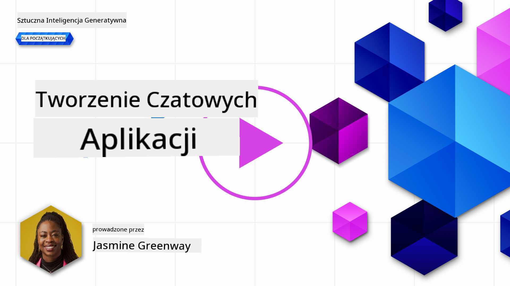
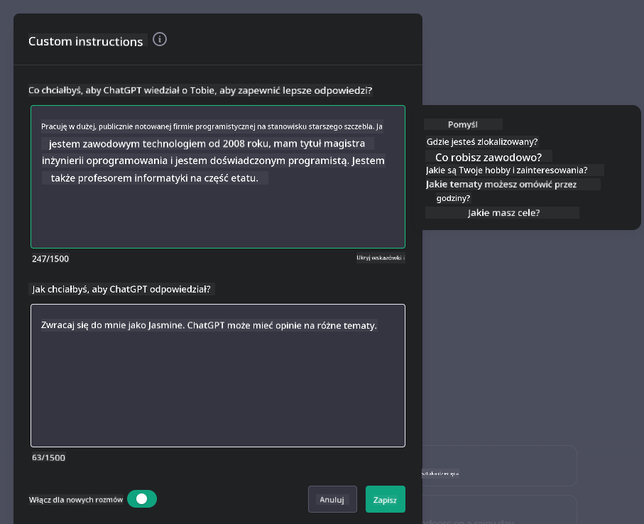
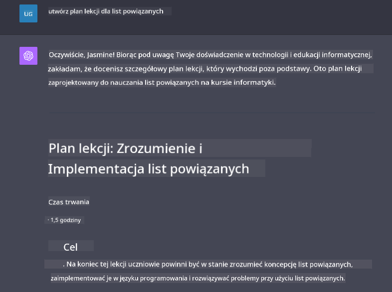

<!--
CO_OP_TRANSLATOR_METADATA:
{
  "original_hash": "ea4bbe640847aafbbba14dae4625e9af",
  "translation_date": "2025-05-19T10:11:13+00:00",
  "source_file": "07-building-chat-applications/README.md",
  "language_code": "pl"
}
-->
# Tworzenie aplikacji czatowych z generatywną AI

[](https://aka.ms/gen-ai-lessons7-gh?WT.mc_id=academic-105485-koreyst)

> _(Kliknij obrazek powyżej, aby obejrzeć wideo z tej lekcji)_

Teraz, gdy już wiemy, jak tworzyć aplikacje generujące tekst, przyjrzyjmy się aplikacjom czatowym.

Aplikacje czatowe stały się częścią naszego codziennego życia, oferując coś więcej niż tylko środek do swobodnej rozmowy. Są integralną częścią obsługi klienta, wsparcia technicznego, a nawet zaawansowanych systemów doradczych. Prawdopodobnie nie tak dawno otrzymałeś pomoc od aplikacji czatowej. W miarę jak integrujemy bardziej zaawansowane technologie, takie jak generatywna AI, z tymi platformami, wzrasta ich złożoność, a także wyzwania.

Niektóre pytania, na które musimy odpowiedzieć, to:

- **Tworzenie aplikacji**. Jak efektywnie tworzyć i bezproblemowo integrować te aplikacje zasilane AI do konkretnych zastosowań?
- **Monitorowanie**. Po wdrożeniu, jak możemy monitorować i zapewnić, że aplikacje działają na najwyższym poziomie jakości, zarówno pod względem funkcjonalności, jak i przestrzegania [sześciu zasad odpowiedzialnej AI](https://www.microsoft.com/ai/responsible-ai?WT.mc_id=academic-105485-koreyst)?

W miarę jak wchodzimy w erę zdefiniowaną przez automatyzację i płynne interakcje człowiek-maszyna, zrozumienie, jak generatywna AI przekształca zakres, głębokość i adaptacyjność aplikacji czatowych, staje się kluczowe. Ta lekcja zbada aspekty architektury wspierające te skomplikowane systemy, zagłębi się w metodyki dostosowywania ich do zadań specyficznych dla danej dziedziny oraz oceni metryki i kwestie istotne dla zapewnienia odpowiedzialnego wdrażania AI.

## Wprowadzenie

Ta lekcja obejmuje:

- Techniki efektywnego tworzenia i integrowania aplikacji czatowych.
- Jak zastosować dostosowywanie i dopasowywanie do aplikacji.
- Strategie i kwestie dotyczące skutecznego monitorowania aplikacji czatowych.

## Cele nauki

Pod koniec tej lekcji będziesz w stanie:

- Opisać kwestie związane z budowaniem i integrowaniem aplikacji czatowych z istniejącymi systemami.
- Dostosować aplikacje czatowe do konkretnych zastosowań.
- Zidentyfikować kluczowe metryki i kwestie dotyczące skutecznego monitorowania i utrzymania jakości aplikacji czatowych zasilanych AI.
- Zapewnić, że aplikacje czatowe wykorzystują AI w sposób odpowiedzialny.

## Integracja generatywnej AI w aplikacjach czatowych

Podnoszenie jakości aplikacji czatowych za pomocą generatywnej AI nie polega tylko na uczynieniu ich bardziej inteligentnymi; chodzi o optymalizację ich architektury, wydajności i interfejsu użytkownika, aby zapewnić wysoką jakość doświadczenia użytkownika. To obejmuje badanie fundamentów architektonicznych, integracji API i kwestii związanych z interfejsem użytkownika. Ta sekcja ma na celu zaoferowanie kompleksowej mapy drogowej do poruszania się po tych złożonych obszarach, niezależnie od tego, czy włączasz je do istniejących systemów, czy budujesz je jako samodzielne platformy.

Pod koniec tej sekcji będziesz wyposażony w wiedzę potrzebną do efektywnego konstruowania i włączania aplikacji czatowych.

### Chatbot czy aplikacja czatowa?

Zanim zanurzymy się w budowaniu aplikacji czatowych, porównajmy 'chatboty' z 'aplikacjami czatowymi zasilanymi AI', które pełnią różne role i funkcje. Głównym celem chatbota jest automatyzacja konkretnych zadań konwersacyjnych, takich jak odpowiadanie na często zadawane pytania lub śledzenie przesyłki. Zazwyczaj jest sterowany przez logikę opartą na regułach lub skomplikowane algorytmy AI. Z kolei aplikacja czatowa zasilana AI to znacznie bardziej rozbudowane środowisko zaprojektowane do ułatwiania różnych form komunikacji cyfrowej, takich jak czaty tekstowe, głosowe i wideo między użytkownikami. Jej cechą definiującą jest integracja modelu generatywnej AI, który symuluje subtelne, ludzkopodobne rozmowy, generując odpowiedzi na podstawie szerokiej gamy danych wejściowych i wskazówek kontekstowych. Aplikacja czatowa zasilana generatywną AI może angażować się w dyskusje otwarto-domenowe, dostosowywać się do ewoluujących kontekstów rozmowy, a nawet tworzyć kreatywne lub złożone dialogi.

Poniższa tabela przedstawia kluczowe różnice i podobieństwa, które pomogą nam zrozumieć ich unikalne role w komunikacji cyfrowej.

| Chatbot                               | Aplikacja czatowa zasilana generatywną AI |
| ------------------------------------- | ----------------------------------------- |
| Skupiona na zadaniach i oparta na regułach | Świadoma kontekstu                        |
| Często zintegrowana z większymi systemami | Może obsługiwać jeden lub wiele chatbotów |
| Ograniczona do zaprogramowanych funkcji | Zawiera modele generatywnej AI            |
| Specjalistyczne i strukturalne interakcje | Zdolna do dyskusji otwarto-domenowych     |

### Wykorzystywanie gotowych funkcji z SDK i API

Podczas budowania aplikacji czatowej dobrym pierwszym krokiem jest ocena, co już jest dostępne. Wykorzystanie SDK i API do budowy aplikacji czatowych to korzystna strategia z wielu powodów. Integrując dobrze udokumentowane SDK i API, strategicznie pozycjonujesz swoją aplikację na długoterminowy sukces, rozwiązując problemy skalowalności i utrzymania.

- **Przyspiesza proces tworzenia i zmniejsza koszty**: Poleganie na gotowych funkcjach zamiast kosztownego procesu ich tworzenia pozwala skupić się na innych aspektach aplikacji, które mogą być dla ciebie ważniejsze, takich jak logika biznesowa.
- **Lepsza wydajność**: Podczas tworzenia funkcji od podstaw z czasem zapytasz siebie "Jak to się skaluje? Czy ta aplikacja jest w stanie obsłużyć nagły napływ użytkowników?" Dobrze utrzymane SDK i API często mają wbudowane rozwiązania dla tych problemów.
- **Łatwiejsze utrzymanie**: Aktualizacje i usprawnienia są łatwiejsze do zarządzania, ponieważ większość API i SDK wymaga po prostu aktualizacji biblioteki, gdy pojawi się nowa wersja.
- **Dostęp do najnowocześniejszej technologii**: Wykorzystanie modeli, które zostały dopracowane i wytrenowane na obszernych zbiorach danych, zapewnia twojej aplikacji możliwości przetwarzania języka naturalnego.

Dostęp do funkcji SDK lub API zazwyczaj wymaga uzyskania pozwolenia na korzystanie z dostarczanych usług, co często odbywa się za pomocą unikalnego klucza lub tokenu uwierzytelniającego. Użyjemy biblioteki OpenAI Python, aby zobaczyć, jak to wygląda. Możesz również spróbować samodzielnie w poniższym [notebooku dla OpenAI](../../../07-building-chat-applications/python/oai-assignment.ipynb) lub [notebooku dla Azure OpenAI Services](../../../07-building-chat-applications/python/aoai-assignment.ipynb) dla tej lekcji.

```python
import os
from openai import OpenAI

API_KEY = os.getenv("OPENAI_API_KEY","")

client = OpenAI(
    api_key=API_KEY
    )

chat_completion = client.chat.completions.create(model="gpt-3.5-turbo", messages=[{"role": "user", "content": "Suggest two titles for an instructional lesson on chat applications for generative AI."}])
```

Powyższy przykład używa modelu GPT-3.5 Turbo do ukończenia zapytania, ale zauważ, że klucz API jest ustawiony przed jego wykonaniem. Otrzymałbyś błąd, gdybyś nie ustawił klucza.

## Doświadczenie użytkownika (UX)

Ogólne zasady UX dotyczą aplikacji czatowych, ale oto kilka dodatkowych kwestii, które stają się szczególnie ważne z powodu zaangażowanych komponentów uczenia maszynowego.

- **Mechanizm rozwiązywania niejasności**: Modele generatywnej AI czasami generują niejednoznaczne odpowiedzi. Funkcja, która pozwala użytkownikom prosić o wyjaśnienia, może być pomocna, gdy napotkają ten problem.
- **Zachowanie kontekstu**: Zaawansowane modele generatywnej AI mają zdolność zapamiętywania kontekstu w rozmowie, co może być niezbędnym atutem dla doświadczenia użytkownika. Dając użytkownikom możliwość kontrolowania i zarządzania kontekstem, poprawia się doświadczenie użytkownika, ale wprowadza ryzyko przechowywania wrażliwych informacji użytkownika. Rozważania dotyczące tego, jak długo te informacje są przechowywane, takie jak wprowadzenie polityki retencji, mogą zrównoważyć potrzebę kontekstu z prywatnością.
- **Personalizacja**: Dzięki zdolności do uczenia się i adaptacji, modele AI oferują indywidualne doświadczenie dla użytkownika. Dostosowanie doświadczenia użytkownika poprzez funkcje takie jak profile użytkowników nie tylko sprawia, że użytkownik czuje się zrozumiany, ale także pomaga mu w poszukiwaniu konkretnych odpowiedzi, tworząc bardziej efektywną i satysfakcjonującą interakcję.

Jednym z przykładów personalizacji jest ustawienie "Custom instructions" w OpenAI's ChatGPT. Pozwala na dostarczenie informacji o sobie, które mogą być ważnym kontekstem dla twoich zapytań. Oto przykład niestandardowej instrukcji.



Ten "profil" zachęca ChatGPT do stworzenia planu lekcji na temat list powiązanych. Zauważ, że ChatGPT bierze pod uwagę, że użytkownik może chcieć bardziej szczegółowego planu lekcji w oparciu o swoje doświadczenie.



### Ramy komunikatów systemowych Microsoftu dla dużych modeli językowych

[Microsoft dostarczył wskazówki](https://learn.microsoft.com/azure/ai-services/openai/concepts/system-message#define-the-models-output-format?WT.mc_id=academic-105485-koreyst) dotyczące pisania skutecznych komunikatów systemowych podczas generowania odpowiedzi z LLM, podzielone na 4 obszary:

1. Określenie, dla kogo jest model, a także jego możliwości i ograniczenia.
2. Określenie formatu wyjściowego modelu.
3. Dostarczenie konkretnych przykładów, które demonstrują zamierzone zachowanie modelu.
4. Dostarczenie dodatkowych zasad zachowania.

### Dostępność

Niezależnie od tego, czy użytkownik ma problemy wzrokowe, słuchowe, motoryczne czy poznawcze, dobrze zaprojektowana aplikacja czatowa powinna być użyteczna dla wszystkich. Poniższa lista przedstawia konkretne funkcje mające na celu zwiększenie dostępności dla różnych upośledzeń użytkowników.

- **Funkcje dla osób z problemami wzrokowymi**: Motywy o wysokim kontraście i możliwość zmiany rozmiaru tekstu, kompatybilność z czytnikami ekranu.
- **Funkcje dla osób z problemami słuchowymi**: Funkcje zamiany tekstu na mowę i mowy na tekst, wizualne wskazówki dla powiadomień dźwiękowych.
- **Funkcje dla osób z problemami motorycznymi**: Obsługa nawigacji za pomocą klawiatury, polecenia głosowe.
- **Funkcje dla osób z problemami poznawczymi**: Opcje prostego języka.

## Dostosowywanie i dopasowywanie dla modeli językowych specyficznych dla dziedziny

Wyobraź sobie aplikację czatową, która rozumie żargon twojej firmy i przewiduje konkretne zapytania, które użytkownicy często mają. Istnieje kilka podejść, które warto wspomnieć:

- **Wykorzystanie modeli DSL**. DSL oznacza język specyficzny dla dziedziny. Możesz wykorzystać tak zwany model DSL wytrenowany na konkretnej dziedzinie, aby zrozumieć jej koncepcje i scenariusze.
- **Zastosowanie dopasowywania**. Dopasowywanie to proces dalszego trenowania twojego modelu z użyciem określonych danych.

## Dostosowywanie: Korzystanie z DSL

Wykorzystanie modeli językowych specyficznych dla dziedziny (DSL Models) może zwiększyć zaangażowanie użytkowników, zapewniając specjalistyczne, kontekstowo istotne interakcje. Jest to model, który jest wytrenowany lub dostosowany do zrozumienia i generowania tekstu związanego z konkretną dziedziną, branżą lub tematem. Opcje korzystania z modelu DSL mogą się różnić od trenowania go od podstaw do korzystania z istniejących poprzez SDK i API. Inną opcją jest dopasowywanie, które polega na adaptacji istniejącego, wytrenowanego modelu do konkretnej dziedziny.

## Dostosowywanie: Zastosowanie dopasowywania

Dopasowywanie jest często rozważane, gdy wstępnie wytrenowany model nie spełnia oczekiwań w specjalistycznej dziedzinie lub zadaniu.

Na przykład, zapytania medyczne są skomplikowane i wymagają dużo kontekstu. Kiedy specjalista medyczny diagnozuje pacjenta, opiera się na różnych czynnikach, takich jak styl życia czy istniejące wcześniej schorzenia, a nawet może polegać na najnowszych czasopismach medycznych, aby potwierdzić swoją diagnozę. W takich złożonych scenariuszach ogólnego przeznaczenia aplikacja czatowa AI nie może być wiarygodnym źródłem.

### Scenariusz: aplikacja medyczna

Weźmy pod uwagę aplikację czatową zaprojektowaną, aby pomagać praktykom medycznym, dostarczając szybkie odniesienia do wytycznych dotyczących leczenia, interakcji leków lub najnowszych wyników badań.

Model ogólnego przeznaczenia może być wystarczający do odpowiadania na podstawowe pytania medyczne lub udzielania ogólnych porad, ale może mieć trudności z następującymi:

- **Bardzo specyficzne lub złożone przypadki**. Na przykład, neurolog może zapytać aplikację: "Jakie są obecne najlepsze praktyki zarządzania lekooporną padaczką u dzieci?"
- **Brakujące najnowsze osiągnięcia**. Model ogólnego przeznaczenia mógłby mieć trudności z dostarczeniem aktualnej odpowiedzi, która uwzględnia najnowsze osiągnięcia w dziedzinie neurologii i farmakologii.

W takich przypadkach dopasowanie modelu do specjalistycznego zestawu danych medycznych może znacznie poprawić jego zdolność do obsługi tych skomplikowanych zapytań medycznych dokładniej i wiarygodniej. Wymaga to dostępu do dużego i odpowiedniego zestawu danych, który reprezentuje wyzwania i pytania specyficzne dla danej dziedziny, które należy rozwiązać.

## Rozważania dotyczące wysokiej jakości doświadczenia z aplikacją czatową napędzaną AI

Ta sekcja przedstawia kryteria dla "wysokiej jakości" aplikacji czatowych, które obejmują rejestrowanie metryk działania i przestrzeganie ram, które odpowiedzialnie wykorzystują technologię AI.

### Kluczowe metryki

Aby utrzymać wysoką jakość działania aplikacji, ważne jest śledzenie kluczowych metryk i rozważań. Te pomiary nie tylko zapewniają funkcjonalność aplikacji, ale także oceniają jakość modelu AI i doświadczenie użytkownika. Poniżej znajduje się lista, która obejmuje podstawowe, AI i metryki doświadczenia użytkownika do rozważenia.

| Metryka                       | Definicja                                                                                                               | Rozważania dla twórcy aplikacji czatowej                                   |
| ----------------------------- | ------------------------------------------------------------------------------------------------------------------------ | ------------------------------------------------------------------------- |
| **Dostępność**                | Mierzy czas, w którym aplikacja jest operacyjna i dostępna dla użytkowników.                                              | Jak zminimalizujesz przestoje?                                            |
| **Czas odpowiedzi**           | Czas potrzebny aplikacji na odpowiedź na zapytanie użytkownika.                                                          | Jak możesz zoptymalizować przetwarzanie zapytań, aby poprawić czas odpowiedzi? |
| **Precyzja**                  | Stosunek prawdziwych pozytywnych przewidywań do całkowitej liczby pozytywnych przewidywań                                |

**Zrzeczenie się odpowiedzialności**:  
Ten dokument został przetłumaczony za pomocą usługi tłumaczenia AI [Co-op Translator](https://github.com/Azure/co-op-translator). Choć staramy się o dokładność, prosimy mieć na uwadze, że automatyczne tłumaczenia mogą zawierać błędy lub nieścisłości. Oryginalny dokument w jego rodzimym języku powinien być uważany za autorytatywne źródło. W przypadku istotnych informacji zaleca się profesjonalne tłumaczenie przez człowieka. Nie ponosimy odpowiedzialności za jakiekolwiek nieporozumienia lub błędne interpretacje wynikające z użycia tego tłumaczenia.