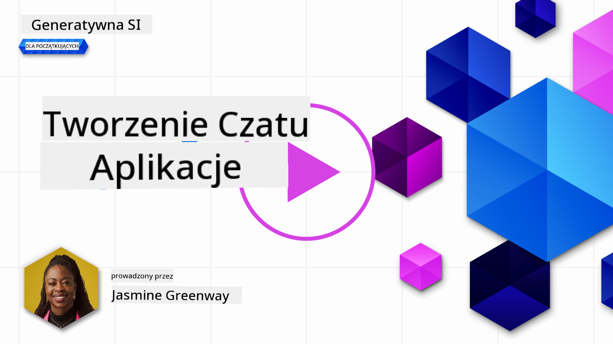
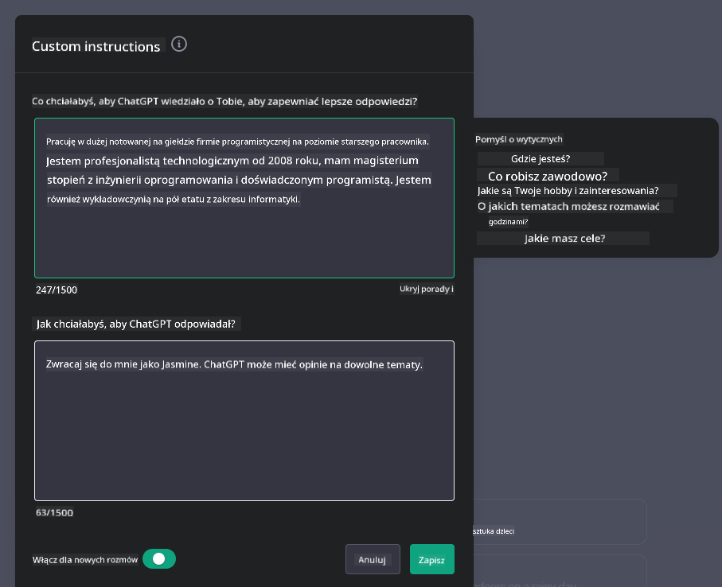

<!--
CO_OP_TRANSLATOR_METADATA:
{
  "original_hash": "ea4bbe640847aafbbba14dae4625e9af",
  "translation_date": "2025-06-25T15:30:32+00:00",
  "source_file": "07-building-chat-applications/README.md",
  "language_code": "pl"
}
-->
# Budowanie aplikacji czatowych z generatywną sztuczną inteligencją

[](https://aka.ms/gen-ai-lessons7-gh?WT.mc_id=academic-105485-koreyst)

> _(Kliknij obrazek powyżej, aby obejrzeć wideo z tej lekcji)_

Teraz, gdy widzieliśmy, jak budować aplikacje generujące tekst, przyjrzyjmy się aplikacjom czatowym.

Aplikacje czatowe stały się częścią naszego codziennego życia, oferując więcej niż tylko środek do swobodnej rozmowy. Są integralnymi częściami obsługi klienta, wsparcia technicznego, a nawet zaawansowanych systemów doradczych. Prawdopodobnie niedawno otrzymałeś pomoc od aplikacji czatowej. W miarę jak integrujemy bardziej zaawansowane technologie, takie jak generatywna sztuczna inteligencja, z tymi platformami, rośnie ich złożoność, a także wyzwania.

Niektóre pytania, na które musimy odpowiedzieć, to:

- **Budowanie aplikacji**. Jak skutecznie budować i bezproblemowo integrować te aplikacje zasilane sztuczną inteligencją dla określonych przypadków użycia?
- **Monitorowanie**. Jak możemy monitorować i zapewniać, że aplikacje działają na najwyższym poziomie jakości, zarówno pod względem funkcjonalności, jak i przestrzegania [sześciu zasad odpowiedzialnej AI](https://www.microsoft.com/ai/responsible-ai?WT.mc_id=academic-105485-koreyst)?

W miarę jak wchodzimy w erę zdefiniowaną przez automatyzację i bezproblemową interakcję człowiek-maszyna, zrozumienie, jak generatywna sztuczna inteligencja przekształca zakres, głębokość i elastyczność aplikacji czatowych, staje się niezbędne. Ta lekcja zbada aspekty architektury wspierające te złożone systemy, zagłębi się w metodologie ich dostrajania do zadań specyficznych dla danej domeny oraz oceni metryki i rozważania istotne dla zapewnienia odpowiedzialnego wdrażania AI.

## Wprowadzenie

Ta lekcja obejmuje:

- Techniki efektywnego budowania i integracji aplikacji czatowych.
- Jak stosować dostosowywanie i dostrajanie aplikacji.
- Strategie i rozważania dotyczące skutecznego monitorowania aplikacji czatowych.

## Cele nauki

Po zakończeniu tej lekcji będziesz w stanie:

- Opisać rozważania dotyczące budowania i integracji aplikacji czatowych z istniejącymi systemami.
- Dostosować aplikacje czatowe do specyficznych przypadków użycia.
- Zidentyfikować kluczowe metryki i rozważania dotyczące skutecznego monitorowania i utrzymania jakości aplikacji czatowych zasilanych AI.
- Zapewnić, że aplikacje czatowe odpowiedzialnie wykorzystują AI.

## Integracja generatywnej AI w aplikacjach czatowych

Podnoszenie jakości aplikacji czatowych za pomocą generatywnej AI nie polega tylko na ich „usmartnianiu”; chodzi o optymalizację ich architektury, wydajności i interfejsu użytkownika, aby dostarczyć wysokiej jakości doświadczenie użytkownika. To wymaga zbadania podstaw architektonicznych, integracji API i rozważań dotyczących interfejsu użytkownika. Ta sekcja ma na celu zaoferowanie kompleksowej mapy drogowej do poruszania się po tych złożonych obszarach, niezależnie od tego, czy integrujesz je z istniejącymi systemami, czy budujesz jako samodzielne platformy.

Po zakończeniu tej sekcji będziesz posiadać wiedzę potrzebną do efektywnego konstruowania i włączania aplikacji czatowych.

### Chatbot czy aplikacja czatowa?

Zanim zagłębimy się w budowanie aplikacji czatowych, porównajmy „chatboty” z „aplikacjami czatowymi zasilanymi AI”, które pełnią różne role i funkcje. Głównym celem chatbota jest automatyzacja określonych zadań konwersacyjnych, takich jak odpowiadanie na często zadawane pytania lub śledzenie przesyłki. Zwykle jest sterowany logiką opartą na regułach lub złożonymi algorytmami AI. W przeciwieństwie do tego, aplikacja czatowa zasilana AI to znacznie bardziej rozbudowane środowisko zaprojektowane do ułatwiania różnych form komunikacji cyfrowej, takich jak czaty tekstowe, głosowe i wideo między ludźmi. Jego cechą wyróżniającą jest integracja modelu generatywnej AI, który symuluje subtelne, ludzkie rozmowy, generując odpowiedzi na podstawie szerokiej gamy danych wejściowych i wskazówek kontekstowych. Aplikacja czatowa zasilana generatywną AI może angażować się w rozmowy na otwarte tematy, dostosowywać się do ewoluujących kontekstów konwersacyjnych, a nawet tworzyć kreatywne lub złożone dialogi.

Poniższa tabela przedstawia kluczowe różnice i podobieństwa, aby pomóc zrozumieć ich unikalne role w komunikacji cyfrowej.

| Chatbot                               | Aplikacja czatowa zasilana generatywną AI |
| ------------------------------------- | ----------------------------------------- |
| Skoncentrowany na zadaniach i oparty na regułach | Świadomy kontekstu                         |
| Często zintegrowany z większymi systemami | Może obsługiwać jeden lub wiele chatbotów |
| Ograniczony do zaprogramowanych funkcji | Wykorzystuje modele generatywnej AI       |
| Specjalistyczne i strukturalne interakcje | Zdolność do rozmów na otwarte tematy      |

### Wykorzystywanie gotowych funkcji z SDK i API

Podczas budowania aplikacji czatowej dobrym pierwszym krokiem jest ocena, co już istnieje. Korzystanie z SDK i API do budowy aplikacji czatowych to korzystna strategia z różnych powodów. Integrując dobrze udokumentowane SDK i API, strategicznie pozycjonujesz swoją aplikację na długoterminowy sukces, rozwiązując kwestie skalowalności i utrzymania.

- **Przyspiesza proces rozwoju i redukuje koszty**: Poleganie na gotowych funkcjach zamiast kosztownego procesu budowania ich samodzielnie pozwala skupić się na innych aspektach aplikacji, które mogą być dla ciebie ważniejsze, takich jak logika biznesowa.
- **Lepsza wydajność**: Tworząc funkcjonalność od podstaw, w końcu zadasz sobie pytanie „Jak to się skalować? Czy ta aplikacja jest w stanie obsłużyć nagły napływ użytkowników?” Dobrze utrzymane SDK i API często mają wbudowane rozwiązania dla tych problemów.
- **Łatwiejsze utrzymanie**: Aktualizacje i ulepszenia są łatwiejsze do zarządzania, ponieważ większość API i SDK wymaga jedynie aktualizacji biblioteki, gdy zostanie wydana nowsza wersja.
- **Dostęp do najnowocześniejszej technologii**: Wykorzystanie modeli, które zostały dopracowane i przeszkolone na obszernych zbiorach danych, zapewnia twojej aplikacji możliwości w zakresie języka naturalnego.

Dostęp do funkcjonalności SDK lub API zazwyczaj wymaga uzyskania pozwolenia na korzystanie z dostarczanych usług, co często odbywa się za pomocą unikalnego klucza lub tokenu uwierzytelniającego. Skorzystamy z biblioteki OpenAI Python Library, aby zbadać, jak to wygląda. Możesz także spróbować tego samodzielnie w następującym [notebooku dla OpenAI](../../../07-building-chat-applications/python/oai-assignment.ipynb) lub [notebooku dla Azure OpenAI Services](../../../07-building-chat-applications/python/aoai-assignment.ipynb) dla tej lekcji.

```python
import os
from openai import OpenAI

API_KEY = os.getenv("OPENAI_API_KEY","")

client = OpenAI(
    api_key=API_KEY
    )

chat_completion = client.chat.completions.create(model="gpt-3.5-turbo", messages=[{"role": "user", "content": "Suggest two titles for an instructional lesson on chat applications for generative AI."}])
```

Powyższy przykład używa modelu GPT-3.5 Turbo do zakończenia polecenia, ale zauważ, że klucz API jest ustawiony przed jego wykonaniem. Otrzymasz błąd, jeśli nie ustawisz klucza.

## Doświadczenie użytkownika (UX)

Ogólne zasady UX dotyczą aplikacji czatowych, ale oto kilka dodatkowych rozważań, które stają się szczególnie ważne ze względu na komponenty uczenia maszynowego.

- **Mechanizm radzenia sobie z dwuznacznością**: Modele generatywnej AI czasami generują dwuznaczne odpowiedzi. Funkcja pozwalająca użytkownikom poprosić o wyjaśnienie może być pomocna, jeśli napotkają ten problem.
- **Retencja kontekstu**: Zaawansowane modele generatywnej AI mają zdolność zapamiętywania kontekstu w ramach rozmowy, co może być niezbędnym atutem dla doświadczenia użytkownika. Dając użytkownikom możliwość kontrolowania i zarządzania kontekstem, poprawiasz doświadczenie użytkownika, ale wprowadzasz ryzyko przechowywania poufnych informacji użytkownika. Rozważania dotyczące tego, jak długo przechowywane są te informacje, takie jak wprowadzenie polityki retencji, mogą zrównoważyć potrzebę kontekstu z ochroną prywatności.
- **Personalizacja**: Dzięki zdolności do uczenia się i adaptacji, modele AI oferują zindywidualizowane doświadczenie dla użytkownika. Dostosowanie doświadczenia użytkownika poprzez funkcje takie jak profile użytkowników nie tylko sprawia, że użytkownik czuje się zrozumiany, ale także pomaga mu w poszukiwaniu konkretnych odpowiedzi, tworząc bardziej efektywną i satysfakcjonującą interakcję.

Jednym z przykładów personalizacji jest ustawienie „Custom instructions” w ChatGPT OpenAI. Pozwala ono na podanie informacji o sobie, które mogą być ważnym kontekstem dla twoich poleceń. Oto przykład niestandardowej instrukcji.



Ten „profil” skłania ChatGPT do stworzenia planu lekcji na temat list połączonych. Zauważ, że ChatGPT bierze pod uwagę, że użytkownik może chcieć bardziej szczegółowego planu lekcji na podstawie swojego doświadczenia.


### Framework System Message Microsoftu dla dużych modeli językowych

[Microsoft dostarczył wytyczne](https://learn.microsoft.com/azure/ai-services/openai/concepts/system-message#define-the-models-output-format?WT.mc_id=academic-105485-koreyst) dotyczące pisania skutecznych wiadomości systemowych podczas generowania odpowiedzi z LLM, podzielone na 4 obszary:

1. Określenie, dla kogo jest model, jego możliwości i ograniczenia.
2. Określenie formatu wyjściowego modelu.
3. Podanie konkretnych przykładów demonstrujących zamierzone zachowanie modelu.
4. Dostarczenie dodatkowych zabezpieczeń behawioralnych.

### Dostępność

Niezależnie od tego, czy użytkownik ma problemy z widzeniem, słuchem, motoryką, czy poznawcze, dobrze zaprojektowana aplikacja czatowa powinna być użyteczna dla wszystkich. Poniższa lista przedstawia konkretne funkcje mające na celu zwiększenie dostępności dla różnych problemów użytkowników.

- **Funkcje dla osób z wadami wzroku**: Motywy o wysokim kontraście i możliwość zmiany rozmiaru tekstu, zgodność z czytnikami ekranu.
- **Funkcje dla osób z wadami słuchu**: Funkcje zamiany tekstu na mowę i mowy na tekst, wizualne sygnały dla powiadomień dźwiękowych.
- **Funkcje dla osób z problemami motorycznymi**: Obsługa nawigacji za pomocą klawiatury, polecenia głosowe.
- **Funkcje dla osób z problemami poznawczymi**: Opcje uproszczonego języka.

## Dostosowanie i dostrajanie dla modeli językowych specyficznych dla domeny

Wyobraź sobie aplikację czatową, która rozumie żargon twojej firmy i przewiduje specyficzne zapytania, które często mają jej użytkownicy. Istnieje kilka podejść, które warto wspomnieć:

- **Wykorzystanie modeli DSL**. DSL oznacza język specyficzny dla domeny. Możesz wykorzystać tak zwany model DSL, przeszkolony w określonej domenie, aby zrozumieć jej koncepcje i scenariusze.
- **Zastosowanie dostrajania**. Dostrajanie to proces dalszego szkolenia twojego modelu z użyciem specyficznych danych.

## Dostosowanie: Korzystanie z DSL

Wykorzystanie modeli językowych specyficznych dla domeny (DSL Models) może zwiększyć zaangażowanie użytkowników, zapewniając specjalistyczne, kontekstowo odpowiednie interakcje. To model, który jest przeszkolony lub dostrojony, aby rozumieć i generować tekst związany z określoną dziedziną, branżą lub tematem. Opcje korzystania z modelu DSL mogą się różnić od szkolenia go od podstaw po korzystanie z już istniejących modeli poprzez SDK i API. Inną opcją jest dostrajanie, które polega na adaptacji istniejącego modelu wstępnie przeszkolonego do określonej domeny.

## Dostosowanie: Zastosowanie dostrajania

Dostrajanie jest często rozważane, gdy model wstępnie przeszkolony nie spełnia wymagań w specjalistycznej domenie lub określonym zadaniu.

Na przykład, zapytania medyczne są złożone i wymagają wiele kontekstu. Gdy profesjonalista medyczny diagnozuje pacjenta, opiera się na różnych czynnikach, takich jak styl życia czy istniejące wcześniej warunki, a nawet może polegać na najnowszych czasopismach medycznych, aby potwierdzić swoją diagnozę. W takich subtelnych scenariuszach ogólny model AI czatowy nie może być wiarygodnym źródłem.

### Scenariusz: aplikacja medyczna

Rozważ aplikację czatową zaprojektowaną w celu wspierania praktyków medycznych poprzez dostarczanie szybkich odniesień do wytycznych dotyczących leczenia, interakcji leków lub najnowszych badań.

Model ogólnego przeznaczenia może być wystarczający do udzielania podstawowych odpowiedzi medycznych lub ogólnych porad, ale może mieć trudności z następującymi:

- **Bardzo specyficzne lub złożone przypadki**. Na przykład neurolog może zapytać aplikację: „Jakie są obecne najlepsze praktyki zarządzania padaczką lekooporną u pacjentów pediatrycznych?”
- **Brakujące najnowsze osiągnięcia**. Model ogólnego przeznaczenia może mieć trudności z udzieleniem aktualnej odpowiedzi, która uwzględnia najnowsze osiągnięcia w neurologii i farmakologii.

W takich przypadkach dostrajanie modelu za pomocą specjalistycznego zbioru danych medycznych może znacznie poprawić jego zdolność do radzenia sobie z tymi skomplikowanymi zapytaniami medycznymi dokładniej i bardziej niezawodnie. Wymaga to dostępu do dużego i odpowiedniego zbioru danych, który reprezentuje wyzwania i pytania specyficzne dla danej domeny, które trzeba rozwiązać.

## Rozważania dotyczące wysokiej jakości doświadczenia czatowego z napędem AI

Ta sekcja przedstawia kryteria dla „wysokiej jakości” aplikacji czatowych, które obejmują gromadzenie mierzalnych metryk i przestrzeganie ram, które odpowiedzialnie wykorzystują technologię AI.

### Kluczowe metryki

Aby utrzymać wysoką jakość działania aplikacji, ważne jest śledzenie kluczowych metryk i rozważań. Te pomiary nie tylko zapewniają funkcjonalność aplikacji, ale także oceniają jakość modelu AI i doświadczenie użytkownika. Poniżej znajduje się lista, która obejmuje podstawowe metryki, metryki AI i metryki doświadczenia użytkownika, które warto rozważyć.

| Metryka                       | Definicja                                                                                                             | Rozważania dla dewelopera czatu                                         |
| ----------------------------- | ---------------------------------------------------------------------------------------------------------------------- | ----------------------------------------------------------------------- |
| **Czas działania**            | Mierzy czas, przez jaki aplikacja jest operacyjna i dostępna dla użytkowników.                                         | Jak zminimalizujesz czas przestoju?                                     |
| **Czas odpowiedzi**           | Czas, jaki aplikacja potrzebuje na odpowiedź na zapytanie użytkownika.                                                | Jak możesz zoptymalizować przetwarzanie zapytań, aby poprawić czas odpowiedzi? |
| **Precyzja**                  | Stosunek prawdziwych pozytywnych przewidywań do całkowitej liczby pozytywnych przewidywań                              |

**Zastrzeżenie**:  
Ten dokument został przetłumaczony przy użyciu usługi tłumaczenia AI [Co-op Translator](https://github.com/Azure/co-op-translator). Chociaż staramy się zapewnić dokładność, prosimy pamiętać, że automatyczne tłumaczenia mogą zawierać błędy lub nieścisłości. Oryginalny dokument w jego rodzimym języku powinien być uznawany za autorytatywne źródło. W przypadku informacji krytycznych zaleca się profesjonalne tłumaczenie przez człowieka. Nie ponosimy odpowiedzialności za jakiekolwiek nieporozumienia lub błędne interpretacje wynikające z użycia tego tłumaczenia.