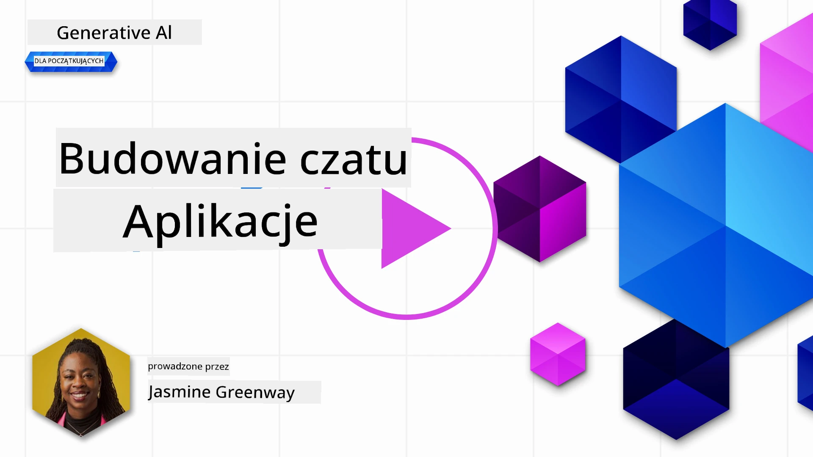
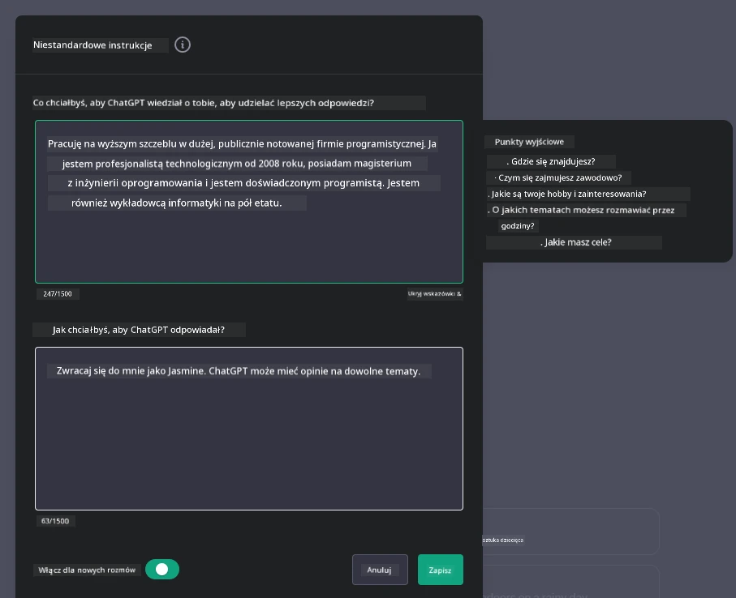

# Budowanie czatowych aplikacji zasilanych generatywną sztuczną inteligencją

[](https://youtu.be/R9V0ZY1BEQo?si=IHuU-fS9YWT8s4sA)

> _(Kliknij powyższy obraz, aby obejrzeć wideo z tej lekcji)_

Teraz, gdy zobaczyliśmy, jak możemy budować aplikacje do generowania tekstu, przyjrzyjmy się aplikacjom czatowym.

Aplikacje czatowe stały się integralną częścią naszego codziennego życia, oferując coś więcej niż tylko możliwość nieformalnej rozmowy. Są nieodłącznym elementem obsługi klienta, wsparcia technicznego, a nawet zaawansowanych systemów doradczych. Prawdopodobnie nie tak dawno skorzystałeś z pomocy aplikacji czatowej. W miarę jak integrujemy coraz bardziej zaawansowane technologie, takie jak generatywna AI, w tych platformach, wzrasta ich złożoność, a wraz z nią wyzwania.

Kilka pytań, na które musimy znaleźć odpowiedzi, to:

- **Tworzenie aplikacji**. Jak efektywnie budować i bezproblemowo integrować te aplikacje oparte na AI dla konkretnych zastosowań?
- **Monitorowanie**. Po wdrożeniu, jak możemy monitorować i zapewnić, że aplikacje działają na najwyższym poziomie jakości, zarówno pod względem funkcjonalności, jak i zgodności z [sześcioma zasadami odpowiedzialnej AI](https://www.microsoft.com/ai/responsible-ai?WT.mc_id=academic-105485-koreyst)?

W miarę jak wkraczamy głębiej w epokę definiowaną przez automatyzację i bezproblemową interakcję człowiek-maszyna, zrozumienie, jak generatywna AI zmienia zakres, głębokość i zdolność adaptacji aplikacji czatowych, staje się niezbędne. Ta lekcja przyjrzy się aspektom architektury wspierającym te złożone systemy, metodologiom dostrajania ich do zadań specyficznych dla danej dziedziny i oceni metryki oraz kwestie istotne przy zapewnianiu odpowiedzialnego wdrożenia AI.

## Wprowadzenie

Ta lekcja obejmuje:

- Techniki efektywnego budowania i integrowania aplikacji czatowych.
- Jak stosować personalizację i dostrajanie aplikacji.
- Strategie i kwestie do rozważenia przy skutecznym monitorowaniu aplikacji czatowych.

## Cele Nauki

Pod koniec tej lekcji będziesz potrafił:

- Opisać kwestie związane z budowaniem i integrowaniem aplikacji czatowych w istniejących systemach.
- Personalizować aplikacje czatowe dla specyficznych przypadków użycia.
- Zidentyfikować kluczowe metryki i kwestie do skutecznego monitorowania i utrzymania jakości aplikacji czatowych opartych na AI.
- Zapewnić odpowiedzialne wykorzystanie AI w aplikacjach czatowych.

## Integracja generatywnej AI z aplikacjami czatowymi

Podnoszenie jakości aplikacji czatowych przez generatywną AI to nie tylko kwestia uczynienia ich mądrzejszymi; chodzi o optymalizację architektury, wydajności i interfejsu użytkownika, by zapewnić wysokiej jakości doświadczenie. Obejmuje to badanie podstaw architektury, integracji API oraz zagadnień związanych z interfejsem użytkownika. Ta sekcja ma za zadanie dać Ci kompleksową mapę drogową do poruszania się po tych złożonych obszarach, niezależnie od tego, czy podłączasz je do istniejących systemów, czy budujesz jako samodzielne platformy.

Pod koniec tej sekcji będziesz wyposażony w wiedzę potrzebną do efektywnego tworzenia i integrowania aplikacji czatowych.

### Chatbot czy aplikacja czatowa?

Zanim zagłębimy się w budowę aplikacji czatowych, porównajmy "chatboty" i "aplikacje czatowe zasilane AI", które pełnią odmienne role i funkcje. Głównym celem chatbota jest automatyzacja konkretnych zadań konwersacyjnych, takich jak odpowiadanie na często zadawane pytania czy śledzenie przesyłki. Zazwyczaj działa on na podstawie logiki reguł lub złożonych algorytmów AI. W przeciwieństwie do tego, aplikacja czatowa zasilana AI to znacznie szersze środowisko, zaprojektowane do prowadzenia różnych form komunikacji cyfrowej, takich jak czat tekstowy, głosowy i wideo między użytkownikami. Jej wyróżniającą cechą jest integracja generatywnego modelu AI, który symuluje subtelne, ludzkie rozmowy, generując odpowiedzi na podstawie różnorodnych danych wejściowych i wskazówek kontekstowych. Aplikacja czatowa zasilana generatywną AI może angażować się w dyskusje o otwartym charakterze, dostosowywać się do zmieniającego się kontekstu rozmowy, a nawet tworzyć kreatywny lub złożony dialog.

Poniższa tabela przedstawia kluczowe różnice i podobieństwa, aby pomóc nam lepiej zrozumieć ich unikalne role w komunikacji cyfrowej.

| Chatbot                              | Aplikacja czatowa zasilana generatywną AI |
| ----------------------------------- | ---------------------------------------- |
| Skoncentrowany na zadaniach i oparty na regułach | Świadomy kontekstu                      |
| Często zintegrowany z większymi systemami       | Może obsługiwać jednego lub wielu chatbotów |
| Ograniczony do zaprogramowanych funkcji         | Zawiera modele generatywnej AI          |
| Specjalistyczne i ustrukturyzowane interakcje   | Potrafi prowadzić rozmowy o otwartym charakterze |

### Wykorzystanie gotowych funkcji za pomocą SDK i API

Podczas tworzenia aplikacji czatowej dobrym pierwszym krokiem jest ocena, co jest już dostępne. Korzystanie ze SDK i API do budowy aplikacji czatowych to korzystna strategia z różnych powodów. Integrując dobrze udokumentowane SDK i API, strategicznie pozycjonujesz swoją aplikację na długoterminowy sukces, rozwiązując kwestie skalowalności i utrzymania.

- **Przyspiesza proces rozwoju i zmniejsza nakłady**: Poleganie na gotowych funkcjach zamiast kosztownego procesu ich tworzenia pozwala Ci skupić się na innych aspektach aplikacji, które mogą być ważniejsze, takich jak logika biznesowa.
- **Lepsza wydajność**: Budując funkcjonalność od podstaw, prędzej czy później zadasz sobie pytanie "Jak to się skaluje? Czy ta aplikacja poradzi sobie z nagłym napływem użytkowników?" Dobrze utrzymywane SDK i API często mają wbudowane rozwiązania tych problemów.
- **Łatwiejsze utrzymanie**: Aktualizacje i ulepszenia są prostsze do zarządzania, ponieważ większość API i SDK wymaga jedynie aktualizacji biblioteki przy wydaniu nowej wersji.
- **Dostęp do najnowszych technologii**: Wykorzystywanie modeli, które zostały dopracowane i wytrenowane na rozległych zbiorach danych, zapewnia Twojej aplikacji możliwości naturalnego przetwarzania języka.

Uzyskiwanie dostępu do funkcji SDK lub API zazwyczaj wiąże się z uzyskaniem pozwolenia na korzystanie z oferowanych usług, często za pomocą unikalnego klucza lub tokena uwierzytelniającego. Do zbadania tego użyjemy biblioteki OpenAI w Pythonie. Możesz też wypróbować ją samodzielnie w następujących [notatnikach OpenAI](./python/oai-assignment.ipynb?WT.mc_id=academic-105485-koreyst) lub [Azure OpenAI Services](./python/aoai-assignment.ipynb?WT.mc_id=academic-105485-koreys) przygotowanych dla tej lekcji.

```python
import os
from openai import OpenAI

API_KEY = os.getenv("OPENAI_API_KEY","")

client = OpenAI(
    api_key=API_KEY
    )

response = client.responses.create(model="gpt-4o-mini", input="Suggest two titles for an instructional lesson on chat applications for generative AI.", store=False)
print(response.output_text)
```

Powyższy przykład wykorzystuje model GPT-4o mini z API Responses, aby ukończyć prompt, ale zauważ, że klucz API jest ustawiony przed tym działaniem. Bez ustawienia klucza otrzymałbyś błąd.

## Doświadczenie użytkownika (UX)

Ogólne zasady UX są stosowane także w aplikacjach czatowych, ale tutaj pojawiają się dodatkowe aspekty, które stają się szczególnie ważne z uwagi na komponenty uczenia maszynowego.

- **Mechanizm rozwiązywania niejasności**: Modele generatywnej AI czasami tworzą niejednoznaczne odpowiedzi. Funkcja pozwalająca użytkownikom prosić o wyjaśnienie może być pomocna w takich sytuacjach.
- **Zachowanie kontekstu**: Zaawansowane modele generatywnej AI mają zdolność zapamiętywania kontekstu rozmowy, co może być cennym atutem dla doświadczenia użytkownika. Udostępnienie użytkownikom możliwości kontrolowania i zarządzania kontekstem poprawia UX, ale niesie ryzyko przechowywania wrażliwych informacji. Rozważenia dotyczące długości przechowywania tych informacji, takie jak wprowadzenie polityki retencji, mogą zrównoważyć potrzebę kontekstu z ochroną prywatności.
- **Personalizacja**: Dzięki zdolności uczenia się i adaptacji, modele AI oferują spersonalizowane doświadczenie użytkownika. Dopasowanie doświadczenia przez funkcje takie jak profile użytkownika nie tylko powoduje, że użytkownik czuje się zrozumiany, ale także pomaga szybciej znaleźć konkretne odpowiedzi, co tworzy bardziej efektywną i satysfakcjonującą interakcję.

Przykładem takiej personalizacji są ustawienia „Custom instructions” w ChatGPT firmy OpenAI. Pozwalają one na podanie informacji o sobie, które mogą stanowić ważny kontekst dla promptów. Oto przykład niestandardowej instrukcji.



Ten „profil” nakłania ChatGPT do stworzenia planu lekcji o listach powiązanych. Zauważ, że ChatGPT uwzględnia, że użytkowniczka może chcieć bardziej szczegółowego planu, bazując na jej doświadczeniu.


### Microsoftowy framework wiadomości systemowej dla dużych modeli językowych

[Microsoft przedstawił wytyczne](https://learn.microsoft.com/azure/ai-services/openai/concepts/system-message#define-the-models-output-format?WT.mc_id=academic-105485-koreyst) dotyczące pisania efektywnych wiadomości systemowych podczas generowania odpowiedzi z dużych modeli językowych, podzielone na 4 obszary:

1. Definiowanie dla kogo jest model, jego możliwości i ograniczenia.
2. Definiowanie formatu wyjścia modelu.
3. Zapewnienie konkretnych przykładów, które demonstrują zamierzone zachowanie modelu.
4. Dostarczenie dodatkowych zabezpieczeń behawioralnych.

### Dostępność

Niezależnie od tego, czy użytkownik ma zaburzenia wzroku, słuchu, ruchowe lub poznawcze, dobrze zaprojektowana aplikacja czatowa powinna być dla wszystkich użyteczna. Poniższa lista przedstawia konkretne funkcje mające na celu poprawę dostępności dla różnych stopni niepełnosprawności.

- **Funkcje dla osób niewidomych**: motywy wysokiego kontrastu i możliwość zmiany rozmiaru tekstu, kompatybilność z czytnikami ekranu.
- **Funkcje dla osób niesłyszących**: funkcje przekształcania tekstu na mowę i mowy na tekst, wizualne powiadomienia o dźwiękach.
- **Funkcje dla osób z zaburzeniami ruchu**: obsługa nawigacji klawiaturą, polecenia głosowe.
- **Funkcje dla osób z zaburzeniami poznawczymi**: uproszczone opcje językowe.

## Personalizacja i dostrajanie dla modeli językowych specyficznych dla dziedziny

Wyobraź sobie aplikację czatową, która rozumie żargon Twojej firmy i przewiduje konkretne pytania, jakie zadają użytkownicy. Warto wspomnieć o kilku podejściach:

- **Wykorzystanie modeli DSL**. DSL oznacza język specyficzny dla domeny. Można wykorzystać model DSL, wytrenowany na konkretnym obszarze, aby rozumieć jego koncepcje i scenariusze.
- **Stosowanie dostrajania**. Dostrajanie to proces dalszego trenowania modelu na określonych danych.

## Personalizacja: użycie DSL

Wykorzystanie modeli językowych specyficznych dla domeny (modele DSL) może zwiększyć zaangażowanie użytkownika, dostarczając specjalistyczne, kontekstowo istotne interakcje. To model wytrenowany lub dostrojony do rozumienia i generowania tekstu związanego z konkretną dziedziną, branżą lub tematem. Opcje użycia modelu DSL obejmują trening od podstaw lub korzystanie z gotowych modeli przez SDK i API. Inną opcją jest dostrajanie, polegające na adaptacji istniejącego, wstępnie wytrenowanego modelu do konkretnej domeny.

## Personalizacja: stosowanie dostrajania

Dostrajanie jest często rozważane, gdy model wstępnie wytrenowany nie wystarcza w wyspecjalizowanej dziedzinie lub do określonego zadania.

Na przykład pytania medyczne są złożone i wymagają dużego kontekstu. Gdy lekarz diagnozuje pacjenta, bierze pod uwagę różne czynniki, takie jak styl życia czy choroby współistniejące, a także może opierać się na najnowszych czasopismach medycznych, by potwierdzić diagnozę. W takich zniuansowanych sytuacjach ogólnotematyczna aplikacja AI nie może być wiarygodnym źródłem.

### Przykład: aplikacja medyczna

Rozważmy aplikację czatową zaprojektowaną, by pomagać praktykom medycznym, udostępniając szybkie referencje do wytycznych leczenia, interakcji leków lub najnowszych wyników badań.

Model ogólnego przeznaczenia może wystarczać do odpowiadania na podstawowe pytania medyczne lub udzielania ogólnych porad, ale może mieć trudności z:

- **Bardzo specyficznymi lub złożonymi przypadkami**. Na przykład neurolog może zapytać aplikację: „Jakie są obecne najlepsze praktyki zarządzania lekooporną padaczką u pacjentów pediatrycznych?”
- **Brakiem najnowszych osiągnięć**. Model ogólnego przeznaczenia może mieć problem z dostarczeniem aktualnej odpowiedzi uwzględniającej najnowsze osiągnięcia neurologii i farmakologii.

W takich sytuacjach dostrajanie modelu specjalistycznym medycznym zbiorem danych może znacząco poprawić jego zdolność do obsługi tych złożonych zapytań dokładniej i bardziej niezawodnie. Wymaga to dostępu do obszernego i relewantnego zbioru danych, który reprezentuje wyzwania i pytania specyficzne dla danej dziedziny.

## Kryteria wysokiej jakości czatu opartego na sztucznej inteligencji

Ta sekcja przedstawia kryteria „wysokiej jakości” aplikacji czatowych, które obejmują zbieranie mierzalnych wskaźników i przestrzeganie ram odpowiedzialnego wykorzystania technologii AI.

### Kluczowe metryki

Aby utrzymać wysoką jakość działania aplikacji, ważne jest monitorowanie kluczowych metryk i rozważenie różnych aspektów. Te pomiary nie tylko zapewniają funkcjonalność aplikacji, ale także oceniają jakość modelu AI i doświadczenie użytkownika. Poniżej znajduje się lista podstawowych metryk, metryk AI oraz UX, które warto brać pod uwagę.

| Metryka                       | Definicja                                                                                                             | Rozważania dla twórcy czatu                                          |
| ---------------------------- | --------------------------------------------------------------------------------------------------------------------- | --------------------------------------------------------------------- |
| **Czas dostępności (Uptime)**| Mierzy czas, w którym aplikacja jest operacyjna i dostępna dla użytkowników.                                          | Jak zminimalizujesz przestoje?                                       |
| **Czas odpowiedzi**           | Czas, jaki zajmuje aplikacji udzielenie odpowiedzi na zapytanie użytkownika.                                          | Jak zoptymalizujesz przetwarzanie zapytań, by poprawić czas odpowiedzi? |
| **Precyzja**                 | Stosunek prawdziwie pozytywnych predykcji do łącznej liczby predykcji pozytywnych                                     | Jak zweryfikujesz precyzję swojego modelu?                           |
| **Czułość (Recall)**          | Stosunek prawdziwie pozytywnych predykcji do rzeczywistej liczby pozytywnych                                          | Jak zmierzysz i poprawisz czułość?                                  |
| **Wynik F1**                 | Średnia harmoniczna precyzji i czułości, balansująca kompromis między nimi                                            | Jaki jest Twój cel dla wyniku F1? Jak zbalansujesz precyzję i czułość?|
| **Perpleksja**               | Mierzy, jak dobrze rozkład prawdopodobieństwa przewidziany przez model zgadza się z faktycznym rozkładem danych       | Jak zminimalizujesz perpleksję?                                     |
| **Metryki satysfakcji użytkownika** | Mierzy percepcję aplikacji przez użytkownika. Często zbierane przez ankiety.                                            | Jak często będziesz zbierać opinie użytkowników? Jak będziesz się do nich dostosowywać? |
| **Wskaźnik błędów**           | Stopień, w jakim model popełnia błędy w rozumieniu lub generowaniu odpowiedzi                                        | Jakie masz strategie na zmniejszenie wskaźnika błędów?               |
| **Cykle ponownego treningu** | Częstotliwość aktualizacji modelu w celu uwzględnienia nowych danych i wniosków                                       | Jak często będziesz ponownie trenować model? Co wyzwala cykl ponownego treningu? |

| **Wykrywanie Anomalii**    | Narzędzia i techniki do identyfikowania nietypowych wzorców, które nie są zgodne z oczekiwanym zachowaniem.                | Jak zareagujesz na anomalie?                                             |

### Wdrażanie odpowiedzialnych praktyk AI w aplikacjach czatowych

Podejście Microsoft do Odpowiedzialnej AI wyznaczyło sześć zasad, które powinny kierować rozwojem i użyciem AI. Poniżej znajdują się zasady, ich definicje oraz rzeczy, które deweloper czatów powinien rozważyć i dlaczego powinien traktować je poważnie.

| Zasady                | Definicja Microsoft                                  | Rozważania dla dewelopera czatu                                       | Dlaczego to jest ważne                                                               |
| ---------------------- | --------------------------------------------------- | -------------------------------------------------------------------- | ------------------------------------------------------------------------------------- |
| Sprawiedliwość        | Systemy AI powinny traktować wszystkich ludzi uczciwie. | Upewnij się, że aplikacja czatu nie dyskryminuje na podstawie danych użytkownika. | Aby budować zaufanie i inkluzywność wśród użytkowników; unikać konsekwencji prawnych. |
| Niezawodność i bezpieczeństwo | Systemy AI powinny działać niezawodnie i bezpiecznie. | Wdroż testy i zabezpieczenia awaryjne, aby zminimalizować błędy i ryzyko.           | Zapewnia satysfakcję użytkowników i zapobiega potencjalnym szkodom.                  |
| Prywatność i bezpieczeństwo | Systemy AI powinny być bezpieczne i szanować prywatność. | Wprowadź silne szyfrowanie i środki ochrony danych.                              | Aby chronić wrażliwe dane użytkowników i spełniać przepisy o prywatności.             |
| Inkluzywność          | Systemy AI powinny wzmacniać wszystkich i angażować ludzi. | Zaprojektuj UI/UX dostępne i łatwe w użyciu dla różnorodnych odbiorców.           | Zapewnia, że szerszy zakres osób może efektywnie korzystać z aplikacji.              |
| Przejrzystość         | Systemy AI powinny być zrozumiałe.                  | Dostarcz jasną dokumentację i uzasadnienie odpowiedzi AI.                          | Użytkownicy chętniej zaufają systemowi, jeśli zrozumieją, jak podejmowane są decyzje.|
| Odpowiedzialność      | Ludzie powinni ponosić odpowiedzialność za systemy AI. | Ustanów jasny proces audytu i ulepszania decyzji AI.                              | Umożliwia ciągłą poprawę i działania naprawcze w przypadku błędów.                   |

## Zadanie

Zobacz [zadanie](../../../07-building-chat-applications/python). Przeprowadzi cię przez serię ćwiczeń od uruchamiania twoich pierwszych promptów czatu, przez klasyfikację i podsumowywanie tekstu i więcej. Zauważ, że zadania są dostępne w różnych językach programowania!

## Świetna robota! Kontynuuj podróż

Po ukończeniu tej lekcji sprawdź naszą [kolekcję nauki Generative AI](https://aka.ms/genai-collection?WT.mc_id=academic-105485-koreyst), aby dalej rozwijać swoją wiedzę o Generative AI!

Przejdź do Lekcji 8, aby zobaczyć jak możesz zacząć [tworzyć aplikacje do wyszukiwania](../08-building-search-applications/README.md?WT.mc_id=academic-105485-koreyst)!

---

<!-- CO-OP TRANSLATOR DISCLAIMER START -->
**Zastrzeżenie**:
Niniejszy dokument został przetłumaczony za pomocą usługi tłumaczenia AI [Co-op Translator](https://github.com/Azure/co-op-translator). Choć dążymy do dokładności, prosimy pamiętać, że automatyczne tłumaczenia mogą zawierać błędy lub niedokładności. Oryginalny dokument w jego języku źródłowym należy uznawać za autorytatywne źródło. W przypadku informacji krytycznych zalecane jest skorzystanie z profesjonalnego tłumaczenia wykonanego przez człowieka. Nie ponosimy odpowiedzialności za jakiekolwiek nieporozumienia lub błędne interpretacje wynikające z użycia tego tłumaczenia.
<!-- CO-OP TRANSLATOR DISCLAIMER END -->