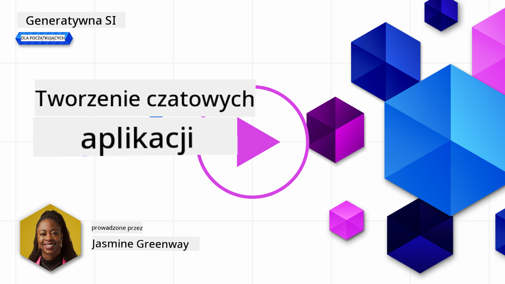
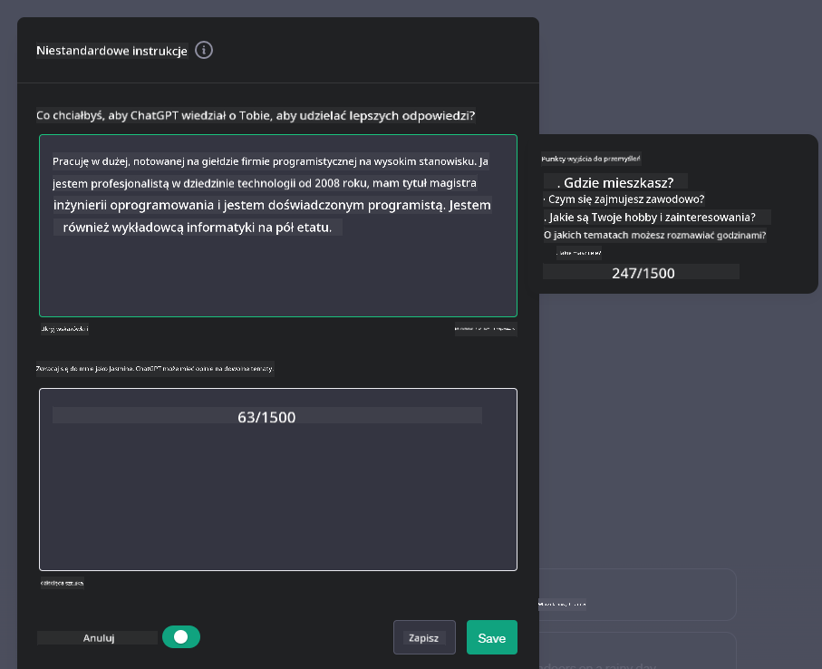

<!--
CO_OP_TRANSLATOR_METADATA:
{
  "original_hash": "ea4bbe640847aafbbba14dae4625e9af",
  "translation_date": "2025-07-09T12:27:04+00:00",
  "source_file": "07-building-chat-applications/README.md",
  "language_code": "pl"
}
-->
# Tworzenie aplikacji czatu zasilanych generatywną sztuczną inteligencją

[](https://aka.ms/gen-ai-lessons7-gh?WT.mc_id=academic-105485-koreyst)

> _(Kliknij powyższy obraz, aby obejrzeć wideo z tej lekcji)_

Teraz, gdy zobaczyliśmy, jak tworzyć aplikacje generujące tekst, przyjrzyjmy się aplikacjom czatu.

Aplikacje czatu stały się integralną częścią naszego codziennego życia, oferując znacznie więcej niż tylko możliwość swobodnej rozmowy. Są nieodłącznym elementem obsługi klienta, wsparcia technicznego, a nawet zaawansowanych systemów doradczych. Prawdopodobnie niedawno korzystałeś z pomocy aplikacji czatu. W miarę jak integrujemy coraz bardziej zaawansowane technologie, takie jak generatywna AI, z tymi platformami, rośnie ich złożoność, a wraz z nią wyzwania.

Kilka pytań, na które musimy znaleźć odpowiedzi, to:

- **Tworzenie aplikacji**. Jak efektywnie budować i płynnie integrować te aplikacje zasilane AI dla konkretnych zastosowań?
- **Monitorowanie**. Po wdrożeniu, jak możemy monitorować i zapewnić, że aplikacje działają na najwyższym poziomie jakości, zarówno pod względem funkcjonalności, jak i zgodności z [sześcioma zasadami odpowiedzialnej AI](https://www.microsoft.com/ai/responsible-ai?WT.mc_id=academic-105485-koreyst)?

W miarę jak wkraczamy w erę zautomatyzowanych i płynnych interakcji człowiek-maszyna, zrozumienie, jak generatywna AI zmienia zakres, głębokość i elastyczność aplikacji czatu, staje się kluczowe. Ta lekcja zbada aspekty architektury wspierającej te złożone systemy, zagłębi się w metody dostrajania ich do zadań specyficznych dla danej dziedziny oraz oceni metryki i kwestie związane z odpowiedzialnym wdrażaniem AI.

## Wprowadzenie

Ta lekcja obejmuje:

- Techniki efektywnego tworzenia i integracji aplikacji czatu.
- Jak stosować personalizację i dostrajanie aplikacji.
- Strategie i kwestie związane z efektywnym monitorowaniem aplikacji czatu.

## Cele nauki

Po ukończeniu tej lekcji będziesz potrafił:

- Opisać kwestie związane z tworzeniem i integracją aplikacji czatu w istniejących systemach.
- Dostosować aplikacje czatu do konkretnych zastosowań.
- Zidentyfikować kluczowe metryki i kwestie potrzebne do skutecznego monitorowania i utrzymania jakości aplikacji czatu zasilanych AI.
- Zapewnić odpowiedzialne wykorzystanie AI w aplikacjach czatu.

## Integracja generatywnej AI w aplikacjach czatu

Podnoszenie jakości aplikacji czatu za pomocą generatywnej AI to nie tylko kwestia uczynienia ich „inteligentniejszymi”; chodzi o optymalizację ich architektury, wydajności i interfejsu użytkownika, aby zapewnić wysoką jakość doświadczenia. Obejmuje to analizę podstaw architektury, integracji API oraz aspektów interfejsu użytkownika. Ta sekcja ma na celu dostarczyć Ci kompleksową mapę drogową do poruszania się w tych złożonych obszarach, niezależnie od tego, czy podłączasz je do istniejących systemów, czy budujesz jako samodzielne platformy.

Po zakończeniu tej sekcji będziesz dysponować wiedzą potrzebną do efektywnego tworzenia i integracji aplikacji czatu.

### Chatbot czy aplikacja czatu?

Zanim przejdziemy do tworzenia aplikacji czatu, porównajmy „chatboty” z „aplikacjami czatu zasilanymi AI”, które pełnią różne role i funkcje. Głównym celem chatbota jest automatyzacja konkretnych zadań konwersacyjnych, takich jak odpowiadanie na często zadawane pytania czy śledzenie przesyłki. Zazwyczaj działa na podstawie reguł lub złożonych algorytmów AI. Natomiast aplikacja czatu zasilana AI to znacznie szersze środowisko, które umożliwia różne formy komunikacji cyfrowej, takie jak czat tekstowy, głosowy czy wideo między użytkownikami. Jej wyróżniającą cechą jest integracja modelu generatywnej AI, który symuluje zniuansowane, przypominające ludzkie rozmowy, generując odpowiedzi na podstawie różnorodnych danych wejściowych i kontekstu. Aplikacja czatu zasilana generatywną AI może prowadzić rozmowy o otwartej tematyce, dostosowywać się do zmieniających się kontekstów i nawet tworzyć kreatywne lub złożone dialogi.

Poniższa tabela przedstawia kluczowe różnice i podobieństwa, które pomogą zrozumieć ich unikalne role w komunikacji cyfrowej.

| Chatbot                               | Aplikacja czatu zasilana generatywną AI |
| ------------------------------------- | --------------------------------------- |
| Skoncentrowany na zadaniach i oparty na regułach | Świadomy kontekstu                      |
| Często zintegrowany z większymi systemami | Może obsługiwać jeden lub wiele chatbotów |
| Ograniczony do zaprogramowanych funkcji | Zawiera modele generatywnej AI          |
| Specjalistyczne i ustrukturyzowane interakcje | Zdolny do rozmów o otwartej tematyce    |

### Wykorzystanie gotowych funkcji za pomocą SDK i API

Podczas tworzenia aplikacji czatu dobrym pierwszym krokiem jest ocena dostępnych rozwiązań. Korzystanie z SDK i API do budowy aplikacji czatu to korzystna strategia z wielu powodów. Integrując dobrze udokumentowane SDK i API, strategicznie przygotowujesz swoją aplikację na długoterminowy sukces, uwzględniając skalowalność i kwestie utrzymania.

- **Przyspiesza proces tworzenia i zmniejsza nakład pracy**: Poleganie na gotowych funkcjach zamiast kosztownego budowania ich od podstaw pozwala skupić się na innych aspektach aplikacji, które mogą być ważniejsze, np. logice biznesowej.
- **Lepsza wydajność**: Budując funkcjonalność od zera, prędzej czy później pojawi się pytanie „Jak to się skaluje? Czy aplikacja poradzi sobie z nagłym wzrostem użytkowników?” Dobrze utrzymywane SDK i API często mają wbudowane rozwiązania tych problemów.
- **Łatwiejsze utrzymanie**: Aktualizacje i ulepszenia są prostsze do zarządzania, ponieważ większość API i SDK wymaga jedynie aktualizacji biblioteki po wydaniu nowej wersji.
- **Dostęp do najnowszych technologii**: Wykorzystanie modeli, które zostały dostrojone i wytrenowane na rozległych zbiorach danych, zapewnia aplikacji zaawansowane możliwości przetwarzania języka naturalnego.

Dostęp do funkcji SDK lub API zwykle wymaga uzyskania uprawnień do korzystania z usług, często poprzez unikalny klucz lub token uwierzytelniający. Użyjemy biblioteki OpenAI dla Pythona, aby zobaczyć, jak to wygląda w praktyce. Możesz też samodzielnie wypróbować to w następujących [notatnikach dla OpenAI](../../../07-building-chat-applications/python/oai-assignment.ipynb) lub [notatnikach dla Azure OpenAI Services](../../../07-building-chat-applications/python/aoai-assignment.ipynb) dla tej lekcji.

```python
import os
from openai import OpenAI

API_KEY = os.getenv("OPENAI_API_KEY","")

client = OpenAI(
    api_key=API_KEY
    )

chat_completion = client.chat.completions.create(model="gpt-3.5-turbo", messages=[{"role": "user", "content": "Suggest two titles for an instructional lesson on chat applications for generative AI."}])
```

Powyższy przykład używa modelu GPT-3.5 Turbo do uzupełnienia promptu, ale zwróć uwagę, że klucz API jest ustawiony przed wykonaniem. Bez ustawienia klucza otrzymasz błąd.

## Doświadczenie użytkownika (UX)

Ogólne zasady UX mają zastosowanie do aplikacji czatu, ale poniżej znajdziesz dodatkowe kwestie, które stają się szczególnie ważne ze względu na komponenty uczenia maszynowego.

- **Mechanizm radzenia sobie z niejasnościami**: Modele generatywnej AI czasem generują niejednoznaczne odpowiedzi. Funkcja pozwalająca użytkownikom prosić o wyjaśnienie może być pomocna w takich sytuacjach.
- **Zachowanie kontekstu**: Zaawansowane modele generatywnej AI potrafią zapamiętywać kontekst rozmowy, co może być cennym elementem doświadczenia użytkownika. Dając użytkownikom możliwość kontrolowania i zarządzania kontekstem, poprawiamy UX, ale jednocześnie pojawia się ryzyko przechowywania wrażliwych danych. Warto rozważyć, jak długo takie informacje są przechowywane, np. wprowadzając politykę retencji, aby zrównoważyć potrzebę kontekstu z prywatnością.
- **Personalizacja**: Dzięki zdolności do uczenia się i adaptacji, modele AI oferują spersonalizowane doświadczenie użytkownika. Dostosowanie UX poprzez funkcje takie jak profile użytkowników nie tylko sprawia, że użytkownik czuje się zrozumiany, ale także pomaga mu szybciej znaleźć konkretne odpowiedzi, tworząc bardziej efektywną i satysfakcjonującą interakcję.

Przykładem personalizacji są ustawienia „Custom instructions” w ChatGPT od OpenAI. Pozwalają one podać informacje o sobie, które mogą stanowić ważny kontekst dla promptów. Oto przykład takiej instrukcji.



Ten „profil” nakazuje ChatGPT stworzyć plan lekcji o listach powiązanych. Zauważ, że ChatGPT uwzględnia, że użytkownik może chcieć bardziej szczegółowego planu lekcji, bazując na jej doświadczeniu.


### Microsoftowy System Message Framework dla dużych modeli językowych

[Microsoft udostępnił wytyczne](https://learn.microsoft.com/azure/ai-services/openai/concepts/system-message#define-the-models-output-format?WT.mc_id=academic-105485-koreyst) dotyczące tworzenia skutecznych komunikatów systemowych przy generowaniu odpowiedzi z LLM, podzielone na 4 obszary:

1. Określenie, dla kogo jest model oraz jego możliwości i ograniczenia.
2. Definiowanie formatu wyjścia modelu.
3. Podanie konkretnych przykładów ilustrujących zamierzone zachowanie modelu.
4. Zapewnienie dodatkowych zabezpieczeń behawioralnych.

### Dostępność

Niezależnie od tego, czy użytkownik ma problemy wzrokowe, słuchowe, motoryczne czy poznawcze, dobrze zaprojektowana aplikacja czatu powinna być dostępna dla wszystkich. Poniższa lista przedstawia konkretne funkcje mające na celu poprawę dostępności dla różnych rodzajów niepełnosprawności.

- **Funkcje dla osób z wadami wzroku**: Motywy o wysokim kontraście i możliwość zmiany rozmiaru tekstu, kompatybilność z czytnikami ekranu.
- **Funkcje dla osób z wadami słuchu**: Funkcje tekst-na-mowę i mowa-na-tekst, wizualne sygnały powiadomień dźwiękowych.
- **Funkcje dla osób z ograniczeniami motorycznymi**: Obsługa nawigacji klawiaturą, polecenia głosowe.
- **Funkcje dla osób z zaburzeniami poznawczymi**: Opcje uproszczonego języka.

## Personalizacja i dostrajanie modeli językowych specyficznych dla danej dziedziny

Wyobraź sobie aplikację czatu, która rozumie żargon Twojej firmy i przewiduje konkretne pytania, które często zadają jej użytkownicy. Warto wspomnieć o kilku podejściach:

- **Wykorzystanie modeli DSL**. DSL oznacza domain specific language (język specyficzny dla danej dziedziny). Możesz wykorzystać model DSL wytrenowany na konkretnej dziedzinie, aby rozumiał jej pojęcia i scenariusze.
- **Zastosowanie dostrajania (fine-tuning)**. Dostrajanie to proces dalszego trenowania modelu na specyficznych danych.

## Personalizacja: Korzystanie z modelu DSL

Wykorzystanie modeli językowych specyficznych dla danej dziedziny (DSL) może zwiększyć zaangażowanie użytkowników, oferując specjalistyczne, kontekstowo dopasowane interakcje. To model wytrenowany lub dostrojony do rozumienia i generowania tekstu związanego z określoną dziedziną, branżą lub tematem. Opcje korzystania z modelu DSL mogą obejmować trenowanie od podstaw, używanie istniejących modeli przez SDK i API lub dostrajanie, czyli adaptację istniejącego modelu do konkretnej dziedziny.

## Personalizacja: Zastosowanie dostrajania

Dostrajanie jest często rozważane, gdy model wstępnie wytrenowany nie spełnia wymagań w specjalistycznej dziedzinie lub konkretnym zadaniu.

Na przykład zapytania medyczne są złożone i wymagają dużego kontekstu. Gdy lekarz stawia diagnozę, opiera się na wielu czynnikach, takich jak styl życia czy choroby współistniejące, a także może korzystać z najnowszych publikacji medycznych. W takich złożonych sytuacjach ogólna aplikacja AI nie może być wiarygodnym źródłem.

### Przykład: aplikacja medyczna

Weźmy pod uwagę aplikację czatu zaprojektowaną, by wspierać lekarzy, dostarczając szybkie odniesienia do wytycznych leczenia, interakcji leków czy najnowszych badań.

Model ogólnego przeznaczenia może wystarczyć do odpowiadania na podstawowe pytania medyczne lub udzielania ogólnych porad, ale może mieć trudności z:

- **Bardzo specyficznymi lub złożonymi przypadkami**. Na przykład neurolog może zapytać: „Jakie są obecne najlepsze praktyki w leczeniu lekoopornej padaczki u dzieci?”
- **Brakiem najnowszych osiągnięć**. Model ogólnego przeznaczenia może mieć problem z udzieleniem aktualnej odpowiedzi uwzględniającej najnowsze osiągnięcia w neurologii i farmakologii.

W takich przypadkach dostrojenie modelu na specjalistycznym zbiorze danych medycznych może znacznie poprawić jego zdolność do precyzyjnego i wiarygodnego odpowiadania na skomplikowane pytania medyczne. Wymaga to dostępu do dużego i odpowiedniego zbioru danych reprezentującego specyficzne wyzwania i pytania danej dziedziny.

## Kwestie związane z wysoką jakością doświadczenia czatu zasilanego AI

Ta sekcja przedstawia kryteria „wysokiej jakości” aplikacji czatu, które obejmują zbieranie użytecznych metryk oraz przestrzeganie ram odpowiedzialnego wykorzystania technologii AI.

### Kluczowe metryki

Aby utrzymać wysoką jakość działania aplikacji, ważne jest monitorowanie kluczowych metryk i kwestii. Te pomiary nie tylko zapewniają funkcjonalność aplikacji, ale także oceniają jakość modelu AI i doświadczenia użytkownika. Poniżej znajduje się lista podstawowych metryk, metryk AI oraz UX, które warto uwzględnić.

| Metryka                      | Definicja                                                                                                             | Uwagi dla twórcy aplikacji czatu                                    |
| ---------------------------- | --------------------------------------------------------------------------------------------------------------------- | ------------------------------------------------------------------ |
| **Czas działania (Uptime)**  | Mierzy czas, w którym aplikacja jest dostępna i działa dla użytkowników.                                             | Jak zminimalizujesz przestoje?                                     |
| **Czas odpowiedzi**          | Czas, jaki aplikacja potrzebuje, aby odpowiedzieć na zapytanie użytkownika.                                           | Jak zoptymalizujesz przetwarzanie zapytań, by skrócić czas odpowiedzi? |
| **Precyzja (Precision)**     | Stosunek prawdziwych trafnych odpowiedzi do wszystkich odpowiedzi uznanych za trafne.                                 | Jak zweryfikujesz precyzję modelu?                                 |
| **Czułość (Recall)**          | Stosunek prawdziwych trafnych odpowiedzi do faktycznej liczby trafnych przypadków.                                    | Jak zmierzysz i poprawisz czułość?                                 |
| **Wskaźnik F1**              | Średnia harmoniczna precyzji i czułości, równoważąca kompromis między nimi.                                           | Jaki jest Twój cel w zakresie F1? Jak zbalansujesz precyzję i czułość? |
| **Perpleksja (Perplexity)**  | Mierzy, jak dobrze rozkład prawdopodobieństwa przewidywany przez model odpowiada rzeczywistemu rozkładowi danych.     | Jak
| **Wykrywanie Anomalii**      | Narzędzia i techniki służące do identyfikacji nietypowych wzorców, które nie odpowiadają oczekiwanemu zachowaniu.          | Jak zareagujesz na anomalie?                                               |

### Wdrażanie odpowiedzialnych praktyk AI w aplikacjach czatu

Podejście Microsoft do odpowiedzialnej AI wyróżnia sześć zasad, które powinny kierować rozwojem i wykorzystaniem AI. Poniżej znajdują się zasady, ich definicje oraz kwestie, które deweloper czatu powinien wziąć pod uwagę i dlaczego warto traktować je poważnie.

| Zasady                 | Definicja Microsoftu                                  | Uwagi dla dewelopera czatu                                            | Dlaczego to ważne                                                                    |
| ---------------------- | ----------------------------------------------------- | -------------------------------------------------------------------- | ------------------------------------------------------------------------------------ |
| Sprawiedliwość         | Systemy AI powinny traktować wszystkich ludzi uczciwie. | Upewnij się, że aplikacja czatu nie dyskryminuje na podstawie danych użytkownika. | Buduje zaufanie i inkluzywność wśród użytkowników; unika konsekwencji prawnych.      |
| Niezawodność i bezpieczeństwo | Systemy AI powinny działać niezawodnie i bezpiecznie. | Wprowadź testy i mechanizmy awaryjne, aby minimalizować błędy i ryzyko. | Zapewnia satysfakcję użytkowników i zapobiega potencjalnym szkodom.                  |
| Prywatność i bezpieczeństwo | Systemy AI powinny być bezpieczne i szanować prywatność. | Zastosuj silne szyfrowanie i środki ochrony danych.                   | Chroni wrażliwe dane użytkowników i zapewnia zgodność z przepisami o prywatności.    |
| Inkluzywność           | Systemy AI powinny wzmacniać wszystkich i angażować ludzi. | Zaprojektuj UI/UX dostępne i łatwe w użyciu dla różnorodnych odbiorców. | Zapewnia, że szersze grono osób może efektywnie korzystać z aplikacji.               |
| Przejrzystość          | Systemy AI powinny być zrozumiałe.                     | Zapewnij jasną dokumentację i uzasadnienie odpowiedzi AI.             | Użytkownicy chętniej zaufają systemowi, jeśli rozumieją, jak podejmowane są decyzje.  |
| Odpowiedzialność       | Ludzie powinni ponosić odpowiedzialność za systemy AI. | Ustanów jasny proces audytu i ulepszania decyzji AI.                   | Umożliwia ciągłe doskonalenie i wprowadzanie korekt w przypadku błędów.              |

## Zadanie

Zobacz [assignment](../../../07-building-chat-applications/python), który przeprowadzi Cię przez serię ćwiczeń – od uruchamiania pierwszych promptów czatu, przez klasyfikację i podsumowywanie tekstu, aż po inne zadania. Zwróć uwagę, że zadania dostępne są w różnych językach programowania!

## Świetna robota! Kontynuuj swoją podróż

Po ukończeniu tej lekcji sprawdź naszą [kolekcję Generative AI Learning](https://aka.ms/genai-collection?WT.mc_id=academic-105485-koreyst), aby dalej rozwijać swoją wiedzę o Generative AI!

Przejdź do Lekcji 8, aby zobaczyć, jak możesz zacząć [tworzyć aplikacje wyszukujące](../08-building-search-applications/README.md?WT.mc_id=academic-105485-koreyst)!

**Zastrzeżenie**:  
Niniejszy dokument został przetłumaczony za pomocą usługi tłumaczenia AI [Co-op Translator](https://github.com/Azure/co-op-translator). Mimo że dążymy do jak największej dokładności, prosimy mieć na uwadze, że tłumaczenia automatyczne mogą zawierać błędy lub nieścisłości. Oryginalny dokument w języku źródłowym powinien być uznawany za źródło autorytatywne. W przypadku informacji o kluczowym znaczeniu zalecane jest skorzystanie z profesjonalnego tłumaczenia wykonanego przez człowieka. Nie ponosimy odpowiedzialności za jakiekolwiek nieporozumienia lub błędne interpretacje wynikające z korzystania z tego tłumaczenia.