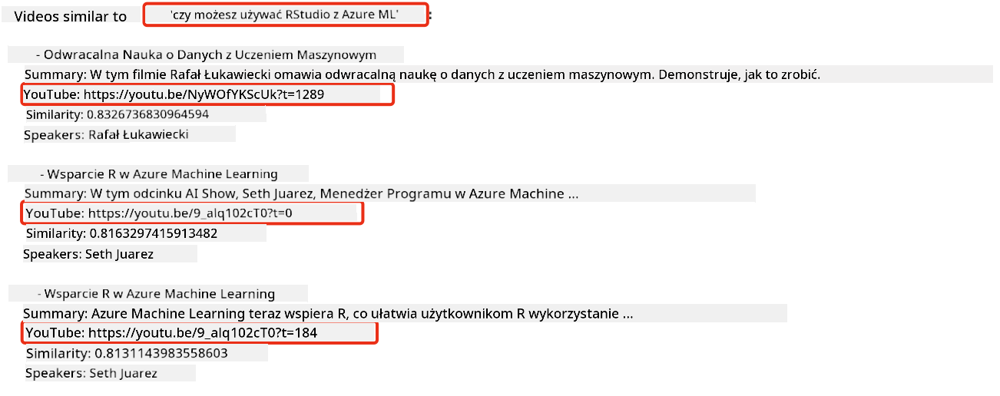
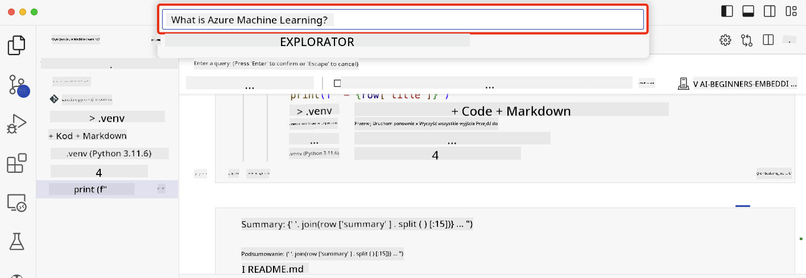

<!--
CO_OP_TRANSLATOR_METADATA:
{
  "original_hash": "d46aad0917a1a342d613e2c13d457da5",
  "translation_date": "2025-05-19T10:20:38+00:00",
  "source_file": "08-building-search-applications/README.md",
  "language_code": "pl"
}
-->
# Tworzenie aplikacji wyszukiwania

[](https://aka.ms/gen-ai-lesson8-gh?WT.mc_id=academic-105485-koreyst)

> > _Kliknij obrazek powyżej, aby obejrzeć wideo z tej lekcji_

LLMy to nie tylko chatboty i generowanie tekstu. Można również tworzyć aplikacje wyszukiwania za pomocą osadzeń. Osadzenia to numeryczne reprezentacje danych, znane również jako wektory, które można wykorzystać do semantycznego wyszukiwania danych.

W tej lekcji zbudujesz aplikację wyszukiwania dla naszego startupu edukacyjnego. Nasz startup to organizacja non-profit, która zapewnia darmową edukację uczniom w krajach rozwijających się. Nasz startup ma dużą liczbę filmów na YouTube, które uczniowie mogą wykorzystać do nauki o AI. Nasz startup chce stworzyć aplikację wyszukiwania, która pozwala uczniom wyszukiwać filmy na YouTube, wpisując pytanie.

Na przykład, uczeń może wpisać 'Czym są Jupyter Notebooks?' lub 'Co to jest Azure ML', a aplikacja wyszukiwania zwróci listę filmów na YouTube, które są istotne dla pytania, a co więcej, aplikacja wyszukiwania zwróci link do miejsca w filmie, gdzie znajduje się odpowiedź na pytanie.

## Wprowadzenie

W tej lekcji omówimy:

- Wyszukiwanie semantyczne vs wyszukiwanie słów kluczowych.
- Czym są osadzenia tekstowe.
- Tworzenie indeksu osadzeń tekstowych.
- Wyszukiwanie w indeksie osadzeń tekstowych.

## Cele nauki

Po ukończeniu tej lekcji będziesz w stanie:

- Rozróżnić wyszukiwanie semantyczne od wyszukiwania słów kluczowych.
- Wyjaśnić, czym są osadzenia tekstowe.
- Stworzyć aplikację wykorzystującą osadzenia do wyszukiwania danych.

## Dlaczego warto stworzyć aplikację wyszukiwania?

Tworzenie aplikacji wyszukiwania pomoże ci zrozumieć, jak używać osadzeń do wyszukiwania danych. Nauczysz się również, jak stworzyć aplikację wyszukiwania, którą uczniowie mogą wykorzystać do szybkiego znajdowania informacji.

Lekcja zawiera indeks osadzeń transkrypcji z YouTube dla kanału [AI Show](https://www.youtube.com/playlist?list=PLlrxD0HtieHi0mwteKBOfEeOYf0LJU4O1) na YouTube. AI Show to kanał na YouTube, który uczy o AI i uczeniu maszynowym. Indeks osadzeń zawiera osadzenia dla każdej transkrypcji z YouTube aż do października 2023. Wykorzystasz indeks osadzeń do zbudowania aplikacji wyszukiwania dla naszego startupu. Aplikacja wyszukiwania zwraca link do miejsca w filmie, gdzie znajduje się odpowiedź na pytanie. To świetny sposób, aby uczniowie mogli szybko znaleźć potrzebne informacje.

Poniżej znajduje się przykład zapytania semantycznego dla pytania 'czy można używać rstudio z azure ml?'. Sprawdź URL na YouTube, zobaczysz, że URL zawiera znacznik czasu, który prowadzi do miejsca w filmie, gdzie znajduje się odpowiedź na pytanie.



## Czym jest wyszukiwanie semantyczne?

Możesz się zastanawiać, czym jest wyszukiwanie semantyczne? Wyszukiwanie semantyczne to technika wyszukiwania, która wykorzystuje semantykę, czyli znaczenie słów w zapytaniu, aby zwrócić istotne wyniki.

Oto przykład wyszukiwania semantycznego. Powiedzmy, że chcesz kupić samochód, możesz wyszukać 'mój wymarzony samochód', wyszukiwanie semantyczne rozumie, że nie chodzi o `dreaming` samochód, ale raczej o chęć zakupu `ideal` samochodu. Wyszukiwanie semantyczne rozumie twoją intencję i zwraca istotne wyniki. Alternatywą jest `keyword search`, które dosłownie wyszukiwałoby marzenia o samochodach i często zwracałoby nieistotne wyniki.

## Czym są osadzenia tekstowe?

[Osadzenia tekstowe](https://en.wikipedia.org/wiki/Word_embedding?WT.mc_id=academic-105485-koreyst) to technika reprezentacji tekstu używana w [przetwarzaniu języka naturalnego](https://en.wikipedia.org/wiki/Natural_language_processing?WT.mc_id=academic-105485-koreyst). Osadzenia tekstowe to semantyczne numeryczne reprezentacje tekstu. Osadzenia są używane do reprezentacji danych w sposób, który jest łatwy do zrozumienia przez maszynę. Istnieje wiele modeli do budowania osadzeń tekstowych, w tej lekcji skupimy się na generowaniu osadzeń za pomocą modelu osadzeń OpenAI.

Oto przykład, wyobraź sobie, że poniższy tekst znajduje się w transkrypcji jednego z odcinków na kanale AI Show na YouTube:

```text
Today we are going to learn about Azure Machine Learning.
```

Przekazalibyśmy tekst do OpenAI Embedding API, a ono zwróciłoby następujące osadzenie składające się z 1536 liczb, czyli wektora. Każda liczba w wektorze reprezentuje inny aspekt tekstu. Dla skrótu, oto pierwsze 10 liczb w wektorze.

```python
[-0.006655829958617687, 0.0026128944009542465, 0.008792596869170666, -0.02446001023054123, -0.008540431968867779, 0.022071078419685364, -0.010703742504119873, 0.003311325330287218, -0.011632772162556648, -0.02187200076878071, ...]
```

## Jak jest tworzony indeks osadzeń?

Indeks osadzeń dla tej lekcji został stworzony za pomocą serii skryptów w Pythonie. Znajdziesz skrypty wraz z instrukcjami w [README](./scripts/README.md?WT.mc_id=academic-105485-koreyst) w folderze 'scripts' dla tej lekcji. Nie musisz uruchamiać tych skryptów, aby ukończyć tę lekcję, ponieważ indeks osadzeń jest dostarczony dla ciebie.

Skrypty wykonują następujące operacje:

1. Transkrypcja dla każdego filmu na YouTube w playlistach [AI Show](https://www.youtube.com/playlist?list=PLlrxD0HtieHi0mwteKBOfEeOYf0LJU4O1) jest pobierana.
2. Za pomocą [Funkcji OpenAI](https://learn.microsoft.com/azure/ai-services/openai/how-to/function-calling?WT.mc_id=academic-105485-koreyst) podejmowana jest próba wyodrębnienia nazwy mówcy z pierwszych 3 minut transkrypcji z YouTube. Nazwa mówcy dla każdego filmu jest przechowywana w indeksie osadzeń o nazwie `embedding_index_3m.json`.
3. Tekst transkrypcji jest następnie dzielony na **3-minutowe segmenty tekstowe**. Segment zawiera około 20 słów nakładających się z następnym segmentem, aby zapewnić, że osadzenie dla segmentu nie jest odcięte i aby zapewnić lepszy kontekst wyszukiwania.
4. Każdy segment tekstowy jest następnie przekazywany do OpenAI Chat API, aby podsumować tekst w 60 słowach. Podsumowanie jest również przechowywane w indeksie osadzeń `embedding_index_3m.json`.
5. Na koniec, tekst segmentu jest przekazywany do OpenAI Embedding API. API osadzeń zwraca wektor składający się z 1536 liczb, które reprezentują semantyczne znaczenie segmentu. Segment wraz z wektorem osadzeń OpenAI jest przechowywany w indeksie osadzeń `embedding_index_3m.json`.

### Bazy danych wektorowych

Dla prostoty lekcji indeks osadzeń jest przechowywany w pliku JSON o nazwie `embedding_index_3m.json` i ładowany do Pandas DataFrame. Jednak w produkcji indeks osadzeń byłby przechowywany w bazie danych wektorowej, takiej jak [Azure Cognitive Search](https://learn.microsoft.com/training/modules/improve-search-results-vector-search?WT.mc_id=academic-105485-koreyst), [Redis](https://cookbook.openai.com/examples/vector_databases/redis/readme?WT.mc_id=academic-105485-koreyst), [Pinecone](https://cookbook.openai.com/examples/vector_databases/pinecone/readme?WT.mc_id=academic-105485-koreyst), [Weaviate](https://cookbook.openai.com/examples/vector_databases/weaviate/readme?WT.mc_id=academic-105485-koreyst), żeby wymienić tylko kilka.

## Zrozumienie podobieństwa kosinusowego

Nauczyliśmy się o osadzeniach tekstowych, kolejnym krokiem jest nauczenie się, jak używać osadzeń tekstowych do wyszukiwania danych, a w szczególności do znajdowania najbardziej podobnych osadzeń do danego zapytania za pomocą podobieństwa kosinusowego.

### Czym jest podobieństwo kosinusowe?

Podobieństwo kosinusowe to miara podobieństwa między dwoma wektorami, usłyszysz również, że jest to nazywane `nearest neighbor search`. Aby wykonać wyszukiwanie podobieństwa kosinusowego, musisz _wektoryzować_ tekst _zapytania_ za pomocą OpenAI Embedding API. Następnie obliczyć _podobieństwo kosinusowe_ między wektorem zapytania a każdym wektorem w indeksie osadzeń. Pamiętaj, indeks osadzeń ma wektor dla każdego segmentu tekstowego transkrypcji z YouTube. Na koniec, posortuj wyniki według podobieństwa kosinusowego, a segmenty tekstowe z najwyższym podobieństwem kosinusowym są najbardziej podobne do zapytania.

Z matematycznego punktu widzenia, podobieństwo kosinusowe mierzy kosinus kąta między dwoma wektorami rzutowanymi w przestrzeni wielowymiarowej. Ta miara jest korzystna, ponieważ jeśli dwa dokumenty są daleko od siebie według odległości euklidesowej z powodu rozmiaru, mogą mieć nadal mniejszy kąt między nimi, a tym samym wyższe podobieństwo kosinusowe. Aby uzyskać więcej informacji o równaniach podobieństwa kosinusowego, zobacz [Podobieństwo kosinusowe](https://en.wikipedia.org/wiki/Cosine_similarity?WT.mc_id=academic-105485-koreyst).

## Tworzenie swojej pierwszej aplikacji wyszukiwania

Następnie nauczymy się, jak stworzyć aplikację wyszukiwania za pomocą osadzeń. Aplikacja wyszukiwania pozwoli uczniom wyszukiwać filmy, wpisując pytanie. Aplikacja wyszukiwania zwróci listę filmów, które są istotne dla pytania. Aplikacja wyszukiwania zwróci również link do miejsca w filmie, gdzie znajduje się odpowiedź na pytanie.

To rozwiązanie zostało zbudowane i przetestowane na Windows 11, macOS i Ubuntu 22.04 używając Python 3.10 lub nowszego. Możesz pobrać Pythona z [python.org](https://www.python.org/downloads/?WT.mc_id=academic-105485-koreyst).

## Zadanie - tworzenie aplikacji wyszukiwania, aby umożliwić uczniom

Wprowadziliśmy nasz startup na początku tej lekcji. Teraz nadszedł czas, aby umożliwić uczniom tworzenie aplikacji wyszukiwania dla ich ocen.

W tym zadaniu stworzysz usługi Azure OpenAI, które będą używane do tworzenia aplikacji wyszukiwania. Stworzysz następujące usługi Azure OpenAI. Będziesz potrzebować subskrypcji Azure, aby ukończyć to zadanie.

### Rozpocznij Azure Cloud Shell

1. Zaloguj się do [Azure portal](https://portal.azure.com/?WT.mc_id=academic-105485-koreyst).
2. Wybierz ikonę Cloud Shell w prawym górnym rogu Azure portal.
3. Wybierz **Bash** jako typ środowiska.

#### Utwórz grupę zasobów

> Dla tych instrukcji używamy grupy zasobów o nazwie "semantic-video-search" w East US.
> Możesz zmienić nazwę grupy zasobów, ale zmieniając lokalizację dla zasobów,
> sprawdź [tabelę dostępności modeli](https://aka.ms/oai/models?WT.mc_id=academic-105485-koreyst).

```shell
az group create --name semantic-video-search --location eastus
```

#### Utwórz zasób usługi Azure OpenAI

Z Azure Cloud Shell, uruchom następujące polecenie, aby utworzyć zasób usługi Azure OpenAI.

```shell
az cognitiveservices account create --name semantic-video-openai --resource-group semantic-video-search \
    --location eastus --kind OpenAI --sku s0
```

#### Pobierz punkt końcowy i klucze do użycia w tej aplikacji

Z Azure Cloud Shell, uruchom następujące polecenia, aby pobrać punkt końcowy i klucze dla zasobu usługi Azure OpenAI.

```shell
az cognitiveservices account show --name semantic-video-openai \
   --resource-group  semantic-video-search | jq -r .properties.endpoint
az cognitiveservices account keys list --name semantic-video-openai \
   --resource-group semantic-video-search | jq -r .key1
```

#### Wdróż model osadzeń OpenAI

Z Azure Cloud Shell, uruchom następujące polecenie, aby wdrożyć model osadzeń OpenAI.

```shell
az cognitiveservices account deployment create \
    --name semantic-video-openai \
    --resource-group  semantic-video-search \
    --deployment-name text-embedding-ada-002 \
    --model-name text-embedding-ada-002 \
    --model-version "2"  \
    --model-format OpenAI \
    --sku-capacity 100 --sku-name "Standard"
```

## Rozwiązanie

Otwórz [notatnik rozwiązania](../../../08-building-search-applications/python/aoai-solution.ipynb) w GitHub Codespaces i postępuj zgodnie z instrukcjami w Jupyter Notebook.

Kiedy uruchomisz notatnik, zostaniesz poproszony o wpisanie zapytania. Pole do wprowadzania będzie wyglądać tak:



## Świetna robota! Kontynuuj naukę

Po ukończeniu tej lekcji, sprawdź naszą [kolekcję nauki o generatywnej AI](https://aka.ms/genai-collection?WT.mc_id=academic-105485-koreyst), aby kontynuować rozwijanie swojej wiedzy o generatywnej AI!

Przejdź do Lekcji 9, gdzie przyjrzymy się, jak [tworzyć aplikacje generujące obrazy](../09-building-image-applications/README.md?WT.mc_id=academic-105485-koreyst)!

**Zastrzeżenie**:  
Ten dokument został przetłumaczony za pomocą usługi tłumaczenia AI [Co-op Translator](https://github.com/Azure/co-op-translator). Chociaż staramy się zapewnić dokładność, prosimy pamiętać, że automatyczne tłumaczenia mogą zawierać błędy lub nieścisłości. Oryginalny dokument w jego rodzimym języku powinien być uznawany za źródło autorytatywne. W przypadku istotnych informacji zaleca się profesjonalne tłumaczenie przez człowieka. Nie ponosimy odpowiedzialności za jakiekolwiek nieporozumienia lub błędne interpretacje wynikające z użycia tego tłumaczenia.