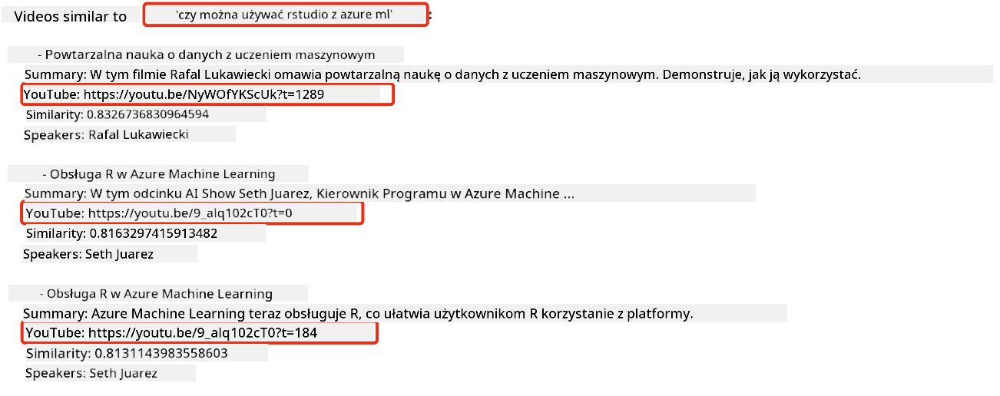
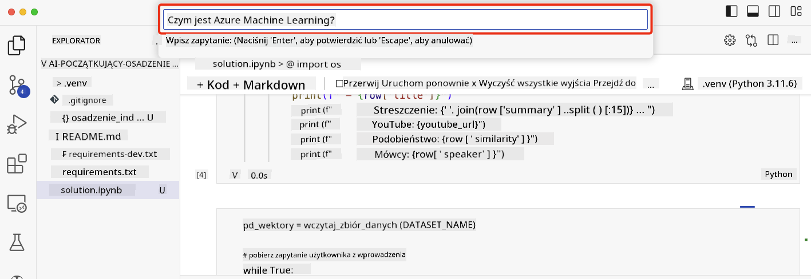

<!--
CO_OP_TRANSLATOR_METADATA:
{
  "original_hash": "d46aad0917a1a342d613e2c13d457da5",
  "translation_date": "2025-06-25T16:28:13+00:00",
  "source_file": "08-building-search-applications/README.md",
  "language_code": "pl"
}
-->
# Budowanie aplikacji wyszukiwania

[](https://aka.ms/gen-ai-lesson8-gh?WT.mc_id=academic-105485-koreyst)

> > _Kliknij obrazek powyżej, aby obejrzeć wideo tej lekcji_

LLM to nie tylko chatboty i generowanie tekstu. Można również budować aplikacje wyszukiwania używając Embeddings. Embeddings to numeryczne reprezentacje danych, znane również jako wektory, które mogą być używane do semantycznego wyszukiwania danych.

W tej lekcji zbudujesz aplikację wyszukiwania dla naszego startupu edukacyjnego. Nasz startup to organizacja non-profit, która zapewnia darmową edukację dla uczniów w krajach rozwijających się. Nasz startup ma dużą liczbę filmów na YouTube, które uczniowie mogą wykorzystać do nauki o AI. Nasz startup chce zbudować aplikację wyszukiwania, która pozwoli uczniom wyszukiwać filmy na YouTube poprzez wpisanie pytania.

Na przykład, uczeń może wpisać 'Co to są Jupyter Notebooks?' lub 'Co to jest Azure ML' i aplikacja wyszukiwania zwróci listę filmów na YouTube, które są związane z pytaniem, a co więcej, aplikacja wyszukiwania zwróci link do miejsca w filmie, gdzie znajduje się odpowiedź na pytanie.

## Wprowadzenie

W tej lekcji omówimy:

- Wyszukiwanie semantyczne vs wyszukiwanie słów kluczowych.
- Co to są Embeddings tekstowe.
- Tworzenie indeksu Embeddings tekstowych.
- Wyszukiwanie w indeksie Embeddings tekstowych.

## Cele nauki

Po ukończeniu tej lekcji będziesz w stanie:

- Rozróżnić wyszukiwanie semantyczne od wyszukiwania słów kluczowych.
- Wyjaśnić, czym są Embeddings tekstowe.
- Stworzyć aplikację używając Embeddings do wyszukiwania danych.

## Dlaczego warto budować aplikację wyszukiwania?

Tworzenie aplikacji wyszukiwania pomoże Ci zrozumieć, jak używać Embeddings do wyszukiwania danych. Nauczysz się również, jak zbudować aplikację wyszukiwania, która może być używana przez uczniów do szybkiego znajdowania informacji.

Lekcja zawiera Indeks Embeddingów z transkryptów YouTube dla kanału [AI Show](https://www.youtube.com/playlist?list=PLlrxD0HtieHi0mwteKBOfEeOYf0LJU4O1). AI Show to kanał YouTube, który uczy o AI i uczeniu maszynowym. Indeks Embeddingów zawiera Embeddings dla każdego z transkryptów YouTube do października 2023. Użyjesz Indeksu Embeddingów do zbudowania aplikacji wyszukiwania dla naszego startupu. Aplikacja wyszukiwania zwraca link do miejsca w filmie, gdzie znajduje się odpowiedź na pytanie. To świetny sposób dla uczniów na szybkie znalezienie potrzebnych informacji.

Poniżej znajduje się przykład semantycznego zapytania dla pytania 'czy możesz używać rstudio z azure ml?'. Sprawdź url YouTube, zobaczysz, że url zawiera znacznik czasu, który przenosi Cię do miejsca w filmie, gdzie znajduje się odpowiedź na pytanie.



## Co to jest wyszukiwanie semantyczne?

Możesz się zastanawiać, czym jest wyszukiwanie semantyczne? Wyszukiwanie semantyczne to technika wyszukiwania, która wykorzystuje semantykę, czyli znaczenie słów w zapytaniu, aby zwrócić odpowiednie wyniki.

Oto przykład wyszukiwania semantycznego. Powiedzmy, że szukasz samochodu do kupienia, możesz wyszukiwać 'mój wymarzony samochód', wyszukiwanie semantyczne rozumie, że nie chodzi o `dreaming` samochód, ale raczej o `ideal` samochód. Wyszukiwanie semantyczne rozumie Twoją intencję i zwraca odpowiednie wyniki. Alternatywą jest `keyword search`, które dosłownie wyszukiwałoby marzenia o samochodach i często zwracałoby nieodpowiednie wyniki.

## Co to są Embeddings tekstowe?

[Embeddings tekstowe](https://en.wikipedia.org/wiki/Word_embedding?WT.mc_id=academic-105485-koreyst) to technika reprezentacji tekstu używana w [przetwarzaniu języka naturalnego](https://en.wikipedia.org/wiki/Natural_language_processing?WT.mc_id=academic-105485-koreyst). Embeddings tekstowe to semantyczne numeryczne reprezentacje tekstu. Embeddings są używane do reprezentowania danych w sposób, który jest łatwy do zrozumienia przez maszynę. Istnieje wiele modeli do budowania embeddings tekstowych, w tej lekcji skupimy się na generowaniu embeddings za pomocą modelu OpenAI Embedding.

Oto przykład, wyobraź sobie, że poniższy tekst znajduje się w transkrypcji jednego z odcinków na kanale YouTube AI Show:

```text
Today we are going to learn about Azure Machine Learning.
```

Przekazalibyśmy tekst do API Embedding OpenAI i otrzymalibyśmy następujący embedding składający się z 1536 liczb, czyli wektor. Każda liczba w wektorze reprezentuje inny aspekt tekstu. Dla skrócenia, oto pierwsze 10 liczb w wektorze.

```python
[-0.006655829958617687, 0.0026128944009542465, 0.008792596869170666, -0.02446001023054123, -0.008540431968867779, 0.022071078419685364, -0.010703742504119873, 0.003311325330287218, -0.011632772162556648, -0.02187200076878071, ...]
```

## Jak tworzony jest indeks Embeddingów?

Indeks Embeddingów dla tej lekcji został stworzony za pomocą serii skryptów Python. Znajdziesz skrypty wraz z instrukcjami w [README](./scripts/README.md?WT.mc_id=academic-105485-koreyst) w folderze 'scripts' dla tej lekcji. Nie musisz uruchamiać tych skryptów, aby ukończyć tę lekcję, ponieważ Indeks Embeddingów jest dla Ciebie dostarczony.

Skrypty wykonują następujące operacje:

1. Transkrypcja każdego filmu na YouTube w playlistcie [AI Show](https://www.youtube.com/playlist?list=PLlrxD0HtieHi0mwteKBOfEeOYf0LJU4O1) jest pobierana.
2. Używając [Funkcji OpenAI](https://learn.microsoft.com/azure/ai-services/openai/how-to/function-calling?WT.mc_id=academic-105485-koreyst), próbuje się wyciągnąć nazwę mówcy z pierwszych 3 minut transkrypcji YouTube. Nazwa mówcy dla każdego filmu jest przechowywana w Indeksie Embeddingów o nazwie `embedding_index_3m.json`.
3. Tekst transkrypcji jest następnie dzielony na **3-minutowe segmenty tekstowe**. Segment zawiera około 20 słów nakładających się z następnym segmentem, aby upewnić się, że Embedding dla segmentu nie jest odcięty i zapewnia lepszy kontekst wyszukiwania.
4. Każdy segment tekstowy jest następnie przekazywany do API OpenAI Chat, aby streścić tekst do 60 słów. Podsumowanie jest również przechowywane w Indeksie Embeddingów `embedding_index_3m.json`.
5. Na koniec, tekst segmentu jest przekazywany do API Embedding OpenAI. API Embedding zwraca wektor składający się z 1536 liczb, które reprezentują semantyczne znaczenie segmentu. Segment wraz z wektorem Embedding OpenAI jest przechowywany w Indeksie Embeddingów `embedding_index_3m.json`.

### Bazy danych wektorowych

Dla uproszczenia lekcji, Indeks Embeddingów jest przechowywany w pliku JSON o nazwie `embedding_index_3m.json` i ładowany do Pandas DataFrame. Jednak w produkcji Indeks Embeddingów byłby przechowywany w bazie danych wektorowych, takiej jak [Azure Cognitive Search](https://learn.microsoft.com/training/modules/improve-search-results-vector-search?WT.mc_id=academic-105485-koreyst), [Redis](https://cookbook.openai.com/examples/vector_databases/redis/readme?WT.mc_id=academic-105485-koreyst), [Pinecone](https://cookbook.openai.com/examples/vector_databases/pinecone/readme?WT.mc_id=academic-105485-koreyst), [Weaviate](https://cookbook.openai.com/examples/vector_databases/weaviate/readme?WT.mc_id=academic-105485-koreyst), żeby wymienić tylko kilka.

## Zrozumienie podobieństwa cosinusowego

Nauczyliśmy się o embeddings tekstowych, następnym krokiem jest nauka, jak używać embeddings tekstowych do wyszukiwania danych, a w szczególności znajdowania najbardziej podobnych embeddings do danego zapytania używając podobieństwa cosinusowego.

### Co to jest podobieństwo cosinusowe?

Podobieństwo cosinusowe to miara podobieństwa między dwoma wektorami, często nazywane `nearest neighbor search`. Aby wykonać wyszukiwanie podobieństwa cosinusowego, musisz _wektoryzować_ tekst _zapytania_ używając API Embedding OpenAI. Następnie obliczyć _podobieństwo cosinusowe_ między wektorem zapytania a każdym wektorem w Indeksie Embeddingów. Pamiętaj, Indeks Embeddingów ma wektor dla każdego segmentu tekstu transkrypcji YouTube. Na koniec, posortuj wyniki według podobieństwa cosinusowego, a segmenty tekstowe z najwyższym podobieństwem cosinusowym są najbardziej podobne do zapytania.

Z matematycznego punktu widzenia, podobieństwo cosinusowe mierzy cosinus kąta między dwoma wektorami rzutowanymi w wielowymiarowej przestrzeni. To pomiar jest korzystny, ponieważ jeśli dwa dokumenty są oddalone od siebie według odległości euklidesowej z powodu rozmiaru, mogą nadal mieć mniejszy kąt między sobą, a tym samym wyższe podobieństwo cosinusowe. Więcej informacji o równaniach podobieństwa cosinusowego znajdziesz w [Podobieństwo cosinusowe](https://en.wikipedia.org/wiki/Cosine_similarity?WT.mc_id=academic-105485-koreyst).

## Budowanie pierwszej aplikacji wyszukiwania

Teraz nauczymy się, jak zbudować aplikację wyszukiwania używając Embeddings. Aplikacja wyszukiwania pozwoli uczniom wyszukiwać film poprzez wpisanie pytania. Aplikacja wyszukiwania zwróci listę filmów, które są związane z pytaniem. Aplikacja wyszukiwania zwróci również link do miejsca w filmie, gdzie znajduje się odpowiedź na pytanie.

To rozwiązanie zostało zbudowane i przetestowane na Windows 11, macOS i Ubuntu 22.04 używając Python 3.10 lub nowszego. Możesz pobrać Python z [python.org](https://www.python.org/downloads/?WT.mc_id=academic-105485-koreyst).

## Zadanie - budowanie aplikacji wyszukiwania, aby umożliwić uczniom

Przedstawiliśmy nasz startup na początku tej lekcji. Teraz nadszedł czas, aby umożliwić uczniom zbudowanie aplikacji wyszukiwania dla ich ocen.

W tym zadaniu stworzysz Usługi Azure OpenAI, które będą używane do budowania aplikacji wyszukiwania. Stworzysz następujące Usługi Azure OpenAI. Będziesz potrzebować subskrypcji Azure, aby ukończyć to zadanie.

### Uruchom Azure Cloud Shell

1. Zaloguj się do [portalu Azure](https://portal.azure.com/?WT.mc_id=academic-105485-koreyst).
2. Wybierz ikonę Cloud Shell w prawym górnym rogu portalu Azure.
3. Wybierz **Bash** jako typ środowiska.

#### Utwórz grupę zasobów

> Dla tych instrukcji używamy grupy zasobów o nazwie "semantic-video-search" w regionie East US.
> Możesz zmienić nazwę grupy zasobów, ale zmieniając lokalizację zasobów,
> sprawdź [tabelę dostępności modeli](https://aka.ms/oai/models?WT.mc_id=academic-105485-koreyst).

```shell
az group create --name semantic-video-search --location eastus
```

#### Utwórz zasób usługi Azure OpenAI

Z Azure Cloud Shell, uruchom następujące polecenie, aby utworzyć zasób usługi Azure OpenAI.

```shell
az cognitiveservices account create --name semantic-video-openai --resource-group semantic-video-search \
    --location eastus --kind OpenAI --sku s0
```

#### Uzyskaj punkt końcowy i klucze do użycia w tej aplikacji

Z Azure Cloud Shell, uruchom następujące polecenia, aby uzyskać punkt końcowy i klucze dla zasobu usługi Azure OpenAI.

```shell
az cognitiveservices account show --name semantic-video-openai \
   --resource-group  semantic-video-search | jq -r .properties.endpoint
az cognitiveservices account keys list --name semantic-video-openai \
   --resource-group semantic-video-search | jq -r .key1
```

#### Wdróż model Embedding OpenAI

Z Azure Cloud Shell, uruchom następujące polecenie, aby wdrożyć model Embedding OpenAI.

```shell
az cognitiveservices account deployment create \
    --name semantic-video-openai \
    --resource-group  semantic-video-search \
    --deployment-name text-embedding-ada-002 \
    --model-name text-embedding-ada-002 \
    --model-version "2"  \
    --model-format OpenAI \
    --sku-capacity 100 --sku-name "Standard"
```

## Rozwiązanie

Otwórz [notebook rozwiązania](../../../08-building-search-applications/python/aoai-solution.ipynb) w GitHub Codespaces i postępuj zgodnie z instrukcjami w Jupyter Notebook.

Gdy uruchomisz notebook, zostaniesz poproszony o wpisanie zapytania. Pole do wpisania będzie wyglądać tak:



## Świetna robota! Kontynuuj naukę

Po ukończeniu tej lekcji, sprawdź naszą [kolekcję nauki o generatywnej AI](https://aka.ms/genai-collection?WT.mc_id=academic-105485-koreyst), aby dalej rozwijać swoją wiedzę o generatywnej AI!

Przejdź do Lekcji 9, gdzie przyjrzymy się, jak [budować aplikacje generowania obrazów](../09-building-image-applications/README.md?WT.mc_id=academic-105485-koreyst)!

**Zastrzeżenie**:  
Ten dokument został przetłumaczony przy użyciu usługi tłumaczenia AI [Co-op Translator](https://github.com/Azure/co-op-translator). Chociaż staramy się zapewnić dokładność, prosimy pamiętać, że automatyczne tłumaczenia mogą zawierać błędy lub nieścisłości. Oryginalny dokument w jego rodzimym języku powinien być uznawany za źródło autorytatywne. Dla informacji o kluczowym znaczeniu zaleca się skorzystanie z profesjonalnego tłumaczenia przez człowieka. Nie ponosimy odpowiedzialności za jakiekolwiek nieporozumienia lub błędne interpretacje wynikające z użycia tego tłumaczenia.