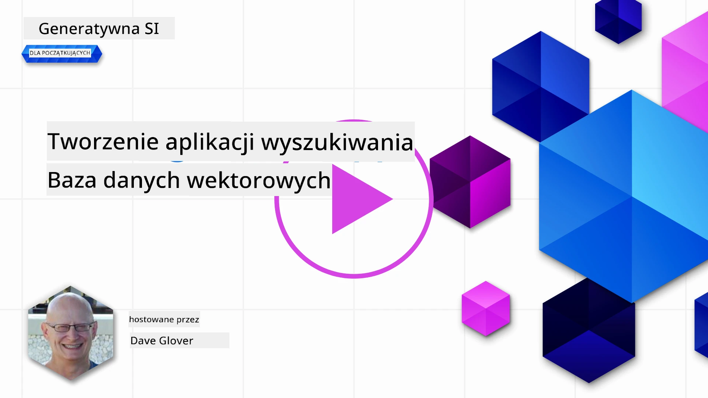
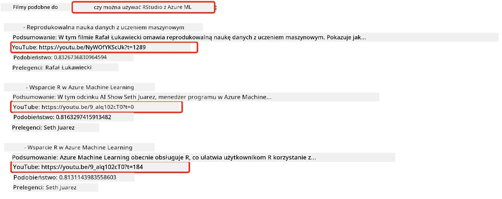
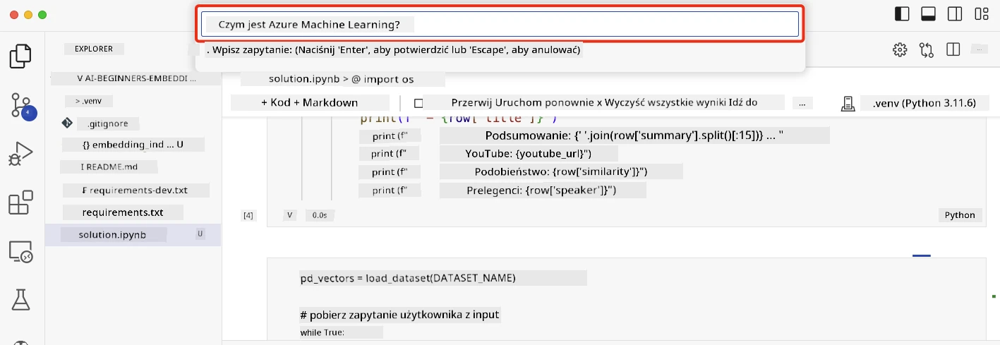

# Tworzenie aplikacji wyszukujących

[](https://youtu.be/W0-nzXjOjr0?si=GcsqiTTvd7RKbo7V)

> > _Kliknij obraz powyżej, aby obejrzeć film z tej lekcji_

Duże modele językowe to nie tylko chatboty i generowanie tekstu. Możliwe jest również tworzenie aplikacji wyszukujących przy użyciu Osadzeń (Embeddings). Osadzenia to numeryczne reprezentacje danych znane również jako wektory, które można wykorzystać do semantycznego wyszukiwania danych.

W tej lekcji zbudujesz aplikację wyszukującą dla naszego startupu edukacyjnego. Nasz startup to organizacja non-profit, która oferuje darmową edukację uczniom w krajach rozwijających się. Startup ma dużą liczbę filmów na YouTube, które uczniowie mogą wykorzystać do nauki o AI. Startup chce stworzyć aplikację wyszukującą, która pozwoli uczniom wyszukiwać filmy na YouTube, wpisując pytanie.

Na przykład student może wpisać „Czym są notatniki Jupyter?” lub „Co to jest Azure ML”, a aplikacja wyszukująca zwróci listę filmów na YouTube powiązanych z pytaniem, a co więcej, aplikacja wskaże miejsce w filmie, gdzie znajduje się odpowiedź na pytanie.

## Wprowadzenie

W tej lekcji omówimy:

- Wyszukiwanie semantyczne kontra wyszukiwanie po słowach kluczowych.
- Czym są Osadzenia tekstowe (Text Embeddings).
- Tworzenie indeksu Osadzeń tekstowych.
- Wyszukiwanie w indeksie Osadzeń tekstowych.

## Cele nauki

Po ukończeniu tej lekcji będziesz potrafił:

- Rozróżnić wyszukiwanie semantyczne od wyszukiwania po słowach kluczowych.
- Wyjaśnić, czym są Osadzenia tekstowe.
- Stworzyć aplikację korzystającą z Osadzeń do wyszukiwania danych.

## Dlaczego warto budować aplikację wyszukującą?

Tworzenie aplikacji wyszukującej pomoże Ci zrozumieć, jak korzystać z Osadzeń do wyszukiwania danych. Nauczysz się również, jak stworzyć aplikację, która umożliwi uczniom szybkie odnajdywanie informacji.

Lekcja zawiera indeks Osadzeń dla transkrypcji filmów na kanale YouTube Microsoft [AI Show](https://www.youtube.com/playlist?list=PLlrxD0HtieHi0mwteKBOfEeOYf0LJU4O1). AI Show to kanał na YouTube uczący o AI i uczeniu maszynowym. Indeks Osadzeń zawiera osadzenia dla każdej transkrypcji z filmów do października 2023. Użyjesz indeksu do zbudowania aplikacji wyszukującej dla naszego startupu. Aplikacja zwraca link do miejsca w filmie, gdzie znajduje się odpowiedź na pytanie. To świetny sposób, aby uczniowie szybko odnaleźli potrzebne informacje.

Poniżej znajduje się przykład zapytania semantycznego dla pytania „czy można używać rstudio z Azure ML?”. Sprawdź adres URL YouTube, zobaczysz, że zawiera on znacznik czasu przenoszący do miejsca w filmie, gdzie znajduje się odpowiedź na pytanie.



## Czym jest wyszukiwanie semantyczne?

Możesz się zastanawiać, czym jest wyszukiwanie semantyczne? Wyszukiwanie semantyczne to technika wyszukiwania oparta na semantyce, czyli znaczeniu słów w zapytaniu, aby zwrócić trafne wyniki.

Oto przykład wyszukiwania semantycznego. Powiedzmy, że chcesz kupić samochód i wpisujesz „mój wymarzony samochód”. Wyszukiwanie semantyczne rozumie, że nie „marzysz” o aucie, lecz szukasz „idealnego” samochodu do kupienia. Wyszukiwanie semantyczne rozumie Twoją intencję i zwraca właściwe wyniki. Alternatywą jest wyszukiwanie po słowach kluczowych, które dosłownie wyszukałoby marzenia o samochodach i często zwracałoby nierelatywne wyniki.

## Czym są Osadzenia tekstowe?

[Osadzenia tekstowe](https://en.wikipedia.org/wiki/Word_embedding?WT.mc_id=academic-105485-koreyst) to technika reprezentacji tekstu używana w [przetwarzaniu języka naturalnego](https://en.wikipedia.org/wiki/Natural_language_processing?WT.mc_id=academic-105485-koreyst). Osadzenia to semantyczne numeryczne reprezentacje tekstu. Osadzenia służą do przedstawiania danych w formie łatwej do zrozumienia dla maszyny. Istnieje wiele modeli do tworzenia osadzeń tekstowych, a w tej lekcji skupimy się na generowaniu osadzeń przy użyciu modelu OpenAI Embedding.

Oto przykład: wyobraź sobie, że poniższy tekst pochodzi z transkrypcji jednego z odcinków na kanale YouTube AI Show:

```text
Today we are going to learn about Azure Machine Learning.
```

Przekazujemy tekst do API OpenAI Embedding, które zwraca osadzenie składające się z 1536 liczb, czyli wektor. Każda liczba w wektorze reprezentuje inny aspekt tekstu. Dla zwięzłości pokazujemy pierwsze 10 liczb w wektorze.

```python
[-0.006655829958617687, 0.0026128944009542465, 0.008792596869170666, -0.02446001023054123, -0.008540431968867779, 0.022071078419685364, -0.010703742504119873, 0.003311325330287218, -0.011632772162556648, -0.02187200076878071, ...]
```

## Jak tworzony jest indeks Osadzeń?

Indeks Osadzeń dla tej lekcji został utworzony za pomocą serii skryptów w Pythonie. Znajdziesz je razem z instrukcjami w [README](./scripts/README.md?WT.mc_id=academic-105485-koreyst) w folderze `scripts` do tej lekcji. Nie musisz uruchamiać tych skryptów, aby ukończyć lekcję, ponieważ indeks Osadzeń jest już dla Ciebie dostępny.

Skrypty wykonują następujące operacje:

1. Pobierają transkrypcje każdego filmu z playlisty YouTube [AI Show](https://www.youtube.com/playlist?list=PLlrxD0HtieHi0mwteKBOfEeOYf0LJU4O1).
2. Za pomocą [OpenAI Functions](https://learn.microsoft.com/azure/ai-foundry/openai/how-to/function-calling?WT.mc_id=academic-105485-koreyst) próbują wyodrębnić nazwisko mówcy z pierwszych 3 minut transkrypcji YouTube. Nazwa mówcy dla każdego filmu jest zapisywana w indeksie Osadzeń `embedding_index_3m.json`.
3. Transkrypcja jest dzielona na **segmenty tekstowe o długości 3 minut**. Segment zawiera około 20 słów z nakładką z następnego segmentu, aby zapewnić ciągłość osadzenia segmentu i lepszy kontekst do wyszukiwania.
4. Każdy segment tekstowy jest przekazywany do OpenAI Chat API w celu streszczenia tekstu do 60 słów. Streszczenie jest również zapisywane w indeksie Osadzeń `embedding_index_3m.json`.
5. Na końcu segment tekstowy jest przekazywany do OpenAI Embedding API. API zwraca wektor 1536 liczb, które reprezentują semantyczne znaczenie segmentu. Segment razem z wektorem jest zapisywany w indeksie Osadzeń `embedding_index_3m.json`.

### Bazy danych wektorowych

Dla uproszczenia lekcji indeks Osadzeń przechowywany jest w pliku JSON o nazwie `embedding_index_3m.json` i ładowany do ramki danych Pandas. W produkcji indeks Osadzeń byłby przechowywany w bazie danych wektorowej, takiej jak [Azure Cognitive Search](https://learn.microsoft.com/training/modules/improve-search-results-vector-search?WT.mc_id=academic-105485-koreyst), [Redis](https://cookbook.openai.com/examples/vector_databases/redis/readme?WT.mc_id=academic-105485-koreyst), [Pinecone](https://cookbook.openai.com/examples/vector_databases/pinecone/readme?WT.mc_id=academic-105485-koreyst), [Weaviate](https://cookbook.openai.com/examples/vector_databases/weaviate/readme?WT.mc_id=academic-105485-koreyst), i inne.

## Zrozumienie podobieństwa kosinusowego

Poznaliśmy już osadzenia tekstowe, następnym krokiem jest nauka, jak użyć osadzeń do wyszukiwania danych i w szczególności, jak znaleźć najbardziej podobne osadzenia do danego zapytania, wykorzystując podobieństwo kosinusowe.

### Czym jest podobieństwo kosinusowe?

Podobieństwo kosinusowe to miara podobieństwa między dwoma wektorami, często nazywane „wyszukiwaniem najbliższego sąsiada”. Aby wykonać wyszukiwanie podobieństwa kosinusowego, musisz _wektoryzować_ tekst zapytania za pomocą OpenAI Embedding API. Następnie oblicz _podobieństwo kosinusowe_ między wektorem zapytania a każdym wektorem w indeksie Osadzeń. Pamiętaj, że indeks Osadzeń zawiera wektor dla każdego segmentu tekstu z transkrypcji YouTube. Na koniec posortuj wyniki według podobieństwa kosinusowego – segmenty o najwyższym podobieństwie są najbardziej zbliżone do zapytania.

Z matematycznego punktu widzenia podobieństwo kosinusowe mierzy cosinus kąta między dwoma wektorami rzutowanymi w przestrzeni wielowymiarowej. Ta miara jest przydatna, ponieważ jeśli dwa dokumenty są od siebie daleko w metryce Euklidesowej ze względu na rozmiar, mogą mieć mniejszy kąt i tym samym wyższe podobieństwo kosinusowe. Więcej informacji o wzorach na podobieństwo kosinusowe znajdziesz pod [Cosine similarity](https://en.wikipedia.org/wiki/Cosine_similarity?WT.mc_id=academic-105485-koreyst).

## Budowanie pierwszej aplikacji wyszukującej

Teraz nauczymy się, jak zbudować aplikację wyszukującą używając Osadzeń. Aplikacja pozwoli uczniom wyszukiwać filmy, wpisując pytanie. Aplikacja zwróci listę filmów powiązanych z pytaniem i link do miejsca w filmie, gdzie znajduje się odpowiedź.

To rozwiązanie zostało zbudowane i przetestowane na Windows 11, macOS oraz Ubuntu 22.04 przy użyciu Pythona 3.10 lub nowszego. Pythona można pobrać z [python.org](https://www.python.org/downloads/?WT.mc_id=academic-105485-koreyst).

## Zadanie - budowa aplikacji wyszukującej dla uczniów

Przedstawiliśmy nasz startup na początku lekcji. Teraz czas umożliwić uczniom budowę aplikacji wyszukującej do ich ocen.

W tym zadaniu utworzysz usługi Azure OpenAI, które będą używane do stworzenia aplikacji wyszukującej. Utworzysz następujące usługi Azure OpenAI. Aby wykonać zadanie, potrzebujesz subskrypcji Azure.

### Uruchom Azure Cloud Shell

1. Zaloguj się do [portalu Azure](https://portal.azure.com/?WT.mc_id=academic-105485-koreyst).
2. Wybierz ikonę Cloud Shell w prawym górnym rogu portalu Azure.
3. Wybierz **Bash** jako typ środowiska.

#### Utwórz grupę zasobów

> W tych instrukcjach korzystamy z grupy zasobów o nazwie "semantic-video-search" w regionie East US.
> Możesz zmienić nazwę grupy zasobów, lecz przy zmianie lokalizacji zasobów,
> sprawdź [tabelę dostępności modeli](https://aka.ms/oai/models?WT.mc_id=academic-105485-koreyst).

```shell
az group create --name semantic-video-search --location eastus
```

#### Utwórz zasób Azure OpenAI Service

W Azure Cloud Shell wykonaj następujące polecenie, aby utworzyć zasób Azure OpenAI Service.

```shell
az cognitiveservices account create --name semantic-video-openai --resource-group semantic-video-search \
    --location eastus --kind OpenAI --sku s0
```

#### Pobierz punkt końcowy i klucze do użycia w aplikacji

W Azure Cloud Shell wykonaj następujące polecenia, aby pobrać adres punktu końcowego i klucze dla zasobu Azure OpenAI Service.

```shell
az cognitiveservices account show --name semantic-video-openai \
   --resource-group  semantic-video-search | jq -r .properties.endpoint
az cognitiveservices account keys list --name semantic-video-openai \
   --resource-group semantic-video-search | jq -r .key1
```

#### Wdróż model OpenAI Embedding

W Azure Cloud Shell wykonaj następujące polecenie, aby wdrożyć model OpenAI Embedding.

```shell
az cognitiveservices account deployment create \
    --name semantic-video-openai \
    --resource-group  semantic-video-search \
    --deployment-name text-embedding-ada-002 \
    --model-name text-embedding-ada-002 \
    --model-version "2"  \
    --model-format OpenAI \
    --sku-capacity 100 --sku-name "Standard"
```

## Rozwiązanie

Otwórz [notatnik rozwiązania](./python/aoai-solution.ipynb?WT.mc_id=academic-105485-koreyst) w GitHub Codespaces i postępuj zgodnie z instrukcjami w Jupyter Notebook.

Podczas uruchamiania notatnika pojawi się pole do wpisania zapytania. Pole będzie wyglądać tak:



## Świetna robota! Kontynuuj naukę

Po ukończeniu lekcji zapoznaj się z naszą [kolekcją nauki o generatywnej AI](https://aka.ms/genai-collection?WT.mc_id=academic-105485-koreyst), aby dalej rozwijać swoją wiedzę o Generatywnej AI!

Przejdź do Lekcji 9, gdzie pokażemy, jak [tworzyć aplikacje do generowania obrazów](../09-building-image-applications/README.md?WT.mc_id=academic-105485-koreyst)!

---

<!-- CO-OP TRANSLATOR DISCLAIMER START -->
**Zastrzeżenie**:
Niniejszy dokument został przetłumaczony za pomocą usługi tłumaczenia AI [Co-op Translator](https://github.com/Azure/co-op-translator). Choć dążymy do dokładności, prosimy pamiętać, że automatyczne tłumaczenia mogą zawierać błędy lub niedokładności. Oryginalny dokument w jego języku źródłowym należy uznawać za autorytatywne źródło. W przypadku informacji krytycznych zalecane jest skorzystanie z profesjonalnego tłumaczenia wykonanego przez człowieka. Nie ponosimy odpowiedzialności za jakiekolwiek nieporozumienia lub błędne interpretacje wynikające z użycia tego tłumaczenia.
<!-- CO-OP TRANSLATOR DISCLAIMER END -->