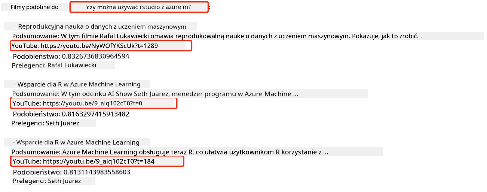
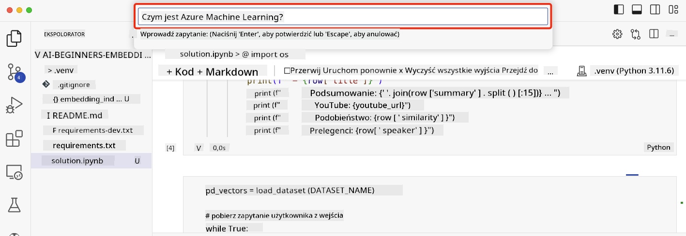

<!--
CO_OP_TRANSLATOR_METADATA:
{
  "original_hash": "d46aad0917a1a342d613e2c13d457da5",
  "translation_date": "2025-07-09T12:54:20+00:00",
  "source_file": "08-building-search-applications/README.md",
  "language_code": "pl"
}
-->
# Tworzenie aplikacji wyszukiwawczej

[](https://aka.ms/gen-ai-lesson8-gh?WT.mc_id=academic-105485-koreyst)

> > _Kliknij powyższy obraz, aby obejrzeć wideo z tej lekcji_

LLM to nie tylko chatboty i generowanie tekstu. Można także tworzyć aplikacje wyszukiwawcze wykorzystujące Embeddings. Embeddings to numeryczne reprezentacje danych, zwane również wektorami, które można wykorzystać do semantycznego wyszukiwania informacji.

W tej lekcji zbudujesz aplikację wyszukiwawczą dla naszego startupu edukacyjnego. Nasz startup to organizacja non-profit, która oferuje darmową edukację uczniom w krajach rozwijających się. Posiadamy dużą liczbę filmów na YouTube, które uczniowie mogą wykorzystać do nauki o AI. Startup chce stworzyć aplikację wyszukiwawczą, która pozwoli uczniom wyszukiwać filmy na YouTube, wpisując pytanie.

Na przykład, uczeń może wpisać „Czym są Jupyter Notebooks?” lub „Co to jest Azure ML”, a aplikacja wyszukiwawcza zwróci listę filmów na YouTube związanych z pytaniem, a co więcej, aplikacja poda link do miejsca w filmie, gdzie znajduje się odpowiedź na pytanie.

## Wprowadzenie

W tej lekcji omówimy:

- Wyszukiwanie semantyczne vs wyszukiwanie po słowach kluczowych.
- Czym są Text Embeddings.
- Tworzenie indeksu Text Embeddings.
- Wyszukiwanie w indeksie Text Embeddings.

## Cele nauki

Po ukończeniu tej lekcji będziesz potrafił:

- Rozróżnić wyszukiwanie semantyczne od wyszukiwania po słowach kluczowych.
- Wyjaśnić, czym są Text Embeddings.
- Stworzyć aplikację wykorzystującą Embeddings do wyszukiwania danych.

## Dlaczego warto stworzyć aplikację wyszukiwawczą?

Stworzenie aplikacji wyszukiwawczej pomoże Ci zrozumieć, jak używać Embeddings do wyszukiwania danych. Nauczysz się także, jak zbudować aplikację, która pozwoli uczniom szybko znaleźć potrzebne informacje.

Lekcja zawiera indeks Embeddings dla transkrypcji filmów z kanału Microsoft [AI Show](https://www.youtube.com/playlist?list=PLlrxD0HtieHi0mwteKBOfEeOYf0LJU4O1) na YouTube. AI Show to kanał uczący o AI i uczeniu maszynowym. Indeks Embeddings zawiera Embeddings dla każdej transkrypcji filmów do października 2023. Wykorzystasz ten indeks do stworzenia aplikacji wyszukiwawczej dla naszego startupu. Aplikacja zwraca link do miejsca w filmie, gdzie znajduje się odpowiedź na pytanie. To świetny sposób, aby uczniowie szybko znaleźli potrzebne informacje.

Poniżej przykład zapytania semantycznego dla pytania „czy można używać rstudio z azure ml?”. Spójrz na adres URL YouTube, zobaczysz, że zawiera on znacznik czasu, który przenosi do miejsca w filmie z odpowiedzią na pytanie.



## Czym jest wyszukiwanie semantyczne?

Możesz się zastanawiać, czym jest wyszukiwanie semantyczne? To technika wyszukiwania, która wykorzystuje semantykę, czyli znaczenie słów w zapytaniu, aby zwrócić trafne wyniki.

Oto przykład wyszukiwania semantycznego. Załóżmy, że szukasz samochodu i wpisujesz „mój wymarzony samochód”. Wyszukiwanie semantyczne rozumie, że nie śnisz o samochodzie, ale szukasz swojego „idealnego” auta. Wyszukiwanie semantyczne rozpoznaje Twoją intencję i zwraca odpowiednie wyniki. Alternatywą jest wyszukiwanie po słowach kluczowych, które dosłownie szukałoby snów o samochodach i często zwracałoby nieistotne wyniki.

## Czym są Text Embeddings?

[Text embeddings](https://en.wikipedia.org/wiki/Word_embedding?WT.mc_id=academic-105485-koreyst) to technika reprezentacji tekstu stosowana w [przetwarzaniu języka naturalnego](https://en.wikipedia.org/wiki/Natural_language_processing?WT.mc_id=academic-105485-koreyst). Text embeddings to semantyczne, numeryczne reprezentacje tekstu. Embeddings służą do przedstawiania danych w sposób zrozumiały dla maszyn. Istnieje wiele modeli do tworzenia text embeddings, w tej lekcji skupimy się na generowaniu embeddings za pomocą modelu OpenAI Embedding.

Oto przykład: wyobraź sobie, że poniższy tekst pochodzi z transkrypcji jednego z odcinków kanału AI Show na YouTube:

```text
Today we are going to learn about Azure Machine Learning.
```

Przekazujemy tekst do OpenAI Embedding API, które zwraca embedding składający się z 1536 liczb, czyli wektor. Każda liczba w wektorze reprezentuje inny aspekt tekstu. Dla zwięzłości, oto pierwsze 10 liczb wektora.

```python
[-0.006655829958617687, 0.0026128944009542465, 0.008792596869170666, -0.02446001023054123, -0.008540431968867779, 0.022071078419685364, -0.010703742504119873, 0.003311325330287218, -0.011632772162556648, -0.02187200076878071, ...]
```

## Jak tworzony jest indeks Embeddings?

Indeks Embeddings do tej lekcji został stworzony za pomocą serii skryptów w Pythonie. Skrypty wraz z instrukcjami znajdziesz w pliku [README](./scripts/README.md?WT.mc_id=academic-105485-koreyst) w folderze `scripts` tej lekcji. Nie musisz uruchamiać tych skryptów, aby ukończyć lekcję, ponieważ indeks Embeddings jest już dla Ciebie przygotowany.

Skrypty wykonują następujące operacje:

1. Pobierają transkrypcję każdego filmu z playlisty [AI Show](https://www.youtube.com/playlist?list=PLlrxD0HtieHi0mwteKBOfEeOYf0LJU4O1).
2. Za pomocą [OpenAI Functions](https://learn.microsoft.com/azure/ai-services/openai/how-to/function-calling?WT.mc_id=academic-105485-koreyst) próbują wyodrębnić nazwę prelegenta z pierwszych 3 minut transkrypcji. Nazwa prelegenta dla każdego filmu jest zapisywana w indeksie Embeddings o nazwie `embedding_index_3m.json`.
3. Tekst transkrypcji jest dzielony na **segmenty tekstowe o długości 3 minut**. Segmenty nakładają się na siebie około 20 słowami, aby embedding segmentu nie był ucięty i zapewnić lepszy kontekst wyszukiwania.
4. Każdy segment tekstu jest przekazywany do OpenAI Chat API, które tworzy streszczenie w 60 słowach. Streszczenie jest również zapisywane w indeksie Embeddings `embedding_index_3m.json`.
5. Na koniec segment tekstu jest przekazywany do OpenAI Embedding API. API zwraca wektor 1536 liczb reprezentujący semantyczne znaczenie segmentu. Segment wraz z wektorem jest zapisywany w indeksie Embeddings `embedding_index_3m.json`.

### Bazy danych wektorów

Dla uproszczenia lekcji indeks Embeddings jest przechowywany w pliku JSON o nazwie `embedding_index_3m.json` i ładowany do Pandas DataFrame. Jednak w środowisku produkcyjnym indeks Embeddings byłby przechowywany w bazie danych wektorów, takiej jak [Azure Cognitive Search](https://learn.microsoft.com/training/modules/improve-search-results-vector-search?WT.mc_id=academic-105485-koreyst), [Redis](https://cookbook.openai.com/examples/vector_databases/redis/readme?WT.mc_id=academic-105485-koreyst), [Pinecone](https://cookbook.openai.com/examples/vector_databases/pinecone/readme?WT.mc_id=academic-105485-koreyst), [Weaviate](https://cookbook.openai.com/examples/vector_databases/weaviate/readme?WT.mc_id=academic-105485-koreyst) i inne.

## Zrozumienie podobieństwa kosinusowego

Poznaliśmy text embeddings, teraz nauczymy się, jak używać embeddings do wyszukiwania danych, a w szczególności jak znaleźć najbardziej podobne embeddings do zadanego zapytania, korzystając z podobieństwa kosinusowego.

### Czym jest podobieństwo kosinusowe?

Podobieństwo kosinusowe to miara podobieństwa między dwoma wektorami, nazywana też `wyszukiwaniem najbliższego sąsiada`. Aby wykonać wyszukiwanie oparte na podobieństwie kosinusowym, musisz _zwektoryzować_ tekst zapytania za pomocą OpenAI Embedding API. Następnie obliczasz _podobieństwo kosinusowe_ między wektorem zapytania a każdym wektorem w indeksie Embeddings. Pamiętaj, że indeks Embeddings zawiera wektor dla każdego segmentu tekstu transkrypcji z YouTube. Na koniec sortujesz wyniki według podobieństwa kosinusowego, a segmenty tekstu o najwyższym podobieństwie są najbardziej zbliżone do zapytania.

Z matematycznego punktu widzenia, podobieństwo kosinusowe mierzy cosinus kąta między dwoma wektorami rzutowanymi w przestrzeni wielowymiarowej. Ta miara jest przydatna, ponieważ dwa dokumenty mogą być daleko od siebie w przestrzeni euklidesowej ze względu na rozmiar, ale mieć mniejszy kąt między sobą, a więc wyższe podobieństwo kosinusowe. Więcej informacji o wzorach na podobieństwo kosinusowe znajdziesz na stronie [Cosine similarity](https://en.wikipedia.org/wiki/Cosine_similarity?WT.mc_id=academic-105485-koreyst).

## Tworzenie pierwszej aplikacji wyszukiwawczej

Następnie nauczymy się, jak zbudować aplikację wyszukiwawczą wykorzystującą Embeddings. Aplikacja pozwoli uczniom wyszukiwać filmy, wpisując pytanie. Aplikacja zwróci listę filmów powiązanych z pytaniem oraz link do miejsca w filmie, gdzie znajduje się odpowiedź.

To rozwiązanie zostało zbudowane i przetestowane na Windows 11, macOS oraz Ubuntu 22.04 z użyciem Pythona 3.10 lub nowszego. Pythona możesz pobrać z [python.org](https://www.python.org/downloads/?WT.mc_id=academic-105485-koreyst).

## Zadanie – budowa aplikacji wyszukiwawczej dla uczniów

Na początku lekcji przedstawiliśmy nasz startup. Teraz czas umożliwić uczniom stworzenie aplikacji wyszukiwawczej na potrzeby ich ocen.

W tym zadaniu utworzysz usługi Azure OpenAI, które będą używane do budowy aplikacji wyszukiwawczej. Utworzysz następujące usługi Azure OpenAI. Do wykonania zadania potrzebujesz subskrypcji Azure.

### Uruchom Azure Cloud Shell

1. Zaloguj się do [portalu Azure](https://portal.azure.com/?WT.mc_id=academic-105485-koreyst).
2. Wybierz ikonę Cloud Shell w prawym górnym rogu portalu Azure.
3. Wybierz **Bash** jako typ środowiska.

#### Utwórz grupę zasobów

> W tych instrukcjach używamy grupy zasobów o nazwie „semantic-video-search” w regionie East US.
> Możesz zmienić nazwę grupy zasobów, ale przy zmianie lokalizacji zasobów
> sprawdź [tabelę dostępności modeli](https://aka.ms/oai/models?WT.mc_id=academic-105485-koreyst).

```shell
az group create --name semantic-video-search --location eastus
```

#### Utwórz zasób Azure OpenAI Service

W Azure Cloud Shell uruchom następujące polecenie, aby utworzyć zasób Azure OpenAI Service.

```shell
az cognitiveservices account create --name semantic-video-openai --resource-group semantic-video-search \
    --location eastus --kind OpenAI --sku s0
```

#### Pobierz punkt końcowy i klucze do użycia w aplikacji

W Azure Cloud Shell uruchom poniższe polecenia, aby pobrać punkt końcowy i klucze dla zasobu Azure OpenAI Service.

```shell
az cognitiveservices account show --name semantic-video-openai \
   --resource-group  semantic-video-search | jq -r .properties.endpoint
az cognitiveservices account keys list --name semantic-video-openai \
   --resource-group semantic-video-search | jq -r .key1
```

#### Wdróż model OpenAI Embedding

W Azure Cloud Shell uruchom poniższe polecenie, aby wdrożyć model OpenAI Embedding.

```shell
az cognitiveservices account deployment create \
    --name semantic-video-openai \
    --resource-group  semantic-video-search \
    --deployment-name text-embedding-ada-002 \
    --model-name text-embedding-ada-002 \
    --model-version "2"  \
    --model-format OpenAI \
    --sku-capacity 100 --sku-name "Standard"
```

## Rozwiązanie

Otwórz [notatnik z rozwiązaniem](../../../08-building-search-applications/python/aoai-solution.ipynb) w GitHub Codespaces i postępuj zgodnie z instrukcjami w Jupyter Notebook.

Po uruchomieniu notatnika zostaniesz poproszony o wpisanie zapytania. Pole wejściowe będzie wyglądać tak:



## Świetna robota! Kontynuuj naukę

Po ukończeniu tej lekcji sprawdź naszą [kolekcję materiałów do nauki Generative AI](https://aka.ms/genai-collection?WT.mc_id=academic-105485-koreyst), aby dalej rozwijać swoją wiedzę o Generative AI!

Przejdź do Lekcji 9, gdzie pokażemy, jak [tworzyć aplikacje do generowania obrazów](../09-building-image-applications/README.md?WT.mc_id=academic-105485-koreyst)!

**Zastrzeżenie**:  
Niniejszy dokument został przetłumaczony za pomocą usługi tłumaczenia AI [Co-op Translator](https://github.com/Azure/co-op-translator). Mimo że dążymy do jak największej dokładności, prosimy mieć na uwadze, że tłumaczenia automatyczne mogą zawierać błędy lub nieścisłości. Oryginalny dokument w języku źródłowym powinien być uznawany za źródło autorytatywne. W przypadku informacji o kluczowym znaczeniu zalecane jest skorzystanie z profesjonalnego tłumaczenia wykonanego przez człowieka. Nie ponosimy odpowiedzialności za jakiekolwiek nieporozumienia lub błędne interpretacje wynikające z korzystania z tego tłumaczenia.