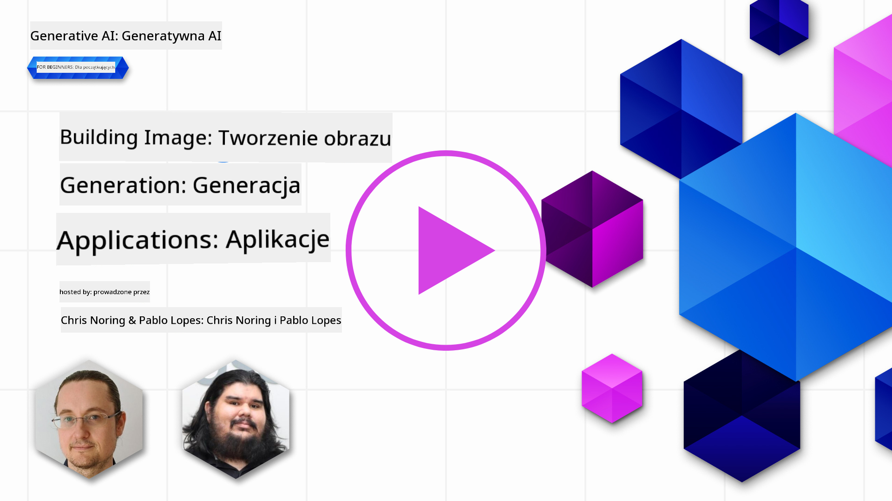

<!--
CO_OP_TRANSLATOR_METADATA:
{
  "original_hash": "7a655f30d1dcbdfe6eff2558eff249af",
  "translation_date": "2025-06-25T17:19:25+00:00",
  "source_file": "09-building-image-applications/README.md",
  "language_code": "pl"
}
-->
# Tworzenie Aplikacji do Generowania Obrazów

[](https://aka.ms/gen-ai-lesson9-gh?WT.mc_id=academic-105485-koreyst)

Generowanie tekstu to nie jedyna możliwość LLM. Możliwe jest także generowanie obrazów na podstawie opisów tekstowych. Obrazy jako modalność mogą być niezwykle przydatne w wielu dziedzinach, od MedTech, architektury, turystyki, po rozwój gier i więcej. W tym rozdziale przyjrzymy się dwóm najpopularniejszym modelom generowania obrazów, DALL-E i Midjourney.

## Wprowadzenie

W tej lekcji omówimy:

- Generowanie obrazów i dlaczego jest przydatne.
- DALL-E i Midjourney, czym są i jak działają.
- Jak zbudować aplikację do generowania obrazów.

## Cele nauki

Po ukończeniu tej lekcji będziesz w stanie:

- Zbudować aplikację do generowania obrazów.
- Zdefiniować granice dla swojej aplikacji za pomocą metapromptów.
- Pracować z DALL-E i Midjourney.

## Dlaczego warto budować aplikację do generowania obrazów?

Aplikacje do generowania obrazów to świetny sposób na eksplorację możliwości Sztucznej Inteligencji Generatywnej. Mogą być używane na przykład do:

- **Edycji i syntezy obrazów**. Możesz generować obrazy do różnych zastosowań, takich jak edycja obrazów i synteza obrazów.

- **Zastosowania w różnych branżach**. Mogą być także używane do generowania obrazów dla różnych branż, takich jak MedTech, turystyka, rozwój gier i więcej.

## Scenariusz: Edu4All

W ramach tej lekcji będziemy kontynuować pracę z naszą startupem, Edu4All. Studenci będą tworzyć obrazy do swoich ocen, dokładnie jakie obrazy, to zależy od nich, ale mogą to być ilustracje do własnej bajki, stworzenie nowej postaci do swojej historii lub pomoc w wizualizacji pomysłów i koncepcji.

Oto co na przykład mogliby wygenerować studenci Edu4All, pracując na zajęciach nad zabytkami:


używając promptu takiego jak

> "Pies obok Wieży Eiffla w porannym świetle słońca"

## Czym są DALL-E i Midjourney?

[DALL-E](https://openai.com/dall-e-2?WT.mc_id=academic-105485-koreyst) i [Midjourney](https://www.midjourney.com/?WT.mc_id=academic-105485-koreyst) to dwa z najpopularniejszych modeli generowania obrazów, które pozwalają na użycie promptów do generowania obrazów.

### DALL-E

Zacznijmy od DALL-E, który jest modelem Sztucznej Inteligencji Generatywnej generującym obrazy z opisów tekstowych.

> [DALL-E to połączenie dwóch modeli, CLIP i rozproszonej uwagi](https://towardsdatascience.com/openais-dall-e-and-clip-101-a-brief-introduction-3a4367280d4e?WT.mc_id=academic-105485-koreyst).

- **CLIP**, to model, który generuje osadzenia, czyli numeryczne reprezentacje danych, z obrazów i tekstu.

- **Rozproszona uwaga**, to model, który generuje obrazy z osadzeń. DALL-E jest trenowany na zbiorze danych obrazów i tekstów i może być używany do generowania obrazów z opisów tekstowych. Na przykład, DALL-E może być używany do generowania obrazów kota w kapeluszu lub psa z irokezem.

### Midjourney

Midjourney działa w podobny sposób do DALL-E, generuje obrazy z promptów tekstowych. Midjourney może być również używany do generowania obrazów za pomocą promptów takich jak „kot w kapeluszu” lub „pies z irokezem”.


_Źródło obrazu Wikipedia, obraz wygenerowany przez Midjourney_

## Jak działają DALL-E i Midjourney

Najpierw, [DALL-E](https://arxiv.org/pdf/2102.12092.pdf?WT.mc_id=academic-105485-koreyst). DALL-E to model Sztucznej Inteligencji Generatywnej oparty na architekturze transformera z _autoregresyjnym transformatorem_.

_Autoregresyjny transformer_ definiuje, jak model generuje obrazy z opisów tekstowych, generuje jeden piksel na raz, a następnie używa wygenerowanych pikseli do generowania kolejnego piksela. Przechodzi przez wiele warstw w sieci neuronowej, aż obraz jest kompletny.

Dzięki temu procesowi DALL-E kontroluje atrybuty, obiekty, cechy i więcej w generowanym obrazie. Jednak DALL-E 2 i 3 mają większą kontrolę nad generowanym obrazem.

## Tworzenie swojej pierwszej aplikacji do generowania obrazów

Co jest potrzebne, aby zbudować aplikację do generowania obrazów? Potrzebujesz następujących bibliotek:

- **python-dotenv**, zaleca się użycie tej biblioteki do przechowywania swoich sekretów w pliku _.env_ z dala od kodu.
- **openai**, ta biblioteka jest tym, czego użyjesz do interakcji z API OpenAI.
- **pillow**, do pracy z obrazami w Pythonie.
- **requests**, aby pomóc w wykonywaniu żądań HTTP.

1. Utwórz plik _.env_ z następującą zawartością:

   ```text
   AZURE_OPENAI_ENDPOINT=<your endpoint>
   AZURE_OPENAI_API_KEY=<your key>
   ```

   Znajdź te informacje w Azure Portal dla swojego zasobu w sekcji "Keys and Endpoint".

1. Zbierz powyższe biblioteki w pliku o nazwie _requirements.txt_ w następujący sposób:

   ```text
   python-dotenv
   openai
   pillow
   requests
   ```

1. Następnie, utwórz wirtualne środowisko i zainstaluj biblioteki:

   ```bash
   python3 -m venv venv
   source venv/bin/activate
   pip install -r requirements.txt
   ```

   Dla Windows, użyj następujących poleceń, aby utworzyć i aktywować swoje wirtualne środowisko:

   ```bash
   python3 -m venv venv
   venv\Scripts\activate.bat
   ```

1. Dodaj następujący kod do pliku o nazwie _app.py_:

   ```python
   import openai
   import os
   import requests
   from PIL import Image
   import dotenv

   # import dotenv
   dotenv.load_dotenv()

   # Get endpoint and key from environment variables
   openai.api_base = os.environ['AZURE_OPENAI_ENDPOINT']
   openai.api_key = os.environ['AZURE_OPENAI_API_KEY']

   # Assign the API version (DALL-E is currently supported for the 2023-06-01-preview API version only)
   openai.api_version = '2023-06-01-preview'
   openai.api_type = 'azure'


   try:
       # Create an image by using the image generation API
       generation_response = openai.Image.create(
           prompt='Bunny on horse, holding a lollipop, on a foggy meadow where it grows daffodils',    # Enter your prompt text here
           size='1024x1024',
           n=2,
           temperature=0,
       )
       # Set the directory for the stored image
       image_dir = os.path.join(os.curdir, 'images')

       # If the directory doesn't exist, create it
       if not os.path.isdir(image_dir):
           os.mkdir(image_dir)

       # Initialize the image path (note the filetype should be png)
       image_path = os.path.join(image_dir, 'generated-image.png')

       # Retrieve the generated image
       image_url = generation_response["data"][0]["url"]  # extract image URL from response
       generated_image = requests.get(image_url).content  # download the image
       with open(image_path, "wb") as image_file:
           image_file.write(generated_image)

       # Display the image in the default image viewer
       image = Image.open(image_path)
       image.show()

   # catch exceptions
   except openai.InvalidRequestError as err:
       print(err)

   ```

Wyjaśnijmy ten kod:

- Najpierw importujemy potrzebne biblioteki, w tym bibliotekę OpenAI, bibliotekę dotenv, bibliotekę requests i bibliotekę Pillow.

  ```python
  import openai
  import os
  import requests
  from PIL import Image
  import dotenv
  ```

- Następnie ładujemy zmienne środowiskowe z pliku _.env_.

  ```python
  # import dotenv
  dotenv.load_dotenv()
  ```

- Po tym ustawiamy endpoint, klucz dla API OpenAI, wersję i typ.

  ```python
  # Get endpoint and key from environment variables
  openai.api_base = os.environ['AZURE_OPENAI_ENDPOINT']
  openai.api_key = os.environ['AZURE_OPENAI_API_KEY']

  # add version and type, Azure specific
  openai.api_version = '2023-06-01-preview'
  openai.api_type = 'azure'
  ```

- Następnie generujemy obraz:

  ```python
  # Create an image by using the image generation API
  generation_response = openai.Image.create(
      prompt='Bunny on horse, holding a lollipop, on a foggy meadow where it grows daffodils',    # Enter your prompt text here
      size='1024x1024',
      n=2,
      temperature=0,
  )
  ```

  Powyższy kod odpowiada obiektem JSON, który zawiera URL wygenerowanego obrazu. Możemy użyć URL do pobrania obrazu i zapisania go w pliku.

- Na koniec otwieramy obraz i używamy standardowego przeglądarki obrazów do jego wyświetlenia:

  ```python
  image = Image.open(image_path)
  image.show()
  ```

### Więcej szczegółów na temat generowania obrazu

Przyjrzyjmy się kodowi, który generuje obraz w większych szczegółach:

```python
generation_response = openai.Image.create(
        prompt='Bunny on horse, holding a lollipop, on a foggy meadow where it grows daffodils',    # Enter your prompt text here
        size='1024x1024',
        n=2,
        temperature=0,
    )
```

- **prompt**, to tekstowy prompt, który jest używany do generowania obrazu. W tym przypadku używamy promptu "Królik na koniu, trzymający lizaka, na mglistym łące, gdzie rosną żonkile".
- **size**, to rozmiar generowanego obrazu. W tym przypadku generujemy obraz o rozmiarze 1024x1024 pikseli.
- **n**, to liczba generowanych obrazów. W tym przypadku generujemy dwa obrazy.
- **temperature**, to parametr kontrolujący losowość wyjścia modelu Sztucznej Inteligencji Generatywnej. Temperatura to wartość pomiędzy 0 a 1, gdzie 0 oznacza, że wyjście jest deterministyczne, a 1 oznacza, że wyjście jest losowe. Domyślna wartość to 0,7.

Jest więcej rzeczy, które możesz zrobić z obrazami, które omówimy w następnej sekcji.

## Dodatkowe możliwości generowania obrazów

Jak dotąd widziałeś, jak udało nam się wygenerować obraz za pomocą kilku linii w Pythonie. Jednak jest więcej rzeczy, które możesz zrobić z obrazami.

Możesz także zrobić następujące rzeczy:

- **Wykonywać edycje**. Dostarczając istniejący obraz, maskę i prompt, możesz zmieniać obraz. Na przykład możesz dodać coś do części obrazu. Wyobraź sobie nasz obraz królika, możesz dodać kapelusz na królika. Jak to zrobisz, to dostarczając obraz, maskę (identyfikującą część obszaru do zmiany) i tekstowy prompt mówiący, co powinno być zrobione.

  ```python
  response = openai.Image.create_edit(
    image=open("base_image.png", "rb"),
    mask=open("mask.png", "rb"),
    prompt="An image of a rabbit with a hat on its head.",
    n=1,
    size="1024x1024"
  )
  image_url = response['data'][0]['url']
  ```

  Podstawowy obraz zawierałby tylko królika, ale ostateczny obraz miałby kapelusz na króliku.

- **Tworzyć wariacje**. Pomysł polega na tym, że bierzesz istniejący obraz i prosisz o stworzenie wariacji. Aby stworzyć wariację, dostarczasz obraz i tekstowy prompt oraz kod w ten sposób:

  ```python
  response = openai.Image.create_variation(
    image=open("bunny-lollipop.png", "rb"),
    n=1,
    size="1024x1024"
  )
  image_url = response['data'][0]['url']
  ```

  > Uwaga, to jest obsługiwane tylko w OpenAI

## Temperatura

Temperatura to parametr kontrolujący losowość wyjścia modelu Sztucznej Inteligencji Generatywnej. Temperatura to wartość pomiędzy 0 a 1, gdzie 0 oznacza, że wyjście jest deterministyczne, a 1 oznacza, że wyjście jest losowe. Domyślna wartość to 0,7.

Przyjrzyjmy się przykładzie, jak działa temperatura, uruchamiając ten prompt dwa razy:

> Prompt : "Królik na koniu, trzymający lizaka, na mglistym łące, gdzie rosną żonkile"


Teraz uruchommy ten sam prompt, aby zobaczyć, że nie otrzymamy dwa razy tego samego obrazu:


Jak widać, obrazy są podobne, ale nie takie same. Spróbujmy zmienić wartość temperatury na 0,1 i zobaczmy, co się stanie:

```python
 generation_response = openai.Image.create(
        prompt='Bunny on horse, holding a lollipop, on a foggy meadow where it grows daffodils',    # Enter your prompt text here
        size='1024x1024',
        n=2
    )
```

### Zmiana temperatury

Spróbujmy więc uczynić odpowiedź bardziej deterministyczną. Możemy zauważyć, że na pierwszym obrazie jest królik, a na drugim obrazie jest koń, więc obrazy różnią się znacznie.

Zmieńmy więc nasz kod i ustawmy temperaturę na 0, w ten sposób:

```python
generation_response = openai.Image.create(
        prompt='Bunny on horse, holding a lollipop, on a foggy meadow where it grows daffodils',    # Enter your prompt text here
        size='1024x1024',
        n=2,
        temperature=0
    )
```

Teraz, gdy uruchomisz ten kod, otrzymasz te dwa obrazy:

- 
- 

Tutaj wyraźnie widać, jak obrazy bardziej się do siebie upodabniają.

## Jak zdefiniować granice dla swojej aplikacji za pomocą metapromptów

Dzięki naszemu demo możemy już generować obrazy dla naszych klientów. Jednak musimy stworzyć pewne granice dla naszej aplikacji.

Na przykład, nie chcemy generować obrazów, które nie są odpowiednie do pracy lub które nie są odpowiednie dla dzieci.

Możemy to zrobić za pomocą _metapromptów_. Metaprompty to tekstowe prompty, które są używane do kontrolowania wyjścia modelu Sztucznej Inteligencji Generatywnej. Na przykład, możemy użyć metapromptów, aby kontrolować wyjście i zapewnić, że generowane obrazy są odpowiednie do pracy lub odpowiednie dla dzieci.

### Jak to działa?

Jak więc działają metaprompty?

Metaprompty to tekstowe prompty, które są używane do kontrolowania wyjścia modelu Sztucznej Inteligencji Generatywnej, są one umieszczane przed tekstowym promptem i są używane do kontrolowania wyjścia modelu oraz osadzane w aplikacjach, aby kontrolować wyjście modelu. Kapsułkują one wejście promptu i wejście metapromptu w jednym tekstowym promptcie.

Przykładem metapromptu może być następujący:

```text
You are an assistant designer that creates images for children.

The image needs to be safe for work and appropriate for children.

The image needs to be in color.

The image needs to be in landscape orientation.

The image needs to be in a 16:9 aspect ratio.

Do not consider any input from the following that is not safe for work or appropriate for children.

(Input)

```

Teraz zobaczmy, jak możemy użyć metapromptów w naszym demo.

```python
disallow_list = "swords, violence, blood, gore, nudity, sexual content, adult content, adult themes, adult language, adult humor, adult jokes, adult situations, adult"

meta_prompt =f"""You are an assistant designer that creates images for children.

The image needs to be safe for work and appropriate for children.

The image needs to be in color.

The image needs to be in landscape orientation.

The image needs to be in a 16:9 aspect ratio.

Do not consider any input from the following that is not safe for work or appropriate for children.
{disallow_list}
"""

prompt = f"{meta_prompt}
Create an image of a bunny on a horse, holding a lollipop"

# TODO add request to generate image
```

Z powyższego promptu możesz zobaczyć, jak wszystkie tworzone obrazy uwzględniają metaprompt.

## Zadanie - umożliwmy uczniom działanie

Na początku tej lekcji przedstawiliśmy Edu4All. Teraz nadszedł czas, aby umożliwić uczniom generowanie obrazów do ich ocen.

Studenci stworzą obrazy do swoich ocen zawierające zabytki, dokładnie jakie zabytki, to zależy od nich. Studenci są proszeni o użycie swojej kreatywności w tym zadaniu, aby umieścić te zabytki w różnych kontekstach.

## Rozwiązanie

Oto jedno z możliwych rozwiązań:

```python
import openai
import os
import requests
from PIL import Image
import dotenv

# import dotenv
dotenv.load_dotenv()

# Get endpoint and key from environment variables
openai.api_base = "<replace with endpoint>"
openai.api_key = "<replace with api key>"

# Assign the API version (DALL-E is currently supported for the 2023-06-01-preview API version only)
openai.api_version = '2023-06-01-preview'
openai.api_type = 'azure'

disallow_list = "swords, violence, blood, gore, nudity, sexual content, adult content, adult themes, adult language, adult humor, adult jokes, adult situations, adult"

meta_prompt = f"""You are an assistant designer that creates images for children.

The image needs to be safe for work and appropriate for children.

The image needs to be in color.

The image needs to be in landscape orientation.

The image needs to be in a 16:9 aspect ratio.

Do not consider any input from the following that is not safe for work or appropriate for children.
{disallow_list}"""

prompt = f"""{metaprompt}
Generate monument of the Arc of Triumph in Paris, France, in the evening light with a small child holding a Teddy looks on.
""""

try:
    # Create an image by using the image generation API
    generation_response = openai.Image.create(
        prompt=prompt,    # Enter your prompt text here
        size='1024x1024',
        n=2,
        temperature=0,
    )
    # Set the directory for the stored image
    image_dir = os.path.join(os.curdir, 'images')

    # If the directory doesn't exist, create it
    if not os.path.isdir(image_dir):
        os.mkdir(image_dir)

    # Initialize the image path (note the filetype should be png)
    image_path = os.path.join(image_dir, 'generated-image.png')

    # Retrieve the generated image
    image_url = generation_response["data"][0]["url"]  # extract image URL from response
    generated_image = requests.get(image_url).content  # download the image
    with open(image_path, "wb") as image_file:
        image_file.write(generated_image)

    # Display the image in the default image viewer
    image = Image.open(image_path)
    image.show()

# catch exceptions
except openai.InvalidRequestError as err:
    print(err)
```

## Świetna robota! Kontynuuj naukę

Po ukończeniu tej lekcji, sprawdź naszą [Kolekcję Nauki o Sztucznej Inteligencji Generatywnej](https://aka.ms/genai-collection?WT.mc_id=academic-105485-koreyst), aby kontynuować podnoszenie swojej wiedzy o Sztucznej Inteligencji Generatywnej!

Przejdź do Lekcji 10, gdzie przyjrzymy się, jak [budować aplikacje AI z niskim kodem](../10-building-low-code-ai-applications/README.md?WT.mc_id=academic-105485-koreyst)

**Zastrzeżenie**:  
Ten dokument został przetłumaczony za pomocą usługi tłumaczenia AI [Co-op Translator](https://github.com/Azure/co-op-translator). Chociaż dążymy do dokładności, prosimy pamiętać, że automatyczne tłumaczenia mogą zawierać błędy lub nieścisłości. Oryginalny dokument w jego rodzimym języku powinien być uznawany za źródło autorytatywne. W przypadku informacji krytycznych zalecane jest profesjonalne tłumaczenie przez człowieka. Nie ponosimy odpowiedzialności za jakiekolwiek nieporozumienia lub błędne interpretacje wynikające z użycia tego tłumaczenia.