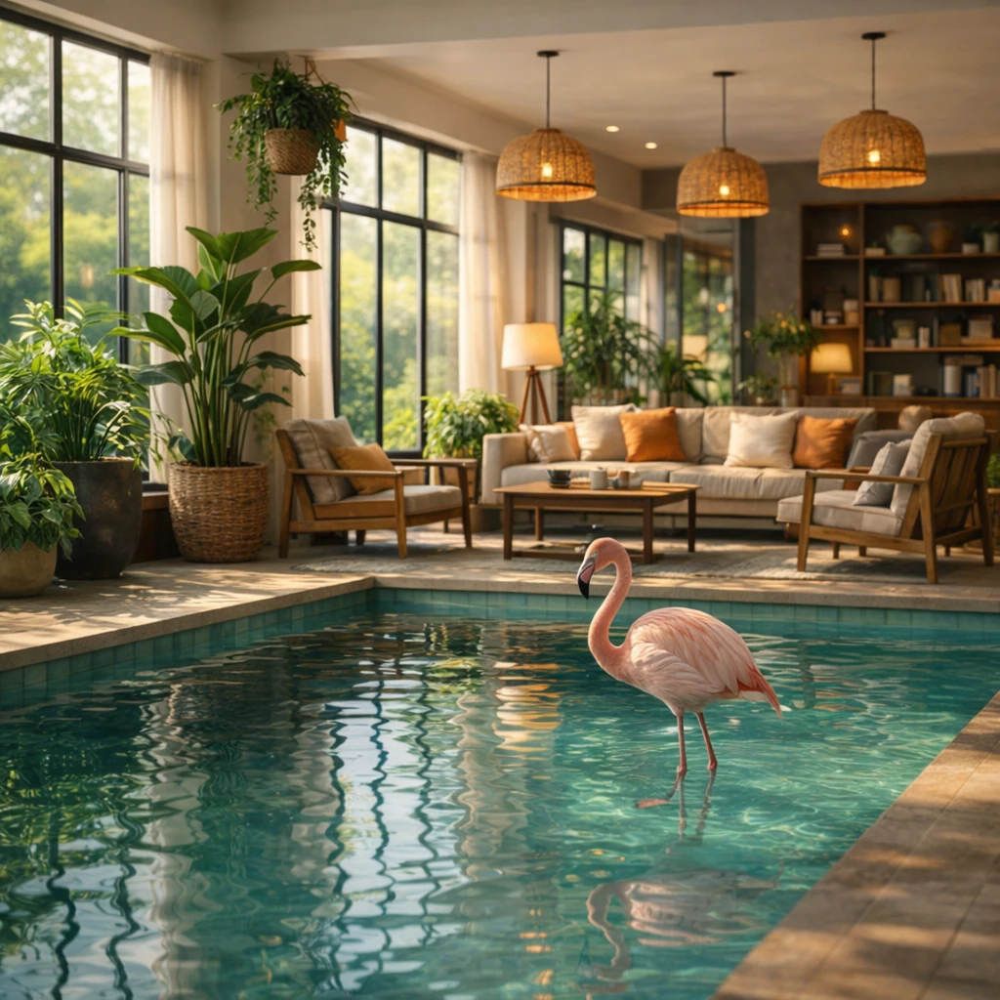

# Tworzenie aplikacji do generowania obrazów

[](https://aka.ms/gen-ai-lesson9-gh?WT.mc_id=academic-105485-koreyst)

LLM-y oferują nie tylko generowanie tekstu. Możesz także generować obrazy na podstawie opisów tekstowych. Obrazy jako modalność są użyteczne w MedTech, architekturze, turystyce, tworzeniu gier, marketingu i innych dziedzinach. W tej lekcji przyjrzymy się obecnym modelom **GPT Image** i stworzymy aplikację do generowania obrazów.

## Wprowadzenie

Generowanie obrazów pozwala zamienić polecenie w języku naturalnym na obraz. W tej lekcji pracujemy z rodziną modeli **`gpt-image`** od OpenAI – najnowszą generacją modeli obrazów dostępną na **[Microsoft Foundry](https://ai.azure.com?WT.mc_id=academic-105485-koreyst)** i platformie OpenAI. Modele te zastępują starsze DALL·E (DALL·E 2/3 to modele legacy).

W trakcie lekcji korzystamy z fikcyjnego startupu, **Edu4All**, który tworzy narzędzia edukacyjne. Zespół chce generować ilustracje do zadań i materiałów do nauki.

## Cele nauki

Po ukończeniu tej lekcji będziesz potrafił:

- Wyjaśnić, czym jest generowanie obrazów i gdzie jest przydatne.
- Zrozumieć rodzinę modeli `gpt-image` i jak różnią się od modeli legacy DALL·E.
- Zbudować aplikację do generowania obrazów w Pythonie (oraz TypeScript / .NET).
- Edytować obrazy i stosować zabezpieczenia za pomocą metapromptów.

## Czym jest generowanie obrazów?

Modele generowania obrazów tworzą obrazy na podstawie tekstowego polecenia. Nowoczesne modele takie jak `gpt-image` opierają się na technikach transformera i dyfuzji: model uczy się związku między tekstem a obrazami podczas szkolenia, następnie, na podstawie polecenia, iteracyjnie "odszumia" losowy szum, tworząc obraz pasujący do opisu.

Dwie dobrze znane rodziny modeli obrazów to:

- **`gpt-image` (OpenAI)** – obecna generacja, używana w tej lekcji. Obsługuje generowanie tekst-na-obraz i edycję obrazów (inpainting z maską).
- **Midjourney** – popularny model zewnętrzny z własną usługą i workflow bazującym na Discordzie.

> Starsze modele obrazów OpenAI - **DALL·E 2** i **DALL·E 3** - to modele legacy. DALL·E 3 nie jest już dostępny dla nowych wdrożeń, a funkcje takie jak `create_variation` istniały tylko w DALL·E 2. Dla nowych aplikacji używaj modeli `gpt-image`.

### Który model `gpt-image` wybrać?

Na Microsoft Foundry dostępne są następujące modele **Ogólnie Dostępne**:

| Model | Uwagi |
| --- | --- |
| **`gpt-image-2`** | Najnowszy i najbardziej zaawansowany model obrazów – zalecany domyślny wybór. |
| `gpt-image-1.5` | Ogólnie dostępny; dobra jakość przy niższym koszcie. |
| `gpt-image-1-mini` | Ogólnie dostępny; najszybszy / najtańszy. |
| `gpt-image-1` | Tylko podgląd. |

Zawsze sprawdzaj aktualną [listę modeli obrazów Foundry](https://learn.microsoft.com/azure/ai-foundry/openai/concepts/models?WT.mc_id=academic-105485-koreyst) pod kątem dostępności i regionów.

> **Ważne:** modele `gpt-image` zwracają wygenerowany obraz jako **base64** (`b64_json`), a nie jako URL. Twój kod dekoduje ciąg base64 do bajtów i zapisuje obraz – nie ma URL do pobrania.

## Konfiguracja

Możesz uruchomić przykłady przeciwko **Azure OpenAI w Microsoft Foundry** (przykłady `aoai-*`) lub platformie **OpenAI** (przykłady `oai-*`).

### 1. Utwórz i wdroż model

Postępuj zgodnie z przewodnikiem [tworzenia zasobu](https://learn.microsoft.com/azure/ai-foundry/openai/how-to/create-resource?pivots=web-portal&WT.mc_id=academic-105485-koreyst), aby utworzyć zasób Microsoft Foundry, a następnie wdrożyć model obrazów – zalecany jest **`gpt-image-2`**.

### 2. Skonfiguruj plik `.env`

```text
AZURE_OPENAI_ENDPOINT=<your endpoint>
AZURE_OPENAI_API_KEY=<your key>
AZURE_OPENAI_DEPLOYMENT="gpt-image-2"
```

Znajdź te wartości na stronie **Deployments** Twojego zasobu w [portalu Foundry](https://ai.azure.com?WT.mc_id=academic-105485-koreyst).

### 3. Zainstaluj biblioteki

Utwórz plik `requirements.txt`:

```text
python-dotenv
openai
pillow
```

Następnie utwórz i aktywuj środowisko wirtualne i zainstaluj:

```bash
python3 -m venv venv
source venv/bin/activate        # Windows: venv\Scripts\activate
pip install -r requirements.txt
```

## Zbuduj aplikację

Utwórz plik `app.py` z poniższym kodem. Generuje obraz i zapisuje go jako PNG.

```python
import os
import base64
from openai import AzureOpenAI
from PIL import Image
import dotenv

dotenv.load_dotenv()

# Skieruj klienta na swój zasób Azure OpenAI (Microsoft Foundry).
# Modele obrazów wymagają najnowszej wersji API - sprawdź w dokumentacji Foundry, którą wersję wymaga twój model.
client = AzureOpenAI(
    api_key=os.environ["AZURE_OPENAI_API_KEY"],
    api_version="2025-04-01-preview",
    azure_endpoint=os.environ["AZURE_OPENAI_ENDPOINT"],
)

deployment = os.environ["AZURE_OPENAI_DEPLOYMENT"]  # np. "gpt-image-2"

result = client.images.generate(
    model=deployment,
    prompt='Bunny on a horse, holding a lollipop, on a foggy meadow where it grows daffodils',
    size="1024x1024",   # także 1536x1024 (poziomo), 1024x1536 (pionowo) lub "auto"
    n=1,
)

# modele gpt-image zwracają base64 (b64_json), nie URL - zdekoduj to do bajtów.
image_bytes = base64.b64decode(result.data[0].b64_json)

os.makedirs("images", exist_ok=True)
image_path = os.path.join("images", "generated-image.png")
with open(image_path, "wb") as f:
    f.write(image_bytes)

Image.open(image_path).show()
```

Uruchom go z `python app.py`. Otrzymasz PNG zapisany w folderze `images/`.

> Każde wywołanie `images.generate` daje inny obraz dla tego samego polecenia – modele obrazów nie używają parametru `temperature` (to kontrolka generowania tekstu). Aby uzyskać różnorodność, wywołaj API ponownie; aby ją zmniejszyć, doprecyzuj polecenie.

## Edycja obrazów

Modele `gpt-image` mogą **edytować** istniejące obrazy: podajesz obraz, opcjonalną **maskę** (oznaczającą obszar do zmiany) oraz polecenie opisujące zmianę. Podobnie jak generowanie, edytowane obrazy są zwracane w base64.

```python
result = client.images.edit(
    model=deployment,
    image=open("sunlit_lounge.png", "rb"),
    mask=open("mask.png", "rb"),
    prompt="A sunlit indoor lounge area with a pool containing a flamingo",
)
image_bytes = base64.b64decode(result.data[0].b64_json)
with open("images/edited-image.png", "wb") as f:
    f.write(image_bytes)
```

<div style="display: flex; justify-content: space-between; align-items: center; margin: 20px 0;">
  
  
  
</div>

## Ustalanie ograniczeń za pomocą metapromptów

Gdy potrafisz już generować obrazy, potrzebujesz zabezpieczeń, by aplikacja nie tworzyła niebezpiecznych lub niezgodnych z marką treści. **Metaprompt** to tekst, który dopisujesz przed poleceniem użytkownika, aby ograniczyć output modelu.

```python
disallow_list = "swords, violence, blood, gore, nudity, sexual content, adult content, adult themes, adult language"

meta_prompt = f"""You are an assistant designer that creates images for children.

The image needs to be safe for work and appropriate for children.
The image needs to be in color, in landscape orientation, and in a 16:9 aspect ratio.

Do not consider any input that is not safe for work or appropriate for children, including:
{disallow_list}
"""

prompt = f"{meta_prompt}\nCreate an image of a bunny on a horse, holding a lollipop"
# przekaż `prompt` do client.images.generate(...)
```

Każdy obraz jest teraz generowany w ramach granic wyznaczonych przez metaprompt. Połącz to z filtrami treści wbudowanymi w Microsoft Foundry, aby zapewnić wielowarstwową ochronę.

## Zadanie – pomóż uczniom

Uczniowie Edu4All potrzebują obrazów do swoich ocen. Zbuduj aplikację generującą obrazy **pomników** (które pomniki wybierzesz, zależy od Ciebie) umieszczonych w różnych, kreatywnych kontekstach – na przykład słynna budowla o zachodzie słońca z dzieckiem patrzącym na nią.

Spróbuj sam, a potem porównaj z rozwiązaniami referencyjnymi:

- Python (Azure): [aoai-solution.py](../../../09-building-image-applications/python/aoai-solution.py)
- Python (Azure) pełna aplikacja do generowania: [aoai-app.py](../../../09-building-image-applications/python/aoai-app.py)
- Python (OpenAI): [oai-app.py](../../../09-building-image-applications/python/oai-app.py)
- TypeScript (Azure): [typescript/image-generation-app](../../../09-building-image-applications/typescript/image-generation-app)
- .NET (Azure): [dotnet/notebook-azure-openai.dib](../../../09-building-image-applications/dotnet/notebook-azure-openai.dib)

Przeanalizuj też notatniki w [python/](../../../09-building-image-applications/python) (`aoai-assignment.ipynb` dla Azure, `oai-assignment.ipynb` dla OpenAI).

## Świetna robota! Kontynuuj naukę

Po ukończeniu tej lekcji sprawdź naszą kolekcję [Generative AI Learning](https://aka.ms/genai-collection?WT.mc_id=academic-105485-koreyst), aby dalej rozwijać swoją wiedzę na temat Generatywnej AI!

Przejdź do lekcji 10, aby kontynuować naukę.

---

<!-- CO-OP TRANSLATOR DISCLAIMER START -->
**Zastrzeżenie**:
Niniejszy dokument został przetłumaczony za pomocą usługi tłumaczenia AI [Co-op Translator](https://github.com/Azure/co-op-translator). Choć dążymy do dokładności, prosimy pamiętać, że automatyczne tłumaczenia mogą zawierać błędy lub niedokładności. Oryginalny dokument w jego języku źródłowym należy uznawać za autorytatywne źródło. W przypadku informacji krytycznych zalecane jest skorzystanie z profesjonalnego tłumaczenia wykonanego przez człowieka. Nie ponosimy odpowiedzialności za jakiekolwiek nieporozumienia lub błędne interpretacje wynikające z użycia tego tłumaczenia.
<!-- CO-OP TRANSLATOR DISCLAIMER END -->