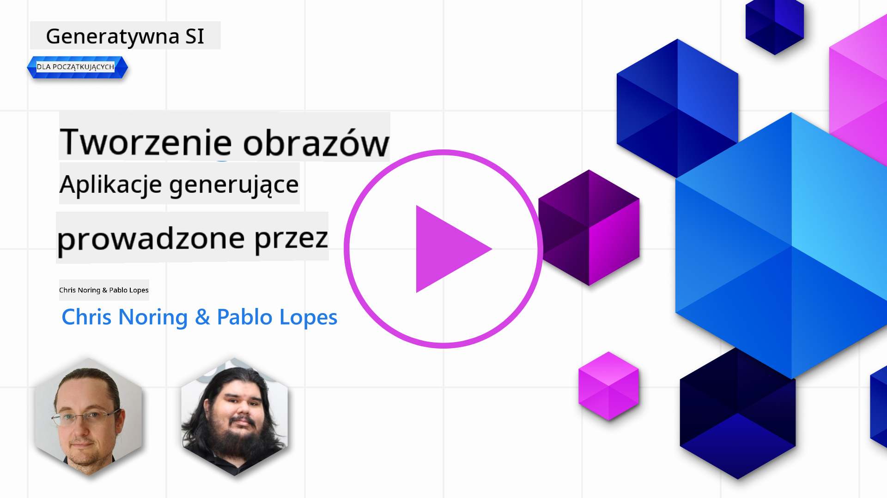

<!--
CO_OP_TRANSLATOR_METADATA:
{
  "original_hash": "ef74ad58fc01f7ad80788f79505f9816",
  "translation_date": "2025-08-26T16:45:24+00:00",
  "source_file": "09-building-image-applications/README.md",
  "language_code": "pl"
}
-->
# Tworzenie aplikacji do generowania obrazów

[](https://aka.ms/gen-ai-lesson9-gh?WT.mc_id=academic-105485-koreyst)

LLM-y to nie tylko generowanie tekstu. Możliwe jest także generowanie obrazów na podstawie opisów tekstowych. Obrazy jako dodatkowa modalność mogą być bardzo przydatne w wielu dziedzinach, takich jak MedTech, architektura, turystyka, tworzenie gier i wiele innych. W tym rozdziale przyjrzymy się dwóm najpopularniejszym modelom generowania obrazów: DALL-E i Midjourney.

## Wprowadzenie

W tej lekcji omówimy:

- Generowanie obrazów i dlaczego jest to przydatne.
- DALL-E i Midjourney – czym są i jak działają.
- Jak zbudować aplikację do generowania obrazów.

## Cele nauki

Po ukończeniu tej lekcji będziesz w stanie:

- Zbudować aplikację do generowania obrazów.
- Określić granice swojej aplikacji za pomocą metapromptów.
- Pracować z DALL-E i Midjourney.

## Dlaczego warto budować aplikację do generowania obrazów?

Aplikacje do generowania obrazów to świetny sposób na poznanie możliwości Sztucznej Inteligencji Generatywnej. Mogą być wykorzystywane na przykład do:

- **Edycji i syntezy obrazów**. Możesz generować obrazy do różnych zastosowań, takich jak edycja czy synteza obrazów.

- **Zastosowania w różnych branżach**. Mogą być także używane do generowania obrazów dla różnych branż, takich jak MedTech, turystyka, tworzenie gier i wiele innych.

## Scenariusz: Edu4All

W ramach tej lekcji będziemy kontynuować pracę z naszym startupem Edu4All. Uczniowie będą tworzyć obrazy do swoich prac zaliczeniowych – jakie to będą obrazy, zależy od nich. Mogą to być ilustracje do własnej bajki, stworzenie nowej postaci do opowiadania lub pomoc w wizualizacji pomysłów i koncepcji.

Oto przykład, co uczniowie Edu4All mogliby wygenerować, pracując na lekcji o zabytkach:


używając promptu takiego jak

> "Pies obok Wieży Eiffla w porannym świetle"

## Czym są DALL-E i Midjourney?

[DALL-E](https://openai.com/dall-e-2?WT.mc_id=academic-105485-koreyst) i [Midjourney](https://www.midjourney.com/?WT.mc_id=academic-105485-koreyst) to dwa z najpopularniejszych modeli generowania obrazów, które pozwalają na tworzenie obrazów na podstawie promptów.

### DALL-E

Zacznijmy od DALL-E, czyli modelu AI generującego obrazy na podstawie opisów tekstowych.

> [DALL-E to połączenie dwóch modeli: CLIP i diffused attention](https://towardsdatascience.com/openais-dall-e-and-clip-101-a-brief-introduction-3a4367280d4e?WT.mc_id=academic-105485-koreyst).

- **CLIP** to model, który generuje embeddingi, czyli numeryczne reprezentacje danych, zarówno z obrazów, jak i tekstu.

- **Diffused attention** to model, który generuje obrazy na podstawie embeddingów. DALL-E jest trenowany na zbiorze danych zawierającym obrazy i teksty, dzięki czemu potrafi generować obrazy na podstawie opisów tekstowych. Na przykład, DALL-E może wygenerować obraz kota w kapeluszu lub psa z irokezem.

### Midjourney

Midjourney działa podobnie do DALL-E – generuje obrazy na podstawie promptów tekstowych. Midjourney również pozwala na tworzenie obrazów na podstawie promptów takich jak „kot w kapeluszu” czy „pies z irokezem”.


_Źródło: Wikipedia, obraz wygenerowany przez Midjourney_

## Jak działają DALL-E i Midjourney

Najpierw [DALL-E](https://arxiv.org/pdf/2102.12092.pdf?WT.mc_id=academic-105485-koreyst). DALL-E to model AI generatywnej oparty na architekturze transformera z _autoregresyjnym transformerem_.

_Autoregresyjny transformer_ określa, jak model generuje obrazy na podstawie opisów tekstowych – generuje jeden piksel na raz, a następnie wykorzystuje wygenerowane piksele do stworzenia kolejnego. Proces ten przechodzi przez wiele warstw sieci neuronowej, aż obraz zostanie ukończony.

Dzięki temu procesowi DALL-E kontroluje atrybuty, obiekty, cechy i inne elementy obrazu. Jednak DALL-E 2 i 3 dają jeszcze większą kontrolę nad generowanym obrazem.

## Tworzenie pierwszej aplikacji do generowania obrazów

Co jest potrzebne, by zbudować aplikację do generowania obrazów? Potrzebujesz następujących bibliotek:

- **python-dotenv** – zdecydowanie zalecane do przechowywania sekretów w pliku _.env_ z dala od kodu.
- **openai** – biblioteka do komunikacji z API OpenAI.
- **pillow** – do pracy z obrazami w Pythonie.
- **requests** – do wykonywania zapytań HTTP.

## Utwórz i wdroż model Azure OpenAI

Jeśli jeszcze tego nie zrobiłeś, postępuj zgodnie z instrukcjami na stronie [Microsoft Learn](https://learn.microsoft.com/azure/ai-foundry/openai/how-to/create-resource?pivots=web-portal),
aby utworzyć zasób i model Azure OpenAI. Wybierz model DALL-E 3.  

## Utwórz aplikację

1. Utwórz plik _.env_ z następującą zawartością:

   ```text
   AZURE_OPENAI_ENDPOINT=<your endpoint>
   AZURE_OPENAI_API_KEY=<your key>
   AZURE_OPENAI_DEPLOYMENT="dall-e-3"
   ```

   Te informacje znajdziesz w portalu Azure OpenAI Foundry w sekcji "Deployments" dla swojego zasobu.

1. Zbierz powyższe biblioteki w pliku _requirements.txt_ w następujący sposób:

   ```text
   python-dotenv
   openai
   pillow
   requests
   ```

1. Następnie utwórz środowisko wirtualne i zainstaluj biblioteki:

   ```bash
   python3 -m venv venv
   source venv/bin/activate
   pip install -r requirements.txt
   ```

   Dla systemu Windows użyj poniższych poleceń, aby utworzyć i aktywować środowisko wirtualne:

   ```bash
   python3 -m venv venv
   venv\Scripts\activate.bat
   ```

1. Dodaj poniższy kod do pliku _app.py_:

    ```python
    import openai
    import os
    import requests
    from PIL import Image
    import dotenv
    from openai import OpenAI, AzureOpenAI
    
    # import dotenv
    dotenv.load_dotenv()
    
    # configure Azure OpenAI service client 
    client = AzureOpenAI(
      azure_endpoint = os.environ["AZURE_OPENAI_ENDPOINT"],
      api_key=os.environ['AZURE_OPENAI_API_KEY'],
      api_version = "2024-02-01"
      )
    try:
        # Create an image by using the image generation API
        generation_response = client.images.generate(
                                prompt='Bunny on horse, holding a lollipop, on a foggy meadow where it grows daffodils',
                                size='1024x1024', n=1,
                                model=os.environ['AZURE_OPENAI_DEPLOYMENT']
                              )

        # Set the directory for the stored image
        image_dir = os.path.join(os.curdir, 'images')

        # If the directory doesn't exist, create it
        if not os.path.isdir(image_dir):
            os.mkdir(image_dir)

        # Initialize the image path (note the filetype should be png)
        image_path = os.path.join(image_dir, 'generated-image.png')

        # Retrieve the generated image
        image_url = generation_response.data[0].url  # extract image URL from response
        generated_image = requests.get(image_url).content  # download the image
        with open(image_path, "wb") as image_file:
            image_file.write(generated_image)

        # Display the image in the default image viewer
        image = Image.open(image_path)
        image.show()

    # catch exceptions
    except openai.InvalidRequestError as err:
        print(err)
   ```

Wyjaśnijmy ten kod:

- Najpierw importujemy potrzebne biblioteki, w tym OpenAI, dotenv, requests i Pillow.

  ```python
  import openai
  import os
  import requests
  from PIL import Image
  import dotenv
  ```

- Następnie ładujemy zmienne środowiskowe z pliku _.env_.

  ```python
  # import dotenv
  dotenv.load_dotenv()
  ```

- Potem konfigurujemy klienta usługi Azure OpenAI

  ```python
  # Get endpoint and key from environment variables
  client = AzureOpenAI(
      azure_endpoint = os.environ["AZURE_OPENAI_ENDPOINT"],
      api_key=os.environ['AZURE_OPENAI_API_KEY'],
      api_version = "2024-02-01"
      )
  ```

- Następnie generujemy obraz:

  ```python
  # Create an image by using the image generation API
  generation_response = client.images.generate(
                        prompt='Bunny on horse, holding a lollipop, on a foggy meadow where it grows daffodils',
                        size='1024x1024', n=1,
                        model=os.environ['AZURE_OPENAI_DEPLOYMENT']
                      )
  ```

  Powyższy kod zwraca obiekt JSON zawierający URL wygenerowanego obrazu. Możemy użyć tego URL-a, aby pobrać obraz i zapisać go do pliku.

- Na końcu otwieramy obraz i wyświetlamy go w domyślnej przeglądarce obrazów:

  ```python
  image = Image.open(image_path)
  image.show()
  ```

### Więcej szczegółów o generowaniu obrazu

Przyjrzyjmy się dokładniej kodowi generującemu obraz:

    ```python
      generation_response = client.images.generate(
                                prompt='Bunny on horse, holding a lollipop, on a foggy meadow where it grows daffodils',
                                size='1024x1024', n=1,
                                model=os.environ['AZURE_OPENAI_DEPLOYMENT']
                            )
    ```

- **prompt** – tekstowy prompt używany do wygenerowania obrazu. W tym przypadku używamy promptu "Królik na koniu, trzymający lizaka, na mglistym łące, gdzie rosną żonkile".
- **size** – rozmiar generowanego obrazu. W tym przypadku generujemy obraz o wymiarach 1024x1024 pikseli.
- **n** – liczba generowanych obrazów. W tym przypadku generujemy dwa obrazy.
- **temperature** – parametr kontrolujący losowość wyników modelu AI generatywnej. Temperatura to wartość od 0 do 1, gdzie 0 oznacza deterministyczny wynik, a 1 – całkowitą losowość. Domyślna wartość to 0.7.

W kolejnej sekcji omówimy więcej możliwości pracy z obrazami.

## Dodatkowe możliwości generowania obrazów

Widziałeś już, jak można wygenerować obraz za pomocą kilku linijek kodu w Pythonie. Jednak z obrazami można zrobić znacznie więcej.

Możesz także:

- **Wykonywać edycje**. Podając istniejący obraz, maskę i prompt, możesz zmienić obraz. Na przykład możesz dodać coś do wybranego fragmentu obrazu. Wyobraź sobie nasz obraz z królikiem – możesz dodać mu kapelusz. W tym celu podajesz obraz, maskę (wskazującą obszar do zmiany) oraz prompt tekstowy opisujący, co ma zostać zrobione.
> Uwaga: ta funkcja nie jest obsługiwana w DALL-E 3.
 
Oto przykład z użyciem GPT Image:

    ```python
    response = client.images.edit(
        model="gpt-image-1",
        image=open("sunlit_lounge.png", "rb"),
        mask=open("mask.png", "rb"),
        prompt="A sunlit indoor lounge area with a pool containing a flamingo"
    )
    image_url = response.data[0].url
    ```

  Obraz bazowy zawierałby tylko salon z basenem, ale obraz końcowy miałby flaminga:

<div style="display: flex; justify-content: space-between; align-items: center; margin: 20px 0;">
  
  
  
</div>


- **Tworzyć wariacje**. Chodzi o to, by na podstawie istniejącego obrazu wygenerować jego wariacje. Aby to zrobić, podajesz obraz, prompt tekstowy i kod podobny do poniższego:

  ```python
  response = openai.Image.create_variation(
    image=open("bunny-lollipop.png", "rb"),
    n=1,
    size="1024x1024"
  )
  image_url = response['data'][0]['url']
  ```

  > Uwaga: ta funkcja jest dostępna tylko w OpenAI

## Temperatura

Temperatura to parametr kontrolujący losowość wyników modelu AI generatywnej. Temperatura to wartość od 0 do 1, gdzie 0 oznacza deterministyczny wynik, a 1 – całkowitą losowość. Domyślna wartość to 0.7.

Przyjrzyjmy się, jak działa temperatura, uruchamiając ten sam prompt dwukrotnie:

> Prompt: "Królik na koniu, trzymający lizaka, na mglistym łące, gdzie rosną żonkile"


Teraz uruchommy ten sam prompt ponownie, by zobaczyć, że nie otrzymamy dwa razy tego samego obrazu:


Jak widać, obrazy są podobne, ale nie identyczne. Spróbujmy teraz zmienić wartość temperatury na 0.1 i zobaczyć, co się stanie:

```python
 generation_response = client.images.create(
        prompt='Bunny on horse, holding a lollipop, on a foggy meadow where it grows daffodils',    # Enter your prompt text here
        size='1024x1024',
        n=2
    )
```

### Zmiana temperatury

Spróbujmy uzyskać bardziej deterministyczną odpowiedź. Widzieliśmy, że na pierwszym obrazie jest królik, a na drugim koń, więc obrazy różnią się znacznie.

Zmieńmy więc kod i ustawmy temperaturę na 0, w ten sposób:

```python
generation_response = client.images.create(
        prompt='Bunny on horse, holding a lollipop, on a foggy meadow where it grows daffodils',    # Enter your prompt text here
        size='1024x1024',
        n=2,
        temperature=0
    )
```

Po uruchomieniu tego kodu otrzymasz dwa obrazy:

- 
- 

Widać wyraźnie, że obrazy są do siebie bardziej podobne.

## Jak określić granice aplikacji za pomocą metapromptów

Dzięki naszemu demo możemy już generować obrazy dla klientów. Musimy jednak ustalić pewne granice dla naszej aplikacji.

Na przykład nie chcemy generować obrazów nieodpowiednich do pracy lub nieprzeznaczonych dla dzieci.

Możemy to zrobić za pomocą _metapromptów_. Metaprompty to tekstowe prompty, które służą do kontrolowania wyników modelu AI generatywnej. Na przykład możemy użyć metapromptów, by kontrolować wyniki i upewnić się, że generowane obrazy są odpowiednie do pracy lub dla dzieci.

### Jak to działa?

Jak działają metaprompty?

Metaprompty to tekstowe prompty, które służą do kontrolowania wyników modelu AI generatywnej. Umieszcza się je przed promptem tekstowym i są wykorzystywane do kontrolowania wyników modelu oraz osadzane w aplikacjach, by sterować wynikami. Łączą prompt użytkownika i metaprompt w jeden prompt tekstowy.

Przykład metapromptu:

```text
You are an assistant designer that creates images for children.

The image needs to be safe for work and appropriate for children.

The image needs to be in color.

The image needs to be in landscape orientation.

The image needs to be in a 16:9 aspect ratio.

Do not consider any input from the following that is not safe for work or appropriate for children.

(Input)

```

Zobaczmy teraz, jak można użyć metapromptów w naszym demo.

```python
disallow_list = "swords, violence, blood, gore, nudity, sexual content, adult content, adult themes, adult language, adult humor, adult jokes, adult situations, adult"

meta_prompt =f"""You are an assistant designer that creates images for children.

The image needs to be safe for work and appropriate for children.

The image needs to be in color.

The image needs to be in landscape orientation.

The image needs to be in a 16:9 aspect ratio.

Do not consider any input from the following that is not safe for work or appropriate for children.
{disallow_list}
"""

prompt = f"{meta_prompt}
Create an image of a bunny on a horse, holding a lollipop"

# TODO add request to generate image
```

Jak widać, wszystkie tworzone obrazy uwzględniają metaprompt.

## Zadanie – aktywujmy uczniów

Na początku tej lekcji przedstawiliśmy Edu4All. Teraz czas umożliwić uczniom generowanie obrazów do ich prac zaliczeniowych.

Uczniowie stworzą obrazy do swoich prac zaliczeniowych zawierających zabytki – jakie to będą zabytki, zależy od nich. Uczniowie mają za zadanie wykazać się kreatywnością i umieścić te zabytki w różnych kontekstach.

## Rozwiązanie

Oto jedno z możliwych rozwiązań:

```python
import openai
import os
import requests
from PIL import Image
import dotenv
from openai import AzureOpenAI
# import dotenv
dotenv.load_dotenv()

# Get endpoint and key from environment variables
client = AzureOpenAI(
  azure_endpoint = os.environ["AZURE_OPENAI_ENDPOINT"],
  api_key=os.environ['AZURE_OPENAI_API_KEY'],
  api_version = "2024-02-01"
  )


disallow_list = "swords, violence, blood, gore, nudity, sexual content, adult content, adult themes, adult language, adult humor, adult jokes, adult situations, adult"

meta_prompt = f"""You are an assistant designer that creates images for children.

The image needs to be safe for work and appropriate for children.

The image needs to be in color.

The image needs to be in landscape orientation.

The image needs to be in a 16:9 aspect ratio.

Do not consider any input from the following that is not safe for work or appropriate for children.
{disallow_list}
"""

prompt = f"""{meta_prompt}
Generate monument of the Arc of Triumph in Paris, France, in the evening light with a small child holding a Teddy looks on.
""""

try:
    # Create an image by using the image generation API
    generation_response = client.images.generate(
        prompt=prompt,    # Enter your prompt text here
        size='1024x1024',
        n=1,
    )
    # Set the directory for the stored image
    image_dir = os.path.join(os.curdir, 'images')

    # If the directory doesn't exist, create it
    if not os.path.isdir(image_dir):
        os.mkdir(image_dir)

    # Initialize the image path (note the filetype should be png)
    image_path = os.path.join(image_dir, 'generated-image.png')

    # Retrieve the generated image
    image_url = generation_response.data[0].url  # extract image URL from response
    generated_image = requests.get(image_url).content  # download the image
    with open(image_path, "wb") as image_file:
        image_file.write(generated_image)

    # Display the image in the default image viewer
    image = Image.open(image_path)
    image.show()

# catch exceptions
except openai.BadRequestError as err:
    print(err)
```

## Świetna robota! Kontynuuj naukę
Po ukończeniu tej lekcji zajrzyj do naszej [kolekcji materiałów o Generatywnej AI](https://aka.ms/genai-collection?WT.mc_id=academic-105485-koreyst), aby dalej rozwijać swoją wiedzę z zakresu Generatywnej Sztucznej Inteligencji!

Przejdź do Lekcji 10, gdzie omówimy, jak [tworzyć aplikacje AI przy użyciu narzędzi low-code](../10-building-low-code-ai-applications/README.md?WT.mc_id=academic-105485-koreyst)

---

**Zastrzeżenie**:  
Ten dokument został przetłumaczony przy użyciu usługi tłumaczenia AI [Co-op Translator](https://github.com/Azure/co-op-translator). Chociaż dokładamy wszelkich starań, aby tłumaczenie było dokładne, prosimy pamiętać, że tłumaczenia automatyczne mogą zawierać błędy lub nieścisłości. Oryginalny dokument w jego ojczystym języku powinien być traktowany jako źródło nadrzędne. W przypadku informacji krytycznych zalecane jest skorzystanie z profesjonalnych usług tłumaczeniowych. Nie ponosimy odpowiedzialności za wszelkie nieporozumienia lub błędne interpretacje wynikające z użycia tego tłumaczenia.