# Budowanie aplikacji AI z niską ilością kodu

[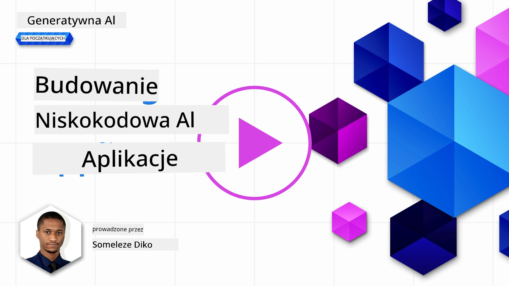](https://youtu.be/1vzq3Nd8GBA?si=h6LHWJXdmqf6mhDg)

> _(Kliknij obraz powyżej, aby obejrzeć wideo z tej lekcji)_

## Wprowadzenie

Teraz, gdy nauczyliśmy się, jak budować aplikacje generujące obrazy, porozmawiajmy o niskokodowym programowaniu. Sztuczna inteligencja generatywna może być używana w różnych obszarach, w tym w niskim kodzie, ale czym jest niski kod i jak możemy dodać do niego AI?

Budowanie aplikacji i rozwiązań stało się łatwiejsze zarówno dla tradycyjnych programistów, jak i osób bez doświadczenia programistycznego dzięki zastosowaniu platform niskokodowych (Low Code Development Platforms). Platformy te pozwalają tworzyć aplikacje i rozwiązania przy minimalnym lub żadnym kodzie. Osiąga się to poprzez zapewnienie wizualnego środowiska rozwoju, które umożliwia przeciąganie i upuszczanie komponentów do budowy aplikacji i rozwiązań. To pozwala na szybsze tworzenie aplikacji i rozwiązań przy mniejszym nakładzie zasobów. W tej lekcji zagłębimy się, jak używać niskokodowego programowania i jak wzbogacić rozwój low-code o AI z pomocą Power Platform.

Platforma Power Platform daje organizacjom możliwość umożliwienia zespołom tworzenia ich własnych rozwiązań w intuicyjnym środowisku low-code lub no-code. To środowisko pomaga uprościć proces tworzenia rozwiązań. Dzięki Power Platform rozwiązania mogą być budowane w ciągu dni lub tygodni zamiast miesięcy czy lat. Power Platform składa się z pięciu kluczowych produktów: Power Apps, Power Automate, Power BI, Power Pages oraz Copilot Studio.

Ta lekcja zawiera:

- Wprowadzenie do sztucznej inteligencji generatywnej w Power Platform
- Wprowadzenie do Copilota i jak go używać
- Wykorzystanie AI generatywnej do budowania aplikacji i przepływów w Power Platform
- Zrozumienie modeli AI w Power Platform z wykorzystaniem AI Builder
- Budowanie inteligentnych agentów z Microsoft Copilot Studio

## Cele nauki

Po ukończeniu tej lekcji będziesz potrafił:

- Zrozumieć, jak działa Copilot w Power Platform.

- Zbudować aplikację do śledzenia zadań studentów dla naszego startupu edukacyjnego.

- Zbudować przepływ przetwarzania faktur, który wykorzystuje AI do wyciągania informacji z faktur.

- Stosować najlepsze praktyki przy korzystaniu z modelu AI Create Text with GPT.

- Zrozumieć, czym jest Microsoft Copilot Studio i jak budować inteligentnych agentów z jego pomocą.

Narzędzia i technologie, których użyjesz w tej lekcji to:

- **Power Apps**, dla aplikacji Student Assignment Tracker, które zapewnia środowisko niskokodowe do budowania aplikacji do śledzenia, zarządzania i interakcji z danymi.

- **Dataverse**, do przechowywania danych dla aplikacji Student Assignment Tracker, gdzie Dataverse zapewnia platformę danych low-code do przechowywania danych aplikacji.

- **Power Automate**, dla przepływu przetwarzania faktur, gdzie masz środowisko niskokodowe do budowania przepływów automatyzujących proces przetwarzania faktur.

- **AI Builder**, dla modelu AI do przetwarzania faktur, gdzie użyjesz gotowych modeli AI do przetwarzania faktur dla naszego startupu.

## Sztuczna inteligencja generatywna w Power Platform

Wzmacnianie low-code z wykorzystaniem AI generatywnej to kluczowy obszar zainteresowania Power Platform. Celem jest umożliwienie każdemu budowania aplikacji zasilanych AI, stron, pulpitów nawigacyjnych i automatyzacji procesów za pomocą AI, _bez potrzeby posiadania wiedzy z zakresu data science_. Cel ten osiąga się przez integrację generatywnej AI z doświadczeniem low-code w Power Platform w formie Copilot i AI Builder.

### Jak to działa?

Copilot to asystent AI, który umożliwia budowanie rozwiązań Power Platform poprzez opisanie swoich wymagań w serii kroków konwersacyjnych, używając naturalnego języka. Możesz np. polecić swojemu asystentowi AI, jakie pola ma używać twoja aplikacja, a on stworzy zarówno aplikację, jak i model danych lub możesz określić, jak skonfigurować przepływ w Power Automate.

Możesz używać funkcji napędzanych przez Copilota jako cechy w ekranach swojej aplikacji, aby umożliwić użytkownikom odkrywanie wglądów poprzez interakcje konwersacyjne.

AI Builder to niskokodowa funkcjonalność AI dostępna w Power Platform, która umożliwia użycie modeli AI do automatyzacji procesów i przewidywania wyników. Dzięki AI Builder możesz wprowadzić AI do swoich aplikacji i przepływów, które łączą się z danymi w Dataverse lub różnych źródłach chmurowych, takich jak SharePoint, OneDrive czy Azure.

Copilot jest dostępny we wszystkich produktach Power Platform: Power Apps, Power Automate, Power BI, Power Pages oraz Copilot Studio (dawniej Power Virtual Agents). AI Builder jest dostępny w Power Apps i Power Automate. W tej lekcji skupimy się na tym, jak używać Copilota i AI Builder w Power Apps i Power Automate, aby zbudować rozwiązanie dla naszego edukacyjnego startupu.

### Copilot w Power Apps

W ramach Power Platform, Power Apps oferuje środowisko rozwoju low-code do budowania aplikacji do śledzenia, zarządzania i interakcji z danymi. To pakiet usług do tworzenia aplikacji z skalowalną platformą danych i możliwością łączenia z usługami chmurowymi oraz danymi lokalnymi. Power Apps pozwala budować aplikacje działające w przeglądarkach, na tabletach i telefonach, które można udostępniać współpracownikom. Power Apps ułatwia użytkownikom wejście w tworzenie aplikacji dzięki prostemu interfejsowi, tak aby każdy użytkownik biznesowy lub profesjonalny programista mógł tworzyć aplikacje na miarę potrzeb. Doświadczenie tworzenia aplikacji jest również wzbogacone AI generatywną za pośrednictwem Copilota.

Funkcja asystenta AI Copilot w Power Apps pozwala opisać, jakiego rodzaju aplikacji potrzebujesz i jakie informacje chcesz, aby twoja aplikacja śledziła, zbierała lub wyświetlała. Następnie Copilot generuje responsywną aplikację Canvas na podstawie twojego opisu. Potem możesz dostosować aplikację do swoich potrzeb. AI Copilot również generuje i sugeruje tabelę Dataverse z polami potrzebnymi do przechowywania danych, które chcesz śledzić, oraz z przykładowymi danymi. Przyjrzymy się, czym jest Dataverse i jak można go używać w Power Apps w dalszej części tej lekcji. Możesz dostosować tabelę do swoich potrzeb, korzystając z asystenta AI Copilot za pomocą kroków konwersacyjnych. Ta funkcja jest dostępna bezpośrednio z ekranu głównego Power Apps.

### Copilot w Power Automate

W ramach Power Platform, Power Automate pozwala użytkownikom tworzyć automatyczne przepływy pracy między aplikacjami i usługami. Pomaga automatyzować rutynowe procesy biznesowe, takie jak komunikacja, zbieranie danych czy zatwierdzanie decyzji. Jego prosty interfejs pozwala użytkownikom na każdym poziomie zaawansowania (od początkujących po doświadczonych programistów) automatyzować zadania. Doświadczenie tworzenia przepływów jest również wzbogacone AI generatywną za pomocą Copilota.

Funkcja asystenta AI Copilot w Power Automate umożliwia opisanie, jakiego rodzaju przepływu potrzebujesz i jakie akcje chcesz, aby przepływ wykonywał. Copilot generuje przepływ na podstawie twojego opisu. Możesz następnie dostosować przepływ do swoich potrzeb. AI Copilot również generuje i sugeruje akcje niezbędne do wykonania zadania, które chcesz zautomatyzować. Przyjrzymy się, czym są przepływy i jak je używać w Power Automate w dalszej części lekcji. Możesz dostosować akcje do swoich potrzeb, korzystając z funkcji asystenta AI Copilot za pomocą kroków konwersacyjnych. Ta funkcja jest dostępna bezpośrednio z ekranu głównego Power Automate.

## Budowanie inteligentnych agentów z Microsoft Copilot Studio

[Microsoft Copilot Studio](https://learn.microsoft.com/microsoft-copilot-studio/fundamentals-what-is-copilot-studio?WT.mc_id=academic-105485-koreyst) (dawniej Power Virtual Agents) to niskokodowy członek Power Platform do budowania **agentów AI** — konwersacyjnych copilotów, którzy mogą odpowiadać na pytania, wykonywać akcje i automatyzować zadania w imieniu twoich użytkowników. Podobnie jak reszta Power Platform, budujesz tych agentów w wizualnym, naturalnym doświadczeniu językowym: opisujesz, co chcesz, aby agent zrobił, a Copilot Studio pomaga tworzyć jego instrukcje, wiedzę i działania.

Dla naszego edukacyjnego startupu możesz zbudować agenta, który odpowiada na pytania studentów o kursy, sprawdza terminy zadań, a nawet wysyła e-maile do wykładowcy — wszystko bez pisania kodu.

Oto niektóre z najnowszych funkcji, które sprawiają, że Copilot Studio jest potężny:

- **Generatywne odpowiedzi bazujące na twojej wiedzy**. Zamiast ręcznie tworzyć każdą rozmowę, możesz podłączyć **źródła wiedzy** — publiczne strony internetowe, SharePoint, OneDrive, Dataverse, przesłane pliki czy dane firmowe przez konektory — a agent generuje z nich ugruntowane odpowiedzi.

- **Generatywna orkiestracja**. Zamiast polegać na sztywnych frazach wyzwalających, agent używa AI, aby zrozumieć żądanie i dynamicznie zdecydować, jaką wiedzę, tematy i akcje połączyć do jego wykonania, w tym łącząc kilka kroków.

- **Akcje i konektory**. Agenci mogą *robić* rzeczy, a nie tylko rozmawiać. Możesz dać agentowi akcje oparte na ponad 1,500 gotowych konektorach Power Platform, przepływach Power Automate, niestandardowych REST API, promptach lub serwerach **Model Context Protocol (MCP)**.

- **Autonomiczni agenci**. Agenci nie są ograniczeni do odpowiadania w oknie czatu. Możesz tworzyć **autonomicznych agentów**, którzy są wyzwalani przez zdarzenia — takie jak nowy e-mail, nowy rekord w Dataverse lub przesłanie pliku — a następnie działają w tle, by wykonać zadanie.

- **Multi-agent orchestration**. Agenci mogą wywoływać innych agentów. Agent Copilot Studio może przekazywać zadania lub być rozszerzany przez innych agentów, w tym agentów opublikowanych w Microsoft 365 Copilot i agentów zbudowanych w Microsoft Foundry.

- **Wybór modeli**. Poza wbudowanymi modelami możesz korzystać z modeli z katalogu modeli Microsoft Foundry, aby dostosować sposób działania i odpowiedzi agenta.

- **Publikacja wszędzie**. Po zbudowaniu agenta można go opublikować na wielu kanałach — Microsoft Teams, Microsoft 365 Copilot, stronie internetowej lub niestandardowej aplikacji — z zarządzaniem bezpieczeństwem, uwierzytelnianiem i analizami przez doświadczenie administratora Power Platform.

Możesz rozpocząć budowanie pierwszego agenta na [copilotstudio.microsoft.com](https://copilotstudio.microsoft.com?WT.mc_id=academic-105485-koreyst) i dowiedzieć się więcej z [dokumentacji Microsoft Copilot Studio](https://learn.microsoft.com/microsoft-copilot-studio/?WT.mc_id=academic-105485-koreyst).

## Zadanie: Zarządzanie zadaniami studentów i fakturami dla naszego startupu za pomocą Copilota

Nasz startup oferuje kursy online dla studentów. Startup szybko się rozrósł i obecnie ma problem z nadążaniem za rosnącym zapotrzebowaniem na swoje kursy. Startup zatrudnił cię jako dewelopera Power Platform, aby pomóc im zbudować rozwiązanie low-code do zarządzania zadaniami studentów i fakturami. Ich rozwiązanie powinno umożliwiać śledzenie i zarządzanie zadaniami studentów za pomocą aplikacji oraz automatyzować proces przetwarzania faktur poprzez przepływ pracy. Poproszono cię o wykorzystanie AI generatywnej do opracowania rozwiązania.

Rozpoczynając pracę z Copilotem, możesz użyć [Power Platform Copilot Prompt Library](https://github.com/pnp/powerplatform-prompts?WT.mc_id=academic-109639-somelezediko) jako źródła promptów. Ta biblioteka zawiera listę promptów, które możesz używać do budowania aplikacji i przepływów z Copilotem. Możesz ją również wykorzystać, aby zobaczyć, jak opisywać swoje wymagania Copilotowi.

### Zbuduj aplikację Student Assignment Tracker dla naszego startupu

Nauczyciele w naszym startupie mieli problem z nadążaniem za zadaniami studentów. Używali arkusza kalkulacyjnego do śledzenia zadań, ale stało się to trudne w zarządzaniu, ponieważ liczba studentów wzrosła. Poprosili cię o zbudowanie aplikacji, która pomoże im śledzić i zarządzać zadaniami studentów. Aplikacja powinna umożliwiać dodawanie nowych zadań, przeglądanie zadań, aktualizowanie zadań oraz usuwanie zadań. Powinna również umożliwiać nauczycielom i studentom przeglądanie zadań ocenionych i nieocenionych.

Zbudujesz aplikację za pomocą Copilota w Power Apps, postępując według poniższych kroków:

1. Przejdź do ekranu głównego [Power Apps](https://make.powerapps.com?WT.mc_id=academic-105485-koreyst).

1. Wykorzystaj pole tekstowe na ekranie głównym, aby opisać aplikację, którą chcesz zbudować. Na przykład, **_Chcę zbudować aplikację do śledzenia i zarządzania zadaniami studentów_**. Kliknij przycisk **Wyślij**, aby przesłać prompt do AI Copilota.

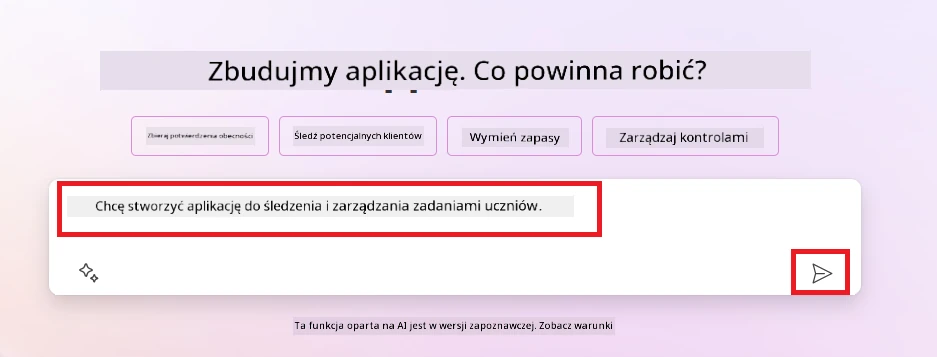

1. AI Copilot zasugeruje tabelę Dataverse z polami potrzebnymi do przechowywania danych, które chcesz śledzić, oraz przykładowymi danymi. Następnie możesz dostosować tabelę do swoich potrzeb, korzystając z asystenta AI Copilot za pomocą kroków konwersacyjnych.

   > **Ważne**: Dataverse to podstawowa platforma danych dla Power Platform. Jest to niskokodowa platforma danych do przechowywania danych aplikacji. To w pełni zarządzana usługa, która bezpiecznie przechowuje dane w chmurze Microsoft i jest udostępniana w twoim środowisku Power Platform. Zawiera wbudowane funkcje zarządzania danymi, takie jak klasyfikacja danych, pochodzenie danych, szczegółowa kontrola dostępu i więcej. Więcej na temat Dataverse możesz przeczytać [tutaj](https://docs.microsoft.com/powerapps/maker/data-platform/data-platform-intro?WT.mc_id=academic-109639-somelezediko).

   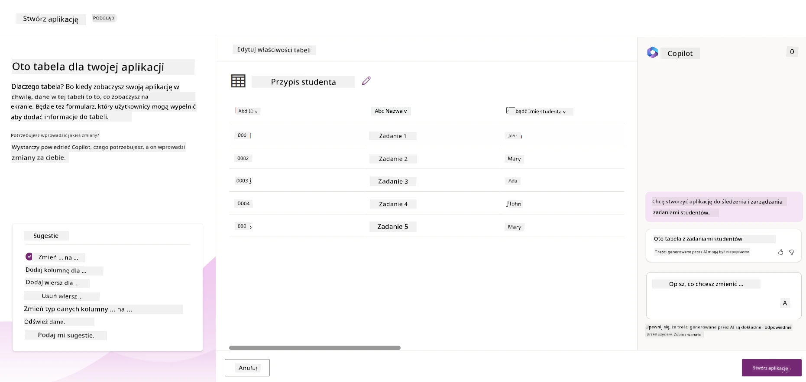

1. Nauczyciele chcą wysyłać e-maile do studentów, którzy złożyli swoje zadania, aby informować ich o postępach. Możesz użyć Copilota, aby dodać nowe pole do tabeli do przechowywania emaila studenta. Na przykład, możesz użyć poniższego promptu, aby dodać nową kolumnę: **_Chcę dodać kolumnę do przechowywania emaila studenta_**. Kliknij przycisk **Wyślij**, aby przesłać prompt do AI Copilota.

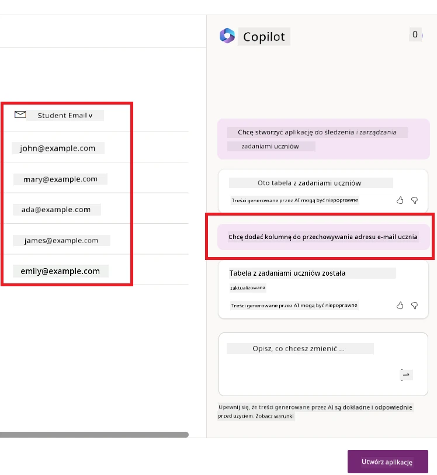

1. AI Copilot wygeneruje nowe pole i potem możesz dostosować pole do swoich potrzeb.

1. Po zakończeniu pracy z tabelą kliknij przycisk **Utwórz aplikację**, aby stworzyć aplikację.

1. AI Copilot wygeneruje responsywną aplikację Canvas na podstawie Twojego opisu. Następnie możesz dostosować aplikację do swoich potrzeb.

1. Aby nauczyciele mogli wysyłać e-maile do uczniów, możesz użyć Copilota, by dodać nowy ekran do aplikacji. Na przykład możesz użyć następującego polecenia, aby dodać nowy ekran do aplikacji: **_Chcę dodać ekran do wysyłania e-maili do uczniów_**. Kliknij przycisk **Wyślij**, aby przesłać polecenie do AI Copilota.

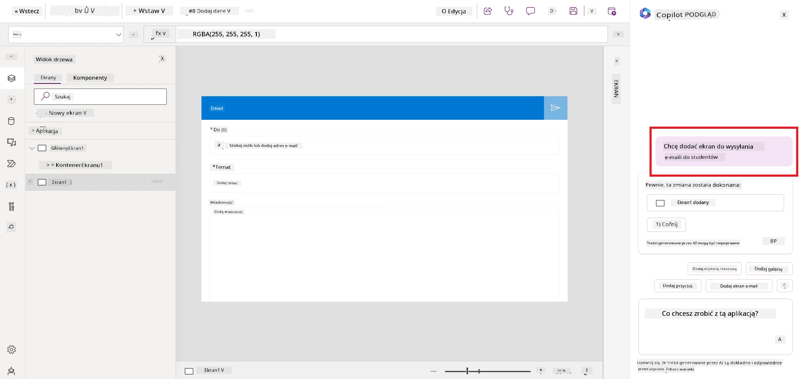

1. AI Copilot wygeneruje nowy ekran, a następnie możesz go dostosować do swoich potrzeb.

1. Po zakończeniu pracy z aplikacją kliknij przycisk **Zapisz**, aby zapisać aplikację.

1. Aby udostępnić aplikację nauczycielom, kliknij przycisk **Udostępnij**, a następnie ponownie kliknij przycisk **Udostępnij**. Możesz udostępnić aplikację, wpisując adresy e-mail nauczycieli.

> **Twoje zadanie domowe**: Aplikacja, którą właśnie stworzyłeś, to dobry początek, ale można ją ulepszyć. Dzięki funkcji e-mail nauczyciele mogą wysyłać e-maile do uczniów tylko ręcznie, wpisując ich adresy e-mail. Czy możesz użyć Copilota, aby zbudować automatyzację, która pozwoli nauczycielom automatycznie wysyłać e-maile do uczniów po przesłaniu przez nich zadań? Podpowiedź: z odpowiednim poleceniem możesz użyć Copilota w Power Automate, aby to zbudować.

### Stwórz tabelę informacji o fakturach dla naszego startupu

Zespół finansowy naszego startupu miał problemy z śledzeniem faktur. Korzystali z arkusza kalkulacyjnego do śledzenia faktur, ale wraz ze wzrostem ich liczby stało się to trudne do zarządzania. Poprosili Cię o stworzenie tabeli, która pomoże im przechowywać, śledzić i zarządzać informacjami o otrzymanych fakturach. Tabela powinna służyć do budowania automatyzacji, która wydobędzie wszystkie informacje o fakturach i zapisze je w tabeli. Tabela powinna również umożliwiać zespołowi finansowemu przeglądanie faktur opłaconych oraz tych nieopłaconych.

Power Platform posiada platformę danych o nazwie Dataverse, która umożliwia przechowywanie danych na potrzeby Twoich aplikacji i rozwiązań. Dataverse oferuje platformę danych low-code do przechowywania danych aplikacji. Jest to w pełni zarządzana usługa bezpiecznie przechowująca dane w chmurze Microsoft i jest konfigurowana w Twoim środowisku Power Platform. Posiada wbudowane funkcje zarządzania danymi, takie jak klasyfikacja danych, pochodzenie danych, kontrola dostępu o szczegółowym zrządzaniu i inne. Możesz dowiedzieć się więcej [o Dataverse tutaj](https://docs.microsoft.com/powerapps/maker/data-platform/data-platform-intro?WT.mc_id=academic-109639-somelezediko).

Dlaczego powinniśmy używać Dataverse w naszym startupie? Standardowe i niestandardowe tabele w Dataverse oferują bezpieczną, opartą na chmurze opcję przechowywania danych. Tabele pozwalają przechowywać różne typy danych, podobnie jak w przypadku kilku arkuszy w jednym skoroszycie Excel. Możesz używać tabel do przechowywania danych specyficznych dla Twojej organizacji lub potrzeb biznesowych. Niektóre korzyści, jakie nasz startup uzyska dzięki Dataverse, to między innymi:

- **Łatwe zarządzanie**: Zarówno metadane, jak i dane są przechowywane w chmurze, więc nie musisz martwić się szczegółami dotyczącymi ich przechowywania i zarządzania. Możesz skupić się na tworzeniu aplikacji i rozwiązań.

- **Bezpieczeństwo**: Dataverse zapewnia bezpieczną i opartą na chmurze metodę przechowywania danych. Możesz kontrolować, kto ma dostęp do danych w tabelach i w jaki sposób, stosując zabezpieczenia oparte na rolach.

- **Bogate metadane**: Typy danych i relacje są wykorzystywane bezpośrednio w Power Apps.

- **Logika i walidacja**: Możesz używać reguł biznesowych, pól kalkulowanych i reguł walidacji, by wymuszać logikę biznesową i utrzymywać dokładność danych.

Teraz, gdy wiesz, czym jest Dataverse i dlaczego warto go używać, zobaczmy, jak możesz użyć Copilota, aby stworzyć tabelę w Dataverse spełniającą wymagania zespołu finansowego.

> **Uwaga** : Ta tabela będzie używana w następnej sekcji do budowy automatyzacji, która wydobędzie wszystkie informacje o fakturach i zapisze je w tabeli.

Aby utworzyć tabelę w Dataverse za pomocą Copilota, wykonaj poniższe kroki:

1. Przejdź do [Power Apps](https://make.powerapps.com?WT.mc_id=academic-105485-koreyst).

2. Na pasku nawigacji po lewej stronie wybierz **Tabele**, a następnie kliknij **Opisz nową tabelę**.

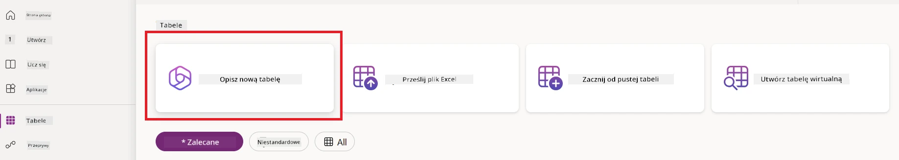

1. Na ekranie **Opisz nową tabelę** użyj obszaru tekstowego, aby opisać tabelę, którą chcesz utworzyć. Na przykład, **_Chcę utworzyć tabelę do przechowywania informacji o fakturach_**. Kliknij przycisk **Wyślij**, aby przesłać polecenie do AI Copilota.

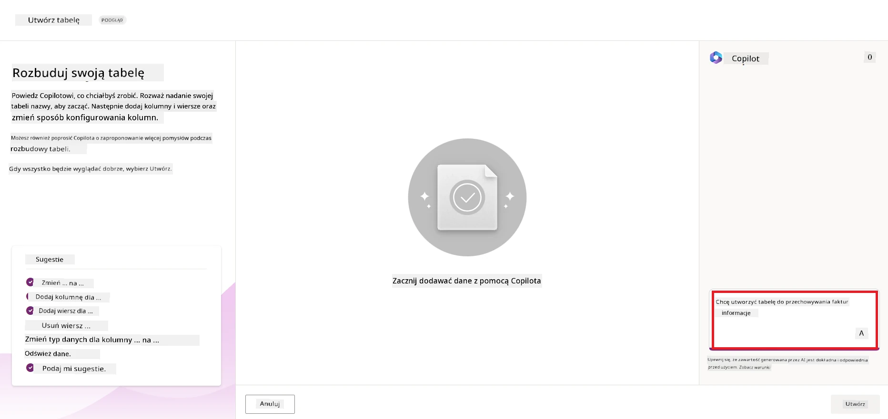

1. AI Copilot zasugeruje tabelę Dataverse z polami potrzebnymi do przechowywania danych, które chcesz śledzić, oraz przykładowe dane. Możesz następnie dostosować tabelę według potrzeb, używając funkcji asystenta AI Copilota, prowadzącej rozmowę krok po kroku.

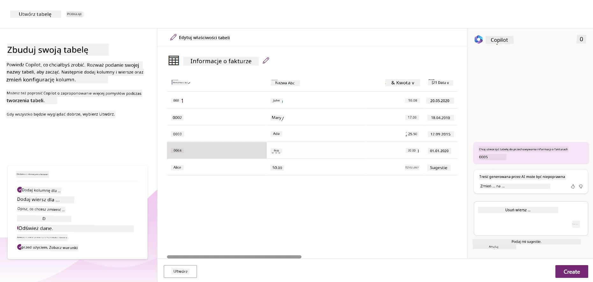

1. Zespół finansowy chce wysłać e-mail do dostawcy, aby poinformować go o aktualnym statusie faktury. Możesz użyć Copilota, aby dodać nowe pole w tabeli do przechowywania adresu e-mail dostawcy. Na przykład możesz użyć polecenia: **_Chcę dodać kolumnę do przechowywania e-maila dostawcy_**. Kliknij przycisk **Wyślij**, aby przesłać polecenie do AI Copilota.

1. AI Copilot wygeneruje nowe pole, które następnie możesz dostosować do swoich potrzeb.

1. Po zakończeniu pracy z tabelą kliknij przycisk **Utwórz**, aby utworzyć tabelę.

## Modele AI w Power Platform z AI Builder

AI Builder to niskokodowa funkcja AI dostępna w Power Platform, która umożliwia użycie modeli AI do automatyzacji procesów i przewidywania wyników. Dzięki AI Builder możesz wprowadzić sztuczną inteligencję do swoich aplikacji i przepływów, które łączą się z danymi w Dataverse lub w różnych źródłach danych w chmurze, takich jak SharePoint, OneDrive czy Azure.

## Gotowe modele AI vs modele AI na zamówienie

AI Builder oferuje dwa typy modeli AI: gotowe modele AI oraz modele AI tworzone na zamówienie. Gotowe modele AI to modele gotowe do użycia, wytrenowane przez Microsoft i dostępne w Power Platform. Pomagają one dodać inteligencję do Twoich aplikacji i przepływów bez konieczności gromadzenia danych i samodzielnego budowania, trenowania i publikowania modeli. Możesz używać tych modeli do automatyzacji procesów i przewidywania wyników.

Niektóre z dostępnych gotowych modeli AI w Power Platform to:

- **Wydobywanie kluczowych fraz**: Ten model wydobywa kluczowe frazy z tekstu.
- **Wykrywanie języka**: Ten model wykrywa język tekstu.
- **Analiza sentymentu**: Ten model wykrywa pozytywny, negatywny, neutralny lub mieszany sentyment w tekście.
- **Skaner wizytówek**: Ten model wydobywa informacje z wizytówek.
- **Rozpoznawanie tekstu**: Ten model wydobywa tekst z obrazów.
- **Wykrywanie obiektów**: Ten model wykrywa i wydobywa obiekty z obrazów.
- **Przetwarzanie dokumentów**: Ten model wydobywa informacje z formularzy.
- **Przetwarzanie faktur**: Ten model wydobywa informacje z faktur.

W przypadku modeli AI na zamówienie możesz wprowadzić swój własny model do AI Builder, aby działał jak każdy inny model niestandardowy, umożliwiając trenowanie modelu przy użyciu własnych danych. Możesz użyć tych modeli do automatyzacji procesów i przewidywania wyników zarówno w Power Apps, jak i Power Automate. Przy korzystaniu z własnych modeli występują ograniczenia. Przeczytaj więcej o tych [ograniczeniach](https://learn.microsoft.com/ai-builder/byo-model#limitations?WT.mc_id=academic-105485-koreyst).

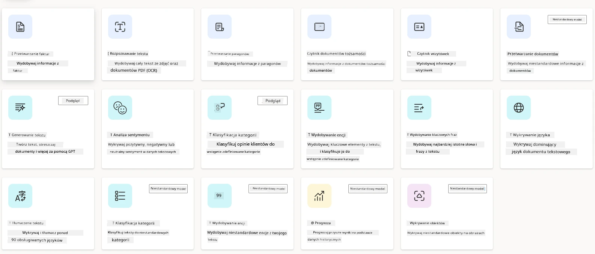

## Zadanie #2 - Utwórz przepływ przetwarzania faktur dla naszego startupu

Zespół finansowy miał problemy z przetwarzaniem faktur. Używali arkusza kalkulacyjnego do śledzenia faktur, ale wraz ze wzrostem ich liczby stało się to trudne do zarządzania. Poprosili Cię o zbudowanie workflow, który pomoże im przetwarzać faktury za pomocą AI. Workflow powinien umożliwiać wydobycie informacji z faktur i zapisanie ich w tabeli Dataverse. Workflow powinien również umożliwiać wysłanie e-maila do zespołu finansowego z wydobytymi informacjami.

Teraz, gdy wiesz, czym jest AI Builder i dlaczego warto go używać, zobaczmy, jak możesz użyć modelu AI Przetwarzanie faktur, omawianego wcześniej, aby zbudować workflow, który pomoże zespołowi finansowemu przetwarzać faktury.

Aby zbudować workflow, który pomoże zespołowi finansowemu przetwarzać faktury za pomocą modelu AI Przetwarzanie faktur w AI Builder, wykonaj poniższe kroki:

1. Przejdź do [Power Automate](https://make.powerautomate.com?WT.mc_id=academic-105485-koreyst).

2. Użyj pola tekstowego na ekranie startowym, aby opisać workflow, który chcesz zbudować. Na przykład, **_Przetwarzaj fakturę, gdy nadejdzie do mojej skrzynki odbiorczej_**. Kliknij przycisk **Wyślij**, aby przesłać polecenie do AI Copilota.

   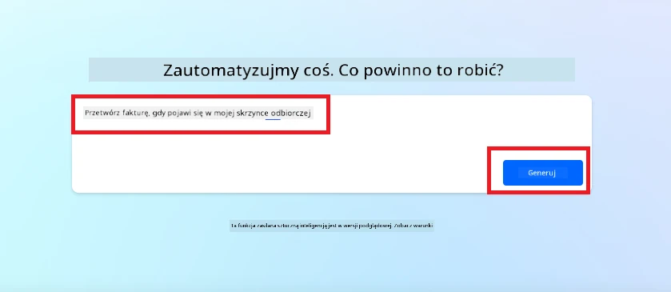

3. AI Copilot zasugeruje działania potrzebne do wykonania automatyzowanego zadania. Możesz kliknąć przycisk **Dalej**, aby przejść do następnych kroków.

4. W kolejnym kroku Power Automate poprosi Cię o skonfigurowanie wymaganych połączeń do workflow. Po zakończeniu kliknij przycisk **Utwórz przepływ**, aby go utworzyć.

5. AI Copilot wygeneruje przepływ, który następnie możesz dostosować do swoich potrzeb.

6. Zaktualizuj wyzwalacz przepływu i ustaw **Folder** na folder, w którym będą przechowywane faktury. Na przykład możesz ustawić folder na **Skrzynka odbiorcza**. Kliknij **Pokaż opcje zaawansowane** i ustaw **Tylko z załącznikami** na **Tak**. To zapewni, że przepływ będzie działał tylko, gdy e-mail z załącznikiem zostanie odebrany w tym folderze.

7. Usuń z przepływu następujące akcje: **HTML na tekst**, **Kompiluj**, **Kompiluj 2**, **Kompiluj 3** i **Kompiluj 4**, ponieważ nie będą używane.

8. Usuń akcję **Warunek** z przepływu, ponieważ nie będzie używana. Powinno to wyglądać jak na poniższym zrzucie ekranu:

   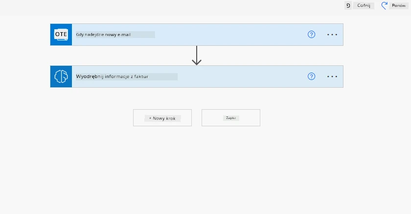

9. Kliknij przycisk **Dodaj akcję** i wyszukaj **Dataverse**. Wybierz akcję **Dodaj nowy wiersz**.

10. W akcji **Wydobądź informacje z faktur** zaktualizuj pole **Plik faktury**, aby wskazywało na **Zawartość załącznika** z e-maila. To zapewni, że przepływ wydobędzie informacje z załącznika faktury.

11. Wybierz tabelę, którą utworzyłeś wcześniej – na przykład tabelę **Informacje o fakturze**. Wybierz zawartość dynamiczną z poprzedniej akcji, aby wypełnić następujące pola:

    - ID
    - Kwota
    - Data
    - Nazwa
    - Status – Ustaw **Status** na **Oczekujący**.
    - E-mail dostawcy – użyj zawartości dynamicznej **Od** z wyzwalacza **Gdy nadejdzie nowy e-mail**.

    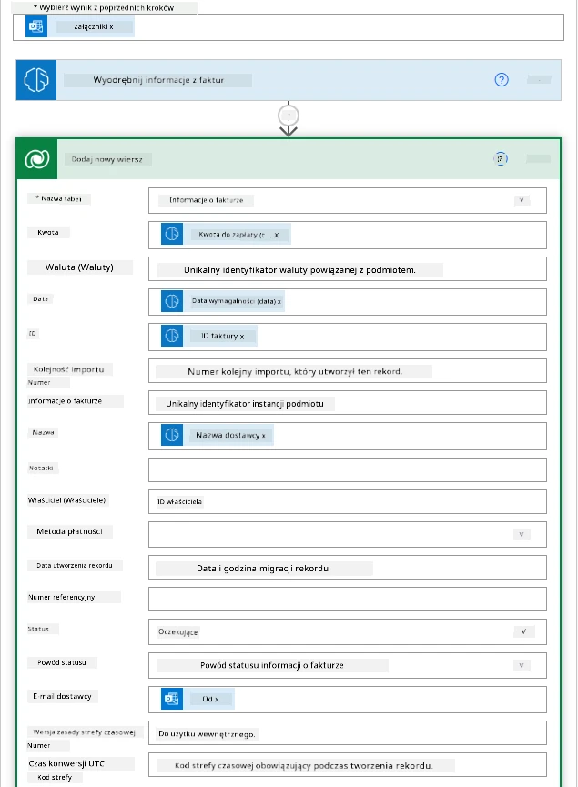

12. Po zakończeniu pracy z przepływem kliknij przycisk **Zapisz**, aby zapisać przepływ. Następnie możesz przetestować przepływ, wysyłając e-mail z fakturą do folderu, który określiłeś w wyzwalaczu.

> **Twoje zadanie domowe**: Przepływ, który właśnie stworzyłeś, to dobry początek, teraz musisz pomyśleć, jak zbudować automatyzację, która pozwoli naszemu zespołowi finansowemu wysyłać e-maile do dostawców, aby informować ich o aktualnym statusie faktur. Podpowiedź: przepływ musi działać, gdy status faktury się zmieni.

## Użyj modelu AI generującego tekst w Power Automate

Model AI Create Text with GPT w AI Builder umożliwia generowanie tekstu na podstawie polecenia i jest wspierany przez Microsoft Azure OpenAI Service. Dzięki tej funkcji możesz wprowadzić technologię GPT (Generative Pre-Trained Transformer) do swoich aplikacji i przepływów, aby tworzyć różnorodne zautomatyzowane przepływy i inteligentne aplikacje.

Modele GPT są intensywnie trenowane na ogromnych zbiorach danych, co umożliwia im tworzenie tekstów przypominających język ludzki po otrzymaniu polecenia. W połączeniu z automatyzacją workflow modele AI takie jak GPT mogą być wykorzystywane do usprawniania i automatyzacji szerokiego zakresu zadań.

Na przykład możesz tworzyć przepływy do automatycznego generowania tekstów do różnych zastosowań, takich jak: szkice e-maili, opisy produktów i inne. Możesz również używać modelu do generowania tekstu w różnych aplikacjach, takich jak chatboty i aplikacje obsługi klienta, które pozwalają agentom efektywnie i skutecznie odpowiadać na pytania klientów.

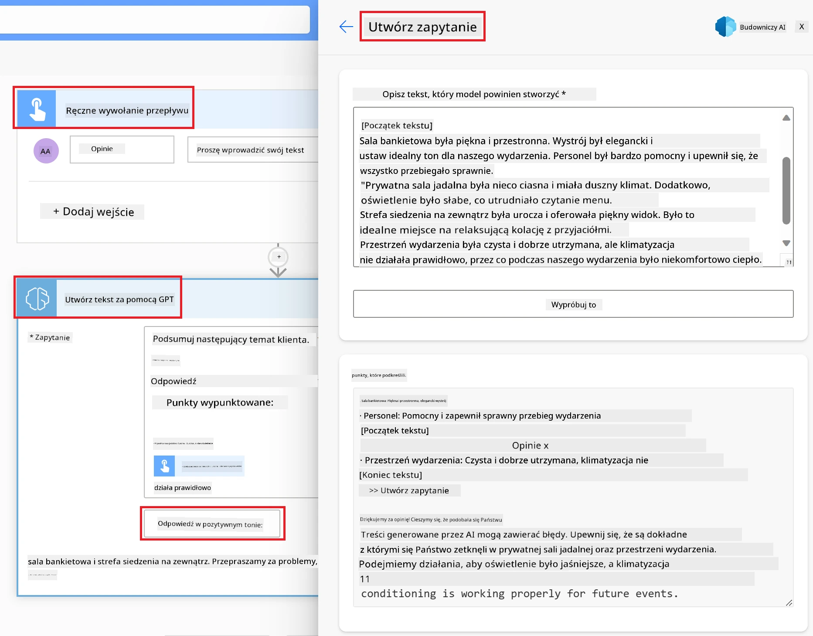

Aby nauczyć się, jak korzystać z tego modelu AI w Power Automate, przejdź przez moduł [Dodaj inteligencję dzięki AI Builder i GPT](https://learn.microsoft.com/training/modules/ai-builder-text-generation/?WT.mc_id=academic-109639-somelezediko).

## Świetna robota! Kontynuuj naukę

Po ukończeniu tej lekcji sprawdź naszą [kolekcję nauki o Generative AI](https://aka.ms/genai-collection?WT.mc_id=academic-105485-koreyst), aby dalej rozwijać swoją wiedzę o Generative AI!

Chcesz dostosować i wycisnąć więcej z Copilot? Poznaj [Awesome Copilot](https://github.com/github/awesome-copilot?WT.mc_id=academic-105485-koreyst) — zbiór instrukcji, agentów, umiejętności i konfiguracji stworzony przez społeczność, który pomoże Ci w pełni wykorzystać GitHub Copilot.

Przejdź do Lekcji 11, gdzie przyjrzymy się, jak [integrować Generative AI z wywoływaniem funkcji](../11-integrating-with-function-calling/README.md?WT.mc_id=academic-105485-koreyst)!

---

<!-- CO-OP TRANSLATOR DISCLAIMER START -->
**Zastrzeżenie**:
Niniejszy dokument został przetłumaczony za pomocą usługi tłumaczenia AI [Co-op Translator](https://github.com/Azure/co-op-translator). Choć dążymy do dokładności, prosimy pamiętać, że automatyczne tłumaczenia mogą zawierać błędy lub niedokładności. Oryginalny dokument w jego języku źródłowym należy uznawać za autorytatywne źródło. W przypadku informacji krytycznych zalecane jest skorzystanie z profesjonalnego tłumaczenia wykonanego przez człowieka. Nie ponosimy odpowiedzialności za jakiekolwiek nieporozumienia lub błędne interpretacje wynikające z użycia tego tłumaczenia.
<!-- CO-OP TRANSLATOR DISCLAIMER END -->